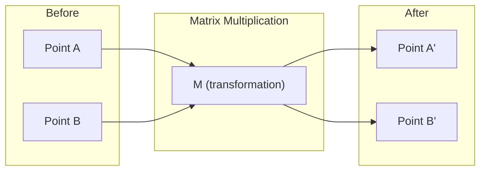
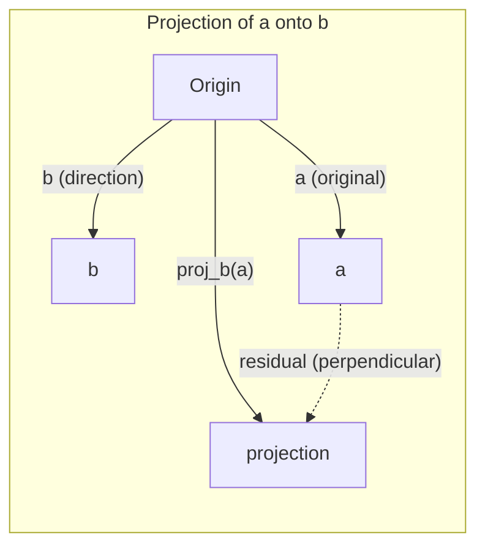
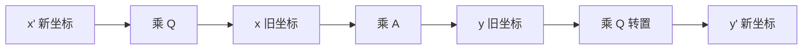
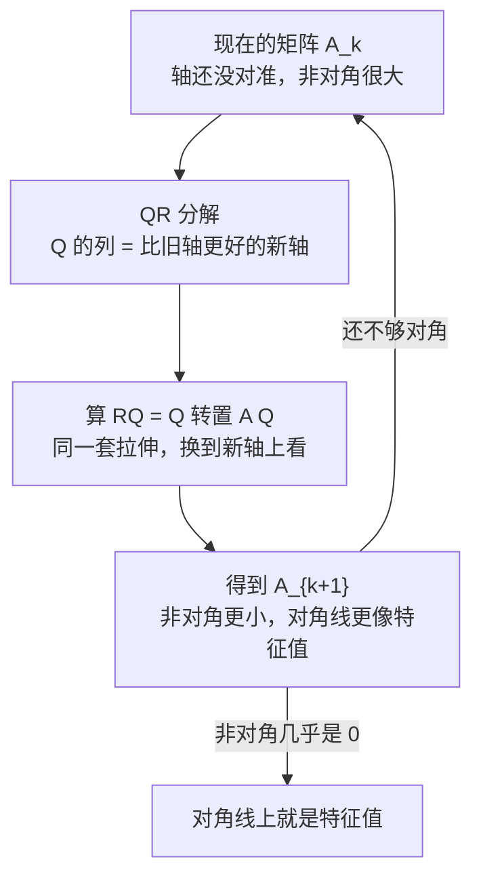

# Linear Algebra Intuition

> Every AI model is just matrix math wearing a fancy hat.

**Type:** Learn
**Languages:** Python, Julia
**Prerequisites:** Phase 0
**Time:** ~60 minutes

## Learning Objectives

- Implement vector and matrix operations (addition, dot product, matrix multiply) from scratch in Python
- Explain geometrically what the dot product, projection, and Gram-Schmidt process do
- Determine linear independence, rank, and basis of a set of vectors using row reduction
- Connect linear algebra concepts to their AI applications: embeddings, attention scores, and LoRA

## The Problem

Open any ML paper. Within the first page, you'll see vectors, matrices, dot products, and transformations. Without linear algebra intuition, these are just symbols. With it, you can see what a neural network is actually doing -- moving points around in space.

You don't need to be a mathematician. You need to see what these operations mean geometrically, then code them yourself.

## The Concept

### Vectors Are Points (and Directions)

A vector is just a list of numbers. But those numbers mean something -- they're coordinates in space.

**2D vector [3, 2]:**

| x | y | Point |
|---|---|-------|
| 3 | 2 | The vector points from origin (0,0) to (3, 2) on the plane |

The vector has magnitude sqrt(3^2 + 2^2) = sqrt(13) and points up and to the right.

In AI, vectors represent everything:
- A word → a vector of 768 numbers (its "meaning" in embedding space)
- An image → a vector of millions of pixel values
- A user → a vector of preferences

### Matrices Are Transformations

A matrix transforms one vector into another. It can rotate, scale, stretch, or project.



In AI, matrices ARE the model:
- Neural network weights → matrices that transform input into output
- Attention scores → matrices that decide what to focus on
- Embeddings → matrices that map words to vectors

### The Dot Product Measures Similarity

The dot product of two vectors tells you how similar they are.

```text
a · b = a₁×b₁ + a₂×b₂ + ... + aₙ×bₙ

Same direction:      a · b > 0  (similar)
Perpendicular:       a · b = 0  (unrelated)
Opposite direction:  a · b < 0  (dissimilar)
```

This is literally how search engines, recommendation systems, and RAG work -- find vectors with high dot products.

### Linear Independence

Vectors are linearly independent if no vector in the set can be written as a combination of the others. If v1, v2, v3 are independent, they span a 3D space. If one is a combination of the others, they only span a plane.

Why it matters for AI: your feature matrix should have linearly independent columns. If two features are perfectly correlated (linearly dependent), the model cannot distinguish their effects. This causes multicollinearity in regression -- the weight matrix becomes unstable, and small input changes produce wild output swings.

**Concrete example:**

```text
v1 = [1, 0, 0]
v2 = [0, 1, 0]
v3 = [2, 1, 0]   # v3 = 2*v1 + v2
```

v1 and v2 are independent -- neither is a scalar multiple or combination of the other. But v3 = 2*v1 + v2, so {v1, v2, v3} is a dependent set. These three vectors all lie in the xy-plane. No matter how you combine them, you cannot reach [0, 0, 1]. You have three vectors but only two dimensions of freedom.

In a dataset: if feature_3 = 2*feature_1 + feature_2, adding feature_3 gives the model zero new information. Worse, it makes the normal equations singular -- there is no unique solution for the weights.

### Basis and Rank

A basis is a minimal set of linearly independent vectors that span the entire space. The number of basis vectors is the dimension of the space.

The standard basis for 3D space is {[1,0,0], [0,1,0], [0,0,1]}. But any three independent vectors in 3D form a valid basis. The choice of basis is a choice of coordinate system.

Rank of a matrix = number of linearly independent columns = number of linearly independent rows. If rank < min(rows, cols), the matrix is rank-deficient. This means:
- The system has infinitely many solutions (or none)
- Information is lost in the transformation
- The matrix cannot be inverted

| Situation | Rank | What it means for ML |
|-----------|------|---------------------|
| Full rank (rank = min(m, n)) | Maximum possible | Unique least-squares solution exists. Model is well-conditioned. |
| Rank deficient (rank < min(m, n)) | Below maximum | Features are redundant. Infinitely many weight solutions. Regularization needed. |
| Rank 1 | 1 | Every column is a scaled copy of one vector. All data lies on a line. |
| Near rank-deficient (small singular values) | Numerically low | Matrix is ill-conditioned. Tiny input noise causes large output changes. Use SVD truncation or ridge regression. |

### Projection

Projecting vector **a** onto vector **b** gives the component of **a** in the direction of **b**:

```text
proj_b(a) = (a dot b / b dot b) * b
```

The residual (a - proj_b(a)) is perpendicular to b. This orthogonal decomposition is the foundation of least-squares fitting.

Projection is everywhere in ML:
- Linear regression minimizes the distance from observations to the column space -- the solution IS a projection
- PCA projects data onto the directions of maximum variance
- Attention in transformers computes projections of queries onto keys



**Example:** a = [3, 4], b = [1, 0]

proj_b(a) = (3*1 + 4*0) / (1*1 + 0*0) * [1, 0] = 3 * [1, 0] = [3, 0]

The projection drops the y-component. This is dimensionality reduction in its simplest form -- throw away the directions you don't care about.

#### 问题 1：向量投影的几何意义

> 解释一下

这张图讲的是向量投影。我先对照你正在看的课，用公式和几何意义把这页讲清楚。

这页讲的是一件事：**把向量 a 拆成“沿着 b 的部分”和“垂直于 b 的部分”。**

##### 几何上在干什么

想象地面上有一条直线，方向就是向量 **b**。向量 **a** 是从原点斜着指出去的一根箭。

**投影**就是：从 **a** 的箭头端点往这条直线上“垂直落下一根垂线”，落点对应的那一段，就是 `proj_b(a)`。

于是：

- **平行分量**：`proj_b(a)` —— a 在 b 方向上“贡献了多少”
- **残差**：`a - proj_b(a)` —— 那根垂线，和 b 垂直

“垂直”不是口头说法：残差和 **b** 的点积一定是 0。

##### 公式在算什么

```text
proj_b(a) = (a · b) / (b · b) b
```

拆开看：

1. **`a · b`**：a 和 b 有多“同向”。夹角越小、两者越长，点积越大。
2. **除以 `b · b`**：把这个量换成“沿着 b 走了几个 b”。`b · b = ‖b‖²`，所以这就是标量系数  
   `(a · b) / ‖b‖²`。
3. **再乘回 `b`**：把这个标量变回向量，方向仍是 b。

如果先把 b 单位化成 `b̂ = b / ‖b‖`，公式更直观：

```text
proj_b(a) = (a · b̂) b̂
```

`a · ĥ` 就是 a 在单位方向上的长度。

##### 一个二维数字例子

课里用的就是：`a = [3, 4]`，`b = [1, 0]`（x 轴）。

```text
proj_b(a)
= (3 · 1 + 4 · 0) / (1 · 1 + 0 · 0) [1, 0]
= 3 [1, 0]
= [3, 0]
```

残差是 `[3, 4] - [3, 0] = [0, 4]`，和 `[1, 0]` 点积为 0，确实垂直。

直观理解：投影把 y 分量扔掉了。这就是最简单的**降维**——丢掉你暂时不关心的方向。

##### 为什么说这是最小二乘的基础

最小二乘要找一条线（更一般：一个子空间），让观测点和它的距离最短。

“最短距离”在几何上就是**垂直距离**。所以最优拟合点，正好是观测向量到那个子空间上的投影。线性回归的解不是碰巧像投影，它**就是**投影。

##### 三个 ML 例子，其实是同一招

1. **线性回归**：把标签向量 y 投影到特征矩阵的列空间上，得到 `ŷ = Xŵ`。残差 `y - ŷ` 和每一列特征都垂直。
2. **PCA**：把数据投影到方差最大的几个方向上。丢掉的是“信息少”的方向，和上面丢掉 y 分量是同一类操作。
3. **Attention**：query 和 key 做点积，本质是在问“这个 query 在各个 key 方向上有多少分量”，再据此加权。注意力分数就是投影思想的缩放版。

一句话：**投影 = 只保留某个方向上的信息，并把垂直部分当成误差丢掉。** 机器学习里大量“拟合 / 压缩 / 对齐”都在反复做这件事。

#### 问题 2：投影公式如何推导

> 这个公式是怎么推导出来的？

核心只有一步：**投影后的残差必须和 b 垂直**。用这个条件把未知系数解出来，公式就出现了。

##### 1. 先把未知量写出来

投影必须和 **b** 同向，所以它只能是 **b** 的倍数：

```text
proj_b(a) = k b
```

`k` 是一个未知标量，表示“沿着 b 走了几个 b”。要求的就是这个 `k`。

残差（没投影上去的那一段）是：

```text
r = a - k b
```

##### 2. 正交条件

“最短距离 / 垂直落下”用数学写就是：残差和 b 垂直，点积为 0：

```text
(a - k b) · b = 0
```

点积对加法、数乘都线性，可以展开：

```text
a · b - k (b · b) = 0
```

##### 3. 解出 k

```text
k = (a · b) / (b · b)
```

代回第一步：

```text
proj_b(a) = (a · b) / (b · b) b
```

这就是幻灯片上的公式。分母 `b · b = ‖b‖²`，所以也可以写成 `(a · b) / ‖b‖² b`。

##### 4. 用数字验一遍

还是 `a = [3, 4]`，`b = [1, 0]`。

```text
k = (3 · 1 + 4 · 0) / (1 · 1 + 0 · 0) = 3
```

投影是 `3 · [1, 0] = [3, 0]`。残差 `[0, 4]` 和 `[1, 0]` 点积为 0，正交条件成立。

##### 5. 为什么必须垂直？

如果不垂直，残差在 b 方向上还有一段。把那段再投影上去，残差会更短。所以**不垂直就不是最短距离**，也就不是投影。

线性回归里“残差垂直于特征列空间”，就是把这里的 `b` 换成矩阵 `X` 的列，同一条推导会给出正规方程 `Xᵀ X ŵ = Xᵀ y`。

#### 问题 12：投影公式末尾的 `b` 为什么不能约掉？

> 在 `proj_b(a)=((a · b) / (b · b)) b` 中，等式右边最后乘的 `b` 为什么不能被消掉？

消不掉，因为分母里的 `b` 和最后乘的 `b` **不是同一种东西**：一个困在点积里（结果是标量），一个是向量。

##### 先看类型

```text
proj_b(a) = ((a · b) / (b · b)) b
            (标量 k)              (向量)
```

- `a · b`：两个向量点积 → **一个数**
- `b · b=‖b‖²`：同样是 **一个数**
- 最后的 `b`：还是原来那个 **向量**

分数已经除完了，得到标量 `k`。再乘 `b`，只是“沿着 `b` 的方向走 `k` 步”。分子分母里没有一个孤立的向量 `b` 可以和右边那个 `b` 约掉。

如果硬约掉右边的 `b`，只剩下 `k`，投影就变成一个数，不再是向量。投影必须和 `b` 同向，这个方向就是靠最后乘 `b` 给出来的。

##### 点积不能当乘法约分

`b · b` 不是 `b × b`。它是

```text
b · b = b₁² + b₂² + …
```

例如 `b=[1,0]`，`b · b=1`，并不是向量 `[1,0]`。  
你不能写 `(… / (b · b)) b = … / b`，因为“向量除以向量”没有这样定义，而分母其实是标量 `‖b‖²`。

##### 约掉会得到错的结果

若真把一个 `b` 约掉，最容易写成

```text
(a · b) / b
```

左边是向量，右边类型都不合法。就算理解成 `(a · b) / ‖b‖`，那只是“`a` 在 `b` 方向上的有符号长度”，还不是投影向量。

投影向量必须是

```text
k b = ((a · b) / ‖b‖²) b
```

缺了最后这个 `b`，就只剩下长度，没有方向。

##### 用数字看

`a=[3,4]`，`b=[1,0]`：

```text
((a · b) / (b · b)) b = (3 / 1) [1, 0] = [3, 0]
```

若把 `b` 约掉，只会留下 `3`，不是 `[3,0]`。  
`a` 本身是 `[3,4]`，投影更不是把 `b` 消掉变成 `a`。

一句话：**`(a · b) / (b · b)` 已经是数；后面的 `b` 负责把这个数变回 `b` 方向上的向量，不能和点积里的 `b` 约分。**

#### 问题 6：残差正交如何导出正规方程

> 线性回归里“残差垂直于特征列空间”，就是把这里的 `b` 换成矩阵 `X` 的列，同一条推导会给出正规方程 `Xᵀ Xŵ = Xᵀ y`。解释一下

一列特征时，正交条件给出投影公式；多列特征时，同一条正交条件给出正规方程。线性回归只是把“投影到一根向量 b 上”换成“投影到 X 的所有列张成的平面上”。

##### 一根向量：你已经见过的推导

要把 `y` 投影到单个向量 `b` 上，拟合值是 `k b`，残差必须和 `b` 垂直：

```text
(y - k b) · b = 0
⇒ (b · b) k = b · y
```

这就是投影公式里的 `k = (y · b) / (b · b)`。

##### 多根向量：列空间

线性回归写的是

```text
ŷ = Xŵ = w₁ x₁ + w₂ x₂ + … + wₚ xₚ
```

`x₁, …, xₚ` 是 **X 的列**（每个特征在所有样本上的取值）。所有形如 `Xw` 的向量构成 **X 的列空间**：一个过原点的平面（或更高维子空间）。

`ŷ` 必须落在这个平面上。最短距离仍然是垂直落下，所以残差

```text
r = y - Xŵ
```

必须垂直于这个平面里的**每一个**方向。平面由 X 的列张成，所以只要垂直于每一列：

```text
x₁ · r = 0,
x₂ · r = 0,
…,
xₚ · r = 0
```

把这 `p` 个点积叠成矩阵，就是左乘 `Xᵀ`：

```text
Xᵀ r = 0
```

`Xᵀ r` 的第 `j` 个分量正好是 `xⱼ · r`。

##### 代入残差，正规方程出现

```text
Xᵀ (y - Xŵ) = 0
```

```text
Xᵀ y - Xᵀ X ŵ = 0
```

```text
Xᵀ X ŵ = Xᵀ y
```

左边 `Xᵀ X` 是“特征列两两之间的点积矩阵”（Gram 矩阵）。右边 `Xᵀ y` 是“每个特征列和 `y` 的点积”。和单向量时的 `(b · b) k = b · y` 是同一句话，只是 `b` 从一根变成了好几根。

##### 对照：一列时正规方程退回投影公式

若 X 只有一列 `b`，`ŵ` 是标量 `k`：

```text
Xᵀ X ŵ = Xᵀ y
⇒ (b · b) k = b · y
⇒ k = (y · b) / (b · b)
```

`ŷ = k b`，就是 `proj_b(y)`。所以课里说：把 `b` 换成 X 的列，同一条推导给出正规方程。

##### 几何上在干什么

- `y`：真实标签，在 `ℝⁿ` 里（n 个样本）
- `Xŵ`：模型能表示的预测，被困在列空间这个平面上
- `y - Xŵ`：平面外垂下来的那一段

最小二乘不是另找一个代数技巧，它就是：**在特征列张成的平面上，找离 y 最近的点**。最近 `⇔` 残差垂直于平面 `⇔` `Xᵀ(y-Xŵ)=0`。

#### 问题 7：为什么 Xᵀ 在 y 左边而 b 写在右边

> `Xᵀ Xŵ = Xᵀ y ⇒ (b · b)k = b · y ⇒ k = (y · b) / (b · b)`。为什么 `Xᵀ` 在 y 的左边，b 在 y 的右边？

位置不一样，只是**两种记法**，不是两个不同的运算。点积可交换，所以 `b · y` 和 `y · b` 是同一个数。

##### 列向量约定下，点积其实也是“左乘”

把向量都写成列。点积的矩阵写法是：

```text
b · y = bᵀ y
```

`bᵀ` 是一行，乘在 `y` 的**左边**。单列时 `X = b`，于是

```text
Xᵀ y = bᵀ y = b · y
```

**`Xᵀ` 在 `y` 左边，对应的就是 `bᵀ` 在 `y` 左边**，并不是突然换了边。

##### 为什么分数里又写成 `y · b`

点积满足

```text
b · y = y · b
```

所以

```text
k = (b · y) / (b · b) = (y · b) / (b · b)
```

投影公式习惯写成 `(a · b) / (b · b)`，把被投影的向量写在点积前面，于是出现 `y · b`。数值完全一样，只是把两个因子对调了。

##### 矩阵为什么不能随便对调左右

矩阵乘法**不能**交换。`X` 是 `n × p`，`y` 是 `n × 1`：

| 写法 | 形状 | 含义 |
|------|------|------|
| `Xᵀ y` | `(p × n)(n × 1) = p × 1` | 每个特征列和 `y` 的点积，叠成一列 |
| `yᵀ X` | `(1 × n)(n × p) = 1 × p` | 同一组点积，叠成一行 |
| `y Xᵀ` | 形状对不上（或不是我们要的） | 不能这么写 |

多列时 `Xᵀ y` 是向量，必须把 `Xᵀ` 放左边才能得到 `p × 1`。只有一列时结果是标量，`bᵀ y` 和 `yᵀ b` 相等，看起来才可以左右对调。

一句话：**正规方程里的 `Xᵀ y` 就是“每一列和 `y` 做点积”；写成 `b · y` 或 `y · b` 只是标量点积的两种写法，没有换运算。**

### Gram-Schmidt Process

Converting any set of independent vectors into an orthonormal basis. Orthonormal means every vector has length 1 and every pair is perpendicular.

The algorithm:
1. Take the first vector, normalize it
2. Take the second vector, subtract its projection onto the first, normalize
3. Take the third vector, subtract its projections onto all previous vectors, normalize
4. Repeat for remaining vectors

```text
Input:  v1, v2, v3, ... (linearly independent)

u1 = v1 / |v1|

w2 = v2 - (v2 dot u1) * u1
u2 = w2 / |w2|

w3 = v3 - (v3 dot u1) * u1 - (v3 dot u2) * u2
u3 = w3 / |w3|

Output: u1, u2, u3, ... (orthonormal basis)
```

#### 问题 3：Gram-Schmidt 中为何省略投影分母

> w3 的计算为什么没有使用 `proj_b(a) = (a · b) / (b · b) b` 这个公式呢？

用了投影公式，只是因为 **u1、u2 已经是单位向量，分母被约掉了**。

完整公式是：

```text
proj_b(a) = (a · b) / (b · b) b
```

Gram-Schmidt 里每次投影的对象不是原始的 `vᵢ`，而是已经单位化的 `uᵢ`。单位向量满足

```text
uᵢ · uᵢ = ‖uᵢ‖² = 1
```

所以

```text
proj_uᵢ(v) = (v · uᵢ) / (uᵢ · uᵢ) uᵢ = (v · uᵢ) uᵢ
```

于是：

```text
w₃ = v₃ - proj_u₁(v₃) - proj_u₂(v₃)
   = v₃ - (v₃ · u₁) u₁ - (v₃ · u₂) u₂
```

课里写的就是这个简化版。

如果坚持投影到还没单位化的 `v₁`，就必须把分母写回来：

```text
w₂ = v₂ - (v₂ · v₁) / (v₁ · v₁) v₁
```

两种写法结果一样，先单位化只是让后面每一步的投影都变成“点积再乘回去”，不用反复除 `‖b‖²`。

This is how QR decomposition works internally. Q is the orthonormal basis, R captures the projection coefficients. QR decomposition is used in:
- Solving linear systems (more stable than Gaussian elimination)
- Computing eigenvalues (QR algorithm)
- Least-squares regression (the standard numerical method)

#### 问题 4：QR 分解的内部机制与用途

> This is how QR decomposition works internally. Q is the orthonormal basis, R captures the projection coefficients. QR decomposition is used in:
>
> - Solving linear systems (more stable than Gaussian elimination)
> - Computing eigenvalues (QR algorithm)
> - Least-squares regression (the standard numerical method)
>
> 解释一下

这段在说 QR 分解。我对照课里的 Gram-Schmidt 和用法，把 Q、R 各自是什么、为什么能解线性系统和最小二乘讲清楚。

这段在说：Gram-Schmidt 不只是“把向量互相垂直”，它其实在把矩阵拆成 **A = QR**。Q 记下新坐标系，R 记下“原来每根向量在这个坐标系里的坐标”。

##### Q 和 R 分别是什么

对矩阵 **A** 的列 `v₁, v₂, v₃` 做 Gram-Schmidt，得到单位正交列 `u₁, u₂, u₃`。把这些 `u` 排成矩阵，就是 **Q**。

Gram-Schmidt 是“从 `v` 里减掉投影”，反过写就是“用 Q 的列把原来的 `v` 拼回去”：

```text
v₁ = ‖v₁‖ u₁
v₂ = (v₂ · u₁) u₁ + ‖w₂‖ u₂
v₃ = (v₃ · u₁) u₁ + (v₃ · u₂) u₂ + ‖w₃‖ u₃
```

右边那些标量正好是投影系数（以及最后留下的长度）。把它们放进上三角矩阵，就是 **R**：

```text
R = [
  [‖v₁‖, v₂ · u₁, v₃ · u₁],
  [0, ‖w₂‖, v₃ · u₂],
  [0, 0, ‖w₃‖]
]
```

所以

```text
A = QR
```

意思是：A 的每一列 = Q 的列的线性组合，组合系数在 R 的对应列里。R 是上三角，因为后面的 `u` 不会回头去“构成”前面的 `v`——前面的向量从没见过后面新拆出来的方向。

课里那句 **“R captures the projection coefficients”** 指的就是这些数：`vⱼ · uᵢ`（`i < j`）以及对角线的长度。

##### 为什么这组分解好用

Q 的列互相垂直且长度为 1，所以

```text
Qᵀ Q = I ⇒ Q⁻¹ = Qᵀ
```

求逆变成转置，既便宜又数值稳定：乘 `Qᵀ` 不放大长度，舍入误差不容易被放大。高斯消元 / LU 会做行缩放，乘数一大，误差就被放大。

##### 三个用途分别在干什么

**1. 解线性方程组 `Ax = b`**

```text
QRx = b ⇒ Rx = Qᵀ b
```

左边 R 是上三角，从最后一行往回代就能求出 x，不必真正求逆。比高斯消元稳，是因为中间只用了正交变换。

**2. 最小二乘（线性回归的标准数值方法）**

回归要最小化 `‖Ax - b‖`。把 `A = QR`（瘦 QR：Q 只有 n 列）代进去，正交变换不改变长度：

```text
‖Ax - b‖ = ‖Rx - Qᵀ b‖
```

于是变成解三角系统 `Rx = Qᵀ b`。  
正规方程 `Aᵀ A x = Aᵀ b` 会先算 `Aᵀ A`，条件数被平方，病态时更炸。QR 避开这一步，所以课里说它是 least-squares 的标准数值方法。

**3. 求特征值（QR 算法）**

反复做：把当前矩阵分解成 `Aₖ = Qₖ Rₖ`，再反乘回去 `Aₖ₊₁ = Rₖ Qₖ`。  
`Aₖ₊₁` 和 `Aₖ` 相似（特征值不变），迭代后会趋向三角矩阵，对角线上就是特征值。这是“用 QR 分解”而不是“解一次 Ax = b”，但用的是同一套分解。

---

一句话：**Gram-Schmidt 产出正交坐标系 Q；原来的列在这个坐标系里的坐标就是 R；A = QR 把“斜着的列”换成“正交列 × 上三角系数”，后面解方程、拟合、求特征值都在这个更干净的坐标系里做。**

#### 问题 5：为什么 A = QR

> A=QR 为什么？

**A = QR 不是一条新定理，只是把 Gram-Schmidt 反着写成矩阵乘法。**

##### 从列的角度看

设 A 的列是原来的向量 `a₁, a₂, a₃`，Q 的列是 Gram-Schmidt 得到的单位正交向量 `q₁, q₂, q₃`。

Gram-Schmidt 是：

```text
q₁ = a₁ / ‖a₁‖
w₂ = a₂ - (a₂ · q₁) q₁,  q₂ = w₂ / ‖w₂‖
w₃ = a₃ - (a₃ · q₁) q₁ - (a₃ · q₂) q₂,  q₃ = w₃ / ‖w₃‖
```

把每一行解回 `aⱼ`：

```text
a₁ = ‖a₁‖ q₁
a₂ = (a₂ · q₁) q₁ + ‖w₂‖ q₂
a₃ = (a₃ · q₁) q₁ + (a₃ · q₂) q₂ + ‖w₃‖ q₃
```

左边是 A 的列。右边全是 `q` 的线性组合。把系数排成矩阵 R：

```text
R = [
  [‖a₁‖, a₂ · q₁, a₃ · q₁],
  [0, ‖w₂‖, a₃ · q₂],
  [0, 0, ‖w₃‖]
]
```

矩阵乘法 `QR` 的第 `j` 列，正好是 Q 的列按 R 的第 `j` 列加权：

```text
(QR)_(第 j 列) = r₁ⱼ q₁ + r₂ⱼ q₂ + …
```

对照上面三式，这就是 `aⱼ`。所以每一列都相等：

```text
A = QR
```

##### 为什么 R 一定是上三角

第 `j` 个原始向量 `aⱼ` 只投影到已经造出来的 `q₁, …, qⱼ` 上，还没见过后面的 `q_(j+1), q_(j+2), …`。

因此 `aⱼ` 在 `q_(j+1)` 及以后方向上的系数为 0，R 对角线以下全是 0。

##### 一个 2 列的数字核对

令

```text
a₁ = [3, 4],  a₂ = [2, 1]
```

```text
q₁ = a₁ / 5 = [3/5, 4/5]
```

```text
a₂ · q₁ = 2 · (3/5) + 1 · (4/5) = 2
```

```text
w₂ = a₂ - 2 q₁ = [2, 1] - [6/5, 8/5]
   = [4/5, -3/5],  ‖w₂‖ = 1,
q₂ = [4/5, -3/5]
```

于是

```text
Q = [[3/5, 4/5], [4/5, -3/5]],  R = [[5, 2], [0, 1]]
```

```text
QR =
[[3/5, 4/5], [4/5, -3/5]]
[[5, 2], [0, 1]]
= [[3, 2], [4, 1]]
= A
```

左边是“正交坐标系 × 投影系数”，右边是原来的列。两边是同一组向量的两种写法，所以必须相等。

#### 问题 11：所有矩阵都能做 QR 分解吗？

> 所有的矩阵都可以变成A=QR的形式吗？

**可以。** 任意实矩阵都有 QR 分解；差只在 Q、R 的形状，以及列是否线性无关。

##### 方阵

任意 `n × n` 的 `A` 都能写成

```text
A = QR
```

- `Q`：`n × n`，列单位正交，`QᵀQ=I`（旋转/反射）
- `R`：`n × n` 上三角

列线性无关（`A` 可逆）时，只要规定 `R` 的对角线为正，这组 `Q,R` 还是**唯一**的。

列线性相关时分解仍然存在，但 `R` 某条对角线为 0（`R` 不可逆）。经典 Gram-Schmidt 会在这一步得到零向量，没法归一化；Householder / Givens 照样能做出 QR。

##### 瘦高矩阵（`m ≥ n`，回归里最常见）

任意 `m × n` 矩阵都可以：

**瘦 QR（thin QR）**

```text
A₍ₘ × ₙ₎ = Q₍ₘ × ₙ₎ R₍ₙ × ₙ₎
```

Q 只有 `n` 列，彼此单位正交。最小二乘用的就是这个。

**完整 QR（full QR）**

```text
A₍ₘ × ₙ₎ = Q₍ₘ × ₘ₎ R₍ₘ × ₙ₎
```

Q 是方的正交阵；R 下面多出来的 `m-n` 行全是 0。

课里线性回归、解超定方程 `Ax=b`，指的都是 `m ≥ n` 这种情况。

##### 胖宽矩阵（`m<n`）

也可以，只是通常写成 `A=LQ`，或对 `Aᵀ` 做 QR。不是“做不到”，是列比行多，一套正交列张不满所有列方向。

##### 和 Gram-Schmidt 的关系

| 情况 | 还能不能 `A=QR` |
|------|-------------------|
| 列线性无关 | 能，且 R 对角元非零 |
| 列线性相关 | 能，但 R 奇异；经典 Gram-Schmidt 会碰到 `‖w‖=0` |
| 任意实矩阵 | 能（用 Householder，不依赖逐步归一化） |
| 复矩阵 | 能，Q 改成酉矩阵（`Q*Q=I`） |

所以：**“所有矩阵都能写成 `A=QR`” 这句话，对方阵和瘦高矩阵是对的。** 课里用 Gram-Schmidt 讲的是列无关的那条干净路线；数值库对任意 `A` 都做得到，只是相关列会让 `R` 的对角出现 0。

#### 问题 8：为什么正交矩阵的逆便宜且稳定，而 LU 会放大误差？

> 为什么 `QᵀQ = I ⇒ Q⁻¹ = Qᵀ` 会让求逆既便宜又数值稳定？为什么高斯消元 / LU 的大乘数会放大误差？

核心原因是：**乘 `Qᵀ` 是旋转/反射，只改方向不改长度；高斯消元是“用一个很大的倍数去减另一行”，长度和误差都会被那个倍数放大。**

##### 为什么乘 `Qᵀ` 不改变长度

`QᵀQ = I` 直接推出：对任意向量 `x`，

```text
‖Qx‖² = (Qx)ᵀ(Qx) = xᵀQᵀQx = xᵀx = ‖x‖²
```

所以 `‖Qx‖ = ‖x‖`。`Qᵀ` 同样正交，于是 `‖Qᵀy‖ = ‖y‖`。

几何上：Q 的列是单位正交坐标系，乘 Q 或 `Qᵀ` 只是把向量换到另一组坐标轴上，像转盘子，长度不变。

##### 为什么这样就“不放大舍入误差”

计算机里每个加减乘除都会带一点相对误差（大约 `10⁻¹⁶`）。误差可以看成一个很小的向量 `e`。

变换之后，误差变成 `Ae`，长度最多被放大 `‖A‖` 倍：

```text
‖Ae‖ ≤ ‖A‖ ‖e‖
```

对正交矩阵，`‖Q‖₂ = 1`，所以

```text
‖Qe‖ = ‖e‖
```

**原来有多脏，变换后还是那么脏，不会更脏。** 条件数 `κ₂(Q) = ‖Q‖₂‖Q⁻¹‖₂ = 1`，是可能的最小值。

求逆变成转置也便宜：不用再做一轮除法消元，只是把 `qᵢⱼ` 换成 `qⱼᵢ`，不会额外制造大数。

##### 高斯消元 / LU 在干什么

为了消掉 `a₂₁`，乘数是

```text
ℓ = a₂₁ / a₁₁
```

然后做：第 2 行 `←` 第 2 行 `- ℓ ×` 第 1 行。

若主元 `a₁₁` 很小，`ℓ` 就会很大。这时：

1. 第 1 行里那点舍入误差被乘上巨大的 `ℓ`
2. 再去减第 2 行，大数减小数，有效数字被冲掉

这就是“乘数一大，误差就被放大”。

##### 一个数字对比

取

```text
A = [[0.001, 1],
     [1,     1]]
b = [1, 2]
```

**不选主元的高斯消元：** `ℓ = 1 / 0.001 = 1000`。

第 2 行变成 `(1 - 1000 × 0.001, 1 - 1000 × 1) = (0, -999)`。

假设第 1 行的 `1` 其实存成了 `1.0000000000000002`（末位上有 `10⁻¹⁶` 量级的误差）。乘上 1000 后，误差变成 `10⁻¹³`；若主元更小、乘数到 `10⁸`，`10⁻¹⁶` 就会变成 `10⁻⁸`，大约丢掉一半精度。中间出现的 `-999` 也远大于原矩阵里的数，这叫**元素增长**。

**QR：** 无论 A 看起来多“斜”，Q 仍然只旋转。`Qᵀb` 的长度等于 `‖b‖`，不会先造出一个 1000 再去减。病态来自 A 本身（会进到 R 里），Q 这一步不额外加病态。

##### 和线性回归的关系

正规方程要算 `XᵀX`。条件数会被平方：

```text
κ(XᵀX) = κ(X)²
```

`X` 病态一点，`XᵀX` 就病态很多。QR 解最小二乘是解 `Rŵ = Qᵀy`，中间没有“平方条件数”这一步，也没有 LU 那种巨大乘数，所以课里说它更稳。

---

注意：QR **不能**把一个本身病态的问题变好——`κ(A) = κ(R)`。它保证的是：**分解过程自己不把误差放大。** 高斯消元没有这个保证，乘数就是那个放大器。

#### 问题 9：为什么 QR 可以这样解 `Ax=b`？

> 为什么把 `Ax=b` 写成 `QRx=b`，再得到 `Rx=Qᵀb`，就能从最后一行往回代求出 `x`，而不必真正求逆？

把 `Ax=b` 换成 `QRx=b` 之后，求解只剩两步：**用转置消掉 Q，再对上三角 R 从下往上回代。** 全程不用求逆。

##### 第一步：为什么变成 `Rx = Qᵀb`

已经有 `A=QR`，所以

```text
Ax = b ⇒ QRx = b
```

两边左乘 `Qᵀ`：

```text
QᵀQRx = Qᵀb
```

因为 `QᵀQ=I`，左边只剩下 `Rx`：

```text
Rx = Qᵀb
```

这一步不是求 `Q⁻¹`，只是把 Q 的行列对调再乘上去。右边得到一个新向量，记作 `c=Qᵀb`，于是要解的是

```text
Rx = c
```

##### 第二步：上三角为什么能往回代

R 长这样（3×3）：

```text
[[r₁₁, r₁₂, r₁₃],
 [0,   r₂₂, r₂₃],
 [0,   0,   r₃₃]] [x₁, x₂, x₃] = [c₁, c₂, c₃]
```

写成方程：

```text
r₁₁x₁ + r₁₂x₂ + r₁₃x₃ = c₁
r₂₂x₂ + r₂₃x₃ = c₂
r₃₃x₃ = c₃
```

最后一行只有 `x₃`，立刻得到

```text
x₃ = c₃ / r₃₃
```

代入倒数第二行，只剩 `x₂`：

```text
x₂ = (c₂ - r₂₃x₃) / r₂₂
```

再代入第一行，求出 `x₁`。这就是**回代**：从最后的未知数往回扫，每一步只解一个新未知数。

不需要算出完整的 `R⁻¹`。求逆会把整张逆矩阵都算出来，更贵，也更容易把舍入误差铺开；回代只用若干次减法和一次除法。

##### 用前面那个 2×2 走一遍

```text
A = [[3, 2], [4, 1]] = QR
Q = [[3/5, 4/5], [4/5, -3/5]]
R = [[5, 2], [0, 1]]
```

设真解 `x=[1, 1]`，则 `b=Ax=[5, 5]`。

先算右边：

```text
c = Qᵀb
  = [[3/5, 4/5], [4/5, -3/5]] [5, 5]
  = [7, 1]
```

再解 `Rx=c`：

```text
5x₁ + 2x₂ = 7
x₂ = 1
```

从第二行得 `x₂=1`，代回第一行：`5x₁+2=7 ⇒ x₁=1`。

##### 和“求逆”的对比

| 做法 | 实际在算什么 |
|------|----------------|
| `x=A⁻¹b` | 先造出整张逆矩阵，再乘 `b` |
| QR 路线 | `c=Qᵀb`（转置乘法），再对 R 回代 |

Q 的“逆”就是转置；R 的“逆”被回代代替了。所以课里说：不必真正求逆。

一句话：**Q 用转置去掉，R 用从下往上的逐个除法解开，`Ax=b` 就解完了。**

#### 问题 14：为什么换到正交坐标后，新矩阵是 `Qᵀ A Q`？

> 换正交坐标系时，线性变换的新矩阵是 `Qᵀ A Q`。这是为什么？

因为坐标换了，向量要先变到旧坐标里给 A 乘，再变回新坐标。三步连在一起就是夹心面包 `Qᵀ A Q`。

##### 新坐标和旧坐标差在哪

Q 的列是新轴 `q₁,q₂,…`（单位正交）。  
同一个箭头，在新轴上的坐标记作 `x′`，在原来 xy 轴上的坐标记作 `x`。

把新坐标拼回旧坐标，就是按列加权：

```text
x = x′₁q₁ + x′₂q₂ + ⋯ = Qx′
```

反过来，因为 `QᵀQ = I`，所以 `Q⁻¹ = Qᵀ`：

```text
x′ = Qᵀx
```

`Q`：新坐标 → 旧坐标  
`Qᵀ`：旧坐标 → 新坐标

##### 线性变换一直在旧坐标里定义

矩阵 A 的含义是：输入旧坐标，输出旧坐标，

```text
y = Ax
```

你要的是**新坐标里的同一套变换**：输入 `x′`，输出 `y′`，使得

```text
y′ = A_新x′
```

走三步：

1. `x = Qx′`：先把新坐标换成旧坐标  
2. `y = Ax = AQx′`：用原来的 A 去拉、去转  
3. `y′ = Qᵀy = QᵀAQx′`：把结果换回新坐标

所以

```text
A_新 = QᵀAQ
```

中间的 A 没变，变的是“进出都要用新轴来读写”。



##### 用 2D 想

你把图纸转了：新的横轴是 `q₁`，纵轴是 `q₂`。  
A 还是原来那台机器，它只认旧图纸上的数字。

所以：新图纸上的点 → 翻译成旧图纸 → 送进 A → 再翻译回新图纸。  
两头的翻译就是 `Q` 和 `Qᵀ`，中间仍是 A。

##### 和特征值那一步的关系

若 `q₁,q₂` 正好是特征向量，A 在新轴上就变成对角阵：每根轴只被缩放，不再混到别的轴。  
QR 算法反复换轴，就是让 Q 的列越来越像特征向量，于是 `QᵀAQ` 越来越像对角/三角。

一句话：**`QᵀAQ` 不是新的变换，是同一个 A 写在新正交坐标系里的矩阵。**

#### 问题 15：为什么 `x = x′₁q₁ + x′₂q₂ = Qx′`？

> Q 的列是新轴 `q₁,q₂,…`（单位正交）。同一个箭头，在新轴上的坐标记作 `x′`，在原来 xy 轴上的坐标记作 `x`。把新坐标拼回旧坐标，就是按列加权：`x = x′₁q₁ + x′₂q₂ + ⋯ = Qx′`。这是为啥？

这就是**坐标的定义**：新坐标里的数字，就是“沿着每根新轴走多远”；把这些路加起来，得到的还是原来那个箭头。

##### 坐标本来就是“走多远”

在原来的 xy 轴上，`x = [3, 4]ᵀ` 的意思是：

```text
x = 3[1, 0]ᵀ + 4[0, 1]ᵀ
```

“3、4”是坐标，`[1, 0]ᵀ,[0, 1]ᵀ` 是轴。

现在轴换成单位正交的 `q₁,q₂`。同一个箭头写成

```text
x = x′₁q₁ + x′₂q₂
```

这里的 `(x′₁,x′₂)` 就是新坐标 `x′`。不是新公式，只是换了两根轴，仍然是“系数 × 轴，再相加”。

##### 为什么等于 `Qx′`

矩阵乘向量 = 用向量的分量去加权矩阵的**列**：

```text
Qx′
= [q₁, q₂][x′₁, x′₂]ᵀ
= x′₁q₁ + x′₂q₂
```

右边正好是上一行。所以

```text
x = Qx′
```

Q 的作用不是“把箭头变成另一个箭头”，而是：**读新坐标，按新轴拼出旧坐标里的同一个箭头。**

##### 一个数字

设新轴

```text
q₁ = [1, 0]ᵀ,
q₂ = [0, 1]ᵀ
```

这其实还是旧轴，Q 是单位阵。若 `x′ = [3, 4]ᵀ`，则 `x = Qx′ = [3, 4]ᵀ`，新旧坐标相同。

再换成斜着的轴（仍单位正交）：

```text
q₁ = [3/5, 4/5]ᵀ,
q₂ = [-4/5, 3/5]ᵀ
```

若新坐标 `x′ = [5, 0]ᵀ`（只沿第一根新轴走 5），则

```text
x = 5q₁ + 0 · q₂ = [3, 4]ᵀ
```

同一个点：在新坐标系里叫 `(5,0)`，在旧 xy 里叫 `(3,4)`。  
`x = Qx′` 做的就是这次翻译。

一句话：**`x′` 是“沿新轴的走法”，`Q` 的列是新轴，相乘就是把走法加成旧坐标系里的那个向量。**

#### 问题 16：为什么矩阵乘向量等于矩阵列的加权和？

> 矩阵乘向量 = 用向量的分量去加权矩阵的列：`Qx′ = x′₁q₁ + x′₂q₂`。这个我还是不理解。

把乘法按**每个格子怎么算**写开，加权求和会自己冒出来。不是新规则，就是定义。

##### 2×2 每个数怎么来的

```text
Q = [[q₁₁, q₁₂], [q₂₁, q₂₂]],
x′ = [x′₁, x′₂]ᵀ
```

按定义，结果的第 1 个分量 = 第 1 行点乘 `x′`：

```text
(Qx′)₁ = q₁₁x′₁ + q₁₂x′₂
```

第 2 个分量 = 第 2 行点乘 `x′`：

```text
(Qx′)₂ = q₂₁x′₁ + q₂₂x′₂
```

合在一起：

```text
Qx′
= [q₁₁x′₁ + q₁₂x′₂, q₂₁x′₁ + q₂₂x′₂]ᵀ
```

把含 `x′₁` 的项归一堆，含 `x′₂` 的归另一堆：

```text
Qx′
= x′₁[q₁₁, q₂₁]ᵀ
+ x′₂[q₁₂, q₂₂]ᵀ
```

而 `[q₁₁, q₂₁]ᵀ` 正好是 Q 的第 1 列 `q₁`，`[q₁₂, q₂₂]ᵀ` 是第 2 列 `q₂`。所以

```text
Qx′ = x′₁q₁ + x′₂q₂
```

##### 用具体数字走一遍

```text
Q = [[3, 1], [4, 2]],
x′ = [5, 6]ᵀ
```

先用“行点乘”算：

```text
Qx′
= [3 · 5 + 1 · 6, 4 · 5 + 2 · 6]ᵀ
= [21, 32]ᵀ
```

再用“列加权”算：

```text
5[3, 4]ᵀ + 6[1, 2]ᵀ
= [15, 20]ᵀ + [6, 12]ᵀ
= [21, 32]ᵀ
```

两个算法得到同一个向量。第二种只是把同一种加法换了个分组：先按列打包，再乘系数。

##### 图上在干什么

Q 的两列是两根箭头。`x′ = [5, 6]ᵀ` 的意思是：第一根走 5 倍，第二根走 6 倍，再首尾相接。接完的终点就是 `Qx′`。

一句话：**矩阵×向量，就是“各列按分量拉长后相加”。** `x = Qx′` 只是把这句话用在“新轴 `q₁,q₂` + 新坐标 `x′`”上。

#### 问题 17：还是不理解“同一根箭头”为什么能写成 `x = x′₁q₁ + x′₂q₂`

> 现在轴换成单位正交的 `q₁,q₂`。同一个箭头写成 `x = x′₁q₁ + x′₂q₂`，这个我不明白。

难的地方不在公式，而在：**箭头是地上那一根，坐标只是“怎么走到那儿”的说明书。换轴就是换说明书，目的地不变。**

##### 同一个点，两套走法

平面上有一个点，从原点指过去的箭头就是 `x`。  
这根箭头不依赖你怎么画坐标轴，它已经在那儿。

**旧走法（东西、南北）：**

- 往东走 3，往北走 4  
- 说明书：`(3,4)`  
- 轴：`[1, 0]ᵀ` 和 `[0, 1]ᵀ`

```text
x = 3[1, 0]ᵀ + 4[0, 1]ᵀ = [3, 4]ᵀ
```

**新走法（两根斜着的单位轴）：** 例如

```text
q₁ = [3/5, 4/5]ᵀ,
q₂ = [-4/5, 3/5]ᵀ
```

`q₁` 正好指向这个点的方向。沿 `q₁` 走 5 步（每步长度 1）：

```text
5q₁ = 5[3/5, 4/5]ᵀ = [3, 4]ᵀ
```

沿 `q₂` 走 0 步。所以

```text
x = 5q₁ + 0q₂
```

新说明书是 `x′ = [5, 0]ᵀ`。  
旧说明书是 `[3, 4]ᵀ`。  
**加法做完都是同一个 `[3, 4]ᵀ`。**

这就是

```text
x = x′₁q₁ + x′₂q₂
```

左边：地上那根箭头（旧坐标写出来）。  
右边：沿新轴按新数字去走，走到同一点。

##### 为什么一定能这样写

`q₁,q₂` 单位正交，相当于把纸转了一个角度，仍然能铺满整个平面：平面上任意一根箭头，都能拆成“沿 `q₁` 一段 + 沿 `q₂` 一段”。

那两段有多长，就是新坐标 `x′₁,x′₂`。因为轴是单位正交的，长度就是点积：

```text
x′₁ = x · q₁,   x′₂ = x · q₂
```

对上面的例子：

```text
x · q₁ = [3, 4]ᵀ · [3/5, 4/5]ᵀ = 5,
x · q₂ = [3, 4]ᵀ · [-4/5, 3/5]ᵀ = 0
```

和刚才“走 5 步、走 0 步”一致。

##### 和东 3 北 4 是同一类话

| | 旧轴 | 新轴 |
|--|--|--|
| 轴 | 东、北 | `q₁,q₂` |
| 说明书上的数字 | `3,4` | `5,0` |
| 怎么还原箭头 | `3 ·`东 `+` `4 ·`北 | `5 · q₁ + 0 · q₂` |
| 走到的点 | `(3,4)` | 还是 `(3,4)` |

不是把 `x` 变成另一根箭头，是**同一根箭头的第二种拼法**。

一句话：**`x′₁q₁ + x′₂q₂` 是“按新轴走路”；走完若回到原来的 `x`，这两串数字就是 `x` 在新轴下的坐标。**

#### 问题 18：`x · q₁ = 5`、`x · q₂ = 0` 的点乘不成立吧？

> 对上面的例子，`x · q₁ = 5`，`x · q₂ = 0`。这个点乘不成立吧？

点积是成立的。容易觉得“不对”，多半是因为 **`x` 不是单位向量**，点积可以大于 1；或者分数没加完。逐步写开如下。

##### 第一个：`x · q₁ = 5`

```text
x = [3, 4]ᵀ,
q₁ = [3/5, 4/5]ᵀ
```

点积是对应分量相乘再相加：

```text
x · q₁
= 3 · (3/5) + 4 · (4/5)
= 9/5 + 16/5
= 25/5
= 5
```

也可以先看长度。`q₁` 是单位向量：

```text
‖q₁‖² = (3/5)² + (4/5)² = (9 + 16)/25 = 1
```

`x` 和 `q₁` 同向：`x = 5q₁`。公式 `a · b = ‖a‖‖b‖ cos θ` 里 `θ = 0`、`‖x‖ = 5`、`‖q₁‖ = 1`，所以

```text
x · q₁ = 5 · 1 · 1 = 5
```

**只有两边都是单位向量时，点积才落在 `[-1,1]`。** `x` 长度为 5，点积可以是 5。

##### 第二个：`x · q₂ = 0`

```text
q₂ = [-4/5, 3/5]ᵀ
```

```text
x · q₂
= 3 · (-4/5) + 4 · (3/5)
= -12/5 + 12/5
= 0
```

这不是巧合：`q₂` 就是把 `q₁` 转 `90°` 得到的，而 `x` 又和 `q₁` 平行，所以 `x` 一定垂直 `q₂`，点积必须是 0。

##### 用这两步把箭头拼回去

```text
5q₁ + 0 · q₂
= 5[3/5, 4/5]ᵀ
= [3, 4]ᵀ
= x
```

左右是同一个向量，点积算的新坐标 `x′ = [5, 0]ᵀ` 是对的。

如果你是按别的方式算出来不等于 5 或 0，把你的计算步骤发出来，我可以对着改。

#### 问题 19：`x` 和 `q₁` 都是 `2 × 1`，怎么点乘？

> `x` 是 `2 × 1` 矩阵，`q₁` 也是 `2 × 1` 矩阵，怎么点乘？

两个都是 `2 × 1` 的列，**不能**直接做矩阵乘法 `x q₁`（`2 × 1` 乘 `2 × 1` 形状对不上）。点积不是这种乘法。

##### 点积在算什么

对两个同样长的列，点积是对应分量相乘再相加，结果是**一个数**：

```text
x · q₁
= 3 · (3/5) + 4 · (4/5)
= 5
```

这里没有“矩阵乘矩阵”，只是把两列对齐后逐项乘。

##### 若一定要用矩阵乘法

列向量的点积写成：**先把左边转成行，再乘**。

```text
xᵀq₁
= [3, 4][3/5, 4/5]ᵀ
= 3 · (3/5) + 4 · (4/5)
= 5
```

形状变成 `(1 × 2)(2 × 1) = 1 × 1`，这才合法。  
所以：

```text
x · q₁ = xᵀq₁
```

`xᵀ` 是 `1 × 2` 的行，`q₁` 仍是 `2 × 1` 的列。

##### 三种写法是同一个数

| 写法 | 含义 |
|------|------|
| `x · q₁` | 向量点积 |
| `xᵀq₁` | 行乘列（矩阵乘法） |
| `Σᵢ xᵢ(q₁)ᵢ` | 逐项相乘再求和 |

不能写 `x q₁`，那是两个列硬乘，维数不匹配。  
一句话：**列和列点乘，先把一个转置成行。**

#### 问题 10：QR 特征值算法为什么有效？

> QR 特征值算法为什么反复做 `Aₖ=QₖRₖ`、`Aₖ₊₁=RₖQₖ`？为什么这样会保持特征值不变，并最终趋向三角矩阵？

QR 算法不求 `Ax=b`，而是**反复旋转矩阵本身**，直到特征值露在对角线上。用的仍是同一套 `A=QR`。

##### 一次迭代在干什么

从 `A₀=A` 开始，每一步：

1. 分解：`Aₖ=QₖRₖ`（列做 Gram-Schmidt）
2. **反乘**：`Aₖ₊₁=RₖQₖ`（把 Q、R 左右对调）

解方程时是 `QRx=b`，Q 在左、R 在右，目标是 `x`。  
这里把乘积翻成 `RQ`，目标是造出下一个矩阵 `Aₖ₊₁`。

##### 为什么特征值不变：相似

由 `Aₖ=QₖRₖ` 和 `QₖᵀQₖ=I` 得到 `Rₖ=QₖᵀAₖ`，所以

```text
Aₖ₊₁ = RₖQₖ = QₖᵀAₖQₖ
```

这是**相似变换**：`B=P⁻¹AP`。这里 `P=Qₖ`，`P⁻¹=Qₖᵀ`。

相似矩阵特征值相同：若 `Aₖv=λv`，令 `w=Qₖᵀv`，则

```text
Aₖ₊₁w = QₖᵀAₖQₖ(Qₖᵀv) = QₖᵀAₖv = λQₖᵀv = λw
```

每一步只是换坐标系（正交旋转），特征值 `λ` 不动。几何上：同一套拉伸量，只是坐标轴转到 Q 的列那个方向上。

##### 为什么会变成三角阵

三角阵的特征值就是对角线：`det(T-λI)=∏ᵢ(tᵢᵢ-λ)`。所以只要迭代把 `Aₖ` 变成三角，对角线读出来就是答案。

直觉（对称矩阵时最清楚）：

- Q 的第一列是 `Aₖ` 第一列的方向。反复“乘 A → 再正交化”，优势特征方向会被放大（和幂迭代同一机制）。
- `Aₖ₊₁=QₖᵀAₖQₖ` 是把 A 写到这组新轴上。轴越来越对齐特征向量，轴与轴之间的耦合（非对角元）就越来越小。
- 对称矩阵会趋向**对角阵**；一般矩阵趋向**上三角**（Schur 形）。对角/三角上的数就是特征值。

##### 一个 2×2 数字

```text
A₀ = [[2, 1],
      [1, 2]]
真特征值 3 和 1
```

一步 QR 后

```text
A₁ = RQ = [[2.8, 0.6],
           [0.6, 1.2]]
```

对角线变成 `2.8` 和 `1.2`，已经在往 `3` 和 `1` 靠；非对角从 `1` 缩到 `0.6`。再迭代，非对角继续缩小，对角线继续逼近 `3` 和 `1`。全程 `tr(Aₖ)=4`（勘误：迹为 4，3 是行列式。）、特征值不变。

##### 和“解 `Ax=b`”差在哪

| | 解线性方程组 | QR 算法（求特征值） |
|--|--|--|
| QR 几次 | **一次** | **很多次** |
| 之后做什么 | `Rx=Qᵀb`，回代求 `x` | 算 `RQ`，得到新的 `Aₖ₊₁` |
| 未知量 | 向量 `x` | 矩阵自己的特征值 |
| 何时停止 | 回代结束 | 非对角元足够小 |

同一套分解：Q 是标准正交列，R 是上三角。用法不同：前者用 Q、R **作用在向量 `b` 上**；后者用 Q、R **作用在矩阵 A 上**，直到 A 变成“特征值一眼能看出来”的形状。

#### 问题 13：为什么 QR 算法是在旋转坐标轴？

> 我还是不明白 QR 算法

上次把“步骤”讲完了，但没把**目的**讲清楚。QR 算法要做的只有一件事：**把坐标系转到特征向量上，让拉伸倍数出现在对角线上。**

##### 你要找的数是什么

特征值 `λ` 的意思是：存在方向 `v`，使得

```text
Av = λv
```

A 作用在 `v` 上**只缩放、不转向**。`λ` 就是那个缩放倍数。

如果 A 碰巧已经是对角阵：

```text
[[3, 0],
 [0, 1]]
```

答案就是 `3` 和 `1`，不用算。  
一般矩阵不是这样，因为现在的坐标轴（`x` 轴、`y` 轴）**不是**那些特殊方向。

所以求特征值 `≈` **旋转坐标轴，直到矩阵看起来像对角/三角**。对角线上的数就是 `λ`。

##### 关键：`A=QR` 本身不会露出特征值

把 `A` 分解成 `QR`，只是把**同一个矩阵**写成两块：

- Q：一组新的正交坐标轴  
- R：在这组轴上的“上三角系数”

`QR` 乘回去还是原来的 `A`。矩阵没变，对角线也不会突然变成特征值。

解 `Ax=b` 停在这里就够了：用一次 `Q` 和 `R` 去作用在 `b` 上。  
求特征值还差一步：你需要一个**新矩阵**，表示“同一套拉伸，但是换到 Q 这组轴上”。

##### 反乘 `RQ` 才是换轴

换正交坐标系时，线性变换的新矩阵是

```text
新矩阵 = QᵀAQ
```

因为 `A=QR` 且 `QᵀQ=I`，所以 `R=QᵀA`，于是

```text
QᵀAQ = RQ
```

这就是为什么要左右对调。不是随意翻个面，而是：

```text
Aₖ₊₁ = QₖᵀAₖQₖ
```

几何上：

- 旧矩阵：在旧轴上看 A 怎么拉向量  
- 新矩阵：还是这个 A，但世界用 Q 的列当新的 `x',y'` 轴  

拉伸倍数（特征值）不可能变，变的只是“你从哪组轴去看它”。非对角元表示“轴和轴之间还在互相干扰”；轴越对准特征向量，干扰越小。

##### 用 2×2 看“轴是怎么对准的”

```text
A = [[2, 1],
     [1, 2]]
```

它真正的“只拉不转”的方向是 `[1,1]`（拉 3 倍）和 `[1,-1]`（拉 1 倍）。  
现在的坐标轴是 `[1,0]`、`[0,1]`，对不齐，所以出现非对角的 `1`。

A 的第一列是 `A[1,0]=[2,1]`。  
`[2,1]` 已经比 `[1,0]` 更靠近 `[1,1]`。

Gram-Schmidt 的第一根轴 `q₁` 就是把 `[2,1]` 单位化，大约 `[0.89, 0.45]`，往 `[1,1]` 转了一点。

换到这组轴上之后得到

```text
A₁ = [[2.8, 0.6],
      [0.6, 1.2]]
```

读这一张图：

- 对角线 `2.8,1.2`：已经在往真值 `3,1` 靠  
- 非对角 `0.6`：两根轴还有耦合，但比原来的 `1` 小了  

再做一次：对新的 `A₁` 再 QR，第一列又更靠近真正的特征方向，再换轴。非对角继续缩小，对角线继续靠近 `3` 和 `1`。

重复到非对角几乎为 0，矩阵看起来像对角阵，特征值就可以直接读。

##### 一张流程图



##### 和解方程差在哪（一句话）

| 你想要什么 | 对 QR 做什么 |
|------------|----------------|
| 解 `Ax=b` | 分解**一次**，用 `Rx=Qᵀb` 求出未知向量 `x` |
| 求特征值 | 分解很多次，每次用 `RQ` **换轴**，直到矩阵自己变成对角/三角 |

未知量不是 `x`。未知量是“哪组轴能让 A 只拉不转”。QR 算法就是自动去找这组轴。

如果你愿意，下一步可以只盯 `2 × 2` 那一个例子：我把 `Q₀,R₀` 的每个数字从 Gram-Schmidt 算出来，对应到图上哪根轴转了多少。

## Build It

### Step 1: Vectors from scratch (Python)

```python
class Vector:
    def __init__(self, components):
        self.components = list(components)
        self.dim = len(self.components)

    def __add__(self, other):
        return Vector([a + b for a, b in zip(self.components, other.components)])

    def __sub__(self, other):
        return Vector([a - b for a, b in zip(self.components, other.components)])

    def dot(self, other):
        return sum(a * b for a, b in zip(self.components, other.components))

    def magnitude(self):
        return sum(x**2 for x in self.components) ** 0.5

    def normalize(self):
        mag = self.magnitude()
        return Vector([x / mag for x in self.components])

    def cosine_similarity(self, other):
        return self.dot(other) / (self.magnitude() * other.magnitude())

    def __repr__(self):
        return f"Vector({self.components})"


a = Vector([1, 2, 3])
b = Vector([4, 5, 6])

print(f"a + b = {a + b}")
print(f"a · b = {a.dot(b)}")
print(f"|a| = {a.magnitude():.4f}")
print(f"cosine similarity = {a.cosine_similarity(b):.4f}")
```

### Step 2: Matrices from scratch (Python)

```python
class Matrix:
    def __init__(self, rows):
        self.rows = [list(row) for row in rows]
        self.shape = (len(self.rows), len(self.rows[0]))

    def __matmul__(self, other):
        if isinstance(other, Vector):
            return Vector([
                sum(self.rows[i][j] * other.components[j] for j in range(self.shape[1]))
                for i in range(self.shape[0])
            ])
        rows = []
        for i in range(self.shape[0]):
            row = []
            for j in range(other.shape[1]):
                row.append(sum(
                    self.rows[i][k] * other.rows[k][j]
                    for k in range(self.shape[1])
                ))
            rows.append(row)
        return Matrix(rows)

    def transpose(self):
        return Matrix([
            [self.rows[j][i] for j in range(self.shape[0])]
            for i in range(self.shape[1])
        ])

    def __repr__(self):
        return f"Matrix({self.rows})"


rotation_90 = Matrix([[0, -1], [1, 0]])
point = Vector([3, 1])

rotated = rotation_90 @ point
print(f"Original: {point}")
print(f"Rotated 90°: {rotated}")
```

### Step 3: Why this matters for AI

```python
import random

random.seed(42)
weights = Matrix([[random.gauss(0, 0.1) for _ in range(3)] for _ in range(2)])
input_vector = Vector([1.0, 0.5, -0.3])

output = weights @ input_vector
print(f"Input (3D): {input_vector}")
print(f"Output (2D): {output}")
print("This is what a neural network layer does -- matrix multiplication.")
```

### Step 4: Julia version

```julia
a = [1.0, 2.0, 3.0]
b = [4.0, 5.0, 6.0]

println("a + b = ", a + b)
println("a · b = ", a ⋅ b)       # Julia supports unicode operators
println("|a| = ", √(a ⋅ a))
println("cosine = ", (a ⋅ b) / (√(a ⋅ a) * √(b ⋅ b)))

# Matrix-vector multiplication
W = [0.1 -0.2 0.3; 0.4 0.5 -0.1]
x = [1.0, 0.5, -0.3]
println("Wx = ", W * x)
println("This is a neural network layer.")
```

### Step 5: Linear independence and projection from scratch (Python)

```python
def is_linearly_independent(vectors):
    n = len(vectors)
    dim = len(vectors[0].components)
    mat = Matrix([v.components[:] for v in vectors])
    rows = [row[:] for row in mat.rows]
    rank = 0
    for col in range(dim):
        pivot = None
        for row in range(rank, len(rows)):
            if abs(rows[row][col]) > 1e-10:
                pivot = row
                break
        if pivot is None:
            continue
        rows[rank], rows[pivot] = rows[pivot], rows[rank]
        scale = rows[rank][col]
        rows[rank] = [x / scale for x in rows[rank]]
        for row in range(len(rows)):
            if row != rank and abs(rows[row][col]) > 1e-10:
                factor = rows[row][col]
                rows[row] = [rows[row][j] - factor * rows[rank][j] for j in range(dim)]
        rank += 1
    return rank == n


def project(a, b):
    scalar = a.dot(b) / b.dot(b)
    return Vector([scalar * x for x in b.components])


def gram_schmidt(vectors):
    orthonormal = []
    for v in vectors:
        w = v
        for u in orthonormal:
            proj = project(w, u)
            w = w - proj
        if w.magnitude() < 1e-10:
            continue
        orthonormal.append(w.normalize())
    return orthonormal


v1 = Vector([1, 0, 0])
v2 = Vector([1, 1, 0])
v3 = Vector([1, 1, 1])
basis = gram_schmidt([v1, v2, v3])
for i, u in enumerate(basis):
    print(f"u{i+1} = {u}")
    print(f"  |u{i+1}| = {u.magnitude():.6f}")

print(f"u1 · u2 = {basis[0].dot(basis[1]):.6f}")
print(f"u1 · u3 = {basis[0].dot(basis[2]):.6f}")
print(f"u2 · u3 = {basis[1].dot(basis[2]):.6f}")
```

## Use It

Now the same thing with NumPy -- what you'll actually use in practice:

```python
import numpy as np

a = np.array([1, 2, 3], dtype=float)
b = np.array([4, 5, 6], dtype=float)

print(f"a + b = {a + b}")
print(f"a · b = {np.dot(a, b)}")
print(f"|a| = {np.linalg.norm(a):.4f}")
print(f"cosine = {np.dot(a, b) / (np.linalg.norm(a) * np.linalg.norm(b)):.4f}")

W = np.random.randn(2, 3) * 0.1
x = np.array([1.0, 0.5, -0.3])
print(f"Wx = {W @ x}")
```

### Rank, Projection, and QR with NumPy

```python
import numpy as np

A = np.array([[1, 2], [2, 4]])
print(f"Rank: {np.linalg.matrix_rank(A)}")

a = np.array([3, 4])
b = np.array([1, 0])
proj = (np.dot(a, b) / np.dot(b, b)) * b
print(f"Projection of {a} onto {b}: {proj}")

Q, R = np.linalg.qr(np.random.randn(3, 3))
print(f"Q is orthogonal: {np.allclose(Q @ Q.T, np.eye(3))}")
print(f"R is upper triangular: {np.allclose(R, np.triu(R))}")
```

### PyTorch -- Tensors Are Vectors with Autodiff

```python
import torch

x = torch.randn(3, requires_grad=True)
y = torch.tensor([1.0, 0.0, 0.0])

similarity = torch.dot(x, y)
similarity.backward()

print(f"x = {x.data}")
print(f"y = {y.data}")
print(f"dot product = {similarity.item():.4f}")
print(f"d(dot)/dx = {x.grad}")
```

The gradient of the dot product with respect to x is just y. PyTorch computed this automatically. Every operation in a neural network is built from operations like this -- matrix multiplies, dot products, projections -- and autodiff tracks gradients through all of them.

You just built from scratch what NumPy does in one line. Now you know what's happening under the hood.

## Ship It

This lesson produces:
- `outputs/prompt-linear-algebra-tutor.md` -- a prompt for AI assistants to teach linear algebra through geometric intuition

## Connections

Everything in this lesson connects to specific parts of modern AI:

| Concept | Where it shows up |
|---------|------------------|
| Dot product | Attention scores in transformers, cosine similarity in RAG |
| Matrix multiply | Every neural network layer, every linear transformation |
| Linear independence | Feature selection, avoiding multicollinearity |
| Rank | Determining if a system is solvable, LoRA (low-rank adaptation) |
| Projection | Linear regression (projecting onto column space), PCA |
| Gram-Schmidt / QR | Numerical solvers, eigenvalue computation |
| Orthonormal basis | Stable numerical computation, whitening transforms |

LoRA deserves special mention. It fine-tunes large language models by decomposing weight updates into low-rank matrices. Instead of updating a 4096x4096 weight matrix (16M parameters), LoRA updates two matrices of size 4096x16 and 16x4096 (131K parameters). The rank-16 constraint means LoRA assumes the weight update lives in a 16-dimensional subspace of the full 4096-dimensional space. That is linear algebra doing real work.

## Exercises

1. Implement `Vector.angle_between(other)` that returns the angle in degrees between two vectors
2. Create a 2D scaling matrix that doubles the x-coordinate and triples the y-coordinate, then apply it to the vector [1, 1]
3. Given 5 random word-like vectors (dimension 50), find the two most similar using cosine similarity
4. Verify that the Gram-Schmidt output is truly orthonormal: check that every pair has dot product 0 and every vector has magnitude 1
5. Create a 3x3 matrix with rank 2. Verify using the `rank()` method. Then explain what geometric object the columns span.
6. Project the vector [1, 2, 3] onto [1, 1, 1]. What does the result represent geometrically?

## Key Terms

| Term | What people say | What it actually means |
|------|----------------|----------------------|
| Vector | "An arrow" | A list of numbers representing a point or direction in n-dimensional space |
| Matrix | "A table of numbers" | A transformation that maps vectors from one space to another |
| Dot product | "Multiply and sum" | A measure of how aligned two vectors are -- the core of similarity search |
| Embedding | "Some AI magic" | A vector that represents the meaning of something (word, image, user) |
| Linear independence | "They don't overlap" | No vector in the set can be written as a combination of the others |
| Rank | "How many dimensions" | The number of linearly independent columns (or rows) in a matrix |
| Projection | "The shadow" | The component of one vector in the direction of another |
| Basis | "The coordinate axes" | A minimal set of independent vectors that span the space |
| Orthonormal | "Perpendicular unit vectors" | Vectors that are mutually perpendicular and each have length 1 |
