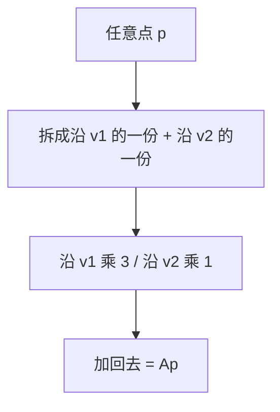
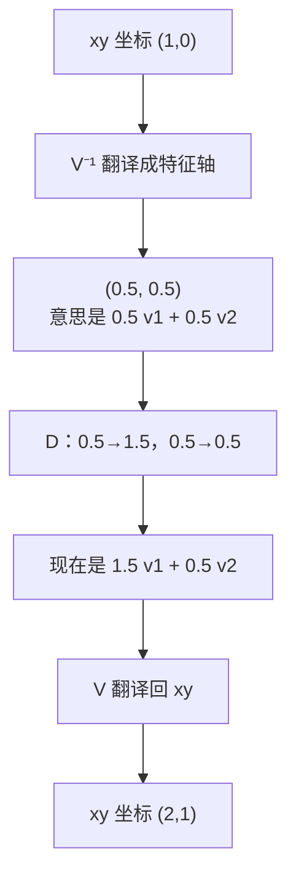

# Vectors, Matrices & Operations

> Every neural network is just matrix multiplication with extra steps.

**Type:** Build
**Languages:** Python, Julia
**Prerequisites:** Phase 1, Lesson 01 (Linear Algebra Intuition)
**Time:** ~90 minutes

## Learning Objectives

- Build a Matrix class with element-wise operations, matrix multiplication, transpose, determinant, and inverse
- Distinguish element-wise multiplication from matrix multiplication and explain when each applies
- Implement a single dense neural network layer (`relu(W @ x + b)`) using only the from-scratch Matrix class
- Explain broadcasting rules and how bias addition works in neural network frameworks
- Explain the determinant as signed area (2D) or volume (3D) scaling, including why `ad − bc` is base × height

## The Problem

You want to build a neural network. You read the code and see this:

```
output = activation(weights @ input + bias)
```

That `@` is matrix multiplication. The `weights` are a matrix. The `input` is a vector. If you do not know what those operations do, this line is magic. If you do know, it is the entire forward pass of a layer in three operations.

Every image your model processes is a matrix of pixel values. Every word embedding is a vector. Every layer of every neural network is a matrix transformation. You cannot build AI systems without being fluent in matrix operations the same way you cannot write code without understanding variables.

This lesson builds that fluency from scratch.

## The Concept

### Vectors: ordered lists of numbers

A vector is a list of numbers with a direction and magnitude. In AI, vectors represent data points, features, or parameters.

```
v = [3, 4]        -- a 2D vector
w = [1, 0, -2]    -- a 3D vector
```

A 2D vector `[3, 4]` points to coordinates (3, 4) on a plane. Its length (magnitude) is 5 (the 3-4-5 triangle).

### Matrices: grids of numbers

A matrix is a 2D grid. Rows and columns. An m x n matrix has m rows and n columns.

```
A = | 1  2  3 |     -- 2x3 matrix (2 rows, 3 columns)
    | 4  5  6 |
```

In neural networks, weight matrices transform input vectors into output vectors. A layer with 784 inputs and 128 outputs uses a 128x784 weight matrix.

### Why shapes matter

Matrix multiplication has a strict rule: `(m x n) @ (n x p) = (m x p)`. The inner dimensions must match.

```
(128 x 784) @ (784 x 1) = (128 x 1)
  weights       input       output

Inner dimensions: 784 = 784  -- valid
```

If you get a shape mismatch error in PyTorch, this is why.

### The operations map

| Operation | What it does | Neural network use |
|-----------|-------------|-------------------|
| Addition | Element-wise combine | Adding bias to output |
| Scalar multiply | Scale every element | Learning rate * gradients |
| Matrix multiply | Transform vectors | Layer forward pass |
| Transpose | Flip rows and columns | Backpropagation |
| Determinant | Signed area / volume scale factor | Checking invertibility (`det = 0` means singular) |
| Inverse | Undo a transformation | Solving linear systems |
| Identity | Do-nothing matrix | Initialization, residual connections |

### Element-wise vs matrix multiplication

This distinction trips up beginners constantly.

Element-wise: multiply matching positions. Both matrices must be the same shape.

```
| 1  2 |   | 5  6 |   | 5  12 |
| 3  4 | * | 7  8 | = | 21 32 |
```

Matrix multiplication: dot products of rows and columns. Inner dimensions must match.

```
| 1  2 |   | 5  6 |   | 1*5+2*7  1*6+2*8 |   | 19  22 |
| 3  4 | @ | 7  8 | = | 3*5+4*7  3*6+4*8 | = | 43  50 |
```

Different operations, different results, different rules.

### Broadcasting

When you add a bias vector to a matrix of outputs, the shapes do not match. Broadcasting stretches the smaller array to fit.

```
| 1  2  3 |   +   [10, 20, 30]
| 4  5  6 |

Broadcasting stretches the vector across rows:

| 1  2  3 |   | 10  20  30 |   | 11  22  33 |
| 4  5  6 | + | 10  20  30 | = | 14  25  36 |
```

Every modern framework does this automatically. Understanding it prevents confusion when shapes seem wrong but the code runs.

### Determinant

行列式（Determinant）是方阵压出来的一个数：这个线性变换把面积（2D）或体积（3D）放大了多少倍。正负号还告诉你方向有没有被翻过来。

本课在 Build It 里实现计算；几何含义如下。


| `det(A)` | 含义 |
|----------|------|
| `1` | 面积不变（旋转是典型例子，不是唯一例子） |
| `2` | 面积翻倍 |
| `0` | 空间被压扁，少了一维（不可逆） |
| `-1` | 面积不变，但左右翻转了（反射） |

- 旋转：转圈不改变面积，`det = 1`
- 缩放 `diag(2, 3)`：横拉 2、纵拉 3，面积变成 `2 × 3 = 6`
- 剪切：矩形拉成平行四边形，底和高不变，`det = 1`
- 反射：照镜子，面积还在，手性反了，`det = -1`

#### 怎么算

只对方阵有定义。2×2：

```text
A = [[a, b], [c, d]]
det(A) = ad − bc
```

几何上：两列向量 `u = (a, c)`、`v = (b, d)` 张成平行四边形，有向面积就是 `ad − bc`。

例子：`det([[1, 2], [3, 4]]) = 1·4 − 2·3 = −2`。面积变成 2 倍，符号为负 → 翻转了朝向。

3×3 用第一行展开（与本课 `determinant()` 代码相同）：

```text
det([[a,b,c],[d,e,f],[g,h,i]]) = a(ei−fh) − b(di−fg) + c(dh−eg)
```

更高维同一套路：沿一行把子矩阵（minor）递归展开，带上符号 `(-1)^(i+j)`。

#### 三个必须记住的事实

**1. `det = 0` ⇔ 不可逆（奇异）**

两列成比例，如 `[[1,2],[2,4]]`：第二列是第一列的 2 倍，平行四边形退化成线段，面积为 0。方程 `Ax = b` 要么无解，要么无穷多解。逆矩阵不存在。

**2. 复合变换：行列式相乘**

```text
det(AB) = det(A) det(B)
```

先拉 2 倍再拉 3 倍，面积一共变成 6 倍。

**3. 行列式 = 全体特征值的乘积**

后面「问题 5」用 `A = [[2, 1], [1, 2]]` 细讲：特征值 3 和 1，迹 `2+2 = 4` 等于 `3+1`；行列式 `4−1 = 3` 等于 `3 · 1`。

#### 在 AI 里为什么重要

- 可逆性检查：权重或协方差 `det ≈ 0` 说明列线性相关，求逆会炸掉。
- 高斯过程 / 多元正态：边际似然里有 `log det(K)`。Cholesky `K = LLᵀ` 后，`log det(K) = 2 Σ log Lᵢᵢ`。
- 体积与概率：换元积分、归一化流里密度乘 `|det J|`，仍是「这块体积被拉了多少倍」。

别把行列式当成神秘公式，把它当成「这个变换把空间的体积乘上了多少，以及有没有把空间翻面」。公式只是把这个体积算出来。

#### 问题 1：为什么 `det = 1` 面积不变、`det = 2` 面积翻倍？

> det(A) 为 1 表示面积不变（旋转），为 2 表示面积翻倍。这是为什么？

因为 2×2 行列式本来就算的就是：单位正方形被变完之后，新图形的面积。原来面积是 1，所以 `det(A)` 直接就是新面积（带正负号）。

##### 矩阵在对谁动手？

矩阵的两列，就是标准基向量 `e₁ = (1, 0)`、`e₂ = (0, 1)` 的去向：

```text
A = [[a, b], [c, d]]
A e₁ = (a, c)    （第一列）
A e₂ = (b, d)    （第二列）
```

单位正方形的两条边正好是 `e₁`、`e₂`。变完之后，正方形变成这两列张成的平行四边形。

原来面积 = 1。新面积 = 这个平行四边形的面积。所以新面积 = `|det(A)|`，也就是面积被乘上了 `|det(A)|`。

##### 为什么公式是 `ad − bc`？

平行四边形面积 = 底 × 高。二维里这个有向面积就是 `ad − bc`。这不是额外规定的「面积倍数」，它就是两列张成的有向面积。任意一块区域都可以切成很多小正方形。线性变换对每个小正方形都乘同一个倍数，所以整块图的面积都乘 `det(A)`。

##### 为什么旋转是 1？

```text
R_θ = [[cos θ, −sin θ], [sin θ, cos θ]]
det(R_θ) = cos²θ + sin²θ = 1
```

几何上：正方形只是转了个角度，边长还是 1，夹角还是 90°，面积还是 1。

注意：`det = 1` 不只属于旋转。剪切也是 1——矩形被斜推成平行四边形，底和高不变，面积不变。课表里写「旋转」只是最典型的例子。

##### 为什么 `det = 2` 就是面积翻倍？

因为原来是 1，变完是 2，所以任何图形的面积都变成原来的 2 倍。

只沿 x 拉长 2 倍：

```text
S = [[2, 0], [0, 1]]
det(S) = 2·1 − 0 = 2
```

边长 1 的正方形变成 2×1 的矩形，面积从 1 变成 2。

`diag(2, 3)`：横 2、纵 3，面积变成 6，行列式也是 `2 × 3 = 6`。

所以：

- 不是「只有旋转才 det = 1」
- 而是「只要 det = 1，面积倍数就是 1；只要 det = 2，面积倍数就是 2」

`det` 是倍数本身，旋转/缩放/剪切只是产生这个倍数的不同方式。

#### 问题 5：`A = [[2, 1], [1, 2]]` 的特征值、迹、行列式

> 特征值是 3 和 1。迹 2+2=4 等于 3+1；行列式 4−1=3 等于 3·1。几何上：沿特征方向分别拉 λ₁、λ₂ 倍，总体体积缩放就是各方向拉伸的乘积。请详细解释。

特征值的完整几何在下一课（矩阵变换）展开；这里用同一个数字例子，只为说明「行列式 = 特征值之积」。

这段话在说同一件事的三种写法：两个特殊方向上的拉伸倍数、对角线加起来、面积一共乘多少。

```text
A = [[2, 1], [1, 2]]
```

##### 1. 先看矩阵对普通点和「特殊点」做了什么

随便拿一点，比如 `(1,0)`（第一列就是它变完的位置）：`A(1,0) = (2,1)`。方向从「向右」变成了「右上」，既拉长又转了向。大多数向量都这样。

但有两个方向例外。先试 `v₁ = (1,1)`：

```text
A [1, 1]ᵀ = [3, 3]ᵀ = 3 [1, 1]ᵀ
```

变完还在同一条对角线上，只是长度变成 3 倍。

再试 `v₂ = (1, −1)`：

```text
A [1, −1]ᵀ = [1, −1]ᵀ = 1 [1, −1]ᵀ
```

方向、长度都不变。

这两个方向叫特征向量；旁边的倍数 3 和 1 叫特征值 λ。定义就是 `A v = λ v`：矩阵只沿着 v 做伸缩，不把它扳到别的方向去。

这两条轴还互相垂直：`(1,1) · (1,−1) = 1 − 1 = 0`。所以可以把平面理解成：一条轴沿东北—西南，一条轴沿东南—西北。A 在第一条轴上拉 3 倍，第二条轴上拉 1 倍（等于没动）。

##### 2. 其他方向为什么是「这两种拉伸的混合物」

任意一点都可以拆成沿 `v₁` 走多少、沿 `v₂` 走多少。例如刚才的 `(1,0)`：

```text
(1, 0) = (1/2)(1, 1) + (1/2)(1, −1)
A(1, 0) = (1/2)·3(1,1) + (1/2)·1(1,−1) = (2, 1)
```

和直接乘矩阵得到的第一列一样。

所以：不是平面上每个点都转一个奇怪的角度，而是每个点都在两个特征轴上分别被拉，再加回去。看起来像旋转，是因为两轴拉得不一样，合成向量的方向就歪了。



##### 3. 行列式为什么等于 `3 × 1`

`det(A)` 就是单位正方形变完后平行四边形的面积。这个矩阵的两列是 `(2,1)` 和 `(1,2)`：

```text
det(A) = 2·2 − 1·1 = 4 − 1 = 3
```

单位正方形面积 1，变完面积 3，所以整体面积乘 3。

同一个 3，也可以从特征轴上看。把单位正方形转到和特征轴对齐（两条边分别沿 `v₁`、`v₂`，边长仍为 1，面积仍为 1）。A 对这个正方形做的事非常干净：

- 沿 `v₁` 的边：长度 `1 → 3`
- 沿 `v₂` 的边：长度 `1 → 1`
- 两轴本来垂直，拉完还垂直

于是正方形变成 `3 × 1` 的矩形，面积 `3 × 1 = 3`。

线性变换对所有区域乘同一个面积倍数，所以 `det(A) = λ₁ λ₂ = 3 · 1 = 3`。

这就是：「沿特征方向分别拉 λ₁、λ₂ 倍，总体体积缩放是各方向拉伸的乘积」。

对角缩放矩阵把这件事表现得更直白：

```text
D = [[3, 0], [0, 1]]
det(D) = 3 · 1 = 3
```

A 和 D 是同一套拉伸，只是 D 写在特征轴上，A 写在普通 xy 轴上。换坐标系不改变面积倍数，所以 `det(A) = det(D)`。

写成分解就是 `A = V D V⁻¹`（问题 6）。

##### 4. 迹为什么等于 `3 + 1`

迹就是对角线相加：`tr(A) = 2 + 2 = 4`。特征值相加也是 `3 + 1 = 4`。

几何上没有「面积」那么直观，可以把它当成：沿当前坐标轴看，各轴自己的伸缩量之和。换到特征轴上，这两个数就是 λ₁ 和 λ₂，加起来不变。

##### 5. 特征值是怎么找出来的（和行列式连上）

「只缩放、不转向」就是 `A v = λ v`，挪项：`(A − λ I) v = 0`。

要有非零 v，矩阵 `A − λ I` 必须把空间压扁，也就是行列式为 0：

```text
A − λI = [[2−λ, 1], [1, 2−λ]]
det(A − λI) = (2−λ)² − 1 = λ² − 4λ + 3 = (λ−3)(λ−1)
```

令它为 0，得到 `λ = 3` 或 `λ = 1`。

注意系数：`λ² − (迹)λ + (行列式) = 0`。对 2×2，迹和行列式直接就是两个特征值的和与积。

##### 收口表

| 写法 | 这个例子里是 | 含义 |
|------|----------------|------|
| `A v₁ = 3 v₁` | `v₁ = (1,1)` | 沿这条轴拉 3 倍 |
| `A v₂ = 1 v₂` | `v₂ = (1,−1)` | 沿这条轴拉 1 倍 |
| `tr(A) = λ₁ + λ₂` | `4 = 3 + 1` | 各轴伸缩量之和（换坐标系不变） |
| `det(A) = λ₁ λ₂` | `3 = 3 · 1` | 各轴伸缩量之积 = 面积倍数 |

矩阵看起来是 `[[2,1],[1,2]]`，那是因为坐标轴不是特征轴。换到 `(1,1)` 和 `(1,−1)` 上看，它就是 `diag(3, 1)`：一块面积横着乘 3、竖着乘 1，总共乘 3。

#### 问题 6：为什么 `A = V D V⁻¹` 是「换轴 → 拉伸 → 换回来」？

> V⁻¹：把点的坐标换到特征轴上（面积倍数 det(V⁻¹)）。D：沿新轴拉 3 倍和 1 倍（面积倍数 3·1）。V：换回原来的 xy 轴（面积倍数 det(V)）。解释一下。

把 `A = V D V⁻¹` 理解成：先改用特征轴来读点的坐标，再在那组轴上拉伸，再换回原来的 xy。矩阵从右往左作用，所以最右边的 `V⁻¹` 最先发生。

继续用同一个例子。`v₁ = (1,1), λ₁ = 3`；`v₂ = (1,−1), λ₂ = 1`。

##### V 是什么

V 的两列就是两条特征轴：

```text
V = [[1, 1], [1, −1]]
```

乘 V 就是「按两列加权相加」。如果手里有一对数 `(a, b)`，意思是「沿 v₁ 走 a、沿 v₂ 走 b」，那么

```text
V [a, b]ᵀ = a v₁ + b v₂
```

得到的就是这个点在普通 xy 里的坐标。

所以：

| 矩阵 | 输入 | 输出 |
|------|------|------|
| `V` | 特征轴上的坐标 `(a, b)` | xy 坐标 |
| `V⁻¹` | xy 坐标 | 特征轴上的坐标 `(a, b)` |

`V⁻¹` 不是再做一次拉伸，只是把「xy 读数」翻译成「沿两条特征轴各走多少」。

这个例子里：

```text
V⁻¹ = [[1/2, 1/2], [1/2, −1/2]]
```

##### 用一个点把三步走完

取 `p = (1, 0)`。已经算过 `A p = (2, 1)`。现在拆开看。

**第 1 步：`V⁻¹ p`，换成特征轴坐标**

```text
V⁻¹ [1, 0]ᵀ = [1/2, 1/2]ᵀ
```

意思是 `(1,0) = (1/2) v₁ + (1/2) v₂`。核对：`(1/2)(1,1) + (1/2)(1,−1) = (1,0)`。只是换了一种读法，点还是那个点。

**第 2 步：`D` 沿新轴拉伸**

```text
D = [[3, 0], [0, 1]]
D [1/2, 1/2]ᵀ = [3/2, 1/2]ᵀ
```

对角矩阵的含义就是：第一个坐标乘 3，第二个坐标乘 1。在特征轴上，这就是「沿 v₁ 拉 3 倍，沿 v₂ 不动」。

**第 3 步：`V` 换回 xy**

```text
V [3/2, 1/2]ᵀ = (3/2) v₁ + (1/2) v₂ = (2, 1)
```

这就是 `A p`。

三步串起来：



所以 `A = V D V⁻¹` 不是三个神秘矩阵，而是 `A p = V ( D ( V⁻¹ p ) )`：先翻译，再拉伸，再翻译回来。

##### 为什么 D 那么简单，A 却有斜着的 1

因为 D 只在特征轴上才是「横乘 3、竖乘 1」。写在普通 xy 上，两条轴是斜的 `(1,1)` 和 `(1,−1)`，看起来就像 `[[2,1],[1,2]]`。

V 和 V⁻¹ 负责在这两种说法之间切换；真正改变形状的只有 D。

##### 面积为什么只剩下 `3 · 1`

每乘一个矩阵，面积就乘上它的行列式：

```text
det(A) = det(V) det(D) det(V⁻¹)
```

这个例子：`det(V) = 1·(−1) − 1·1 = −2`。V 把单位正方形变成 v₁, v₂ 张成的平行四边形，有向面积是 −2（负号表示这两列的顺序把朝向翻了）。

`det(V⁻¹) = 1 / det(V) = −1/2`。

换过去再换回来，面积倍数相乘：`det(V) · det(V⁻¹) = (−2)·(−1/2) = 1`。

坐标翻译不增加、也不减少面积（来回一对会抵消）。剩下的只有 `det(D) = 3 · 1 = 3`。所以 `det(A) = 3`。

几何上也可以看成：
1. `V⁻¹`：把斜着的特征轴扳到普通 xy（面积乘 −1/2）
2. `D`：在 xy 上看就是把正方形拉成 3×1 矩形（面积乘 3）
3. `V`：再把轴扳回原来的斜方向（面积乘 −2）

第 1、3 步互为逆变换，面积变化抵消；整体面积倍数等于中间那一拉。

收口：`V⁻¹` 回答「这个点沿两条特征轴各是多少」；`D` 把这两个数分别乘 3 和 1；`V` 再把「多少个 v₁、多少个 v₂」加回成 xy 坐标。

#### 问题 7：为啥是 `Ap` 不是 `A`？

> 为啥是 Ap 不是 A？

因为 A 是机器，`A p` 是机器作用在一个点上之后的结果。

| 符号 | 是什么 | 类比 |
|------|--------|------|
| `A` | 矩阵本身，一套规则 | 一台拉伸机 |
| `p` | 一个点 / 一个向量 | 一块放进去的橡皮泥 |
| `A p` | 规则作用在这个点上得到的新点 | 拉完之后的橡皮泥 |

`A = V D V⁻¹` 说的是：这台机器可以拆成三台小机器串联。等号两边都是矩阵，还没有碰到任何点。

`A p = V ( D ( V⁻¹ p ) )` 说的是：把一个具体的点 p 丢进去，三台小机器会依次处理它。

矩阵乘法从右往左作用，所以必须先写作用在点上的式子，才能看出顺序：先 `V⁻¹` 作用在 p 上，再 `D`，再 `V`，得到 `A p`。

如果只写 A，没有 p，就没有「先处理谁」——A 只是那三台机器的组合说明书。

用同一个数字看差别：`A = [[2,1],[1,2]]`，`p = (1,0)`，`A p = (2,1)`。
- A：那四个数，规则还在纸上
- p：点 `(1,0)`
- `A p`：这个点被送去了 `(2,1)`

三步拆开算的也是 `A p`，不是 A。最后得到的 `(2,1)` 是一个点，所以左边必须写成 `A p`。

对每一个点 p 都有 `A p = V ( D ( V⁻¹ p ) )`，这件事等价于矩阵相等 `A = V D V⁻¹`。左边是「整台机器」，右边是「三台小机器接好」。一旦要讲「先换坐标、再拉伸、再换回来」，就必须带上被处理的那个点，所以写成 `A p`。

#### 问题 8：为什么第 1 步是 `V⁻¹ p`，换成特征轴坐标？

> 第 1 步：V⁻¹ p，换成特征轴坐标。这是为什么？

因为 V 的定义就是「特征轴坐标 → xy 坐标」。要反过来问「xy 里的这个点，沿两条特征轴各是多少」，就必须用 V 的逆：`V⁻¹ p`。

##### V 规定了一种读法

V 的两列是 `v₁ = (1,1)` 和 `v₂ = (1,−1)`。乘法的意思：

```text
V [a, b]ᵀ = a v₁ + b v₂
```

左边的 `(a, b)`：特征轴上的坐标（沿 v₁ 走 a，沿 v₂ 走 b）。右边：普通 xy 坐标。

所以 V 是一本单向词典：只负责从 `(a, b)` 翻译成 xy。

##### 现在手里是 xy 的点，词典要倒着用

点 `p = (1,0)` 是 xy 读数。我们想知道的是：`p = a v₁ + b v₂` 里的 a, b 是多少？

把上式写成矩阵，就是 `p = V [a, b]ᵀ`。两边左乘 `V⁻¹`（V 的逆就是把 V 撤销）：

```text
V⁻¹ p = [a, b]ᵀ
```

这就是「换成特征轴坐标」的全部原因：不是 `V⁻¹` 有某种魔法，而是我们把未知数 a, b 解出来了。

这个例子：`V⁻¹ (1,0) = (1/2, 1/2)`，所以 `a = 1/2, b = 1/2`，即 `(1,0) = (1/2)(1,1) + (1/2)(1,−1)`。

##### 为什么必须先做这一步

`D = diag(3, 1)` 只认识特征轴上的两个数：第一个乘 3，第二个乘 1。它看不懂 xy 的 `(1,0)`。

所以顺序只能是：
1. `V⁻¹ p`：先问「沿 v₁、v₂ 各多少」→ `(a, b)`
2. `D`：再 `a ← 3a`，`b ← b`
3. `V`：再把新的 `a v₁ + b v₂` 加回 xy

没有第 1 步，D 不知道该把哪个方向拉 3 倍。

## Build It

### Step 1: Vector class

```python
class Vector:
    def __init__(self, data):
        self.data = list(data)
        self.size = len(self.data)

    def __repr__(self):
        return f"Vector({self.data})"

    def __add__(self, other):
        return Vector([a + b for a, b in zip(self.data, other.data)])

    def __sub__(self, other):
        return Vector([a - b for a, b in zip(self.data, other.data)])

    def __mul__(self, scalar):
        return Vector([x * scalar for x in self.data])

    def dot(self, other):
        return sum(a * b for a, b in zip(self.data, other.data))

    def magnitude(self):
        return sum(x ** 2 for x in self.data) ** 0.5
```

### Step 2: Matrix class with core operations

```python
class Matrix:
    def __init__(self, data):
        self.data = [list(row) for row in data]
        self.rows = len(self.data)
        self.cols = len(self.data[0])
        self.shape = (self.rows, self.cols)

    def __repr__(self):
        rows_str = "\n  ".join(str(row) for row in self.data)
        return f"Matrix({self.shape}):\n  {rows_str}"

    def __add__(self, other):
        return Matrix([
            [self.data[i][j] + other.data[i][j] for j in range(self.cols)]
            for i in range(self.rows)
        ])

    def __sub__(self, other):
        return Matrix([
            [self.data[i][j] - other.data[i][j] for j in range(self.cols)]
            for i in range(self.rows)
        ])

    def scalar_multiply(self, scalar):
        return Matrix([
            [self.data[i][j] * scalar for j in range(self.cols)]
            for i in range(self.rows)
        ])

    def element_wise_multiply(self, other):
        return Matrix([
            [self.data[i][j] * other.data[i][j] for j in range(self.cols)]
            for i in range(self.rows)
        ])

    def matmul(self, other):
        return Matrix([
            [
                sum(self.data[i][k] * other.data[k][j] for k in range(self.cols))
                for j in range(other.cols)
            ]
            for i in range(self.rows)
        ])

    def transpose(self):
        return Matrix([
            [self.data[j][i] for j in range(self.rows)]
            for i in range(self.cols)
        ])

    def determinant(self):
        if self.shape == (1, 1):
            return self.data[0][0]
        if self.shape == (2, 2):
            return self.data[0][0] * self.data[1][1] - self.data[0][1] * self.data[1][0]
        det = 0
        for j in range(self.cols):
            minor = Matrix([
                [self.data[i][k] for k in range(self.cols) if k != j]
                for i in range(1, self.rows)
            ])
            det += ((-1) ** j) * self.data[0][j] * minor.determinant()
        return det

    def inverse_2x2(self):
        det = self.determinant()
        if det == 0:
            raise ValueError("Matrix is singular, no inverse exists")
        return Matrix([
            [self.data[1][1] / det, -self.data[0][1] / det],
            [-self.data[1][0] / det, self.data[0][0] / det]
        ])

    @staticmethod
    def identity(n):
        return Matrix([
            [1 if i == j else 0 for j in range(n)]
            for i in range(n)
        ])
```

The 2x2 branch is `ad − bc`: the signed area of the parallelogram spanned by the two columns. That is the whole geometric story in **Determinant** above (问题 1). When `det = 0` the parallelogram has collapsed, so `inverse_2x2` raises — there is nothing to undo.

### Step 3: See it work

```python
A = Matrix([[1, 2], [3, 4]])
B = Matrix([[5, 6], [7, 8]])

print("A + B =", (A + B).data)
print("A @ B =", A.matmul(B).data)
print("A^T =", A.transpose().data)
print("det(A) =", A.determinant())
print("A^-1 =", A.inverse_2x2().data)

I = Matrix.identity(2)
print("A @ A^-1 =", A.matmul(A.inverse_2x2()).data)
```

### Step 4: Connect to neural networks

```python
import random

inputs = Matrix([[0.5], [0.8], [0.2]])
weights = Matrix([
    [random.uniform(-1, 1) for _ in range(3)]
    for _ in range(2)
])
bias = Matrix([[0.1], [0.1]])

def relu_matrix(m):
    return Matrix([[max(0, val) for val in row] for row in m.data])

pre_activation = weights.matmul(inputs) + bias
output = relu_matrix(pre_activation)

print(f"Input shape: {inputs.shape}")
print(f"Weight shape: {weights.shape}")
print(f"Output shape: {output.shape}")
print(f"Output: {output.data}")
```

This is a single dense layer: `output = relu(W @ x + b)`. Every dense layer in every neural network does exactly this.

## Use It

NumPy does everything above in fewer lines and orders of magnitude faster.

```python
import numpy as np

A = np.array([[1, 2], [3, 4]])
B = np.array([[5, 6], [7, 8]])

print("A + B =\n", A + B)
print("A * B (element-wise) =\n", A * B)
print("A @ B (matrix multiply) =\n", A @ B)
print("A^T =\n", A.T)
print("det(A) =", np.linalg.det(A))
print("A^-1 =\n", np.linalg.inv(A))
print("I =\n", np.eye(2))

inputs = np.random.randn(3, 1)
weights = np.random.randn(2, 3)
bias = np.array([[0.1], [0.1]])
output = np.maximum(0, weights @ inputs + bias)

print(f"\nNeural network layer: {weights.shape} @ {inputs.shape} = {output.shape}")
print(f"Output:\n{output}")
```

The `@` operator in Python calls `__matmul__`. NumPy implements it with optimized BLAS routines written in C and Fortran. Same math, 100x faster.

Broadcasting in NumPy:

```python
matrix = np.array([[1, 2, 3], [4, 5, 6]])
bias = np.array([10, 20, 30])
print(matrix + bias)
```

NumPy automatically broadcasts the 1D bias across both rows. This is how bias addition works in every neural network framework.

## Ship It

This lesson produces a prompt for teaching matrix operations through geometric intuition. See `outputs/prompt-matrix-operations.md`.

The Matrix class built here is the foundation for the mini neural network framework we build in Phase 3, Lesson 10.

## Exercises

1. **Verify the inverse.** Multiply `A @ A.inverse_2x2()` and confirm you get the identity matrix. Try it with three different 2x2 matrices. What happens when the determinant is zero?

2. **Implement 3x3 inverse.** Extend the Matrix class to compute inverses for 3x3 matrices using the adjugate method. Test it against NumPy's `np.linalg.inv`.

3. **Build a two-layer network.** Using only your Matrix class (no NumPy), create a two-layer neural network: input (3) -> hidden (4) -> output (2). Initialize random weights, run a forward pass, and verify all shapes are correct.

## Key Terms

| Term | What people say | What it actually means |
|------|----------------|----------------------|
| Vector | "An arrow" | An ordered list of numbers. In AI: a point in high-dimensional space. |
| Matrix | "A table of numbers" | A linear transformation. It maps vectors from one space to another. |
| Matrix multiply | "Just multiply the numbers" | Dot products between every row of the first matrix and every column of the second. Order matters. |
| Transpose | "Flip it" | Swap rows and columns. Turns an m x n matrix into n x m. Critical in backpropagation. |
| Determinant | "Some number from the matrix" | Signed area (2D) or volume (3D) of the parallelogram/parallelepiped spanned by the columns. Equals `ad − bc` in 2x2, and equals the product of eigenvalues. Zero means the transformation crushes a dimension. |
| Inverse | "Undo the matrix" | The matrix that reverses the transformation. Only exists when the determinant is not zero. |
| Identity matrix | "The boring matrix" | The matrix equivalent of multiplying by 1. Used in residual connections (ResNets). |
| Broadcasting | "Magic shape fixing" | Stretching a smaller array to match a larger one by repeating along missing dimensions. |
| Element-wise | "Regular multiplication" | Multiply matching positions. Both arrays must have the same shape (or be broadcastable). |

## Further Reading

- [3Blue1Brown: Essence of Linear Algebra](https://www.3blue1brown.com/topics/linear-algebra) - visual intuition for every operation covered here
- [NumPy documentation on broadcasting](https://numpy.org/doc/stable/user/basics.broadcasting.html) - the exact rules NumPy follows
- [Stanford CS229 Linear Algebra Review](http://cs229.stanford.edu/section/cs229-linalg.pdf) - concise reference for ML-specific linear algebra
