# Matrix Transformations

> A matrix is a machine that reshapes space. Learn what it does to every point, and you understand the whole transformation.

**Type:** Build
**Languages:** Python, Julia
**Prerequisites:** Phase 1, Lessons 01-02 (Linear Algebra Intuition, Vectors & Matrices Operations)
**Time:** ~75 minutes

## Learning Objectives

- Construct rotation, scaling, shearing, and reflection matrices and apply them to 2D and 3D points
- Compose multiple transformations by matrix multiplication and verify that order matters
- Compute eigenvalues and eigenvectors of 2x2 matrices from the characteristic equation
- Explain why eigenvalues determine PCA directions, RNN stability, and spectral clustering behavior

## The Problem

You read about PCA and see "find the eigenvectors of the covariance matrix." You read about model stability and see "check if all eigenvalues have magnitude less than 1." You read about data augmentation and see "apply a random rotation." None of this makes sense until you understand what matrices do to space geometrically.

Matrices are not just grids of numbers. They are spatial machines. A rotation matrix spins points. A scaling matrix stretches them. A shearing matrix tilts them. Every transformation a neural network applies to data is one of these operations or a composition of them. This lesson makes those operations concrete.

## The Concept

### Transformations as matrices

Every linear transformation in 2D can be written as a 2x2 matrix. The matrix tells you exactly where the basis vectors [1, 0] and [0, 1] end up. Everything else follows.

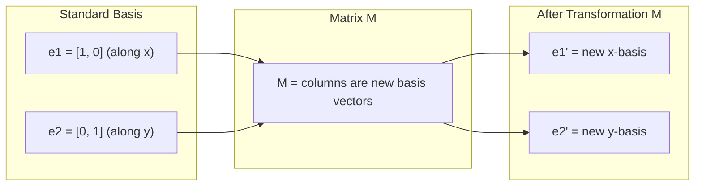

线性变换有三条硬规定：原点不动；直线还是直线；平行线还是平行。平移把原点搬走了，所以不是线性变换。

2×2 矩阵的两列，就是标准基的去向。`e₁ = [1, 0]` 被送到第一列，`e₂ = [0, 1]` 被送到第二列。任意向量都可以拆成 `v = x e₁ + y e₂`，变完只是同一组系数去组合新基：

```text
M v = x (M e₁) + y (M e₂)
```

若

```text
M = [[a, b], [c, d]]
```

则第一列 `[a, c]ᵀ` 就是 e₁′，第二列 `[b, d]ᵀ` 就是 e₂′。后面每一张图都用这个办法读：先看两列落到了哪里。整块空间的新形状，就是这两列张成的平行四边形。

### Rotation

A 2D rotation by angle theta keeps distances and angles intact. It moves every point along a circular arc.

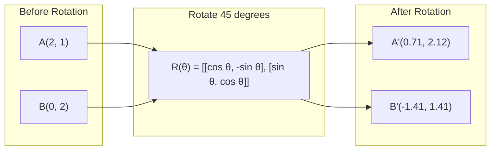

In 3D, you rotate around an axis. Each axis has its own rotation matrix:

```text
Rz(theta) = | cos  -sin  0 |     Rotate around z-axis
            | sin   cos  0 |     (x-y plane spins, z stays)
            |  0     0   1 |

Rx(theta) = | 1   0     0    |   Rotate around x-axis
            | 0  cos  -sin   |   (y-z plane spins, x stays)
            | 0  sin   cos   |

Ry(theta) = |  cos  0  sin |     Rotate around y-axis
            |   0   1   0  |     (x-z plane spins, y stays)
            | -sin  0  cos |
```

三维不是在平面里绕原点转，而是绕一根轴转。被绕的那根轴上的点不动；垂直于该轴的平面，像二维旋转一样转。上面三个矩阵分别固定 x、y、z：`Rz` 让 x-y 平面转、z 不动；`Rx` 让 y-z 平面转、x 不动；`Ry` 让 x-z 平面转、y 不动。

回到二维。点绕原点走圆弧。本课规定：θ 为正时逆时针转。

```text
R(θ) = [[cos θ, −sin θ], [sin θ, cos θ]]
```

用图里的 45° 把乘法写开。`cos 45° = sin 45° ≈ 0.707`：

```text
R(45°) ≈ [[ 0.707, -0.707 ],
          [ 0.707,  0.707 ]]

R A = [ 0.707·2 + (−0.707)·1,  0.707·2 + 0.707·1 ]
    = [ 1.414 − 0.707,         1.414 + 0.707 ]
    = [ 0.707, 2.121 ]
    ≈ (0.71, 2.12)

R B = [ 0.707·0 + (−0.707)·2,  0.707·0 + 0.707·2 ]
    = [ −1.414, 1.414 ]
    ≈ (−1.41, 1.41)
```

读两列：第一列 `[cos θ, sin θ]ᵀ` 是转过的 e₁；第二列 `[−sin θ, cos θ]ᵀ` 是转过的 e₂。两列仍是单位向量，并且互相垂直。

旋转是等距变换（isometry）：`||Rv|| = ||v||`，夹角也不变。矩形转完还是矩形，不会被拉成长方形或平行四边形。

它还是正交矩阵：`Rᵀ R = I`。所以逆就是转回去：`R(θ)⁻¹ = R(−θ) = Rᵀ`。

`det(R) = cos²θ + sin²θ = +1`。面积不变，朝向也不翻。剪切的行列式也是 1，面积同样不变；旋转更强——连长度和夹角都保。

一般没有实特征向量（0° 和 180° 除外：那时整平面都是特征方向）。特征值是单位圆上的 `e^{±iθ}`：转过的平面没有「只被伸缩、不被扳向」的实方向。

### Scaling

Scaling stretches or compresses along each axis independently.

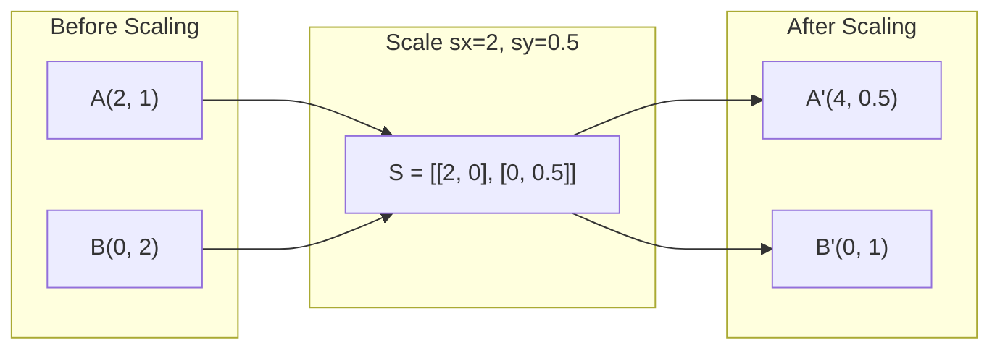

轴对齐缩放就是对角矩阵 `S = diag(sₓ, sᵧ)`。图里 `sₓ = 2`、`sᵧ = 0.5`：

```text
A(2, 1) → (4, 0.5)
B(0, 2) → (0, 1)
```

读两列：e₁′ = `(2, 0)`，e₂′ = `(0, 0.5)`。横轴拉成 2 倍，纵轴压成一半。

`sₓ = sᵧ` 时是各向同性（isotropic）：各个方向拉得一样，圆还是圆。否则是各向异性（anisotropic）：圆变成椭圆。

特征值就是 `sₓ`、`sᵧ`；对轴对齐缩放，特征向量就是坐标轴本身。

`det(S) = sₓ sᵧ`。上一课的 `diag(2, 3)` 面积变成 6。这里 `2 × 0.5 = 1`，面积碰巧仍是 1，但形状已经变了——`det = 1` 只说面积倍数，不说「什么都没发生」。

各因子都不为 0 时，逆是 `diag(1/sₓ, 1/sᵧ)`。某个因子为 0，矩阵奇异，空间被压扁到一条轴上。某个因子为负：先按绝对值缩放，再沿那根轴反射。

沿任意方向拉伸，不是另写一套公式，而是：先旋转，让要拉的方向对齐坐标轴；对角缩放；再转回来。

### Shearing

Shearing tilts one axis while keeping the other fixed. It turns rectangles into parallelograms.

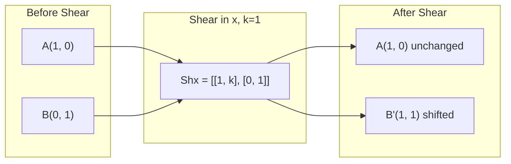

沿 x 方向剪切、沿 y 方向剪切分别是：

```text
Shₓ = [[1, k], [0, 1]]     x' = x + k y,   y' = y
Shᵧ = [[1, 0], [k, 1]]     x' = x,         y' = y + k x
```

图里 `k = 1`。A`(1, 0)` 的 y 为 0，所以 x 不被推动，点不动。B`(0, 1)` 变成 `(1, 1)`。

读两列：e₁ 仍在 `(1, 0)`；e₂ 被推到 `(k, 1)`。一张图只动一列。

几何直觉是一叠扑克牌：每张牌沿 x 滑开一点，整叠变斜，厚度（高）不变。面积因此保持：`det(Shₓ) = 1`，朝向也不翻。但长度和夹角都不保——正方形变成平行四边形，对角线被拉长。

两个特征值都是 1。`k ≠ 0` 时只有一条特征方向：那个不动的轴（这里是 x 轴）。代数重数是 2，几何重数是 1，矩阵亏损（defective），不能对角化。

逆就是反向剪切：把 `k` 换成 `−k`。

### Reflection

Reflection mirrors points across an axis or line.

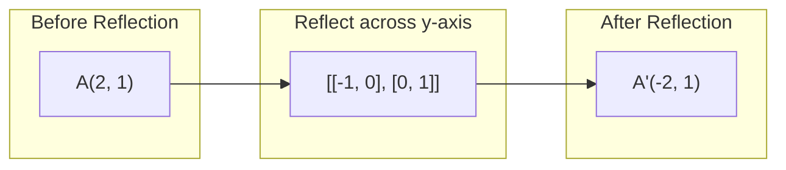

常见三条镜面：

```text
过 y 轴：  [[-1, 0], [0, 1]]      A(2, 1) → (−2, 1)
过 x 轴：  [[ 1, 0], [0, -1]]
过 y = x： [[ 0, 1], [1,  0]]
```

图里是过 y 轴。读两列：e₁ → `(−1, 0)`，e₂ 不动。镜子就是 y 轴，法线是 x 轴。

反射也是等距变换：长度、夹角都保。但朝向翻了，`det = −1`。它仍是正交矩阵，只是反常正交（improper，`det = −1`）。旋转属于 SO(2)，`det = +1`。

特征值：沿镜面是 `+1`（镜子上的点不动），沿法线是 `−1`（穿过镜子翻到对面）。逆就是它自己（对合，involution）：照两次镜子回到原处。

不要把 180° 旋转当成反射。`[[-1, 0], [0, -1]]` 的 `det = +1`，朝向没翻，那是绕原点转半圈，不是照镜子。

#### 对照：五张图的两列在干什么

| 图 | 两列（新基） | 空间变成什么样 |
|----|--------------|----------------|
| 标准基 | 列就是 e₁、e₂ 将要去的地方；后面每张图都先看这两列 | 还没动手，轴沿 x、y |
| 旋转 45° | 第一列 `[cos, sin] ≈ (0.71, 0.71)`；第二列 `[−sin, cos] ≈ (−0.71, 0.71)` | 整块绕原点转 45°，形状不变 |
| 缩放 `sₓ=2, sᵧ=0.5` | e₁′ = `(2, 0)`；e₂′ = `(0, 0.5)` | 横拉 2、纵压 0.5，圆变椭圆 |
| 剪切 `k=1` | e₁ 仍是 `(1, 0)`；e₂ 被推到 `(1, 1)` | 像扑克牌错开，矩形变平行四边形 |
| 反射（y 轴） | e₁ → `(−1, 0)`；e₂ 不动 | 左右对调，上下不动 |

#### 对照：长度、夹角、行列式、逆、特征方向

| | 旋转 | 缩放 | 剪切 | 反射 |
|---|------|------|------|------|
| 矩阵形式 | `[[cos θ, −sin θ], [sin θ, cos θ]]` | `diag(sₓ, sᵧ)` | `Shₓ = [[1, k], [0, 1]]` | 过 y 轴：`[[-1, 0], [0, 1]]` |
| 长度 | 保持 | 变 | 一般变 | 保持 |
| 夹角 | 保持 | 各向异性时一般变 | 变 | 保持 |
| `\|det\|` | 1 | `\|sₓ sᵧ\|` | 1 | 1 |
| `sign(det)` | + | `sign(sₓ sᵧ)` | + | − |
| 逆 | `R(−θ) = Rᵀ` | `diag(1/sₓ, 1/sᵧ)`（非零） | 剪切 `−k` | 自身 |
| 实特征向量 | 一般没有（0° / 180° 除外） | 坐标轴（轴对齐缩放） | `k ≠ 0` 时只有固定轴这一条 | `+1` 沿镜面，`−1` 沿法线 |

#### 单位正方形和单位圆变成什么

单位正方形的边是 e₁、e₂。变完就是两列张成的平行四边形：旋转 / 反射后仍是正方形（只是转了或翻了）；图里的缩放变成 `2 × 0.5` 矩形；剪切变成平行四边形。

单位圆更敏感：旋转和反射都是等距，圆还是圆。各向异性缩放把圆拉成轴对齐的椭圆。剪切也把圆变成椭圆，但轴是斜的。

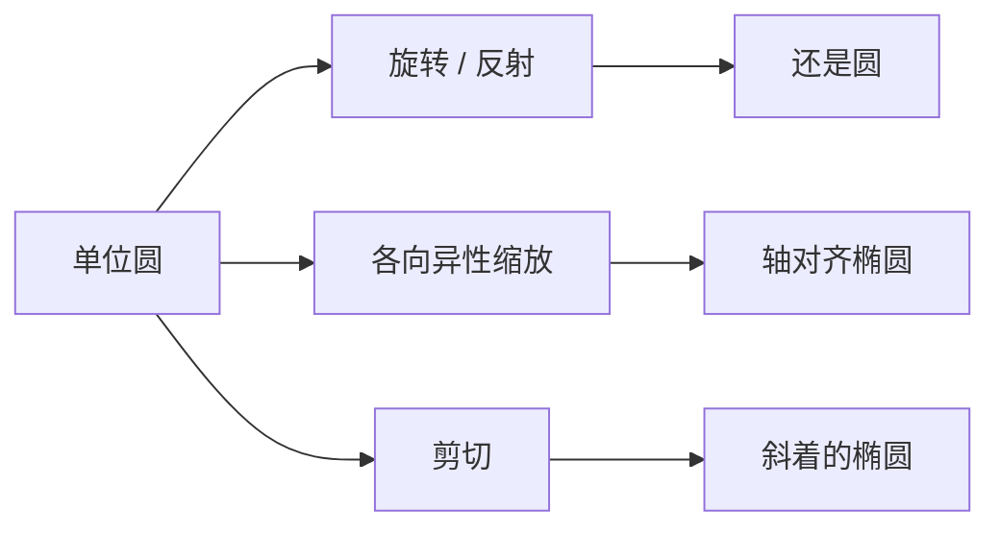

### Composition: chaining transformations

Applying transformation A then B is the same as multiplying their matrices: `result = B @ A @ point`. Order matters. Rotate then scale gives different results than scale then rotate.

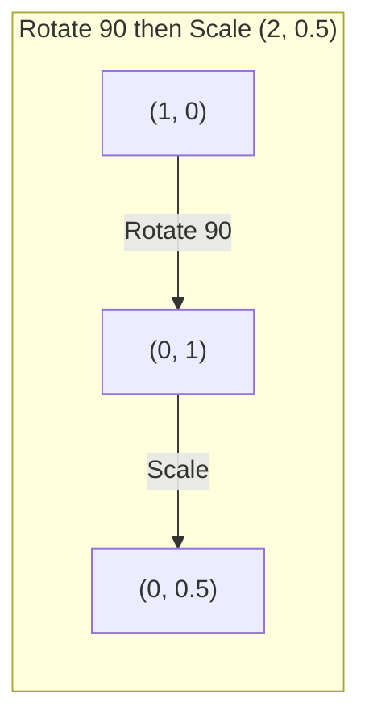

Composed: `S @ R = [[0, -2], [0.5, 0]]`

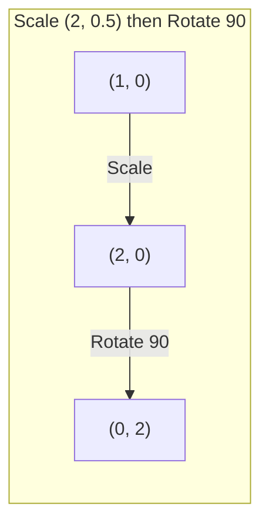

Composed: `R @ S = [[0, -0.5], [2, 0]]`

Different results. Matrix multiplication is not commutative.

### Eigenvalues and eigenvectors

Most vectors change direction when a matrix hits them. Eigenvectors are special: the matrix only scales them, never rotates them. The scaling factor is the eigenvalue.

```text
A @ v = lambda * v

v is the eigenvector (direction that survives)
lambda is the eigenvalue (how much it stretches)

Example: A = | 2  1 |
             | 1  2 |

Eigenvector [1, 1] with eigenvalue 3:
  A @ [1,1] = [3, 3] = 3 * [1, 1]     (same direction, scaled by 3)

Eigenvector [1, -1] with eigenvalue 1:
  A @ [1,-1] = [1, -1] = 1 * [1, -1]  (same direction, unchanged)
```

The matrix stretches space by 3x along [1, 1] and keeps [1, -1] unchanged. Every other direction is a mix of these two.

### Eigendecomposition

如果一个矩阵有 n 个线性无关的特征向量，就可以分解成：

```text
A = V @ D @ V^(-1)

V      = 列向量是特征向量的矩阵
D      = 特征值组成的对角矩阵
V^(-1) = V 的逆
```

这句话的意思：先转到特征向量坐标系，沿每个轴缩放，再转回来。

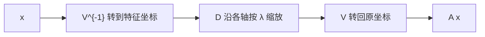

**λ 就是特征值。** λ_i 恰好就是 A 的特征值，不是另一种对象。对角矩阵只是把它们排在对角线上：

```text
D = diag(λ1, λ2, ...)
```

**λ^t 也不是新东西：** 同一个数自己乘 t 次。例如 λ = 2、t = 5 时，λ^t = 2 × 2 × 2 × 2 × 2 = 32。没有新的运算，只是反复相乘。

#### 为什么 A^t = V D^t V^{-1}

把分解连乘两次：

```text
A^2 = (V D V^{-1})(V D V^{-1})
    = V D (V^{-1} V) D V^{-1}
    = V D^2 V^{-1}

D^2 = diag(λ1^2, λ2^2, ...)
```

中间的 `V^{-1} V` 消成单位矩阵，所以只剩下对角线上每个 λ 自己乘一次。连乘 t 次之后：

```text
A^t = V D^t V^{-1}
D^t = diag(λ1^t, λ2^t, ...)
```

特征向量（V 的各列）方向不变；变的只是沿每个方向的拉伸倍数。

从定义 `A v = λ v` 直接看更清楚：

```text
A^2 v = A(λ v) = λ (A v) = λ^2 v
```

所以 v 仍是 A^t 的特征向量，对应的特征值是 λ^t（同一个 λ 乘自己 t 次）。

例子：λ = 2，t = 5 → `A^5 v = 32 v`。方向不变，长度变成原来的 2^5 倍。

这就是后面 Stability 会说 `|λ| > 1` 会爆炸、`|λ| < 1` 会消失的原因：看的是 `|λ|^t`。`|λ| = 2` 时 2^t 越乘越大；`|λ| = 0.5` 时 0.5^t 越乘越接近 0。

### Why eigenvalues matter

**PCA.** The eigenvectors of the covariance matrix are the principal components. The eigenvalues tell you how much variance each component captures. Sort by eigenvalue, keep the top k, and you have dimensionality reduction.

**Stability.** In recurrent networks and dynamical systems, eigenvalues with magnitude > 1 cause outputs to explode. Magnitude < 1 causes them to vanish. This is the vanishing/exploding gradient problem stated in one sentence.

同一套数学：`A v = λ v` 立刻推出 `Aᵗ v = λᵗ v`。走 t 步之后，这条方向上的命运只看 `|λ|`。

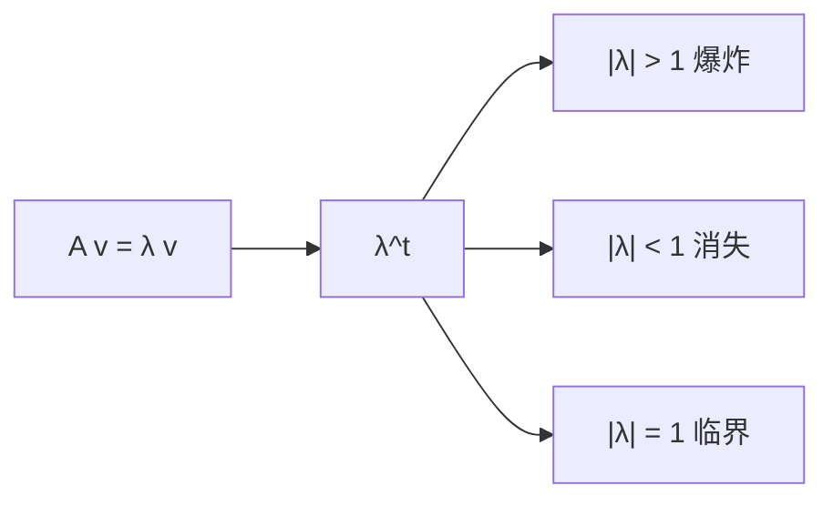

#### Dynamical system

每步乘同一个矩阵：

```text
x_{t+1} = A x_t  ⇒  x_t = Aᵗ x_0
```

若 A 可对角化，则 `Aᵗ = V diag(λᵢᵗ) V⁻¹`。每条特征轴独立乘自己的 `λᵢᵗ`。谱半径 `ρ(A) = max |λᵢ|` 决定长期行为。

| `|λ|` | `λᵗ` | system |
|-------|------|--------|
| `> 1` | grows | explode / unstable |
| `< 1` | → 0 | vanish / asymptotically stable |
| `= 1` | bounded（复特征值在单位圆上会振荡） | critical |

旋转的特征值是 `e^{±iθ}`，`|λ| = 1`：只转圈，不放大。`diag(2, 0.5)`：一条轴爆炸，一条轴消失。

数字例子：`A = diag(1.1, 0.9)`，`x₀ = [1, 1]`。

```text
1.1²⁰ ≈ 6.7       1.1¹⁰⁰ ≈ 13780
0.9²⁰ ≈ 0.12      0.9¹⁰⁰ ≈ 2.7e-5
```

走 100 步之后，`|λ| < 1` 的那个方向在数值上已经死了。

#### RNN

```text
h_t = tanh(W h_{t-1} + U x_t + b)
```

在 0 附近，`tanh` 的斜率约为 1，核心就是反复乘 `W`。长度为 T 的序列 ≈ `W^T`（把 W 连乘 T 次）。只要有一个 `|λ| > 1`，隐状态就会爆炸；若全部 `|λ| < 1`，早期 token 还没走到序列末尾就已经消失。

#### Gradients (BPTT)

反向按时间展开：

```text
∂L/∂h_0 = (∂L/∂h_T) J_T ⋯ J_1
```

线性化后 `J_t ≈ Wᵀ` 再乘 `tanh' ≤ 1`。

`|λ(W)| > 1` → 梯度爆炸（NaN）。全部 `|λ| < 1` 再加上 `tanh' < 1` → 梯度消失。

把某些有效 λ 钉在 1 附近的修法：LSTM / GRU 的恒等通路；残差 `I + W`；梯度裁剪（治症状）；Xavier / He 初始化。

若 `W` 不正规（非对称时常如此），所有特征值都可以落在单位圆内，但单步仍可能把某些向量暂时拉长。这时 `‖W‖₂`（最大奇异值）才是更紧的「一步最大拉伸」。本课先用特征值讲一阶故事。

**Spectral methods.** Graph neural networks use eigenvalues of the adjacency matrix. Spectral clustering uses eigenvalues of the Laplacian. The eigenvectors reveal the structure of the graph.

「谱」（spectrum）= 矩阵全部特征值的集合。把图写成矩阵，做特征分解，**不用 BFS/DFS 走遍每个点**，也能读出连通块、瓶颈、社区。细节在本课程后面的图论课（Phase 1 Lesson 21）；这里先把上面三句话拆开。

#### 两张矩阵：邻接 vs 拉普拉斯

对 n 个节点的无向图：

- **邻接矩阵 A**：`A_ij = 1` 表示有边。`A x` 在节点 i 上的分量 = 邻居值之和。所以 **A 就是一步消息传递**。`A^k_ij` = 从 i 到 j、长度为 k 的途径（walk）条数。
- **度矩阵 D**：对角线上是每个点的度数。
- **拉普拉斯 L = D − A**：Phase 1 Lesson 21 的核心对象。

三角形图：

```text
A = [[0, 1, 1],
     [1, 0, 1],
     [1, 1, 0]]

L = [[ 2, -1, -1],
     [-1,  2, -1],
     [-1, -1,  2]]
```

二次型把 L 的几何说死了：

```text
x^T L x = sum_{edges} (x_i - x_j)^2
```

x 在相邻节点上越接近，这个数越小。所以 L 的**小特征值对应图上最光滑的函数**：连在一起的点取值相近，被瓶颈隔开的点取值相反。

#### 拉普拉斯的谱（Phase 1 Lesson 21）

1. **L 半正定（PSD）**，特征值 `λ1 ≤ λ2 ≤ ⋯ ≤ λn` 全部 `≥ 0`。
2. **0 特征值的重数 = 连通分量个数。** 连通图恰好一个 0，对应全 1 向量（每个点赋值相同，`(x_i − x_j)^2 = 0`）。三块互不连的子图就有三个 0。
3. **第二小的特征值 λ2（Fiedler 值）= 代数连通度。** 很大：图抱得很紧。很小：中间有细腰，一剪就断。对应的 **Fiedler 向量** 正负号 = 最好的二分割：细腰两侧异号。

谱聚类步骤：

1. 对 L 做特征分解
2. 丢掉全 1 的那一列（`λ = 0`）
3. 取最小的几个剩下的特征向量，当作每个节点的坐标
4. 在这个坐标上做 k-means（k = 2 时，看 Fiedler 向量的正负号就够）

**为什么特征向量能露出结构：** 它们是「在图上变化最慢的那些赋值」。同一社区内部边多，赋值被迫接近；社区之间边少，赋值可以跳变。你看到的不是像素，是**连接关系被编码成了坐标。**

#### GNN 为什么盯着 A 的特征值

最简消息传递（Phase 1 Lesson 21）：

```text
H^(k+1) = sigma(Ã H^k W)
```

à 是归一化邻接。GCN（Kipf & Welling, 2017）用的是：

```text
à = D_hat^(-1/2) (A + I) D_hat^(-1/2)
```

一层 = 每个点看 1 跳邻居；k 层 = 看 k 跳。矩阵语言就是反复乘 Ã。

**谱观点：** 把图信号 x 放到拉普拉斯特征基下，`x = U xhat`。图上的卷积变成对每个频率乘一个增益 `g(λ_i)`：

```text
g(L) x = U g(Λ) U^T x
```

- 小 λ：低频，全图平滑的社区模式
- 大 λ：高频，相邻点差很大的细节 / 噪声

GCN 是这个滤波器的一阶低通近似：用归一化邻接把特征在边上抹平。所以课文写 *GNNs use eigenvalues of the adjacency matrix*：乘 A（或 Ã）= 在 A 的特征模式下加权。归一化邻接和对称拉普拉斯是同一条谱：

```text
L_sym = I - D^(-1/2) A D^(-1/2)
```

**Oversmoothing：** Ã 的最大特征值是 1（常数模式），其余 `|λ| < 1`。反复乘会把高频掐死，所有节点特征趋于同一个常数——图上的 vanishing。同一套 Stability 故事：反复乘同一个矩阵，`|λ| < 1` 的方向会消失。

也成立：d-正则图 `λ_max(A) = d`；A 或 L 的谱隙控制随机游走混合有多快（谱隙越大，走得越匀）。社区、二部性、瓶颈都会在 A 或 L 的特征值和特征向量上留下签名。

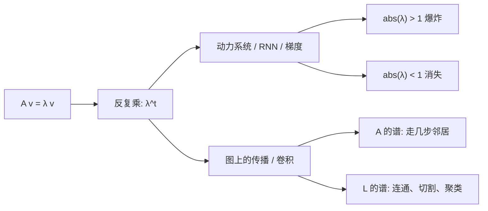

| | Stability | Spectral methods |
|---|---|---|
| 矩阵 | RNN 的 W 或雅可比 | 图的 A 或 L |
| 特征向量 | 隐状态里会活下来的方向 | 节点上的光滑赋值 / 社区坐标 |
| `abs(λ) > 1` | 输出和梯度爆炸 | 那一阶谐波被放大（GNN 里通常已归一化避免） |
| `abs(λ) < 1` | 信息与梯度消失 | 高频被抹平；层太多就 oversmoothing |
| `abs(λ) = 1` | 临界：振荡或恒等通路（残差 / LSTM） | 常数模式、连通分量 |

一句话：消息传递是乘 A；乘很多遍之后哪些模式还在，由 A 和 L 的谱决定。

### Determinant as volume scaling factor

The determinant of a transformation matrix tells you how much it scales area (2D) or volume (3D).

```text
det = 1:   area preserved (rotation)
det = 2:   area doubled
det = 0:   space crushed to lower dimension (singular)
det = -1:  area preserved but orientation flipped (reflection)

| det(Rotation) | = 1        (always)
| det(Scale sx, sy) | = sx * sy
| det(Shear) | = 1           (area preserved)
| det(Reflection) | = -1     (orientation flipped)
```

## Build It

### Step 1: Transformation matrices from scratch (Python)

```python
import math

def rotation_2d(theta):
    c, s = math.cos(theta), math.sin(theta)
    return [[c, -s], [s, c]]

def scaling_2d(sx, sy):
    return [[sx, 0], [0, sy]]

def shearing_2d(kx, ky):
    return [[1, kx], [ky, 1]]

def reflection_x():
    return [[1, 0], [0, -1]]

def reflection_y():
    return [[-1, 0], [0, 1]]

def mat_vec_mul(matrix, vector):
    return [
        sum(matrix[i][j] * vector[j] for j in range(len(vector)))
        for i in range(len(matrix))
    ]

def mat_mul(a, b):
    rows_a, cols_b = len(a), len(b[0])
    cols_a = len(a[0])
    return [
        [sum(a[i][k] * b[k][j] for k in range(cols_a)) for j in range(cols_b)]
        for i in range(rows_a)
    ]

point = [1.0, 0.0]
angle = math.pi / 4

rotated = mat_vec_mul(rotation_2d(angle), point)
print(f"Rotate (1,0) by 45 deg: ({rotated[0]:.4f}, {rotated[1]:.4f})")

scaled = mat_vec_mul(scaling_2d(2, 3), [1.0, 1.0])
print(f"Scale (1,1) by (2,3): ({scaled[0]:.1f}, {scaled[1]:.1f})")

sheared = mat_vec_mul(shearing_2d(1, 0), [1.0, 1.0])
print(f"Shear (1,1) kx=1: ({sheared[0]:.1f}, {sheared[1]:.1f})")

reflected = mat_vec_mul(reflection_y(), [2.0, 1.0])
print(f"Reflect (2,1) across y: ({reflected[0]:.1f}, {reflected[1]:.1f})")
```

### Step 2: Composition of transformations

```python
R = rotation_2d(math.pi / 2)
S = scaling_2d(2, 0.5)

rotate_then_scale = mat_mul(S, R)
scale_then_rotate = mat_mul(R, S)

point = [1.0, 0.0]
result1 = mat_vec_mul(rotate_then_scale, point)
result2 = mat_vec_mul(scale_then_rotate, point)

print(f"Rotate 90 then scale: ({result1[0]:.2f}, {result1[1]:.2f})")
print(f"Scale then rotate 90: ({result2[0]:.2f}, {result2[1]:.2f})")
print(f"Same? {result1 == result2}")
```

### Step 3: Eigenvalues from scratch (2x2)

For a 2x2 matrix `[[a, b], [c, d]]`, eigenvalues solve the characteristic equation: `lambda^2 - (a+d)*lambda + (ad - bc) = 0`.

```python
def eigenvalues_2x2(matrix):
    a, b = matrix[0]
    c, d = matrix[1]
    trace = a + d
    det = a * d - b * c
    discriminant = trace ** 2 - 4 * det
    if discriminant < 0:
        real = trace / 2
        imag = (-discriminant) ** 0.5 / 2
        return (complex(real, imag), complex(real, -imag))
    sqrt_disc = discriminant ** 0.5
    return ((trace + sqrt_disc) / 2, (trace - sqrt_disc) / 2)

def eigenvector_2x2(matrix, eigenvalue):
    a, b = matrix[0]
    c, d = matrix[1]
    if abs(b) > 1e-10:
        v = [b, eigenvalue - a]
    elif abs(c) > 1e-10:
        v = [eigenvalue - d, c]
    else:
        if abs(a - eigenvalue) < 1e-10:
            v = [1, 0]
        else:
            v = [0, 1]
    mag = (v[0] ** 2 + v[1] ** 2) ** 0.5
    return [v[0] / mag, v[1] / mag]

A = [[2, 1], [1, 2]]
vals = eigenvalues_2x2(A)
print(f"Matrix: {A}")
print(f"Eigenvalues: {vals[0]:.4f}, {vals[1]:.4f}")

for val in vals:
    vec = eigenvector_2x2(A, val)
    result = mat_vec_mul(A, vec)
    scaled = [val * vec[0], val * vec[1]]
    print(f"  lambda={val:.1f}, v={[round(x,4) for x in vec]}")
    print(f"    A@v = {[round(x,4) for x in result]}")
    print(f"    l*v = {[round(x,4) for x in scaled]}")
```

### Step 4: Determinant as volume scaling factor

```python
def det_2x2(matrix):
    return matrix[0][0] * matrix[1][1] - matrix[0][1] * matrix[1][0]

print(f"det(rotation 45) = {det_2x2(rotation_2d(math.pi/4)):.4f}")
print(f"det(scale 2,3)   = {det_2x2(scaling_2d(2, 3)):.1f}")
print(f"det(shear kx=1)  = {det_2x2(shearing_2d(1, 0)):.1f}")
print(f"det(reflect y)   = {det_2x2(reflection_y()):.1f}")

singular = [[1, 2], [2, 4]]
print(f"det(singular)     = {det_2x2(singular):.1f}")
print("Singular: columns are proportional, space collapses to a line.")
```

## Use It

NumPy handles all of this with optimized routines.

```python
import numpy as np

theta = np.pi / 4
R = np.array([[np.cos(theta), -np.sin(theta)],
              [np.sin(theta),  np.cos(theta)]])

point = np.array([1.0, 0.0])
print(f"Rotate (1,0) by 45 deg: {R @ point}")

S = np.diag([2.0, 3.0])
composed = S @ R
print(f"Scale(2,3) after Rotate(45): {composed @ point}")

A = np.array([[2, 1], [1, 2]], dtype=float)
eigenvalues, eigenvectors = np.linalg.eig(A)
print(f"\nEigenvalues: {eigenvalues}")
print(f"Eigenvectors (columns):\n{eigenvectors}")

for i in range(len(eigenvalues)):
    v = eigenvectors[:, i]
    lam = eigenvalues[i]
    print(f"  A @ v{i} = {A @ v}, lambda * v{i} = {lam * v}")

print(f"\ndet(R) = {np.linalg.det(R):.4f}")
print(f"det(S) = {np.linalg.det(S):.1f}")

B = np.array([[3, 1], [0, 2]], dtype=float)
vals, vecs = np.linalg.eig(B)
D = np.diag(vals)
V = vecs
reconstructed = V @ D @ np.linalg.inv(V)
print(f"\nEigendecomposition A = V @ D @ V^-1:")
print(f"Original:\n{B}")
print(f"Reconstructed:\n{reconstructed}")
```

### 3D rotations with NumPy

```python
def rotation_3d_z(theta):
    c, s = np.cos(theta), np.sin(theta)
    return np.array([[c, -s, 0], [s, c, 0], [0, 0, 1]])

def rotation_3d_x(theta):
    c, s = np.cos(theta), np.sin(theta)
    return np.array([[1, 0, 0], [0, c, -s], [0, s, c]])

point_3d = np.array([1.0, 0.0, 0.0])
rotated_z = rotation_3d_z(np.pi / 2) @ point_3d
rotated_x = rotation_3d_x(np.pi / 2) @ point_3d

print(f"\n3D point: {point_3d}")
print(f"Rotate 90 around z: {np.round(rotated_z, 4)}")
print(f"Rotate 90 around x: {np.round(rotated_x, 4)}")
```

## Ship It

This lesson builds the geometric foundation for PCA (Phase 2) and neural network weight analysis. The eigenvalue/eigenvector code built here is the same algorithm that powers dimensionality reduction, spectral clustering, and stability analysis in production ML systems.

## Exercises

1. Apply rotation, scaling, and shearing to a unit square (corners at [0,0], [1,0], [1,1], [0,1]). Print the transformed corners for each. Verify that rotation preserves distances between corners.

2. Find the eigenvalues of the matrix [[4, 2], [1, 3]] by hand using the characteristic equation. Then verify with your from-scratch function and with NumPy.

3. Create a composition of three transformations (rotate 30 degrees, scale by [1.5, 0.8], shear with kx=0.3) and apply it to 8 points arranged in a circle. Print before and after coordinates. Compute the determinant of the composed matrix and verify it equals the product of the individual determinants.

## Key Terms

| Term | What people say | What it actually means |
|------|----------------|----------------------|
| Rotation matrix | "Spins things" | An orthogonal matrix that moves points along circular arcs while preserving distances and angles. Determinant is always 1. |
| Scaling matrix | "Makes things bigger" | A diagonal matrix that stretches or compresses independently along each axis. Determinant is the product of scale factors. |
| Shearing matrix | "Slants things" | A matrix that shifts one coordinate proportionally to another, turning rectangles into parallelograms. Determinant is 1. |
| Reflection | "Mirrors things" | A matrix that flips space across an axis or plane. Determinant is -1. |
| Composition | "Do two things" | Multiplying transformation matrices to chain operations. Order matters: B @ A means apply A first, then B. |
| Eigenvector | "Special direction" | A direction that the matrix only scales, never rotates. The transformation's fingerprint. |
| Eigenvalue | "How much it stretches" | The scalar factor by which the matrix scales its eigenvector. Can be negative (flip) or complex (rotation). |
| Eigendecomposition | "Break the matrix apart" | Writing a matrix as V @ D @ V^(-1), separating it into its fundamental scaling directions and magnitudes. |
| Determinant | "A single number from a matrix" | The factor by which the transformation scales area (2D) or volume (3D). Zero means the transformation is irreversible. |
| Characteristic equation | "Where eigenvalues come from" | det(A - lambda * I) = 0. The polynomial whose roots are the eigenvalues. |

## Further Reading

- [3Blue1Brown: Linear Transformations](https://www.3blue1brown.com/lessons/linear-transformations) -- visual intuition for how matrices reshape space
- [3Blue1Brown: Eigenvectors and Eigenvalues](https://www.3blue1brown.com/lessons/eigenvalues) -- the best visual explanation of what eigenvectors mean geometrically
- [MIT 18.06 Lecture 21: Eigenvalues and Eigenvectors](https://ocw.mit.edu/courses/18-06-linear-algebra-spring-2010/) -- Gilbert Strang's classic treatment
