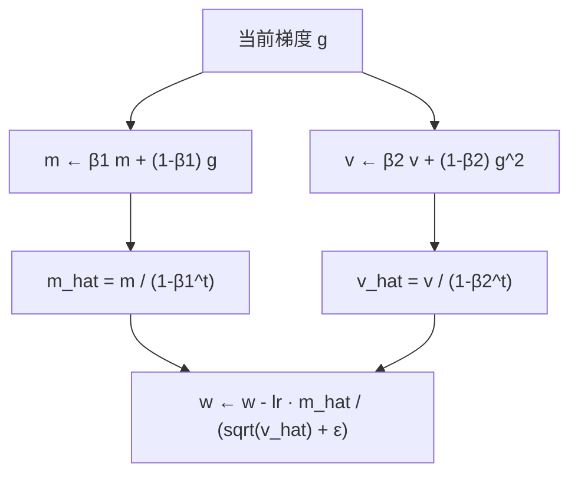
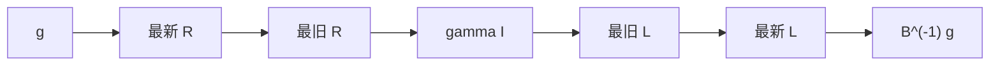
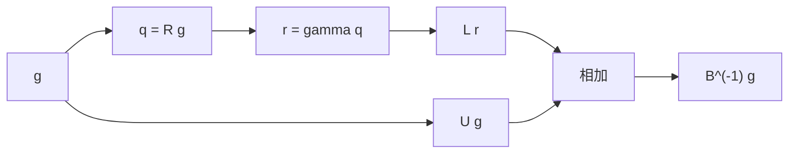
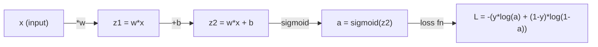
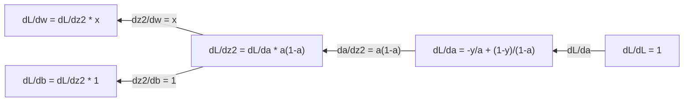
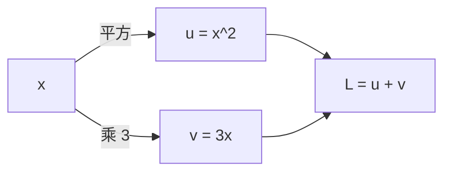
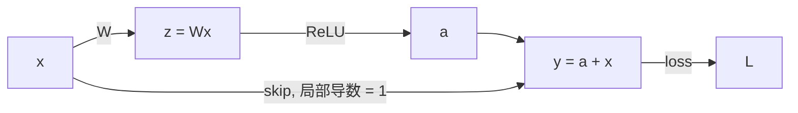
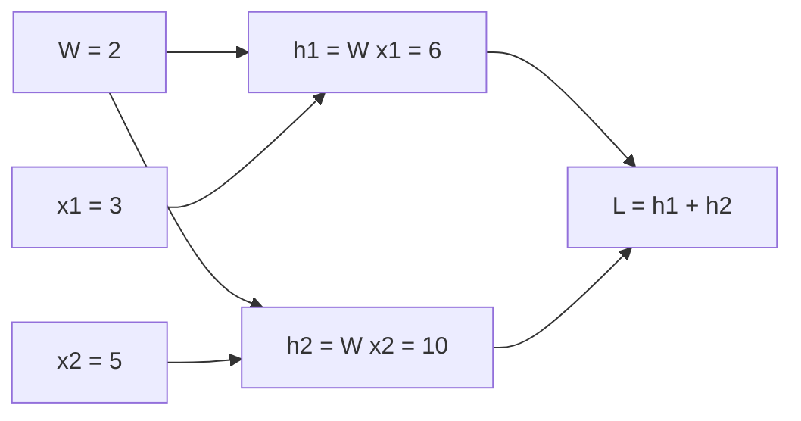
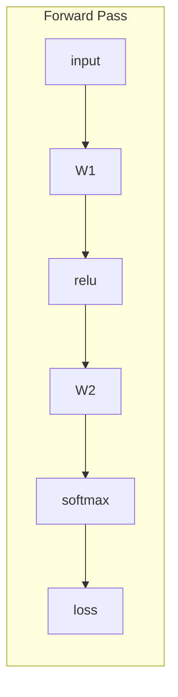
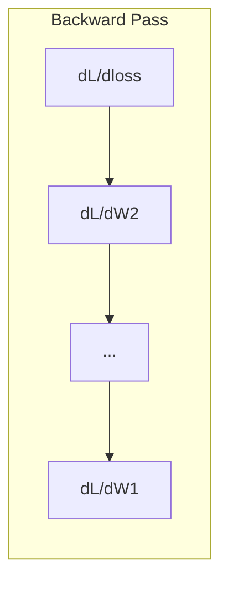

# Calculus for Machine Learning

> Derivatives tell you which way is downhill. That is all a neural network needs to learn.

**Type:** Learn
**Language:** Python
**Prerequisites:** Phase 1, Lessons 01-03
**Time:** ~75 minutes

## Learning Objectives

- Compute numerical and analytical derivatives for common ML functions (x^2, sigmoid, cross-entropy)
- Implement gradient descent from scratch to minimize a loss function in 1D and 2D
- Derive the gradient of a linear regression model and train it via manual weight updates
- Explain the Hessian matrix, Taylor series approximations, and their connection to optimization methods
- 将积分与期望风险、KL 散度、变分推断和 ELBO 联系起来
- 在计算图上使用多元链式法则：沿一条路径把局部导数乘起来，路径分叉再汇合时把贡献加起来（残差 / skip、权重共享）

## The Problem

You have a neural network with millions of weights. Each weight is a knob. You need to figure out which direction to turn every single knob to make the model slightly less wrong. Calculus gives you that direction.

Without calculus, training a neural network would mean trying random changes and hoping for the best. With derivatives, you know exactly how each weight affects the error. You turn every knob the right way, every time.

## The Concept

### What is a derivative?

A derivative measures the rate of change. For a function y = f(x), the derivative f'(x) tells you: if you nudge x by a tiny amount, how much does y change?

Geometrically, the derivative is the slope of the tangent line at a point.

**f(x) = x^2:**

| x | f(x) | f'(x) (slope) |
|---|------|---------------|
| 0 | 0    | 0 (flat, at the bottom) |
| 1 | 1    | 2 |
| 2 | 4    | 4 (tangent line slope at this point) |
| 3 | 9    | 6 |

At x=2, the slope is 4. If you move x a tiny bit to the right, y increases by about 4 times that amount. At x=0, the slope is 0. You are at the bottom of the bowl.

The formal definition:

```text
f'(x) = lim   f(x + h) - f(x)
        h->0  -----------------
                     h
```

In code, you skip the limit and just use a very small h. That is the numerical derivative.

### Partial derivatives: one variable at a time

Real functions have many inputs. A neural network loss depends on thousands of weights. A partial derivative holds all variables constant except one, then takes the derivative with respect to that one.

```text
f(x, y) = x^2 + 3xy + y^2

df/dx = 2x + 3y     (treat y as a constant)
df/dy = 3x + 2y     (treat x as a constant)
```

Each partial derivative answers: if I nudge just this one weight, how does the loss change?

### The gradient: vector of all partial derivatives

The gradient collects every partial derivative into one vector. For a function f(x, y, z), the gradient is:

```text
grad f = [ df/dx, df/dy, df/dz ]
```

The gradient points in the direction of steepest ascent. To minimize a function, go in the opposite direction.

**Contour plot of f(x,y) = x^2 + y^2:**

The function forms a bowl shape with concentric circles as contour lines. The minimum is at (0, 0).

| Point | grad f | -grad f (descent direction) |
|-------|--------|----------------------------|
| (1, 1) | [2, 2] (points uphill, away from minimum) | [-2, -2] (points downhill, toward minimum) |
| (0, 0) | [0, 0] (flat, at the minimum) | [0, 0] |

This is gradient descent in a picture. Compute the gradient, negate it, take a step.

### The connection to optimization

Training a neural network is optimization. You have a loss function L(w1, w2, ..., wn) that measures how wrong the model is. You want to minimize it.

```text
Gradient descent update rule:

  w_new = w_old - learning_rate * dL/dw

For every weight:
  1. Compute the partial derivative of loss with respect to that weight
  2. Subtract a small multiple of it from the weight
  3. Repeat
```

The learning rate controls step size. Too big and you overshoot. Too small and you crawl.

**Loss landscape (1D slice):**

The loss function L(w) forms a curve with peaks and valleys as the weight w varies.

| Feature | Description |
|---------|-------------|
| Global minimum | The lowest point on the entire curve -- the best solution |
| Local minimum | A valley that is lower than its neighbors but not the lowest overall |
| Slope | Gradient descent follows the slope downhill from any starting point |

Gradient descent follows the slope downhill. It can get stuck in local minima, but in high-dimensional spaces (millions of weights) this is rarely a practical problem.

### Numerical vs analytical derivatives

There are two ways to compute a derivative.

Analytical: apply calculus rules by hand. For f(x) = x^2, the derivative is f'(x) = 2x. Exact. Fast.

Numerical: approximate using the definition. Compute f(x+h) and f(x-h) for a tiny h, then use the difference.

```text
Numerical (central difference):

f'(x) ~= f(x + h) - f(x - h)
          -----------------------
                  2h

h = 0.0001 works well in practice
```

Numerical derivatives are slower but work for any function. Analytical derivatives are fast but require you to derive the formula. Neural network frameworks use a third approach: automatic differentiation, which computes exact derivatives mechanically. You will see that in Phase 3.

### Derivatives by hand for simple functions

These are the derivatives you will see over and over in ML.

```text
Function        Derivative       Used in
--------        ----------       -------
f(x) = x^2     f'(x) = 2x      Loss functions (MSE)
f(x) = wx + b  f'(w) = x        Linear layer (gradient w.r.t. weight)
                f'(b) = 1        Linear layer (gradient w.r.t. bias)
                f'(x) = w        Linear layer (gradient w.r.t. input)
f(x) = e^x     f'(x) = e^x     Softmax, attention
f(x) = ln(x)   f'(x) = 1/x     Cross-entropy loss
f(x) = 1/(1+e^-x)  f'(x) = f(x)(1-f(x))   Sigmoid activation
```

For f(x) = x^2:

```text
f(x) = x^2    f'(x) = 2x

  x    f(x)   f'(x)   meaning
  -2    4      -4      slope tilts left (decreasing)
  -1    1      -2      slope tilts left (decreasing)
   0    0       0      flat (minimum!)
   1    1       2      slope tilts right (increasing)
   2    4       4      slope tilts right (increasing)
```

For f(w) = wx + b with x=3, b=1:

```text
f(w) = 3w + 1    f'(w) = 3

The derivative with respect to w is just x.
If x is big, a small change in w causes a big change in output.
```

### The chain rule

When functions are composed, the chain rule tells you how to differentiate.

```text
If y = f(g(x)), then dy/dx = f'(g(x)) * g'(x)

Example: y = (3x + 1)^2
  outer: f(u) = u^2       f'(u) = 2u
  inner: g(x) = 3x + 1    g'(x) = 3
  dy/dx = 2(3x + 1) * 3 = 6(3x + 1)
```

Neural networks are chains of functions: input -> linear -> activation -> linear -> activation -> loss. Backpropagation is the chain rule applied repeatedly from output to input. That is the entire algorithm.

### The Hessian Matrix

The gradient tells you the slope. The Hessian tells you the curvature.

The Hessian is the matrix of second-order partial derivatives. For a function f(x1, x2, ..., xn), entry (i, j) of the Hessian is:

```text
H[i][j] = d^2f / (dx_i * dx_j)
```

For a 2-variable function f(x, y):

```text
H = | d^2f/dx^2    d^2f/dxdy |
    | d^2f/dydx    d^2f/dy^2 |
```

**What the Hessian tells you at a critical point (where gradient = 0):**

| Hessian property | Meaning | Example surface |
|-----------------|---------|-----------------|
| Positive definite (all eigenvalues > 0) | Local minimum | Bowl pointing up |
| Negative definite (all eigenvalues < 0) | Local maximum | Bowl pointing down |
| Indefinite (mixed eigenvalues) | Saddle point | Horse saddle shape |

**Example:** f(x, y) = x^2 - y^2 (a saddle function)

```text
df/dx = 2x       df/dy = -2y
d^2f/dx^2 = 2    d^2f/dy^2 = -2    d^2f/dxdy = 0

H = | 2   0 |
    | 0  -2 |

Eigenvalues: 2 and -2 (one positive, one negative)
--> Saddle point at (0, 0)
```

Compare with f(x, y) = x^2 + y^2 (a bowl):

```text
H = | 2  0 |
    | 0  2 |

Eigenvalues: 2 and 2 (both positive)
--> Local minimum at (0, 0)
```

**Why the Hessian matters in ML:**

Newton's method uses the Hessian to take better optimization steps than gradient descent. Instead of just following the slope, it accounts for curvature:

```text
Newton's update:    w_new = w_old - H^(-1) * gradient
Gradient descent:   w_new = w_old - lr * gradient
```

Newton's method converges faster because the Hessian "rescales" the gradient -- steep directions get smaller steps, flat directions get larger steps.

The catch: for a neural network with N parameters, the Hessian is N x N. A model with 1 million parameters would need a 1 trillion-entry matrix. That is why we use approximations.

| Method | What it uses | Cost | Convergence |
|--------|-------------|------|-------------|
| Gradient descent | First derivatives only | O(N) per step | Slow (linear) |
| Newton's method | Full Hessian | O(N^3) per step | Fast (quadratic) |
| L-BFGS | Approximate Hessian from gradient history | O(N) per step | Medium (superlinear) |
| Adam | Per-parameter adaptive rates (diagonal Hessian approx) | O(N) per step | Medium |
| Natural gradient | Fisher information matrix (statistical Hessian) | O(N^2) per step | Fast |

In practice, Adam is the default optimizer for deep learning. It approximates second-order information cheaply by tracking the running mean and variance of gradients per parameter.

#### 1. Hessian 判别法：正定 / 负定 / 不定

半正定 / 半负定（有特征值正好是 0）时判别法失效，那个方向是平的。

前提：这一点已经是临界点（`grad f = 0`）。否则 Hessian 只描述局部弯曲，不能单独说它是极值点。

对凸性：需要 **处处** Hessian 半正定，不只在一个点。

高维优化里：绝大多数临界点是鞍点。`n` 个特征值要全部为正才是局部最小，随机符号下概率大约 `2^(-n)`。

---

#### 2. 特征值是什么

定义：

```text
A v = λ v
```

- `v`：特征向量。这个方向被矩阵作用后，还在原来那条线上。
- `λ`：特征值。沿着这条线被拉成了几倍。

大多数方向会被矩阵拧歪。只有少数方向例外：乘完还在原方向上，只是变长、变短或反向。

课里的例子：

```text
A = [[2, 1],
     [1, 2]]
```

- `A (1, 0) = (2, 1)`：既拉长又转向。
- `A (1, 1) = (3, 3) = 3 (1, 1)`：`λ = 3`。
- `A (1, -1) = (1, -1) = 1 (1, -1)`：`λ = 1`。

任意一点都可以拆到这两条特征轴上，分别乘 3 和 1，再加回去。看起来像旋转，其实是两轴拉得不一样。

换到特征轴上看，`A` 就是 `diag(3, 1)`。

---

#### 3. Hessian 的特征值：弯曲方向

Hessian `H` 也是矩阵。它作用在「一小步的方向」上，告诉你：沿着这个方向走，函数弯曲的强度和方向。

在临界点附近（梯度为 0）：

```text
f(x + h)  ≈  f(x)  +  (1/2) * h^T H h
```

若 `h` 沿特征向量：`H v = λ v`，则

```text
h^T H h  =  λ * ||h||^2
```

| λ | 沿这个方向走一小步 | 曲面 |
|---|---|---|
| > 0 | 函数值升高 | 这方向像碗底 |
| < 0 | 函数值降低 | 这方向像倒扣的碗 |
| = 0 | 这一阶看不出升降 | 这方向几乎是平的 |

普通矩阵的特征值 = 空间被拉几倍。  
Hessian 的特征值 = 曲面沿这个方向弯几倍、往哪边弯。

数学形式一样，都是 `A v = λ v`；物理解释从「拉伸」换成「弯曲」。

##### 和第 5 节那条完整泰勒差在哪

完整的二阶近似永远是

```text
f(x + h)  ≈  q(h)  =  f(x)  +  (grad f)^T h  +  (1/2) * h^T H h
```

本节写的是它在**临界点**的特例：`grad f = 0`，中间那项消失，只剩弯曲。用来判别这点是碗底、山顶还是马鞍，不是用来走牛顿步。

这时若对 `h` 求梯度并令其为 0：

```text
grad_h q  =  H h  =  0
```

`H` 可逆时只能 `h = 0`：已经在驻点，本地抛物线的最低/最高点就是原地。牛顿法要处理的是**还没到**驻点的位置，线性项还在，见第 5、6 节。

---

#### 4. 如何求 Hessian（含三元、非常数）

定义：第 `i` 行第 `j` 列是「先对第 `j` 个变量求导，再对第 `i` 个变量求导」。

```text
H[i][j]  =  d^2 f / (d x_i  d x_j)
```

做法：先求梯度（一阶偏导），再对每个一阶偏导分别对各个变量再求一次导。二阶导连续时混合偏导相等，`H` 对称。

##### 二元例子

`f(x, y) = x^2 + 3xy + y^2`：

```text
H = | 2  3 |
    | 3  2 |
```

##### 三元

对 `f(x, y, z)`，Hessian 是 3×3。例：`f = x^2 + 2y^2 + 3z^2 + xy + xz`

```text
grad f  =  (2x + y + z,   4y + x,   6z + x)

H = | 2  1  1 |
    | 1  4  0 |
    | 1  0  6 |
```

`n` 元函数：Hessian 是 `n × n`。对称时约 `n(n+1)/2` 个独立量。

##### 二阶导可以不是常数

只有二次函数的 Hessian 处处相同。一般函数 `H` 随位置变。牛顿法每一步在**当前点**重新算 `H(x_k)`：

1. 算 `grad f(x_k)`
2. 把 `x_k` 代入二阶偏导，得到 `H(x_k)`
3. 解 `H(x_k) h = -grad f(x_k)`
4. `x_{k+1} = x_k + h`
5. 重复

一维例：`f(x) = x^4 / 4`，`f''(x) = 3x^2` 随 `x` 变。牛顿步：

```text
x  ←  (2/3) x
```

二元例：`f = e^x + y^2`，`H = diag(e^x, 2)`。在 `(0, 1)` 和 `(2, 1)` 处 `H` 不同。

注意：`H` 不可逆时要加阻尼或改用 GD；特征值为负时牛顿法可能冲向鞍点或极大值。

---

#### 5. 牛顿法公式从哪来

目标：最小化 `f`。在当前点用二次函数逼近 `f`，跳到这块二次曲面的最低点。

##### 一维

```text
f(x + h)  ≈  q(h)  =  f(x)  +  f'(x) * h  +  (1/2) * f''(x) * h^2
```

对 `h` 求导，令 `q'(h) = 0`：

```text
q'(h)  =  f'(x)  +  f''(x) * h  =  0

h  =  - f'(x) / f''(x)
```

中间这一步的代数和含义见第 7 节。

##### 多维

```text
f(x + h)  ≈  q(h)  =  f(x)  +  (grad f)^T h  +  (1/2) * h^T H h
```

当前点的 `f`、`grad f`、`H` 都已固定，唯一能选的是向量 `h`。和一维一样：要让本地二次曲面最低，对 `h` 求梯度并令其为 0（理由见第 6 节）。

`f` 对 `h` 是常数，导数为 0。`(grad f)^T h` 对 `h` 的梯度就是 `grad f`。对称矩阵上，`(1/2) h^T H h` 的梯度是 `H h`（下一小节）。于是

```text
grad_h q  =  grad f  +  H h  =  0

H h  =  - grad f

h  =  - H^(-1) * grad f
```

一维时 `H` 退化成数 `f''`，就是 `h = - f' / f''`。

若已经在临界点，`grad f = 0`，这条式子变回第 3 节的 `H h = 0`，即 `h = 0`。牛顿有用，正因为现在梯度还不是 0。

###### 为什么 `(1/2) h^T H h` 的梯度是 `H h`

设 `h ∈ R^n`（列向量）、`H ∈ R^{n×n}`，且 `H` 不随 `h` 变。记

```text
f(h)  =  (1/2) * h^T H h
```

目标：把微分写成标准形式 `df = (grad_h f)^T dh`，再读出梯度。

**第一步：提出常数。** `1/2` 不随 `h` 变。

```text
df  =  (1/2) * d(h^T H h)
```

**第二步：乘积法则。** 把 `h^T H h` 看成 `h^T`（`1×n`）乘 `(H h)`（`n×1`）。`d(uv) = du v + u dv`：

```text
d(h^T H h)  =  d(h^T) (H h)  +  h^T d(H h)
```

`d(h^T) = dh^T`。`H` 是常数矩阵，所以 `d(H h) = H dh`。于是

```text
d(h^T H h)  =  dh^T H h  +  h^T H dh
```

两项都是 `1×1`，即标量。

**第三步：把 `dh` 统一放到右边**，才能和 `df = (grad_h f)^T dh` 比较。

第一项 `dh^T H h` 已经是标量，标量等于自己的转置：

```text
dh^T H h  =  (dh^T H h)^T  =  h^T H^T dh
```

因为 `(ABC)^T = C^T B^T A^T`。又 `(H h)^T = h^T H^T`，所以

```text
dh^T H h  =  (H h)^T dh
```

第二项已经是 `dh` 在右侧。`(H^T h)^T = h^T H`，所以

```text
h^T H dh  =  (H^T h)^T dh
```

合起来：

```text
df  =  (1/2) * [ (H h)^T dh  +  (H^T h)^T dh ]
```

**第四步：合并。** `a^T dh + b^T dh = (a+b)^T dh`：

```text
df  =  [ (1/2) * (H h + H^T h) ]^T dh
    =  [ (1/2) * (H + H^T) h ]^T dh
```

与 `df = (grad_h f)^T dh` 比较：

```text
grad_h f  =  (1/2) * (H + H^T) h
```

`H` 对称时 `H^T = H`：

```text
grad_h f  =  (1/2) * (H + H) h  =  H h
```

关键：`h` 在表达式里出现两次，乘积求导产生两项；对称时两项相同，前面的 `1/2` 把重复约掉。

**为什么 `dh^T H h` 是标量**

矩阵乘法后的维度是 `1×1`。`h`、`dh` 都是 `n×1`，`dh^T` 是 `1×n`，`H` 是 `n×n`：

```text
dh^T     H      h
1×n     n×n    n×1

(1×n)(n×n) = 1×n
(1×n)(n×1) = 1×1
```

`1×1` 矩阵当作一个数。令 `v = H h`，则 `dh^T H h = dh^T v = sum_i dh_i v_i`，求和是标量。

**为什么 `dh ∈ R^{n×1}`**

`dh` 是向量 `h` 的无穷小变化，和 `h` 同维度。`h` 写成列：

```text
h   =  (h1, h2, ..., hn)^T     ∈ R^{n×1}
dh  =  (dh1, dh2, ..., dhn)^T  ∈ R^{n×1}
```

`h + Δh` 要能相加，`Δh` 必须与 `h` 同型；`dh` 是 `Δh` 的无穷小版本。这里默认列向量；若一开始把 `h` 定义成行，`dh` 也会是行。

回到牛顿步。已经有 `grad_h q = grad f + H h = 0`，所以

```text
x_new  =  x + h  =  x  -  H^(-1) * grad f
```

`H^(-1) * grad f` 不是新发明，只是在解 `H h = -grad f`。

若 `H` 在特征方向上对角：

```text
h_i  =  - g_i / λ_i
```

每个分量都是「该方向的斜率 ÷ 该方向的曲率」。

梯度下降只用一阶近似，线性函数没有最低点，必须人为加学习率：

```text
h  =  - η * grad f
```

对纯二次函数，二阶泰勒就是函数本身，牛顿法一步到最低点。一般函数只在局部像二次，需要迭代。

---

#### 6. 为什么对 h 求导并令其为 0

##### 为什么目标是「让函数值尽量变小」

因为这里的牛顿法是**优化**用的，不是用来解 `f(x) = 0`。

当前已经站在 `x`，下一步只能选一个位移 `h`，走到 `x + h`。优化的目标是

```text
选 h，使得 f(x + h) 尽量小
```

###### 为什么说 f 是损失

`f` 在数学上只是「一个要被最小化的函数」。叫它**损失**，是机器学习的习惯叫法，不是二阶泰勒或牛顿公式推出来的。

训练模型时，你先定义一个数：预测错得有多厉害。平方误差、交叉熵、负对数似然，都是这种数。约定：这个数**越大越糟**，于是训练 = 找参数让它变小。那个函数就被叫做 loss / 损失函数。本课后面的 Hessian、牛顿、L-BFGS、Adam，都是在对这个函数做最小化，所以笔记里把 `f` 叫损失。

它可以是别的名字，公式一字不改：

| 领域里的名字 | 仍是同一个数学问题 |
|---|---|
| 损失 / 代价 | 最小化训练误差 |
| 能量 | 物理里找能量最低的构型 |
| 负对数似然 | 最大化似然 = 最小化 `-log p` |
| 普通的 `f` | 习题里的 `f(x, y) = 5x^2 + y^2` 没有「错」，只是碗底在原点 |

关键只有一条：**我们选择了最小化**。若真正想最大化 `g`（准确率、似然），就改成最小化 `f = -g`，牛顿公式仍是 `h = -f'/f''`。

不是让 `h` 本身接近 0，也不是让 `f(x + h) = 0`。`f = 0` 只是这个函数恰好取到零的特例；一般最低点的函数值不必是 0。平方误差在完美拟合时可以是 0，交叉熵通常不是。

若是「求根牛顿」，目标才是 `f(x + h) = 0`，用的是 `f` 的切线。优化牛顿的目标是最低点，用的是 `f` 的本地抛物线，等价于对 `f'` 求根（见第 7 节）。两套牛顿不要混。

梯度下降也是同一个目标（让 `f` 变小），只是它只用斜率，所以必须自己塞一个学习率。牛顿多看了一层弯曲，才能直接解出「这一步该走多远」。

##### 为什么改成对 q 求导并令其为 0

真实的 `f` 不会整体求最小值：你不知道远处长什么样，也解不出 `arg min f`。所以只用当前点的泰勒，把 `f(x + h)` 换成本地抛物线

```text
q(h)  =  f  +  f' * h  +  (1/2) * f'' * h^2
```

目标从「最小化 `f(x+h)`」降成「最小化 `q(h)`」。`q` 是关于 `h` 的普通二次函数。

对固定的当前点 `x`，`f`、`f'`、`f''` 都是常数。唯一能选的变量是 `h`。

光滑函数的最低点切线水平，一阶导数为 0。所以对 **`q` 的自变量 `h`** 求导，令

```text
q'(h)  =  0
```

这不是对原来的 `f(x)` 求导（那个导数是 `f'`，当前点一般还不是最低点），而是问：在这块本地抛物线上，哪个 `h` 最低。

- `q'(h) > 0`：已经走过头
- `q'(h) < 0`：还能继续走
- `q'(h) = 0`：抛物线的底

若 `f''(x) > 0`，这个临界点就是最低点。`f'' < 0` 时同一个方程找到的是最高点，优化里通常不要。

多维完全同一逻辑，只是「对 `h` 求导」变成「对向量 `h` 求梯度」：

```text
q(h)      =  f  +  (grad f)^T h  +  (1/2) * h^T H h
grad_h q  =  grad f  +  H h
```

令 `grad_h q = 0` 得到 `H h = -grad f`。第 3 节那条没有线性项，是因为已经假定 `grad f = 0`；牛顿法不在那个设定里。

令 `q'(h) = 0` 之后，直接解出 `h = - f' / f''`。下一节把一维这一步拆开。

---

#### 7. 为什么一维牛顿是 h = - f' / f''

本地抛物线把「走一步 `h` 之后函数变成多少」写成：

```text
q(h)  =  f  +  f' * h  +  (1/2) * f'' * h^2
```

当前点已经定了，所以 `f`、`f'`、`f''` 都是数。唯一的未知量是步长 `h`。

对 `h` 求导（常数项消失，`h^2` 下来一个 `2`，和前面的 `1/2` 消掉）：

```text
q'(h)  =  f'  +  f'' * h
```

`q'(h)` 是这块抛物线的斜率。谷底切线水平，所以令它为 0：

```text
f'  +  f'' * h  =  0

f'' * h  =  - f'

h  =  - f' / f''
```

这就是一维牛顿步。不是另写的经验公式，只是「抛物线顶点」解出来的 `h`。

##### 两项各管什么

把式子读成「要走多远 = 现在的斜率 ÷ 斜率变化有多快」，再加一个方向：

| 符号 | 来源 | 作用 |
|---|---|---|
| 负号 | 把 `f'` 移到等式右边 | 往**下坡**走。`f' > 0` 时函数还在升，`h` 必须为负，`x` 往左 |
| 除以 `f''` | 把斜率的变化率除掉 | 按**弯曲**缩放。碗越弯（`\|f''\|` 越大），同样的斜率只需更小的一步 |

例子：`f' = 4`，`f'' = 2`（凸、碗口朝上）。斜率是 +4，每往右走 1，斜率大约再加 2。要把斜率从 4 降到 0，需要往**左**走 `4/2 = 2`，所以 `h = -2`。

##### 不求导也能看出来：抛物线顶点

二次函数 `a h^2 + b h + c` 的顶点在 `h = -b / (2a)`。这里

```text
a  =  (1/2) * f''
b  =  f'
```

代进去：

```text
h  =  - f' / (2 * (1/2) * f'')  =  - f' / f''
```

和令 `q'(h) = 0` 是同一件事。

##### 另一种看法：对 f' 做牛顿求根

最低点满足 `f'(x*) = 0`。所以最小化 `f`，就是找导数的根。

普通牛顿求根：用切线代替函数，切线与横轴的交点当下一步。现在被求根的函数是 `f'`，它的导数是 `f''`：

```text
f'(x)  +  f''(x) * h  =  0
```

还是 `h = - f' / f''`。最小化 `f` 和「把斜率打到 0」是一件事。

##### 和多维是同一个式子

```text
一维：  f'' * h     =  - f'
多维：  H h         =  - grad f
```

`f''` 就是 1×1 的 Hessian。两边同时「除以曲率」：

```text
h  =  - f' / f''     =     - H^(-1) * grad f
```

所以后面写的 `x ← x - H^(-1) grad f`，一维时就是 `x ← x - f'/f''`。

##### 这个除法什么时候坏掉

- `f'' = 0`：本地像一条直线，没有抛物线顶点，不能除。要改用梯度下降或加阻尼。
- `f'' < 0`：本地是倒扣的碗。令 `q'(h) = 0` 找到的是**最高点**，牛顿步会冲向极大值。最小化时通常要求（或强制）曲率为正。

---

#### 8. 为什么 x_new = x - f'(x) / f''(x)

因为 `h` 就是「从现在的 `x` 再走多远」：

```text
x_new  =  x + h
```

已经求出 `h = - f'(x) / f''(x)`，代进去：

```text
x_new  =  x  +  ( - f'(x) / f''(x) )
       =  x  -  f'(x) / f''(x)
```

负号来自「往下坡走」：若 `f' > 0`（正在上升），`h` 为负，`x` 要减小；再除以 `f''`，按弯曲程度缩放这一步有多长。

不是又做了一次新推导，只是把步长 `h` 加回 `x` 上。

---

#### 9. 牛顿法为什么更快：按曲率缩放梯度

梯度下降用同一个学习率；牛顿法用 Hessian 的逆，按每个方向的弯曲程度自动改步长。

```text
GD:      x  ←  x  -  η * grad f
Newton:  x  ←  x  -  H^(-1) * grad f
```

若 `H v = λ v`，则 `H^(-1) v = (1/λ) v`。沿特征轴：

```text
Δx_i  =  - g_i / λ_i
```

| 方向 | λ | 1/λ | 牛顿步 |
|---|---|---|---|
| 陡（碗很弯） | 大 | 小 | 步长变小 |
| 平（碗很浅） | 小 | 大 | 步长变大 |

课里的例子：`f = 50 x^2 + y^2`（或同类 `5 x^2 + y^2`），`H = diag(100, 2)` 或 `diag(10, 2)`。`x` 方向弯得厉害，`y` 方向很平。

从 `(10, 10)` 出发，对 `f = 50 x^2 + y^2`：梯度是 `(1000, 20)`。GD 几乎只往 `x` 猛冲；`η` 必须小到 `x` 不发散，用在 `y` 上又太慢。

牛顿一步：

```text
H^(-1) * grad f  =  (10, 10)
```

直接到原点。陡的 `x`：梯度 1000 除以 100 变成 10；平的 `y`：梯度 20 除以 2 也是 10。椭圆山谷被拉成圆。

条件数：

```text
κ  =  λ_max / λ_min
```

越大，山谷越瘦，GD 越痛苦。牛顿法对这种拉伸不敏感。

靠近最低点时二次收敛：误差大约每步平方一次。

代价：`H` 有 `n^2` 个元素，求逆约 `O(n^3)`。百万参数不可行。

---

#### 10. 牛顿法是不是只能处理二元函数

不是。1 个变量、2 个变量、任意多个变量都适用。二元只是为了好画碗和马鞍。

- 一维：`x ← x - f'(x) / f''(x)`（`f''` 是 1×1 Hessian）
- `n` 维：`x ← x - H^(-1) * grad f`

神经网络里 `n` 可以是几百万。公式仍成立，算力和内存不允许，所以用 Adam、L-BFGS 等近似。

---

#### 11. L-BFGS、Adam、自然梯度

三者都在近似牛顿法的 `H^(-1) * grad f`，但不敢形成完整 Hessian。

| 方法 | 近似什么 | 方向之间的耦合 | 典型场景 |
|---|---|---|---|
| 牛顿法 | 损失的真 Hessian `H(x)` | 完整 | 小凸问题 |
| L-BFGS | 用最近 `m` 步 `(Δx, Δg)` 拼 `H^(-1)` | 有限步历史里记得 | 逻辑回归等中等凸问题 |
| Adam | 对角：`1 / RMS(g_i)` | 不记得 | 深度学习默认 |
| 自然梯度 | Fisher `F = E[ (grad log p) (grad log p)^T ]` | 完整 Fisher 或分层近似 | 研究、大 batch、概率模型 |

##### 11.1 L-BFGS

Limited-memory BFGS。拟牛顿：不解析算二阶导，用

```text
y  ≈  H s

s  =  x_new - x
y  =  g_new - g
```

割线条件：更新后的 `B` 满足 `B s = y`，或 `B^(-1) y = s`。

不存 `n × n` 的 `B^(-1)`，只存最近 `m` 对 `(s, y)`。`m` 是记忆长度（常见 `5 ~ 20`）：记住多少步历史，不是参数下标。需要 `B^(-1) g` 时，用两层循环把这 `m` 次校正乘到 `g` 上。内存 `O(m n)`，每步也是 `O(m n)`。

深度学习很少用：mini-batch 噪声毁掉割线条件；非凸时 `B` 可能不正定。适合约 1 万参数以内的凸问题。

##### 11.2 Adam

全称 Adaptive Moment Estimation（Kingma & Ba, 2014）。动量加上按参数自适应步长。

普通梯度下降对所有参数共用一个学习率：

```text
w  ←  w  -  lr * g
```

神经网络里不同层的梯度量级可以差几个数量级。同一 `lr` 下：梯度大的参数一步跨过谷底，梯度小的几乎不动。

牛顿法的答案是乘 `H^(-1)`：陡的方向（大曲率）自动缩小步长，平的方向放大。完整 Hessian 是 `n × n`，几百万参数时存不下、也算不起。

Adam 的近似：每个参数只看自己，用「最近梯度有多大」代替曲率：

```text
牛顿:   Δw     =  - H^(-1) * g                 # 完整矩阵
Adam:   Δw_i   =  - lr * m_hat_i / (sqrt(v_hat_i) + ε)   # 只对角、逐元素
```

表里那句「对角：`1 / RMS(g_i)`，不记得」指的就是这个。

###### 每个参数跟踪的两个数

```text
m = β1 * m + (1 - β1) * g           # 动量
v = β2 * v + (1 - β2) * g^2         # 梯度平方的滑动平均

m_hat = m / (1 - β1^t)              # 偏差修正
v_hat = v / (1 - β2^t)

w  ←  w  -  lr * m_hat / (sqrt(v_hat) + ε)
```

默认：`lr=0.001, β1=0.9, β2=0.999, ε=1e-8`。

| 符号 | 名字 | 记住什么 |
|---|---|---|
| `m` | 一阶矩（动量） | 梯度的指数滑动平均：方向稳不稳 |
| `v` | 二阶矩 | 梯度平方的指数滑动平均：这个参数通常有多猛 |
| `t` | 步数 | 从 1 开始，给偏差修正用 |

`m`、`v` 初始全是 0。所有运算都是**逐元素**的：第 `i` 个参数的 `m_i`、`v_i` 只看 `g_i`，绝不看别的参数。这就是「没有坐标之间的相关」。和第 12 节 L-BFGS 的记忆长度 `m` 不是同一个字。



###### m：动量

```text
m  =  β1 * m  +  (1 - β1) * g
```

`β1 = 0.9` 时：新 `m` 里 90% 是旧动量，10% 是当前梯度。这是指数滑动平均（EMA），不是普通平均。

展开后，当前梯度的权重是 `(1-β1)`，上一步是 `(1-β1)β1`，再上一步是 `(1-β1)β1^2`……越远越淡。有效记忆大约 `1/(1-β1) = 10` 步。

作用和第 8 课的 momentum 一样：窄谷里梯度左右晃时，横向对冲、纵向累加，路径更直。和经典写法 `v = βv + g` 差一个 `(1-β1)` 缩放；偏差修正会把尺度拉回来，所以效果同类。

###### v：梯度能量 / RMS

```text
v  =  β2 * v  +  (1 - β2) * g^2
```

`g^2` 是逐元素平方，不是向量点积。`v_i` 只描述参数 `i` 自己「最近有多猛」。

`β2 = 0.999` 极高：新 `v` 里 99.9% 是历史，当前 `g^2` 只占 0.1%。有效记忆大约 `1/(1-β2) = 1000` 步。二阶矩要估计「这个参数平时的尺度」，必须看很长一段，不能跟着 mini-batch 噪声跳。

`sqrt(v)` 就是该参数梯度的 RMS（root mean square）。`v` 大：这个参数梯度经常很大 → 有效步长变小；`v` 小：梯度一直很小 → 有效步长变大。这就是自适应学习率。

历史位置：AdaGrad 把所有历史 `g^2` **累加**，分母只增不减，后期步长趋于 0。RMSProp 改成 EMA。Adam = RMSProp 的 `v` + 动量的 `m` + 偏差修正。

###### 为什么要偏差修正

`m`、`v` 从 0 起步。EMA 是「旧值占大头」，所以前很多步会被 0 往下拉，系统性地偏小。这叫 initialization bias。

###### 为什么 m_t = g * (1 - β1^t)

前提只有两条：`m` 从 0 起步，且这 `t` 步里把 `g` 当成常数。这是专门用来看偏差的，不是训练时的真假设。`v` 同理，把 `g` 换成 `g^2`、`β1` 换成 `β2`。

递推：

```text
m_0  =  0
m_t  =  β1 * m_{t-1}  +  (1 - β1) * g
```

t = 1（旧动量是 0）：

```text
m_1  =  β1 * 0  +  (1-β1) g
     =  (1-β1) g
```

t = 2（把 `m_1` 代进去）：

```text
m_2  =  β1 * m_1  +  (1-β1) g
     =  β1 * (1-β1) g  +  (1-β1) g
     =  (1-β1) g * (1 + β1)
```

t = 3：

```text
m_3  =  β1 * m_2  +  (1-β1) g
     =  β1 * (1-β1) g * (1 + β1)  +  (1-β1) g
     =  (1-β1) g * (1 + β1 + β1^2)
```

规律：第 `t` 步，当前 `g` 前面是 `(1-β1)`，上一步的 `g` 前面多乘一个 `β1`，再上一步再乘一个 `β1`……

```text
m_t  =  (1-β1) g  +  β1(1-β1) g  +  β1^2 (1-β1) g  +  …  +  β1^{t-1}(1-β1) g
     =  (1-β1) * g * (1 + β1 + β1^2 + … + β1^{t-1})
```

括号是首项 1、公比 `β1`、共 `t` 项的等比数列。只要 `β1 ≠ 1`（Adam 里 `β1=0.9`）：

```text
S        =  1 + β1 + β1^2 + … + β1^{t-1}
β1 S     =  β1 + β1^2 + … + β1^{t-1} + β1^t
S - β1 S =  1 - β1^t
S        =  (1 - β1^t) / (1 - β1)
```

代回：

```text
m_t  =  (1-β1) * g * (1 - β1^t) / (1 - β1)
     =  g * (1 - β1^t)
```

`(1-β1)` 和分母消掉了。

若 EMA 已经「走完」，`t → ∞` 且 `|β1| < 1`，则 `β1^t → 0`，所以 `m_∞ = g`。有限步时观测值是真值的 `(1 - β1^t)` 倍，系统性地偏小。所以：

```text
m_hat_t  =  m_t / (1 - β1^t)  =  g
```

常数梯度时，除完正好把 `g` 还原回来。

数值核对（`β1=0.9`，`g=0.5`，`t=1`）：

```text
m      =  0.1 * 0.5           =  0.05
v      =  0.001 * 0.25        =  0.00025

m_hat  =  0.05 / (1 - 0.9)    =  0.05 / 0.1    =  0.5     # 恢复成 g
v_hat  =  0.00025 / (1-0.999) =  0.00025 / 0.001 =  0.25  # 恢复成 g^2
```

不修正的话，第一步几乎原地踏步。

两种 β 的冷启动时长差很多：

| | β | `1 - β^t` 接近 1 的大致步数 |
|---|---|---|
| `m`（动量） | 0.9 | 大约 20–50 步 |
| `v`（二阶矩） | 0.999 | 几千步（`t=1000` 时 `1-0.999^1000 ≈ 0.63`） |

`β2=0.999` 时，二阶矩修正会管很久。这就是默认必须带 bias correction 的原因。

###### 更新式：真正迈出的那一步

```text
w  ←  w  -  lr * m_hat / (sqrt(v_hat) + ε)
```

- 方向由 `m_hat` 决定（平滑后的梯度，带符号，下山）。
- 尺度由 `sqrt(v_hat)` 除掉（这个参数平时有多猛）。
- `ε=1e-8` 防止 `v_hat ≈ 0` 时除零（长期没用到的参数、或梯度真的接近 0）。
- `lr` 仍是全局旋钮，但被 `m_hat / sqrt(v_hat)` 调到大约 `[-lr, lr]`。

关键恒等式：梯度相对稳定时，

```text
m_hat / sqrt(v_hat)  ≈  g / |g|  =  sign(g)
```

幅度消掉了，更新近似 sign SGD：

```text
w  ←  w  -  lr * sign(g)
```

所以同一套 `lr=0.001` 能同时打第一层和最后一层：梯度是 `1e-5` 还是 `1e2`，有效步长都大约是 `lr`。这是 Adam 对超参不敏感的根源。

有 mini-batch 噪声时：

```text
sqrt(v_hat)  ≈  RMS(g)  =  sqrt( Var(g) + (E[g])^2 )
m_hat        ≈  E[g]

m_hat / sqrt(v_hat)  ≈  均值 / 均方根     # 有点像信噪比，绝对值 ≤ 1
```

- 方向一致、噪声小：`|m_hat / sqrt(v_hat)| ≈ 1`，迈满 `lr`。
- 符号乱跳、方差大：`|m_hat| ≪ sqrt(v_hat)`，步长自动缩小。不可靠的方向少走。

###### 和牛顿 / Hessian 的关系

对对角 Hessian，牛顿步是：

```text
Δw_i  =  - g_i / H_ii
```

陡（`H_ii` 大）→ 步小；平 → 步大。

Adam 用 `sqrt(v_i) ≈ RMS(g_i)` 代替 `|H_ii|`：陡的方向梯度往往也大，`v` 大，步长被压住。`v_i` 估的是 `E[g_i²]`；损失是 NLL 时这像 Fisher 对角元 `F_ii`（见 11.3）。这是廉价对角替代，不是真曲率，也不记参数之间的相关。

| | 牛顿 | Adam |
|---|---|---|
| 用什么缩放 | 真二阶导 `H_ii` | 梯度 RMS |
| 参数耦合 | 有（非对角项） | 无 |
| 符号 / 不定 | `H` 可能不正定 | `sqrt(v)` 恒正，总能走 |
| 每步代价 | `O(n^3)` 或解线性方程 | `O(n)` |
| 对 mini-batch 噪声 | 很脆 | 设计上就为噪声服务 |

第 12 节的例子 `f = 5x^2 + y^2`、`H = diag(10, 2)`：`x` 比 `y` 陡 5 倍。牛顿会给 `x` 乘 `0.1`、给 `y` 乘 `0.5`。Adam 看见 `|g_x|` 通常更大，于是 `v_x` 更大、`x` 的有效步长更小——方向对，数值不是 `H^(-1)`。

L-BFGS 还用最近若干对 `(Δx, Δg)` 记住**方向之间的相关**；Adam 完全不记。非凸 + 小 batch 时，不记相关往往更稳。

###### 默认超参

| 超参 | 默认 | 含义 |
|---|---|---|
| `lr` | 0.001 | 全局步长。SGD 常用 0.01；Adam 里梯度幅度已被除掉，0.001 是另一量纲。`0.1` 对 Adam 经常直接炸。 |
| `β1` | 0.9 | 动量记忆约 10 步。太大则转向迟钝。 |
| `β2` | 0.999 | 二阶矩记忆约 1000 步。太小则 `v` 跟着噪声抖，步长不稳。 |
| `ε` | 1e-8 | 数值地板。 |

多数问题先别调 β。先调 `lr`（以及 schedule / warmup）。

深度学习默认用它：每步 `O(n)`；不同层梯度量级差很大时仍稳。有时 SGD+momentum 泛化更好——自适应步长容易走进更尖的极小值，尖极小值对数据扰动更敏感。AdamW 把权重衰减从损失梯度里拆出来、与自适应缩放分开施加，和「对角 Hessian 近似」不是同一件事；Transformer 默认用 AdamW，是正则化，不是换了一种曲率。

##### 11.3 自然梯度

普通梯度把 `||Δθ||_2` 当「一小步」。模型真正关心的是分布 `p_θ`。自然梯度限制 KL 很小，得到

```text
θ  ←  θ  -  η * F^(-1) * grad L
```

`F` 是 Fisher 信息矩阵，量的是「参数动一点点时分布会变多少」。对极大似然，`F` 等于负对数似然的期望 Hessian。

再参数化不变。完整 `F` 仍是 `n × n`。实用近似：K-FAC（按层 Kronecker 分解）。

###### 为什么欧氏距离不够用

`||Δθ||_2` 量的是参数空间里的一小步，但优化真正改变的是模型输出的分布 `p_θ`。同样大小的 `||Δθ||_2`，在不同方向上让分布改变的程度可以差很多。

例子：一维高斯 `p_θ(x) = N(x; μ, σ^2)`，参数 `θ = (μ, σ)`。

```text
σ = 10 时：  μ 从 0 走到 1     → 分布几乎没变（宽峰，挪一点看不出来）
σ = 0.01 时： μ 从 0 走到 1     → 分布几乎完全不重叠（窄峰，挪一点就跑出去了）
```

两次都是 `||Δθ||_2 = 1`（只动 `μ`），但对分布的影响天差地别。欧氏梯度下降在这两种情况下会迈出同样大小的一步，等价于用错了尺子。自然梯度换一把尺子：不量参数动了多少，量分布动了多少。

Bernoulli 上同一把错尺子更刺眼：两次都是 `Δθ = 0.01`。

```text
p:  0.50  →  0.51     分布几乎没变
p:  0.001 →  0.011    相对原来已经差了一个数量级，KL 大得多
```

欧氏长度一样；分布意义下第二步大得多。

###### 输出分布 `p_θ(y|x)` 才是模型

`θ` 只是坐标系。同一套预测可以写成 `σ` 也可以写成 `log σ`；同一层权重可以整体放大再靠后面的归一化吃掉。欧氏长度 `||Δθ||_2` 在这些坐标系里含义完全不同。模型拿来做预测、拿来跟数据比的，是「在这个输入下，各个输出有多可能」这张表：

```text
p_θ(y | x)
```

两套参数若给出同一张表，对数据来说是同一个模型。

| 写法 | `||Δθ||_2` | 分布 |
|---|---|---|
| `σ: 0.01 → 0.02` | `0.01` | 几乎没变 |
| `log σ: log 0.01 → log 0.02` | `≈ 0.69` | 同一件事 |
| 某层 `W → 2W`，后面 softmax / 归一化吃掉 | 很大 | 可以完全不变 |

分类：`p_θ(y|x)` 是各类概率。回归日常输出一个数 `ŷ = f_θ(x)`，底下通常仍是分布：

```text
y | x  ~  N( μ = f_θ(x) ,  σ² )
```

高斯密度取负对数，`σ` 固定时：

```text
- log p(y | x)  =  (y - μ)² / (2σ²)  +  常数
```

最小化 NLL = 最小化平方误差。所以 MSE 回归就是在最大化「高斯噪声」假设下的似然。用 MAE 则对应拉普拉斯。自然梯度说「模型是 `p_θ(y|x)`」：回归也是在动这条条件分布，不只是在动一个点估计。

###### KL 当作 φ 的函数：三项分别是什么

「分布动了多少」的标准度量是 KL。泰勒展开的三项不是在说训练损失，而是把 **KL 本身** 当成一个普通函数，再做第 5 节那套泰勒。

两个参数不要混：

- `θ` 冻住：你现在的模型
- `φ` 在动：你打算走到的新参数

```text
f(φ)  =  KL( p_θ  ||  p_φ )
```

读法：当前分布固定，新分布的参数改成 `φ` 时，两个分布差多少。`φ = θ` 表示新分布 = 旧分布。一维泰勒（和第 5 节同一个式子）：

```text
f(θ + Δθ)  ≈  f(θ)  +  f'(θ) * Δθ  +  (1/2) * f''(θ) * (Δθ)^2
```

右边三项分别是常数、斜率、弯曲。下面用 Bernoulli、冻住 `θ = 0.5`，把三个数都算出来。

Bernoulli 只有两个点，参数就是正面概率：

```text
p_θ(x=1)  =  θ          p_θ(x=0)  =  1 - θ
p_φ(x=1)  =  φ          p_φ(x=0)  =  1 - φ
```

离散 KL 是对每个点加权的对数比：

```text
KL(p_θ || p_φ)  =  Σ_x  p_θ(x) * log( p_θ(x) / p_φ(x) )
                =  θ * log(θ / φ)  +  (1-θ) * log( (1-θ) / (1-φ) )
```

冻住 `θ = 0.5`（公平硬币），只剩 `φ` 在动：

```text
f(φ)  =  0.5 * log(0.5 / φ)  +  0.5 * log(0.5 / (1-φ))
```

两个 `0.5` 是当前分布在两个点上的质量；`φ` 和 `1-φ` 是新分布给正面、反面的概率。这不是训练损失，是 `KL(p_{0.5} || p_φ)`。

**第 1 项：`f(θ) = 0`（碗底高度）**

把 `φ = 0.5` 代进去：

```text
f(0.5)  =  0.5 * log(0.5/0.5)  +  0.5 * log(0.5/0.5)
        =  0.5 * log(1)  +  0.5 * log(1)
        =  0
```

不是定理压出来的，是定义：同一个分布，对数比是 `log 1 = 0`。常数项是 0 = 碗底贴在横轴上。高度就是 `f` 的函数值；站在 `φ = 0.5` 时两个分布是同一个，所以高度是 0。

**第 2 项：`f'(θ) = 0`（碗底斜率）**

求导的对象就是 `f` 本身：当前分布冻住、新参数 `φ` 动的时候，KL 怎么变。这里的 `log` 是自然对数，`(log u)' = u'/u`。先把 log 拆开：

```text
f(φ)  =  0.5 * (log 0.5 - log φ)  +  0.5 * (log 0.5 - log(1-φ))
      =  log 0.5  -  0.5 log φ  -  0.5 log(1-φ)
```

`log 0.5` 是常数。两项分别求导：

```text
d/dφ [ -0.5 log φ ]         =  -0.5 / φ
d/dφ [ -0.5 log(1-φ) ]      =  +0.5 / (1-φ)     # 链式法则多一个 -1
```

```text
f'(φ)  =  -0.5 / φ  +  0.5 / (1-φ)
```

一般 Bernoulli（`θ` 不冻成 0.5）是：

```text
f'(φ)  =  - θ/φ  +  (1-θ)/(1-φ)
```

`θ = 0.5` 时代入 `φ = 0.5`：

```text
f'(0.5)  =  -0.5 / 0.5  +  0.5 / 0.5
         =  -1 + 1
         =  0
```

任意 `θ` 都一样：`f'(θ) = -1 + 1 = 0`。泰勒里 `f'(θ) * Δθ` 整项消失。

为什么必须是 0，不必先背「全局最小」：

1. KL 不能是负数（两个分布再像，差也 ≥ 0）
2. `f(θ) = 0` 已经摸到地板了

若 `f'(0.5) = 3 ≠ 0`，切线朝右上、朝左下。一阶近似：

```text
f(0.5 + Δφ)  ≈  0  +  3 * Δφ
```

`Δφ = -0.01` 时右边是 `-0.03`。KL 不许为负。`Δφ` 足够小时线性项压过 `(Δφ)²`，高阶项救不了。

「地板」就是横轴 `y = 0`。切线向右上就一定向左下——左右是同一条直线：

| `φ` | 切线给出的高度 | 在地板哪一侧 |
|---|---|---|
| `0.51` | `+0.03` | 地上 |
| `0.50` | `0` | 贴着 |
| `0.49` | `-0.03` | 地下 |

「穿到地板下面」= 函数值变成负数。关键是已经在高度 0：若高度是 5、斜率是 3，往左走变成 4.9，仍合法。


从左往右扫 `φ`：KL 先降到 0，再升回去。只有 `φ = θ` 时碰到地板。后面泰勒在这一点展开：常数项 0、一阶项 0，只剩二阶弯曲。

一般地：`f ≥ 0` 且某**内点** `f(x*) = 0`、并且**可导**，则 `f'(x*) = 0`（Fermat）。缺条件可以不成立：`|x|` 在 0 贴地板但不可导；定义域 `[0, +∞)` 上的 `f(x) = x` 在端点右导数是 1。Bernoulli 的 `φ ∈ (0, 1)` 且光滑，所以成立。

这和训练损失停在临界点 **不是一回事**。训练损失只在学到驻点时线性项才没（第 3 节）。这里对 **任意** 当前的 `θ` 都成立：你人在哪，`f(φ)` 都在 `φ = θ` 贴地板。所以任意位置都能用这个二次近似，不必先等到 `grad L = 0`。

**第 3 项：`f''(θ) = F(θ)`（碗有多弯）**

再求一次导：

```text
f''(φ)  =  θ/φ²  +  (1-θ)/(1-φ)²
```

在 `φ = 0.5`：

```text
f''(0.5)  =  0.5 / (0.5)²  +  0.5 / (0.5)²
          =  2 + 2
          =  4
```

一般点上：

```text
f''(θ)  =  1/θ  +  1/(1-θ)  =  1 / (θ (1-θ))
```

Bernoulli 的 Fisher 恰好是 `F(θ) = 1/(θ(1-θ))`，所以 `F(0.5) = 4`。不是先有 Fisher 再「声称」它等于二阶导：**KL 在碗底的弯曲，定义上就是 `F`**。多元时弯曲变成矩阵，二次项写成 `(1/2) Δθ^T F Δθ`，和第 3 节 `(1/2) h^T H h` 同一个形状。

泰勒变成

```text
f(0.5 + Δθ)  ≈  0  +  0  +  (1/2) * 4 * (Δθ)^2
             =  2 (Δθ)^2
```

`Δθ = 0.01` 时近似值 `0.0002`。真 KL：

```text
KL  =  0.5 * log(0.5/0.51) + 0.5 * log(0.5/0.49)
    ≈  0.000200
```

`Δθ` 再小会贴得更紧；误差是 `O(|Δθ|³)`。

`θ = 0.5` 的 Bernoulli，三行对照：

| 泰勒哪一项 | 符号 | 算出的值 | 在图上是什么 |
|---|---|---|---|
| 常数 | `f(θ)` | `0` | 碗底高度 |
| 一次 | `f'(θ) Δθ` | `0 * Δθ = 0` | 碗底斜率 |
| 二次 | `(1/2) f''(θ) (Δθ)^2` | `(1/2)*4*(Δθ)^2` | 碗有多弯 |

所以

```text
KL( p_θ || p_{θ+Δθ} )  ≈  (1/2) * F(θ) * (Δθ)^2
```

在这个例子里就是 `2 (Δθ)^2`。`F` 大 → 同样的 `Δθ`，碗更陡 → 分布已经变很多。`θ` 靠近 0 时 `F = 1/(θ(1-θ))` 很大（`θ = 0.01` 时 `F ≈ 101`，约为 `θ = 0.5` 处的 25 倍）：同一欧氏步长，边界附近分布被掀得更狠。

和第 3 节那只碗对照：

| | 损失的 Hessian `H` | Fisher `F` |
|---|---|---|
| 是谁的二阶导 | `L(θ)` | `φ ↦ KL(p_θ \|\| p_φ)` 在 `φ = θ` |
| 二次型含义 | 参数动一点，损失变多少 | 参数动一点，分布变多少（KL） |
| 一阶为何消失 | 优化走到了驻点（未必） | **处处** 在 `φ = θ` 消失（KL 的性质） |

「未必」：损失的泰勒是

```text
L(θ + Δθ)  ≈  L(θ)  +  (∇L)^T Δθ  +  (1/2) Δθ^T H Δθ
```

中间那项变成 0，当且仅当 `∇L(θ) = 0`。训练**进行中**你还在下山，线性项还在；牛顿法每步解的就是 `H Δθ = -∇L`。KL 则不论 `L` 的梯度是不是 0，只要 `φ = θ`（同一个分布），一阶都已经没了。

「Hessian `f` 在 `θ` 等于 `F(θ)`」并不总是一个数。`θ` 一维时碗底二阶导是一个数（本例 `f''(0.5) = 4`）。`θ` 是向量时 `f` 仍是标量，Hessian 是 `n × n` 矩阵，那个矩阵才是 `F(θ)`。二次型 `Δθ^T F Δθ` 才是一个数。

「本地二次型的矩阵」：二次型就是 `v^T A v`。本地 = 只在当前 `θ` 附近、泰勒的二阶那一项。KL 的本地二次型是 `(1/2) Δθ^T F Δθ`，矩阵就是 `F`。对照牛顿：损失的本地二次型是 `(1/2) Δθ^T H Δθ`，矩阵是 `H = ∇² L`。

`∇² L` 就是损失 `L` 的 Hessian：第 `(i,j)` 项是 `∂² L / (∂θ_i ∂θ_j)`。`∇ L` 是一阶（向量），`∇² L` 是再求一次导得到的矩阵。`H` 和 `∇² L` 是同一个东西。

```text
F  =  KL 散度在 θ 处的局部曲率（Hessian）
```

KL 在参数空间里画出的等高线不是圆，是被 `F` 拉伸过的椭圆——`F` 大的方向，参数稍微一动分布就变很多，这个方向要小步走；`F` 小的方向可以大步走。这就是「用分布的几何代替参数的几何」的精确含义。

###### 从 log p 展开：为什么二阶矩阵是 Fisher

上一小节把三个数算出来了。这里从定义推出：线性项为何消失、二次项的矩阵为何是 `F`。

```text
KL( p_θ || p_φ )  =  E_{x ~ p_θ} [ log p_θ(x) - log p_φ(x) ]
```

期望的测度是 **当前** 的 `p_θ`，不随 `φ` 变。第一项与 `Δθ` 无关。令 `φ = θ + Δθ`，对每个固定的 `x` 展开 `log p_φ`：

```text
log p_{θ+Δθ}(x)
  ≈  log p_θ(x)
     +  (grad log p_θ(x))^T Δθ
     +  (1/2) * Δθ^T (Hessian log p_θ(x)) Δθ
```

代入 KL：

```text
KL  ≈  E[  - (grad log p)^T Δθ  -  (1/2) * Δθ^T (Hessian log p) Δθ  ]
    =  - (E[grad log p])^T Δθ
       - (1/2) * Δθ^T E[Hessian log p] Δθ
```

`grad log p` 叫 **score**。任意合法密度对所有 `θ` 都积分为 1：

```text
∫ p_θ(x) dx  =  1
```

左边对每个合法 `θ` 都等于常数 1。把左边看成 `Z(θ)`，则 `grad Z = 0`。密度对 `θ` 足够光滑、积分收敛时，求导可以穿进积分：

```text
∫ grad p_θ(x) dx  =  0
```

`p` 是 `p_θ(x)` 的简写：固定 `x` 时这是一个正实数（概率/密度），不是向量。`θ` 可以是向量、可以在动——那是**输入**在变；输出始终是一个概率值。`grad p` 才是和 `θ` 同维的向量。

`grad p = p · grad log p` 是对数的链式法则。一维：`(log p)' = p'/p`，乘 `p` 即得 `p' = p (log p)'`。`θ = (θ_1, …, θ_n)` 时每个分量同一条公式，叠起来：

```text
∂p / ∂θ_i  =  p * (∂ log p / ∂θ_i)
```

`p ·` 是标量乘向量，不是点积。代进积分：

```text
∫ p_θ(x) (grad log p_θ(x)) dx  =  E_{p_θ}[ grad log p ]  =  0
```

中间那步是期望的定义：`E[g] := ∫ p g dx`（离散则换成求和）。不是 score 处处为 0，而是在模型自己的分布下正负抵消。因此线性项是 0。这和「KL 在 `φ = θ` 取最小」是同一件事：KL 对 `φ` 的梯度正好是 `-E_{p_θ}[grad log p_φ]`，在 `φ = θ` 处为零。

KL 现在只剩

```text
KL  ≈  - (1/2) * Δθ^T E[ Hessian(log p) ] Δθ
```

正则参数族有恒等式（推导见下一小节，从 `∫ p = 1` 再求一次导）：

```text
E[ Hessian(log p) ]  =  - E[ (grad log p) (grad log p)^T ]
```

右边按定义就是 Fisher，于是

```text
KL( p_θ || p_{θ+Δθ} )  ≈  (1/2) * Δθ^T F(θ) Δθ
```

三种说法是同一块矩阵：

```text
F  =  E[ (grad log p)(grad log p)^T ]     # score 的协方差
   =  - E[ Hessian(log p) ]                # 对数密度的期望曲率
   =  Hessian_φ KL(p_θ || p_φ) |_{φ=θ}    # KL 这只碗在底处的 Hessian
```

`Δθ^T F Δθ` 大，表示沿这个 `Δθ`，KL 这只碗弯得陡 → 分布已经变了很多。它量的不是参数欧氏长度，是分布流形上的本地长度。

反向 KL `KL(p_{θ+Δθ} || p_θ)` 的二阶展开是同一块 `F`；两边从三阶才分叉。自然梯度用的「一小步」在这个精度下不依赖 KL 方向。

###### Fisher 信息矩阵的两种等价定义

标准定义（score 的外积）：

```text
F  =  E_{x~p_θ} [ (∇_θ log p_θ(x)) (∇_θ log p_θ(x))^T ]
```

`∇_θ log p_θ(x)` 叫 score function：在 `x` 处，对数似然对参数的梯度。`F` 是 score 的协方差矩阵（可证明 `E[∇_θ log p_θ(x)] = 0`，所以外积的期望就是协方差）。

等价定义（负对数似然的期望 Hessian）：

```text
F  =  - E_{x~p_θ} [ ∇_θ^2 log p_θ(x) ]
```

两者相等的推导，从恒等式 `∫ p_θ(x) dx = 1` 出发，两边对 `θ` 求两次导：

```text
∇_θ ∫ p_θ(x) dx = 0
   →  ∫ ∇_θ p_θ(x) dx = 0
   →  ∫ p_θ(x) ∇_θ log p_θ(x) dx = 0        # 用 ∇log p = ∇p / p

再对 θ 求一次导（乘积法则）：
   ∫ [∇_θ p_θ(x)] [∇_θ log p_θ(x)]^T dx  +  ∫ p_θ(x) ∇_θ^2 log p_θ(x) dx  =  0

第一项里 ∇_θ p_θ = p_θ ∇_θ log p_θ，代回：
   ∫ p_θ(x) (∇_θ log p_θ)(∇_θ log p_θ)^T dx  =  - ∫ p_θ(x) ∇_θ^2 log p_θ(x) dx

即：  E[(∇log p)(∇log p)^T]  =  - E[∇^2 log p]
```

两项之和等于 0，是因为你在对一条**已经恒等于 0** 的式子再求导。记 `u(θ) := ∫ p s dx = E[s] = 0`（对所有合法 `θ`）。常函数 0 的导数还是 0。被积函数是 `p · s`，乘积法则拆出两项：

```text
∂/∂θ [ p · s ]  =  (grad p) s^T  +  p · Hessian(log p)
```

`grad p = p · s`，第一项变成 `p · s s^T`。积分后：

```text
∫ p (grad log p)(grad log p)^T dx  +  ∫ p Hessian(log p) dx  =  0
```

不是每个积分自己是 0：score 外积的期望一般是正定的 Fisher；Hessian 的期望是它的相反数。两个非零矩阵相加才消掉。

另一条路：对固定的 `x` 直接展开 `Hessian(log p)`。一维商法则：

```text
(log p)'   =  p' / p
(log p)''  =  p'' / p  -  (p' / p)²
```

多维对每个 `(i,j)` 同样：

```text
∂² log p / (∂θ_i ∂θ_j)
  =  (1/p) * ∂²p/(∂θ_i ∂θ_j)
     -  (∂ log p / ∂θ_i)(∂ log p / ∂θ_j)
```

排成矩阵：

```text
Hessian(log p)  =  Hessian(p) / p  -  (grad log p)(grad log p)^T
```

减号来自 `1/p` 自己还随 `θ` 变。取期望后第一项积掉：

```text
E[ Hessian(p)/p ]  =  ∫ Hessian(p) dx  =  Hessian(∫ p dx)  =  Hessian(1)  =  0
```

只剩 `- E[score score^T]`。和上面同一条恒等式。「正则」是说求导能穿进积分：支撑集不随 `θ` 变、`p > 0`、导数可积。常见指数族、softmax 分类都满足。

外积期望与 `-E[Hessian(log p)]` 是同一个矩阵 `F`。这也是「对极大似然，`F` 等于负对数似然的期望 Hessian」这句话的来源。注意期望是在 **模型分布 `p_θ`** 上取的，不是在训练数据上：

```text
牛顿的 H：     对训练损失 L 在当前 θ 处的真实二阶导
               （经验平均，数据固定，含残差对参数的二阶项）

Fisher F：     在模型分布下的期望 Hessian
               （「假如标签真是这个模型抽的，曲率平均是多少」）
```

模型设对、又已经在 MLE 附近时，两者接近。训练中途或模型设错时，它们会分道。自然梯度故意用分布几何，不用损失曲面的瞬时弯曲。

有监督网络通常写条件分布 `p_θ(y|x)`（分类 softmax、回归高斯）。Fisher 对数据里的 `x` 再平均一层，内层期望必须用 **模型自己的 `y`**：

```text
F  =  E_x E_{y ~ p_θ(·|x)} [ (grad log p(y|x)) (grad log p(y|x))^T ]
```

用训练集标签算出来的是 **empirical Fisher**，形状像，一般不等于真 Fisher。最小二乘 / 高斯似然下，真 Fisher 就是 Gauss-Newton 矩阵 `J^T J`：牛顿 Hessian 里丢掉「残差 × 二阶导」那一块。

`F` 天生半正定（外积形式一望而知），不像真实 Hessian 那样可能有负特征值、可能不定。这是自然梯度比牛顿法更「安全」的原因之一：`F^(-1) * grad L` 永远是一个合理的下降方向，不会像牛顿法那样在鞍点附近被负曲率带偏。

###### 从约束优化推出更新公式

真正想解的问题：当前在 `θ`，选一步 `Δθ`，让新损失尽量小，但新分布别离旧分布太远（`KL ≤ ε`）。`ε` 很小，是信赖域。直接用真 `L` 和真 KL 一般没有闭式解，两边都换成泰勒。

目标用损失的一阶近似：

```text
L(θ + Δθ)  ≈  L(θ)  +  (grad L)^T Δθ
```

`L(θ)` 对 `Δθ` 是常数，最小化它等于最小化 `(grad L)^T Δθ`。

约束用 KL 的二阶近似（一阶已是 0）：

```text
KL(p_θ || p_{θ+Δθ})  ≈  (1/2) Δθ^T F Δθ  ≤  ε
```

这是参数空间里的椭圆，不是圆。`≤ ε` 和等式 `= ε` 通常同一解：你想在预算内把损失降到最狠，最优会用满 `ε`。

```text
min_{Δθ}   L(θ) + (grad L)^T Δθ
s.t.       (1/2) Δθ^T F Δθ  ≤  ε
```

和普通 SGD 差在尺子：SGD 隐含 `||Δθ||_2² ≤ ε`（欧氏球），这里是 KL 椭圆。

拉格朗日（约束写成「≤ 0」，乘子 `λ ≥ 0`）：

```text
Λ(Δθ, λ)  =  L(θ) + (grad L)^T Δθ  +  λ [ (1/2) Δθ^T F Δθ  -  ε ]
```

对自由变量 `Δθ` 求导并令其为 0（和第 5、6 节对二次近似求导同一件事）。`F` 对称：

```text
∂/∂Δθ [ (grad L)^T Δθ ]        =  grad L
∂/∂Δθ [ (1/2) Δθ^T F Δθ ]      =  F Δθ
```

于是驻点条件：

```text
grad L  +  λ F Δθ  =  0
Δθ  =  - (1/λ) F^(-1) grad L
```

几何：`grad L` 是损失一阶近似的最速变化方向，`F Δθ` 是 KL 椭圆的法向。最优点上两者必须平行，否则还可以沿切向再滑，损失还能再降。`1/λ` 由「刚好碰到 `ε`」定，实际吸进学习率 `η`。

对照：普通 SGD 的约束是 `½ ||Δθ||₂² ≤ ε`，同一套手续得到 `grad L + λ Δθ = 0`，即 `Δθ ∝ -grad L`。这里多一个 `F`，是因为约束从欧氏球换成了 KL 椭圆。

```text
Δθ  =  - η * F^(-1) * grad L

θ  ←  θ  +  Δθ  =  θ  -  η * F^(-1) * grad L
```

和普通梯度下降 `θ ← θ - η * grad L` 只差一个 `F^(-1)`：普通梯度下降隐含约束是 `||Δθ||_2^2 = const`（欧氏球），自然梯度的约束是 `Δθ^T F Δθ = const`（KL 意义下的球）。

和牛顿法并排看：

```text
牛顿：     θ  ←  θ  -  H^(-1) * grad L     # H = 损失的 Hessian
自然梯度： θ  ←  θ  -  F^(-1) * grad L     # F = 分布流形上的度量
```

两者都是「用一个正定矩阵去缩放梯度」：曲率大的方向收步，曲率小的方向放大（第 9 节同一逻辑）。差别是弯的对象不同——`H` 弯损失，`F` 弯分布。两者一般不是同一个矩阵，只在负对数似然下，`F` 才等于损失 Hessian 在模型分布上的期望。

###### 再参数化不变性

这是自然梯度相对牛顿法、相对普通梯度下降最独特的性质。

普通梯度下降不具备这个性质：给参数换一种写法（比如把 `σ` 换成 `log σ`），同一个 `||Δθ||_2` 步长在新坐标系下对应的分布变化量完全不同，走出来的优化轨迹会变。

自然梯度不受影响。原因很直接：它优化的目标（KL）和约束（KL 限定在 `ε` 内）都直接定义在分布空间 `p_θ` 上，跟 `θ` 具体怎么参数化无关——只要重参数化光滑可逆，前后描述的是同一族分布，「让 KL 变化 `ε` 所需要走的那一步」在分布空间里的效果不变。

形式地：设 `θ = θ(ξ)`，`J = dθ/dξ`。普通梯度按链式法则变，

```text
grad_ξ L  =  J^T * grad_θ L
```

欧氏一步 `ξ ← ξ - η grad_ξ L` 和 `θ ← θ - η grad_θ L` **不是同一条路径**。换坐标就换算法。Fisher 按度量变换：

```text
F_ξ  =  J^T F_θ J
```

自然梯度：

```text
F_ξ^(-1) * grad_ξ L
  =  (J^T F_θ J)^(-1) * J^T * grad_θ L
```

推回 `θ` 空间，分布 `p` 的变化与用 `θ` 直接做自然梯度相同。坐标系只是标签；算法走的是分布流形上的同一条最速下降曲线。这也是为什么它在概率模型（VAE、策略梯度里的 TRPO/PPO 前身）里受欢迎：学 `σ` 还是学 `log σ` 是工程选择，不应该影响优化路径。

对照：牛顿法在**仿射**重参数化下不变（`φ = Aθ + b`），但对非线性重参数化（比如 `log σ`）不具备不变性，因为 `H` 是损失本身的曲率，不是分布的曲率。

###### 和牛顿法 / Adam 的对照

| | 牛顿法 | Adam | 自然梯度 |
|---|---|---|---|
| 缩放矩阵 | 损失的真 Hessian `H` | 对角 RMS(g) | Fisher `F` |
| 正定性 | 可能不定（鞍点） | 恒正 | 恒半正定 |
| 不变性 | 仿射重参数化不变 | 无 | 任意光滑重参数化不变 |
| 衡量的是 | 损失的曲率 | 梯度的历史幅度 | 分布的曲率（KL 度量） |
| 每步代价 | `O(n^3)` | `O(n)` | 完整 `F` 是 `O(n^3)`；K-FAC 后近似 `O(n)`~`O(n^2)`（按层） |

Adam 有时被说成「对角 Fisher 的廉价替代」：`E[g_i²]` 确实是 `F_ii` 的一种估计，但丢掉了全部相关，也没有 KL 约束那套几何。

`g = ∇_θ L` 是损失梯度，`g_i = ∂L / ∂θ_i`，`g_i²` 是这个数的平方（恒 ≥ 0，只衡量这个参数的梯度经常有多大）。`E[·]` 是平均：对数据，或对最近若干 step 做 EMA。Adam 的

```text
v_i  ←  β2 * v_i  +  (1 - β2) * g_i²
```

收敛后 ≈ `E[g_i²]`，更新时除以 `sqrt(v_i)`。

Fisher 对角元 `F_ii = E[(∂ log p / ∂θ_i)²]`。若 `L = -log p`，则 `g_i² = (∂ log p / ∂θ_i)²`，于是 `E[g_i²] = F_ii`。更精确：这是 **empirical Fisher**（对训练数据取期望）；真正的 Fisher 是对模型自己的 `p_θ` 取期望。Adam 用的是前者的廉价、对角、滑动平均版。完整 `F` 的非对角 `F_ij = E[g_i g_j]` 记参数之间的相关，Adam 不记。

L-BFGS 近似的是损失 Hessian 的逆，记住的是最近 `m` 步 `(s, y)`，不是分布流形上的度量。和第 11 节开头那张表同一对照：牛顿完整 `H`，L-BFGS 有限步历史，Adam 纯对角，自然梯度完整 `F` 或 K-FAC 的层内 Kronecker。

###### K-FAC：让 F 变得可求逆

完整 `F` 是 `n × n`，神经网络里 `n` 上百万，既存不下也求不了逆。K-FAC（Kronecker-Factored Approximate Curvature）的近似分两步：

1. **分块对角**：假设不同层之间的 Fisher 近似独立，`F` 近似成按层的分块对角矩阵，每块只描述一层自己的参数。
2. **每块做 Kronecker 分解**：对一层 `W`（输入激活 `a`，输出梯度 `δ`），这一层的 Fisher 块近似为两个小矩阵的 Kronecker 积：

```text
F_layer  ≈  E[a a^T]  ⊗  E[δ δ^T]  =  A ⊗ G
```

`A` 是这一层输入激活的二阶矩（尺寸只和该层输入维度有关），`G` 是这一层输出梯度的二阶矩（尺寸只和该层输出维度有关）。关键的代数技巧：Kronecker 积的逆可以拆成两个小矩阵的逆再拼起来：

```text
(A ⊗ G)^(-1)  =  A^(-1) ⊗ G^(-1)
```

作用在该层梯度 `dW` 上就是两次小矩阵乘，不必把 `W` 拉成巨大向量再乘：

```text
dW_nat  ≈  G^(-1) * dW * A^(-1)
```

于是原本要对一个 `(输入维度 × 输出维度)^2` 大小的矩阵求逆，变成对两个小得多的方阵 `A`（输入维度）、`G`（输出维度）分别求逆，代价从三次方砍到线性层各自维度的三次方之和，实际中比完整 `F` 便宜几个数量级。代价是丢掉了不同层之间的相关、以及层内「谁乘谁」以外的相关——这是近似，不是精确 Fisher。实践里还对 `A`、`G` 做滑动平均，并加阻尼 `F + λI`（Fisher 可能秩亏），用阻尼牛顿步而不是裸的 `F^(-1) g`。

###### 什么时候会用到自然梯度

日常训练神经网络几乎不会直接用（K-FAC 实现复杂、每步仍比 Adam 贵）。真正用到的地方：

- **强化学习策略梯度**：TRPO 就是「自然梯度 + 信赖域」的具体实现，PPO 是它的一阶近似替代品——都是因为策略是一个分布 `π_θ(a|s)`，"一步不要走太大"天然应该用 KL 而不是欧氏距离衡量。
- **变分推断 / VAE**：优化对象本身就是分布之间的 KL，自然梯度是几何上最自洽的选择。
- **小模型、高精度要求的凸/近似凸问题**：完整 `F` 可求时，收敛步数远少于一阶方法。

日常默认栈（尤其 Transformer）不用它。下一小节写原因。不是「没有分布」——下一词 softmax 就是 `p_θ(y|x)`，理论上完全可以写自然梯度。

###### 为什么 Transformer 里很少用自然梯度

卖点在这里用不上，K-FAC 的近似还不贴，工程上又和现在的训练栈打架。AdamW 已经把真正痛的尺度差处理掉了。

**卖点用不上。** 自然梯度最值钱的两件事：再参数化不变（学 `σ` 还是 `log σ` 不该改轨迹），以及用 KL 限制「分布别一步走太远」。Transformer 预训练几乎不踩这两坑。参数化是标准的（线性、注意力、RMSNorm），没人在改 `σ` 的写法。下一步预测的损失已经是交叉熵；要稳，靠的是 warmup、clip、Adam 的逐坐标缩放，不是显式 `F^(-1)`。

对比上一小节真正会用的场景：策略 `π_θ(a|s)`、VAE 的变分分布——优化对象本身就是分布，KL 步长是问题定义的一部分。监督语言模型不是。

RLHF 里出现的 KL（PPO / 相对 SFT 参考模型）是损失里加一项 `KL(π_θ || π_ref)`，不是把 `F^(-1)` 乘到梯度上。那是便宜的替代，不是自然梯度。

**K-FAC 的两层近似，注意力和残差都会拆掉。** K-FAC 靠两件事才便宜：层与层块对角（假装交叉项是 0）；一层之内 `F ≈ A ⊗ G`（激活与反传梯度近似独立，层是 `s = W a`）。Transformer 两边都不干净。

- **残差。** 每一层的输入是前面所有层的和。梯度沿捷径和主路同时走，层间 Fisher 交叉项并不小。块对角等于把最不该丢掉的耦合丢掉。
- **LayerNorm / RMSNorm。** 尺度被当场重标定。`A = E[a a^T]` 量的是「这一层看见的激活相关」，Norm 之后相关结构变了，还随 batch / 序列漂。K-FAC 的滑动平均 `A, G` 更不准。
- **注意力不是 `y = W a`。** `Q, K, V` 先投影，再 `softmax(Q K^T) V`。对 `W_Q` 的 Fisher，激活要穿过数据相关的注意力权重，不是静态外积。多头还把 `d_model` 切开。硬套 `A ⊗ G` 在 FFN 上勉强，在注意力上是错的几何。

所以：就算算得起，预条件矩阵也不是「分布流形上的曲率」，只是一块形状像 Fisher 的东西。

**工程上比 Adam 贵，而且和现在的训练栈打架。** 完整 `F` 对几亿～千亿参数不可能。K-FAC 每层仍要存、乘、求逆两个方阵。

| | AdamW | K-FAC |
|---|---|---|
| 额外状态 | 每个参数两个数 `m, v` | 每层密集的 `A, G` |
| 每步 | 逐元素，和参数同形状 | 矩阵逆 / 分解 |
| 分布式 | 张量并行下仍是局部更新 | `A, G` 要按完整激活维归约再逆 |
| 精度 | bf16 很稳 | 逆和分解在半精度里容易炸 |

现代 LLM 默认 bf16 / 低精度 + FSDP / 张量并行 + 几乎只训一个 epoch。密集 Kronecker 因子既占显存，半精度求逆还数值不稳。张量并行把一块 `W` 切到多卡上；`A`、`G` 却活在未切开的激活维度上，要拼起来再逆，和「每张卡只碰自己那一片」的 Adam 完全相反。

**统计上也吃亏：词表太大，数据太多。** 真 Fisher 的内层期望是模型自己抽的 `y`，不是标签。词表 3 万～10 万，对每个 token 按 `p_θ` 采样或对词表求和，比多一次反传还贵。用标签得到的是 empirical Fisher，训练早期模型还很错的时候偏差大。

LLM 典型设定是数据极大、每个样本几乎只见一次、相对小的 minibatch。二阶方法（K-FAC、Shampoo）在小数据上往往比 Adam 收敛快；数据大了，终点和速度都追不上 AdamW，有时还更差。和第 11.1 节 L-BFGS 不敢进深度学习同一原因：minibatch 噪声会毁掉你估计的曲率。

`F^(-1) g` 还不是损失 Hessian 的牛顿步。非凸、有残差、有注意力时，它保证的是「KL 意义下的最速下降」，不保证比 Adam 少很多 step。每步更贵、步数又省不回来，墙钟时间必输。

**AdamW 已经做了 Transformer 真正需要的那一部分。** 各层梯度量级差很大：embedding、注意力、FFN、输出头。11.2：Adam 用 `1 / RMS(g_i)` 做对角缩放，正是在处理这件事。自然梯度相对 Adam 多出来的，是坐标之间的相关（层内 Kronecker）。预训练里这件事的收益，没有大到能支付求逆和分布式的成本。默认栈变成：

```text
AdamW + warmup + cosine + clip + 权重衰减
```

再参数化不变、KL 信赖域，对 VAE / TRPO 是刚需；对「把交叉熵压下去」不是。

**后来真正试过「比对角更强」的，也不是经典自然梯度。** 有人在 Transformer 上找曲率，走的是更便宜的结构：

- **Shampoo / SOAP**：左右各乘一个预条件，像 Kronecker，但当自适应梯度，不为 KL 几何负责
- **Sophia**：对角 Hessian / 对角 empirical Fisher，专为 LLM 减步数
- **Muon**：对二维权重做正交化预处理，embedding 和输出头仍用 AdamW

这些说明层内相关有时有用，也说明经典 `F^(-1)` 自然梯度不是被选中的那个近似。大多数实验室预训练仍然是 AdamW。

一句话：Transformer 有分布，所以可以写自然梯度；但注意力 + 残差让 K-FAC 的几何是错的，低精度分布式让求逆用不起，海量数据让二阶优势消失，而 AdamW 已经把层间尺度差这件事做掉了。KL 若出现，是 RLHF 里当正则项，不是当 `F^(-1)`。

---

#### 12. L-BFGS 有限内存：一个完整数值例子

函数：`f(x, y) = 5 x^2 + y^2`。最低点原点。

先求真 Hessian，只是为了后面对照；L-BFGS **不会**用到它。

```text
grad f  =  (10x,  2y)

H  =  | 10  0 |   =   diag(10, 2)
      |  0  2 |
```

`x` 方向二阶导是 10（碗更陡），`y` 方向是 2（更平）。牛顿真正要乘的是逆：

```text
H^(-1)  =  diag(1/10, 1/2)  =  diag(0.1, 0.5)
```

两根轴该除的曲率不一样。L-BFGS 不知道这张矩阵，只能用 `(s, y)` 去拼。

##### 第一步：还没有历史，当梯度下降

`x_0 = (1, 1)`，`g_0 = (10, 2)`。学习率 `0.1`：

```text
x_1  =  (0, 0.8)
g_1  =  (0, 1.6)
```

留下一对：

```text
s_0  =  x_1 - x_0  =  (-1, -0.2)
y_0  =  g_1 - g_0  =  (-10, -0.4)
```

核一下：`H s_0 = (-10, -0.4) = y_0`。这一对编码的是：沿刚才那个方向，曲率大约是 10。

L-BFGS 不存 2×2 的 `B^(-1)`，只留这两个长度为 2 的向量。

两个标量当场算（几乎不占内存）：

```text
rho_0  =  1 / (y_0 · s_0)  =  1 / 10.08  ≈  0.0992

gamma  =  (s_0 · y_0) / (y_0 · y_0)  ≈  0.101
```

##### 第二步：两层循环算 `B^(-1) g_1`，不形成矩阵

和 BFGS 公式的关系（先看这三行，细节在第 14 节）：

```text
B^(-1) g  =  L (H0 (R g)) + U g

R g 就是向下循环的 q；H0 q 就是 r = gamma q；
L r + U g 合成向上循环那句 r + (α - β) s。
```

`g_1 = (0, 1.6)`。

向下循环（剥掉已学方向）：

```text
q  =  g1  =  (0, 1.6)

α  =  rho * (s · q)
   ≈  0.0992 * (-0.32)
   ≈  -0.0317

q  =  q - α * y
   ≈  (-0.317, 1.587)
```

乘初始猜测 `H_0 = gamma * I`：

```text
r  =  gamma * q
   ≈  0.101 * q
   ≈  (-0.032, 0.160)
```

这里的 `H_0` **不是**上面的真 Hessian `diag(10, 2)`。名字容易撞车：

| 符号 | 是什么 | 本节的值 |
|---|---|---|
| 真 `H` | 二阶导矩阵 | `diag(10, 2)` |
| 真 `H^(-1)` | 牛顿该乘的 | `diag(0.1, 0.5)` |
| 循环里的 `H_0` | 对 `H^(-1)` 的初始猜测 | `gamma * I ≈ 0.101 I` |

为什么要乘它：BFGS 公式中间必须有一个「还没见过的方向怎么办」的底。最便宜的底是各向同性——所有未知方向先按同一个 `1/曲率` 来除，也就是 `gamma * I`。剥掉已学方向之后剩下的 `q`，乘的就是这个底：`r = H_0 q = gamma q`。左右两块再把已学平面改成 `y → s`。

不能换成真 `H^(-1)`：那就是牛顿法，不需要 L-BFGS。也不能用 `I` 不乘 `gamma`：曲率大约是 10 时步长会大 10 倍。`gamma ≈ 0.101` 来自上一对 `(s, y)` 读出的 `1/曲率`（第 14 节）。

向上循环（按正确曲率加回）：

```text
β  =  rho * (y · r)
   ≈  0.0254

r  =  r + (α - β) * s
   ≈  (0.025, 0.171)
```

得到 `B^(-1) g_1 ≈ (0.025, 0.171)`。下一步：

```text
x_2  ≈  (-0.025, 0.629)
```

真牛顿会是 `H^(-1) g_1 = (0, 0.8)`。`m = 1` 对不上，因为只学会了陡轴的 `1/10`；平轴 `y` 还在用 `gamma * I`，`1.6 * 0.1 ≈ 0.16`，和 0.171 接近。

###### m 代表什么

`m` 是 L-BFGS 的**记忆长度**：最多存多少对 `(s, y)`。名字里的 Limited-memory 就是它。

```text
m  =  手里留着的 (s, y) 对数
```

每走一步多一对：`s_i = x_{i+1} - x_i`，`y_i = g_{i+1} - g_i`。只留最近 `m` 对，更老的扔掉。两层循环对每一对各剥一次、加一次。

| `m` | 记得什么 | 曲率信息 |
|---|---|---|
| `0` | 什么都没有 | 只能当 GD，或瞎用 `H_0 = I` |
| `1`（本节第二步） | 只有刚才那一对 `(s_0, y_0)` | 几乎只有陡轴的 `1/10`；平轴仍靠 `gamma I` |
| `2` | 再加后来的 `(s_1, y_1)` | 第二对才能碰到平轴曲率约 `2` |
| 真牛顿 | 完整 `H^(-1)` | 两根轴都精确：`diag(0.1, 0.5)` |

常见取值 `m = 5 ~ 20`，和参数个数 `n` 无关。内存和每步运算都是 `O(m n)`，不是 `O(n^2)`。

本节刚走完第一步，历史里只有一对，所以 `m = 1`。不是「只更新第一个参数」，也不是学习率。Adam 那段里的 `m` 是动量向量，和这里不是同一个字。

###### m 的数值由什么决定

**不是从数据里算出来的。** `rho`、`gamma` 每步由 `(s, y)` 当场除出来；`m` 是你事先选定的超参数，和牛顿步长无关。

开跑之前定一个上限，比如 `m = 10`。第 `k` 步实际用的对数是

```text
min(m,  已经走过的步数)
```

本节第二步只走了 1 步，哪怕把上限设成 20，手里也只有 1 对，行为仍是 `m = 1`。

选大选小看三件事，没有闭式解：

| 考虑 | `m` 偏小 | `m` 偏大 |
|---|---|---|
| 曲率 | 只记得最近几步走过的方向，其余靠 `gamma I` | 能覆盖更多独立弯曲方向，更接近真牛顿 |
| 代价 | 每步 `O(m n)` 更便宜，内存 `2 m n` 更小 | 点和乘都按 `m` 倍涨 |
| 噪声 / 非凸 | 旧的 `(s, y)` 本来就不准，少记反而稳 | 太旧的对会破坏割线条件，有时更糟 |

经验范围：

- 库的默认常常是 `10`（SciPy `scipy.optimize.fmin_l_bfgs_b` 的 `m=10`）
- 教材和实现里常见 `5 ~ 20`
- 本节这种 2 维二次函数，**理论上 `m = 2` 就够**（两对可以铺满平面）。再大也没有新方向可学
- `n` 很大时不会取 `m = n`：那就变成完整 BFGS，内存回到 `O(n^2)`，L 就没了

所以 `m` 由**内存预算**和**你愿意记住多少步曲率**决定，不由 `f''` 或特征值算出来。先用 `10`，内存紧就降到 `5`；要不要再升到 `20`，看下一小节怎么判断「学全没有」。

###### 怎么判断还有没有学全

实践里没有真 `H`，不能每步拿 `B^(-1) g` 去对牛顿。**学全**也不是「把 `n × n` 矩阵填满」——L-BFGS 永远只覆盖最近走过的那一小块子空间。它的意思是：当前真正在走的那些方向上，曲率已经够用，再加对也不改进。

能看的信号分三类。

**1. 有真牛顿可对照时（本节这种小例子）**

直接比步长：

```text
m = 1：  B^(-1) g_1  ≈  (0.025, 0.171)     真牛顿 (0, 0.8)      # 平轴没学到
m = 2：  B^(-1) g_2  ≈  (-0.021, 0.626)    真牛顿 (-0.025, 0.629)  # 已经贴上
```

差得远就还没学全；再加一对几乎不动，就够了。二维二次最多需要 2 对，再大 `m` 没有新方向。

**2. 没有真 H 时：看两层循环自己吐出的量**

向下剥完 `m` 对之后，剩下的 `q` 还要靠 `gamma I`。比较 `||q||` 和 `||g||`：

```text
||q|| / ||g||  很小   →  当前梯度几乎都落在已学平面里，这 m 对够用
||q|| / ||g||  接近 1 →  剥完还剩一大截，未知方向仍主导，可能没学全
```

也可以把上限从 `m` 改成 `2m` 跑同一步（或同一次优化）：若输出的 `r = B^(-1) g` 几乎不变，多出来的对是多余的。

注意：`||q||` 小只说明**这一步的 g** 被现有对覆盖了。下一步若拐进新方向，比率会再变大。所以要看一段窗口，不要只看单步。

**3. 真正干活时：看优化过程，不要看矩阵**

没有对照的 `H` 时，用这几条最管用：

| 现象 | 更可能是 |
|---|---|
| 把 `m` 从 5 加到 10、20，到同样 `\|\|g\|\|` 所需步数几乎不变 | 已经学全，再加大浪费 |
| 加大 `m` 之后明显少走许多步，或 `f` 下降更快 | 之前没学全，方向还不够 |
| 线搜索经常失败 / 步长被砍得很短 | `B^(-1)` 质量差：可能 `m` 太小，也可能太旧的对在捣乱（非凸、噪声）——这时试**减小** `m` |
| 步长看起来像普通 GD：各分量差不多按同一个 `gamma` 缩放 | 两层循环几乎没改 `H_0`，记忆没派上用场 |

最干净的实验：同一问题、同一起点，只改 `m ∈ {5, 10, 20}`，比「迭代次数 × 到容差」。曲线叠在一起就用小的；`20` 明显更好再留着。不要指望一个公式从特征值算出 `m`。

学不全时缺的不是「再算一次 `gamma`」，而是**还没走过的弯曲方向**。本节 `m = 1` 缺的是平轴；必须真的往那边走一步，留下 `(s_1, y_1)`，才会学到。加大 `m` 只保证「走过后还记得」，不能凭空补没走过的轴。

运算全是向量点积、加减、数乘，复杂度 `O(m n)`。这三步为什么等于 BFGS 公式、`rho` 为什么必须出现，见第 14 节「rho 在 BFGS 公式里」。

###### q、α、r、β 是什么

它们不是新的曲率，也不是要存进历史的 `(s, y)`。只是**这一次**算 `B^(-1) g` 时的草稿纸：两个向量在循环里被改写，两个标量把「这一对 `(s, y)` 该加减多少」记住。

| 符号 | 种类 | 从哪来 | 这一步的角色 |
|---|---|---|---|
| `q` | 向量 | 一开始等于 `g`，然后 `q ← q - α y` | 向下走时的工作向量。剥完已学方向后的「剩下的梯度」 |
| `α` | 标量 | `rho * (s · q)`，在改 `q` **之前**算 | 这一对要剥掉多少。后面加回时还要用，所以先存下来 |
| `r` | 向量 | 先 `r = gamma * q`，再 `r ← r + (α - β) s` | 向上走时的工作向量。循环结束时 `r` 就是 `B^(-1) g` |
| `β` | 标量 | `rho * (y · r)`，在加回 **之前**算 | 左块要从 `r` 里沿 `s` 减掉多少 |

和 BFGS 公式的对应（第 14 节）：

```text
α  :  右块 (I - rho y s^T) 的系数，q = g - α y
r  :  先乘 gamma，再被左块改写；最终等于 B^(-1) g
β  :  左块 (I - rho s y^T) 的系数
α - β : 左块减掉 β s 之后，还要加上最后一项 α s，合并成沿 s 加回 (α - β) s
```

四个量的差别：

- `q` 和 `r` 是**向量**，长度 `n`，和梯度一样长。`q` 在「梯度这一侧」工作（还没乘 `H_0`）；`r` 在「步长这一侧」工作（已经乘过 `1/曲率`）。牛顿要的就是把梯度变成步长，所以答案是最后的 `r`，不是 `q`。
- `α` 和 `β` 是**一个数**。形状相同，都是 `rho` 乘一个点积，只是点的对象不同：`α` 点的是 `(s, q)`，`β` 点的是 `(y, r)`。`rho` 已经含有 `1/(s · y)`，所以它们都是无量纲的系数，告诉你「沿 `y` 减多少、沿 `s` 加多少」。

用本节的数对号入座：

```text
g = (0, 1.6)          # 输入：当前梯度

q 先 = g
α ≈ -0.0317           # 数：这一对和 g 的耦合有多强
q 后 ≈ (-0.317, 1.587) # 向量：剥掉 α y 之后，和 s 正交的剩下梯度

r 先 ≈ (-0.032, 0.160) # 向量：剩下梯度 × gamma（未知方向的 1/曲率）
β ≈ 0.0254            # 数：左块要沿 s 收掉多少
r 后 ≈ (0.025, 0.171)  # 向量：加回 (α-β)s 之后，就是 B^(-1) g
```

`m > 1` 时还是这四个名字：每对 `(s_i, y_i)` 一个 `α_i`（向下时算完存着），向上时每对再算一个 `β_i`。`q`、`r` 始终各只有一份，被每一对依次改写。

##### m > 1 时怎么操作

`m = 1` 只有一层三明治。`m > 1` 不是换公式，是把同一层再套几次：每多一对 `(s, y)`，外面再包一层 `L_i … R_i`。

###### 存什么

最多 `m` 对历史，外加每对一个 `rho_i`。`gamma` 只由**最新**那一对算（仍然是那个标量 `1/曲率`）：

```text
历史：  (s_0, y_0), (s_1, y_1), …, (s_{m-1}, y_{m-1})   # 0 最旧，m-1 最新
rho_i = 1 / (y_i · s_i)
gamma = (s_{m-1} · y_{m-1}) / (y_{m-1} · y_{m-1})
H_0   = gamma * I
```

超过 `m` 对就把最旧的扔掉（先进先出）。不存任何 `n × n` 矩阵。

###### 公式：三明治套三明治

一对时：

```text
B^(-1)  =  L_0 H_0 R_0  +  （含在两层循环里的 U_0）
```

两对时，先用最旧的一对做成内层，再把最新的一对包在外面（BFGS 是递推更新）：

```text
B^(-1)  =  L_1 ( L_0 H_0 R_0 ) R_1   （U 项仍并进各层的左右块）
```

`m` 对就是 `m` 层。乘到 `g` 上必须从最右边开始：先乘最新的 `R`，再乘次新的 `R`，…，乘完所有 `R` 才乘 `H_0`，然后从最旧的 `L` 加回到最新的 `L`。这就是两层循环的方向。



###### 循环：对每一对各做一次同样的事

`q`、`r` 始终各只有一份。每对一个 `α_i`（向下时算完必须存着，向上还要用），向上时当场算 `β_i`。

```text
q = g

# 向下：从最新剥到最旧
对 i = m-1, m-2, …, 0：
    α_i = rho_i * (s_i · q)
    q   = q - α_i * y_i

r = gamma * q

# 向上：从最旧加回到最新
对 i = 0, 1, …, m-1：
    β_i = rho_i * (y_i · r)
    r   = r + (α_i - β_i) * s_i

输出 r   # 这就是 B^(-1) g
```

`m = 1` 时这个循环只跑一圈，就是前面的三步。

每一步仍是点积、数乘、加减，复杂度 `O(m n)`。

###### 接到本节例子：第二对补上平轴

`m = 1` 走出的步是 `B^(-1) g_1 ≈ (0.025, 0.171)`，于是

```text
x_2  ≈  (0, 0.8) - (0.025, 0.171)  =  (-0.025, 0.629)
g_2  =  (10 x, 2 y)               ≈  (-0.25, 1.258)
```

新的一对：

```text
s_1  =  x_2 - x_1  ≈  (-0.025, -0.171)
y_1  =  g_2 - g_1  ≈  (-0.25,  -0.342)
```

`s_1` 几乎沿平的 `y` 轴（分量比大约 `1 : 7`，和第一对的 `5 : 1` 相反）。核一下仍有 `H s_1 = y_1`。最新一对读出的

```text
gamma  =  (s_1 · y_1) / (y_1 · y_1)  ≈  0.36
```

从 `0.10`（陡轴 `1/10`）跳到更接近平轴的 `1/2 = 0.5`。

现在 `m = 2`，对 `g_2` 跑上面的循环：先用 `(s_1, y_1)` 剥，再用 `(s_0, y_0)` 剥，乘新的 `gamma`，再按 0、1 的次序加回。得到的 `B^(-1) g_2` 大约是 `(-0.021, 0.626)`。真牛顿是

```text
H^(-1) g_2  =  (-0.25 / 10,  1.258 / 2)  =  (-0.025, 0.629)
```

两对已经几乎贴上。`m = 1` 时差在平轴；第二对把平轴曲率补进记忆，三明治外层就会改这块。

若上限就是 `m = 2`，再走一步会扔掉最旧的 `(s_0, y_0)`，只留最近两对。二维问题两对已经够铺满；`n` 很大时 `m = 5 ~ 20` 只覆盖最近走过的那一小块子空间，其余方向继续用 `gamma I`。

`n = 10^6`、`m = 10`：完整 `B^(-1)` 约 `10^12` 个数；L-BFGS 只存 `2 m n = 2 * 10^7` 个数。

---

#### 13. 为什么 H s = y

##### 左边：`H s_0 = (-10, -0.4)` 怎么乘出来的

`H = diag(10, 2)` 是对角的，乘向量就是各分量各自缩放：

```text
H s_0  =  | 10  0 |   | -1   |   =   | 10 * (-1)    |   =   (-10, -0.4)
          |  0  2 |   | -0.2 |       |  2 * (-0.2)  |
```

##### 右边：为什么等于 `y_0`

Hessian 的含义：梯度怎么随位置变。

```text
grad f(x + s)  ≈  grad f(x)  +  H s

y  =  Δg  ≈  H s
```

这是割线条件的来源。二次函数上 `H` 是常数，近似变成恒等：

```text
g_0  =  (10, 2)
g_1  =  (0, 1.6)
y_0  =  (-10, -0.4)  =  H s_0
```

一般非二次函数只有 `y ≈ H s`。L-BFGS 仍用这对近似当曲率。

下一节会用到：两边再和 `s` 做点积，得到 `y · s = s^T H s`。

---

#### 14. rho 和 gamma 是什么、从哪来

前面讲 L-BFGS 时只说存 `(s, y)` 和两层循环。`rho`、`gamma` 是循环里的两个**系数**，不是新的状态向量。由当前 `(s, y)` 当场算出来。

##### 一维原型

先把维度说清楚，否则 `s / y` 和「推广成标量」会对不上。

**在一维里，`1 / f''` 就是标量。** `f` 只有一个变量时，二阶导 `f''` 是一个数，不是矩阵。牛顿步 `h = - f' / f''` 里的除法是普通除法。

走一步后，梯度变化 `y` 和位移 `s` 也是数，并且

```text
y  ≈  f'' * s
```

两边都是数，可以两边相除：

```text
1 / f''  ≈  s / y
```

`s / y` 在一维里已经是一个数，没有「再变成标量」这一说。一维退化：

```text
gamma  =  s / y          # 已经是标量，等于 1/f''
rho    =  1 / (y * s)    # 也已经是标量
```

**到了多维，对应物不再是标量。** 曲率是 Hessian 矩阵 `H`，牛顿法要的是整张逆矩阵 `H^(-1)`：

```text
一维：  y  ≈  f'' * s          1/曲率 = 1/f''     （一个数）
多维：  y  ≈  H s              1/曲率 = H^(-1)    （n × n 矩阵）
```

向量不能做 `s / y`：`s`、`y` 各有 `n` 个分量，除法没有唯一定义。`H^(-1)` 也不是一个数。

L-BFGS 偏不肯形成这张矩阵。对**已经走过的方向**，用 `(s, y)` 加 `rho` 做精细校正（记住「这个方向该怎么映射」）。对**还没见过的方向**，手里没有任何一对 `(s, y)`，只好先假设「各个方向弯得差不多」，用**一个**数去当统一的 `1 / 曲率`：

```text
H_0^(-1)  ≈  gamma * I
```

`gamma` 干的事：把一维里那个现成的标量 `s / y`，在多维里改写成「最接近 `s / y` 的一个数」。不是把 `1/f''` 从矩阵压成标量——一维的 `1/f''` 本来就是标量——而是用一个标量去**冒充**多维的 `H^(-1)`。

| | 一维 | 多维真牛顿 | L-BFGS 对未知方向 |
|---|---|---|---|
| 曲率 | `f''`（数） | `H`（矩阵） | 还不知道 |
| 1 / 曲率 | `1/f''`（数） | `H^(-1)`（矩阵） | `gamma * I`（一个数 × 单位阵） |
| 从 `(s, y)` 读出 | 直接 `s / y` | 一个 `(s, y)` 不够定完整 `H` | 一个数 `gamma` |

下一小节 `y · s` 解释 `rho` 为什么用点积；再下一小节说明多维里那个数 `gamma` 具体怎么从两个向量算出来。

##### `y · s` 是什么

```text
y_0 · s_0  =  (-10)*(-1) + (-0.4)*(-0.2)
           =  10 + 0.08
           =  10.08
```

###### 为什么 `y = H s` 能推出 `y · s = s^T H s`

`s^T H s` 看起来像三个东西连乘，其实是两步，中间没有新运算：

```text
s^T H s   =   s^T (H s)   =   s · (H s)
```

1. `H s` 先算：矩阵乘向量，得到**另一个向量**（和第 13 节的 `y` 同长度）。
2. 再左乘 `s^T`：行向量乘列向量，就是和 `s` 做**点积**。

第 13 节已经有 `y = H s`，代入第 2 步：

```text
s^T H s  =  s · (H s)  =  s · y
```

点积可交换：`s · y = y · s`。于是

```text
y · s  =  s^T H s
```

没有用到别的公式。`y · s` 是两个向量的点积；`s^T H s` 是「先用 `H` 作用在 `s` 上，再和 `s` 做点积」。`y` 正好就是那个被 `H` 作用过的向量。

用本节的数核一遍。先算 `H s`（第 13 节已经算过）：

```text
H s_0  =  (-10, -0.4)  =  y_0
```

再和 `s_0` 点积：

```text
s_0 · (H s_0)  =  (-1)*(-10) + (-0.2)*(-0.4)
               =  10 + 0.08
               =  10.08
```

和上面直接算的 `y_0 · s_0` 是同一个 10.08。对角 Hessian 上也可以把二次型拆开写，结果仍相同：

```text
s^T H s  =  10 * (-1)^2  +  2 * (-0.2)^2
         =  10 + 0.08
         =  10.08
```

三种写法（`y · s`、`s · (H s)`、`s^T H s`）是同一个数。

含义：沿 `s` 走时，二次型给出的弯曲强度。后面第 15 节会把 10.08 拆到两根轴上看。

```text
rho  =  1 / (y · s)  ≈  1 / 10
```

弯曲越强，校正权重越小。对应牛顿法里除以 `f''`。

##### gamma：未知方向的初始缩放

还没见过的方向假设各向同性：对**逆 Hessian** 的初始猜测是 `H_0 = gamma * I`（这里的 `H_0` 不是真 Hessian）。`gamma` 必须是**一个数**：单位阵前面只能乘标量，这样每个未知方向都先按同一个 `1 / 曲率` 来除。

`gamma` 不能取 1（曲率是 10 时步长会大 10 倍）。要用最近一次观察到的 `1 / 曲率`。一维时就是 `s / y`；多维时 `s`、`y` 是向量，不能相除，改成：找一个数 `gamma`，让

```text
gamma * y  ≈  s
```

###### 一维：两边乘 y，就是 `s / y`

一维里 `gamma = s / y` 和 `gamma * y = s` 是同一句话。两边再乘一次 `y`（普通乘法）：

```text
gamma * y      =  s
gamma * y * y  =  s * y
gamma          =  (s * y) / (y * y)  =  s / y
```

最后一步只是约掉一个 `y`。写成 `(s * y) / (y * y)` 看起来啰嗦，但这个形状能直接搬到多维。

###### 多维：两边不能除，改成和 y 做点积

`gamma * y = s` 现在是向量等式，有 `n` 个分量、只有 1 个未知数 `gamma`。一般无解：一个数去缩放 `y`，得到的 `gamma * y` 仍在 `y` 所指的那条直线上；若 `s` 不在这条直线上（`s` 和 `y` 不平行），等式两边对不上。

一维「两边乘 y」搬过来：向量没有普通乘法，对应运算是**点积**（两边都和 `y` 点一下）。点积把向量变成数，未知数就只剩 `gamma` 了：

```text
gamma * y          ≈  s                 # 两边都是向量，一般不能精确相等

两边和 y 做点积：

gamma * (y · y)    =  s · y             # 两边都变成数
gamma              =  (s · y) / (y · y)
```

`y · y` 是 `||y||^2`，一个正数，可以当除数。这就是笔记里的公式。

「左乘 y」没有新魔法：一维是乘一个数 `y`，多维是和向量 `y` 做点积。两种都是把等式投影到 `y` 这个方向上，只留下一个标量方程。

###### 这也是最小二乘

找不到精确的 `gamma` 时，退而求其次：让误差向量 `gamma * y - s` 尽量短。

```text
E(gamma)  =  ||gamma * y - s||^2
          =  (gamma * y - s) · (gamma * y - s)
          =  gamma^2 * (y · y)  -  2 * gamma * (s · y)  +  (s · s)
```

对 `gamma` 求导，令其为 0：

```text
2 * gamma * (y · y)  -  2 * (s · y)  =  0

gamma  =  (s · y) / (y · y)
```

和「两边点积」是同一个式子。几何上：在 `y` 所指的直线上，找离 `s` 最近的那个点，那个点就是 `gamma * y`。

###### 就是 s 在 y 上的投影——但 gamma 是系数，不是投影本身

标准投影公式：把向量 `s` 投影到向量 `y` 所指的直线上，

```text
proj_y s  =  ((s · y) / (y · y)) * y
```

对比：

```text
gamma          =  (s · y) / (y · y)     # 一个数，投影的系数
gamma * y      =  proj_y s              # 一个向量，才是投影
```

所以 `(s · y) / (y · y)` **不是**投影向量，而是「`s` 在 `y` 方向上有多少个 `y`」。投影向量还要再乘一次 `y`。

这和上一小节是同一件事：最小二乘要找的「直线上离 `s` 最近的点」按定义就是投影。误差 `s - gamma y` 和 `y` 正交，点一下就会回到 `gamma * (y · y) = s · y`。

L-BFGS 要的是那个**数** `gamma`，拿去当 `H_0^(-1) = gamma * I` 的统一缩放；并不把投影向量 `gamma * y` 存下来。`gamma * y` 只是「若只能用 `y` 的直线去近似 `s`，最好的近似长什么样」。

###### 用本节的数走一遍

```text
s_0  =  (-1, -0.2)
y_0  =  (-10, -0.4)
```

先算两个点积（都是数）：

```text
s · y  =  (-1)*(-10) + (-0.2)*(-0.4)  =  10 + 0.08   =  10.08
y · y  =  (-10)^2    + (-0.4)^2       =  100 + 0.16  =  100.16
```

相除：

```text
gamma  =  10.08 / 100.16  ≈  0.1006  ≈  0.101
```

核一下「`gamma * y` 有多接近 `s`」（`gamma * y` 就是 `s` 在 `y` 上的投影）：

```text
gamma * y  ≈  0.101 * (-10, -0.4)  =  (-1.01, -0.040)
s          =  (-1, -0.2)
```

`x` 分量几乎对上（`-1.01` vs `-1`）；`y` 分量差一截（`-0.040` vs `-0.2`）。对不上是正常的：`s` 和 `y` 并不平行（分量比分别是 `5:1` 和 `25:1`），一个标量缩放无法同时照顾两根曲率不同的轴。`gamma` 被较陡的那根轴主导，所以 ≈ `1/10`，不是 `1/2`。

###### 什么时候精确等于 `s / y`

若碰巧 `y = λ s`（这一步只探到一个曲率 `λ`，两向量平行），则

```text
gamma  =  (s · (λ s)) / ((λ s) · (λ s))  =  λ (s·s) / (λ^2 (s·s))  =  1 / λ
```

还是 `1 / 曲率`，和一维的 `s / y = s / (f'' s) = 1/f''` 一样。本节例子里第一步几乎沿 `x`，`λ ≈ 10`，所以 `gamma ≈ 0.1`。

点积把两个向量收成一个数，这才是「推广成标量」的真正含义：不是 `1/f''` 需要被变成标量，而是多维里用点积代替了非法的向量除法。

- 已走过的方向：用 `(s, y)` 加 `rho` 精细校正
- 还没走过的方向：先全部按 `0.1` 来除

##### rho 在 BFGS 公式里

目标仍是牛顿步里的乘法 `B^(-1) * g`，但不形成矩阵。手里只有一对 `(s, y)` 和两个数 `rho`、`gamma`。BFGS 用它们拼出一个算子，保证两件事：

```text
已学方向：  B^(-1) y  =  s          # 精确。割线条件的逆：梯度变了 y，位置就该走 s
未知方向：  B^(-1) v  =  gamma * v  # 只在 v 垂直于 s 且垂直于 y 时精确；详见下面
```

公式（只有一对时）：

```text
B^(-1)  =  (I - rho * s y^T) * (gamma * I) * (I - rho * y s^T)
           +  rho * s s^T
```

看起来像三层三明治再加一项。要读懂，先看外积碰到向量时发生什么。

###### 外积作用在向量上：变成「一个数 × 一个方向」

`s y^T` 是矩阵，但不必写出来。它乘一个向量 `v`，就是：

```text
(s y^T) v  =  s * (y · v)
```

`y · v` 是一个数，再乘到 `s` 上。结果永远沿着 `s`。

**为什么是 `(s y^T) v = s * (y · v)`**

把列向量和行向量分开看。`y^T` 是把 `y` 放倒成一行。矩阵乘法可以先乘右边：

```text
(s y^T) v  =  s (y^T v)
```

`y^T v` 是一行乘一列，就是点积，得到**一个数**：

```text
y^T v  =  y_1 v_1 + y_2 v_2 + ...  =  y · v
```

一个数乘列向量 `s`，就是把 `s` 整体缩放：

```text
s * (y · v)
```

没有用到别的公式，只是乘法结合律：先把 `y` 和 `v` 收成一个数，再去拉长或缩短 `s`。

按分量写也是同一件事。外积矩阵的第 `i` 行第 `j` 列是 `s_i * y_j`，乘 `v` 后第 `i` 个分量：

```text
((s y^T) v)_i  =  sum_j (s_i * y_j) * v_j
               =  s_i * (sum_j y_j v_j)
               =  s_i * (y · v)
```

每个分量都是「`s` 的这个分量 × 同一个数 `y · v`」，所以整个向量沿着 `s`。

用本节的数核一遍。`s = (-1, -0.2)`，`y = (-10, -0.4)`，外积矩阵是：

```text
s y^T  =  | -1   |  |-10  -0.4|  =  | 10    0.4  |
          | -0.2 |                   |  2    0.08 |
```

取 `v = (0, 1.6)`（后面的 `g_1`）：

```text
y · v  =  (-10)*0 + (-0.4)*1.6  =  -0.64
s * (y · v)  =  -0.64 * (-1, -0.2)  =  (0.64, 0.128)
```

直接拿矩阵乘：

```text
| 10   0.4 | | 0   |   =   | 0.64 |
|  2   0.08| | 1.6 |       | 0.128|
```

两边相同。同理：

```text
(y s^T) v  =  y * (s · v)
(s s^T) v  =  s * (s · v)
```

所以公式里每一块乘到向量上，都只是点积、数乘、向量加减，没有真的去存 `n × n` 的阵。

###### 最后一项：rho 是为了尺度刚好变成 s

把最后一项乘到已学的 `y` 上：

```text
(s s^T) y  =  (s · y) * s
```

`s · y = 10.08`，所以裸的外积给出 `10.08 * s`，比想要的 `s` 长了约 10 倍。前面乘 `rho = 1 / (s · y)` 正好把这个 10.08 约掉：

```text
(rho * s s^T) y  =  rho * (s · y) * s  =  1 * s  =  s
```

这就是「没有 `rho`，外积尺度是错的」：`rho` 不是新信息，只是让 `y` 被映射成 `s` 而不是 `10.08 s`。用本节的数：

```text
s · y  =  10.08
rho    =  1 / 10.08  ≈  0.0992

没有 rho：(s s^T) y  =  10.08 * (-1, -0.2)  =  (-10.08, -2.016)   # 太长
有 rho：  rho 把 10.08 缩成 1，得到 s = (-1, -0.2)               # 刚好
```

###### 中间三明治：先把 y 清掉，再乘 gamma

如果只有最后一项，`B^(-1)` 在别的方向上是 0，不能用。中间那层用 `gamma * I` 照顾未知方向。但 `gamma * I` 若直接乘 `y`，会得到 `gamma * y ≈ 0.1 y`，不是 `s`，会把刚调好的割线条件毁掉。

所以左右各夹一个「把 `y` 清掉」的算子。看右边那块乘 `y`：

```text
(I - rho * y s^T) y  =  y  -  rho * y * (s · y)
                     =  y  -  y
                     =  0
```

`y` 被送成 0，后面的 `gamma * I` 根本看不到 `y`。割线条件只由最后一项负责，两边不打架。`rho` 在这里同样必须是 `1 / (s · y)`，否则减不成 0。

左边那块 `(I - rho * s y^T)` 是右边的转置，用来保持对称（Hessian 的近似该是对称的）。

###### 未知方向上为什么是 `B^(-1) v = gamma * v`

这句话**不能**对任意 `v` 用。外积 `s y^T`、`y s^T`、`s s^T` 乘 `v` 时，系数分别是 `y · v` 和 `s · v`。若这两个点积都是 0，所有校正项消失，只剩中间的 `gamma * I`。

设 `s · v = 0` 且 `y · v = 0`（什么时候会这样，见下一小节）。从右往左乘：

```text
(I - rho * y s^T) v  =  v - rho * (s · v) * y  =  v - 0  =  v
```

右块看不见 `v`，原样放过。接着：

```text
(gamma * I) v  =  gamma * v
```

左块同样：

```text
(I - rho * s y^T)(gamma v)  =  gamma v - rho * (y · (gamma v)) * s
                            =  gamma v - 0
                            =  gamma v
```

最后一项：

```text
(rho * s s^T) v  =  rho * (s · v) * s  =  0
```

四块加起来：

```text
B^(-1) v  =  gamma * v  +  0
```

这是恒等，不是约等。设计意图就是：还没走过的子空间里，先假装各向同性，统一除以同一个曲率。

任意 `v` 并不成立。`s · v` 或 `y · v` 不为 0 时，左右两块和最后一项会沿 `s`、`y` 加减一份，把已学平面里的映射改成 `y → s`。所以前面写 `≈`：对「差不多没见过」的方向，校正很小，看起来像 `gamma * v`。

本节例子是 2 维，`s` 和 `y` 不平行（分量比 `5:1` 对 `25:1`），已经张成整个平面。满足 `s · v = y · v = 0` 的只有 `v = 0`，没有第三根轴可以精确看到 `gamma * I`。`g_1 = (0, 1.6)` 上：

```text
gamma * g_1  ≈  0.101 * (0, 1.6)  =  (0, 0.162)
B^(-1) g_1   ≈  (0.025, 0.171)
```

第二分量接近 0.16，因为这一步几乎只学会了陡的 `x` 轴；并不是精确的 `gamma * g_1`。要在高维里看到精确等式：比如 3 维里取 `v = (0, 0, 1)`，若 `s`、`y` 都在 `xy` 平面内，则 `s · v = y · v = 0`，于是 `B^(-1) v = gamma v`。L-BFGS 的典型情况是 `n` 很大、`m` 很小，绝大多数方向都落在这个正交补里。

###### 什么时候 v 垂直于 s 且垂直于 y

两个点积都为 0：

```text
s · v  =  0
y · v  =  0
```

几何上：`v` 落在 `span{s, y}` 的**正交补**里。`s` 和 `y` 张成一块最多 2 维的「已学平面」；垂直于这块平面的方向，这一对 `(s, y)` 完全没有碰到过。

优化里的意思：

- `s = x_new - x`：上一步参数往哪走
- `y = g_new - g`：走完之后梯度往哪变
- `v` 同时垂直于两者：这个方向上既没移动，梯度也没沿它变化。这一对数据对它的曲率一无所知，所以只能套统一的 `gamma`

解的是关于 `v` 的两个线性方程。有多少解，取决于空间有多宽、`s` 和 `y` 是否平行。

| 情况 | `span{s, y}` 的维数 | 同时垂直的 `v` |
|---|---|---|
| 本节 2 维例子，`s` 不平行 `y` | 2（整个平面） | 只有 `v = 0` |
| 2 维，但 `y ∥ s`（只探到一个曲率） | 1 | 一条直线（1 维） |
| 3 维，`s` 不平行 `y` | 2 | 一条直线（3 − 2 = 1 维） |
| `n` 维，一对 `(s, y)` 不平行 | 2 | `n − 2` 维 |
| `n` 维，`m` 对线性无关的 `(s_i, y_i)` | 最多 `2m` | 至少 `n − 2m` 维 |

3 维具体算一次。假设第三轴从没动过：

```text
s  =  (-1, -0.2, 0)
y  =  (-10, -0.4, 0)
v  =  (0, 0, 1)
```

```text
s · v  =  (-1)*0 + (-0.2)*0 + 0*1  =  0
y · v  =  (-10)*0 + (-0.4)*0 + 0*1  =  0
```

`v` 就是同时垂直的方向，这时精确有 `B^(-1) v = gamma v`。任意 `v = (0, 0, a)` 都一样。

本节的 `(x, y)` 只有两根轴，`s`、`y` 已经铺满，正交补是 `{0}`。不是公式坏了，是例子太小，没有「第三根没走过的轴」。

L-BFGS 真正用的时候 `n` 可以是一万甚至一百万，`m` 只有 5～20。绝大多数坐标方向都几乎垂直于那几对 `(s, y)`，那些方向上 `B^(-1)` 就是 `gamma * I`。

注意：循环里真正拿去乘 `B^(-1)` 的梯度 `g` 一般**不**在这个正交补里（否则两层循环就没事可做）。`gamma` 管的是 `g` 里那些「剥掉已学平面之后剩下」的分量。

###### 两层循环和公式是同一件事

先给关系，再拆。把公式拆成四块，只是起名字：

```text
R  =  I - rho * y s^T          # 右
H0 =  gamma * I                # 中
L  =  I - rho * s y^T          # 左
U  =  rho * s s^T              # 最后一项

B^(-1)  =  L * H0 * R  +  U
```

要的不是矩阵 `B^(-1)`，是向量 `B^(-1) g`。乘法从最右边开始：

```text
B^(-1) g  =  L * (H0 * (R * g))  +  U * g
```



两层循环就是这条流水线，每一步用外积规则 ` (a b^T) v = (b · v) a `，不形成 `n × n` 的阵：

| 流水线 | 循环里写的 | 得到 |
|---|---|---|
| `q = R g` | `α = rho (s·g)`，`q = g - α y` | 向下循环 |
| `r = H0 q` | `r = gamma * q` | 乘初始猜测 |
| `L r + U g` | `β = rho (y·r)`，`r ← r + (α-β) s` | 向上循环 |

第三步为什么能合成一句：左块和最后一项作用完都是「当前向量再沿 `s` 加减一截」，两截可以先把系数加起来。

```text
L r  =  (I - rho s y^T) r  =  r - β s          # β = rho (y · r)
U g  =  (rho s s^T) g      =  α s              # α = rho (s · g)

L r + U g  =  (r - β s) + α s  =  r + (α - β) s
```

所以循环里那句 `r = r + (α - β) s` **就是** `L r + U g`，不是额外发明的修正。整段循环算完，`r` 等于 `B^(-1) g`。

下面逐步写出 `R g`、`H0 q` 怎么变成循环里的式子（外积规则见上一小节）。

**右块 = 向下循环：**

```text
q  =  R g
   =  (I - rho y s^T) g
   =  g - rho (s · g) y
   =  g - α y
```

**为什么 `q = g - α y`**

从 `q = R g` 出发，没有别的假设。`R = I - rho y s^T`，矩阵减法对向量分配：

```text
q  =  (I - rho y s^T) g
   =  I g  -  (rho y s^T) g
   =  g    -  rho * (y s^T) g
```

`I g = g`：单位阵什么都不做。

剩下 `(y s^T) g`。外积规则是 `(a b^T) v = (b · v) a`，这里 `a = y`，`b = s`，`v = g`：

```text
(y s^T) g  =  (s · g) * y
```

`s · g` 是一个数，再乘到 `y` 上。整段变成：

```text
q  =  g  -  rho * (s · g) * y
```

给这个系数起名 `α = rho * (s · g)`（先算出来，因为后面加回还要用），就写成循环里的

```text
q  =  g - α y
```

不是经验公式，只是 `R g` 把外积展开之后的样子。用本节的数：

```text
s · g  =  (-1)*0 + (-0.2)*1.6  =  -0.32
α      =  0.0992 * (-0.32)     ≈  -0.0317
α y    ≈  -0.0317 * (-10, -0.4) =  (0.317, 0.013)

q      =  (0, 1.6) - (0.317, 0.013)  =  (-0.317, 1.587)
```

减完 `q` 和 `s` 正交（已学方向被剥掉）：

```text
s · q  =  s · g - α (s · y)
       =  s · g - rho (s · g) (s · y)
       =  s · g - (s · g)          # 因为 rho (s · y) = 1
       =  0
```

**中间 = 乘 gamma：**

```text
r  =  H0 q  =  gamma * q
```

这一步是在乘「逆 Hessian 的初始猜测」，不是乘真 Hessian。真 `H = diag(10, 2)` 根本不出现在循环里。公式中间那块必须填点东西：已学方向交给左右两块和 `U`，剩下的方向还没有 `(s, y)`，只好先假设各向同性，用一个数 `gamma` 当统一的 `1/曲率`。`H_0 = gamma I` 就是这个填空；作用在向量上就是每个分量乘同一个 `gamma`。

**左块 + 最后一项 = 向上循环：** 就是上面的 `r + (α - β) s`。

有 `m` 对时，相当于 `m` 层这样的 `L_i H R_i` 套在一起。向下循环从最新一对剥到最旧一对（先乘最右边的 `R`），向上循环从最旧加到最新（后乘最左边的 `L`）。`m = 1` 时就是这一层。

###### 用 g_1 = (0, 1.6) 走一遍

```text
s = (-1, -0.2)，  y = (-10, -0.4)
rho ≈ 0.0992，    gamma ≈ 0.101
g = (0, 1.6)
```

第 1 步：

```text
s · g  =  (-1)*0 + (-0.2)*1.6  =  -0.32
α      =  0.0992 * (-0.32)     ≈  -0.0317
q      =  (0, 1.6) - (-0.0317)*(-10, -0.4)
       =  (0, 1.6) - (0.317, 0.013)
       =  (-0.317, 1.587)
```

第 2 步：

```text
r  =  0.101 * (-0.317, 1.587)  ≈  (-0.032, 0.160)
```

第 3 步：

```text
y · r  =  (-10)*(-0.032) + (-0.4)*0.160  =  0.32 - 0.064  =  0.256
β      ≈  0.0992 * 0.256                 ≈  0.0254
α - β  ≈  -0.0317 - 0.0254               ≈  -0.0571

r  ←  (-0.032, 0.160) + (-0.0571)*(-1, -0.2)
   ≈  (-0.032, 0.160) + (0.057, 0.011)
   ≈  (0.025, 0.171)
```

和第 12 节两层循环的数是同一组。真牛顿会是 `H^(-1) g_1 = (0, 0.8)`。`m = 1` 只学会了陡轴的 `1/10`，平轴仍近乎 `gamma * 1.6 ≈ 0.16`，所以得到 `(0.025, 0.171)` 而不是 `(0, 0.8)`。

有 `m` 对时，向下循环对每一对各剥一次，向上循环各加一次，仍全是点积和数乘，不形成矩阵。

| 早就见过的 | 缩写 |
|---|---|
| 位移 `x_new - x` | `s` |
| 梯度变化 `g_new - g` | `y` |
| 沿 `s` 的弯曲 `s^T H s = y · s` | `10.08` |
| 一维 `1/f''` 在多维里的标量冒充（给未知方向） | `gamma ≈ 0.101` |
| 让 `B^(-1) y = s` 成立的归一化（给已知方向） | `rho ≈ 0.0992` |

---

#### 15. 为什么「第一步几乎沿 x，s^T H s ≈ 10.08」

##### 「几乎沿 x」指位移方向

起点 `(1, 1)`，梯度 `g_0 = (10, 2)`。`x` 方向导数是 `y` 方向的 5 倍（`x` 轴更陡）。

第一步是 GD：

```text
s_0  =  -0.1 * (10, 2)  =  (-1, -0.2)
```

分量比 `5 : 1`。主要在改 `x`，`y` 只动了一点。

##### 10.08 靠近 10

对角 Hessian 上二次型拆成两轴：

```text
s^T H s  =  10 * s_x^2  +  2 * s_y^2
         =  10 * 1      +  2 * 0.04
         =  10 + 0.08
         =  10.08
```

| 方向 | 位移 | 曲率 λ | 贡献 λ * s_i^2 |
|---|---|---|---|
| x（陡） | -1 | 10 | 10 |
| y（平） | -0.2 | 2 | 0.08 |

`x` 贡献 10，`y` 只贡献 0.08（位移小还要平方，曲率又只有 2）。

更严的说法：特征值是对单位向量的。Rayleigh 商才是「这个方向的曲率」：

```text
(s^T H s) / (s · s)  =  10.08 / 1.04  ≈  9.69
```

仍然靠近 10 而不是 2。因为 `||s|| ≈ 1`，有时把 `s^T H s ≈ 10.08` 直接说成特征值 10，比较松。

这也解释了 `rho = 1/10.08 ≈ 0.1`、`gamma ≈ 0.101`：量到的就是「沿这条近 `x` 的路，曲率大约是 10」。

---

#### 一句话对照

- **Hessian**：二阶偏导矩阵，描述各方向怎么弯。
- **特征值**：矩阵沿特殊方向只缩放不转向的倍数；对 Hessian 就是凹凸。
- **牛顿法**：最小化本地二次近似，得到 `x ← x - H^(-1) * grad f`；陡处收步、平处放大。
- **L-BFGS**：用最近 `m` 对 `(s, y)` 代替 `H^(-1)`；`rho`、`gamma` 是定标系数。
- **Adam**：每个参数除以自己梯度的 RMS，对角近似。`v_i` 估的是 `E[g_i²]`，NLL 下像 `F_ii`。`m`、`v` 从 0 起步，所以要除 `(1 - β^t)` 做偏差修正；梯度稳时更新近似 `lr * sign(g)`。
- **自然梯度**：把「一小步」从 `||Δθ||_2` 换成 KL；Fisher 是 KL 在 `θ` 处的曲率（碗底 Hessian，一维是一个数，多维是矩阵）。更新 `θ ← θ - η F^(-1) grad L`。再参数化不变。完整 `F` 用 K-FAC 按层 Kronecker 近似。模型是输出分布 `p_θ(y|x)`，不是参数向量本身。Transformer 预训练很少用：注意力 / 残差拆掉 K-FAC 几何，低精度分布式求逆用不起，AdamW 已经处理层间尺度差；RLHF 的 KL 是损失项，不是 `F^(-1)`。

### 泰勒级数近似

各阶导数逐步描述函数在某一点附近更精细的形状：函数值给出高度，一阶导数给出斜率，二阶导数给出曲率，更高阶导数则继续修正局部形状。若 `h` 表示从 `x` 出发的位移，泰勒级数为：

```text
f(x + h) = f(x) + f'(x)*h + (1/2)*f''(x)*h^2 + (1/6)*f'''(x)*h^3 + ...
```

只保留前几项，就得到有限阶近似：

```text
f(x + h) ~= f(x) + f'(x)*h + (1/2)*f''(x)*h^2
```

每增加一项，都会修正低阶多项式无法表达的部分：

- `f(x)`：把函数暂时看成局部不变。
- `f'(x)*h`：加入切线所预测的变化。
- `(1/2)*f''(x)*h^2`：加入函数的局部弯曲。
- 更高阶项：继续补充更细微的形状变化。

“只在 `x` 附近有效”是说，`h` 必须足够小，当前点的局部信息才仍然可靠。当 `|h| < 1` 时，`h^2`、`h^3`、`h^4` 会快速变小，因此被省略的高阶项通常也很小。离 `x` 越远，这些幂次未必还小，而且在 `x` 处测得的各阶导数也可能无法准确描述远处的函数。

例如，`exp(x)` 的每一阶导数仍然是 `exp(x)`。在 `x = 0` 附近：

```text
exp(h) ~= 1 + h + h^2/2 + h^3/6

h = 0.1:
近似值 = 1 + 0.1 + 0.005 + 0.0001667 = 1.1051667
真实值 = exp(0.1)                         = 1.1051702...
```

在展开点附近，增加项数通常会提高近似精度，但这并不是对所有函数、所有距离都无条件成立。有限阶展开始终带有余项；无限泰勒级数也只有在它收敛到原函数的区域内，才真正等于原函数。

**泰勒级数为什么对机器学习重要：**

- **一阶泰勒近似解释梯度下降。** 近似式 `f(x + h) ~= f(x) + f'(x)*h` 表明，沿导数的反方向走一小步会降低局部线性模型。学习率把步长限制在该局部模型仍然可靠的范围内：`h = -lr * f'(x)`。

- **二阶泰勒近似导出牛顿法。** 使用 `f(x + h) ~= f(x) + f'(x)*h + (1/2)*f''(x)*h^2` 会得到一个局部二次模型。最小化它可得 `h = -f'(x)/f''(x)`，这就是牛顿步。

- **损失函数设计。** MSE 和交叉熵都比较平滑，因此其泰勒近似表现良好。平滑损失能让局部优化行为更可预测。

```text
近似阶数          捕捉的信息        对应方法
零阶（常数）      只有函数值        随机搜索
一阶（线性）      斜率              梯度下降
二阶（二次）      曲率              牛顿法
更高阶            更精细的结构      机器学习中较少直接使用
```

关键认识是：基于梯度的优化，本质上是在当前位置建立损失函数的局部近似，然后朝该近似模型的较小值迈步。

### 机器学习中的积分

导数描述变化率，积分描述累积量，也就是曲线下的面积。

在机器学习中，我们很少手算积分，但积分的思想无处不在。

**概率。** 对概率密度为 `p(x)` 的连续随机变量：

```text
P(a < X < b) = integral from a to b of p(x) dx
```

概率密度曲线在 `a` 到 `b` 之间的面积，就是随机变量落入该区间的概率。

**期望值。** 按照概率加权后的平均结果：

```text
E[f(X)] = integral of f(x) * p(x) dx
```

#### 期望损失与经验损失

理论上真正想最小化的，是未知真实数据分布上的期望损失：

```text
L(theta)
  = E_{(x,y) ~ p_data} [ loss(f_theta(x), y) ]
  = integral integral loss(f_theta(x), y) * p_data(x,y) dx dy
```

这个目标衡量模型在真实分布可能产生的所有数据上的平均表现。实际中并不知道 `p_data`，只有有限的训练样本，所以训练时最小化的是经验损失：

```text
L_hat(theta) = (1/n) * sum from i=1 to n of loss(f_theta(x_i), y_i)
```

样本平均值是对总体积分的近似。训练数据越有代表性、独立样本越多，这个近似通常越准确。如果模型只降低了 `L_hat`，却没有降低真实的 `L`，就说明它对训练样本发生了过拟合。

#### KL 散度

Kullback-Leibler 散度用于比较两个概率分布：

```text
D_KL(p || q)
  = integral p(x) * log(p(x) / q(x)) dx
  = E_{x ~ p} [ log p(x) - log q(x) ]
```

对于离散随机变量，积分变成求和：

```text
D_KL(p || q) = sum over x of p(x) * log(p(x) / q(x))
```

外面的权重 `p(x)` 非常关键：KL 问的是，当数据实际来自 `p` 时，改用 `q` 描述这些数据会付出多少代价。`p` 经常访问的区域具有更高权重，而 `p(x)` 很小的区域影响也较小。换一种说法，KL 衡量用 `q` 代替 `p` 时，平均会多损失多少信息。

例如：

```text
p = [0.8, 0.2]
q = [0.6, 0.4]

D_KL(p || q)
  = 0.8 * log(0.8/0.6) + 0.2 * log(0.2/0.4)
  ~= 0.0915 nats
```

KL 散度有以下重要性质：

- `D_KL(p || q) >= 0`。
- 只有当 `p` 和 `q` 几乎处处相等时，KL 才为零。
- KL 不对称：一般有 `D_KL(p || q) != D_KL(q || p)`，所以它不是数学意义上的距离。
- 如果某处 `p(x) > 0` 而 `q(x) = 0`，则 `D_KL(p || q)` 为无穷大。
- 使用自然对数时单位是 nat；使用以 2 为底的对数时单位是 bit。

KL 与交叉熵的关系为：

```text
D_KL(p || q) = H(p, q) - H(p)
```

当 `p` 固定时，`H(p)` 是常数。因此，对 `q` 最小化 `D_KL(p || q)`，等价于最小化交叉熵。

##### KL 的方向为什么会改变近似结果

正向 KL 为：

```text
D_KL(p || q) = E_{x ~ p} [ log p(x) - log q(x) ]
```

它按照 `p` 取样，因此会检查 `p` 具有概率质量的每个区域。如果 `q(x)` 在其中某个区域接近零，代价会非常大。所以表达能力有限的 `q` 往往会尽量覆盖 `p` 的主要概率质量，这称为 mass-covering（质量覆盖）倾向。

反向 KL 为：

```text
D_KL(q || p) = E_{x ~ q} [ log q(x) - log p(x) ]
```

它只检查 `q` 自己会访问的区域：

- 如果某处 `q(x) > 0` 而 `p(x)` 很小，`log(q(x)/p(x))` 会很大。
- 如果某处 `p(x) > 0` 而 `q(x) = 0`，由于该处由 `q(x)` 加权，漏掉的区域不会产生贡献。

假设 `p` 有两个相距很远的峰，而近似分布 `q` 只能是一个高斯分布。若宽的 `q` 同时覆盖两个峰，就必然在两峰之间的低密度谷底分配概率；那里 `p(x)` 极小，因此反向 KL 会施加很大惩罚。相反，窄的 `q` 可以停在其中一个峰上，并给另一个峰几乎为零的概率。被漏掉的峰几乎没有反向 KL 权重，于是 `q` 更倾向于只选择一个峰。这就是 mode-seeking（模式寻找）倾向。

质量覆盖和模式寻找只是“KL 方向 + 受限近似分布族”共同造成的常见倾向，并不是无条件定律。如果 `q` 的表达能力足够强，它仍然可以表示两个峰。

#### 贝叶斯归一化与难以计算的后验分布

对于观测数据 `D` 和参数 `w`，贝叶斯公式为：

```text
             p(D | w) * p(w)
p(w | D) = ------------------
                   p(D)

p(D) = ∫ p(D | w) * p(w) dw
```

分子结合了两类信息：

- `p(w)` 是看到数据之前对参数的先验信念。
- `p(D | w)` 是似然，即这组参数对观测数据的解释程度。

定义未归一化的后验得分：

```text
s(w) = p(D | w) * p(w)
```

分母是该得分在所有可能参数值上的总面积：

```text
p(D) = ∫ s(w) dw
     = ∫ p(D | w) * p(w) dw
```

它称为**证据**（evidence）或**边际似然**（marginal likelihood）。用得分除以它便完成了归一化，使后验分布的总概率等于 1：

```text
∫ p(w | D) dw = 1
```

为了建立直觉，假设 `w` 只有三个可能值，对应的未归一化得分为：

```text
s(0.2) = 2
s(0.5) = 5
s(0.8) = 3
```

归一化常数为 `2 + 5 + 3 = 10`，所以三个值的后验概率分别为 `0.2`、`0.5` 和 `0.3`。分母不会改变这些参数的相对排名，它只是把相对得分转换成概率。

##### 为什么神经网络中的积分很难计算

符号 `w` 通常代表模型的全部参数，而不是一个标量。一个具有 784 个输入和 256 个输出的全连接层包含：

```text
784 * 256 个权重 + 256 个偏置 = 200,960 个参数
```

每个参数通常都是实数，例如 `0.137`、`-0.82` 或 `1.056`。多个网络层加起来很容易产生数百万甚至数十亿个连续参数：

```text
w = (w_1, w_2, ..., w_n)
```

因此，证据实际上是一个 `n` 维积分：

```text
p(D)
  = ∫ ... ∫ p(D | w_1, ..., w_n) * p(w_1, ..., w_n)
      dw_1 ... dw_n
```

如果模型有 100 万个参数，这就是一个遍历所有参数组合的百万维积分。我们也许能够计算某个给定 `w` 处的被积函数，但通常无法在整个参数空间上精确完成积分。

##### MCMC 如何绕过分母

我们通常不需要近似证据本身，而是可以直接使用下面这个未归一化关系：

```text
p(w | D) ∝ p(D | w) * p(w)
```

比较两组参数时，未知的证据会被约掉：

```text
p(w_2 | D)     s(w_2) / p(D)     s(w_2)
------------ = --------------- = ------
p(w_1 | D)     s(w_1) / p(D)     s(w_1)
```

马尔可夫链蒙特卡洛（MCMC）利用这些相对得分构造随机采样过程。收敛之后，后验概率高的区域会产生更多样本，后验概率低的区域则产生更少样本。随后可以用样本均值近似后验期望：

```text
E[f(w) | D] ≈ (1 / N) * Σ f(w_i)
```

因此，MCMC 近似的是后验分布，而不一定是直接近似分母。在满足适当条件时，随着样本数量增加，它会逐渐逼近真实后验；但它的计算成本可能很高，而且连续样本之间可能存在相关性。

##### 变分推断如何绕过分母

变分推断选择一个容易计算的分布族 `q_phi(w)`，例如高斯分布，然后优化参数 `phi`，使其满足：

```text
q_phi(w) ≈ p(w | D)
```

常见做法是最小化反向 KL 散度：

```text
D_KL(q_phi(w) || p(w | D))
```

直接计算这个表达式仍然会涉及难以计算的证据。将问题改写为最大化 ELBO 后，就不再需要计算 `p(D)`：

```text
ELBO(phi)
  = E_{w ~ q_phi} [log p(D, w) - log q_phi(w)]
```

变分推断把后验近似转化为优化问题，因此通常比 MCMC 更快，也更容易扩展到大型模型。但其结果会受到所选分布族的限制：简单的 `q_phi` 可能遗漏后验分布中的某些峰值，或者低估不确定性。

两者的实际区别是：

- **MCMC** 用样本表示后验分布，通常更忠实，但速度更慢。
- **变分推断** 用经过优化的简单分布表示后验，通常更快，但会引入近似偏差。

即使全局归一化常数 `p(D)` 无法精确计算，这两种方法仍然可以利用 `p(D | w) * p(w)` 比较参数之间的相对后验可能性。

#### ELBO：可计算的证据下界

在隐变量模型中，`x` 是观测变量，`z` 是隐变量。模型证据也叫边际似然：

```text
p_theta(x) = integral p_theta(x, z) dz
```

这个积分通常难以直接计算。变分推断引入一个容易处理的分布 `q_phi(z | x)`，用来近似真实后验 `p_theta(z | x)`。ELBO 定义为：

```text
ELBO
  = E_{z ~ q_phi(z | x)}
      [ log p_theta(x, z) - log q_phi(z | x) ]
```

二者满足精确恒等式：

```text
log p_theta(x)
  = ELBO
    + D_KL(q_phi(z | x) || p_theta(z | x))
```

因为 KL 散度非负：

```text
ELBO <= log p_theta(x)
```

所以 ELBO 是 `log p_theta(x)` 的下界，这也是 Evidence Lower Bound（证据下界）这个名字的来源。最大化 ELBO，一方面会提高对数证据的下界，另一方面会缩小近似后验与真实后验之间的 KL 差距。

在 VAE 中，将 `p_theta(x,z)` 分解为 `p(z) * p_theta(x | z)`，ELBO 可写为：

```text
ELBO
  = E_{z ~ q_phi(z | x)} [ log p_theta(x | z) ]
    - D_KL(q_phi(z | x) || p(z))
```

训练时通常最小化负 ELBO：

```text
VAE loss
  = -E_{z ~ q_phi(z | x)} [ log p_theta(x | z) ]
    + D_KL(q_phi(z | x) || p(z))

  = 重建损失 + KL 正则项
```

重建项要求 `z` 保留解释 `x` 所需的信息；KL 项则让编码器产生的分布接近先验（通常是 `N(0, I)`），使潜空间保持规则并且可以采样。如果 KL 约束远强于重建目标，解码器可能完全忽略 `z`，这种失败称为 posterior collapse（后验坍塌）。

#### KL 的典型应用

**知识蒸馏。** 设 `p_T(y | x)` 是教师模型经过温度软化后的输出分布，`q_T(y | x)` 是学生模型的输出，常见的蒸馏损失为：

```text
L_distill = T^2 * D_KL(p_T(y | x) || q_T(y | x))
```

学生学习的是教师的完整概率分布，包括各个错误类别之间的相对概率。温度 `T` 会使概率更平滑，从而暴露这些额外结构，也就是常说的 dark knowledge。

**贝叶斯变分推断。** 对数据 `D`，真实后验为：

```text
p(z | D) = p(D, z) / p(D)
```

当证据 `p(D)` 难以计算时，可以选择容易处理的 `q_phi(z)` 并求解：

```text
对 phi 最小化：D_KL(q_phi(z) || p(z | D))
```

这等价于最大化相应的 ELBO：

```text
ELBO = E_{z ~ q_phi} [ log p(D, z) - log q_phi(z) ]
```

| 积分概念 | 在机器学习中的用途 |
|----------|--------------------|
| 曲线下面积 | 从概率密度计算概率 |
| 期望值 | 损失函数、风险最小化 |
| KL 散度 | VAE、策略优化、知识蒸馏 |
| 归一化 | 贝叶斯后验、softmax 分母 |
| 边际似然 | 模型比较、证据下界（ELBO） |

### Multivariable Chain Rule in a Computation Graph

The chain rule does not just apply to scalar functions in a line. In a neural network, variables fan out and merge. Here is how derivatives flow through a simple forward pass:



The backward pass computes gradients right to left:



每一条箭头都乘以局部导数。任意参数的梯度，是从 loss 走到该参数这条路上所有局部导数的乘积。

上面这张 logistic 图其实是**一条直线**，乘过去就行。真正要**加**的，是某个变量被用了不止一次：它先分叉，再在后面某个节点汇合。路径分叉再汇合时，把各条贡献**求和**（多元链式法则）。

#### 路径分叉再汇合：求和

最小例子：`L = x^2 + 3x`，把 `x` 拆成用两次：

```text
u = x^2
v = 3x
L = u + v
```



`x` 分出两条路，在 `L` 汇合：

```text
dL/dx = (dL/du)(du/dx) + (dL/dv)(dv/dx)
      = 1 * 2x          + 1 * 3
      = 2x + 3
```

代入 `x = 2`：

| 路径 | 局部导数连乘 | 贡献 |
|------|----------------|------|
| `L <- u <- x` | `1 * 2x = 4` | 4 |
| `L <- v <- x` | `1 * 3 = 3` | 3 |
| **求和** | | **7** |

直接对 `x^2 + 3x` 求导也是 `2x + 3 = 7`。两条路各自乘局部导数，在汇合点**相加**。

乘积法则其实就是这件事：`L = x * x` 看起来像一条边，计算图里 `x` 仍分叉成左右两个因子，两条贡献各是 `x`，加起来才是 `2x`。

#### 残差 / skip：`dx +=` 就是在求和

网络里最常见的分叉是 skip：`x` 既走线性层，又直接加回来。

```text
a = ReLU(W x)
y = a + x
L = 0.5 * (y - t)^2
```



`x` 再次分叉、在 `y` 汇合。反向：

```text
dL/dx = (dL/dy)(dy/da)(da/dz)(dz/dx)   +   (dL/dy)(dy/dx_skip)
        经过 W 和 ReLU                      skip，就是 1
```

`+=` 不是语法习惯，是多元链式法则在代码里的样子：同一个张量只要在前向里出现两次，反向就必须把两条路的贡献**累加**到同一个 `.grad` 上。加法节点把上游梯度原样拷给每一个加数：

```python
da = dy
dx += dy                 # 路径 A：skip，局部导数 = 1

dz = da * relu_grad(z)   # z = Wx
dW += dz * x
dx += W * dz             # 路径 B：经过 W 和 ReLU
```

对 `x` 来说，最终是：

```text
dx = dy  +  W * (dy ⊙ relu'(Wx))
     skip    经过线性层
```

如果第二行写成 `dx = W * dz`（用 `=` 覆盖），skip 那条贡献就丢了。反向传播里看到的 `dx += ...`，那个 `+=` 就是在把各条路径的贡献加起来。

#### 权重共享：同一个 `W` 用在两处

RNN、卷积、tied embedding 都是这件事。最小数值例子：

```text
W = 2
x1 = 3,   x2 = 5
h1 = W * x1 = 6
h2 = W * x2 = 10     # 同一个 W，不是两份拷贝
L  = h1 + h2 = 16
```



`dL/dh1 = 1`，`dL/dh2 = 1`。对 `W` 的两条路径：

| 路径 | 局部导数 | 贡献 |
|------|----------|------|
| `L <- h1 <- W` | `1 * x1 = 3` | 3 |
| `L <- h2 <- W` | `1 * x2 = 5` | 5 |
| **求和** | | **`dL/dW = 8`** |

手写反向就是两次 `+=`：

```python
dW = 0
dW += dL_dh1 * x1    # 3
dW += dL_dh2 * x2    # 3 + 5 = 8
```

解析核对：`L = W * x1 + W * x2 = W * (x1 + x2)`，所以 `dL/dW = x1 + x2 = 8`。

如果做成两个独立权重 `W1`、`W2`，梯度会分开：`dW1 = 3`、`dW2 = 5`。共享之后它们必须加到**同一个** `W` 上，更新才同时照顾两处用法。权重共享（同一个 `W` 用在两处）也是同一条规则：每处各算一条路径，对那个 `W` 求和。

框架里 `.grad` 默认就是这块累加器：`zero_grad()` 把它清零，backward 时各条边 `+=`，最后一次更新用总和。

#### 和 batch 里的 `dw +=` 差在哪

课后面线性回归那一段也写了 `dw += 2 * error * x`。那是把**不同样本**的损失加总（`L = sum_i L_i`），所以也对 `w` 求和。机制一样——多条路径汇到同一个参数——但语义不同：

| | 共享权重 / skip | batch 累加 |
|--|-----------------|-----------|
| 分叉的是 | 同一次前向里的同一个张量 | 不同样本的损失项 |
| `+=` 加的是 | 图上多条边 | 多个 data point |

可以记成：

- **一条路**：沿路把局部导数**乘**起来
- **多条路汇到同一变量**：**加**起来（多元链式法则）

反向传播就是把这条规则系统地用在计算图上，从输出走到输入。`dx +=` 是在实现「路径汇合就求和」；权重共享只是「汇合点恰好是那个被复用的 `W`」。

### The Jacobian matrix

When a function maps a vector to a vector (like a neural network layer), its derivative is a matrix. The Jacobian contains every partial derivative of every output with respect to every input.

For f: R^n -> R^m, the Jacobian J is an m x n matrix:

| | x1 | x2 | ... | xn |
|---|---|---|---|---|
| f1 | df1/dx1 | df1/dx2 | ... | df1/dxn |
| f2 | df2/dx1 | df2/dx2 | ... | df2/dxn |
| ... | ... | ... | ... | ... |
| fm | dfm/dx1 | dfm/dx2 | ... | dfm/dxn |

You will not compute Jacobians by hand for neural networks. PyTorch handles it. But knowing it exists helps you understand shapes in backpropagation: if a layer maps R^n to R^m, its Jacobian is m x n. The gradient flows backward through the transpose of this matrix.

### Why this matters for neural networks

Every weight in a neural network gets a gradient. The gradient tells you how to adjust that weight to reduce the loss.





Each weight update:
- `W1 = W1 - lr * dL/dW1`
- `W2 = W2 - lr * dL/dW2`

The forward pass computes the prediction and loss. The backward pass computes the gradient of the loss with respect to every weight. Then every weight takes a small step downhill. Repeat for millions of steps. That is deep learning.

## Build It

### Step 1: Numerical derivative from scratch

```python
def numerical_derivative(f, x, h=1e-7):
    return (f(x + h) - f(x - h)) / (2 * h)

def f(x):
    return x ** 2

for x in [-2, -1, 0, 1, 2]:
    numerical = numerical_derivative(f, x)
    analytical = 2 * x
    print(f"x={x:2d}  f'(x) numerical={numerical:.6f}  analytical={analytical:.1f}")
```

The numerical derivative matches the analytical one to many decimal places.

### Step 2: Partial derivatives and gradients

```python
def numerical_gradient(f, point, h=1e-7):
    gradient = []
    for i in range(len(point)):
        point_plus = list(point)
        point_minus = list(point)
        point_plus[i] += h
        point_minus[i] -= h
        partial = (f(point_plus) - f(point_minus)) / (2 * h)
        gradient.append(partial)
    return gradient

def f_multi(point):
    x, y = point
    return x**2 + 3*x*y + y**2

grad = numerical_gradient(f_multi, [1.0, 2.0])
print(f"Numerical gradient at (1,2): {[f'{g:.4f}' for g in grad]}")
print(f"Analytical gradient at (1,2): [2*1+3*2, 3*1+2*2] = [{2*1+3*2}, {3*1+2*2}]")
```

### Step 3: Gradient descent to find the minimum of f(x) = x^2

```python
x = 5.0
lr = 0.1
for step in range(20):
    grad = 2 * x
    x = x - lr * grad
    print(f"step {step:2d}  x={x:8.4f}  f(x)={x**2:10.6f}")
```

Starting at x=5, each step moves closer to x=0 (the minimum).

### Step 4: Gradient descent on a 2D function

```python
def f_2d(point):
    x, y = point
    return x**2 + y**2

point = [4.0, 3.0]
lr = 0.1
for step in range(30):
    grad = numerical_gradient(f_2d, point)
    point = [p - lr * g for p, g in zip(point, grad)]
    loss = f_2d(point)
    if step % 5 == 0 or step == 29:
        print(f"step {step:2d}  point=({point[0]:7.4f}, {point[1]:7.4f})  f={loss:.6f}")
```

### Step 5: Comparing numerical and analytical derivatives

```python
import math

test_functions = [
    ("x^2",      lambda x: x**2,          lambda x: 2*x),
    ("x^3",      lambda x: x**3,          lambda x: 3*x**2),
    ("sin(x)",   lambda x: math.sin(x),   lambda x: math.cos(x)),
    ("e^x",      lambda x: math.exp(x),   lambda x: math.exp(x)),
    ("1/x",      lambda x: 1/x,           lambda x: -1/x**2),
]

x = 2.0
print(f"{'Function':<12} {'Numerical':>12} {'Analytical':>12} {'Error':>12}")
print("-" * 50)
for name, f, df in test_functions:
    num = numerical_derivative(f, x)
    ana = df(x)
    err = abs(num - ana)
    print(f"{name:<12} {num:12.6f} {ana:12.6f} {err:12.2e}")
```

### Step 6: Computing the Hessian numerically

```python
def hessian_2d(f, x, y, h=1e-5):
    fxx = (f(x + h, y) - 2 * f(x, y) + f(x - h, y)) / (h ** 2)
    fyy = (f(x, y + h) - 2 * f(x, y) + f(x, y - h)) / (h ** 2)
    fxy = (f(x + h, y + h) - f(x + h, y - h) - f(x - h, y + h) + f(x - h, y - h)) / (4 * h ** 2)
    return [[fxx, fxy], [fxy, fyy]]

def saddle(x, y):
    return x ** 2 - y ** 2

def bowl(x, y):
    return x ** 2 + y ** 2

H_saddle = hessian_2d(saddle, 0.0, 0.0)
H_bowl = hessian_2d(bowl, 0.0, 0.0)
print(f"Saddle Hessian: {H_saddle}")  # [[2, 0], [0, -2]] -- mixed signs
print(f"Bowl Hessian:   {H_bowl}")    # [[2, 0], [0, 2]]  -- both positive
```

The Hessian of the saddle function has eigenvalues 2 and -2 (mixed signs, confirming a saddle point). The bowl has eigenvalues 2 and 2 (both positive, confirming a minimum).

### Step 7: Taylor approximation in action

```python
import math

def taylor_approx(f, f_prime, f_double_prime, x0, h, order=2):
    result = f(x0)
    if order >= 1:
        result += f_prime(x0) * h
    if order >= 2:
        result += 0.5 * f_double_prime(x0) * h ** 2
    return result

x0 = 0.0
for h in [0.1, 0.5, 1.0, 2.0]:
    true_val = math.sin(h)
    t1 = taylor_approx(math.sin, math.cos, lambda x: -math.sin(x), x0, h, order=1)
    t2 = taylor_approx(math.sin, math.cos, lambda x: -math.sin(x), x0, h, order=2)
    print(f"h={h:.1f}  sin(h)={true_val:.4f}  order1={t1:.4f}  order2={t2:.4f}")
```

Near x0=0, sin(x) ~ x (first-order Taylor). The approximation is excellent for small h but breaks down for large h. This is why gradient descent works best with small learning rates -- each step assumes the linear approximation is accurate.

### Step 8: 沿路相乘，汇合处相加

```python
x = 2.0
u = x ** 2
v = 3 * x
L = u + v
path_u = 1.0 * (2 * x)
path_v = 1.0 * 3
dL_dx = path_u + path_v
print(f"L={L}  path_u={path_u}  path_v={path_v}  dL/dx={dL_dx}  closed={2 * x + 3}")

W = 2.0
x1, x2 = 3.0, 5.0
h1 = W * x1
h2 = W * x2
dW = 0.0
dW += 1.0 * x1
dW += 1.0 * x2
print(f"shared W: dL/dW via += {dW}, closed form {x1 + x2}")
```

`L = x^2 + 3x` 里 `x` 被用了两次，两条路的贡献 4 和 3 **加**成 7。同一个 `W` 用在 `x1` 和 `x2` 上，所以 `dW +=` 两次得到 8。第二行如果写成 `=`，前一条路径就被覆盖掉了。

### Step 9: Why this matters for a neural network

```python
import random

random.seed(42)

w = random.gauss(0, 1)
b = random.gauss(0, 1)
lr = 0.01

xs = [1.0, 2.0, 3.0, 4.0, 5.0]
ys = [3.0, 5.0, 7.0, 9.0, 11.0]

for epoch in range(200):
    total_loss = 0
    dw = 0
    db = 0
    for x, y in zip(xs, ys):
        pred = w * x + b
        error = pred - y
        total_loss += error ** 2
        dw += 2 * error * x
        db += 2 * error
    dw /= len(xs)
    db /= len(xs)
    total_loss /= len(xs)
    w -= lr * dw
    b -= lr * db
    if epoch % 40 == 0 or epoch == 199:
        print(f"epoch {epoch:3d}  w={w:.4f}  b={b:.4f}  loss={total_loss:.6f}")

print(f"\nLearned: y = {w:.2f}x + {b:.2f}")
print(f"Actual:  y = 2x + 1")
```

Every gradient-based training loop follows this pattern: predict, compute loss, compute gradients, update weights.

这里的 `dw +=` 是 **batch 累加**：每个样本是 `L = sum_i L_i` 里的另一项。这和 skip / 权重共享的 `+=` 不是一回事——后者加的是同一次前向里图上的边。两者都是多元链式法则。上面计算图那一节的表把区别写清楚了。

## Use It

With NumPy, the same operations are faster and more concise:

```python
import numpy as np

x = np.array([1, 2, 3, 4, 5], dtype=float)
y = np.array([3, 5, 7, 9, 11], dtype=float)

w, b = np.random.randn(), np.random.randn()
lr = 0.01

for epoch in range(200):
    pred = w * x + b
    error = pred - y
    loss = np.mean(error ** 2)
    dw = np.mean(2 * error * x)
    db = np.mean(2 * error)
    w -= lr * dw
    b -= lr * db

print(f"Learned: y = {w:.2f}x + {b:.2f}")
```

You just built gradient descent from scratch. PyTorch automates the gradient computation, but the update loop is identical.

## Exercises

1. Implement `numerical_second_derivative(f, x)` using `numerical_derivative` called twice. Verify that the second derivative of x^3 at x=2 is 12.
2. Use gradient descent to find the minimum of f(x, y) = (x - 3)^2 + (y + 1)^2. Start from (0, 0). The answer should converge to (3, -1).
3. Add momentum to the gradient descent loop: maintain a velocity vector that accumulates past gradients. Compare convergence speed with and without momentum on f(x) = x^4 - 3x^2.
4. 对 `y = ReLU(W x) + x`，标量 `W = 0.5`、`x = 2`、`t = 1`、`L = 0.5 * (y - t)^2`，把 skip 路径和 ReLU 路径的贡献加起来求 `dL/dx`，再用数值导数核对。然后像 Step 8 那样，把同一个 `W` 用在两个输入上再算一遍。

## Key Terms

| Term | What people say | What it actually means |
|------|----------------|----------------------|
| Derivative | "The slope" | The rate of change of a function at a point. Tells you how much the output changes per unit change in input. |
| Partial derivative | "Derivative of one variable" | The derivative with respect to one variable while all others are held constant. |
| Gradient | "Direction of steepest ascent" | A vector of all partial derivatives. Points in the direction that increases the function fastest. |
| Gradient descent | "Go downhill" | Subtract the gradient (times a learning rate) from the parameters to reduce the loss. The core of neural network training. |
| Learning rate | "Step size" | A scalar that controls how big each gradient descent step is. Too large: diverge. Too small: converge slowly. |
| Chain rule | "把导数乘起来" | 一条路上把局部导数相乘：df/dx = df/dg * dg/dx。变量被复用时，把各条路径的贡献**加**起来（多元链式法则）。反向传播就是把这条规则用在计算图上。 |
| Gradient accumulation (`+=`) | "把梯度加起来" | 张量每被用一次就是一条路径。反向时把这些贡献 `+=` 进同一个 `.grad`。写成 `=` 会丢掉一条路。batch 里的 `dw +=` 是对样本求和，不是对图上的边求和。 |
| Jacobian | "Matrix of derivatives" | When a function maps vectors to vectors, the Jacobian is the matrix of all partial derivatives of outputs with respect to inputs. |
| Numerical derivative | "Finite differences" | Approximating a derivative by evaluating the function at two nearby points and computing the slope between them. |
| Backpropagation | "Reverse-mode autodiff" | Computing gradients layer by layer from output to input using the chain rule. How neural networks learn. |
| Hessian | "Matrix of second derivatives" | The matrix of all second-order partial derivatives. Describes the curvature of a function. Positive definite Hessian at a critical point means local minimum. |
| Taylor series | "Polynomial approximation" | Approximating a function near a point using its derivatives: f(x+h) ~ f(x) + f'(x)h + (1/2)f''(x)h^2 + ... The basis for understanding why gradient descent and Newton's method work. |
| Integral | "Area under the curve" | The accumulation of a quantity over a range. In ML, integrals define probabilities, expected values, and KL divergence. |
| 期望损失 | “真实风险 / 总体风险” | 完整数据生成分布上的平均损失，可以写成期望或积分。 |
| 经验损失 | “训练损失” | 用有限训练样本的平均损失近似期望损失。 |
| KL 散度 | “两个分布的差异” | 非对称的期望对数概率比；KL 的方向决定由哪个分布为各区域加权。 |
| ELBO | “可计算的证据目标” | 变分推断和 VAE 使用的对数边际似然下界；它与对数证据之间的差正是一个 KL 散度。 |

## Further Reading

- [3Blue1Brown: Essence of Calculus](https://www.3blue1brown.com/topics/calculus) - visual intuition for derivatives, integrals, and the chain rule
- [Stanford CS231n: Backpropagation](https://cs231n.github.io/optimization-2/) - how gradients flow through neural network layers
