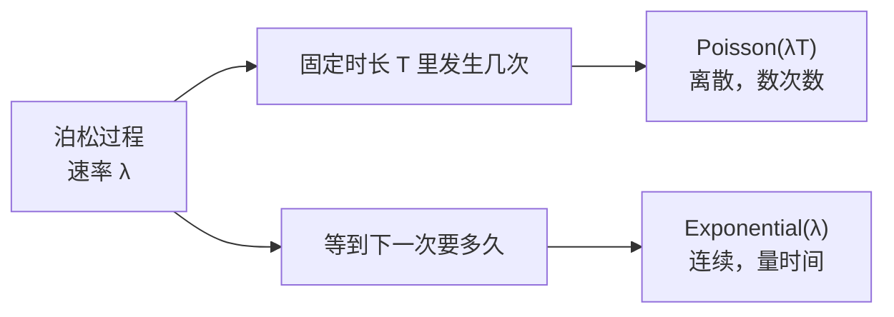

# Probability and Distributions

> Probability is the language AI uses to express uncertainty.

**Type:** Learn
**Language:** Python
**Prerequisites:** Phase 1, Lessons 01-04
**Time:** ~75 minutes

**中文深入讲解：** 各概念小节末尾的「深入讲解（中文）」与 [`en-qa-c6.md`](en-qa-c6.md) 同步。

## Learning Objectives

- Implement PMFs and PDFs from scratch for Bernoulli, categorical, Poisson, uniform, and normal distributions
- Compute expected value, variance, and use the Central Limit Theorem to explain why Gaussians dominate
- Build softmax and log-softmax functions with the numerical stability trick (subtract max logit)
- Calculate cross-entropy loss from logits and connect it to negative log-likelihood

## The Problem

A classifier outputs `[0.03, 0.91, 0.06]`. A language model picks the next word from 50,000 candidates. A diffusion model generates images by sampling from learned distributions. All of these are probability in action.

Every prediction a model makes is a probability distribution. Every loss function measures how far the predicted distribution is from the true one. Every training step adjusts parameters to make one distribution look more like another. Without probability, you cannot read a single ML paper, debug a single model, or understand why your training loss is NaN.

## The Concept

### Events, Sample Spaces, and Probability

The sample space S is the set of all possible outcomes. An event is a subset of the sample space. Probability maps events to numbers between 0 and 1.

```
Coin flip:
  S = {H, T}
  P(H) = 0.5,  P(T) = 0.5

Single die roll:
  S = {1, 2, 3, 4, 5, 6}
  P(even) = P({2, 4, 6}) = 3/6 = 0.5
```

Three axioms define all of probability:
1. P(A) >= 0 for any event A
2. P(S) = 1 (something always happens)
3. P(A or B) = P(A) + P(B) when A and B cannot both occur

Everything else (Bayes' theorem, expectations, distributions) follows from these three rules.

### Conditional Probability and Independence

P(A|B) is the probability of A given that B happened.

```
P(A|B) = P(A and B) / P(B)

Example: deck of cards
  P(King | Face card) = P(King and Face card) / P(Face card)
                      = (4/52) / (12/52)
                      = 4/12 = 1/3
```

Two events are independent when knowing one tells you nothing about the other:

```
Independent:   P(A|B) = P(A)
Equivalent to: P(A and B) = P(A) * P(B)
```

Coin flips are independent. Drawing cards without replacement is not.

### Probability Mass Functions vs Probability Density Functions

Discrete random variables have a probability mass function (PMF). Each outcome has a specific probability that you can read off directly.

```
PMF: P(X = k)

Fair die:
  P(X = 1) = 1/6
  P(X = 2) = 1/6
  ...
  P(X = 6) = 1/6

  Sum of all probabilities = 1
```

Continuous random variables have a probability density function (PDF). The density at a single point is not a probability. Probability comes from integrating the density over an interval.

```
PDF: f(x)

P(a <= X <= b) = integral of f(x) from a to b

f(x) can be greater than 1 (density, not probability)
integral from -inf to +inf of f(x) dx = 1
```

This distinction matters in ML. Classification outputs are PMFs (discrete choices). VAE latent spaces use PDFs (continuous).

### Common Distributions

**Bernoulli:** one trial, two outcomes. Models binary classification.

```
P(X = 1) = p
P(X = 0) = 1 - p
Mean = p,  Variance = p(1-p)
```

**Categorical:** one trial, k outcomes. Models multi-class classification (softmax output).

```
P(X = i) = p_i,  where sum of p_i = 1
Example: P(cat) = 0.7,  P(dog) = 0.2,  P(bird) = 0.1
```

**Uniform:** all outcomes equally likely. Used for random initialization.

```
Discrete: P(X = k) = 1/n for k in {1, ..., n}
Continuous: f(x) = 1/(b-a) for x in [a, b]
```

**Normal (Gaussian):** the bell curve. Parameterized by mean (mu) and variance (sigma^2).

```
f(x) = (1 / sqrt(2*pi*sigma^2)) * exp(-(x - mu)^2 / (2*sigma^2))

Standard normal: mu = 0, sigma = 1
  68% of data within 1 sigma
  95% within 2 sigma
  99.7% within 3 sigma
```

**Poisson:** counts of rare events in a fixed interval. Models event rates.

```
P(X = k) = (lambda^k * e^(-lambda)) / k!
Mean = lambda,  Variance = lambda
```

### 深入讲解（中文）：泊松分布

课文原句：

> Poisson: counts of rare events in a fixed interval. Models event rates.

```text
P(X = k) = (λ^k * e^(-λ)) / k!

E[X] = λ
Var(X) = λ
```

#### 它在回答什么问题

泊松分布回答的不是「会不会发生」，而是：

**在一段已经定好的时间、空间或长度里，这件事发生了几次？**

| 固定区间 | 稀有事件 | 随机变量 X |
|----------|----------|------------|
| 1 小时 | 客服来电 | 这一小时来了几通 |
| 1 天 | 服务器宕机 | 今天宕了几次 |
| 1 篇文档 | 某个罕见词 | 这篇里出现了几次 |
| 1 km 公路 | 事故 | 这一公里发生了几起 |
| 1 秒 | 放射性衰变 | 这一秒探测到几次 |

注意三点：

1. **数的是次数，不是「成功 / 失败」。** 那是伯努利。
2. **区间事先固定。** 你先说「看 1 小时」，再数次数。如果问的是「等到下一次来电要多久」，那是指数分布。
3. **「稀有」不是「几乎不发生」。** 它的意思是：把区间切成很多极小片段后，每个片段里最多发生 1 次，而且发生的概率很小。λ 本身可以很大——每小时平均 20 次来电，仍然可以用泊松。

所以课文后半句 *Models event rates* 的意思是：λ = 速率 × 区间长度。速率不变时，窗口拉长，λ 按比例变大。

#### 三个建模假设

把区间 `[0, T]` 切成 n 个极小格子，每个格子长度 `T/n`。泊松过程要求：

```text
1. 独立：不相交的格子里，事件是否发生互不影响
2. 平稳：只看格子长度，不看格子落在哪一段（速率恒定）
3. 稀有：格子足够小以后，一个格子里最多 1 次事件
         P(恰好 1 次) ≈ λ / n
         P(2 次及以上) ≈ 0
```

满足这三条，整段区间里的总次数 X 就是 `Poisson(λ)`。

哪一条破了，模型就会歪：

- 来电在午休扎堆 → 不平稳，方差往往大于均值（过度离散）
- 一次故障引发一串告警 → 不独立
- 「一次」其实是好几件叠在一起 → 稀有假设失效

#### 公式：三块各管什么

```text
P(X = k) = (λ^k * e^(-λ)) / k!

k = 0, 1, 2, ...
```

拆开看：

- **λ^k**：发生 k 次。λ 越大，较大的 k 越容易出现。
- **e^(-λ)**：把「整段区间什么都没发生」的基准压下来。λ 越大，`P(X = 0) = e^(-λ)` 越小。
- **k!**：这 k 次事件在时间轴上谁先谁后不算新结果，除掉重复排列。

k = 0 时最干净：

```text
P(X = 0) = e^(-λ)
```

平均每小时 3 次来电，这一小时完全没人打来的概率是 `e^(-3) ≈ 0.0498`，大约 5%。

本课代码就是直接翻译这个 PMF：

```python
def poisson_pmf(k, lam):
    return (lam ** k) * math.exp(-lam) / factorial(k)
```

取值只能是 0, 1, 2, ...，没有上限。这是离散分布，用的是 PMF，不是 PDF。

#### 从二项分布极限看「为什么是这个公式」

这一小节是**推导**：解释 `(λ^k * e^(-λ)) / k!` 这个式子从哪冒出来。推导过程会借用二项分布的 n 和 p。**用泊松的时候不会去估 p**，见下一小节。

泊松公式是「很多次、每次成功概率很小」的二项分布极限。

设 `X ~ Binomial(n, p)`，令 `n * p = λ` 固定，再让 n → ∞、p → 0：

```text
每次成功概率 p = λ / n

P(恰好 k 次成功)
  = C(n, k) * p^k * (1 - p)^(n - k)
  → (λ^k * e^(-λ)) / k!
```

直觉：

- n 很大：区间被切得很碎
- p 很小：每个碎格子几乎不会出事
- `n * p = λ` 固定：整段加起来平均还是 λ 次

这就是 *counts of rare events in a fixed interval* 的来源。

数值对照：n = 1000，p = 0.003，λ = n·p = 3

| k | 二项 P(X = k) | 泊松 P(X = k) |
|---|---------------|---------------|
| 0 | 0.0496 | 0.0498 |
| 1 | 0.1492 | 0.1494 |
| 2 | 0.2242 | 0.2240 |
| 3 | 0.2244 | 0.2240 |
| 4 | 0.1683 | 0.1680 |

已经几乎一样。经验规则：n ≥ 20 且 p ≤ 0.05，用泊松去近似二项通常够用。

#### 这里为什么还在说成功率？

问：上一节已经说泊松不考虑 p，这里推导为什么又写出 `p = λ / n`？

答：两套语言，别混。

```text
用法（真正建模）：只报 λ
  「这一小时平均来 3 通」→ Poisson(3)
  不问、不估「每一秒成不成功」

推导（解释公式从哪来）：暂时假装世界是二项
  把 1 小时切成 n 格
  每格「发生 1 次」的概率叫 p
  为了平均仍是 λ 次，必须 p = λ / n
  n 越切越细，p 越来越小，二项的公式变成泊松的公式
  然后把 n 和 p 扔掉，只留下 λ
```

p 在这里的角色是**脚手架**：为了从你已经认识的二项公式走到泊松公式，中间必须经过它。房子盖好（得到 `P(X = k) = (λ^k * e^(-λ)) / k!`）就把脚手架拆掉。

所以截图里那几行：

```text
每次成功概率 p = λ / n
P(恰好 k 次成功) = C(n, k) * p^k * (1-p)^(n-k)
                 → (λ^k * e^(-λ)) / k!
```

读法是：**假如**你硬把时间切成 n 次独立试验，成功率必须是 `λ/n`，极限才对得上。不是在要求你用泊松时去测一个成功率。

类比：用正多边形逼近圆，证明过程会说「边数 n、每边长度」。圆的面积公式 `π r^2` 里没有边数。泊松公式里没有 p，同一个道理。

#### 泊松不考虑成功率吗？

问：泊松是二项分布的极限，二项明明有成功率 p。泊松不是只数次数、不考虑成功率吗？

答：建模时**真的不再单独用 p**。成功率没有消失，而是被乘进了唯一的参数 λ。

```text
二项：两个旋钮  n（试几次）、p（每次成功的概率）
       平均次数 = n * p

泊松：一个旋钮  λ（这段区间平均发生几次）
       平均次数 = λ
```

所以：

- **公式里看不到 p**，这是对的。泊松不回答「这一格成不成功」，只回答「整段一共几次」。
- **故事里仍有一个很小的 p**。把 1 小时切成 n 格，每一格「发生 1 次」的概率大约是 `p = λ / n`。n 越大，p 越小，乘积 `n * p` 始终等于 λ。
- 你**不需要知道 n 和 p 各是多少**。切 1000 格、每格 p = 0.003，和切 10000 格、每格 p = 0.0003，平均都是 3 次，极限都是 `Poisson(3)`。泊松把「切多细」这个任意选择消掉了，只留下平均速率。

对照：

| | 二项 Binomial(n, p) | 泊松 Poisson(λ) |
|--|---------------------|-----------------|
| 在问什么 | n 次独立试验里成功几次 | 固定窗口里发生几次 |
| 有没有上限 | 有，最多 n 次 | 没有上限 |
| 成功率 p | 显式参数 | 不出现；藏在 λ 里 |
| 平均次数 | n * p | λ |
| 什么时候两者差不多 | n 很大且 p 很小，且 n * p = λ | 就是这个极限 |

一句话：**泊松不考虑「单次成功率」，只考虑「单位时间里的平均次数」。** 那个平均次数 λ 已经是「很多次 × 每次很小的 p」乘完之后的结果。

若你手里只有「每小时大约来 3 通」，用泊松，不要去估 p。若你手里是「打了 100 个电话，每个接通概率 0.03」，那是二项，不是泊松。

#### 均值 = 方差 = λ

```text
E[X] = λ
Var(X) = λ
```

这是泊松最硬的指纹，也是最容易用错的地方。

- λ 既是「平均发生几次」，也是「波动有多大」
- 平均 3 次的过程，标准差是 `√3 ≈ 1.73`，所以 1、2、3、4、5 都常见，0 和 8 也不算离谱
- 平均 100 次时，标准差是 10，相对波动 10/100 = 10%，看起来「更稳」——大数把相对噪声压下去了

**诊断：** 如果数据的样本方差明显大于样本均值（过度离散，overdispersion），泊松太瘦了，应改用负二项。方差明显小于均值（欠离散）也不合适。

本课 `outputs/skill-probability-reasoning.md` 把这一点写成选型规则：方差对不上均值时不要硬用泊松。

#### 形状怎么随 λ 变

λ 决定峰在哪、鼓成什么样。

```text
λ 很小（如 0.5）：
  质量堆在 0、1，右偏很厉害
  P(X = 0) = e^(-0.5) ≈ 0.61

λ = 3（本课可视化用的值）：
  峰在 k = 2 和 k = 3（两者概率相同，都是 0.2240）
  仍右偏，但已经能看到钟的轮廓

λ 很大（如 20）：
  峰在 k ≈ 20 附近，形状逼近 N(λ, λ)
```

λ = 3 时前几项（与 `code/probability.py` 打印的一致）：

| k | P(X = k) |
|---|----------|
| 0 | 0.0498 |
| 1 | 0.1494 |
| 2 | 0.2240 |
| 3 | 0.2240 |
| 4 | 0.1680 |
| 5 | 0.1008 |
| 6 | 0.0504 |
| 7 | 0.0216 |
| 8 | 0.0081 |
| 9 | 0.0027 |

当 λ 是整数时，众数是 λ 和 λ − 1 两个，所以 k = 2 和 k = 3 并列最高。

#### 完整例子：每小时平均 3 次来电

设 `X ~ Poisson(3)`。

**这一小时会来几通？** 最可能是 2 或 3 通，概率各约 22.4%。

**完全没来电？**

```text
P(X = 0) = e^(-3) ≈ 0.0498
```

**至少来 1 通？**

```text
P(X >= 1) = 1 - P(X = 0) ≈ 0.9502
```

**来电过多、人手不够（比如 ≥ 7）？**

```text
P(X >= 7) = 1 - (P(0) + P(1) + ... + P(6)) ≈ 0.0335
```

大约 3.4% 的小时会「爆掉」。这就是用泊松建模事件率的典型用法：先估 λ，再读出「闲死」和「忙死」的概率。

把区间拉长或缩短时，λ 按比例走：

```text
每小时平均 3 次  →  2 小时平均 6 次  →  Poisson(6)
每小时平均 3 次  →  10 分钟平均 0.5 次  →  Poisson(0.5)
```

#### 和指数分布是一对

同一个泊松过程，从两个角度看：



- 次数：`Poisson(λT)`
- 等待时间：`Exponential(λ)`，均值 `1/λ`

λ = 3 次/小时，平均等待 1/3 小时 = 20 分钟。
「这一小时来 0 次」=「等待时间 > 1 小时」，两边算出同一个数 `e^(-3)`。

选型时记住：

| 你在建模 | 用 |
|----------|----|
| 固定窗口里的次数 | 泊松 |
| 两次事件之间的间隔 | 指数 |
| n 次独立成功/失败 | 二项 |
| 一次成功/失败 | 伯努利 |

#### 在机器学习里出现在哪

泊松本身很少当「分类头」，但只要标签是 **计数 / 速率**，它就会回来。

**计数回归（Poisson regression）。**
给定特征 x，令 `λ = exp(w · x)`（指数保证 λ > 0），用泊松负对数似然当损失：

```text
L = λ - k * log(λ) + log(k!)
```

`k!` 与参数无关，训练时可丢掉。这就是广义线性模型里泊松族 + log 链接。推导见下一小节。

#### 计数回归的损失怎么来的？

问：`λ = exp(w · x)` 和 `L = λ - k * log(λ) + log(k!)` 是怎么得到的？

答：两步。先从泊松 PMF 取负对数，得到对 λ 的损失；再规定 λ 必须为正，用 exp 把线性打分变成 λ。

**第 1 步：损失就是「观测到 k 次」的负对数概率。**

一条样本：真实计数是 k，模型预测平均次数是 λ。泊松说：

```text
P(X = k | λ) = (λ^k * e^(-λ)) / k!
```

训练要让这个概率变大，等价于让它的对数变大，也等价于让负对数变小（当损失）：

```text
log P = log(λ^k) + log(e^(-λ)) - log(k!)
      = k * log(λ)  - λ  - log(k!)

L = - log P
  = λ - k * log(λ) + log(k!)
```

就是截图里那一行。没有新假设，只是把 PMF 取了 `-log`。

三项各自在干什么：

```text
 λ            预测的平均次数。λ 越大，越惩罚「乱报很高的速率」
-k * log(λ)   真的观察到了 k 次。k 越大，越希望 λ 也大（log(λ) 大，这项更负，损失更小）
 log(k!)      只跟数据 k 有关，跟 w、λ 都无关
```

所以对参数求导时，`log(k!)` 的导数是 0，训练可以写成：

```text
L_train = λ - k * log(λ)
```

数值上更稳，结果和完整 L 同一个最小值。

**第 2 步：λ 必须 > 0，所以用 exp。**

w · x 是普通线性打分，可正可负。次数的平均值不能是负数，所以不能直接令 `λ = w · x`。任意实数送进 exp 都得到正数：

```text
λ = exp(w · x)     永远 > 0
log(λ) = w · x     这叫 log 链接：对数均值是线性的
```

代回训练损失：

```text
L_train = exp(w · x) - k * (w · x)
```

对 w 求导（一条样本）：

```text
dL/dw = (λ - k) * x
      = (预测平均次数 - 真实计数) * 特征
```

预测偏高（λ > k）就往让 λ 变小的方向改 w；预测偏低就反向。和最小二乘里 `(预测 - 真值) * x` 是同一个形状，只是「预测」现在是速率 λ，不是随便一个实数。

**和第 1 课已经见过的交叉熵是同一套路：**

```text
伯努利分类：  L = - log P(标签)           →  binary cross-entropy
类别分类：    L = - log P(正确类)         →  交叉熵
泊松计数：    L = - log P(计数值 k)       →  λ - k*log(λ) + log(k!)
```

都是最大似然：假设数据来自某个分布，把 `-log P(数据 | 参数)` 当损失。泊松回归只是把那个分布换成了泊松。

**「泊松族 + log 链接」是 GLM 的黑话：**

```text
族（family）   给定均值后，数据服从什么分布 → 这里是泊松
链接（link）   均值如何由 w·x 变出来     → log(λ) = w·x，即 λ = exp(w·x)
```

换族就换损失（正态 → MSE，伯努利 → 交叉熵，泊松 → 上面这个 L）。换链接就换「线性打分怎么变成均值」。

**文本与推荐里的计数。**
一篇文档里某个词出现几次、一个用户一小时点几次，先验或似然都可以是泊松。本课 skill 里的例子：词频 → Poisson，λ = 平均词频。

**伽马是泊松的共轭先验。**
如果你对 λ 本身不确定，用 `Gamma(α, β)` 当先验，观察到计数后再更新 λ。

**不要用错的场景：**

- 类别概率（猫/狗/鸟）→ 类别分布 + softmax，不是泊松
- 像素、分数、嵌入 → 连续分布
- 方差明显大于均值的点击次数 → 负二项
- 有硬上限的次数（10 次试验里成功几次）→ 二项，不是泊松

#### 计算时注意数值

朴素写法 `lam ** k * exp(-lam) / factorial(k)` 在 λ 和 k 都很大时会溢出：`λ^k` 和 `k!` 先炸，再相除已经来不及。

更稳的做法是在对数域算：

```python
import math

def poisson_log_pmf(k, lam):
    # log P(X=k) = k * log(λ) - λ - log(k!)
    return k * math.log(lam) - lam - math.lgamma(k + 1)

def poisson_pmf_stable(k, lam):
    return math.exp(poisson_log_pmf(k, lam))
```

`math.lgamma(k + 1)` 就是 `log(k!)`。本课演示用 λ = 3、k < 10，朴素版足够；真正的计数模型应走 log PMF。

#### 和本课其它分布怎么排

```text
离散？
  只有 {0, 1}            → Bernoulli(p)
  k 个类别、抽一次        → Categorical
  n 次试验、成功几次      → Binomial(n, p)
  固定区间里发生几次      → Poisson(λ)     ← 本节
连续？
  一个区间里均匀          → Uniform
  误差、均值附近对称      → Normal
  等到下一事件的时间      → Exponential
```

一句话对照：

| 分布 | 一句话 |
|------|--------|
| Bernoulli | 这件事发不发生 |
| Binomial | n 次机会里成功几次 |
| Poisson | 固定窗口里发生几次（n 很大、每次很小） |
| Categorical | 一次抽中哪一类 |
| Normal | 连续值在均值附近怎么散 |

#### 读完应能回答

1. 为什么泊松的取值是 0, 1, 2, ... 而不是区间 [0, 1]？
2. λ 同时是均值和方差，这意味着数据该长什么样？对不上时换什么分布？
3. 为什么「稀有事件」的泊松，λ 却可以等于 20？
4. 泊松 PMF 里的 `e^(-λ)` 和 `k!` 各在消除什么？
5. 把一小时的 `Poisson(3)` 改成两小时，参数怎么变？
6. 计数回归里为什么常用 `λ = exp(w · x)`，损失为什么是 `λ - k * log(λ)`？

跑本课 demo 时核对两件事：λ = 3 时 k = 2 与 k = 3 并列最大；你只打印前 10 项，它们已经覆盖约 99.9% 的概率质量。这两点对了，公式就对了。

---


### Expected Value and Variance

Expected value is the weighted average outcome.

```
Discrete:   E[X] = sum of x_i * P(X = x_i)
Continuous: E[X] = integral of x * f(x) dx
```

Variance measures spread around the mean.

```
Var(X) = E[(X - E[X])^2] = E[X^2] - (E[X])^2
Standard deviation = sqrt(Var(X))
```

In ML, expected value appears as the loss function (average loss over the data distribution). Variance tells you about model stability. High variance in gradients means noisy training.

### 深入讲解（中文）：期望、损失与梯度方差

课文原句：

> In ML, expected value appears as the loss function (average loss over the data distribution). Variance tells you about model stability. High variance in gradients means noisy training.

这句话把三个相关但不同的东西连起来了：

```text
每个样本有一个损失
        ↓ 取平均
训练真正想最小化的「期望损失」
        ↓ 但每次只随机抽一小批样本估计它的梯度
不同批次给出不同梯度
        ↓
梯度方差大 → 参数更新方向更抖 → 训练更嘈杂
```

#### 1. 期望损失才是训练目标

严格说，**期望值不是损失函数本身**；模型先定义每个样本的损失 `loss(theta; x, y)`，训练目标是这个损失在真实数据分布上的平均值（期望）。

```text
单个样本的损失：
loss(theta; x, y)

总体目标，也叫期望风险：
J(theta) = E_data[loss(theta; x, y)]
```

其中：

- `theta`：模型参数，例如所有权重；
- `(x, y)`：随机抽到的一条输入和其正确答案；
- `E_data[...]`：假想从真实世界的数据分布无限次抽样，再取平均。

例子：房价回归中，单套房的平方误差可以是：

```text
loss(theta; x, y) = (prediction_theta(x) - y)^2
```

真正关心的不是训练集中某一套房误差多大，而是模型面对未来随机一套房时，**平均会错多少**：

```text
J(theta) = E_data[(prediction_theta(x) - y)^2]
```

分类的交叉熵也是同一件事：每个样本算一次 `-log P_theta(正确类别 | x)`，然后在数据分布上求平均。

#### 2. 为什么实际代码算的是 batch 平均

真实数据分布不知道，也不可能列出无限数据。因此用训练集平均来近似期望：

```text
J_train(theta) = (1 / N) * sum(loss(theta; x_i, y_i), i = 1...N)
```

这叫经验风险（empirical risk）。

训练时通常连整个训练集也不一次算完，而是随机取一个 mini-batch，例如 32 条样本：

```text
L_batch(theta) = (1 / B) * sum(loss(theta; x_i, y_i), i in batch)
```

所以 PyTorch、NumPy 训练代码常常把一批样本的 loss `.mean()`：它是在用 batch 平均估计总体的期望损失。

#### 3. 梯度为什么会有方差

梯度是「该往哪改参数」：

```text
完整数据的梯度：  grad J(theta)
第 t 个 batch 的梯度：g_t = grad L_batch_t(theta)
```

如果每个 batch 都不同，里面的难样本、易样本、类别比例、噪声样本都不同，那么 `g_t` 也不同。随机梯度下降（SGD）实际拿到的是 `g_t`，不是完整的 `grad J(theta)`。

随机抽 batch 的前提下，`g_t` 通常是完整梯度的无偏估计：

```text
E_batch[g_t] = grad J(theta)
```

意思是：单次方向可能偏，但无限次随机抽 batch 的平均方向是对的。

**梯度方差**量的是这些单次方向围绕平均方向抖得多厉害：

```text
Var_batch(g_t) = E_batch[(g_t - grad J(theta))^2]
```

向量梯度时，上式表示逐坐标的方差；完整描述还会用协方差矩阵。入门阶段只要把它理解为「每一维梯度有多不稳定」即可。

#### 4. 高方差为什么让训练嘈杂

参数更新是：

```text
theta_next = theta_now - learning_rate * g_t
```

假设真实的平均方向是向左下，但不同 batch 的梯度可能这样：

```text
batch A：向左下很多
batch B：向右一点、向下
batch C：向左，但向上不少
```

平均来看会往正确方向走；单步却会左右摆动。方差高时摆动更大，loss 曲线通常更锯齿，训练到同样效果需要更多步，也更容易因为学习率过大而不稳定。

它不一定完全是坏事：少量随机性可以帮助跳出狭窄区域，并且 mini-batch 比全量训练便宜得多。但方差过高会淹没有用的下降信号。

#### 5. 什么会让梯度方差变大或变小

```text
方差变大的常见原因：
- batch 很小：一两个异常样本就能主导梯度
- 数据标签错、输入噪声大、异常值多
- 类别极不平衡：某些 batch 几乎全是一类
- 不同样本的难度或尺度差异很大

方差变小的常见办法：
- 增大 batch size：更多样本的平均会抵消一部分随机波动
- 清洗数据、处理异常值、做正确的归一化
- 分层抽样，避免 batch 类别比例随机失衡
- 使用动量或 Adam：平滑连续多个梯度
- 降低学习率：不会减少梯度方差，但会缩小每次抖动的参数步长
```

关键区别：增大 batch 主要改变 `g_t` 的噪声；降低学习率主要改变噪声被放大成多大的参数移动。两者都可能让曲线更平稳，但不是同一种操作。

#### 6. 「模型稳定」不只一种意思

课文的 “model stability” 在这里主要指**优化稳定性**：不同 batch 导致的参数更新是否剧烈摇摆。

它不等同于：

- **泛化稳定性**：训练数据删掉或换掉一条，模型预测是否变化很大；
- **数值稳定性**：浮点数计算是否溢出、下溢或累计误差；
- **输出稳定性**：同一输入加一点微小扰动，预测是否突变。

它们都和「稳定」有关，但本句的直接含义是第一种：梯度噪声使训练过程不稳定。

#### 一句话总结

```text
损失：一条数据上错多少
期望损失：未来随机数据上平均错多少，是理想训练目标
batch loss：期望损失的便宜近似
梯度方差：不同 batch 给出的更新方向差多少
高梯度方差：方向抖得大，SGD 训练曲线更嘈杂
```

---


### Joint and Marginal Distributions

A joint distribution P(X, Y) describes two random variables together.

Joint PMF example (X = weather, Y = umbrella):

| | Y=0 (no umbrella) | Y=1 (umbrella) | Marginal P(X) |
|---|---|---|---|
| X=0 (sun) | 0.40 | 0.10 | P(X=0) = 0.50 |
| X=1 (rain) | 0.05 | 0.45 | P(X=1) = 0.50 |
| **Marginal P(Y)** | P(Y=0) = 0.45 | P(Y=1) = 0.55 | 1.00 |

The marginal distribution sums out the other variable:

```
P(X = x) = sum over all y of P(X = x, Y = y)
```

The row and column totals in the table above are the marginals.

### Why the Normal Distribution Shows Up Everywhere

The Central Limit Theorem: the sum (or average) of many independent random variables converges to a normal distribution, regardless of the original distribution.

```
Roll 1 die:  uniform distribution (flat)
Average of 2 dice:  triangular (peaked)
Average of 30 dice: nearly perfect bell curve

This works for ANY starting distribution.
```

This is why:
- Measurement errors are approximately normal (many small independent sources)
- Weight initializations in neural networks use normal distributions
- Gradient noise in SGD is approximately normal (sum of many sample gradients)
- The normal distribution is the maximum entropy distribution for a given mean and variance

### Log Probabilities

### 深入讲解（中文）：中心极限定理

课文原句：

> The Central Limit Theorem: the sum (or average) of many independent random variables converges to a normal distribution, regardless of the original distribution.

#### 先纠正一句容易误解的话

这句话是入门版的简写。它不是说“任意数据只要加起来，就会直接变成固定的钟形曲线”。

更准确的版本是：

```text
从同一个分布独立抽很多次，每次的均值为 μ、方差为 σ²，且 σ² 有限。

把总和减去其平均值，并除以它的标准差：

Z_n = (S_n - n*μ) / (σ*sqrt(n))

当 n 很大时，Z_n 的分布接近标准正态 N(0, 1)。
```

其中 `S_n = X_1 + X_2 + ... + X_n`。

对平均值 `A_n = S_n / n`，等价地写成：

```text
(A_n - μ) / (σ / sqrt(n))  接近  N(0, 1)
```

所以“平均值变正态”真正指的是：平均值围绕 μ 的**标准化波动形状**接近正态。原始平均值本身会越聚越紧地靠近 μ；它不会保持一个宽度固定的钟形。

#### 直觉：很多独立的小影响相加

设一个结果由很多互不相关的小因素共同决定：

```text
考试成绩 = 睡眠 + 复习量 + 题目难度 + 临场状态 + 运气 + ...
测量误差 = 仪器误差 + 环境温度 + 读数误差 + 操作误差 + ...
mini-batch 梯度 = 每条样本梯度的平均
```

每个小因素的分布可以很奇怪：骰子是均匀的、网页点击可能很偏、误差可能离散。但加起来后，极大或极小的结果通常需要很多因素同时偏向一边，组合数更少；中间结果可以由大量不同组合产生，组合数最多。于是中间鼓起来，形状趋向钟形。

#### 一个骰子例子

单颗公平骰子的点数是均匀分布：1 到 6 各有 1/6，不是正态。

```text
掷 1 颗：只能得到 1...6，完全平
掷 2 颗求和：7 有 6 种组合，2 和 12 各只有 1 种，形成三角形
掷 30 颗求平均：大量组合叠加，分布很接近钟形
```

平均点数的中心是 3.5。骰子越多，平均值越不容易远离 3.5：

```text
单颗骰子方差 = 35 / 12
n 颗骰子“平均值”的方差 = (35 / 12) / n
平均值的标准差 = sqrt(35 / (12*n))
```

这就是为什么 `n` 越大，平均的钟形越窄：平均会抵消一部分随机波动。

#### “sum 或 average” 到底差在哪

这两个说法需要区分尺度：

```text
总和 S_n：
  均值 = n*μ
  标准差 = σ*sqrt(n)
  n 增大时，中心右移，绝对波动也变大

平均 A_n = S_n / n：
  均值 = μ
  标准差 = σ/sqrt(n)
  n 增大时，中心不动，波动缩小
```

二者都可经由正确标准化后接近正态。实际统计里更常讨论平均值，因为它估计的是固定的总体均值 μ。

#### “regardless of the original distribution” 的边界

这里的 “regardless” 不是无条件成立。常见、足够入门的条件是：

```text
1. 样本相互独立，或依赖足够弱
2. 样本来自相同或相近的分布
3. 每个样本都有有限的均值和方差
4. 没有某一个样本单独主导整个总和
```

反例：

- 股票收益等重尾数据，若方差不存在，经典 CLT 不适用；
- 连续时间序列高度相关时，不能假装每个点独立；
- 把一个极大值和很多小值相加，极大值主导，钟形近似会很差；
- `max(X_1, ..., X_n)` 是最大值，不是和或平均，一般走极值分布而不是正态。

#### 和机器学习的关系

中心极限定理解释的是“**平均很多随机量**”为何经常近似正态，不能把它误读为“所有 ML 数据都是正态分布”。

它在 ML 中的典型出现方式：

```text
batch 的平均损失：
  batch 内许多单样本损失的平均，样本足够独立且 batch 足够大时，
  这个平均值的抽样波动常近似正态。

SGD 的梯度：
  batch 梯度是许多单样本梯度的平均；
  因此梯度噪声常被正态近似，但相关样本、小 batch、重尾梯度时近似会变差。

测量与标注噪声：
  若噪声由很多小来源相加，常用高斯噪声建模。
```

注意它解释的是“平均量的随机误差形状”，不是保证模型输出、原始特征或真实标签本身都服从正态。

#### 和大数定律不要混

两个定理都研究平均值，却回答不同问题：

| 定理 | 回答的问题 |
|------|------------|
| 大数定律 | n 越大，平均值会不会靠近真实均值 μ？会。 |
| 中心极限定理 | 平均值在 μ 附近以什么形状、什么尺度波动？近似正态，尺度是 1/sqrt(n)。 |

```text
大数定律：A_n → μ
中心极限定理：(A_n - μ) / (σ/sqrt(n)) → N(0, 1)
```

一句话：大数定律说“会收敛到哪里”，中心极限定理说“收敛途中剩下的误差长什么样”。

#### 回到本课代码

`demonstrate_clt` 每次先抽 `n_per_sample` 个独立样本，再记录它们的平均值；重复很多次得到许多个平均值。把这些平均值画直方图，`n_per_sample` 从 1 增至 30 时，直方图会逐渐接近且收紧为钟形。


Raw probabilities cause numerical problems. Multiplying many small probabilities together quickly underflows to zero.

```
P(sentence) = P(word1) * P(word2) * ... * P(word_n)
            = 0.01 * 0.003 * 0.02 * ...
            -> 0.0 (underflow after ~30 terms)
```

Log probabilities fix this. Multiplications become additions.

```
log P(sentence) = log P(word1) + log P(word2) + ... + log P(word_n)
                = -4.6 + -5.8 + -3.9 + ...
                -> finite number (no underflow)
```

Rules:
- log(a * b) = log(a) + log(b)
- log probabilities are always <= 0 (since 0 < P <= 1)
- More negative = less likely
- Cross-entropy loss is the negative log probability of the correct class

### Softmax as a Probability Distribution

Neural networks output raw scores (logits). Softmax converts them into a valid probability distribution.

```
softmax(z_i) = exp(z_i) / sum(exp(z_j) for all j)

Properties:
  - All outputs are in (0, 1)
  - All outputs sum to 1
  - Preserves relative ordering of inputs
  - exp() amplifies differences between logits
```

The softmax trick: subtract the max logit before exponentiating to prevent overflow.

```
z = [100, 101, 102]
exp(102) = overflow

z_shifted = z - max(z) = [-2, -1, 0]
exp(0) = 1  (safe)

Same result, no overflow.
```

Log-softmax combines softmax and log for numerical stability. PyTorch uses this internally for cross-entropy loss.

### 深入讲解（中文）：正态最大熵、Softmax、Log-softmax 与交叉熵

这句话的意思是：假设我们只知道连续随机变量的均值 `E[X] = μ` 和方差 `Var(X) = σ²`，在所有满足这两个约束的分布中，正态分布的不确定性（熵）最大。

```text
H(X) = -∫ p(x) log p(x) dx
```

熵越大，表示对具体取值越不确定。最大熵原则因此选择“最少额外假设”的分布。满足约束时得到的密度是 `N(μ, σ²)`：

```text
p(x) = 1 / (σ * sqrt(2π)) * exp(-(x - μ)^2 / (2σ²))
```

这并不表示现实数据一定服从正态分布；它只表示在只掌握均值和方差时，正态分布是最保守、最不武断的模型。若数据有明显偏斜、重尾、边界或离散性，应选择更合适的分布。它也不同于中心极限定理：中心极限定理解释许多独立变量的和或平均值为何常接近正态。
##### 为什么正态分布会得到最大熵？

可以把问题写成一个优化问题：在所有满足
`∫p(x)dx = 1`、`∫x p(x)dx = μ`、`∫(x-μ)^2 p(x)dx = σ²`
的密度中，最大化 `H(p) = -∫p(x)log p(x)dx`。用拉格朗日乘子求解，最优密度必须满足

```text
log p(x) = 常数 + a*x + b*x²
```

因此

```text
p(x) = C * exp(a*x + b*x²)
```

为了让密度可积，`b` 必须为负；把指数中的二次式配方，并用均值、方差约束确定参数，就恰好得到
`p(x) ∝ exp(-(x-μ)^2/(2σ²))`，即正态分布。

直观上，固定均值和方差只规定了“中心在哪里”和“总体扩散多大”，没有规定偏斜、尖峰或厚尾。任何额外的形状都会把概率质量更集中地放到某些区域，等于加入了额外信息，使熵降低。正态分布不偏向这些特殊结构，所以在约束允许的范围内保留最多不确定性。
##### 交叉熵公式：`loss = -log_softmax(x)[y] = -x_y + logsumexp(x)`

设模型对 `C` 个类别输出 logits：

```text
x = [x_1, x_2, ..., x_C]
```

`x_i` 不是概率，可以是任意实数；`y` 表示真实类别的索引。Softmax 给出真实类别的概率：

```text
softmax(x)_y = exp(x_y) / Σ_j exp(x_j)
```

交叉熵取这个概率的负对数：

```text
loss = -log(softmax(x)_y)
     = -log(exp(x_y) / Σ_j exp(x_j))
```

利用 `log(a / b) = log(a) - log(b)` 和 `log(exp(x_y)) = x_y`：

```text
log_softmax(x)[y]
  = x_y - log(Σ_j exp(x_j))
  = x_y - logsumexp(x)
```

因此：

```text
loss = -log_softmax(x)[y]
     = -x_y + logsumexp(x)
```

两项的作用是：`-x_y` 鼓励提高真实类别的 logit；`logsumexp(x)` 汇总所有类别，错误类别的 logit 越大，损失越大。因此模型既要抬高正确类，也要相对压低错误类。

实际计算 `logsumexp` 时会先减去最大值 `m = max(x)`：

```text
logsumexp(x) = m + log(Σ_j exp(x_j - m))
```

这样可避免 `exp(1000)` 溢出和 `exp(-1000)` 下溢。PyTorch 的 `CrossEntropyLoss` 已经内部稳定地完成了 `log_softmax` 和负对数似然，所以输入应直接是 logits，不要预先调用 softmax。

对 logit `x_k` 的梯度为：

```text
d(loss) / d(x_k) = softmax(x)_k - 1[k = y]
```

真实类别的梯度为 `概率 - 1`，错误类别的梯度为其预测概率；这正是交叉熵推动正确类概率上升、错误类概率下降的原因。
##### 为什么梯度是 `d(loss) / d(x_k) = softmax(x)_k - 1[k = y]`？

从交叉熵的等价形式开始：

```text
L = -x_y + logsumexp(x)
  = -x_y + log(Σ_j exp(x_j))
```

对第 `k` 个 logit 求导。第一项给出：

```text
d(-x_y) / d(x_k) = -1[k = y]
```

这里 `1[k = y]` 是指示函数：当 `k = y` 时为 1，否则为 0。第二项令 `S = Σ_j exp(x_j)`，根据链式法则：

```text
d log(S) / d(x_k)
  = (1 / S) * dS / d(x_k)
  = exp(x_k) / Σ_j exp(x_j)
  = softmax(x)_k
```

两项相加即可得到：

```text
dL / d(x_k) = softmax(x)_k - 1[k = y]
```

分情况写就是：

```text
k = y     : dL / d(x_y) = softmax(x)_y - 1
k != y    : dL / d(x_k) = softmax(x)_k
```

例如预测概率为 `[0.659, 0.242, 0.099]`，真实类别为 0，则梯度为：

```text
[0.659 - 1, 0.242, 0.099] = [-0.341, 0.242, 0.099]
```

梯度下降使用 `x_new = x - learning_rate * gradient`：正确类别的梯度为负，所以其 logit 会上升；错误类别的梯度为正，所以它们的 logit 会下降。

---

课文原句：

> Log-softmax combines softmax and log for numerical stability. PyTorch uses this internally for cross-entropy loss.

设分类模型为 `C` 个类别输出 logits：

```text
x = [x_1, x_2, ..., x_C]
```

logit 不是概率，可以取任意实数。Softmax 将它转成概率：

```text
softmax(x)_i = exp(x_i) / Σ_j exp(x_j)
```

对该概率取对数，就是 log-softmax：

```text
log_softmax(x)_i
  = log(softmax(x)_i)
  = log(exp(x_i) / Σ_j exp(x_j))
  = x_i - log(Σ_j exp(x_j))
  = x_i - logsumexp(x)
```

这里的关键不是“先算 softmax、再取 log”。那样会不稳定：很大的 logit 会使 `exp(x_i)` 溢出；很小的 logit 会使概率下溢为 0，随后 `log(0)` 不可用。实际计算使用：

```text
m = max(x)
logsumexp(x) = m + log(Σ_j exp(x_j - m))
```

从每个 logit 都减去同一个 `m` 不会改变 softmax 概率，但会让所有指数的输入不大于 0，从而避免溢出。这就是 log-softmax 的数值稳定性来源。

若真实类别索引为 `y`，单个样本的交叉熵是对正确类别概率取负对数：

```text
loss = -log(softmax(x)_y)
     = -log_softmax(x)[y]
     = -x_y + logsumexp(x)
```

`-x_y` 鼓励提高正确类别的 logit；`logsumexp(x)` 考虑所有类别，任何错误类别的 logit 很大都会增大损失。因此训练同时提高正确类、相对压低错误类。

在 PyTorch 中，直接把未归一化的 logits 传给 `CrossEntropyLoss`：

```python
import torch.nn.functional as F

loss = F.cross_entropy(logits, targets)
# 等价于：F.nll_loss(F.log_softmax(logits, dim=1), targets)
```

不要预先调用 `softmax`；`CrossEntropyLoss` 会在内部以稳定方式执行 `log_softmax` 与负对数似然计算。

### Sampling

Sampling means drawing random values from a distribution. In ML:
- Dropout randomly samples which neurons to zero out
- Data augmentation samples random transformations
- Language models sample the next token from the predicted distribution
- Diffusion models sample noise and progressively denoise

Sampling from arbitrary distributions requires techniques like inverse transform sampling, rejection sampling, or the reparameterization trick (used in VAEs).

### 深入讲解（中文）：Sampling 中的语言模型与扩散模型

课文原句（Sampling 小节）：

> Language models sample the next token from the predicted distribution

##### 这句话在说什么

语言模型是**自回归**的：已经看到的 token 序列（上下文）决定「下一个位置该出现词表里的哪一个 token」。模型在这一步输出的不是单个答案，而是**整份词表上的概率分布**；**采样（sample）** 的意思是按这份分布随机抽一个下标，抽中的那个 token 就是生成出来的下一个词。

和本课前面学过的分布一一对应：

```text
多类分类（猫 / 狗 / 鸟）     →  Categorical，概率来自 softmax
语言模型下一个 token         →  同样是 Categorical，只是类别数 = 词表大小 V（常见 3 万～10 万+）
```

对词表索引 `j = 0, 1, ..., V-1`：

```text
模型输出 logits：  z = [z_0, z_1, ..., z_{V-1}]
预测分布：         p_j = softmax(z)_j = exp(z_j) / Σ_k exp(z_k)

P(下一个 token = j | 上下文) = p_j
```

这就是课文里的 **predicted distribution**：由当前上下文算出来的、在全体候选 token 上的概率质量，且 `Σ_j p_j = 1`。本课 `categorical_pmf(k, probs)` 里的 `probs[k]`，在这里就是 `p_j`。

##### 一步生成在做什么（和训练的区别）

**训练**时，下一个 token 的真实下标 `y` 已知（来自训练文本）。损失是交叉熵 `-log p_y`，只**抬高**正确 token 的概率，不要求你「随机抽」。

**推理 / 生成**时，没有标准答案，需要**自己造**下一个 token。标准做法就是：

```text
1. 用上下文前向一次，得到 logits z
2. softmax → 概率向量 p
3. 从 Categorical(p) 里抽一个下标 j（本课 sample_categorical）
4. 把 token j 拼到上下文末尾
5. 重复 1～4，直到结束符或达到长度上限
```

所以「sample the next token」专门描述的是**生成链路**里的第 3 步，不是训练时的梯度更新。

```mermaid
flowchart LR
  C[上下文 token 序列] --> M[Transformer / LM]
  M --> Z[logits 长度 V]
  Z --> S[softmax]
  S --> P[概率 p_0 ... p_{V-1}]
  P --> R[随机抽样得 j]
  R --> T[输出 token j 并拼回上下文]
```

##### 采样在代码里怎么实现

本课 `sample_categorical(probs, n=1)` 用的是**累积分布（逆变换采样）**：

```text
把 [0, 1) 上均匀随机数 r 与分段区间 [0, p_0), [p_0, p_0+p_1), ... 对齐
r 落在哪一段，就输出哪个类别下标
```

词表很大时，实现上常先算 softmax 得到 `p`，再对 `p` 抽样；也有库在 log 域里做等价操作以避免下溢。数学上仍是：**一次试验、V 个互斥结果、概率为 p**。

和 `sample_bernoulli` 的对比：

| 情况 | 分布 | 一次输出 |
|------|------|----------|
| 两个结果 | Bernoulli | 0 或 1 |
| V 个 token 里选一个 | Categorical / 多项式 n=1 | 0 ... V-1 中的一个 |

##### 为什么常常要「采样」而不是总选概率最大的

**贪心（greedy）**：永远取 `argmax_j p_j`（概率最大的 token）。确定性强，但容易重复、死板，且多条路径里只走「峰值」一条。

**随机采样**：按 `p_j` 抽。概率高的 token **更常被抽到**，但次高的也有机会，所以同一 prompt 多次生成可以不同——这正是对话、创意写作里常见的行为。

两者都是「用 predicted distribution」；差别在于：

```text
贪心：    下一个 token = 使 p_j 最大的 j（分布的 mode，不是 random sample）
采样：    下一个 token ~ Categorical(p)（课文原句里的 sample）
```

还有 **temperature** 等解码技巧：对 logits 先除以温度 `T` 再 softmax。`T > 1` 会把分布压平（更随机），`T < 1` 更尖（更接近贪心）。它们改的是 sampling 用的分布形状，不改变「LM 先给出分布再决定下一个 token」这一框架。

##### 和概率论概念的对应

```text
随机变量：  下一个 token 的索引 J
支撑集：    {0, 1, ..., V-1}
PMF：       P(J = j) = p_j
期望：      E[J] = Σ j * p_j（很少直接当解码目标用）
```

若把整句生成看成多步试验，每一步在**给定前面所有 token** 的条件下，再抽一个新的 Categorical；联合概率是这些条件概率的乘积（链式法则）。本课只要求理解**单步**：predicted distribution + sample。

##### 和本课其它 bullet 并列理解

课文 Sampling 里还有 Dropout、数据增强、扩散模型等。共同点：**从某个概率规则里随机抽 outcome**。语言模型这一步特别清晰——outcome 是词表里的一个 token，规则就是模型刚算出来的 softmax 分布。

##### 读完应能回答

1. predicted distribution 的输入是什么、输出是什么？（logits → softmax → 长度 V 的概率向量）
2. 训练时的交叉熵和生成时的 sampling 各用这份分布做什么？
3. `sample_categorical` 和「语言模型选下一个 token」在概率模型上是同一个什么分布？
4. 贪心和按 `p` 采样有什么不同？为什么聊天机器人常用采样？
5. 生成第二个 token 时，上下文相对第一步多了什么？

---

课文里和扩散相关的原句有**两处**，不要和 Sampling 列表挨在一起找：

**The Problem 开篇（`en.md`「The Problem」段）：**

> A diffusion model generates images by sampling from learned distributions.

**Sampling 小节（列表里单独一条）：**

> Diffusion models sample noise and progressively denoise

第一句是**总括**：扩散生成图 = 从（神经网络学出来的）分布里反复抽样。第二句是**机制**：先从噪声分布抽起点，再很多步逐步去噪。两句说的是同一条链路的不同粒度，中间隔着整章概念，并不是列表里上下相邻的两行。

##### 这句话在说什么

扩散模型生成图片（或音频等）时，**不是**像语言模型那样一步从词表里抽一个离散 token，而是：

```text
1. 先从「纯噪声」里随机抽一张起点（sample noise）
2. 再重复很多小步：每一步都往「更像真实数据、更少噪声」的方向挪一点（progressively denoise）
3. 走完全部步数后，得到一张可看的图
```

把开篇那句和 Sampling 那句连起来理解：**每一步**模型都在说「在当前这张略 noisy 的图附近，下一步更干净的状态应该服从什么随机分布」；你按这个**学出来的分布**再抽一次，就是 *sampling from learned distributions*；而 *sample noise and progressively denoise* 描述的是这条链怎么从纯噪声开头、分很多步走完。

##### 和本课「采样 / 正态」怎么对上

训练时（概念上）是把真实数据 **x_0** 一步步加高斯噪声，得到 **x_1, x_2, ..., x_T**。加噪往往就是：

```text
x_t = sqrt(1 - β_t) * x_{t-1} + sqrt(β_t) * ε
ε ~ N(0, I)    ← 每一步 sample noise（本课可联想 sample_normal）
```

β_t 很小，所以是「一点点加」；步数 T 很大（几百到上千）时，最后的 x_T 几乎像各像素独立的标准正态噪声——**一张随机噪声图**。

生成时把箭头反过来：从 **x_T ~ N(0, I)** 抽起点，然后 t = T, T-1, ..., 1，每步用神经网络根据当前 x_t 预测该怎么去噪，再**从预测的条件分布里再抽一次**得到 x_{t-1}。这就是 **progressively denoise**：噪声量随步数单调减少，结构慢慢长出来。

```mermaid
flowchart LR
  N[从 N(0,I) 抽 x_T] --> S[步 t 减小]
  S --> M[网络看 x_t 预测去噪]
  M --> D[从学到的分布抽 x_{t-1}]
  D --> S
  S --> O[得到 x_0 图像]
```

本课还没推 DDPM 的公式；这里只需抓住：**连续向量 + 多步 + 每步都有随机抽样**，和「一次 Categorical 抽 token」是同一类「按分布 sample」，只是维度和步数不同。

##### 「sample noise」具体指哪几次随机

容易混的两层含义，分开记：

| 说法 | 指什么 |
|------|--------|
| 生成起点 | 整张图从标准正态（或等价噪声）**抽一张** x_T，没有真实图可抄 |
| 训练前向 | 每个 batch 里为加噪步骤抽 ε，用来造带噪样本教网络 |
| 生成每步 | 即使网络给出了「最可能」的去噪方向，实现里常仍带一点随机性（否则有时过于平滑）；严格随机版本是对 p(x_{t-1} \| x_t) 再 sample 一次 |

所以 *sample noise* 至少是 **「从噪声分布出发」**；完整实现里 **去噪链路上也可能步步带随机**，不是 deterministic 一条直线。

##### 「progressively denoise」在直觉上是什么

可以把像素想成很多小数字。一开始各位置几乎是独立乱数，看不出猫还是狗。每一步网络根据「当前有多噪、大致该长什么结构」给出修正；修正后 **信噪比略好一点**。T 步之后，相邻像素之间的关系、边缘、颜色块都对齐了，才像一张图。

和语言模型对比（帮助记忆，不是细节对照表）：

```text
语言模型：  离散 token，一步抽一个，上下文是已生成的词
扩散模型：  连续图像向量，一步改整张图的一小点，「上下文」是当前噪声水平和当前 x_t
```

两者都依赖 **learned distribution**；扩散这边常常是「给定 x_t，下一步状态的条件高斯（或类似）」，而不是词表上的 softmax。

##### 和课文 Sampling 列表里其它条的关系

```text
Dropout / 数据增强     →  从简单分布抽 mask 或变换参数
语言模型               →  从 softmax 类别分布抽 token
扩散模型               →  从正态类噪声起步 + 多步从学到的条件分布抽样，逐步变成数据
```

共同点：**随机性不是 bug，而是生成机制的一部分**；区别是扩散把「造数据」拆成很多个小的、可学习的随机转移。

##### 本课代码能类比什么

`sample_normal_box_muller(mu, sigma, n=1)` 是在一维（或多次一维）从正态抽数。真实图像扩散是在 **极高维**（每个像素、每个颜色通道都是一个维度）上抽 **多元** 高斯噪声；数学上还是「正态族 + 采样」，只是维数大、且每步的均值/方差由网络输出。

训练目标（一句话）：让网络在「被加噪的 x_t」上学会预测噪声 ε 或预测更干净的 x_0，使得反向那串 sampling 能还原真实数据的分布。细节留到后面专门讲扩散的 phase；本课只建立 **sample noise → 多步 denoise → 从学好的分布里抽样** 的图景。

##### 读完应能回答

1. 生成时第一张「图」从什么分布抽出来？（概念上：标准高斯噪声，对应 x_T）
2. progressive 是什么意思——一步就从噪声变清晰，还是很多小步？
3. 和 LM「抽下一个 token」相比，扩散每一步的 random outcome 是什么类型、多大？
4. 训练时的加噪和生成时的去噪，方向相反，但哪一点都在用「采样」？
5. 为什么说扩散也是「从学好的分布里抽样」（开篇那句），而不只是「算一个确定性的去噪公式」？

## Build It

### Step 1: Probability basics

```python
import math
import random

def factorial(n):
    result = 1
    for i in range(2, n + 1):
        result *= i
    return result

def combinations(n, k):
    return factorial(n) // (factorial(k) * factorial(n - k))

def conditional_probability(p_a_and_b, p_b):
    return p_a_and_b / p_b

p_king_given_face = conditional_probability(4/52, 12/52)
print(f"P(King | Face card) = {p_king_given_face:.4f}")
```

### Step 2: PMF and PDF from scratch

```python
def bernoulli_pmf(k, p):
    return p if k == 1 else (1 - p)

def categorical_pmf(k, probs):
    return probs[k]

def poisson_pmf(k, lam):
    return (lam ** k) * math.exp(-lam) / factorial(k)

def uniform_pdf(x, a, b):
    if a <= x <= b:
        return 1.0 / (b - a)
    return 0.0

def normal_pdf(x, mu, sigma):
    coeff = 1.0 / (sigma * math.sqrt(2 * math.pi))
    exponent = -0.5 * ((x - mu) / sigma) ** 2
    return coeff * math.exp(exponent)
```

### Step 3: Expected value and variance

```python
def expected_value(values, probabilities):
    return sum(v * p for v, p in zip(values, probabilities))

def variance(values, probabilities):
    mu = expected_value(values, probabilities)
    return sum(p * (v - mu) ** 2 for v, p in zip(values, probabilities))

die_values = [1, 2, 3, 4, 5, 6]
die_probs = [1/6] * 6
mu = expected_value(die_values, die_probs)
var = variance(die_values, die_probs)
print(f"Die: E[X] = {mu:.4f}, Var(X) = {var:.4f}, SD = {var**0.5:.4f}")
```

### Step 4: Sampling from distributions

```python
def sample_bernoulli(p, n=1):
    return [1 if random.random() < p else 0 for _ in range(n)]

def sample_categorical(probs, n=1):
    cumulative = []
    total = 0
    for p in probs:
        total += p
        cumulative.append(total)
    samples = []
    for _ in range(n):
        r = random.random()
        for i, c in enumerate(cumulative):
            if r <= c:
                samples.append(i)
                break
    return samples

def sample_normal_box_muller(mu, sigma, n=1):
    samples = []
    for _ in range(n):
        u1 = random.random()
        u2 = random.random()
        z = math.sqrt(-2 * math.log(u1)) * math.cos(2 * math.pi * u2)
        samples.append(mu + sigma * z)
    return samples
```

### Step 5: Softmax and log probabilities

```python
def softmax(logits):
    max_logit = max(logits)
    shifted = [z - max_logit for z in logits]
    exps = [math.exp(z) for z in shifted]
    total = sum(exps)
    return [e / total for e in exps]

def log_softmax(logits):
    max_logit = max(logits)
    shifted = [z - max_logit for z in logits]
    log_sum_exp = max_logit + math.log(sum(math.exp(z) for z in shifted))
    return [z - log_sum_exp for z in logits]

def cross_entropy_loss(logits, target_index):
    log_probs = log_softmax(logits)
    return -log_probs[target_index]
```

### Step 6: Central Limit Theorem demonstration

```python
def demonstrate_clt(dist_fn, n_samples, n_averages):
    averages = []
    for _ in range(n_averages):
        samples = [dist_fn() for _ in range(n_samples)]
        averages.append(sum(samples) / len(samples))
    return averages
```

### Step 7: Visualization

```python
import matplotlib.pyplot as plt

xs = [mu + sigma * (i - 500) / 100 for i in range(1001)]
ys = [normal_pdf(x, mu, sigma) for x, mu, sigma in ...]
plt.plot(xs, ys)
```

Full implementations with all visualizations are in `code/probability.py`.

## Use It

With NumPy and SciPy, everything above is one-liners:

```python
import numpy as np
from scipy import stats

normal = stats.norm(loc=0, scale=1)
samples = normal.rvs(size=10000)
print(f"Mean: {np.mean(samples):.4f}, Std: {np.std(samples):.4f}")
print(f"P(X < 1.96) = {normal.cdf(1.96):.4f}")

logits = np.array([2.0, 1.0, 0.1])
from scipy.special import softmax, log_softmax
probs = softmax(logits)
log_probs = log_softmax(logits)
print(f"Softmax: {probs}")
print(f"Log-softmax: {log_probs}")
```

You built these from scratch. Now you know what the library calls are doing.

## Exercises

1. Implement inverse transform sampling for the exponential distribution. Verify by sampling 10,000 values and comparing the histogram to the true PDF.

2. Build a joint distribution table for two loaded dice. Compute the marginal distributions and check whether the dice are independent.

3. Compute the cross-entropy loss for a 5-class classifier that outputs logits `[2.0, 0.5, -1.0, 3.0, 0.1]` when the correct class is index 3. Then verify your answer with PyTorch's `nn.CrossEntropyLoss`.

4. Write a function that takes a list of log probabilities and returns the most likely sequence, the total log probability, and the equivalent raw probability. Test it with a sentence of 50 words where each word has probability 0.01.

## Key Terms

| Term | What people say | What it actually means |
|------|----------------|----------------------|
| Sample space | "All the possibilities" | The set S of every possible outcome of an experiment |
| PMF | "The probability function" | A function that gives the exact probability of each discrete outcome, summing to 1 |
| PDF | "The probability curve" | A density function for continuous variables. Integrate it over an interval to get probability |
| Conditional probability | "Probability given something" | P(A\|B) = P(A and B) / P(B). The foundation of Bayesian thinking and Bayes' theorem |
| Independence | "They don't affect each other" | P(A and B) = P(A) * P(B). Knowing one event tells you nothing about the other |
| Expected value | "The average" | The probability-weighted sum of all outcomes. The loss function is an expected value |
| Variance | "How spread out" | The expected squared deviation from the mean. High variance = noisy, unstable estimates |
| Normal distribution | "The bell curve" | f(x) = (1/sqrt(2*pi*sigma^2)) * exp(-(x-mu)^2/(2*sigma^2)). Appears everywhere due to the CLT |
| Central Limit Theorem | "Averages become normal" | The mean of many independent samples converges to a normal distribution regardless of the source |
| Joint distribution | "Two variables together" | P(X, Y) describes the probability of every combination of X and Y outcomes |
| Marginal distribution | "Sum out the other variable" | P(X) = sum_y P(X, Y). Recovers one variable's distribution from the joint |
| Log probability | "Log of the probability" | log P(x). Turns products into sums, preventing numerical underflow in long sequences |
| Softmax | "Turn scores into probabilities" | softmax(z_i) = exp(z_i) / sum(exp(z_j)). Maps real-valued logits to a valid probability distribution |
| Cross-entropy | "The loss function" | -sum(p_true * log(p_predicted)). Measures how different two distributions are. Lower is better |
| Logits | "Raw model outputs" | Unnormalized scores before softmax. Named after the logistic function |
| Sampling | "Drawing random values" | Generating values according to a probability distribution. How models generate output |

## Further Reading

- [3Blue1Brown: But what is the Central Limit Theorem?](https://www.youtube.com/watch?v=zeJD6dqJ5lo) - visual proof of why averages become normal
- [Stanford CS229 Probability Review](https://cs229.stanford.edu/section/cs229-prob.pdf) - concise reference covering everything here and more
- [The Log-Sum-Exp Trick](https://gregorygundersen.com/blog/2020/02/09/log-sum-exp/) - why numerical stability matters and how to achieve it
