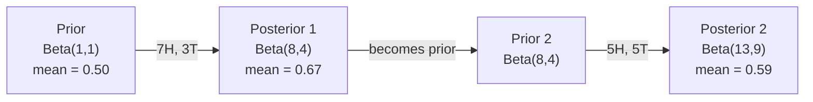

# Bayes' Theorem

> Probability is about what you expect. Bayes' theorem is about what you learn.

**Type:** Build
**Language:** Python
**Prerequisites:** Phase 1, Lesson 06 (Probability Fundamentals)
**Time:** ~75 minutes

**中文深入讲解：** 各概念小节末尾的「深入讲解（中文）」与 [`en-qa-c7.md`](en-qa-c7.md) 同步。

## Learning Objectives

- Apply Bayes' theorem to compute posterior probabilities from priors, likelihoods, and evidence
- Build a Naive Bayes text classifier from scratch with Laplace smoothing and log-space computation
- Compare MLE and MAP estimation and explain how MAP corresponds to L2 regularization
- Implement sequential Bayesian updating using Beta-Binomial conjugate priors for A/B testing

## The Problem

A medical test is 99% accurate. You test positive. What are the chances you actually have the disease?

Most people say 99%. The real answer depends on how rare the disease is. If 1 in 10,000 people have it, a positive result only gives you about a 1% chance of being sick. The other 99% of positive results are false alarms from healthy people.

This is not a trick question. It is Bayes' theorem. Every spam filter, every medical diagnostic, every machine learning model that quantifies uncertainty uses this exact reasoning. You start with a belief. You see evidence. You update.

If you build ML systems without understanding this, you will misinterpret model outputs, set bad thresholds, and ship overconfident predictions.

## The Concept

### From joint probability to Bayes

You already know from Lesson 06 that conditional probability is:

```
P(A|B) = P(A and B) / P(B)
```

And symmetrically:

```
P(B|A) = P(A and B) / P(A)
```

Both expressions share the same numerator: P(A and B). Set them equal and rearrange:

```
P(A and B) = P(A|B) * P(B) = P(B|A) * P(A)

Therefore:

P(A|B) = P(B|A) * P(A) / P(B)
```

That is Bayes' theorem. Four quantities, one equation.

### The four parts

| Part | Name | What it means |
|------|------|---------------|
| P(A\|B) | Posterior | Your updated belief about A after seeing evidence B |
| P(B\|A) | Likelihood | How probable the evidence B is if A is true |
| P(A) | Prior | Your belief about A before seeing any evidence |
| P(B) | Evidence | Total probability of seeing B under all possibilities |

The evidence term P(B) acts as a normalizer. You can expand it using the law of total probability:

```
P(B) = P(B|A) * P(A) + P(B|not A) * P(not A)
```

### Medical test example

A disease affects 1 in 10,000 people. The test is 99% accurate (catches 99% of sick people, gives false positives 1% of the time).

```
P(sick)          = 0.0001     (prior: disease is rare)
P(positive|sick) = 0.99       (likelihood: test catches it)
P(positive|healthy) = 0.01    (false positive rate)

P(positive) = P(positive|sick) * P(sick) + P(positive|healthy) * P(healthy)
            = 0.99 * 0.0001 + 0.01 * 0.9999
            = 0.000099 + 0.009999
            = 0.010098

P(sick|positive) = P(positive|sick) * P(sick) / P(positive)
                 = 0.99 * 0.0001 / 0.010098
                 = 0.0098
                 = 0.98%
```

Less than 1%. The prior dominates. When a condition is rare, even accurate tests produce mostly false positives. This is why doctors order confirmation tests.

### Spam filter example

You receive an email containing the word "lottery". Is it spam?

```
P(spam)                = 0.3      (30% of email is spam)
P("lottery"|spam)      = 0.05     (5% of spam emails contain "lottery")
P("lottery"|not spam)  = 0.001    (0.1% of legitimate emails contain "lottery")

P("lottery") = 0.05 * 0.3 + 0.001 * 0.7
             = 0.015 + 0.0007
             = 0.0157

P(spam|"lottery") = 0.05 * 0.3 / 0.0157
                  = 0.955
                  = 95.5%
```

One word shifts the probability from 30% to 95.5%. A real spam filter applies Bayes across hundreds of words simultaneously.

### Naive Bayes: independence assumption

Naive Bayes extends this to multiple features by assuming all features are conditionally independent given the class:

```
P(class | feature_1, feature_2, ..., feature_n)
  = P(class) * P(feature_1|class) * P(feature_2|class) * ... * P(feature_n|class)
    / P(feature_1, feature_2, ..., feature_n)
```

The "naive" part is the independence assumption. In text, word occurrences are not independent ("New" and "York" are correlated). But the assumption works surprisingly well in practice because the classifier only needs to rank classes, not produce calibrated probabilities.

Since the denominator is the same for all classes, you can skip it and just compare numerators:

```
score(class) = P(class) * product of P(feature_i | class)
```

Pick the class with the highest score.

### Maximum likelihood estimation (MLE)

How do you get P(feature|class) from training data? Count.

```
P("free"|spam) = (number of spam emails containing "free") / (total spam emails)
```

This is MLE: choose the parameter values that make the observed data most likely. You are maximizing the likelihood function, which for discrete counts reduces to relative frequency.

Problem: if a word never appears in spam during training, MLE gives it probability zero. One unseen word kills the entire product. Fix this with Laplace smoothing:

```
P(word|class) = (count(word, class) + 1) / (total_words_in_class + vocabulary_size)
```

Adding 1 to every count ensures no probability is ever zero.

### 深入讲解（中文）：Laplace 平滑与分母

课文原句：

> P(word|class) = (count(word, class) + 1) / (total_words_in_class + vocabulary_size)

在朴素贝叶斯文本分类中，Laplace（加一）平滑的公式是：

```text
P(word | class) = (count(word, class) + 1)
                  / (total_words_in_class + vocabulary_size)
```

#### 为什么分母是 `total_words_in_class + vocabulary_size`

这里的分母之所以是 `total_words_in_class + vocabulary_size`，是为了使加一后的所有词概率总和仍然等于 1。

设：

- 该类别中所有词出现次数的总和为 `N`；
- 词汇表中共有 `V` 个词；
- 某个词 `w` 在该类别中出现 `c_w` 次。

加一平滑会给词汇表里的每一个词都额外加一次计数。因此，平滑后的总词数为：

```text
sum(c_w + 1)
= sum(c_w) + sum(1)
= N + V
```

所以单个词的条件概率为：

```text
P(w | class) = (c_w + 1) / (N + V)
```

例如，某类别中原本有 10 个词，整个词汇表有 4 个词：

- `total_words_in_class = 10`
- `vocabulary_size = 4`

平滑后，总计数从 `10` 变为 `10 + 4 = 14`。如果 `free` 原本出现了 2 次：

```text
P(free | class) = (2 + 1) / (10 + 4) = 3 / 14
```

若某个词从未出现过：

```text
P(unseen_word | class) = (0 + 1) / 14 = 1 / 14
```

这样可以避免未见词的概率为 0；否则，在朴素贝叶斯中与其他词概率相乘时，整个类别的分数会直接变成 0。

注意：`total_words_in_class` 指该类别的词元（token）总数，而不是该类别的文档数量。

---

### Maximum a posteriori (MAP)

MLE asks: what parameters maximize P(data|parameters)?

MAP asks: what parameters maximize P(parameters|data)?

By Bayes' theorem:

```
P(parameters|data) proportional to P(data|parameters) * P(parameters)
```

MAP adds a prior over the parameters themselves. If you believe parameters should be small, you encode that as a prior that penalizes large values. This is identical to L2 regularization in ML. The "ridge" penalty in ridge regression is literally a Gaussian prior on the weights.

| Estimation | Optimizes | ML equivalent |
|------------|-----------|---------------|
| MLE | P(data\|params) | Unregularized training |
| MAP | P(data\|params) * P(params) | L2 / L1 regularization |

### 深入讲解（中文）：MLE、MAP 与先验

#### MLE 与 MAP 有什么不同？


MLE 问：**什么参数能让观测数据出现的概率最大？**  
MAP 问：**在看到数据之后，什么参数最可信？**

两者都在用数据选参数，但优化的对象不同。

#### 1. 优化目标

**MLE（极大似然）**

- **问题：** 什么参数让观测数据最可能？
- **形式：** `argmax_θ P(data | θ)`

**MAP（极大后验）**

- **问题：** 什么参数在看到数据之后最可信？
- **形式：** `argmax_θ P(θ | data)`

最大似然估计（MLE）只根据观测数据选择参数：

```text
θ_MLE = argmax_θ P(data | θ)
```

它问的是：“如果参数是 `θ`，当前这批数据出现的可能性有多大？”MLE 选择能让当前数据最可能出现的参数。

最大后验估计（MAP）在数据之外还纳入对参数的事先看法：

```text
θ_MAP = argmax_θ P(θ | data)
```

根据贝叶斯公式，后验与似然、先验成正比：

```text
P(θ | data) ∝ P(data | θ) × P(θ)
```

即：**后验 ∝ 似然 × 先验**。MAP 最大化的是两者之积，既要求参数能解释数据，也要求参数符合先验偏好。

取对数时（单调变换，最大值位置不变）：

```text
argmax_θ [ log P(data | θ) + log P(θ) ]
```

- MLE：只最大化 `log P(data | θ)`（似然项）。
- MAP：最大化 **似然 + 先验** `log P(θ)`。

因此 MAP 可以看作：在 MLE 的目标上多加一项“参数要先符合我们的先验信念”。

#### 2. 直观区别

1. **有没有先验**  
   - MLE：数据说了算，没有 `P(θ)`。  
   - MAP：数据 + 你对参数的事先看法（例如“权重应该接近 0”）。

2. **先验很宽时，两者接近**  
   若 `P(θ)` 几乎处处相同（很“平”的先验），`log P(θ)` 对 `θ` 几乎不变，MAP 与 MLE 近似一致。

3. **小样本与过拟合**  
   - MLE：只看“拟合数据好不好”；数据少或有噪声时，参数可能过拟合。  
   - MAP：先验会把参数向先验中心**收缩**，常起到**正则化**作用。例如高斯先验 `θ ~ N(0, σ²)` 在不少模型里等价于 **L2 正则**（岭回归中很常见）。

4. **视角（便于记忆，不必纠结流派）**  
   - MLE：频率派里“让数据概率最大”的点估计。  
   - MAP：贝叶斯里的**点估计**（后验的众数），不是整条后验分布；完整贝叶斯还会对后验积分、给出区间等。

#### 3. 抛硬币例子

**数据很少：** 只观察到 1 次抛硬币，结果是正面。

- MLE：`p = 1`（让这次观测的似然最大）。
- MAP（偏向公平硬币的先验）：`p` 接近 `0.5` 但略高于 `0.5`，而不是武断地认为 `p = 1`。

**数据较多：** 观测到 7 次正面、3 次反面，估计正面概率 `p`（记正面次数 `k = 7`，总次数 `n = 10`）。

- MLE：`p = k/n = 7/10 = 0.7`（纯计数，最让这份数据“像真硬币”）。
- MAP（Beta 先验 `Beta(α, β)`，与二项似然共轭）：

```text
p_MAP = (k + α - 1) / (n + α + β - 2)
      = (7 + α - 1) / (10 + α + β - 2)
```

若先验为 `Beta(2, 2)`（略偏向公平），`p_MAP = 8/12 ≈ 0.667`，略小于 `0.7`，向先验均值 `0.5` 收缩一点。

##### 3.1 为什么 MAP 是这个式子？（Beta–二项共轭）

**步骤 1：似然（二项）**

独立抛 `n` 次，正面 `k` 次、反面 `n - k` 次。在正面概率为 `p` 时：

```text
P(data | p) ∝ p^k (1 - p)^(n - k)
```

（比例系数与 `p` 无关，MAP 时可忽略。）

**步骤 2：先验 Beta(α, β)**

`p` 在 `[0, 1]` 上，Beta 密度为：

```text
P(p) ∝ p^(α - 1) (1 - p)^(β - 1)
```

`α, β > 1` 时先验在 `(0,1)` 内单峰；`Beta(2, 2)` 对称、在 `p = 0.5` 附近最高，表示「略相信硬币较公平」。

**步骤 3：后验仍是 Beta（共轭）**

```text
P(p | data) ∝ P(data | p) × P(p)
            ∝ p^(α + k - 1) (1 - p)^(β + n - k - 1)
```

因此后验为：

```text
p | data ~ Beta(α', β'),    α' = α + k,    β' = β + (n - k)
```

（与讲义表一致：`Beta(a, b)` 观测到 `s` 次成功、`f` 次失败 → `Beta(a + s, b + f)`，这里 `s = k`，`f = n - k`。）

**步骤 4：MAP = Beta 分布的众数（mode）**

对 `Beta(α', β')`，当 `α' > 1` 且 `β' > 1` 时，密度在 `(0,1)` 内唯一极大点（众数）为：

```text
mode = (α' - 1) / (α' + β' - 2)
```

代入 `α' = α + k`，`β' = β + n - k`：

```text
p_MAP = (α + k - 1) / (α + k + β + n - k - 2)
      = (k + α - 1) / (n + α + β - 2)
```

**步骤 5：代入 `k = 7`，`n = 10`，先验 `Beta(2, 2)`**

后验：`Beta(2 + 7, 2 + 3) = Beta(9, 5)`。

```text
p_MAP = (9 - 1) / (9 + 5 - 2) = 8 / 12 ≈ 0.667
```

对比：

| 估计 | 公式 | 本例数值 |
|---|---|---|
| MLE | `k / n` | `0.7` |
| MAP `Beta(2,2)` | `(k+α-1)/(n+α+β-2)` | `≈ 0.667` |
| 后验均值（不是 MAP） | `(α+k)/(α+β+n)` | `9/14 ≈ 0.643` |

MAP 取的是后验曲线的**峰值**；后验均值是分布的**重心**，二者一般不相等。数据变多时，MAP、均值、MLE 都会靠近真实 `p`。

**特例：** 先验 `Beta(1, 1)`（均匀）时，后验参数来自通用规则 `α' = α + k`、`β' = β + (n - k)`，代入 `α = β = 1`：

```text
α' = 1 + k = k + 1
β' = 1 + (n - k) = n - k + 1        ← 不是 n - k；多出来的 1 来自先验里的 β = 1
```

例：`n = 10`，`k = 7`（7 正 3 反）→ 后验 `Beta(8, 4)`，不是 `Beta(8, 3)`。

```text
p_MAP = k / n = p_MLE
```

均匀先验下 MAP 与 MLE 相同（与「无信息先验」故事一致）。注意：原始先验 `Beta(1,1)` 本身在 `p=0,1` 处众数公式分母为 0，不能套 mode 公式；**更新后**的 `Beta(k+1, n-k+1)` 在 `k,n` 为正且不全极端时，众数恰为 `(α'-1)/(α'+β'-2) = k/n`。

##### 3.2 先验为什么是 `P(p) ∝ p^(α-1) (1-p)^(β-1)`？

这不是从「抛硬币」硬推出来的，而是：**在估计区间 `[0,1]` 上的概率 `p` 时，选了一个与二项似然「形状匹配」的标准分布族**，并把参数写成 `α, β`。

**（1）`p` 只能住在 `[0, 1]` 上**

正面概率不是任意实数。先验必须只在 `0 < p < 1`（或含端点）上有定义，且能表达「更相信 0.5」「更相信偏小」等。**Beta 分布**就是定义在 `[0,1]` 上、用两个正数 `α, β` 调节形状的最常用族之一。

完整密度（含归一化常数）为：

```text
P(p) = Γ(α+β) / (Γ(α)Γ(β)) × p^(α-1) (1-p)^(β-1)
```

讲义里写 `∝` 表示：MAP / 后验推导时，与 `p` 无关的常数可以丢掉，只保留随 `p` 变化的部分。

**（2）指数为什么是 `α-1` 和 `β-1`，而不是 `α` 和 `β`？**

这是 **约定**，目的是与二项似然 **`p^k (1-p)^(n-k)`** 对齐：

```text
似然：  p^k           (1-p)^(n-k)
先验：  p^(α-1)       (1-p)^(β-1)
乘积：  p^(α+k-1)     (1-p)^(β+n-k-1)   → 仍是 Beta，参数加在 α、β 上
```

若先验写成 `p^α (1-p)^β`，容易把 **指数** 和讲义里的 **形状参数** 当成同一个数；更新时就会「指数直接 +s、+f」，和统一的 **`Beta(a,b) + s 次成功 → Beta(a+s, b+f)`** 在记号上**差 1**。见下。

**为什么差 1？——形状参数 vs 指数**

讲义约定：`Beta(a, b)` 的密度里，**第一个形状参数是 `a`，但 `p` 的指数是 `a - 1`**（第二个同理）：

```text
Beta(a, b)  ∝  p^(a-1) (1-p)^(b-1)
              ↑ 指数 = 形状参数 − 1
```

二项似然 `p^s (1-p)^f` 乘上先验后，**指数**变成 `(a-1)+s` 和 `(b-1)+f`。要仍写成 Beta 形，新的形状参数必须是：

```text
a' = (a - 1) + s + 1 = a + s
b' = (b - 1) + f + 1 = b + f
```

这就是「成功数加到 `a`、失败数加到 `b`」——加的是**形状参数**，不是指数本身。

若有人把先验写成 `p^α (1-p)^β`，并把 **`α` 当作指数**（不再写 `α-1`），却仍用字母 `α` 称呼「第一个形状参数」，就会矛盾：

| 含义 | `p` 的指数 | 见到 `s` 次成功后指数变成 | 若误用「形状 += s」 |
|---|---|---|---|
| 标准 `Beta(a,b)` | `a - 1` | `(a-1) + s` | 应记 `a' = a + s`（正确） |
| 把指数记成 `α` 且声称 `α = a` | `α` 实际等于 `a-1` | `α + s` | 若写 `a_new = α + s` 则等于 `(a-1)+s`，比真 `a' = a+s` **小 1** |
| 把 `p^α` 里的 `α` 真当成形状 `a` | `α`（多写了 1） | `α + s` | 真形状应为 `α + s + 1` 才对应指数 `α+s` |

**数字例子：** `Beta(2, 2)` 的标准密度是 `p^1 (1-p)^1`（因为 `2-1=1`）。若误写成 `p^2 (1-p)^2` 却仍叫 `Beta(2,2)`，指数比标准**大 1**（其实已是 `Beta(3,3)` 的密度形状）。

7 正 3 反后，标准更新：`Beta(2+7, 2+3) = Beta(9, 5)`（指数 8 与 4）。  
若从错误的 `p^2(1-p)^2` 出发对指数加数据：`9` 与 `5` → 标准记号是 **`Beta(10, 6)`**，形状参数比 `Beta(9,5)` **各多 1**。

**记法建议：** 讲义里的 `a, b` 永远是 **形状参数**；密度指数永远是 **`a-1`, `b-1`**。似然乘进来只加在指数上，再化回形状参数时多出来的那个 `+1`，就是「差 1」的来源。

所以全球教材普遍用 **`α-1, β-1`** 这套指数，让 **`Beta(α,β) + s → Beta(α+s, β+f)`** 不需要心算「指数加完再 +1」。

**（3）`α`、`β` 可看成「伪计数」（pseudo-counts）**

等价故事：从 **无信息先验 `Beta(1,1)`（均匀）** 出发，在见到真实数据之前，假装已经见过一些结果：

```text
Beta(1,1)  +  (α-1) 次「成功」  +  (β-1) 次「失败」  →  Beta(α, β)
```

因此：

- `α` 越大：先验越相信 `p` 偏大（更多伪正面）；
- `β` 越大：先验越相信 `p` 偏小；
- `α = β`：先验对称，常表示「略偏向公平」；
- `Beta(1,1)`：`α-1 = β-1 = 0`，密度常数，**对一切 p 同样不确定**；
- `Beta(2,2)`：相当于均匀先验后再加 **1 正 1 反**（与加一平滑的直觉相近），在 0.5 附近略鼓起来。

后验更新与真实数据一致：

```text
Beta(α, β)  +  k 次正面  +  (n-k) 次反面  →  Beta(α+k, β+n-k)
```

**（4）为什么是 Beta，而不是别的分布？**

对 **伯努利/二项** 似然，在常见先验里 **Beta 是共轭先验**：后验仍是 Beta，公式只有加法，不必数值积分。这是选它的实用原因。

若你换一类完全不同的似然（例如高斯噪声下的均值），共轭先验会变成别的族（如高斯），形式也会变；**「`p` 在 `[0,1]` + 二项数据 → Beta 先验」** 是配套的一套。

**（5）和 Laplace / 加一平滑的呼应**

朴素贝叶斯里对词概率的加一平滑，离散版本是 **Dirichlet 先验** 上的 MAP；抛硬币的 Beta 是 **Dirichlet 在二维（成功/失败）上的特例**。都是：在计数式似然上，用「幂次型」先验，让后验仍是同一族。

**小结**

| 问题 | 答案 |
|---|---|
| 为什么是幂次 `p^? (1-p)^?`？ | 与二项似然同形，相乘后后验仍好算 |
| 为什么是 `α-1, β-1`？ | 约定，使 `Beta(α,β)+k 成功` → `Beta(α+k, β+…)` |
| `α, β` 代表什么？ | 先验强度与方向；可理解为伪成功/伪失败 + 1 |
| 能否换别的先验？ | 可以，但后验一般不再是 Beta，更新更麻烦 |

##### 3.3 `Beta(α, β)` 的指数一定是 `α-1` 和 `β-1` 吗？

**在讲义与绝大多数统计/机器学习教材采用的定义下：是的。**  
名字里的 **`α`、`β` 叫形状参数（shape parameters）**；密度在 `0 < p < 1` 上写成：

```text
P(p) = [Γ(α+β) / (Γ(α)Γ(β))] × p^(α-1) (1-p)^(β-1)
```

因此：

- **`α`、`β` 不是** `p` 和 `1-p` 上的指数本身；
- **指数** 分别是 **`α - 1`** 与 **`β - 1`**（这是 **定义** 的一部分，为的是与二项似然共轭时更新规则是 `α ← α+s`）。

**要求：** `α > 0` 且 `β > 0`（否则无法正常归一化）。

**常见特例（指数可以是 0）：**

| 先验 | 形状 `(α, β)` | `p` 的指数 | `(1-p)` 的指数 |
|---|---|---|---|
| 均匀 | `Beta(1, 1)` | `0` | `0` |
| 略信公平 | `Beta(2, 2)` | `1` | `1` |
| 偏信 `p` 小 | `Beta(1, 10)` | `0` | `9` |

`α = 1` 时 **`p^0 = 1`**，表示先验在 `p → 0` 一侧不发散；不是「没有 `α-1` 这项」。

**会不会有人用别的参数化？** 偶尔有书或软件用「指数参数」`(κ, η)` 直接写 `p^κ (1-p)^η`，那时 **`κ = α - 1`**。读本课、做共轭更新时，一律把 **`Beta(α, β)` 里的 `α, β` 当形状参数**，指数用 **`α-1`, `β-1`** 去读密度即可。

##### 3.4 手把手：为什么共轭更新是 `Beta(α, β) + s 成功 → Beta(α+s, β+f)`？

「共轭」在这里可以先理解成一件事：**先验和后验长得同一种样子**（都是 `p` 的某次方乘 `(1-p)` 的某次方）。更新规则来自 **把似然乘到先验上，再认后验仍是 Beta**。

**第 1 步：数据只提供两个指数**

抛硬币 `n` 次：`s` 次正面、`f` 次反面（`f = n - s`）。在固定 `p` 下，似然正比于：

```text
P(data | p) ∝ p^s (1-p)^f
```

没有别的 `p` 的复杂因子——这就是二项/伯努利「共轭」好用的原因。

**第 2 步：先验也是两个指数**

讲义定义 `Beta(α, β)`：

```text
P(p) ∝ p^(α-1) (1-p)^(β-1)
```

**第 3 步：后验 = 相乘，指数相加**

```text
P(p | data) ∝ P(data | p) × P(p)
            ∝ p^s (1-p)^f  ×  p^(α-1) (1-p)^(β-1)
            ∝ p^( (α-1) + s ) (1-p)^( (β-1) + f )
```

合并后仍是 **`p` 的幂 × `(1-p)` 的幂**——形状与 Beta 族相同，只是幂次变了。

**第 4 步：把新幂次读回「形状参数」**

任何 `Beta(α_new, β_new)` 的密度幂次必须是 **`α_new - 1`** 和 **`β_new - 1`**。与上式对照：

```text
α_new - 1 = (α - 1) + s    →    α_new = α + s
β_new - 1 = (β - 1) + f    →    β_new = β + f
```

这就是讲义里的更新：**成功数加到第一个形状参数，失败数加到第二个**。不是额外魔法，就是 **「指数相加」再 **「+1 变回形状名」**。

**第 5 步：数字走一遍（7 正 3 反，先验 `Beta(2, 2)`）**

```text
s = 7,  f = 3,  α = 2,  β = 2

先验指数：     p^(2-1) (1-p)^(2-1)  =  p^1 (1-p)^1
乘似然：       × p^7 (1-p)^3
后验指数：     p^(1+7) (1-p)^(1+3)  =  p^8 (1-p)^4

读回形状：     p^8 = p^(9-1)  →  α_new = 9
               (1-p)^4 = (1-p)^(5-1)  →  β_new = 5

即  Beta(2,2) + 7 正 + 3 反  →  Beta(9, 5)
```

也可直接套规则：`α_new = 2+7 = 9`，`β_new = 2+3 = 5`。

**若先验误写成 `p^α (1-p)^β`（把 α 当指数）会怎样？**

同样乘上 `p^7 (1-p)^3`，指数变成 `α+7` 和 `β+3`。若 **`α=2` 表示指数 2**（不是形状 `Beta(2,2)`），后验指数是 9 和 5，对应标准形状 **`Beta(10, 6)`**，而不是 `Beta(9, 5)`。

若你 **仍用形状规则 `+7, +3` 得到 `Beta(9,5)`**，那对应的标准密度指数应是 8 和 4——与真实指数 9、5 **差 1**。  
根因：标准 `Beta(2,2)` 的指数是 **1**，不是 **2**；名字里的 `2` 是形状参数。

**和「共轭」一句话对齐**

| 步骤 | 在做什么 |
|---|---|
| 似然 | 给 `p` 和 `1-p` 的指数 **+s、+f** |
| 先验 `Beta(α,β)` | 指数从 **α-1、β-1** 出发 |
| 后验 | 指数 **(α-1)+s、(β-1)+f** |
| 改名 | 形状 **α+s、β+f** |

所以 **`α-1` 这套写法** 的目的，就是让「数据加在指数上」和「讲义里对形状参数做加法」**是同一件事**。

#### 4. 二者的关系

若先验 `P(θ)` 为均匀分布（所有参数同样可信），它对不同 `θ` 只是相同常数，于是：

```text
θ_MAP = θ_MLE
```

MLE 可看作“不使用参数先验的 MAP”。数据量很大时，似然往往压过先验，MLE 与 MAP 也会越来越接近；数据少或模型复杂时，先验带来的差别更明显。

在机器学习中，给参数加高斯先验对应 L2 正则化；推导见下一节「MAP、高斯先验与 L2 / 岭回归」。

#### 5. 一句话

- **MLE**：哪组参数能让这份数据出现？  
- **MAP**：在看到数据之后，哪组参数最合理？——答案 = 似然（与 MLE 同一项）再乘上你对参数的事先信念。

#### MAP 里的 `P(θ)` 在实际应用中怎么来？


先说一句最重要的：**`P(θ)` 一般不是用「当前这批训练数据」算出来的似然那种估计；它是建模选择**——在见到数据之前，你对参数 `θ` 相信什么。工程里常常不显式写出密度，但等价于选了某种先验（或选了正则强度）。

#### 1. 和 `P(data | θ)` 的分工

**似然 `P(data | θ)`**

- **问什么：** 给定参数，这批数据有多合理？
- **典型来源：** 模型假设（二项、高斯噪声等）+ **当前这批数据**
- **是否用本批 data 来「拟合」：** 是（MLE / MAP 的似然项都吃这批 data）

**先验 `P(θ)`**

- **问什么：** 在见到数据之前，哪些参数更合理？
- **典型来源：** 领域知识、历史实验、默认弱先验，或在 **验证集** 上调好的超参
- **是否用本批 data 来「拟合」：** **通常否**（经验贝叶斯等例外见 §2（5））

MAP 里先验的角色：在似然允许多组 `θ` 都能拟合时，**把解拉向你更信的区域**。

#### 2. 实际中常见的六种来源

**（1）领域知识与基率（最「贝叶斯」）**

讲义医学检测：`P(sick)=0.0001` 来自人群患病率，不是从本次化验数据估的。  
A/B 测试：讲义提到可把历史转化率「通常 3%–8%」编码进 `Beta` 先验（如均值落在该区间、总量 `α+β` 反映信心强弱）。

做法：定 **先验均值/区间** → 选共轭族参数（如 `Beta(α,β)` 的 `α/(α+β)`）。

**（2）弱信息 / 默认先验（「尽量不偏」）**

没有强先验时：`Beta(1,1)` 均匀、`N(0, 很大方差)` 等。  
目的：少强加结构，主要让数据说话；小样本时仍比纯 MLE 稳一点（如加一平滑）。

**（3）上一阶段的后验 = 下一阶段的先验（序贯更新）**

讲义硬币 / A/B：**今天后验 `Beta(8,4)` 明天当先验**，再叠新数据。  
`P(θ)` 来自 **过去实验的贝叶斯结论**，不是凭空拍脑袋。

**（4）与正则等价：先验形状固定，强度用验证集调（ML 最常见）**

岭回归 / weight decay：形式常取 **高斯先验** `w ~ N(0, τ² I)`，但 **`λ` 或 `weight_decay` 多大** 很少靠主观，而是：

- 在 **验证集** 上扫 `λ`，选泛化最好的；
- 等价于在一族先验里选 **先验精度**（`λ ∝ 1/τ²`）。

这时 **`P(θ)` 的函数形状**（高斯、拉普拉斯→L1）是建模假设；**具体数值** 是 **超参数学习**，不是对训练集做 MLE 估先验。

**（5）经验贝叶斯（Empirical Bayes）——用数据估「先验的超参」**

允许 **另一层**：先从（训练集或历史数据）估计 `α, β` 或 `τ`，再把这些当已知，对当前任务做 MAP。  
朴素贝叶斯里 **全局词频** 有时也起类似「先验信息」作用。  
注意：若用 **同一份数据** 既估超参又估 `θ` 且不划分样本，会 **过拟合**；实践里常用划分、交叉验证或层级模型。

**（6）共轭族 + 闭式更新（算力与可解释）**

选 `Beta`、`Dirichlet`、`Gaussian` 等，往往不是因为「真理一定是 Beta」，而是 **更新简单、可手算、可审计**（课里硬币、NB 平滑）。

#### 3. 工程上「没写 P(θ)」算不算 MAP？

很多框架只写 `loss = 数据项 + λ||w||²`。你没写 `P(w)`，但 **λ 项就是 `-log P(w)`（高斯先验）**。  
所以：**先验在应用里常常是「选正则族 + 调 λ」**；严格贝叶斯还会强调 **先验应不依赖当前训练标签的拟合结果**（超参用验证集或外层数据）。

#### 4. 常见误区

1. **用训练集 `θ_MLE` 当 `P(θ)` 的中心，再对同一批数据做 MAP**  
   信息重复利用。应划分数据，或把 `θ_MLE` 视为 **另一数据集** 的结论。

2. **以为 `P(θ)` 能从公式「推导」出唯一答案**  
   不同合理先验 → 不同 MAP；专业贝叶斯会做敏感性分析。

3. **以为先验和似然都由「当前样本频率」直接算出**  
   似然才直接吃当前计数；先验编码 **见数据之前** 的信念，或 **验证集 / 外层** 调好的超参。

#### 5. 按场景记

- **硬币 / 转化率：** `Beta(α,β)`（均匀或历史均值）；可序贯更新  
- **朴素贝叶斯词概率：** Dirichlet；加一平滑 ≈ 对称 Dirichlet 的 MAP  
- **线性回归 / 神经网络：** 高斯（L2）或拉普拉斯（L1）；**λ 在验证集上调**  
- **罕见病诊断：** 文献患病率 → `P(病)`  
- **不想强加偏好：** 弱信息先验；数据量大时近似 MLE  

#### 6. 一句话

**`P(θ)` 不是从当前似然里「解方程」得到的，而是你（或历史数据、或验证集）对参数事先信念的编码；MAP 把它和 `P(data|θ)` 乘在一起。机器学习里最常见的是：先验族固定（如高斯），具体强度当超参数调。**

---

---

### 深入讲解（中文）：MAP、高斯先验与 L2 / 岭回归

#### MAP、高斯先验与 L2 / 岭回归


英文讲义中的说法可以概括为：

> MAP 在参数上加入先验。若你相信参数应该偏小，就用一个惩罚大取值的先验来编码这种信念。这与机器学习里的 L2 正则**完全同一回事**；岭回归里的 ridge 惩罚，本质上就是对权重施加的高斯先验。

下面用线性回归把「贝叶斯说法」和「优化说法」对齐。

#### 1. 你在先验里编码了什么信念？

MAP 不只问「权重能否拟合数据」，还问「这组权重在见到数据之前是否合理」。

若你认为：

- 多数特征对输出的影响应该**温和**（不要极端大的正/负权重）；
- 没有强证据时，权重应**靠近 0**；

就可以在参数上设**中心在 0 的高斯先验**（各分量独立、方差相同时最常见）：

```text
w ~ N(0, τ² I)
```

含义：在看到 `(X, y)` 之前，你预期 `w` 的每个分量都在 0 附近，且绝对值很大的分量概率很低。高斯密度在 `||w||` 很大时迅速下降，因此 **`log P(w)` 会惩罚过大的权重**——这就是「先验惩罚大取值」的精确含义。

先验越强（`τ` 越小），你越坚持「权重必须小」；先验越弱（`τ` 越大），越接近「对权重几乎没意见」，MAP 就越像 MLE。

#### 2. 线性模型：似然 + 高斯先验 → 岭回归

设监督学习里（固定设计矩阵 `X`）有：

```text
y = Xw + ε,    ε ~ N(0, σ² I)
```

**为什么「给定 `w`」有 `y | X, w ~ N(Xw, σ² I)`？** 见 **§2.1-似然**。

即：在固定 `X`、`w` 下，`y` 的随机性只来自噪声 `ε`；均值是 `Xw`，协方差是 `σ² I`。于是对数似然（差一个与 `w` 无关的常数）为：

```text
log P(y | X, w) = - (1 / 2σ²) ||y - Xw||² + const
```

**MLE** 只最大化上式，等价于最小化平方误差：

```text
w_MLE = argmin_w ||y - Xw||²
```

这就是普通最小二乘。数据少、特征多或共线时，`w_MLE` 往往很大、很不稳定（过拟合）。

**MAP** 在 `w` 上再加高斯先验 `w ~ N(0, τ² I)`：

```text
log P(w) = - (1 / 2τ²) ||w||² + const
```

（推导见 **§2.0**。）

##### 2.0 高斯先验 `log P(w)` 是怎么来的？

设权重向量 `w ∈ R^p`，先验为 **各分量独立、均值 0、方差同为 `τ²`**：

```text
w ~ N(0, τ² I)
```

即每个 `w_j` 独立，且 `w_j ~ N(0, τ²)`。一元高斯密度（均值 0）为：

```text
P(w_j) = (1 / sqrt(2π τ²)) exp( - w_j² / (2τ²) )
```

**方法 A：按分量相乘（独立）**

独立时联合密度是乘积：

```text
P(w) = ∏_j P(w_j)
     = ∏_j (2π τ²)^(-1/2) exp( - w_j² / (2τ²) )
     = (2π τ²)^(-p/2) exp( - (1 / 2τ²) ∑_j w_j² )
     = (2π τ²)^(-p/2) exp( - (1 / 2τ²) ||w||² )
```

因为 `||w||² = w_1² + … + w_p²`。取对数：

```text
log P(w) = - (p/2) log(2π τ²)  -  (1 / 2τ²) ||w||²
         = - (1 / 2τ²) ||w||² + const
```

其中 **`const = -(p/2) log(2π τ²)`** 与 `w` 无关；做 MAP / 最小化负对数后验时可丢掉。

**`p/2` 是什么？**（见 **§2.0.3**）

###### 2.0.3 `log P(w)` 里的 `p` 和 `p/2` 指什么？

- **`p`：** 权重向量的 **维数**（有多少个 `w_j`）。例如 `p` 个特征 → `w = (w_1, …, w_p)`，`||w||² = w_1² + … + w_p²` 里共有 **`p` 项**。

- **`p/2` 从哪来：** 归一化常数里有 **`(2π τ²)^(-p/2)`**。取对数：

```text
log( (2π τ²)^(-p/2) ) = (-p/2) · log(2π τ²) = - (p/2) log(2π τ²)
```

指数上的 **`-p/2`** 变成对数前面的 **`-p/2`**（幂的对数：`log(a^b) = b·log(a)`）。

**按分量看更直观：** 每个 `w_j` 的一元密度带因子 `(2π τ²)^(-1/2)`，`p` 个独立分量相乘：

```text
∏_j (2π τ²)^(-1/2) = (2π τ²)^(-p/2)
```

所以 **`p/2` 不是别的神秘参数**，就是 **「有 `p` 个方差为 `τ²` 的一维高斯，归一化常数乘了 `p` 次，每次指数是 -1/2」** 的结果。

**为什么可以写成 `+ const`：** `-(p/2) log(2π τ²)` 只依赖 **`p` 和 `τ²`**，不依赖 **`w`**。MAP 求 `argmax_w` 或最小化负对数时，这项对 `w` 的梯度为 0，**可整体当作常数扔掉**；只有 **`-(1/2τ²)||w||²`** 会拉动 `w` 向 0 收缩。

**方法 B：多元高斯公式（向量形式）**

一般形式 `w ~ N(μ, Σ)`：

```text
P(w) = (2π)^(-p/2) |Σ|^(-1/2) exp( - (1/2) (w - μ)^T Σ^(-1) (w - μ) )
```

这里 `μ = 0`，`Σ = τ² I`。下面说明 **`Σ^(-1) = (1/τ²) I`** 与 **`|Σ| = (τ²)^p`**（见 **§2.0.1**），再代入公式。

```text
P(w) = (2π)^(-p/2) (τ²)^(-p/2) exp( - (1 / 2τ²) w^T w )
     = (2π τ²)^(-p/2) exp( - (1 / 2τ²) ||w||² )
```

与方法 A 相同，取对数即得 `log P(w) = - (1 / 2τ²) ||w||² + const`。

###### 2.0.1 为什么 `Σ = τ² I` 时 `Σ^(-1) = (1/τ²) I`，`|Σ| = (τ²)^p`？

**`I` 是什么：** `p × p` 单位矩阵，对角线为 1，其余为 0。`τ² I` 表示 **对角线上每个元素都是 `τ²`**，非对角为 0（各分量独立、同方差）。

**逆矩阵 `Σ^(-1) = (1/τ²) I`**

要满足 `Σ Σ^(-1) = I`（矩阵乘积为单位阵）。令 `Σ = τ² I`：

```text
(τ² I) · (1/τ²) I = (τ² / τ²) · (I · I) = 1 · I = I
```

所以 **`(1/τ²) I` 就是逆**。直观：标量乘法 `(τ²) · (1/τ²) = 1`，对整条对角线同时成立。

`p = 2` 时写出来：

```text
Σ = [ τ²   0  ]     Σ^(-1) = [ 1/τ²   0    ]
    [  0  τ² ]              [  0   1/τ² ]
```

**行列式 `|Σ| = (τ²)^p`**

对角矩阵的行列式 = **对角元乘积**（原因见 **§2.0.2**）。`τ² I` 有 `p` 个对角元，全是 `τ²`：

```text
|Σ| = τ² × τ² × … × τ²  (共 p 个)  = (τ²)^p
```

`p = 2`：`|Σ| = τ² · τ² = τ⁴ = (τ²)²`。

也可用 **`|c A| = c^p |A|`**（`A` 为 `p×p`）：`|τ² I| = (τ²)^p |I| = (τ²)^p · 1`。

###### 2.0.2 为什么对角矩阵的行列式 = 对角元全部相乘？

记

```text
D = diag(d₁, d₂, …, dₚ) =  对角上是 d₁,…,dₚ，其余位置为 0
```

要证：**det(D) = d₁ d₂ … dₚ**。

**（1）从 2×2 公式直接看**

```text
| d₁  0  |  = d₁ d₂ - 0·0 = d₁ d₂
| 0  d₂ |
```

非对角为 0 时，交叉项消失，只剩两个对角元相乘。

**（2）按第一行展开（归纳到任意维）**

行列式可按第一行做拉普拉斯展开：

```text
det(D) = d₁₁ · det(D₁₁) - d₁₂ · det(D₁₂) + …
```

对角矩阵里 **第一行只有 `d₁` 非零**（在 (1,1) 位置），其余 `d₁₂ = d₁₃ = … = 0`，所以：

```text
det(D) = d₁ · det(删去第 1 行第 1 列后的小矩阵)
```

删掉的那块仍是 **更小的对角矩阵**，对维度 `p` 做数学归纳：

- `p = 1`：`det([d₁]) = d₁`；
- 若 `p-1` 维对角阵行列式 = 对角元乘积，则 `p` 维得 `d₁ · (d₂…dₚ) = d₁ d₂ … dₚ`。

**（3）几何直觉（可选）**

矩阵表示线性变换。对角阵表示：**第 i 个坐标轴方向只拉伸 `dᵢ` 倍**，不把轴扭到别的方向。  
单位「方块」体积变成 **各边长度分别乘 `dᵢ`**，体积（行列式的绝对值）就是 **`d₁ d₂ … dₚ`**。有负对角元时符号可能变，`|det|` 仍是乘积的绝对值。

**本课用到的特例：** `D = τ² I` 时每个 `dᵢ = τ²`，故 `det(D) = (τ²)^p`。

**代入高斯公式时用到：** `|Σ|^(-1/2) = (τ²)^(-p/2)`，与 `(2π)^(-p/2)` 合并成 `(2π τ²)^(-p/2)`。

**和 ridge 的关系：** `const` 不影响 `argmax_w`；负对数先验项是 `(1 / 2τ²) ||w||²`，即 L2 惩罚（差一个与 `σ²` 相关的缩放，见 §2.1）。

MAP 估计：

```text
w_MAP = argmax_w [ log P(y | X, w) + log P(w) ]
```

因为 `log` 把乘法变成加法，最大化后验 = 最小化负对数后验：

```text
w_MAP = argmin_w [ (1 / σ²) ||y - Xw||² + (1 / τ²) ||w||² ]
```

##### 2.1 这一项是怎么得到的？（逐步推导）

**步骤 0：MAP 定义与贝叶斯公式**

```text
w_MAP = argmax_w P(w | y, X)
```

在**标准线性回归的贝叶斯设定**下，下面这个式子是**对的**（不是笔误）：

```text
P(w | y, X) = P(y | X, w) × P(w) / P(y | X)
```

它和入门课里的 `P(A|B) = P(B|A)P(A)/P(B)` 是同一件事，只是记号更细：

| 入门贝叶斯 | 回归里估计权重 |
|---|---|
| 假设 `A` | 参数 `w` |
| 证据 `B` | 在已知特征矩阵 `X` 下观测到的 `y` |
| 似然 `P(B|A)` | `P(y | X, w)`：给定 `w` 时 `y` 的分布 |
| 先验 `P(A)` | `P(w)` |
| 证据（归一化） | `P(y | X)`：对 `w` 积分掉参数后的边际 |

**为什么条件里要写 `X`？**  
`y` 是通过 `y = Xw + ε` 依赖 `w` 的：同样的 `w`，不同的 `X` 会产生不同的 `y` 分布。似然必须是「在**这份** `X` 下，看到**这份** `y` 有多合理」，所以写 `P(y | X, w)`，不能只写 `P(y | w)`。

**为什么先验是 `P(w)` 而不是 `P(w | X)`？**  
常见约定：**`X` 当作固定的设计矩阵**（非随机、不由 `w` 生成），权重先验与 `X` 独立，故 `P(w | X) = P(w)`。若你的模型里 `X` 也随机且依赖参数，就要用更一般的 `P(w | X)` 和 `P(y | X, w)`，那是另一套设定。

**分母 `P(y | X)` 是什么？**

```text
P(y | X) = ∫ P(y | X, w) P(w) dw
```

这是对所有可能的 `w` 加权平均得到的「在只见 `X`、尚未指定 `w` 时，`y` 的边际概率」。MAP 只关心分子里的 `P(y | X, w) P(w)`，因为分母与 `w` 无关：

```text
argmax_w P(w | y, X) = argmax_w [ P(y | X, w) × P(w) ]
```

（等价写法：令 `D = (X, y)`，则 `P(w | D) = P(D | w) P(w) / P(D)`；在 `X` 固定时 `P(D | w) = P(y | X, w)`，`P(D) = P(y | X)`。）

**容易误以为「不对」的几种写法**

- 只写 `P(w | y) = P(y | w) P(w) / P(y)`：在多元回归里 `P(y | w)` 未说明用哪份 `X`，语义不完整；完整形式应带 `X`。
- 把似然写成 `P(X | w)` 或 `P(X, y | w)` 再随便约掉 `X`：标准模型里 **`X` 不由 `w` 生成**，随机的是 `y` 和噪声，不是特征矩阵本身。

取对数（单调，最大值位置不变）：

```text
w_MAP = argmax_w [ log P(y | X, w) + log P(w) ]
```

**步骤 1：似然（线性模型 + 高斯噪声）**

模型 `y = Xw + ε`，`ε ~ N(0, σ² I)`。给定 `w` 有 `y | X, w ~ N(Xw, σ² I)`（推导见下 **§2.1-似然**）。多元高斯密度为：

```text
P(y | X, w) = (2πσ²)^(-d/2) exp( - (1 / 2σ²) ||y - Xw||² )
```

（`d` 为样本数。）对 `w` 取对数，省略与 `w` 无关的常数：

```text
log P(y | X, w) = - (1 / 2σ²) ||y - Xw||² + const
```

只最大化这一项即 MLE，等价于 `argmin_w ||y - Xw||²`。

##### 2.1-似然 为什么 `y = Xw + ε` 推出 `y | X, w ~ N(Xw, σ² I)`？

**符号（与课一致）**

- `n`：样本数；`y ∈ R^n` 是观测到的响应向量；
- `X`：`n × p` 设计矩阵（**本步里把 `X` 当作已知常数矩阵**）；
- `w ∈ R^p`：参数；**给定 `w` 时 `Xw` 是一个确定的向量**（不再随机）；
- `ε ∈ R^n`：噪声，与 `w` 独立。

**模型**

```text
y = Xw + ε
```

**噪声假设**

```text
ε ~ N(0, σ² I)
```

含义：

- 每个 `ε_i` 独立；
- 均值 `E[ε_i] = 0`；
- 方差 `Var(ε_i) = σ²`；
- 不同样本噪声不相关 → 协方差矩阵为 **`σ² I`**（对角全是 `σ²`）。

**固定 `w`（和 `X`）时，`y` 是什么分布？**

把 `y` 看成 **确定部分 + 随机部分**：

```text
y = (Xw) + ε
     ↑固定    ↑随机，高斯
```

随机向量 **加上常向量**，分布只做 **平移**，形状（协方差）不变：

```text
若 ε ~ N(μ_ε, Σ)，则  Xw + ε ~ N(Xw + μ_ε, Σ)
```

这里 `μ_ε = 0`，`Σ = σ² I`，所以：

```text
y | X, w  ~  N(Xw, σ² I)
```

- **均值 `Xw`：** 在参数 `w` 下，模型对 `y` 的「预测中心」；
- **协方差 `σ² I`：** 每个观测点围绕预测值有相同方差 `σ²`，且彼此独立。

**按分量写（和一元高斯一致）**

第 `i` 行：`y_i = (第 i 行 x_i^T) w + ε_i = x_i^T w + ε_i`。

给定 `w` 时 `x_i^T w` 是常数，`ε_i ~ N(0, σ²)`，故

```text
y_i | X, w ~ N(x_i^T w, σ²)
```

各 `ε_i` 独立 ⇒ 各 `y_i` **在给定 `w` 下也独立**，联合起来就是 **`N(Xw, σ² I)`**。

**「条件」`y | X, w` 在说什么？**

不是再乘一个贝叶斯公式，而是：**在 `X` 和 `w` 都已知/固定的前提下，随机量 `y` 的分布**。MAP 里似然项 `P(y | X, w)` 用的就是这个分布。

**由此得到密度（`d = n` 个样本）**

```text
P(y | X, w) = (2πσ²)^(-n/2) exp( - (1 / 2σ²) ||y - Xw||² )
```

`||y - Xw||²` 就是残差平方和；对 `w` 取对数即得步骤 1 的 `log P(y | X, w)`。

**步骤 2：先验（权重上的高斯）**

```text
w ~ N(0, τ² I)
```

（各分量独立、均值为 0、方差 `τ²`。）密度与对数见 **§2.0**。

**步骤 3：对数后验 → 最小化**

```text
log P(w | y, X) = - (1 / 2σ²) ||y - Xw||² - (1 / 2τ²) ||w||² + const
```

最大化 `log P(w | y, X)` 等价于最小化其相反数（去掉常数）：

```text
w_MAP = argmin_w [ (1 / 2σ²) ||y - Xw||² + (1 / 2τ²) ||w||² ]
```

整体乘以 2，得到上文不带 `1/2` 的形式：

```text
w_MAP = argmin_w [ (1 / σ²) ||y - Xw||² + (1 / τ²) ||w||² ]
```

| 符号 | 含义 |
|---|---|
| `σ²` | 观测噪声方差（似然：数据有多「吵」） |
| `τ²` | 先验方差（权重可偏离 0 多远） |
| `λ = σ² / τ²` | 岭回归里常见的正则强度 |

教材里常保留指数前的 `1/2`，两种写法**最小值在同一个 `w`**，只差整体常数因子。

两边同乘 `σ²`（不改变最小值点），令：

```text
λ = σ² / τ²
```

得到机器学习里标准的**岭回归（ridge regression）**目标：

```text
w_MAP = argmin_w  ||y - Xw||² + λ ||w||²
```

第二项 `λ ||w||²` 就是所谓的 **ridge 惩罚** 或 **L2 正则**；在贝叶斯视角下，它不是凭空加的技巧，而是 **`log P(w)` 里高斯先验带来的那一项**。

| 说法 | 同一优化问题里的角色 |
|---|---|
| 频率派 / 优化 | 最小化 `||y - Xw||² + λ||w||²`（L2 / ridge） |
| 贝叶斯 MAP | 最大化 `P(y\|X,w) × P(w)`，`P(w)` 为高斯 |
| 先验含义 | 权重在 0 附近、大权重不可信 |
| `λ` 大 | 先验强 → 更用力把 `w` 压向 0 |
| `λ` 小 | 先验弱 → 更相信数据，接近最小二乘 |

因此：**岭回归的解 = 线性高斯似然 + 零均值高斯先验下的 MAP 点估计**（不是后验均值；后验均值在共轭情形下另有闭式，但与 ridge 的 MAP 故事一致的是「高斯先验 ≡ L2 项」）。

#### 3. 和神经网络里 weight decay 的关系

逻辑回归、神经网络训练里常在损失上加 `λ Σ w_j²`（**weight decay**）。在假设输出层（或全连接权重）服从高斯似然、权重有独立高斯先验时，**负对数后验**同样会多出与 `||w||²` 成比例的项。实践里人们很少显式写先验，但数学上与 MAP + 高斯先验是同一结构：**你加 L2，就等于在说「我期望权重不要太大」**。

#### 4. 对照：拉普拉斯先验 → L1（了解即可）

若先验是拉普拉斯（双指数）分布，集中在 0 但比高斯更重尾，`log P(w)` 会产生 `|w|` 型惩罚，对应 **L1 正则 / Lasso**。讲义中的对照表：

| 估计 | 目标（示意） | 常见 ML 对应 |
|---|---|---|
| MLE | 只最大化 `P(data \| params)` | 无正则的最小二乘、纯交叉熵 |
| MAP | `P(data \| params) × P(params)` | L2（高斯先验）、L1（拉普拉斯先验） |

朴素贝叶斯里对词概率的 Laplace 平滑，则是**离散概率上的 MAP（Dirichlet / 加一先验）**，与连续权重上的高斯先验是同一「先验 + 似然」思想，只是参数空间不同。

#### 5. 小结

1. **MAP 在参数上放先验**；「参数应该小」= 在 0 附近的高先验密度。  
2. **高斯先验** → `log` 后是 **`||w||²` 惩罚** → 与 **L2 / ridge / weight decay** 同一项。  
3. **岭回归里的 `λ`** 与先验方差 `τ²`、噪声方差 `σ²` 通过 `λ = σ²/τ²` 联系：正则越强，等价于越相信「权重应接近 0」。  
4. 因此英文句子里 *"The ridge penalty is literally a Gaussian prior on the weights"* 不是比喻，而是**同一条目标函数**的两种写法。

---

---

### Bayesian vs frequentist: the practical difference

Frequentists treat parameters as fixed unknowns. They ask: "If I repeated this experiment many times, what would happen?"

Bayesians treat parameters as distributions. They ask: "Given what I have observed, what do I believe about the parameters?"

For building ML systems, the practical difference:

| Aspect | Frequentist | Bayesian |
|--------|-------------|----------|
| Output | Point estimate | Distribution over values |
| Uncertainty | Confidence intervals (about procedure) | Credible intervals (about parameter) |
| Small data | Can overfit | Prior acts as regularization |
| Computation | Usually faster | Often requires sampling (MCMC) |

Most production ML is frequentist (SGD, point estimates). Bayesian methods shine when you need calibrated uncertainty (medical decisions, safety-critical systems) or when data is scarce (few-shot learning, cold start).

### Why Bayesian thinking matters for ML

The connection is deeper than analogy:

**Priors are regularization.** A Gaussian prior on weights is L2 regularization. A Laplace prior is L1. Every time you add a regularization term, you are making a Bayesian statement about what parameter values you expect.

**Posteriors are uncertainty.** A single predicted probability tells you nothing about how confident the model is in that estimate. Bayesian methods give you a distribution: "I think P(spam) is between 0.8 and 0.95."

**Bayes updates are online learning.** Today's posterior becomes tomorrow's prior. When your model sees new data, it updates its beliefs incrementally instead of retraining from scratch.

**Model comparison is Bayesian.** Bayesian information criterion (BIC), marginal likelihood, and Bayes factors all use Bayesian reasoning to choose between models without overfitting.

### 深入讲解（中文）：后验、在线更新与模型比较

#### 后验 = 不确定性（讲义：*Posteriors are uncertainty*）


讲义原句：

> A single predicted probability tells you nothing about how confident the model is in that estimate. Bayesian methods give you a distribution: "I think P(spam) is between 0.8 and 0.95."

#### 1. 只有一个概率数字，缺了什么？

很多模型只输出 **一个数**，例如「这封邮件是垃圾邮件的概率 **0.87**」。

这个数字可以是：

- 在 **海量标注数据** 上训练、类别很稳的模型算出来的；或
- 在 **很少样本**、词很罕见时，朴素贝叶斯硬算出来的。

**0.87 和 0.87 看起来一样**，但第二种情况往往 **更不可信**——数据稍微变一点，概率可能从 0.6 跳到 0.95。  
单点概率 **没有告诉你「这个估计有多稳」**，这就是讲义说的 *tells you nothing about how confident the model is*（在「不确定性」这个维度上信息不足）。

#### 2. 贝叶斯给的是 **分布**，不是只有一个点

贝叶斯更新后，你得到的是 **后验** `P(θ | data)`（或像垃圾邮件里对某个概率参数 `p` 的 **`Beta` 后验**）。

整条曲线回答的是：

- **最可能** 的参数在哪（MAP / 众数）；
- **平均来看** 参数多大（后验均值）；
- **有多大范围** 仍然合理（**可信区间 / credible interval**）。

讲义例子 *「P(spam) 在 0.8 到 0.95 之间」* 就是这种 **区间陈述**：在模型与先验下，参数落在该区间内的 **后验概率** 很高（例如 90% 或 95%，需说明是哪种区间）。

#### 3. 和垃圾邮件 / 文本分类的直觉

朴素贝叶斯可以只报 `P(spam | email) = 0.87`（一个点）。

若你还对「垃圾词概率」做贝叶斯（或对模型参数有后验），你会看到：

- **数据多、词常见：** 后验很 **尖**，区间窄 → 「我很确定接近 0.87」；
- **数据少、先验影响大：** 后验 **扁**，区间宽 → 「可能是 0.8–0.95，也可能更宽」。

决策时：宽区间时你可能 **更谨慎**（人工复核、不自动删除），窄区间时更敢自动化——这是 **不确定性指导行动**，单点 0.87 本身说不出这层。

#### 4. 和前面 MAP / 共轭怎么衔接

- **MLE / 只报一个 `P(spam)`：** 一个点，没有内置「置信宽度」。
- **共轭后验（如 `Beta`）：** 整条分布 → 可报均值、MAP，也可报 **区间**。
- **MAP / 后验均值：** 从分布里摘一个代表点；**区间仍来自同一条后验**。

讲义强调：**后验本身就是不确定性的载体**；MAP 和均值只是方便用的摘要，不能替代「0.8–0.95」这类区间信息。

#### 5. 注意：和「模型校准」不是一回事

- **贝叶斯后验区间：** 在 **给定模型与先验** 下，对 **参数或预测概率** 的不确定性（认知不确定性的一种表述）。
- **频率派置信区间：** 定义不同，解释语句也不同（课里以贝叶斯 credible interval 为主）。

若模型结构错了，后验再漂亮也可能 **错得自信**；贝叶斯区间回答的是「在这个模型故事里有多确定」，不是 magic 保证真理。

#### 6. 一句话

**单点概率只回答「估多少」；后验分布还回答「有多确定」——讲义里的 0.8–0.95 就是把你从「一个数」带到「带宽度的信念」。**

#### 贝叶斯更新 = 在线学习（讲义：*Bayes updates are online learning*）


讲义原句：

> Today's posterior becomes tomorrow's prior. When your model sees new data, it updates its beliefs incrementally instead of retraining from scratch.

#### 1. 「在线」在说什么？

**批量（offline）：** 每次来新数据，都把 **全部历史数据** 重新喂给模型，从头拟合（例如重新跑一遍 MLE、重训神经网络）。

**在线（online） / 序贯（sequential）：** 只处理 **新到的一批观测**，在 **当前信念** 上做一次更新，得到 **新信念**；不必每次重读全部原始日志。

贝叶斯里这句话的精确含义是：

```text
今天的后验  P(θ | 至今所有数据)  →  明天的新数据到来时，当作  明天的先验
```

再乘上新一天的似然，得到新的后验。信念是 **增量叠加** 的，不是每天从零开始。

#### 2. 硬币例子（与讲义 *Sequential Bayesian Updating* 一致）

**第 1 天：** 无数据，先验 `Beta(1, 1)`（均匀），均值 0.5。

**第 2 天：** 观察到 7 正 3 反。

```text
后验 = Beta(1+7, 1+3) = Beta(8, 4)，均值 8/12 ≈ 0.667
```

**第 3 天：** 再观察到 5 正 5 反。  
**把昨天的后验 `Beta(8, 4)` 当作今天的先验**（不再回到 `Beta(1,1)`）：

```text
后验 = Beta(8+5, 4+5) = Beta(13, 9)，均值 13/22 ≈ 0.591
```

新数据较均衡，估计从 0.667 **被拉回** 接近 0.5——这是 **在已有信念上修正**，不是忽略前两天。

**与一次算完等价：** 若从 `Beta(1,1)` 起，把三天数据合并为 **12 正 8 反**，一次更新也得 `Beta(13, 9)`。  
序贯 vs 批量 **数学上相同**；序贯的好处是 **每一步都能决策**，且 **不必长期保存每一条原始抛掷记录**（只保留后验参数 `α, β` 即可）。

#### 3. 和「从头重训」对比

**频率派式重训（示意）：**

- 第 1 天：用 10 次抛掷估 `p`；
- 第 2 天：把 **10 + 10 = 20** 次全部重新计数，重新算 MLE。

计数版 MLE 其实也能增量（成功次数相加），但 **一般复杂模型**（大神经网络）没有「两个数字就够」的充分统计；新数据来了往往要 **全量重训** 或做昂贵的近似。

**贝叶斯共轭（Beta–二项等）：**

- 状态 = 后验参数（如 `α, β`）；
- 新来 `s` 成功、`f` 失败 → `α ← α+s`，`β ← β+f`；
- **计算便宜、存储小**，天然适合流式数据。

讲义提到：Thompson sampling、增量推荐、流式异常检测等，都用 **「信念状态 + 新观测更新」** 这一模式。

#### 4. A/B 测试里的同一逻辑

两个变体各维护一个 `Beta` 后验。每来一批曝光/点击，只把 **新增** 成功、失败加到参数上，随时可比较「B 优于 A 的后验概率」，而不必每天从原始点击日志全量重算（共轭情形下）。

#### 5. 局限（避免误解）

- **在线贝叶斯更新** 假设模型形式、先验族 **不变**；若世界规律变了（概念漂移），可能需要 **换先验或重置**，不能永远只加计数。
- **非共轭** 模型里，后验不能只用两个数表示，「增量」可能要近似、采样或变分，比 Beta 麻烦。
- 与 **随机梯度一步更新** 有关但不等同：SGD 是优化技巧；讲义这里强调的是 **概率信念的序贯更新**。

#### 6. 一句话

**今天的后验压缩了「到目前为止学到的一切」；明天只需在这个状态上吸收新数据——这就是贝叶斯视角的在线学习，与共轭更新里的「只加新计数」是同一思想。**

#### 模型比较是贝叶斯的（讲义：*Model comparison is Bayesian*）


讲义原句：

> BIC, marginal likelihood, and Bayes factors all use Bayesian reasoning to choose between models without overfitting.

#### 1. 为什么要「比较模型」？

不同 **模型** `M` 表示不同假设，例如：

- 硬币是否公平 vs 有偏；
- 线性回归 vs 更高次多项式；
- GMM 用 3 个成分 vs 10 个成分。

若只选 **在训练集上拟合最好** 的模型，几乎总会偏向 **更复杂** 的（更多参数、更灵活）——**过拟合**。  
模型比较的目标：在 **解释数据** 与 **不要太复杂** 之间权衡。

#### 2. 贝叶斯把「模型」也放进概率里

不仅对参数 `θ` 做贝叶斯，还可以对 **模型编号** `M`（模型 1、模型 2…）做：

```text
P(M | data) ∝ P(data | M) × P(M)
```

- **`P(M)`：** 先验——在见数据前更信哪个模型（可设为差不多，或略偏简单模型）。
- **`P(data | M)`：** **边际似然 / 模型证据（marginal likelihood / evidence）**——在模型 `M` 下，数据出现的概率。

选模型：选 **后验 `P(M | data)` 最大** 的，或等价地比较 **`P(data | M)`**（先验相同时）。

#### 3. 边际似然 `P(data | M)` 是什么？为何能抑制过拟合？

在固定模型 `M` 下仍有参数 `θ`。贝叶斯 **不对 `θ` 只取一个最优值**，而是：

```text
P(data | M) = ∫ P(data | θ, M) P(θ | M) dθ
```

即：用 **先验 `P(θ|M)`** 对 **所有可能的 θ** 加权平均似然。

**直觉：**

- **复杂模型** 往往能在 **某个** `θ` 下把训练数据拟合得极好（似然尖峰很高），但要求参数很刁钻；对很多 `θ` 来说拟合很差 → **平均后** `P(data|M)` 未必大。
- **简单模型** 峰值没那么尖，但在较大一片 `θ` 上都能「还行」→ 积分后有时 **反而更大**。

这被称为 **奥卡姆剃刀（Occam's factor）**：边际似然自动惩罚「靠极端参数才拟合好」的复杂模型，而不只是看训练误差。讲义说的 *without overfitting* 主要指这种 **对复杂度的贝叶斯惩罚**，不是保证测试集一定最优。

与前面课内符号一致：单参数推断里分母 **`P(y|X)`** 就是 **把 `w` 积分掉** 的边际（见 MAP 一节贝叶斯公式）。

#### 4. 贝叶斯因子（Bayes factor）

比较两个模型 `M1`、`M2`，看证据之比：

```text
BF_12 = P(data | M1) / P(data | M2)
```

- **`BF_12 > 1`：** 数据更支持 `M1`；
- 可与先验比 `P(M1)/P(M2)` 结合得到后验 odds。

这是 **纯贝叶斯** 的模型比较量；计算常难（要做积分），小数据或共轭情形有时可手算。

#### 5. BIC（贝叶斯信息准则）——近似的、便宜的分数

**BIC** 不直接算积分，用极大似然加一个 **复杂度惩罚**：

```text
BIC = -2 · log L(θ_MLE) + k · log(n)
```

- **`L`：** 在模型 `M` 下、用 MLE `θ_MLE` 的似然；
- **`k`：** 参数个数；
- **`n`：** 样本量。

**选模型：BIC 越小越好**（等价于在近似意义下边际似然越大）。

**和贝叶斯的关系（讲义级理解即可）：** 在大样本下，BIC 可看作 **`log P(data|M)` 的近似**；其中的 **`k log(n)`** 项惩罚多参数，动机与边际似然里的奥卡姆因子同源，所以讲义把它归在 *Bayesian reasoning* 一族。  
（课内还有 **AIC** 等，惩罚形式不同；本讲义只点 BIC。）

#### 6. 三者在同一族里怎么分工

- **边际似然 `P(data|M)`：** 定义上最正统的「模型对数据的打分」；难算。
- **贝叶斯因子：** 两个边际似然的比值；模型选择最直接。
- **BIC：** 用 MLE + `k log n` **近似** 边际似然；好算，大样本常用（如 GMM 选成分数）。

它们都 **不是**「只看训练集拟合多好」，而是 **自带对复杂模型的惩罚**，因此讲义说模型比较 **is Bayesian**。

#### 7. 和本课已学内容的连接

- **`P(data)` / `P(y|X)` 归一化常数：** 对参数积分 → 与 **边际似然** 同一种运算。
- **MAP vs 边际似然：** MAP 只取 **一个** `θ`；模型比较要对 **所有** `θ` 平均。
- **共轭先验：** 少数模型下边际似然有闭式；否则需数值近似。
- **在线更新 `Beta`：** 固定 **一个** 模型族；模型比较是 **换族 / 换复杂度**。

#### 8. 一句话

**比较模型时，贝叶斯问的是「哪个模型让数据在参数不确定性平均后更可能」；边际似然与贝叶斯因子直接算这个，BIC 用 `k log n` 近似它——都是为了别被更复杂、更过拟合的模型骗走。**

---

---

## Build It

### Step 1: Bayes theorem function

```python
def bayes(prior, likelihood, false_positive_rate):
    evidence = likelihood * prior + false_positive_rate * (1 - prior)
    posterior = likelihood * prior / evidence
    return posterior

result = bayes(prior=0.0001, likelihood=0.99, false_positive_rate=0.01)
print(f"P(sick|positive) = {result:.4f}")
```

### Step 2: Naive Bayes classifier

```python
import math
from collections import defaultdict

class NaiveBayes:
    def __init__(self, smoothing=1.0):
        self.smoothing = smoothing
        self.class_counts = defaultdict(int)
        self.word_counts = defaultdict(lambda: defaultdict(int))
        self.class_word_totals = defaultdict(int)
        self.vocab = set()

    def train(self, documents, labels):
        for doc, label in zip(documents, labels):
            self.class_counts[label] += 1
            words = doc.lower().split()
            for word in words:
                self.word_counts[label][word] += 1
                self.class_word_totals[label] += 1
                self.vocab.add(word)

    def predict(self, document):
        words = document.lower().split()
        total_docs = sum(self.class_counts.values())
        vocab_size = len(self.vocab)
        best_class = None
        best_score = float("-inf")
        for cls in self.class_counts:
            score = math.log(self.class_counts[cls] / total_docs)
            for word in words:
                count = self.word_counts[cls].get(word, 0)
                total = self.class_word_totals[cls]
                score += math.log((count + self.smoothing) / (total + self.smoothing * vocab_size))
            if score > best_score:
                best_score = score
                best_class = cls
        return best_class
```

Log probabilities prevent underflow. Multiplying many small probabilities produces numbers too tiny for floating point. Summing log-probabilities is numerically stable and mathematically equivalent.

### Step 3: Train on spam data

```python
train_docs = [
    "win free money now",
    "free lottery ticket winner",
    "claim your prize today free",
    "urgent offer free cash",
    "congratulations you won free",
    "meeting tomorrow at noon",
    "project update attached",
    "can we schedule a call",
    "quarterly report review",
    "lunch on thursday sounds good",
    "team standup notes attached",
    "please review the pull request",
]

train_labels = [
    "spam", "spam", "spam", "spam", "spam",
    "ham", "ham", "ham", "ham", "ham", "ham", "ham",
]

classifier = NaiveBayes()
classifier.train(train_docs, train_labels)

test_messages = [
    "free money waiting for you",
    "meeting rescheduled to friday",
    "you won a free prize",
    "please review the attached report",
]

for msg in test_messages:
    print(f"  '{msg}' -> {classifier.predict(msg)}")
```

### Step 4: Inspect the learned probabilities

```python
def show_top_words(classifier, cls, n=5):
    vocab_size = len(classifier.vocab)
    total = classifier.class_word_totals[cls]
    probs = {}
    for word in classifier.vocab:
        count = classifier.word_counts[cls].get(word, 0)
        probs[word] = (count + classifier.smoothing) / (total + classifier.smoothing * vocab_size)
    sorted_words = sorted(probs.items(), key=lambda x: x[1], reverse=True)
    for word, prob in sorted_words[:n]:
        print(f"    {word}: {prob:.4f}")

print("\nTop spam words:")
show_top_words(classifier, "spam")
print("\nTop ham words:")
show_top_words(classifier, "ham")
```

## Use It

Scikit-learn ships production-ready naive Bayes implementations:

```python
from sklearn.feature_extraction.text import CountVectorizer
from sklearn.naive_bayes import MultinomialNB
from sklearn.metrics import classification_report

vectorizer = CountVectorizer()
X_train = vectorizer.fit_transform(train_docs)
clf = MultinomialNB()
clf.fit(X_train, train_labels)

X_test = vectorizer.transform(test_messages)
predictions = clf.predict(X_test)
for msg, pred in zip(test_messages, predictions):
    print(f"  '{msg}' -> {pred}")
```

Same algorithm. CountVectorizer handles tokenization and vocabulary building. MultinomialNB handles smoothing and log-probabilities internally. Your from-scratch version does the same thing in 40 lines.

## Ship It

The NaiveBayes class built here demonstrates the full pipeline: tokenization, probability estimation with Laplace smoothing, log-space prediction. The code in `code/bayes.py` runs end-to-end with no dependencies beyond Python's standard library.

### Conjugate Priors

When the prior and posterior belong to the same family of distributions, the prior is called "conjugate." This makes Bayesian updating algebraically clean -- you get a closed-form posterior without numerical integration.

| Likelihood | Conjugate Prior | Posterior | Example |
|-----------|----------------|-----------|---------|
| Bernoulli | Beta(a, b) | Beta(a + successes, b + failures) | Coin flip bias estimation |
| Normal (known variance) | Normal(mu_0, sigma_0) | Normal(weighted mean, smaller variance) | Sensor calibration |
| Poisson | Gamma(a, b) | Gamma(a + sum of counts, b + n) | Modeling arrival rates |
| Multinomial | Dirichlet(alpha) | Dirichlet(alpha + counts) | Topic modeling, language models |

Why this matters: without conjugate priors, you need Monte Carlo sampling or variational inference to approximate the posterior. With conjugate priors, you just update two numbers.

The Beta distribution is the most common conjugate prior in practice. Beta(a, b) represents your belief about a probability parameter. The mean is a/(a+b). The larger a+b, the more concentrated (confident) the distribution.

Special cases of the Beta prior:
- Beta(1, 1) = uniform. You have no opinion about the parameter.
- Beta(10, 10) = peaked at 0.5. You strongly believe the parameter is near 0.5.
- Beta(1, 10) = skewed toward 0. You believe the parameter is small.

The update rule is dead simple:

```
Prior:     Beta(a, b)
Data:      s successes, f failures
Posterior: Beta(a + s, b + f)
```

No integrals. No sampling. Just addition.

### 深入讲解（中文）：共轭先验与后验上的点估计

#### 共轭先验（Conjugate Prior）是什么？


讲义 *Conjugate Priors* 一节的核心定义：

> 若**先验**和**后验**属于**同一族**分布，则称该先验为似然的**共轭先验**（conjugate prior）。贝叶斯更新可以用闭式公式完成，不必对后验做数值积分。

#### 1. 贝叶斯更新在算什么？

```text
后验 ∝ 似然 × 先验
P(θ | data) ∝ P(data | θ) × P(θ)
```

一般地，右边乘起来后，`P(θ | data)` 可能是从未见过的新形状，要算归一化常数

```text
P(data) = ∫ P(data | θ) P(θ) dθ
```

往往没有解析解，只能靠采样（MCMC）、变分推断等近似。

**共轭**的意思是：你选的先验族足够「合拍」，乘完似然之后，后验**仍然落在同一族里**，只是参数变了一下（常常是加法）。

#### 2. 讲义里的对照表（记住几对即可）

| 似然（数据模型） | 共轭先验 | 后验（更新规则） | 例子 |
|---|---|---|---|
| Bernoulli / Binomial | `Beta(a, b)` | `Beta(a + 成功次数, b + 失败次数)` | 硬币偏差、转化率 |
| Normal（方差已知） | Normal | Normal（精度加权平均） | 传感器校准 |
| Poisson | Gamma | Gamma（计数加到形状参数） | 到达率 |
| Multinomial | Dirichlet | Dirichlet（各类计数加到 α） | 主题、词分布、NB 平滑 |

「共轭」**不是**说先验和似然数学上互为共轭矩阵那种线性代数含义，而是 **prior–likelihood 配对**：固定一种似然，挑一种先验，使后验形式不变。

#### 3. 最常用例子：Beta–Binomial

- 似然：`P(data | p) ∝ p^k (1-p)^(n-k)`
- 先验：`p ~ Beta(a, b)`
- 后验：`p | data ~ Beta(a + k, b + n - k)`

更新就是 **两个数分别加上成功数、失败数**，讲义原文：*No integrals. No sampling. Just addition.*

与 A/B 测试、逐日贝叶斯更新（今天后验 = 明天先验）是同一套机制。

#### 4. 和 MAP / MLE 的关系

- **共轭**解决的是：后验分布 `P(θ | data)` **整条曲线（整个分布）**怎么算。  
- **MAP**、**后验均值** 是在这条曲线上各取 **一个代表数** 做决策；二者通常不是同一个数。详见下一节「后验上的 MAP vs 后验均值」。  
- 共轭不要求你用 MAP；但它让后验、均值、众数都容易手算或查公式。

Beta–二项共轭下 MAP 众数公式、后验均值 `α'/(α'+β')` 都来自「后验仍是 Beta」。

#### 5. 没有共轭时会怎样？

讲义：*without conjugate priors, you need Monte Carlo sampling or variational inference*。

复杂模型（深度网络、任意先验）里后验通常没有闭式，共轭是**可解析贝叶斯**里的便利工具；课里用 Beta、Dirichlet、高斯配对，是为了你能**手算更新**并理解「先验 + 数据 → 后验」。

#### 6. 一句话

**共轭 = 先验与后验同族，更新只改参数（常为计数相加），不用积分。**

#### 后验上的「一点」：MAP（众数）vs 后验均值


贝叶斯更新算出的不只是「一个最佳 θ」，而是 **整条后验分布** `P(θ | data)`：对每个候选参数，更新后有多可信。

现实中有时必须输出 **一个数**（例如报告「估计正面概率是多少」）。从同一条后验曲线上，至少有两种常见取法：

#### 1. 后验是一条曲线，不是单个答案

以硬币为例，见到数据后你可能得到 `p ~ Beta(9, 5)`（先验 `Beta(2,2)`，7 正 3 反）。

- 每个 `p ∈ (0,1)` 都有后验密度高低；
- **完整贝叶斯** 可以报告区间（「90% 概率 `p` 落在某区间」）、或保留整条分布；
- **点估计** 只挑曲线上的一个代表点，方便和 MLE 的「一个数」对比。

#### 2. MAP = 众数（mode）= 曲线 **最高点**

**MAP：** 让后验密度 **最大** 的那个参数：

```text
θ_MAP = argmax_θ P(θ | data)
```

在 `Beta(α', β')` 上（且 `α', β' > 1`），曲线在 `(0,1)` 里通常只有一个峰，峰的位置就是众数：

```text
p_MAP = (α' - 1) / (α' + β' - 2)
```

**直觉：** 「更新后，哪个 `p` **最像** 答案？」——密度最高的点。

本例 `Beta(9, 5)`：`p_MAP = 8/12 ≈ 0.667`。

#### 3. 后验均值 = 分布的 **重心**（期望）

**后验均值：**

```text
E[p | data] = ∫₀¹ p · P(p | data) dp
```

对 `Beta(α', β')` 有闭式：

```text
E[p | data] = α' / (α' + β')
```

**直觉：** 把后验曲线当成「质量分布」，**平衡点** 在哪。偏斜时，重心往往不在最高峰正下方。

本例：`E[p | data] = 9/14 ≈ 0.643`，**低于** MAP 的 `0.667`。

#### 4. 为什么两个数不一样？

**MAP（众数）**

- **问什么：** 密度最大的 `p` 是多少？
- **比喻：** 后验曲线山峰的 **顶点**
- **`Beta(9,5)`：** `8/12 ≈ 0.667`

**后验均值**

- **问什么：** 按后验权重平均的 `p` 是多少？
- **比喻：** 把曲线当质量分布时的 **重心**
- **`Beta(9,5)`：** `9/14 ≈ 0.643`

分布 **对称** 时（例如近似正态、或某些对称 Beta），峰和重心重合，MAP ≈ 均值。  
分布 **右偏/左偏** 时，长尾会把重心往长尾方向拉，峰不动或动得少，于是 **MAP ≠ 均值**。

讲义 A/B 里常报 **后验均值**（如 `Beta(51,951)` 均值 0.051），因为解释简单：「在贝叶斯模型下，`p` 的平均估计」。  
课里手算 **MAP** 是为了和 MLE、正则对照，且 Beta 上众数有短公式。

#### 5. 和 MLE 放一起记

```text
MLE：     只最大化似然，不管后验整条曲线
MAP：     后验曲线上的峰（众数）
后验均值： 后验曲线上的重心
```

数据很多时，三者往往都靠近真实参数；数据少时，差别更明显。

#### 6. 一句话

**共轭给你整条后验；MAP 取曲线最高点，后验均值取重心——都是「用一个数概括分布」，但概括方式不同，所以一般不相等。**

---

### Sequential Bayesian Updating

Bayesian inference is naturally sequential. Today's posterior becomes tomorrow's prior. This is how real systems learn incrementally without reprocessing all historical data.

Concrete example: estimating whether a coin is fair.

**Day 1: No data yet.**
Start with Beta(1, 1) -- a uniform prior. You have no opinion.
- Prior mean: 0.5
- Prior is flat across [0, 1]

**Day 2: Observe 7 heads, 3 tails.**
Posterior = Beta(1 + 7, 1 + 3) = Beta(8, 4)
- Posterior mean: 8/12 = 0.667
- Evidence suggests the coin is biased toward heads

**Day 3: Observe 5 more heads, 5 more tails.**
Use yesterday's posterior as today's prior.
Posterior = Beta(8 + 5, 4 + 5) = Beta(13, 9)
- Posterior mean: 13/22 = 0.591
- The balanced new data pulled the estimate back toward 0.5



The order of observations does not matter. Beta(1,1) updated with all 12 heads and 8 tails at once gives Beta(13, 9) -- the same result. Sequential updating and batch updating are mathematically equivalent. But sequential updating lets you make decisions at each step without storing raw data.

This is the foundation of online learning in production ML systems. Thompson sampling for bandits, incremental recommendation systems, and streaming anomaly detectors all use this pattern.

### Connection to A/B Testing

A/B testing is Bayesian inference in disguise.

Setup: you are testing two button colors. Variant A (blue) and variant B (green). You want to know which one gets more clicks.

The Bayesian A/B test:

1. **Prior.** Start with Beta(1, 1) for both variants. No prior preference.
2. **Data.** Variant A: 50 clicks out of 1000 views. Variant B: 65 clicks out of 1000 views.
3. **Posteriors.**
   - A: Beta(1 + 50, 1 + 950) = Beta(51, 951). Mean = 0.051
   - B: Beta(1 + 65, 1 + 935) = Beta(66, 936). Mean = 0.066
4. **Decision.** Compute P(B > A) -- the probability that B's true conversion rate is higher than A's.

Computing P(B > A) analytically is hard. But Monte Carlo makes it trivial:

```
1. Draw 100,000 samples from Beta(51, 951)  -> samples_A
2. Draw 100,000 samples from Beta(66, 936)  -> samples_B
3. P(B > A) = fraction of samples where B > A
```

If P(B > A) > 0.95, you ship variant B. If it is between 0.05 and 0.95, you keep collecting data. If P(B > A) < 0.05, you ship variant A.

Advantages over frequentist A/B testing:
- You get a direct probability statement: "there is a 97% chance B is better"
- No p-value confusion. No "fail to reject the null hypothesis" hedging.
- You can check results at any time without inflating false positive rates (no "peeking problem")
- You can incorporate prior knowledge (e.g., previous tests suggest conversion rates are usually 3-8%)

| Aspect | Frequentist A/B | Bayesian A/B |
|--------|----------------|--------------|
| Output | p-value | P(B > A) |
| Interpretation | "How surprising is this data if A=B?" | "How likely is B better than A?" |
| Early stopping | Inflates false positives | Safe at any point (given a well-chosen prior and correctly specified model) |
| Prior knowledge | Not used | Encoded as Beta prior |
| Decision rule | p < 0.05 | P(B > A) > threshold |

## Exercises

1. **Multiple tests.** A patient tests positive twice on independent tests (both 99% accurate, disease prevalence 1 in 10,000). What is P(sick) after both tests? Use the posterior from the first test as the prior for the second.

2. **Smoothing impact.** Run the spam classifier with smoothing values of 0.01, 0.1, 1.0, and 10.0. How do the top word probabilities change? What happens with smoothing=0 and a word that appears only in ham?

3. **Add features.** Extend the NaiveBayes class to also use message length (short/long) as a feature alongside word counts. Estimate P(short|spam) and P(short|ham) from the training data and fold it into the prediction score.

4. **MAP by hand.** Given observed data (7 heads in 10 coin flips), compute the MAP estimate of the bias using a Beta(2,2) prior. Compare it to the MLE estimate (7/10).

## Key Terms

| Term | What people say | What it actually means |
|------|----------------|----------------------|
| Prior | "My initial guess" | P(hypothesis) before observing evidence. In ML: the regularization term. |
| Likelihood | "How well the data fits" | P(evidence\|hypothesis). How probable the observed data is under a specific hypothesis. |
| Posterior | "My updated belief" | P(hypothesis\|evidence). The prior multiplied by the likelihood, then normalized. |
| Evidence | "The normalizing constant" | P(data) across all hypotheses. Ensures the posterior sums to 1. |
| Naive Bayes | "That simple text classifier" | A classifier that assumes features are independent given the class. Works well despite the false assumption. |
| Laplace smoothing | "Add-one smoothing" | Adding a small count to every feature to prevent zero probabilities from unseen data. |
| MLE | "Just use the frequencies" | Choose parameters that maximize P(data\|parameters). No prior. Can overfit with small data. |
| MAP | "MLE with a prior" | Choose parameters that maximize P(data\|parameters) * P(parameters). Equivalent to regularized MLE. |
| Log-probability | "Work in log space" | Using log(P) instead of P to avoid floating-point underflow when multiplying many small numbers. |
| False positive | "A wrong alarm" | The test says positive, but the true state is negative. Drives the base rate fallacy. |

## Further Reading

- [3Blue1Brown: Bayes' theorem](https://www.youtube.com/watch?v=HZGCoVF3YvM) - visual explanation with the medical test example
- [Stanford CS229: Generative Learning Algorithms](https://cs229.stanford.edu/notes2022fall/cs229-notes2.pdf) - naive Bayes and its connection to discriminative models
- [Think Bayes](https://greenteapress.com/wp/think-bayes/) - free book, Bayesian statistics with Python code
- [scikit-learn Naive Bayes](https://scikit-learn.org/stable/modules/naive_bayes.html) - production implementations and when to use each variant
