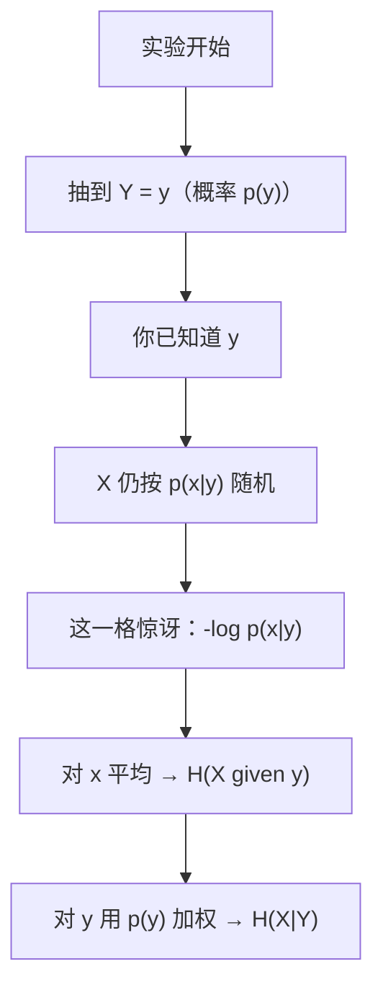
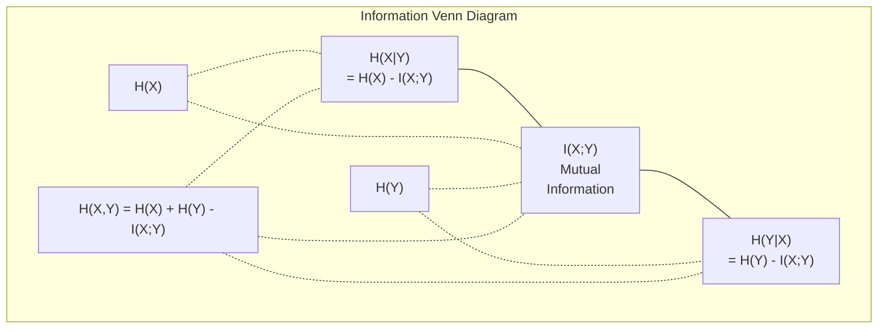

# Information Theory

> Information theory measures surprise. Loss functions are built on it.

**Type:** Learn
**Language:** Python
**Prerequisites:** Phase 1, Lesson 06 (Probability)
**Time:** ~60 minutes

**中文深入讲解：** 各概念小节下的「深入讲解（中文）」与 [`qa.md`](qa.md) 同步；算式用 **text 代码块**，条件概率写作 `p(x|y)`、`H(X|Y)`。

## Learning Objectives

- Compute entropy, cross-entropy, and KL divergence from scratch and explain their relationship
- Derive why minimizing cross-entropy loss is equivalent to maximizing log-likelihood
- Calculate mutual information between features and a target to rank feature importance
- Explain perplexity as the effective vocabulary size a language model chooses from

## The Problem

You call `CrossEntropyLoss()` in every classification model you train. You see "perplexity" in every language model paper. You read about KL divergence in VAEs, distillation, and RLHF. These are not disconnected concepts. They are all the same idea wearing different hats.

Information theory gives you the language to reason about uncertainty, compression, and prediction. Claude Shannon invented it in 1948 to solve communication problems. Turns out, training a neural network is a communication problem: the model is trying to transmit the correct label through a noisy channel of learned weights.

This lesson builds every formula from scratch so you see where they come from and why they work.

## The Concept

### Information Content (Surprise)

When something unlikely happens, it carries more information. A coin landing heads? Not surprising. A lottery win? Very surprising.

The information content of an event with probability p is:

```
I(x) = -log(p(x))
```

Using log base 2 gives you bits. Using natural log gives you nats. Same idea, different units.

```
Event              Probability    Surprise (bits)
Fair coin heads    0.5            1.0
Rolling a 6        0.167          2.58
1-in-1000 event    0.001          9.97
Certain event      1.0            0.0
```

Certain events carry zero information. You already knew they would happen.

### Entropy (Average Surprise)

Entropy is the expected surprise across all possible outcomes of a distribution.

```
H(P) = -sum( p(x) * log(p(x)) )  for all x
```

A fair coin has maximum entropy for a binary variable: 1 bit. A biased coin (99% heads) has low entropy: 0.08 bits. You already know what will happen, so each flip tells you almost nothing.

```
Fair coin:    H = -(0.5 * log2(0.5) + 0.5 * log2(0.5)) = 1.0 bit
Biased coin:  H = -(0.99 * log2(0.99) + 0.01 * log2(0.01)) = 0.08 bits
```

Entropy measures the irreducible uncertainty in a distribution. You cannot compress below it.

### Cross-Entropy (The Loss Function You Use Every Day)

Cross-entropy measures the average surprise when you use distribution Q to encode events that actually come from distribution P.

```
H(P, Q) = -sum( p(x) * log(q(x)) )  for all x
```

P is the true distribution (the labels). Q is your model's predictions. If Q matches P perfectly, cross-entropy equals entropy. Any mismatch makes it larger.

In classification, P is a one-hot vector (the true class has probability 1, everything else 0). This simplifies cross-entropy to:

```
H(P, Q) = -log(q(true_class))
```

That is the entire cross-entropy loss formula for classification. Maximize the predicted probability of the correct class.

### KL Divergence (Distance Between Distributions)

KL divergence measures how much extra surprise you get from using Q instead of P.

```
D_KL(P || Q) = sum( p(x) * log(p(x) / q(x)) )  for all x
             = H(P, Q) - H(P)
```

Cross-entropy is entropy plus KL divergence. Since entropy of the true distribution is constant during training, minimizing cross-entropy is the same as minimizing KL divergence. You are pushing your model's distribution toward the true distribution.

KL divergence is not symmetric: D_KL(P || Q) != D_KL(Q || P). It is not a true distance metric.


#### 深入讲解（中文）： KL 散度等式 `D_KL(P || Q) = sum_x p(x)log(p(x))/(q(x)) = H(P,Q) - H(P)` 是怎么推导出来的？

**问题（原文）：**


```text
D_KL(P || Q) = sum( p(x) * log(p(x) / q(x)) )  for all x
             = H(P,Q) - H(P)
```

**符号（与本课 `en.md` 一致）：**

- 熵：`H(P) = -sum_x p(x)log p(x)`
- 交叉熵：`H(P,Q) = -sum_x p(x)log q(x)`
- `P` 为真实分布，`Q` 为模型或近似分布；`log` 底数任选（比特 / 纳特），推导中底数一致即可。

---

##### 推导思路

目标是把 KL 的定义式写成「交叉熵减去熵」。核心只有两步：**对数商拆开**，再用 **熵 / 交叉熵的定义把两项认出来**。

##### 第一步：从 KL 的定义出发


```text
D_KL(P || Q) = sum_x p(x) log(p(x))/(q(x))
```

对 log 使用商法则 `log(a/b) = log(a) - log(b)`：

```text
D_KL(P || Q) = sum_x p(x) * (log p(x) - log q(x))
             = sum_x p(x)*log p(x) - sum_x p(x)*log q(x)
```

（第二项是对 `x` 求和，`p(x)` 与 `log q(x)` 相乘再相加。）

##### 第二步：用 `H(P)` 和 `H(P,Q)` 替换两项

由熵的定义：


```text
H(P) = -sum_x p(x)log p(x) => sum_x p(x)log p(x) = -H(P)
```

由交叉熵的定义：


```text
H(P,Q) = -sum_x p(x)log q(x) => sum_x p(x)log q(x) = -H(P,Q)
```

代入 KL 的分解式：


```text
D_KL(P || Q) = sum_x p(x)*log p(x) - sum_x p(x)*log q(x)
             = (-H(P)) - (-H(P,Q))
             = H(P,Q) - H(P)
```

即所要证的等式。

---

##### 直观含义（与本课一致）

- `H(P,Q)`：用 `Q` 去编码「来自 `P`」的事件时，平均需要多少惊讶（交叉熵）。
- `H(P)`：若用**正确**的 `P` 编码，平均惊讶就是熵本身。
- 二者之差 `H(P,Q) - H(P)`：因错用 `Q` 而**多付**的平均惊讶，即 KL 散度。

因此还有常用变形：


```text
H(P,Q) = H(P) + D_KL(P || Q)
```

训练时 `P`（标签分布）固定，`H(P)` 为常数，故 **最小化交叉熵等价于最小化 `D_KL(P || Q)`**。

---

##### 使用时的注意点

- 求和只对 `p(x) > 0` 的 `x` 有意义；若某处 `p(x)=0`，约定 `0log 0 = 0`，该项不贡献 KL。
- 若某处 `p(x)>0` 但 `q(x)=0`，则 `log(p(x))/(q(x))` 发散，KL 为 `+infty`（用 `Q` 无法可靠表示 `P` 的支撑集）。

---
### Mutual Information

Mutual information measures how much knowing one variable tells you about another.

```
I(X; Y) = H(X) - H(X|Y)
        = H(X) + H(Y) - H(X, Y)
```

If X and Y are independent, mutual information is zero. Knowing one tells you nothing about the other. If they are perfectly correlated, mutual information equals the entropy of either variable.

In feature selection, high mutual information between a feature and the target means the feature is useful. Low mutual information means it is noise.


#### 深入讲解（中文）： 互信息恒等式 `I(X;Y) = H(X) - H(X|Y) = H(X) + H(Y) - H(X,Y)` 是怎么推导出来的？

**问题（原文）：**


```text
I(X; Y) = H(X) - H(X|Y) = H(X) + H(Y) - H(X, Y)
```

**符号（与本课 `en.md` 一致）：**

- 联合熵：`H(X,Y) = -sum_{x,y} p(x,y)log p(x,y)`
- 边缘熵：`H(X) = -sum_x p(x)log p(x)`，`H(Y) = -sum_y p(y)log p(y)`
- 条件熵：`H(X|Y) = -sum_{x,y} p(x,y)log p(x|y)`，其中 `p(x|y) = p(x,y)/p(y)`（在 `p(y)>0` 处）
- **互信息的定义**（本课采用）：`I(X;Y) = H(X) - H(X|Y)`（「知道 `Y` 后，`X` 还剩多少不确定」比「不知道 `Y`」少多少）

第二行等式不是新定义，而是由**链式法则（chain rule）**从第一行推出。

---

##### 预备：联合熵的链式法则

对联合分布求熵，可以先把 `Y` 的不确定性算进去，再算「给定 `Y` 后 `X` 还剩多少」：


```text
H(X,Y) = H(Y) + H(X|Y)
```

**推导（把 `log p(x,y)` 拆成 `log p(y) + log p(x|y)`）：**


```text
H(X,Y) = -sum_{x,y} p(x,y)*log p(x,y)
       = -sum_{x,y} p(x,y)*(log p(y) + log p(x|y))
       = -sum_{x,y} p(x,y)*log p(y) - sum_{x,y} p(x,y)*log p(x|y)
```

第一项：`sum_x p(x,y) = p(y)`，故


```text
-sum_{x,y} p(x,y)*log p(y) = -sum_y p(y)*log p(y) = H(Y)
```

第二项正是 `H(X|Y)` 的定义。因此 `H(X,Y) = H(Y) + H(X|Y)`。

同理（先对 `X` 边缘化）：


```text
H(X,Y) = H(X) + H(Y|X)
```

本课在「Conditional Entropy」里写的 `H(Y|X) = H(X,Y) - H(X)` 就是上式移项。

---

##### 第一行：`I(X;Y) = H(X) - H(X|Y)`

这是**定义**：互信息 = `X` 的边缘熵 − 在观测 `Y` 之后 `X` 仍剩的条件熵。

- `H(X)`：不观测 `Y` 时，`X` 的平均不确定度。
- `H(X|Y)`：已知 `Y` 时，`X` 仍剩的不确定度。
- 二者之差：`Y` 能「解释掉」的 `X` 的不确定度，即共享信息。

（对称形式 `I(X;Y) = H(Y) - H(Y|X)` 完全平行，把链式法则里的 `X,Y` 对调即可。）

---

##### 第二行：`I(X;Y) = H(X) + H(Y) - H(X,Y)`

从定义出发，把 `H(X|Y)` 用链式法则换掉。

由 `H(X,Y) = H(Y) + H(X|Y)` 得：


```text
H(X|Y) = H(X,Y) - H(Y)
```

代入 `I(X;Y) = H(X) - H(X|Y)`：


```text
I(X;Y) = H(X) - (H(X,Y) - H(Y))
       = H(X) + H(Y) - H(X,Y)
```

即第二行等式。

---

##### 直观（维恩图 / 本课 mermaid 图）

- `H(X,Y)` 是 `(X,Y)` 合在一起的不确定度。
- 若 `X,Y` 独立，则 `H(X,Y) = H(X) + H(Y)`，上式给出 `I(X;Y)=0`。
- 若二者相关，联合熵会**小于** `H(X)+H(Y)`，少掉的那一块就是 `I(X;Y)`：


```text
H(X,Y) = H(X) + H(Y) - I(X;Y)
```

移项即 `I(X;Y) = H(X) + H(Y) - H(X,Y)`。

本课还给出等价定义（可用 `log` 法则从上面再推）：


```text
I(X;Y) = sum_{x,y} p(x,y)log(p(x,y))/(p(x) p(y))
```

即联合分布相对「独立假设」`p(x)p(y)` 的 KL 散度 `D_KL(p(x,y) || p(x)p(y))`。

---

##### 小结

（下列用列表而非表格，避免 Markdown 把 `|` 误当成列分隔符。）

- **`I(X;Y) = H(X) - H(X|Y)`** — 互信息的定义
- **`H(X,Y) = H(Y) + H(X|Y)`** — 熵的链式法则（`log p(x,y)=log p(y)+log p(x|y)`）
- **`I(X;Y) = H(X) + H(Y) - H(X,Y)`** — 定义 + 链式法则移项

---
### Conditional Entropy

H(Y|X) measures how much uncertainty remains about Y after you observe X.

```
H(Y|X) = H(X,Y) - H(X)
```

Two extremes:
- If X completely determines Y, then H(Y|X) = 0. Knowing X eliminates all uncertainty about Y. Example: X = temperature in Celsius, Y = temperature in Fahrenheit.
- If X tells you nothing about Y, then H(Y|X) = H(Y). Knowing X does not reduce your uncertainty at all. Example: X = coin flip, Y = tomorrow's weather.

Conditional entropy is always non-negative and never exceeds H(Y):

```
0 <= H(Y|X) <= H(Y)
```

In machine learning, conditional entropy appears in decision trees. At each split, the algorithm picks the feature X that minimizes H(Y|X) -- the feature that removes the most uncertainty about the label Y.


#### 深入讲解（中文）： `H(X|Y) = -sum_x sum_y p(x,y)log p(x|y)` 不好理解——「已知 `y` 再猜 `x`」到底在算什么？

**追问：** 双重求和、`p(x,y)` 和 `p(x|y)` 混在一起，和「惊讶」的关系不清楚。

核心：**条件熵不是「先算 `H(X)` 再减一点」的口诀，而是「`Y` 先随机出现，你在每个 `Y=y` 的世界里分别看 `X` 还剩多少不确定，再按 `p(y)` 加权平均」。**

---

##### 1. 更推荐的定义（先记这个）


```text
H(X|Y) = sum_y p(y) H(X|Y=y)
```

其中 **给定 `Y=y` 时 `X` 的熵**（条件分布 `p(x|y)` 的熵）：


```text
H(X|Y=y) = -sum_x p(x|y) log p(x|y)
```

**故事版：**

1. 大自然先抽 `Y`：以概率 `p(y)` 落到某个 `y`。
2. 你**已经看到**这个 `y`（不再对 `y` 惊讶——那是 `H(Y)` 的事）。
3. 此时 `X` 仍按 `p(x|y)` 随机；在这一层「世界里」，`X` 的平均惊讶就是 `H(X|Y=y)`。
4. `Y` 本身也随机，所以把各个 `y` 下的 `H(X|Y=y)` 用 `p(y)` **加权平均**，得到 `H(X|Y)`。

「已知 `y` 之后再猜 `x`」= 在 **`Y=y` 已发生** 的前提下，对 `X` 的熵；再对所有可能的 `y` 平均。

---

##### 2. 为什么这和 `-sum_x sum_y p(x,y)log p(x|y)` 是同一个式子？

固定 `y`，对内层 `sum_x`：


```text
-sum_x p(x,y) log p(x|y) = -sum_x p(y) p(x|y) log p(x|y) = p(y) \Bigl(-sum_x p(x|y)log p(x|y)\Bigr) = p(y) H(X|Y=y)
```

再对 `y` 求和：


```text
sum_y p(y) H(X|Y=y) = H(X|Y)
```

所以 **双重求和版** 只是把「先按 `y` 分组、组内算 `H(X|Y=y)`、再乘 `p(y)`」写在一行里。权重 `p(x,y)=p(y)p(x|y)` 的含义是：**`Y=y` 且 `X=x` 这一格在全体实验中的真实频率**。

---

##### 3. 和 `H(X)`、`H(X,Y)` 对比（各管哪段随机性）

- **`H(X)`**（只抽 `X`）：完全不知道 `Y` 时，猜 `X` 多难
- **`H(Y)`**：猜 `Y` 多难
- **`H(X,Y)`**：一对 `(X,Y)` 一起抽，同时报出 `x` 和 `y` 多难
- **`H(X|Y)`**：先知道 `Y`，再猜 `X` — `Y` 已经告诉你之后，**额外**猜 `X` 多难

恒等式（链式法则）：


```text
H(X,Y) = H(Y) + H(X|Y)
```

读作：描述整对 `(X,Y)` 的不确定度 = 先搞清 `Y` + 在已知 `Y` 的前提下再搞清 `X`。

也有 `H(X,Y)=H(X)+H(Y|X)`。并且 `H(X|Y) <= H(X)`（知道 `Y` 不会让你对 `X` **更糊涂**）。

---

##### 4. 三个极端例子（数字）

**例 A — `X` 完全由 `Y` 决定（`X=Y`）**

`Y in \{0,1\}` 各 0.5；`Y=0=> X=0`，`Y=1=> X=1`。

- 每个 `y` 下 `p(x|y)` 是 0 或 1 → `H(X|Y=y)=0`。
- `H(X|Y)=0`：一旦知道 `Y`，`X` **没有**剩余惊讶。
- 此时 `H(X)=1`，`H(Y)=1`，`H(X,Y)=1`（因为 `(X,Y)` 只有两种等概率结果）。

**例 B — `X` 与 `Y` 独立**

`p(x,y)=p(x)p(y)`，则 `p(x|y)=p(x)`。


```text
H(X|Y=y) = -sum_x p(x)log p(x) = H(X)
```

（与 `y` 无关。）
所以 `H(X|Y)=H(X)`：知道 `Y` **帮不上忙**，对 `X` 的惊讶一点没少。

**例 C — `Y` 只「稍微」缩小 `X` 的范围**

`Y` 是公平硬币；若 `Y=0`，`X` 在 `\{0,1\}` 上公平；若 `Y=1`，`X` 在 `\{1,2\}` 上公平（与讲义里「部分相关」同类）。

- `H(X | Y=0)=1`，`H(X | Y=1)=1`。
- `H(X|Y)=0.5* 1 + 0.5* 1 = 1` bit。
- 边缘 `H(X)` 可能仍是 1 或略不同，取决于 `p(x)` 的混合；要点是 **`H(X|Y)` 是「看见 `Y` 之后」的平均剩余不确定度**。

---

##### 5. 「惊讶」怎么落在公式里？

对 **固定的 `y`**，事件「`X=x`」在**条件世界**里的概率是 `p(x|y)`，惊讶是 `-log p(x|y)`。

在 `Y=y` 下对 `X` 求期望：


```text
E[-log p(X | y) | Y=y[r] = -sum_x p(x|y)log p(x|y) = H(X|Y=y)
```

`Y` 未固定时，还要对 `y` 求期望（权重 `p(y)`）：


```text
H(X|Y) = E_Y[ H(X | Y=Y) [r] = E[ -log p(X | Y) [r]
```

最后一行的联合写法就是 `-sum_{x,y} p(x,y)log p(x|y)`（因为 `E[f(X,Y)] = sum_{x,y} p(x,y)*f(x,y)`）。

**注意 `log` 里是 `p(x|y)` 不是 `p(x,y)`**：你已经站在「`Y=y`」的视角，惊讶应按 **条件概率** 衡量；`p(x,y)` 只作 **全概率权重**。

---

##### 6. 一张流程图（心智模型）



---

##### 7. 一句话总结

**`H(X|Y)`** = 「`Y` 先揭晓之后，`X` 还剩多少平均惊讶」= 各 `y` 下的条件熵 `H(X|Y=y)` 用 `p(y)` 做的加权平均；双重求和公式只是把 `p(y)` 和 `p(x|y)` 合成权重 `p(x,y)` 写在一起。

---
### Joint Entropy

H(X,Y) is the entropy of the joint distribution of X and Y together.

```
H(X,Y) = -sum sum p(x,y) * log(p(x,y))   for all x, y
```

Key property:

```
H(X,Y) <= H(X) + H(Y)
```

Equality holds when X and Y are independent. If they share information, the joint entropy is less than the sum of individual entropies. The "missing" entropy is exactly the mutual information.



The relationships:
- H(X,Y) = H(X) + H(Y|X) = H(Y) + H(X|Y)
- I(X;Y) = H(X) - H(X|Y) = H(Y) - H(Y|X)
- H(X,Y) = H(X) + H(Y) - I(X;Y)


#### 深入讲解（中文）： 链式法则 `H(X,Y) = H(Y) + H(X|Y)` 还是不明白——能逐步写清楚吗？

**追问：** 为什么说 `log p(x,y) = log p(y) + log p(x|y)` 之后，对 `x` 求和会得到 `H(Y)`，另一项就是 `H(X|Y)`？

下面**不跳步**：从定义出发，只用到概率恒等式 `p(x,y)=p(y) p(x|y)`（在 `p(y)>0` 时）和「对 `x` 求和得到边缘概率」。

---

##### 0. 三个量各自在算什么（先对齐符号）

- **`H(X,Y)`**：`-sum_x sum_y p(x,y)log p(x,y)` — 随机抽一对 `(x,y)`，平均要多少「惊讶」
- **`H(Y)`**：`-sum_y p(y)log p(y)` — 只抽 `y`，平均惊讶
- **`H(X|Y)`**：`-sum_x sum_y p(x,y)log p(x|y)` — 先知道 `y`，再猜 `x`，平均还要多少惊讶

注意：`H(X|Y)` 的写法是**对 `(x,y)` 双重求和**，但 `log` 里是 **`p(x|y)`**（给定 `y` 下 `x` 的条件概率），不是 `p(x,y)`。

条件熵还有等价形式（后面会用到）：


```text
H(X|Y) = sum_y p(y) * H(X|Y=y)
H(X|Y=y) = -sum_x p(x|y) * log p(x|y)
```


---


##### 1. 从 `H(X,Y)` 的定义出发


```text
H(X,Y) = -sum_x sum_y p(x,y) log p(x,y)
```

**概率分解（链式法则的概率版）：** 对任意 `p(y)>0`，


```text
p(x,y) = p(y) p(x|y)
```

两边取对数：


```text
log p(x,y) = log p(y) + log p(x|y)
```

代入：


```text
H(X,Y) = -sum_x sum_y p(x,y) * (log p(y) + log p(x|y))
```

把负号分配进括号，拆成**两项**（这是普通代数，没有新技巧）：

**第 A 项：**


```text
A = -sum_{x,y} p(x,y)log p(y)
```

**第 B 项：**


```text
B = -sum_{x,y} p(x,y)log p(x|y)
```


```text
H(X,Y) = A + B
```

（A → `H(Y)`；B → `H(X|Y)`。）

接下来证明：**第 A 项 `= H(Y)`**，**第 B 项 `= H(X|Y)`**。

**读图（A / B 两项）：**

- **第 A 项** 里只有 `log p(y)`（与 `x` 无关）→ 对 `x` 求和后变成 `p(y)` → 整块就是 **`H(Y)`**（`Y` 自己的熵）。
- **第 B 项** 里是 `log p(x|y)`（在「已知 `y`」的世界里猜 `x` 的惊讶）→ 对 `x` 加权平均再对 `y` 用 `p(y)` 平均 → 整块就是 **`H(X|Y)`**（条件熵）。
- 所以 **`H(X,Y) = H(Y) + H(X|Y)`**：联合不确定度 = 先弄清 `Y` + 弄清 `Y` 之后再弄清 `X`。

---

##### 2. 第 A 项为什么等于 `H(Y)`？

关键观察：在 `sum_x sum_y` 里，**`log p(y)` 不依赖 `x`**（同一个 `y`，不管 `x` 是多少，`log p(y)` 都一样）。

所以对固定的 `y`，可以先对 `x` 求和：


```text
-sum_x sum_y p(x,y) log p(y) = -sum_y log p(y) sum_x p(x,y)
```

（把 `log p(y)` 提出 `sum_x` 之外，合法，因为它与 `x` 无关。）

边缘化恒等式：


```text
sum_x p(x,y) = p(y)
```

因此：


```text
-sum_y log p(y) p(y) = -sum_y p(y)log p(y) = H(Y)
```

**一句话：** 第 A 项就是在算「`Y` 自己的熵」，因为对每个 `y`，所有 `(x,y)` 的概率质量加起来就是 `p(y)`。

若 `p(y)=0` 的 `y` 本来就不出现在求和中（`0log 0` 约定为 0），推导不受影响。

---

##### 3. 第 B 项为什么等于 `H(X|Y)`？

第 B 项是：


```text
-sum_x sum_y p(x,y) log p(x|y)
```

用 `p(x,y)=p(y) p(x|y)` 代入（也可以不代入，直接认定义）：


```text
-sum_x sum_y p(y) p(x|y) log p(x|y) = -sum_y p(y) sum_x p(x|y) log p(x|y)
```

（先固定 `y`，对内层 `sum_x` 求和。）

对内层，注意


```text
-sum_x p(x|y)log p(x|y) = H(X|Y=y)
```

即「已知 `Y=y` 时，`X` 的熵」。于是：


```text
sum_y p(y) H(X|Y=y) = H(X|Y)
```

这正是条件熵的定义（对 `y` 按 `p(y)` 加权平均各条件下的熵）。

**不代入 `p(y)` 的写法（更短）：** 按定义


```text
H(X|Y) = -sum_x sum_y p(x,y)log p(x|y)
```

与第 B 项**完全相同**。

---

##### 4. 合在一起


```text
H(X,Y) = H(Y) + H(X|Y)
```

同理交换 `X,Y` 可得 `H(X,Y) = H(X) + H(Y|X)`。

---

##### 5. 小例子（数字算一遍）

设 `Y in \{0,1\}`，`P(Y=0)=P(Y=1)=0.5`。且 **`X` 完全等于 `Y`**（`Y=0` 则 `X=0`，`Y=1` 则 `X=1`）。

联合分布只有两格非零：

- `(0,0)`：`p=0.5`
- `(1,1)`：`p=0.5`

**`H(X,Y)`：**


```text
H(X,Y) = -0.5log 0.5 - 0.5log 0.5 = 1
```

（上式在 `log` 以 2 为底时为 1 bit。）

**`H(Y)`：** 公平硬币，`H(Y)=1`。

**`H(X|Y)`：** 已知 `y` 后 `x` 没有随机性（`p(x|y)` 是 0 或 1），每个 `y` 下 `H(X|Y=y)=0`，故 `H(X|Y)=0`。

检查链式法则：`H(Y)+H(X|Y) = 1 + 0 = 1 = H(X,Y)`。

**对应第 A、B 项：** 对 `y=0`，`p(x,0)` 只在 `x=0` 为 0.5；`log p(y)=log 0.5` 提出后 `sum_x p(x,0)=0.5`。两个 `y` 各贡献一半，合起来是 `H(Y)=1`。第 B 项里 `p(x|y) in \{0,1\}`，`0log 0` 与 `1log 1=0`，所以 B 项为 0。

---

##### 6. 编码直觉（可选）

- `H(Y)`：先告诉对方 `Y`，平均要花多少比特。
- `H(X|Y)`：对方已经知道 `Y` 后，再描述 `X` 还要多少比特（可以用依赖 `y` 的编码）。
- 两者相加 = 描述整对 `(X,Y)` 的总比特 ≈ `H(X,Y)`（香农源编码定理的直觉版）。

---

#### 深入讲解（中文）： `H(Y)=-sum_y p(y)log p(y)` 和 `-sum_x sum_y p(x,y)log p(y)` 看起来不一样，为什么相等？

**追问：** 一个是只对 `y` 求和，另一个还对 `x` 多求了一层，怎么会是同一个量？

它们**确实相等**。差别只是：同一个式子用「先按 `y` 分组、再在每组里把 `x` 扫一遍」来写；多出来的 `sum_x` 是在做**边缘化**，不是多算了一遍不同的东西。

---

##### 代数证明（四步，可逐行核对）

记


```text
A = -sum_x sum_y p(x,y) log p(y)
```

**步骤 1 — 交换求和顺序**（有限项相加，顺序可换）：


```text
A = -sum_ysum_x p(x,y) log p(y)
```

**步骤 2 — 对固定的 `y`，`log p(y)` 与 `x` 无关**，可提到 `sum_x` 外面：


```text
A = -sum_y log p(y) sum_x p(x,y)
```

**步骤 3 — 边缘化**：


```text
sum_x p(x,y) = p(y)
```

（「所有满足 `Y=y` 的 `(x,y)`」的概率加起来，就是「`Y=y`」的概率。）

**步骤 4 — 代回**：


```text
A = -sum_y p(y) log p(y) = H(Y)
```

因此 `-sum_x sum_y p(x,y)log p(y) = H(Y)`。

---

##### 直觉：双重求和在「按 `y` 归类」

把 `-sum_x sum_y p(x,y)log p(y)` 想成：对每个 `y`，贡献是


```text
-log p(y) \times sum_x p(x,y) [= p(y)} = -p(y)log p(y)
```

再对所有 `y` 加起来，就是 `H(Y)`。

**并没有**对每个 `(x,y)` 各乘一个不同的 `log p(y)` 再乱加；对**同一个 `y`**，每一项里的 `log p(y)` **完全相同**，所以可以先加概率 `p(x,y)`，再加 `-log p(y)`。

---

##### 迷你表格（`X,Y` 各取 0,1）

- `x=0`：`p(x,0)=0.2`，`p(x,1)=0.1`
- `x=1`：`p(x,0)=0.3`，`p(x,1)=0.4`

边缘：`p(y=0)=0.2+0.3=0.5`，`p(y=1)=0.1+0.4=0.5`。

**双重求和** `-sum_x sum_y p(x,y)log p(y)` 展开为四项：


```text
-0.2log p(0) - 0.3log p(0) - 0.1log p(1) - 0.4log p(1) =& -0.5log p(0) - 0.5log p(1) =& -sum_y p(y)log p(y) = H(Y)
```

前两项：同一个 `y=0`，`log p(0)` 相同，`0.2+0.3=0.5=p(0)`。后两项同理。这就是步骤 2、3 在算的东西。

---

##### 容易误解的一点

- **误解：**「多一个 `sum_x` 就多算了一层随机性」 → **实际：** `log p(y)` 里根本没有 `x`，多求的 `sum_x` 只是在把 `p(x,y)` **合并成** `p(y)`。
- **误解：**「双重求和一定比单重求和大」 → **实际：** 每一项权重是 `p(x,y)`，对 `x` 加总后变成 `p(y)`，形式化为 `H(Y)`。

若写的是 `-sum_x sum_y p(x,y)log p(x,y)`（`log` 里是联合概率），就不能简单提出 `log`——那时才是真的「`x,y` 耦在一起」，得到的是 `H(X,Y)` 而不是 `H(Y)`。

---
### Mutual Information (Deep Dive)

Mutual information I(X;Y) quantifies how much knowing one variable reduces uncertainty about the other.

```
I(X;Y) = H(X) - H(X|Y)
       = H(Y) - H(Y|X)
       = H(X) + H(Y) - H(X,Y)
       = sum sum p(x,y) * log(p(x,y) / (p(x) * p(y)))
```

Properties:
- I(X;Y) >= 0 always. You never lose information by observing something.
- I(X;Y) = 0 if and only if X and Y are independent.
- I(X;Y) = I(Y;X). It is symmetric, unlike KL divergence.
- I(X;X) = H(X). A variable shares all its information with itself.

**Mutual information for feature selection.** In ML, you want features that are informative about the target. Mutual information gives you a principled way to rank features:

1. For each feature X_i, compute I(X_i; Y) where Y is the target variable.
2. Rank features by MI score.
3. Keep the top k features.

This works for any relationship between feature and target -- linear, nonlinear, monotonic, or not. Correlation only catches linear relationships. MI catches everything.

| Method | Detects | Computational cost | Handles categorical? |
|--------|---------|-------------------|---------------------|
| Pearson correlation | Linear relationships | O(n) | No |
| Spearman correlation | Monotonic relationships | O(n log n) | No |
| Mutual information | Any statistical dependency | O(n log n) with binning | Yes |


#### 深入讲解（中文）： Pearson / Spearman / 互信息对比表——「检测什么、复杂度、能否处理分类」怎么理解？

**问题（原文）：** 讲义里特征选择方法对比：

| 方法 | 检测 | 计算成本 | 能处理分类？ |
|------|------|----------|--------------|
| Pearson 相关 | 线性关系 | O(n) | 否 |
| Spearman 相关 | 单调关系 | O(n log n) | 否 |
| 互信息 MI | 任意统计依赖 | 分箱时约 O(n log n) | 是 |

（表格仅作对照；下文用列表展开，避免 Markdown 与 `|` 冲突。）

---

##### 三句话各是什么

- **Pearson（皮尔逊 r）**：两个**数值**变量是否「近似一条直线」一起变。
- **Spearman（斯皮尔曼 ρ）**：把两个变量各自**排秩**后再算 Pearson——是否「一个变大时另一个也单调变大/变小」（不要求是直线）。
- **互信息 I(X;Y)**：知道一个变量后，另一个的**不确定度减少了多少**——任意依赖（线性、曲线、阈值、分类标签等），**独立时 I=0**。

---

##### 1. Pearson 相关

**在检测什么**

```text
r = Cov(X, Y) / (std(X) * std(Y))
  = E[(X - mu_X)(Y - mu_Y)] / (sigma_X * sigma_Y)
```

只度量**线性**关联：若真实关系是 `Y ≈ a*X + b`（加噪声），|r| 接近 1；若是 `Y = X^2`、环形、阈值型，r 可以接近 0 即使 X、Y 强相关。

**计算成本 O(n)**

- 扫一遍数据：求 `mean(X)`, `mean(Y)`。
- 再扫一遍（或与上面合并）：求 `sum (X_i - mean_X)(Y_i - mean_Y)` 和方差。
- 算术运算次数与样本数 n 成正比 → **O(n)**。

**为何「不能处理分类」**

- 定义里需要**均值、协方差、标准差**；名义类别（红/绿/蓝、城市 ID）没有有意义的「加减」和「距离」。
- 若强行把类别编成 0,1,2… 再算 r，**编码方式会改变 r 的数值**，结论不可解释。
- 有序类别有时有人当数值算 r，那是近似，不是 Pearson 的规范用法。

---

##### 2. Spearman 相关

**在检测什么**

1. 把 `X` 换成秩 `rank(X_i)`（谁大谁小，并列可平均秩）。
2. 把 `Y` 换成秩 `rank(Y_i)`。
3. 对这两列秩算 **Pearson r** → 得到 Spearman ρ。

因此检测的是**单调**关系：X 增大时 Y 是否**总是一致地**增大或减小（允许弯曲，例如 `Y = X^3`：Pearson r 可能 < 1，Spearman ρ 可为 1）。

**仍抓不住的例子**：`Y = (X - 5)^2` 在单峰两侧对称时，X 增 Y 可能先减后增 → **非单调**，Spearman 也会偏低；但 X、Y 显然不独立，**互信息可以 > 0**。

**计算成本 O(n log n)**

- 主要开销：对 n 个值**排序**得到秩 → 比较排序下界 **O(n log n)**。
- 秩算好后，Pearson 部分仍是 O(n)。

**为何「不能处理分类」**

- **名义分类**没有自然全序，无法定义「秩」（除非人为指定顺序，那会扭曲含义）。
- **有序分类**（差/中/好）可以排秩，此时 Spearman 有时被用作「单调关联」，但表里写 No 是指：**不能像互信息那样统一处理任意离散变量与标签的依赖**，且名义变量仍不适用。

---

##### 3. 互信息 Mutual Information

**在检测什么**

```text
I(X;Y) = H(X) - H(X|Y) = H(Y) - H(Y|X)
       = H(X) + H(Y) - H(X,Y)
```

- **I(X;Y) = 0** 当且仅当 X、Y **统计独立**（联合分布 = 边缘乘积）。
- **I(X;Y) > 0** 表示存在任意形式的依赖：线性、非线性、非单调、交互等。

特征选择里：对每个特征 `X_i` 算 `I(X_i; Y)`，`Y` 为标签；**分数越高，该特征越能解释标签**（见本课 `en.md` Mutual Information 小节）。

**计算成本**

- **离散 X、Y（含分类）**：用样本估计联合频率表 `p(x,y)`，再算熵与 MI。建表 O(n)，熵求和 O(|X|·|Y|) 类别格点数。
- **连续变量**：实践中常 **分箱（binning）** 或 kNN 估计；分箱前常要对连续值**排序**划界 → 常见 **O(n log n)**（表里 “with binning” 指这类流程）。
- 精确连续 MI 需要密度估计，成本与维数、带宽等有关，表里是工程上常用的量级。

**为何「能处理分类」**

- MI 只要求能估计 **联合分布 / 频率** `p(x,y)`，不要求数值、不要求单调。
- **名义特征**：`X` = {红,绿,蓝}，`Y` = {0,1}` →  contingency table 直接算 I(X;Y)。
- **连续特征 + 分类标签**：连续 X 分箱或离散化后同样可算。
- 与 Pearson/Spearman 对比：MI 不问「是否直线或单调」，只问「是否独立」。

---

##### 4. 直观对比（同一数据不同故事）

| 关系类型 | Pearson | Spearman | MI |
|----------|---------|----------|-----|
| `Y = 2*X + noise` | 高 | 高 | > 0 |
| `Y = X^3`（X 单调增） | 中等 | 高（≈1） | > 0 |
| `Y = X^2`（X 对称绕 0） | 可能 ≈0 | 可能偏低 | > 0 |
| X、Y 独立噪声 | ≈0 | ≈0 | ≈0 |
| 类别 → 标签（非线性决策边界） | 不适用/误导 | 名义类不适用 | 适用 |

---

##### 5. 特征选择时怎么选

- **只要线性、全连续、要快**：Pearson，O(n)，实现简单。
- **连续、怀疑单调但非线性**（如等级、剂量）：Spearman。
- **混合类型、非线性、要覆盖「任意依赖」**：互信息（本课推荐用于 principled feature ranking）。
- **注意**：MI 估计受**分箱数 / 样本量**影响；箱太少会低估依赖，箱太多会过拟合噪声。生产里常用 sklearn `mutual_info_classif` / `mutual_info_regression` 等稳定实现。

---

##### 6. 与讲义、测验的对应

- 本课 `en.md`：「Correlation only catches linear relationships. MI catches everything.」
- `quiz.json`：MI 能捕捉非线性、非单调依赖；Pearson 只度量线性关联。

---

#### 深入讲解（中文）： 「名义分类没有自然全序，无法定义秩」是什么意思？

**追问：** Spearman 那段里为什么说名义类别不能排秩？人为指定顺序怎么会「扭曲含义」？

---

##### 1. 两类「分类」要先分开

| 类型 | 中文常叫 | 有没有「谁大谁小」？ | 例子 |
|------|----------|----------------------|------|
| **名义（nominal）** | 名义分类 | **没有**公认的先后/大小 | 颜色：红、绿、蓝；城市：北京、上海；血型：A、B、O |
| **有序（ordinal）** | 有序分类 | **有**顺序，但间隔不一定相等 | 尺码 S/M/L；满意度：差/中/好；学历：高中/本科/硕士 |

Spearman 的「秩」是在问：**按某个标准排队，谁排第 1、第 2、…**  
这对**有序**变量说得通；对**名义**变量，问题变成：**按什么标准排队？**

---

##### 2. 「自然全序」指什么

**全序（total order）**：任意两个不同取值，都能说清谁「更大/更前」或谁「更小/更后」，且全体一致、不矛盾。

- **有序变量**：小 < 中 < 大 → 自然全序，秩 = 按这个顺序编号 1,2,3…
- **名义变量**：红、绿、蓝 —— 没有自然界定的「红 < 绿 < 蓝」。你说「按字母序」可以排，但那是**人为规则**，不是变量本身的含义。

所以：**名义分类没有「自然」的全序** = 数据本身不携带「谁比谁大」的信息。

---

##### 3. Spearman 为什么需要「秩」

Spearman 步骤：

1. 把每个 `X_i` 换成它在样本里的**名次**（秩）。
2. 把每个 `Y_i` 也换成秩。
3. 对两列秩算 Pearson 相关 → 看「一名是否总跟着另一名」。

秩的前提是：**「名次 1、2、3…」有统一含义**——名次越高，代表「在某种顺序下越大」。

对名义 `X`（例如颜色），你必须先决定：红=1、绿=2、蓝=3，还是蓝=1、红=2…？**每一种编号都是一种人为全序**。换编号，秩就换，Spearman 的数值也会变。

---

##### 4. 「人为指定顺序会扭曲含义」指什么

**扭曲** = 你把**没有大小关系**的类别，硬当成**有大小关系**的数，后续统计就会假装「差 1 档」有意义。

**例子 A — 颜色（名义）**

- 编码：红=1，绿=2，蓝=3，再算 Spearman 或 Pearson。
- 隐含假设：绿「介于」红和蓝之间、红与绿的距离 = 绿与蓝的距离 —— **这些对颜色都不成立**。
- 若改成 红=3，绿=1，蓝=2，相关系数会变 → **结论依赖编码，不是依赖数据里的真实结构**。

**例子 B — 城市（名义）**

- 北京=1，上海=2，深圳=3 → 完全任意；按拼音、人口、GDP 排序会得到**不同的秩**，Spearman 也会不同。  
  城市之间没有「自然名次」，排秩只是在选一种**与问题无关**的规则。

**例子 C — 对比有序（不扭曲）**

- 满意度：差=1，中=2，好=3 —— 顺序是**定义的一部分**（问卷设计如此）。  
  秩反映「更满意 vs 更不满意」，Spearman 在这里有解释：**单调**变好/变坏。

---

##### 5. 和互信息的对比（为何 MI 可以处理名义类）

互信息不算「谁比谁大」，只问：**各类别与标签一起出现的频率** `p(x,y)` 是否偏离独立 `p(x)p(y)`。

- 颜色 × 是否购买：列联表（红/绿/蓝 × 0/1）直接估计，**不需要**给颜色编 1,2,3。
- 因此名义特征 + 分类标签，用 MI 更自然；用 Spearman 则必须先**人为全序**，结果难解释。

---

##### 6. 一句话

**名义分类** = 只有「属于哪一类」，没有「哪一类更大」。  
**秩** = 按「大小」排队；没有自然大小，就只能**人为规定顺序**，而规定方式会改变 Spearman/Pearson 的数值，**不能代表类别本身的真实关系**——这就是「无法定义秩 / 人为顺序会扭曲含义」的意思。

有序分类则自带顺序，排秩与含义一致，Spearman 才常用。

---
### Label Smoothing and Cross-Entropy

Standard classification uses hard targets: [0, 0, 1, 0]. The true class gets probability 1, everything else gets 0. Label smoothing replaces these with soft targets:

```
soft_target = (1 - epsilon) * hard_target + epsilon / num_classes
```

With epsilon = 0.1 and 4 classes:
- Hard target:  [0, 0, 1, 0]
- Soft target:  [0.025, 0.025, 0.925, 0.025]

From an information theory perspective, label smoothing increases the entropy of the target distribution. Hard one-hot targets have entropy 0 -- there is no uncertainty. Soft targets have positive entropy.

Why this helps:
- Prevents the model from driving logits to extreme values (infinite logits would be needed to perfectly match a one-hot target under cross-entropy)
- Acts as regularization: the model cannot be 100% confident
- Improves calibration: predicted probabilities better reflect true uncertainty
- Reduces the gap between training and inference behavior

The cross-entropy loss with label smoothing becomes:

```
L = (1 - epsilon) * CE(hard_target, prediction) + epsilon * H_uniform(prediction)
```

The second term penalizes predictions that are far from uniform -- a direct regularization on confidence.


#### 深入讲解（中文）： 标签平滑（label smoothing）——信息论视角与「为什么有帮助」？

**问题（原文）：** 硬 one-hot 熵为 0，软标签熵为正；为何能防止 logits 爆炸、起正则作用、改善校准、缩小训练与推理差距？

（公式与 [`en.md`](en.md) Label Smoothing 小节一致。）

---

##### 1. 硬标签 vs 软标签（公式）

**硬 one-hot**（K 类，真实类为 c）：

```text
t_hard[k] = 1  if k == c,  else 0
```

**标签平滑**（平滑系数 epsilon，常取 0.1）：

```text
t_soft[k] = (1 - epsilon) * t_hard[k] + epsilon / K
```

**例子**（K=4, epsilon=0.1, 真实类为第 3 类）：

```text
t_hard = [0,    0,    1,    0   ]
t_soft = [0.025, 0.025, 0.925, 0.025]
```

正确类仍最高（0.925），但非正确类不再是 0，而是分到 `epsilon/K` 的小概率质量。

---

##### 2. 信息论：为什么硬标签熵为 0、软标签熵 > 0

目标分布 `t` 的熵（训练时当作「真实分布」）：

```text
H(t) = -sum_k t[k] * log t[k]
```

**硬 one-hot：** 只有一个 `t[c]=1`，其余为 0；约定 `0*log 0 = 0`，故

```text
H(t_hard) = -1 * log(1) = 0
```

含义：**标签声称「真实类别没有任何不确定」**——信息论里零惊讶、零冗余编码长度（若你相信标签绝对正确）。

**软标签：** 多个类别 `t[k] > 0`，

```text
H(t_soft) > 0
```

含义：目标分布本身承认**标签噪声 / 类间相似 / 标注不完美**——「真实类最可能，但别的类仍有一点点质量」。  
epsilon 越大，越接近均匀分布，熵越高。

---

##### 3. 与交叉熵损失的关系（讲义中的分解）

模型预测 `q`（softmax 输出），训练最小化 `H(t, q) = -sum_k t[k] log q[k]`。

代入软标签后，讲义给出等价形式：

```text
L = (1 - epsilon) * CE(t_hard, q) + epsilon * H_uniform(q)
```

其中第二项与「预测接近均匀分布」相关——**惩罚过度自信**（预测太尖、太像 one-hot）。

直觉：

- 第一项：仍主要拉动正确类的概率。
- 第二项：拉住整体分布不要塌成「几乎全压在一个类上」，除非数据真的支持。

---

##### 4. 好处一：防止 logits 推到极端（为什么要「无限 logit」）

Softmax：`q[k] = exp(z[k]) / sum_j exp(z[j])`。

硬目标要求 `q[c] -> 1`，其余 `q[k] -> 0`。  
要让某个 `q[k]` 任意接近 0，需要对应 logit `z[k]` 比其它 logit **小很多**；要让 `q[c]` 任意接近 1，需要 `z[c]` **大很多**。

在数学上：**完美拟合 one-hot（概率恰为 1 和 0）需要 logits 趋于 ±infty**。  
有限 logit 只能得到「非常接近但永远不到 1」的概率。

硬标签 + 交叉熵会**持续奖励**继续增大正确类 logit、压低其它类——训练容易把 logits 推得很大，带来：

- 数值不稳定（exp 溢出风险虽常被框架处理，梯度仍可能很陡）
- 过拟合训练集标注（对标注噪声极敏感）

软标签在正确类上只要求 `q[c] ≈ 1 - epsilon + epsilon/K`（例如 0.925），**上限有界** → 最优 logit 规模有限，不必「无限自信」。

---

##### 5. 好处二：正则化——模型不能 100% 自信

正则化 = 限制模型复杂度或限制过拟合。

软标签强制：**即使训练样本标为类 c，最优预测也不应是概率 1**。  
正确类以外至少保留 `epsilon/K` 的质量 → 决策边界不必把每个训练点「焊死」在极端置信上。

效果上类似：

- 减轻对错误标注、边界样本的死记硬背；
- 权重不会为迎合单一 one-hot 而变得过于尖锐（与 weight decay、dropout 等互补）。

信息论说法：**训练目标分布的熵 H(t) > 0**，与「真实世界常有模糊性」一致，模型不被要求编码零惊讶的标签。

---

##### 6. 好处三：校准（calibration）更好

**校准**：若模型说「90% 是猫」，在长期里大约 90% 的确是猫（可靠性），而不只是「分对了类」。

硬标签训练常导致 **过自信（overconfidence）**：验证准确率 95%，但预测概率常挤在 0.99+，**概率数值不能当真实不确定性**。

软标签把目标从「1」改成「0.9x」，鼓励预测分布**留一点宽度** → 测试时 softmax 概率更接近「可解释的信心」，对：

- 拒绝学习 / 人工复核（低置信样本）
- 集成、风险敏感应用

更有用。  
（注意：标签平滑不是唯一的校准手段；温度缩放等可在推理时再调，但平滑从训练阶段就抑制过尖分布。）

---

##### 7. 好处四：缩小训练与推理行为的差距

**训练（常见设定）：** 输入带标签，损失用固定 one-hot（或平滑后的软目标），优化「对这个标签像不像」。

**推理：** 没有标签，只有输入；模型要在**开放世界**里输出分布——数据可能有歧义、分布偏移、训练集未见的类。

若训练逼模型「每个样本都必须几乎 100% 确定」，推理时模型仍习惯输出极尖分布，与「现实中不确定」脱节。

软标签在训练中注入**与推理更一致的不确定性先验**：

- 训练目标不再是「绝对真理」分布；
- 模型学到「主类高概率 + 非零其它类」更自然的输出形态。

也可理解为：硬标签假设标注过程零熵；软标签假设标注过程有熵——**更接近真实标注管线**（噪声、类间相似、多标签倾向等）。

---

##### 8. 小结对照

| 角度 | 硬 one-hot | 标签平滑（软目标） |
|------|------------|-------------------|
| 目标熵 H(t) | 0 | > 0 |
| 交叉熵最优 q | 趋向尖峰（需大 logit） | 尖峰有上限 |
| 过拟合 / 过自信 | 风险较高 | 通常缓解 |
| 名义类别关系 | 仍用 K 类分布 | 非正确类共享 epsilon/K |

**何时用：** 大模型图像分类（如 ImageNet 训练 ResNet/ViT）、Transformer 分类头等常见 `epsilon=0.1`；epsilon 过大则欠拟合、准确率可能下降，需调参。

---

#### 深入讲解（中文）： 标签平滑损失里的 `epsilon * H_uniform(q)` 是什么？

**追问：** 讲义里 `L = (1-ε)*CE(硬标签,q) + ε*H_uniform(q)`，第二项具体指什么？

---

##### 1. 符号

- `q`：模型 softmax 预测，K 类，`q[k] >= 0`，`sum_k q[k] = 1`。
- `u`：**均匀分布**（uniform），`u[k] = 1/K`（每个类相同概率）。
- `ε`（epsilon）：平滑强度，如 0.1。

讲义里的 **`H_uniform(q)`** 指：用**均匀分布 u 当「目标」**，看预测 `q` 的**交叉熵**（不是 q 自己的熵 H(q)）：

```text
H_uniform(q)  :=  H(u, q)  =  CE(u, q)  =  -sum_{k=1..K} u[k] * log q[k]
                            =  -(1/K) * sum_k log q[k]
```

含义：**若真实分布是「我完全不知道是哪一类」（均匀），用 q 去编码平均要多少惊讶**。  
`q` 越尖（几乎全在一个类上），非主导类的 `q[k]` 很小，`log q[k]` 很负，`-log q[k]` 很大 → **H(u,q) 越大**。  
`q` 越接近均匀（每个类约 1/K），**H(u,q) 越小**（下界为 `H(u) = log K`）。

注意：最小化 `H(u,q)` 会**把 q 往均匀拉**；但不会单独用这一项训练，而是乘 `ε` 与硬标签项一起用。

---

##### 2. 从软标签交叉熵怎么推出 `ε * H_uniform(q)`

软标签（真实类为 c）：

```text
t_soft[k] = (1 - ε) * t_hard[k] + ε/K
```

对 `t_soft` 与 `q` 的交叉熵：

```text
CE(t_soft, q) = -sum_k t_soft[k] * log q[k]
              = -(1-ε) log q[c] - sum_k (ε/K) * log q[k]
              = (1-ε) * (-log q[c]) + ε * [ -(1/K) sum_k log q[k] ]
              = (1-ε) * CE(t_hard, q) + ε * H_uniform(q)
```

所以 **`ε * H_uniform(q)` 不是额外拍脑袋的项**，而是软标签里那 `ε/K` 铺在**所有类**上带来的：  
「每个非硬标签部分都在用均匀权重 `(1/K)` 拉你对各类的 `log q[k]` 负责」。

---

##### 3. 训练时在干什么（直觉）

| 项 | 作用 |
|----|------|
| `(1-ε) * CE(硬标签, q)` | 主要把概率放在正确类 c |
| `ε * H_uniform(q)` | 要求每个类 `q[k]` 不要太小 → **别把分布压得过尖** |

第二项等价于：**鼓励 q 不要离均匀分布 u 太远**（在交叉熵意义下）。  
ε 越大，越强调「各维概率别太极端」→ 正则、防过自信。

与 KL 的关系（可选）：

```text
H(u, q) = H(u) + D_KL(u || q) = log(K) + D_KL(u || q)
```

最小化 `H(u,q)` ⟺ 最小化 `D_KL(u || q)`（因 `H(u)` 常数）。即：**把预测 q 往均匀 u 推**。

---

##### 4. 和「H(q) 熵」别混

- **`H(q)`**：预测分布自己的熵，`-sum q[k] log q[k]`。q 越均匀，H(q) 越大。
- **`H_uniform(q) = H(u,q)`**：固定目标为 u 时的交叉熵。  
  两者相关，但讲义记号 **`H_uniform(q)` 专指 H(u,q)**。

---

##### 5. 一句话

**`ε * H_uniform(q)`** = 软标签中「ε 质量按均匀分布摊到 K 类」那一部分的交叉熵；  
= **ε 倍「用均匀分布当目标」的交叉熵**，惩罚预测过于尖锐，起置信度正则作用。

---

#### 深入讲解（中文）： 如何从 `CE(t_soft,q)` 推出 `(1-ε)(-log q[c]) + ε·H_uniform(q)` 与 `(1-ε)CE(硬,q)+ε·H_uniform(q)`？

##### 约定

- K 类，真实类 **c**；`t_hard[c]=1`，其余为 0。
- 软标签：`t_soft[k] = (1-ε)*t_hard[k] + ε/K`。
- `CE(P,q) = -sum_k P[k] log q[k]`。
- `CE(硬,q) = -log q[c]`。
- 均匀 `u[k]=1/K`，`H_uniform(q) = CE(u,q) = -(1/K) sum_k log q[k]`。

##### 推导 A（拆 k=c 与 k≠c）

```text
CE(t_soft,q) = -t_soft[c] log q[c] - sum_{k≠c} t_soft[k] log q[k]
```

其中 `t_soft[c]=(1-ε)+ε/K`，`t_soft[k]=ε/K`（k≠c）：

```text
= -[(1-ε)+ε/K] log q[c] - sum_{k≠c} (ε/K) log q[k]
= -(1-ε) log q[c] - (ε/K) log q[c] - sum_{k≠c} (ε/K) log q[k]
```

后两项合并为对**全部 k** 求和：

```text
-(ε/K) log q[c] - sum_{k≠c} (ε/K) log q[k] = -(ε/K) sum_k log q[k]
```

故

```text
CE(t_soft,q) = (1-ε)(-log q[c]) + ε·[-(1/K) sum_k log q[k]]
```

##### 推导 B（认出 CE 与 H_uniform）

`-log q[c] = CE(硬,q)`，`-(1/K)sum_k log q[k] = H_uniform(q)`，代入：

```text
CE(t_soft,q) = (1-ε)·CE(硬,q) + ε·H_uniform(q)
```

##### 推导 C（一行代入，与 A/B 等价）

```text
CE(t_soft,q) = -sum_k [(1-ε)t_hard[k] + ε/K] log q[k]
             = (1-ε)[-sum_k t_hard[k] log q[k]] + [-sum_k (ε/K) log q[k]]
             = (1-ε) CE(硬,q) + ε H_uniform(q)
```

---
### Why Cross-Entropy Is THE Classification Loss

Three perspectives, same conclusion.

**Information theory view.** Cross-entropy measures how many bits you waste by using your model's distribution instead of the true distribution. Minimizing it makes your model the most efficient encoder of reality.

**Maximum likelihood view.** For N training samples with true classes y_i:

```
Likelihood     = product( q(y_i) )
Log-likelihood = sum( log(q(y_i)) )
Negative log-likelihood = -sum( log(q(y_i)) )
```

That last line is cross-entropy loss. Minimizing cross-entropy = maximizing the likelihood of the training data under your model.

**Gradient view.** The gradient of cross-entropy with respect to the logits is simply (predicted - true). Clean, stable, and fast to compute. This is why it pairs perfectly with softmax.


#### 深入讲解（中文）： 交叉熵不是 `-sum p(x) log q(x)` 吗？为何讲义里 NLL = `-sum log q(y_i)` 也叫交叉熵？

**追问：** 似然写法里没有 `p`，只有 `q(y_i)`，和 `H(P,Q) = -sum_k p(k) log q(k)` 怎么对上？

---

##### 1. 两个不同的「x」别混

| 记号 | 指什么 |
|------|--------|
| 输入 **x**（图像、句子） | 一条样本的特征；用来算 `q = model(x)` |
| 类别下标 **k**（或标签 **y**） | 离散类 1..K；**交叉熵公式里求和的是 k** |

讲义里的 **交叉熵**（本课定义）：

```text
H(P, Q) = CE(P, Q) = -sum_k P(k) * log Q(k)
```

这里的 **P(k)、Q(k)** 是「**类别**上的分布」，不是输入 x 上的密度。  
你写的 `p(x)` 若指输入空间里的概率密度，那是另一类问题；**分类损失里的 p 是标签分布 P(类别=k)**。

---

##### 2. 一条样本：硬标签 → 只剩 `-log q(y_i)`

第 i 条样本，真实类为 **y_i**（one-hot 硬标签）：

```text
P_i(k) = 1   若 k = y_i
P_i(k) = 0   否则
```

模型预测（softmax）：

```text
Q_i(k) = q(k | x_i)   简写 q_i(k)
```

代入交叉熵：

```text
CE(P_i, Q_i) = -sum_k P_i(k) * log Q_i(k)
             = -1 * log Q_i(y_i) + sum_{k≠y_i} 0
             = -log q_i(y_i)
```

**P 只在正确类为 1** → 求和里只有一项，**不需要显式写出 p**，因为其它类的 P(k)=0 不贡献。

讲义里的 **`q(y_i)`** = **`Q_i(y_i)`** = 模型给**真实类**的概率。

---

##### 3. 整个训练集：对样本求和

N 条样本，独立同分布假设下似然：

```text
Likelihood = product_{i=1..N} Q_i(y_i) = product_{i=1..N} q(y_i)
```

取 log：

```text
Log-likelihood = sum_{i=1..N} log q(y_i)
```

取负号（最小化损失 = 最大化似然）：

```text
NLL = -sum_{i=1..N} log q(y_i)
```

而总交叉熵（每条样本一个 P_i、Q_i）：

```text
总 CE = sum_{i=1..N} CE(P_i, Q_i) = sum_{i=1..N} [-log q_i(y_i)]
      = -sum_{i=1..N} log q(y_i)  = NLL
```

所以：**最小化交叉熵 = 最小化 NLL = 最大化训练集似然**（在 one-hot 监督下）。

---

##### 4. 和「带 p 的公式」对照

| 一般式 | 分类（硬标签） |
|--------|----------------|
| `-sum_k P(k) log Q(k)` | P 为 one-hot → `-log Q(y_i)` |
| P 可以是软标签 `t_soft` | `-sum_k t_soft[k] log q[k]`（标签平滑） |
| 对「事件 x」求和 | 这里对「类别 k」求和；**样本下标 i** 在数据集层面再求和 |

若写成「联合」形式：可对 (i,k) 求和：

```text
-sum_{i,k} P_i(k) log Q_i(k)
```

硬标签时 `P_i(k)` 只在 `k=y_i` 为 1 → 退化为 `-sum_i log Q_i(y_i)`。

---

##### 5. 一句话

**交叉熵仍是 `-sum_k P(k) log Q(k)`**；分类里 **P 是标签在各类上的分布**（硬标签则 P(y_i)=1），所以**对 k 求和后只剩 `-log q(y_i)`**，再对训练样本 **i 求和** 就是讲义里的 NLL，与似然等价。

---

#### 深入讲解（中文）： 「对样本 i 相加」——训练时 i 不是只有一个吗？

**追问：** 硬标签下对 k 求和只剩 `-log q(y_i)`，那 i 是不是永远只有一个？

**答：** 要分清 **两个下标**：

| 下标 | 含义 | 典型有多少个 |
|------|------|----------------|
| **k** | 类别（猫/狗/…，共 K 类） | 对 **每一条** 样本，CE 里对 k 求和 → one-hot 后只剩 **1 项** |
| **i** | **第几条训练样本**（第几张图、第几个 (x,标签)） | 全数据 **N** 条；或一个 mini-batch 里 **B** 条 |

---

##### 1. 只看「一条」样本（你说的「只有一个」）

输入 `x_i`，真实类 `y_i`，模型输出 `q(k|x_i)`。

```text
CE(这一条) = -sum_k P(k) log q(k|x_i) = -log q(y_i | x_i)
```

这里确实 **只有一个 i**（当前这条），对 k 求和后 **只有一个数**：负 log 正确类概率。  
**没有**再对 i 求和，因为此时只有一条数据。

---

##### 2. 整个训练集（讲义里 Likelihood 的乘积/求和）

训练有 **N 条** 独立样本 `(x_1,y_1), …, (x_N,y_N)`，每条有自己的 `q(y_i)`（模型在 `x_i` 上的预测）。

```text
Likelihood = q(y_1) * q(y_2) * … * q(y_N)   （N 个因子）
NLL        = -log q(y_1) - log q(y_2) - … - log q(y_N)
           = -sum_{i=1}^{N} log q(y_i)
```

这里的 **i 从 1 到 N**，不是 1。讲义第三行是对 **所有训练点** 求和。

---

##### 3. 实际训练（mini-batch）

一个 step 往往只算 **B 条**（batch size），例如 B=32：

```text
loss_batch = (1/B) * sum_{i=1}^{B} [-log q(y_i)]
```

- 对 **每个 i**：先对 k 求和 → 得到 `-log q(y_i)`（一条一个标量）
- 再对 batch 里 **B 个 i** 求平均或求和

所以：**每条样本** 贡献一项；**很多条样本** 就有很多项相加。

---

##### 4. 两层结构（记这个）

```text
总损失 ≈ sum_{i ∈ 数据或batch}  [  -sum_{k=1}^{K} P_i(k) log q_i(k)  ]
                ↑ 很多个 i              ↑ 对固定 i，硬标签只剩 k=y_i 一项
```

- **内层**（对 k）：one-hot → `-log q(y_i)`
- **外层**（对 i）：把所有训练样本（或 batch）的损失加起来

你卡在「i 只有一个」时，通常是在想 **内层、单条样本**；讲义里的 **`-sum log q(y_i)`** 指的是 **外层对 N（或 B）条样本的 i 求和**。

---

##### 5. 一句话

**一条样本**：只有一个 i，损失是 `-log q(y_i)`。  
**整个训练**：有 N 个 i，损失是 `-sum_i log q(y_i)`。  
两个都对，层次不同。

---

#### 深入讲解（中文）： 极大似然三行式 `Likelihood = product q(y_i)` … 不明白？

**讲义原文：**

```text
Likelihood     = product( q(y_i) )
Log-likelihood = sum( log(q(y_i)) )
NLL            = -sum( log(q(y_i)) )   # 负对数似然 = 交叉熵（硬标签）
```

下面从零解释「每一符号在说什么、为什么要乘、为什么要 log、为什么要取负」。

---

##### 1. `q(y_i)` 是什么？

- 第 i 条训练样本：输入 `x_i`（一张图、一句话），**真实类别**是 `y_i`（例如「猫」）。
- 模型（带参数 θ）看完 `x_i` 后，对 K 个类给出概率，softmax 输出 `q(k | x_i)`。
- **`q(y_i)`** = 模型给**正确类**分配的概率：

```text
q(y_i)  :=  q( y_i | x_i, θ )
```

例子：三分类，真实是「狗」(y_i=狗)，模型输出 `[0.1, 0.7, 0.2]` → `q(y_i)=0.7`。  
**越大越好**：说明模型越「认为这就是狗」。

---

##### 2. Likelihood（似然）= 连乘 `product q(y_i)` 在说什么？

有 **N 条** 独立训练样本（讲义假设每条标签独立同分布）。

**问题（极大似然）：** 选参数 θ，使得「在模型眼里，这 N 个真实标签**同时出现**」的概率**尽量大**。

一条样本标签对的概率 ≈ `q(y_i)`。  
N 条都对的概率（独立时相乘）：

```text
Likelihood L(θ) = q(y_1) * q(y_2) * … * q(y_N)
                = product_{i=1..N} q(y_i)
```

**直觉：** 像 N 次「猜标签」都猜对，每次概率乘起来。  
每一项在 0~1 之间；**乘得越多项，L 越容易很小**（很多小于 1 的数相乘）。

**训练目标（MLE）：** 最大化 `L(θ)` = 让模型对每条数据的**真实类**都给高概率。

---

##### 3. 为什么要 Log-likelihood = `sum log(q(y_i))`？

乘积不好算、不好求导、数值容易下溢（很多小数连乘 → 0）。

对似然取 **自然对数**（log 单调增，**最大化 L ⟺ 最大化 log L**）：

```text
log L = log q(y_1) + log q(y_2) + … + log q(y_N)
      = sum_{i=1..N} log q(y_i)
```

- **乘** 变成 **加**，优化稳定得多。
- `q(y_i)` 接近 1 → `log q(y_i)` 接近 0（好）；  
  `q(y_i)` 接近 0 → `log q(y_i)` 是很大的负数（差）。

---

##### 4. 为什么要 Negative log-likelihood（NLL）= `-sum log(q(y_i))`？

深度学习里习惯 **最小化 loss**，不习惯最大化 score。

定义：

```text
NLL = -log L = -sum_{i=1..N} log q(y_i)
```

- **最小化 NLL** = **最大化 log-likelihood** = **最大化 Likelihood**（同一回事）。
- 每条样本贡献 `-log q(y_i)`，和硬标签 **交叉熵** 一项相同；全数据加起来 = **交叉熵损失**。

---

##### 5. 迷你数字例子（N=3）

| i | 真实类 | q(y_i) | log q(y_i) | -log q(y_i) |
|---|--------|--------|------------|-------------|
| 1 | A | 0.9 | -0.11 | 0.11 |
| 2 | B | 0.5 | -0.69 | 0.69 |
| 3 | C | 0.1 | -2.30 | 2.30 |

```text
L     = 0.9 * 0.5 * 0.1 = 0.045
log L = -0.11 - 0.69 - 2.30 = -3.10
NLL   = 0.11 + 0.69 + 2.30 = 3.10
```

模型若把第 3 条的正确类概率从 0.1 提到 0.8，NLL 会明显下降 → 似然变大。

---

##### 6. 和「一条样本」的关系

- **一条样本**：`NLL_i = -log q(y_i)`（没有乘积，就一个数）。
- **一个 batch 或全数据**：把很多条的 `-log q(y_i)` **加起来**（或取平均）。

讲义三行里的 `product` / `sum` 是针对 **N 条样本的下标 i**，不是类别 k。

---

##### 7. 流程图（心智模型）


---

##### 8. 一句话

**`q(y_i)`** = 模型对第 i 条样本**猜对真实类**的概率；  
**连乘** = 假设样本独立，N 条标签同时出现的概率；  
**取 log** = 乘变加、好优化；  
**取负** = 变成要**最小化**的损失，就是分类里的 **交叉熵（硬标签）**。

---

#### 深入讲解（中文）： 「交叉熵对 logits 的梯度 = predicted − true」怎么理解？为何和 softmax 配？

**讲义原文（Gradient view）：** 对 logits 的梯度就是 `(预测 − 真实)`，简洁、稳定、快，所以与 softmax 成对使用。

---

##### 1. 符号（一条样本，K 类）

- **logits** `z[k]`：网络最后一层线性输出，**还没** softmax。
- **预测** `q[k] = softmax(z)[k]`：

```text
q[k] = exp(z[k]) / sum_j exp(z[j])
```

- **真实（硬标签）** `t[k]`：one-hot，`t[c]=1`，其余 0，真实类为 c。
- **损失**（单样本）：

```text
L = CE(t, q) = -sum_k t[k] * log q[k] = -log q[c]
```

讲义说的 **predicted − true** 是向量，第 k 维：

```text
dL / d z[k]  =  q[k] - t[k]
```

---

##### 2. 推导思路（为何是 q − t）

**步骤 A — 只对正确类 c 有 log：**

```text
L = -log q[c]
```

**步骤 B — softmax 的经典导数**（可单独记）：

```text
d q[i] / d z[k] = q[i] * (δ_{ik} - q[k])
```

（`δ_{ik}`：i=k 时为 1，否则 0。）

**步骤 C — 链式法则：**

```text
dL/dz[k] = - (1/q[c]) * d q[c] / dz[k]
         = - (1/q[c]) * q[c] * (δ_{c,k} - q[k])
         = -(δ_{c,k} - q[k])
         = q[k] - δ_{c,k}
         = q[k] - t[k]
```

因为 `t` 是 one-hot：`t[k]=1` 当 k=c，否则 0，所以 **`δ_{c,k} = t[k]`**。

**软标签** `t_soft`（含标签平滑）时，同样推导得：

```text
dL/dz[k] = q[k] - t_soft[k]
```

形式不变，只是 `t` 不再是纯 one-hot。

---

##### 3. 直觉：每个 logit 往哪推？

对第 k 类看 `dL/dz[k] = q[k] - t[k]`：

| 情况 | 梯度 | 含义 |
|------|------|------|
| k = 正确类 c，`q[c]` 偏小 | `q[c]-1` **负** | 增大 `z[c]` 能降损失 |
| k ≠ c，`q[k]` 偏大 | `q[k]-0` **正** | 减小 `z[k]` 能降损失 |
| 已很准：`q[c]≈1`，其它 `q[k]≈0` | 各维 **≈0** | 几乎不用再改 |

**预测概率往真实标签靠拢**：正确类 logit 被拉高，非正确类被压低；幅度由「差多少」`q-t` 自动决定。

---

##### 4. 为何说 clean、stable、fast？

**Clean（形式干净）**

- 不需要对 softmax 里 `sum exp` 再手写复杂梯度；**CE + softmax 合起来** 才得到简单的 `q - t`。
- 若只对 `q` 写 CE 的梯度、再单独传 softmax，式子更丑；框架把两步 **fuse** 成一步。

**Stable（稳定）**

- 梯度是 **概率差**，有界在约 `[-1,1]` 量级（`q,t` 在 [0,1]），不会像某些损失那样在错误很大时梯度爆炸。
- 数值实现常用 **log-softmax + NLL** 合并，避免先算很小的 `q[c]` 再 `log`（下溢）；数学上等价，梯度仍是 `q-t`。

**Fast（快）**

- 前向已有 `q`；反向 **减一下标签** 即得 logits 梯度，与 K 成线性关系，GPU 友好。
- 这是分类头默认配置的原因之一。

---

##### 5. 为何「必须和 softmax 配」？

- **CE 的输入语义**是「概率分布」`q[k]`，且要在 **K 个类上归一化**（和为 1）。
- **Softmax** 把任意实数 logits 变成合法概率，且 **处处可导**，适合梯度下降。
- 这一对组合有 **解析梯度 `q-t`**；换别的激活 + CE 不一定这么简（或根本不是概率）。

其它视角（本课前面）：CE 最小化 ⟺ 极大似然；梯度 `q-t` 就是在做「把预测分布推向标签分布」的局部更新。

---

##### 6. 和 PyTorch 的对应

```text
CrossEntropyLoss(logits, target)  # 内部：log_softmax + NLL，不要自己对 logits 先 softmax
```

`target` 为类别下标 c 时，等价于 `t` one-hot；反向对 `z` 的梯度即 **`q - one_hot(c)`**。

---

##### 7. 一句话

**Softmax 给出 `q`，交叉熵衡量 `q` 与 `t` 的差距；链式法则把复杂导数化成 `dL/dz = q - t`：** 正确类往上推、错类往下推，差多大推多猛——所以讲义说它与 softmax「完美配对」。

---

#### 深入讲解（中文）： 梯度式 `dL/dz[k] = -(1/q[c])·dq[c]/dz[k] = -(δ_{c,k}-q[k]) = q[k]-t[k]` 每一步怎么来的？

**设定：** 真实类 **c**；`L = -log q[c]`；`q = softmax(z)`；`t` 为 one-hot，`t[c]=1`。

---

##### 第 1 行 → 第 2 行：链式法则 + softmax 导数

**（1）对 log 求导**

`L = -log q[c]`，只有 `q[c]` 出现在 log 里，所以：

```text
dL/dz[k] = dL/dq[c] * dq[c]/dz[k]
         = (-1/q[c]) * dq[c]/dz[k]
```

这就是第一行。含义：logit `z[k]` 怎么动，先看成通过 **正确类概率 `q[c]`** 影响损失。

**（2）softmax 对单个输出的导数**（必须记的一条）

```text
q[i] = exp(z[i]) / S,    S = sum_j exp(z[j])
```

对任意下标 k：

```text
dq[i]/dz[k] = q[i] * (δ_{ik} - q[k])
```

- `δ_{ik}`：i=k 时为 1，否则 0（Kronecker delta）。
- **i = k**：`dq[k]/dz[k] = q[k](1 - q[k])`
- **i ≠ k**：`dq[i]/dz[k] = -q[i] q[k]`

**（3）代入 i = c（我们只关心 q[c]）**

```text
dq[c]/dz[k] = q[c] * (δ_{c,k} - q[k])
```

- **k = c**：`δ_{c,c}=1` → `dq[c]/dz[c] = q[c](1-q[c])`
- **k ≠ c**：`δ_{c,k}=0` → `dq[c]/dz[k] = -q[c] q[k]`

**（4）乘回 `-1/q[c]`**

```text
dL/dz[k] = (-1/q[c]) * q[c] * (δ_{c,k} - q[k])
         = -(δ_{c,k} - q[k])
         = q[k] - δ_{c,k}
```

中间 **`q[c]` 与 `1/q[c]` 约掉`**，所以第二行没有 `q[c]` 了——这是 CE+softmax 梯度简洁的原因之一。

---

##### 第 2 行 → 第 3 行：δ 换成 one-hot 标签 t

one-hot 定义：`t[k] = 1` 当 `k=c`，否则 `t[k]=0`，即 **`t[k] = δ_{c,k}`**。

所以：

```text
dL/dz[k] = q[k] - δ_{c,k} = q[k] - t[k]
```

即 **predicted − true**（向量逐维）。

---

##### 按 k 分开看（更直观）

**正确类 k = c：**

```text
dL/dz[c] = q[c] - 1    （因为 t[c]=1）
```

`q[c]` 小于 1 时梯度为负 → 增大 `z[c]` 降损失。

**错误类 k ≠ c：**

```text
dL/dz[k] = q[k] - 0 = q[k]
```

`q[k]` 大于 0 时梯度为正 → 减小 `z[k]` 降损失。

---

##### 小例子（K=3，c=2）

`z = [1.0, 0.0, 2.0]` → `q ≈ [0.21, 0.08, 0.71]`，真实类 c=2（第 3 类，0-index 则 c=2）。

| k | q[k] | t[k] | dL/dz[k] = q[k]-t[k] |
|---|------|------|-------------------------|
| 0 | 0.21 | 0 | +0.21（压低） |
| 1 | 0.08 | 0 | +0.08（压低） |
| 2 | 0.71 | 1 | -0.29（抬高） |

---

##### 若卡在某一步

| 疑问 | 对应上面 |
|------|----------|
| 为什么是 `-1/q[c]`？ | `d(-log u)/du = -1/u`，`u=q[c]` |
| `δ_{c,k}-q[k]` 从哪来？ | softmax 公式 `dq[c]/dz[k]=q[c](δ_{c,k}-q[k])` |
| 为何 `q[c]` 没了？ | 乘了 `-1/q[c]` 后相消 |
| `t[k]` 是什么？ | one-hot 的 `δ_{c,k}` |

---

#### 深入讲解（中文）： `δ` 是什么？为什么 `dq[i]/dz[k] = q[i]·(δ_{ik} - q[k])`？

##### 1. `δ_{ik}`（Kronecker delta，克罗内克 δ）是什么？

**读法：** 下标 `i`、`k` 是两个类别编号（0, 1, …, K-1）。

**定义（就记这一条）：**

```text
δ_{ik} = 1   当 i 与 k 相同（i = k）
δ_{ik} = 0   当 i 与 k 不同（i ≠ k）
```

**例子（K=4）：**

```text
δ_{0,0}=1,  δ_{0,1}=0,  δ_{0,2}=0,  δ_{0,3}=0
δ_{2,2}=1,  δ_{2,1}=0,  …
```

**和 one-hot 的关系：** 若「当前关心的是第 i 类」，则向量 `e_i` 满足 `e_i[k] = δ_{ik}`。  
讲义里真类 c 的 one-hot：`t[k] = δ_{c,k}`。

**为什么要用 δ？**  
把「i=k 一种情况」和「i≠k 另一种情况」**写进同一个公式**，不用分两段写导数。

---

##### 2. `dq[i]/dz[k]` 在问什么？

- `z[k]`：第 k 类的 **logit**（未归一化的分数）。
- `q[i]`：softmax 后第 i 类的 **概率**。

```text
q[i] = exp(z[i]) / S,    S = sum_{j=0}^{K-1} exp(z[j])
```

**`dq[i]/dz[k]`** =：「我把 **第 k 个 logit** 微微抬高一点，**第 i 个概率** `q[i]` 会变多少？」

因为所有 `q[j]` 加起来恒为 1，动一个 `z[k]` 通常会 **同时** 改变多个 `q[i]`，所以要对每个 `(i, k)` 有一对导数。

---

##### 3. 直觉（先不用公式）

- **抬高 `z[k]`** → `exp(z[k])` 变大 → **`q[k]` 变大**（自己那一项在分子、分母里都变，净效果是升）。
- 分母 `S` 变大 → 其它类 **`q[i]`（i≠k）在分子里不含 `z[k]`，只被分母压下去** → **`q[i]` 变小**。
- **`q[k]` 对自己 logit 最敏感**；别的类概率对 `z[k]` 的变化是 **负的、且与 `q[i]` 成正比**。

公式 `q[i](δ_{ik} - q[k])` 就是把上面两种情形合并：

| 情形 | 含义 | 公式给出 |
|------|------|----------|
| i = k | `q[k]` 对 `z[k]` | `q[k](1 - q[k])`（正，且小于 q[k]） |
| i ≠ k | `q[i]` 对 `z[k]` | `-q[i] q[k]`（负） |

---

##### 4. 推导（从定义出发）

记 `S = sum_j exp(z[j])`，则 `q[i] = exp(z[i]) / S`。

**情形 A：k = i（对「自己的 logit」求导）**

```text
q[i] = exp(z[i]) / S

dq[i]/dz[i] = [ exp(z[i])·S - exp(z[i])·exp(z[i]) ] / S^2
            = (exp(z[i])/S) · (1 - exp(z[i])/S)
            = q[i] · (1 - q[i])
```

用 δ 写：`δ_{ii}=1`，所以 `q[i](1-q[i]) = q[i](δ_{ii} - q[i])` ✓

**情形 B：k ≠ i（对「别的 logit」求导）**

此时 `exp(z[i])` 不含 `z[k]`，只有分母 `S` 含 `exp(z[k])`：

```text
dq[i]/dz[k] = exp(z[i]) · (-exp(z[k])) / S^2
            = -(exp(z[i])/S) · (exp(z[k])/S)
            = -q[i] · q[k]
```

用 δ 写：当 `i≠k` 时 `δ_{ik}=0`，所以 `-q[i]q[k] = q[i](0 - q[k]) = q[i](δ_{ik} - q[k])` ✓

**合并：** 无论 i 是否等于 k，同一行都成立：

```text
dq[i]/dz[k] = q[i] · (δ_{ik} - q[k])
```

---

##### 5. 小数字核对（K=3）

`z = [0, 0, 0]` → 每个 `exp(0)=1`，`S=3` → **`q = [1/3, 1/3, 1/3]`**。

- `dq[0]/dz[0] = q[0](1-q[0]) = (1/3)(2/3) = 2/9`
- `dq[1]/dz[0] = -q[1]q[0] = -(1/9)`（抬高 `z[0]`，`q[1]` 略降）

可用数值差分验证：`z[0]` 加 `1e-5` 再算 softmax，看 `q[1]` 变化 ≈ `dq[1]/dz[0] × 1e-5`。

---

##### 6. 和交叉熵梯度怎么接上？

损失只看 **`q[c]`**（正确类 c），链式法则只要 **`dq[c]/dz[k]`**（把上面公式里的 **i 固定成 c**）：

```text
dq[c]/dz[k] = q[c] · (δ_{c,k} - q[k])
```

再乘 `dL/dq[c] = -1/q[c]`，得到 `dL/dz[k] = q[k] - δ_{c,k} = q[k] - t[k]`。

---

##### 7. 一句话记

- **`δ_{ik}`**：i 和 k 相同为 1，否则为 0；用来把「对角 / 非对角」两种导数写成一个式子。
- **`dq[i]/dz[k]`**：动 `z[k]` 时 `q[i]` 的变化率；**自己类**是 `q[i](1-q[i])`，**别类**是 `-q[i]q[k]`。

---

#### 深入讲解（中文）： 为什么 i=k 时 `dq[i]/dz[i]=q[i](1-q[i])`，i≠k 时 `dq[i]/dz[k]=-q[i]q[k]`？

先固定记号（和讲义一致）：

```text
S = sum_{j=0}^{K-1} exp(z[j])     （分母，所有 logit 的指数和）
q[i] = exp(z[i]) / S               （第 i 类概率）
```

**核心事实：** `z[k]` 只出现在 **`exp(z[k])` 这一项**里（在分子，若 i=k；在分母 S 里，对所有 i 都有）。  
所以求 `dq[i]/dz[k]` 时，永远先问：**`exp(z[i])` 会不会随 `z[k]` 变？**

---

##### 情形 1：i = k（对「自己的 logit」求导）

此时 `q[i] = exp(z[i]) / S`，**分子、分母都含 `z[i]`**。

用商法则 `(u/v)' = (u'v - uv')/v^2`，令 `u = exp(z[i])`，`v = S`：

```text
du/dz[i] = exp(z[i])
dS/dz[i] = exp(z[i])        （S 里只有一项对 z[i] 敏感）

dq[i]/dz[i] = [ exp(z[i])·S - exp(z[i])·exp(z[i]) ] / S^2
            = (exp(z[i])/S) · (S - exp(z[i])) / S
            = (exp(z[i])/S) · (1 - exp(z[i])/S)
            = q[i] · (1 - q[i])
```

**为什么是正？** 略增 `z[i]` → 分子变大、分母也变大，但分子涨得相对更快 → **`q[i]` 上升**。

**为什么乘 `(1-q[i])`？** 概率已接近 1 时，再抬 logit，**涨幅变小**（和 sigmoid 导数 `σ(1-σ)` 同一类形状）：竞争份额时，自己已占大头，边际增益有限。

---

##### 情形 2：i ≠ k（对「别人的 logit」求导）

此时 **`exp(z[i])` 与 `z[k]` 无关**，只有 **分母 S** 里有 `exp(z[k])`：

```text
q[i] = exp(z[i]) / S

dq[i]/dz[k] = exp(z[i]) · (d/dz[k])(1/S)
            = exp(z[i]) · (-1/S^2) · exp(z[k])
            = -(exp(z[i])/S) · (exp(z[k])/S)
            = -q[i] · q[k]
```

**为什么是负？** 抬高 `z[k]` → `S` 变大 → 同样分子 `exp(z[i])` 被更大分母除 → **`q[i]` 下降**。

**为什么是 `-q[i]q[k]`？**  
`q[i]` 越大，被「挤占」的基数越大；`q[k]` 越大，说明分母里 `z[k]` 那项权重越大，抬 `z[k]` 对 `S` 的冲击越强 → 导数幅度 ∝ 两者乘积。

---

##### 用「份额竞争」一句话对照

所有 `q[j]` 加起来是 1。多给类 k 一点 logit，就像 **从总池子里多拨一点给 k**：

- **k 自己**：份额 `q[k]` 增加，但增加量 < 1（因为总池固定）→ **`+q[k](1-q[k])`**
- **任意 i ≠ k**：只能从 i 那里「抠」出来 → **`q[i]` 减少**，且与 i、k 当前份额成正比 → **`-q[i]q[k]`**

---

##### 和统一公式怎么对应

```text
dq[i]/dz[k] = q[i] · (δ_{ik} - q[k])
```

- i = k：`δ_{ik}=1` → `q[i](1 - q[k])`，此时 `q[k]=q[i]` → `q[i](1-q[i])` ✓
- i ≠ k：`δ_{ik}=0` → `q[i](-q[k])` → `-q[i]q[k]` ✓

---

##### 可选：用 `log q[i]` 求导（少记商法则）

```text
log q[i] = z[i] - log S
d(log q[i])/dz[k] = δ_{ik} - (1/S)·exp(z[k]) = δ_{ik} - q[k]
```

又 `d(log q[i])/dz[k] = (1/q[i])·dq[i]/dz[k]`，两边乘 `q[i]` 即得同一公式。  
**`d(log S)/dz[k] = q[k]`** 很常见：log 分母对 `z[k]` 的导数就是 **`q[k]`**（因为 S 是 exp 的和）。

---

#### 深入讲解（中文）： `dq[i]/dz[i] = q[i](1-q[i])` 完整推导（商法则 + log 法）

**设定：**

```text
S = sum_{j=0}^{K-1} exp(z[j])
q[i] = exp(z[i]) / S
```

要对 **`z[i]`** 求导时，**`S` 里有一项就是 `exp(z[i])`**，所以分子、分母都依赖 `z[i]`。

---

##### 方法一：商法则

记 **`u = exp(z[i])`**，**`v = S`**，则 **`q[i] = u/v`**。

**步骤 1 — 分子、分母各自的导数（只对 `z[i]`）：**

```text
du/dz[i] = exp(z[i]) = u

dS/dz[i] = d/dz[i] [ exp(z[0]) + ... + exp(z[i]) + ... ]
         = exp(z[i])                    （只有 j=i 那一项非零）
         = u
```

所以 **`du/dz[i] = dv/dz[i] = exp(z[i])`**。

**步骤 2 — 商法则 `(u/v)' = (u'v - u v') / v^2`：**

```text
dq[i]/dz[i] = (du/dz[i] · v - u · dv/dz[i]) / v^2
            = (u·v - u·u) / v^2
            = u·(v - u) / v^2
```

**步骤 3 — 化成 `q[i]`：**

```text
            = (u/v) · (v - u) / v
            = q[i] · (1 - u/v)
            = q[i] · (1 - q[i])
```

因为 **`u/v = q[i]`**，**`(v-u)/v = 1 - u/v = 1 - q[i]`**。

---

##### 方法二：先取 log（推荐记法）

**步骤 1 — 两边取自然对数：**

```text
log q[i] = log(exp(z[i])) - log S
         = z[i] - log S
```

**步骤 2 — 对 `z[i]` 求导（左边用链式法则）：**

左边：

```text
d(log q[i])/dz[i] = (1/q[i]) · dq[i]/dz[i]
```

右边：

```text
d(z[i])/dz[i] = 1

d(log S)/dz[i] = (1/S) · dS/dz[i]
              = (1/S) · exp(z[i])      （同上，只有 j=i 项）
              = exp(z[i])/S
              = q[i]
```

所以：

```text
(1/q[i]) · dq[i]/dz[i] = 1 - q[i]
```

**步骤 3 — 两边乘 `q[i]`：**

```text
dq[i]/dz[i] = q[i] · (1 - q[i])
```

---

##### 核对：为什么 `d(log S)/dz[i] = q[i]`？

```text
S = sum_j exp(z[j])
dS/dz[i] = exp(z[i])
d(log S)/dz[i] = (dS/dz[i]) / S = exp(z[i])/S = q[i]
```

含义：**总 log-分母** 对 **`z[i]`** 的敏感度，正好等于 **类 i 占的概率份额**。

---

##### 与方法一的等价性

商法则那步 `u(v-u)/v^2` 等于 `q[i](1-q[i])`；  
log 法把「分子涨、分母也涨」拆成 **`1 - q[i]`**，是 softmax 求导里最常复用的恒等式。

---

#### 深入讲解（中文）： 当 i ≠ k 时，`dq[i]/dz[k] = -q[i] q[k]` 怎么推导？

**前提：** `i` 与 `k` 是 **两个不同的类别下标**。

```text
S = sum_{j=0}^{K-1} exp(z[j])
q[i] = exp(z[i]) / S
```

对 **`z[k]`** 求导时的关键：**`exp(z[i])` 与 `z[k]` 无关**（因为 i≠k），只有 **分母 `S`** 里含有 **`exp(z[k])`**。

---

##### 方法一：把 `q[i]` 看成「常数分子 / 会变分母」

记 **`A = exp(z[i])`**（对 `z[k]` 而言是常数），**`v = S`**：

```text
q[i] = A / v
```

**对 `z[k]` 的导数：**

```text
dA/dz[k] = 0

dS/dz[k] = exp(z[k])        （只有 j=k 那一项）
dv/dz[k] = exp(z[k])
```

商法则 **`(A/v)' = (0·v - A·v') / v^2`**：

```text
dq[i]/dz[k] = -A · exp(z[k]) / S^2
            = -(A/S) · (exp(z[k])/S)
            = -q[i] · q[k]
```

**符号：** 分母 `S` 随 `z[k]` 增大 → **`q[i]` 减小** → 导数为负。

---

##### 方法二：log 法（与 i=k 同一套，只改一行）

仍有：

```text
log q[i] = z[i] - log S
```

对 **`z[k]`** 求导（注意 **i≠k**）：

**左边：**

```text
d(log q[i])/dz[k] = (1/q[i]) · dq[i]/dz[k]
```

**右边：**

```text
d(z[i])/dz[k] = 0          （z[i] 与 z[k] 是不同变量）

d(log S)/dz[k] = (1/S) · dS/dz[k] = exp(z[k])/S = q[k]
```

合并：

```text
(1/q[i]) · dq[i]/dz[k] = 0 - q[k] = -q[k]
```

两边乘 **`q[i]`**：

```text
dq[i]/dz[k] = -q[i] · q[k]
```

与 i=k 时 **`d(log q[i])/dz[i] = 1 - q[i]`** 对照：这里 **`z[i]` 项导数为 0**，只剩 **`-q[k]`**。

---

##### 和统一公式 `q[i](δ_{ik} - q[k])` 的关系

i≠k ⇒ **`δ_{ik} = 0`**：

```text
dq[i]/dz[k] = q[i] · (0 - q[k]) = -q[i] q[k]
```

---

##### 小核对（K=3，z 全 0）

`q = [1/3, 1/3, 1/3]`。算 **`dq[1]/dz[0]`**（i=1, k=0）：

```text
dq[1]/dz[0] = -q[1]·q[0] = -(1/9)
```

略增大 `z[0]`，`q[1]` 应略减，数值差分可验证。

### Bits vs Nats

The only difference is the log base.

```
log base 2   -> bits      (information theory tradition)
log base e   -> nats      (machine learning convention)
log base 10  -> hartleys  (rarely used)
```

1 nat = 1/ln(2) bits = 1.4427 bits. PyTorch and TensorFlow use natural log (nats) by default.

### Perplexity

Perplexity is the exponential of cross-entropy. It tells you the effective number of equally likely choices the model is uncertain between.

```
Perplexity = 2^H(P,Q)   (if using bits)
Perplexity = e^H(P,Q)   (if using nats)
```

A language model with perplexity 50 is, on average, as confused as if it had to pick uniformly from 50 possible next tokens. Lower is better.

GPT-2 achieved perplexity ~30 on common benchmarks. Modern models are in the single digits for well-represented domains.

## Build It

### Step 1: Information content and entropy

```python
import math

def information_content(p, base=2):
    if p <= 0 or p > 1:
        return float('inf') if p <= 0 else 0.0
    return -math.log(p) / math.log(base)

def entropy(probs, base=2):
    return sum(
        p * information_content(p, base)
        for p in probs if p > 0
    )

fair_coin = [0.5, 0.5]
biased_coin = [0.99, 0.01]
fair_die = [1/6] * 6

print(f"Fair coin entropy:   {entropy(fair_coin):.4f} bits")
print(f"Biased coin entropy: {entropy(biased_coin):.4f} bits")
print(f"Fair die entropy:    {entropy(fair_die):.4f} bits")
```

### Step 2: Cross-entropy and KL divergence

```python
def cross_entropy(p, q, base=2):
    total = 0.0
    for pi, qi in zip(p, q):
        if pi > 0:
            if qi <= 0:
                return float('inf')
            total += pi * (-math.log(qi) / math.log(base))
    return total

def kl_divergence(p, q, base=2):
    return cross_entropy(p, q, base) - entropy(p, base)

true_dist = [0.7, 0.2, 0.1]
good_model = [0.6, 0.25, 0.15]
bad_model = [0.1, 0.1, 0.8]

print(f"Entropy of true dist:     {entropy(true_dist):.4f} bits")
print(f"CE (good model):          {cross_entropy(true_dist, good_model):.4f} bits")
print(f"CE (bad model):           {cross_entropy(true_dist, bad_model):.4f} bits")
print(f"KL divergence (good):     {kl_divergence(true_dist, good_model):.4f} bits")
print(f"KL divergence (bad):      {kl_divergence(true_dist, bad_model):.4f} bits")
```

### Step 3: Cross-entropy as classification loss

```python
def softmax(logits):
    max_logit = max(logits)
    exps = [math.exp(z - max_logit) for z in logits]
    total = sum(exps)
    return [e / total for e in exps]

def cross_entropy_loss(true_class, logits):
    probs = softmax(logits)
    return -math.log(probs[true_class])

logits = [2.0, 1.0, 0.1]
true_class = 0

probs = softmax(logits)
loss = cross_entropy_loss(true_class, logits)

print(f"Logits:      {logits}")
print(f"Softmax:     {[f'{p:.4f}' for p in probs]}")
print(f"True class:  {true_class}")
print(f"Loss:        {loss:.4f} nats")
print(f"Perplexity:  {math.exp(loss):.2f}")
```

### Step 4: Cross-entropy equals negative log-likelihood

```python
import random

random.seed(42)

n_samples = 1000
n_classes = 3
true_labels = [random.randint(0, n_classes - 1) for _ in range(n_samples)]
model_logits = [[random.gauss(0, 1) for _ in range(n_classes)] for _ in range(n_samples)]

ce_loss = sum(
    cross_entropy_loss(label, logits)
    for label, logits in zip(true_labels, model_logits)
) / n_samples

nll = -sum(
    math.log(softmax(logits)[label])
    for label, logits in zip(true_labels, model_logits)
) / n_samples

print(f"Cross-entropy loss:      {ce_loss:.6f}")
print(f"Negative log-likelihood: {nll:.6f}")
print(f"Difference:              {abs(ce_loss - nll):.2e}")
```

### Step 5: Mutual information

```python
def mutual_information(joint_probs, base=2):
    rows = len(joint_probs)
    cols = len(joint_probs[0])

    margin_x = [sum(joint_probs[i][j] for j in range(cols)) for i in range(rows)]
    margin_y = [sum(joint_probs[i][j] for i in range(rows)) for j in range(cols)]

    mi = 0.0
    for i in range(rows):
        for j in range(cols):
            pxy = joint_probs[i][j]
            if pxy > 0:
                mi += pxy * math.log(pxy / (margin_x[i] * margin_y[j])) / math.log(base)
    return mi

independent = [[0.25, 0.25], [0.25, 0.25]]
dependent = [[0.45, 0.05], [0.05, 0.45]]

print(f"MI (independent): {mutual_information(independent):.4f} bits")
print(f"MI (dependent):   {mutual_information(dependent):.4f} bits")
```

## Use It

The same concepts using NumPy, the way you will use them in practice:

```python
import numpy as np

def np_entropy(p):
    p = np.asarray(p, dtype=float)
    mask = p > 0
    result = np.zeros_like(p)
    result[mask] = p[mask] * np.log(p[mask])
    return -result.sum()

def np_cross_entropy(p, q):
    p, q = np.asarray(p, dtype=float), np.asarray(q, dtype=float)
    mask = p > 0
    return -(p[mask] * np.log(q[mask])).sum()

def np_kl_divergence(p, q):
    return np_cross_entropy(p, q) - np_entropy(p)

true = np.array([0.7, 0.2, 0.1])
pred = np.array([0.6, 0.25, 0.15])
print(f"Entropy:    {np_entropy(true):.4f} nats")
print(f"Cross-ent:  {np_cross_entropy(true, pred):.4f} nats")
print(f"KL div:     {np_kl_divergence(true, pred):.4f} nats")
```

You built from scratch what `torch.nn.CrossEntropyLoss()` does internally. Now you know why the loss goes down during training: your model's predicted distribution is getting closer to the true distribution, measured in nats of wasted information.

## Exercises

1. Compute the entropy of the English alphabet assuming uniform distribution (26 letters). Then estimate it using actual letter frequencies. Which is higher and why?

2. A model outputs logits [5.0, 2.0, 0.5] for a sample with true class 1. Compute the cross-entropy loss by hand, then verify with your `cross_entropy_loss` function. What logits would give zero loss?

3. Show that KL divergence is not symmetric. Pick two distributions P and Q and compute D_KL(P || Q) and D_KL(Q || P). Explain why they differ.

4. Build a function that computes perplexity for a sequence of token predictions. Given a list of (true_token_index, predicted_logits) pairs, return the perplexity of the sequence.

## Key Terms

| Term | What people say | What it actually means |
|------|----------------|----------------------|
| Information content | "Surprise" | The number of bits (or nats) needed to encode an event: -log(p) |
| Entropy | "Randomness" | The average surprise across all outcomes of a distribution. Measures irreducible uncertainty. |
| Cross-entropy | "The loss function" | Average surprise when using model distribution Q to encode events from true distribution P. |
| KL divergence | "Distance between distributions" | Extra bits wasted by using Q instead of P. Equals cross-entropy minus entropy. Not symmetric. |
| Mutual information | "How related are X and Y" | Reduction in uncertainty about X from knowing Y. Zero means independent. |
| Softmax | "Turn logits into probabilities" | Exponentiate and normalize. Maps any real-valued vector to a valid probability distribution. |
| Perplexity | "How confused the model is" | Exponential of cross-entropy. The effective vocabulary size the model is choosing from at each step. |
| Bits | "Shannon's unit" | Information measured with log base 2. One bit resolves one fair coin flip. |
| Nats | "ML's unit" | Information measured with natural log. Used by PyTorch and TensorFlow by default. |
| Negative log-likelihood | "NLL loss" | Identical to cross-entropy loss for one-hot labels. Minimizing it maximizes the probability of correct predictions. |

## Further Reading

- [Shannon 1948: A Mathematical Theory of Communication](https://people.math.harvard.edu/~ctm/home/text/others/shannon/entropy/entropy.pdf) - the original paper, still readable
- [Visual Information Theory (Chris Olah)](https://colah.github.io/posts/2015-09-Visual-Information/) - best visual explanation of entropy and KL divergence
- [PyTorch CrossEntropyLoss docs](https://pytorch.org/docs/stable/generated/torch.nn.CrossEntropyLoss.html) - how the framework implements what you just built
