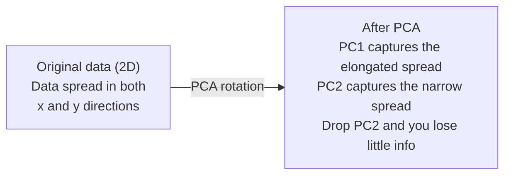

# Dimensionality Reduction

> High-dimensional data has structure. You find it by looking from the right angle.

**Type:** Build
**Language:** Python
**Prerequisites:** Phase 1, Lessons 01 (Linear Algebra Intuition), 02 (Vectors, Matrices & Operations), 03 (Eigenvalues & Eigenvectors), 06 (Probability & Distributions)
**Time:** ~90 minutes

**中文深入讲解：** 各概念小节下的「深入讲解（中文）」与 [`qa.md`](qa.md) 同步；算式用 **text** 代码块。

## Learning Objectives

- Implement PCA from scratch: center data, compute the covariance matrix, eigendecompose, and project
- Use explained variance ratio and the elbow method to choose the number of principal components
- Compare PCA, t-SNE, and UMAP for visualizing MNIST digits in 2D and explain their tradeoffs
- Apply kernel PCA with an RBF kernel to separate nonlinear data structures that standard PCA cannot handle

## The Problem

You have a dataset with 784 features per sample. Maybe it is pixel values of handwritten digits. Maybe it is gene expression levels. Maybe it is user behavior signals. You cannot visualize 784 dimensions. You cannot plot them. You cannot even think about them.

But most of those 784 features are redundant. The actual information lives on a much smaller surface. A handwritten "7" does not need 784 independent numbers to describe it. It needs a few: the angle of the stroke, the length of the crossbar, how much it leans. The rest is noise.

Dimensionality reduction finds that smaller surface. It takes your 784-dimensional data and compresses it to 2, 10, or 50 dimensions while keeping the structure that matters.

## The Concept

### The curse of dimensionality

High-dimensional spaces are unintuitive. Three things break as dimensions grow.

**Distance becomes meaningless.** In high dimensions, the distance between any two random points converges to the same value. If every point is roughly the same distance from every other point, nearest-neighbor search stops working.

```
Dimension    Avg distance ratio (max/min between random points)
2            ~5.0
10           ~1.8
100          ~1.2
1000         ~1.02
```

**Volume concentrates in corners.** A unit hypercube in d dimensions has 2^d corners. In 100 dimensions, nearly all the volume is in the corners, far from the center. Data points spread to the edges and your models starve for data in the interior.

**You need exponentially more data.** To maintain the same density of samples in a space, going from 2D to 20D means you need 10^18 times more data. You never have enough. Reducing dimensions brings the data density back to something workable.

### PCA: find the directions that matter

Principal Component Analysis (PCA) finds the axes along which your data varies the most. It rotates your coordinate system so the first axis captures the most variance, the second captures the next most, and so on.

The algorithm:

```
1. Center the data        (subtract the mean from each feature)
2. Compute covariance     (how features move together)
3. Eigendecomposition     (find the principal directions)
4. Sort by eigenvalue     (biggest variance first)
5. Project               (keep top k eigenvectors, drop the rest)
```

Why eigendecomposition? The covariance matrix is symmetric and positive semi-definite. Its eigenvectors are orthogonal directions in feature space. The eigenvalues tell you how much variance each direction captures. The eigenvector with the largest eigenvalue points along the direction of maximum variance.



- **Before PCA:** Data cloud is spread diagonally across both x and y axes
- **After PCA:** Coordinate system is rotated so PC1 aligns with the direction of maximum variance (elongated spread) and PC2 aligns with the direction of minimum variance (narrow spread)
- **Dimensionality reduction:** Dropping PC2 projects the data onto PC1, losing very little information

### Explained variance ratio

Each principal component captures a fraction of the total variance. The explained variance ratio tells you how much.

```
Component    Eigenvalue    Explained ratio    Cumulative
PC1          4.73          0.473              0.473
PC2          2.51          0.251              0.724
PC3          1.12          0.112              0.836
PC4          0.89          0.089              0.925
...
```

When the cumulative explained variance reaches 0.95, you know that many components capture 95% of the information. Everything after that is mostly noise.

#### 深入讲解（中文）：解释方差比与主成分在说什么？

PCA 按**方差从大到小**排序主成分（PC1、PC2、…）。每个 PC 对应协方差矩阵的一个**特征值** `lambda_k`。

**解释方差比（explained variance ratio）** 表示第 `k` 个成分占**总方差**的比例：

```text
explained_ratio_k = lambda_k / sum(all lambda_j)
```

与上文表格一致：PC1≈0.473、PC2≈0.251、PC3≈0.112……前几维往往「一块吃掉」大部分方差；后面的成分多半是噪声或细枝末节。

### Choosing the number of components

Three strategies:

1. **Threshold.** Keep enough components to explain 90-95% of the variance.
2. **Elbow method.** Plot explained variance per component. Look for a sharp drop-off.
3. **Downstream performance.** Use PCA as preprocessing. Sweep k and measure your model's accuracy. The best k is wherever accuracy plateaus.

#### 深入讲解（中文）：Elbow method（肘部法）

在 **PCA** 里，你要决定保留多少个主成分 `k`。Elbow method 是一种**看图选 k** 的启发式方法：画出「每增加一个主成分能带来多少信息」，在曲线从「陡」变「平」的地方选一个 `k`，像手臂从前臂到上臂的拐弯，所以叫 **肘部（elbow）**。

与上文三种策略的对应：

1. **阈值法**：累计解释方差达到 90%–95%。
2. **Elbow method**：画每个成分的**解释方差**，找**明显变陡变平**的位置。
3. **下游任务**：对不同的 `k` 训练模型，看准确率何时不再明显提升。

**画什么图？** 课里写的是：**Plot explained variance per component**（每个成分一条柱或一个点）。

- **横轴**：主成分编号 `k = 1, 2, 3, ...`
- **纵轴**：第 `k` 个成分的 **explained variance ratio**（不是累计）

有时也会画 **累计解释方差** 对 `k` 的曲线；下文「Reconstruction Error」一节把这类曲线也叫 **elbow curve**。两种图相关，但 Elbow 更常指**逐成分**那条线/柱在前面很高、后面突然变矮的「拐点」。

**「Sharp drop-off」是什么意思？**

- **PC1、PC2、…**：柱子/点还比较高 → 每个新方向都还能解释不少方差。
- **某一维之后**：每个新成分的解释方差**突然变小**，曲线像从陡坡掉进缓坡。

**肘部**就是：再往后多留成分，**边际收益**明显变小；再往前少留，又会丢掉较多「真实结构」。直觉上在拐点附近选 `k`。

用课里的数字打个比方：PC1≈47%、PC2≈25%，前两个就 72%；PC3 只有 11%。若 PC4 以后都 <10% 且一路更小，肘部往往在 **2 或 3** 附近——取决于你愿意把「明显变平」定在哪一段。

因为 explained ratio 与 `lambda_k` 成正比（分母对所有 `k` 相同），**按 explained variance 找肘部 = 按特征值谱找肘部**。大特征值对应「重要方向」；小特征值对应噪声或冗余维度。

**和「阈值法」怎么选？**

| | Elbow | 阈值（如 95% 累计方差） |
|---|--------|-------------------------|
| 依据 | 形状：边际解释方差何时变平 | 数字：累计是否 ≥ 0.95 |
| 优点 | 不硬绑 90%/95%，适合方差分布很「尖」的数据 | 规则清楚，好写进报告 |
| 缺点 | 肘部常不唯一，要人眼判断 | 高维稀疏数据可能要很多维才到 95% |

第三条：**下游性能平台期**（见下文 **Use It** 扫 `k`）——当分类准确率不再随 `k` 上升时，那个 `k` 也是实务上的「肘部」。

**使用时要注意：**

1. **没有唯一公式**：「sharp」是主观判断；有时有两个弯，或曲线很平滑没有明显肘。
2. **只反映线性方差**：PCA 只看协方差结构；非线性流形可能需要更多维或 kernel PCA。
3. **和任务不一定一致**：方差大 ≠ 对分类最重要；重要特征若在低方差方向，肘部选的 `k` 可能偏小——这时要结合下游 sweep。
4. **练习 3**：若真实只有约 5 个有效维度，解释方差曲线应在前面几个成分后明显变平，肘部应落在较小 `k` 附近。

**一句话：** 对 PCA 的每个主成分画出 **explained variance ratio**，找到「边际信息递减」的**拐点**，把该点附近的 `k` 当作压缩维数。

### t-SNE: preserve neighborhoods

t-Distributed Stochastic Neighbor Embedding (t-SNE) is designed for visualization. It maps high-dimensional data to 2D (or 3D) while preserving which points are near each other.

The intuition: in the original space, compute a probability distribution over pairs of points based on their distances. Near points get high probability. Far points get low probability. Then find a 2D arrangement where the same probability distribution holds. Points that were neighbors in 784 dimensions stay neighbors in 2D.

Key properties of t-SNE:
- Non-linear. It can unfold complex manifolds that PCA cannot.
- Stochastic. Different runs produce different layouts.
- Perplexity parameter controls how many neighbors to consider (typical range: 5-50).
- Distances between clusters in the output are not meaningful. Only the clusters themselves are.
- Slow on large datasets. O(n^2) by default.

### UMAP: faster, better global structure

Uniform Manifold Approximation and Projection (UMAP) works similarly to t-SNE but with two advantages:
- Faster. It uses approximate nearest-neighbor graphs instead of computing all pairwise distances.
- Better global structure. The relative positions of clusters in the output tend to be more meaningful than in t-SNE.

UMAP builds a weighted graph in high-dimensional space (the "fuzzy topological representation") and then finds a low-dimensional layout that preserves this graph as well as possible.

Key parameters:
- `n_neighbors`: how many neighbors define local structure (similar to perplexity). Higher values preserve more global structure.
- `min_dist`: how tightly points pack together in the output. Lower values create denser clusters.

### When to use which

| Method | Use case | Preserves | Speed |
|--------|----------|-----------|-------|
| PCA | Preprocessing before training | Global variance | Fast (exact), works on millions of samples |
| PCA | Quick exploratory visualization | Linear structure | Fast |
| t-SNE | Publication-quality 2D plots | Local neighborhoods | Slow (< 10k samples ideal) |
| UMAP | 2D visualization at scale | Local + some global structure | Medium (handles millions) |
| PCA | Feature reduction for models | Variance-ranked features | Fast |
| t-SNE / UMAP | Understanding cluster structure | Cluster separation | Medium to slow |

Rule of thumb: use PCA for preprocessing and data compression. Use t-SNE or UMAP when you need to visualize structure in 2D.

### Kernel PCA

Standard PCA finds linear subspaces. It rotates your coordinate system and drops axes. But what if the data lies on a nonlinear manifold? A circle in 2D cannot be separated by any line. Standard PCA will not help.

Kernel PCA applies PCA in a high-dimensional feature space induced by a kernel function, without explicitly computing the coordinates in that space. This is the kernel trick -- the same idea behind SVMs.

The algorithm:
1. Compute the kernel matrix K where K_ij = k(x_i, x_j)
2. Center the kernel matrix in feature space
3. Eigendecompose the centered kernel matrix
4. The top eigenvectors (scaled by 1/sqrt(eigenvalue)) are the projections

Common kernel functions:

| Kernel | Formula | Good for |
|--------|---------|----------|
| RBF (Gaussian) | exp(-gamma * \|\|x - y\|\|^2) | Most nonlinear data, smooth manifolds |
| Polynomial | (x . y + c)^d | Polynomial relationships |
| Sigmoid | tanh(alpha * x . y + c) | Neural network-like mappings |

When to use kernel PCA vs standard PCA:

| Criterion | Standard PCA | Kernel PCA |
|-----------|-------------|------------|
| Data structure | Linear subspace | Nonlinear manifold |
| Speed | O(min(n^2 d, d^2 n)) | O(n^2 d + n^3) |
| Interpretability | Components are linear combinations of features | Components lack direct feature interpretation |
| Scalability | Works on millions of samples | Kernel matrix is n x n, memory-limited |
| Reconstruction | Direct inverse transform | Requires pre-image approximation |

The classic example: concentric circles in 2D. Two rings of points, one inside the other. Standard PCA projects both onto the same line -- useless for classification. Kernel PCA with an RBF kernel maps the inner circle and outer circle to different regions, making them linearly separable.

#### 深入讲解（中文）：Kernel PCA 算法与核技巧

**标准 PCA 卡在哪里？** 标准 PCA 在原始特征空间里找**线性**方向，使投影后方差最大。若数据落在**线性子空间**里，PCA 很合适；若结构是**非线性流形**（沿弯曲曲面分布），PCA 只能找直线/平面，无法「展开」弯曲结构。

**同心圆**（`code/dim_reduction.py` 的 `demo_kernel_pca`）：

- 内外环由**半径**决定，没有一条直线能把两环分开。
- 一维线性 PCA 投到一条线上，两环投影**重叠**，分类几乎无用。

更一般：圆环在 2D 里是弯曲的 1 维流形；「半径」是 `sqrt(x1^2 + x2^2)`，不是 `x1, x2` 的线性函数，PCA 无法单独抽出这一维。

**核心想法：** **先（隐式）把点映到高维特征空间 `phi(x)`，再在那里做 PCA。** 若在该空间里数据近似线性可分/可展，PCA 就能抓住非线性结构。

**核技巧**：算法只用到内积 `⟨phi(x_i), phi(x_j)⟩`，不必写出 `phi`：

```text
K_ij = k(x_i, x_j) = ⟨phi(x_i), phi(x_j)⟩
```

与支持向量机（SVM）同一套逻辑。

**算法四步（与上文列表对应）**

记 `n` 个样本 `x_1, …, x_n`。

1. **核矩阵 `K`：** `K_ij = k(x_i, x_j)`，`K` 为 `n × n`。RBF 核：`K_ij = exp(-gamma * ||x_i - x_j||^2)`。线性核 `k(x,y) = x·y` 时，Kernel PCA 与（中心化后的）标准 PCA 对应。

2. **在特征空间里中心化核矩阵：** 见下节「只用原始 K 得到 K̃」。代码（double centering）：

```text
one_n = ones(n, n) / n
K_tilde = K - one_n @ K - K @ one_n + one_n @ K @ one_n
```

3. **特征分解：** `K_tilde = sum_k lambda_k alpha^(k) alpha^(k)^T`，按 `lambda_k` 从大到小取前 `m` 个。代价：`O(n^2 d + n^3)`（`K` 为 `n×n`）。

4. **投影与 `1/sqrt(特征值)` 缩放：** 训练样本 `x_i` 在第 `k` 个成分上常为 `z_{i,k} = sqrt(lambda_k) * alpha_k[i]`。上文「特征向量除以 `sqrt(特征值)` 再缩放」与 `kernel_pca` 一致：列归一化后乘 `lambda`，得到 `sqrt(lambda) * alpha`。对新样本需用 `k(x, x_j)` 再组合（本课 demo 主要在训练集上展示分离）。

**与标准 PCA 的取舍**（与上文表格一致，中文归纳）：

| 维度 | 标准 PCA | Kernel PCA |
|------|----------|------------|
| 结构 | 线性子空间 | 非线性流形 |
| 复杂度 | 对 `n,d` 较友好 | `n×n` 核矩阵 |
| 可解释性 | 特征是线性组合 | 无直接特征系数 |
| 重建 | `inverse_transform` | 需 pre-image 近似 |
| 规模 | 可很大 `n` | 受 `n^2` 限制 |

**一句话：** 在核诱导的特征空间里做 PCA；用 `K` 代替显式 `phi`；中心化 `K` 后特征分解；坐标为 `sqrt(lambda_k) * alpha_k[i]`。用 `n×n` 核矩阵换非线性，代价是算力、内存与可解释性。

#### 深入讲解（中文）：只用原始 `K` 如何得到中心化核矩阵 `K̃`？

**特征空间里在「居中」什么？**

```text
phi_tilde_i = phi(x_i) - mu_phi
mu_phi      = (1/n) sum_j phi(x_j)
```

要的是**中心化 Gram 矩阵** `K_tilde_ij = ⟨phi_tilde_i, phi_tilde_j⟩`。目标：只通过原始 `K_ij = ⟨phi(x_i), phi(x_j)⟩` 算出 `K_tilde_ij`，**从不显式计算 `phi(x)`**。

**内积展开（四项公式）**

记 `phi_i = phi(x_i)`：

```text
K_tilde_ij = ⟨phi_i - mu, phi_j - mu⟩
           = ⟨phi_i, phi_j⟩ - ⟨phi_i, mu⟩ - ⟨mu, phi_j⟩ + ⟨mu, mu⟩
```

| 项 | 只用 K 的写法 |
|----|----------------|
| `⟨phi_i, phi_j⟩` | `K_ij` |
| `⟨phi_i, mu⟩` | `(1/n) sum_k K_ik`（第 `i` 行平均） |
| `⟨mu, phi_j⟩` | `(1/n) sum_k K_kj`（第 `j` 列平均） |
| `⟨mu, mu⟩` | `(1/n^2) sum_k sum_l K_kl`（见下） |

合起来：

```text
K_tilde_ij = K_ij
           - (1/n) sum_k K_ik
           - (1/n) sum_k K_kj
           + (1/n^2) sum_k sum_l K_kl
```

**`(1/n^2) sum_k sum_l K_kl` 是什么？**

对 `n×n` 的 `K`，遍历每一个 `K_kl` 相加后除以 `n^2`：

> **核矩阵 K 全部 n² 个元素的算术平均**（grand mean / 全局均值）

记 `K_bar = (1/n^2) * (所有 K_kl 之和)`。在中心化公式里，对任意 `(i,j)` 加上的都是**同一个数** `K_bar`。

在特征空间中：`⟨mu_phi, mu_phi⟩ = (1/n^2) sum_k sum_l K_kl`，即 **样本均值点 `mu_phi` 与自己的内积**（「数据中心」在核几何里的自相似度）。

**为何公式里是「加上」这一项？** 展开 `⟨phi_i - mu, phi_j - mu⟩` 时，代数上需要在最后 **加回** `⟨mu, mu⟩`；与减行平均、减列平均配套，不是随意常数。

**n=2 数值例：**

```text
K = [ 1.0   0.5 ]
    [ 0.5   1.0 ]
```

四元之和 = 3，全局平均 = 3/4 = **0.75**。行、列平均也都是 0.75，故 `K_tilde_11 = 1.0 - 0.75 - 0.75 + 0.75 = 0.25`。

**与代码、标准 PCA 的对应**

| 标准 PCA | Kernel PCA |
|----------|------------|
| `X_tilde = X - mean` | 不显式 `phi_tilde` |
| 协方差 ∝ `X_tilde^T X_tilde` | `K_tilde`，`K_tilde_ij = ⟨phi_tilde_i, phi_tilde_j⟩` |
| 用 `X` 算 | 用 `K_ij = k(x_i,x_j)` 算 |

`K_tilde = K - one_n@K - K@one_n + one_n@K@one_n` 与上式逐项相同（`one_n = 11^T/n`）。

**若不中心化**：第一主成分易被整体偏移/模长主导；中心化后才更关注相对结构（如同心圆的半径差）。

**一句话：** `K_tilde_ij` 等于「在特征空间里对每个 `phi(x_i)` 减均值后再算内积」——这个矩阵**完全由原始 `K` 的行和、列和、总和**算出，不需要 `phi` 的坐标。

### Reconstruction Error

How good is your dimensionality reduction? You compressed 784 dimensions to 50. What did you lose?

Measure reconstruction error:
1. Project data to k dimensions: X_reduced = X @ W_k
2. Reconstruct: X_hat = X_reduced @ W_k^T
3. Compute MSE: mean((X - X_hat)^2)

For PCA, reconstruction error has a clean relationship to explained variance:

```
Reconstruction error = sum of eigenvalues NOT included
Total variance = sum of ALL eigenvalues
Fraction lost = (sum of dropped eigenvalues) / (sum of all eigenvalues)
```

The explained variance ratio for each component is:

```
explained_ratio_k = eigenvalue_k / sum(all eigenvalues)
```

Plotting cumulative explained variance against number of components gives you the "elbow" curve. The right number of components is where:
- The curve flattens out (diminishing returns)
- Cumulative variance crosses your threshold (usually 0.90 or 0.95)
- Downstream task performance plateaus

#### 深入讲解（中文）：Elbow、累计方差与重建误差

对 PCA，重建误差与**未保留**的特征值之和相关（见上文公式）。

画 **累计解释方差** 随成分数 `k` 变化的曲线时，合适的 `k` 常同时参考：

- 曲线**变平**（边际收益递减）——与 Elbow method 的拐点一致；
- 累计方差跨过阈值（0.90 或 0.95）——阈值法；
- 下游任务性能**平台期**——见 **Use It**。

这三条可以互相印证，而不是互相排斥。

Reconstruction error is useful beyond choosing k. You can use it for anomaly detection: samples with high reconstruction error are outliers that do not fit the learned subspace. This is the basis of PCA-based anomaly detection in production systems.

## Build It

### Step 1: PCA from scratch

```python
import numpy as np

class PCA:
    def __init__(self, n_components):
        self.n_components = n_components
        self.components = None
        self.mean = None
        self.eigenvalues = None
        self.explained_variance_ratio_ = None

    def fit(self, X):
        self.mean = np.mean(X, axis=0)
        X_centered = X - self.mean

        cov_matrix = np.cov(X_centered, rowvar=False)

        eigenvalues, eigenvectors = np.linalg.eigh(cov_matrix)

        sorted_idx = np.argsort(eigenvalues)[::-1]
        eigenvalues = eigenvalues[sorted_idx]
        eigenvectors = eigenvectors[:, sorted_idx]

        self.components = eigenvectors[:, :self.n_components].T
        self.eigenvalues = eigenvalues[:self.n_components]
        total_var = np.sum(eigenvalues)
        self.explained_variance_ratio_ = self.eigenvalues / total_var

        return self

    def transform(self, X):
        X_centered = X - self.mean
        return X_centered @ self.components.T

    def fit_transform(self, X):
        self.fit(X)
        return self.transform(X)
```

### Step 2: Test on synthetic data

```python
np.random.seed(42)
n_samples = 500

t = np.random.uniform(0, 2 * np.pi, n_samples)
x1 = 3 * np.cos(t) + np.random.normal(0, 0.2, n_samples)
x2 = 3 * np.sin(t) + np.random.normal(0, 0.2, n_samples)
x3 = 0.5 * x1 + 0.3 * x2 + np.random.normal(0, 0.1, n_samples)

X_synthetic = np.column_stack([x1, x2, x3])

pca = PCA(n_components=2)
X_reduced = pca.fit_transform(X_synthetic)

print(f"Original shape: {X_synthetic.shape}")
print(f"Reduced shape:  {X_reduced.shape}")
print(f"Explained variance ratios: {pca.explained_variance_ratio_}")
print(f"Total variance captured: {sum(pca.explained_variance_ratio_):.4f}")
```

### Step 3: MNIST digits in 2D

```python
from sklearn.datasets import fetch_openml

mnist = fetch_openml("mnist_784", version=1, as_frame=False, parser="auto")
X_mnist = mnist.data[:5000].astype(float)
y_mnist = mnist.target[:5000].astype(int)

pca_mnist = PCA(n_components=50)
X_pca50 = pca_mnist.fit_transform(X_mnist)
print(f"50 components capture {sum(pca_mnist.explained_variance_ratio_):.2%} of variance")

pca_2d = PCA(n_components=2)
X_pca2d = pca_2d.fit_transform(X_mnist)
print(f"2 components capture {sum(pca_2d.explained_variance_ratio_):.2%} of variance")
```

### Step 4: Compare with sklearn

```python
from sklearn.decomposition import PCA as SklearnPCA
from sklearn.manifold import TSNE

sklearn_pca = SklearnPCA(n_components=2)
X_sklearn_pca = sklearn_pca.fit_transform(X_mnist)

print(f"\nOur PCA explained variance:     {pca_2d.explained_variance_ratio_}")
print(f"Sklearn PCA explained variance: {sklearn_pca.explained_variance_ratio_}")

diff = np.abs(np.abs(X_pca2d) - np.abs(X_sklearn_pca))
print(f"Max absolute difference: {diff.max():.10f}")

tsne = TSNE(n_components=2, perplexity=30, random_state=42)
X_tsne = tsne.fit_transform(X_mnist)
print(f"\nt-SNE output shape: {X_tsne.shape}")
```

### Step 5: UMAP comparison

```python
try:
    from umap import UMAP

    reducer = UMAP(n_components=2, n_neighbors=15, min_dist=0.1, random_state=42)
    X_umap = reducer.fit_transform(X_mnist)
    print(f"UMAP output shape: {X_umap.shape}")
except ImportError:
    print("Install umap-learn: pip install umap-learn")
```

## Use It

PCA as preprocessing before a classifier:

```python
from sklearn.decomposition import PCA as SklearnPCA
from sklearn.linear_model import LogisticRegression
from sklearn.model_selection import train_test_split
from sklearn.metrics import accuracy_score

X_train, X_test, y_train, y_test = train_test_split(
    X_mnist, y_mnist, test_size=0.2, random_state=42
)

results = {}
for k in [10, 30, 50, 100, 200]:
    pca_k = SklearnPCA(n_components=k)
    X_tr = pca_k.fit_transform(X_train)
    X_te = pca_k.transform(X_test)

    clf = LogisticRegression(max_iter=1000, random_state=42)
    clf.fit(X_tr, y_train)
    acc = accuracy_score(y_test, clf.predict(X_te))
    var_captured = sum(pca_k.explained_variance_ratio_)
    results[k] = (acc, var_captured)
    print(f"k={k:>3d}  accuracy={acc:.4f}  variance={var_captured:.4f}")
```

Performance plateaus well before 784 dimensions. That plateau is your operating point.

## Ship It

This lesson produces:
- `outputs/skill-dimensionality-reduction.md` - a skill for choosing the right dimensionality reduction technique for a given task

## Exercises

1. Modify the PCA class to support `inverse_transform`. Reconstruct MNIST digits from 10, 50, and 200 components. Print the reconstruction error (mean squared difference from the original) for each.

2. Run t-SNE on the same MNIST subset with perplexity values of 5, 30, and 100. Describe how the output changes. Why does perplexity affect cluster tightness?

3. Take a dataset with 50 features where only 5 are informative (generate one with `sklearn.datasets.make_classification`). Apply PCA and check whether the explained variance curve correctly identifies that the data is effectively 5-dimensional.

## Key Terms

| Term | What people say | What it actually means |
|------|----------------|----------------------|
| Curse of dimensionality | "Too many features" | Distances, volumes, and data density all behave counterintuitively as dimensions grow. Models need exponentially more data to compensate. |
| PCA | "Reduce dimensions" | Rotate your coordinate system so the axes align with the directions of maximum variance, then drop the low-variance axes. |
| Principal component | "An important direction" | An eigenvector of the covariance matrix. The direction in feature space along which the data varies most. |
| Explained variance ratio | "How much info this component has" | The fraction of total variance captured by one principal component. Sum the top k ratios to see how much k components preserve. |
| Covariance matrix | "How features correlate" | A symmetric matrix where entry (i,j) measures how feature i and feature j move together. Diagonal entries are individual variances. |
| t-SNE | "That cluster plot" | A nonlinear method that maps high-dimensional data to 2D by preserving pairwise neighborhood probabilities. Good for visualization, not for preprocessing. |
| UMAP | "Faster t-SNE" | A nonlinear method based on topological data analysis. Preserves both local and some global structure. Scales better than t-SNE. |
| Perplexity | "A t-SNE knob" | Controls the effective number of neighbors each point considers. Low perplexity focuses on very local structure. High perplexity captures broader patterns. |
| Manifold | "The surface the data lives on" | A lower-dimensional surface embedded in a higher-dimensional space. A sheet of paper crumpled in 3D is a 2D manifold. |

## Further Reading

- [A Tutorial on Principal Component Analysis](https://arxiv.org/abs/1404.1100) (Shlens) - clear derivation of PCA from the ground up
- [How to Use t-SNE Effectively](https://distill.pub/2016/misread-tsne/) (Wattenberg et al.) - interactive guide to t-SNE pitfalls and parameter choices
- [UMAP documentation](https://umap-learn.readthedocs.io/) - theory and practical guidance from the UMAP authors
