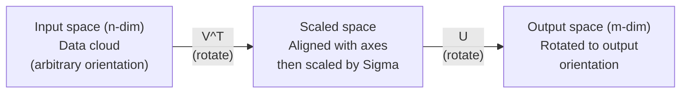
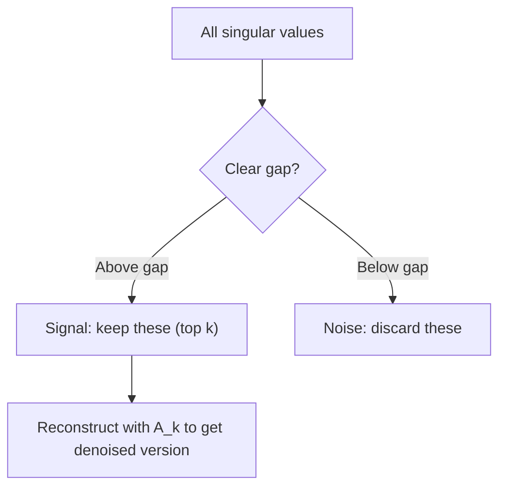

# Singular Value Decomposition

> SVD is the Swiss Army knife of linear algebra. Every matrix has one. Every data scientist needs one.

**Type:** Build
**Languages:** Python, Julia
**Prerequisites:** Phase 1, Lessons 01 (Linear Algebra Intuition), 02 (Vectors & Matrices Operations), 03 (Matrix Transformations)
**Time:** ~120 minutes

## Learning Objectives

- Implement SVD via power iteration and explain the geometric meaning of U, Sigma, and V^T
- Apply truncated SVD for image compression and measure the compression ratio vs reconstruction error
- Compute the Moore-Penrose pseudoinverse via SVD to solve overdetermined least-squares systems
- Connect SVD to PCA, recommendation systems (latent factors), and Latent Semantic Analysis in NLP


## 中文补充说明

> 以下各节英文讲解之后附有与本课相关的中文问答深度补充（原 `docs/qa.md`）。 实现参考：`code/svd.py` 中的 `svd_from_scratch`（deflation：`A_residual -= sigma * np.outer(u, v)`）。

## The Problem

You have a 1000x2000 matrix. Maybe it is user-movie ratings. Maybe it is a document-term frequency table. Maybe it is the pixel values of an image. You need to compress it, denoise it, find hidden structure in it, or solve a least-squares system with it. Eigendecomposition only works on square matrices. Even then, it requires the matrix to have a full set of linearly independent eigenvectors.

SVD works on any matrix. Any shape. Any rank. No conditions. It decomposes the matrix into three factors that reveal the geometry of what the matrix does to space. It is the most general and most useful factorization in all of linear algebra.

## The Concept

### What SVD does geometrically

Every matrix, regardless of shape, performs three operations in sequence: rotate, scale, rotate. SVD makes this decomposition explicit.

```
A = U * Sigma * V^T

      m x n     m x m    m x n    n x n
     (any)    (rotate)  (scale)  (rotate)
```

Given any matrix A, SVD factors it into:
- V^T rotates vectors in the input space (n-dimensional)
- Sigma scales along each axis (stretches or compresses)
- U rotates the result into the output space (m-dimensional)



Think of it this way. You hand SVD a matrix. It tells you: "This matrix takes a sphere of inputs, first rotates it by V^T, then stretches it into an ellipsoid by Sigma, then rotates the ellipsoid by U." The singular values are the lengths of the ellipsoid's axes.

### The full decomposition

For a matrix A with shape m x n:

```
A = U * Sigma * V^T

where:
  U     is m x m, orthogonal (U^T U = I)
  Sigma is m x n, diagonal (singular values on the diagonal)
  V     is n x n, orthogonal (V^T V = I)

The singular values sigma_1 >= sigma_2 >= ... >= sigma_r > 0
where r = rank(A)
```

The columns of U are called left singular vectors. The columns of V are called right singular vectors. The diagonal entries of Sigma are called singular values. They are always non-negative and conventionally sorted in decreasing order.

### Left singular vectors, singular values, right singular vectors

Each component of the SVD has a distinct geometric meaning.

**Right singular vectors (columns of V):** These form an orthonormal basis for the input space (R^n). They are the directions in input space that the matrix maps to orthogonal directions in output space. Think of them as the natural coordinate system for the domain.

**Singular values (diagonal of Sigma):** These are the scaling factors. The i-th singular value tells you how much the matrix stretches vectors along the i-th right singular vector. A singular value of zero means the matrix crushes that direction entirely.

**Left singular vectors (columns of U):** These form an orthonormal basis for the output space (R^m). The i-th left singular vector is the direction in output space where the i-th right singular vector lands (after scaling).

The relationship between them:

```
A * v_i = sigma_i * u_i

The matrix A takes the i-th right singular vector v_i,
scales it by sigma_i, and maps it to the i-th left singular vector u_i.
```

This gives you a coordinate-by-coordinate picture of what any matrix does.


### 中文补充（问答）

##### 4. 和第 `i` 对奇异向量的关系（`A v_i = sigma_i u_i`）

`en.md` 中的关系：

```text
A * v_i = sigma_i * u_i
```

对任意 `i`：

```text
A v_i = sum_{j=1}^{r} sigma_j * u_j * (v_j^T v_i)
```

因为 `v_j` 正交，`v_j^T v_i = 0`（`j ≠ i`），`v_i^T v_i = 1`，所以：

```text
A v_i = sigma_i u_i
```

也就是说：**输入方向 `v_i`** 被 `A` 映成 **输出方向 `u_i`**，拉伸系数是 **`sigma_i`**。  
单独看第 `i` 项 `sigma_i u_i v_i^T`，它对 `v_i` 的贡献正是 `sigma_i u_i`，对其它 `v_j` 贡献为 0——每一项负责「一条输入轴 → 一条输出轴」的映射。

---

### Outer product form

The SVD can be written as a sum of rank-1 matrices:

```
A = sigma_1 * u_1 * v_1^T + sigma_2 * u_2 * v_2^T + ... + sigma_r * u_r * v_r^T

Each term sigma_i * u_i * v_i^T is a rank-1 matrix (an outer product).
The full matrix is the sum of r such matrices, where r is the rank.
```

This form is the foundation of low-rank approximation. Each term adds one layer of structure. The first term captures the single most important pattern. The second captures the next most important. And so on. Truncating this sum gives you the best possible approximation at any given rank.

```
Rank-1 approx:    A_1 = sigma_1 * u_1 * v_1^T
                  (captures the dominant pattern)

Rank-2 approx:    A_2 = sigma_1 * u_1 * v_1^T + sigma_2 * u_2 * v_2^T
                  (captures the two most important patterns)

Rank-k approx:    A_k = sum of top k terms
                  (optimal by the Eckart-Young theorem)
```


### 中文补充（问答）

### 问答：SVD 可以写成秩-1 矩阵之和

**问：** The SVD can be written as a sum of rank-1 matrices — 详细解释一下。

**答：** 见下文各节。

---

#### 1. 从 `A = U Σ V^T` 到「秩-1 之和」

课里写的形式是：

```text
A = sigma_1 * u_1 * v_1^T + sigma_2 * u_2 * v_2^T + ... + sigma_r * u_r * v_r^T
```

其中 `r = rank(A)`，且 `sigma_1 >= sigma_2 >= ... >= sigma_r > 0`。下面分几步说明它为什么成立、每一项是什么意思。

---

#### 2. 矩阵乘法怎么变成「一项一项相加」

设 `A` 是 `m × n`。在紧凑 SVD（NumPy 的 `full_matrices=False`）里：

- `U`：`m × r`，列 `u_1, ..., u_r` 两两正交、单位长  
- `Σ`：`r × r` 对角，对角元 `sigma_1, ..., sigma_r`  
- `V`：`n × r`，列 `v_1, ..., v_r` 两两正交、单位长  

则 `A = U Σ V^T`。

关键一步：`Σ V^T` 的第 `i` 行是 `sigma_i * v_i^T`（一个 `1 × n` 的行向量）。左乘 `U` 时，第 `i` 列 `u_i` 只会和这一行做外积：

```text
U Σ V^T
= sum_{i=1}^{r} u_i * (sigma_i * v_i^T)
= sum_{i=1}^{r} sigma_i * u_i * v_i^T
```

若用「完整」SVD（`U` 为 `m×m`，`V` 为 `n×n`），多出来的奇异值为 0，对应项是零矩阵，所以**真正起作用的仍然只有上面 `r` 项**。

---

#### 3. 什么是「秩-1 矩阵」`u_i v_i^T`

**外积** `u_i v_i^T`（`m×1` 乘 `1×n`）得到 `m × n` 矩阵，第 `(p,q)` 元是 `u_i(p) * v_i(q)`。

几何上：每一列都是 `v_i` 的某个标量倍数，所有列共线 → **列空间维数为 1**，所以秩为 1。

乘以 `sigma_i` 只是把整块矩阵整体缩放，**秩仍是 1**。因此 `A` 是 **`r` 个秩-1 矩阵的加权和**（权重就是奇异值）。

**术语：** **「秩-1」= rank-1（秩等于 1）**；课里的 **秩-1 矩阵** = **rank-1 matrix** = 外积 **`u_i v_i^T`**（再乘 **`sigma_i`** 仍是 rank-1）。

**答疑 — 还是不明白 §3 时，先手算一块 2×2 外积：**

```text
u = [2]    v = [1]     规则：(p,q) 元 = u(p) * v(q)
    [1]        [3]

        列1(v1=1)  列2(v2=3)
行1(u1=2)   2        6
行2(u2=1)   1        3

u v^T = [2  6]
        [1  3]
```

第 2 列 = 3 × 第 1 列 → 只有一种列方向 → **rank(u v^T) = 1**。  
推广到 **`u_i v_i^T`**（`m×1` 与 `n×1`）：每一列都是 **`u_i` 的标量倍数**，列空间维数为 1。

**答疑 — 「A 是 r 个秩-1 之和」= 把 r 张 rank-1 小表逐格相加：**

一项（模式 1，数字例）：

```text
u1 = [1], v1 = [1]  →  u1 v1^T = [1  1]     设 sigma_1 = 2
     [1]       [1]                    [1  1]   第一项 = [2  2]
                                                      [2  2]
```

再加第二项（模式 2，与模式 1 **不同** 的 `(u2, v2)`）：

```text
u2 = [1], v2 = [ 1]  →  sigma_2 * u2 v2^T = [ 1  -1]
     [-1]      [-1]                          [-1   1]

A = [2  2]   +   [ 1  -1]   =   [ 3   1]
    [2  2]       [-1   1]       [ 1   3]
```

这里 **rank(A) = 2**，所以需要 **r = 2** 块 rank-1 **对应元素相加** 才 **精确** 等于 `A`；只保留第一块则仍是 rank-1，无法表示右下角为 3 的整张表。

---

#### 4. 和第 `i` 对奇异向量的关系（`A v_i = sigma_i u_i`）

`en.md` 中的关系：

```text
A * v_i = sigma_i * u_i
```

对任意 `i`：

```text
A v_i = sum_{j=1}^{r} sigma_j * u_j * (v_j^T v_i)
```

因为 `v_j` 正交，`v_j^T v_i = 0`（`j ≠ i`），`v_i^T v_i = 1`，所以：

```text
A v_i = sigma_i u_i
```

也就是说：**输入方向 `v_i`** 被 `A` 映成 **输出方向 `u_i`**，拉伸系数是 **`sigma_i`**。  
单独看第 `i` 项 `sigma_i u_i v_i^T`，它对 `v_i` 的贡献正是 `sigma_i u_i`，对其它 `v_j` 贡献为 0——每一项负责「一条输入轴 → 一条输出轴」的映射。

---

#### 5. 用列/行视角理解「叠加」

**按列：** `A` 的第 `j` 列 `a_j = A e_j` 可以写成  

```text
a_j = sum_i sigma_i * u_i * v_i(j)
```

即所有秩-1 块在第 `j` 列的分量相加。

**按元素：**  

```text
(A)_{pq} = sum_i sigma_i * u_i(p) * v_i(q)
```

每个 `(p,q)` 都是 `r` 个「秩-1 模式」在该位置的叠加。

所以 `A` 不是一块不可分割的整体，而是 **`r` 种独立模式**（每种由一对 `(u_i, v_i)` 和强度 `sigma_i` 刻画）的线性叠加。

---

#### 6. 为什么这种写法是低秩近似的基础

每一项 `sigma_i u_i v_i^T` 对应一种「全局」结构（在整个矩阵上同时有行形状 `u_i` 和列形状 `v_i`）。  
奇异值从大到小排序时：

- **第 1 项**：Frobenius 范数 / 谱范数意义下最重要的单一模式（秩-1 最优近似）  
- **前 k 项之和**：秩 ≤ k 的矩阵里对 `A` 的**最优**近似（Eckart-Young–Mirsky）

课里 `svd_from_scratch` 的代码：

```text
A_residual = A_residual - sigma * np.outer(u, v)
```

正是在做 **deflation**：每找到一个 `(sigma_i, u_i, v_i)`，就从剩余矩阵里减掉这一项，再在残差上找下一个奇异对——和「把 `A` 拆成秩-1 之和」是同一件事的两面。

`en.md` — Outer product form 中的截断形式：

```text
Rank-1 approx:  A_1 = sigma_1 * u_1 * v_1^T
Rank-k approx:  A_k = sum of top k terms  (optimal by Eckart-Young)
```

---

#### 7. 小例子（直觉）

若 `A = 3 u v^T`（真秩 1），整张矩阵就是「行向量形状像 `u`、列向量形状像 `v`」的乘积，没有第二个独立模式。  

若 `A = sigma_1 u_1 v_1^T + sigma_2 u_2 v_2^T` 且 `sigma_1 >> sigma_2`，只保留第一项往往已抓住大部分能量——图像压缩、去噪、推荐里的 latent factor 都依赖这个：**大 `sigma_i`** ≈ 信号/主结构，**小 `sigma_i`** ≈ 细节或噪声。

---

#### 8. 与 `U Σ V^T` 的几何说法（一句话对照）

- **`U Σ V^T`**：先旋转输入（`V^T`）、沿轴缩放（`Σ`）、再旋转输出（`U`）——连续三个线性变换。  
- **`sum_i sigma_i u_i v_i^T`**：同一个 `A`，拆成 `r` 个「只连一对方向」的简单变换再相加——便于截断、分析和算法（幂迭代 + deflation）。

两者代数上完全等价；外积形式把 **「矩阵 = 多个秩-1 模式之和」** 说清楚了，这也是 SVD 在压缩、PCA、推荐和 LSA 里好用的核心原因之一。

---

#### 9. 答疑：「r 个秩-1 之和」到底是什么意思？

三层含义（对话整理）：

1. **「之和」** — 两个同样大小的矩阵 **对应格子相加**（不是把矩阵排成一行）。  
2. **「秩-1 的一块」** — 每一格 = （行因子）×（列因子）；整块只有一种行×列图案，**rank = 1**。SVD 里写成 **`sigma_i u_i v_i^T`**。  
3. **「r 个」** — **`r = rank(A)`**：独立模式有几个，就要加几块 rank-1。**r = 1** 时一块就够；**r = 2** 需要两块相加才等于 `A`；一般地  

```text
A = sum_{i=1}^{r} sigma_i * u_i * v_i^T    （加满 r 项 = 精确等于 A）
```

**截断 SVD（别和上面混淆）：** 只加前 **k** 项（**k < r**）→ 得到秩 **k** 的近似 **`A_k`**，一般 **≠ A**；只有 **k = r** 才是精确重建。

---

#### 10. 学习者确认的理解（精确表述）

> **A 是由 r 个「每个的秩都是 1」的矩阵，对应位置相加得到的；其中 r = rank(A)。**

在 SVD 里，这 r 个矩阵必须是

```text
sigma_1 u_1 v_1^T,  sigma_2 u_2 v_2^T,  ...,  sigma_r u_r v_r^T
```

**不能**随便选 r 个 rank-1 矩阵相加就得到 `A` — 必须是对 `A` 做 SVD 得到的那 r 对 **`(u_i, v_i, sigma_i)`**（**rank(A) = r** 等价于 **r 个 `sigma_i > 0`**，在精确算术下）。

---

#### 11. 延伸（可选练习）

结合课内 `svd_from_scratch` 或 NumPy `np.linalg.svd(A, full_matrices=False)`：对一个小矩阵手算或编程验证  

```text
A_reconstructed = sum(sigma_i * np.outer(u_i, v_i) for i in range(r))
```

与 `U @ np.diag(S) @ V.T` 的重构误差应接近机器精度。

### Relationship to eigendecomposition

SVD and eigendecomposition are deeply connected. The singular values and vectors of A come directly from the eigenvalues and eigenvectors of A^T A and A A^T.

```
A^T A = V * Sigma^T * U^T * U * Sigma * V^T
      = V * Sigma^T * Sigma * V^T
      = V * D * V^T

where D = Sigma^T * Sigma is a diagonal matrix with sigma_i^2 on the diagonal.

So:
- The right singular vectors (V) are eigenvectors of A^T A
- The singular values squared (sigma_i^2) are eigenvalues of A^T A

Similarly:
A A^T = U * Sigma * V^T * V * Sigma^T * U^T
      = U * Sigma * Sigma^T * U^T

So:
- The left singular vectors (U) are eigenvectors of A A^T
- The eigenvalues of A A^T are also sigma_i^2
```

This connection tells you three things:
1. Singular values are always real and non-negative (they are square roots of eigenvalues of a positive semi-definite matrix).
2. You could compute SVD via eigendecomposition of A^T A, but this squares the condition number and loses numerical precision. Dedicated SVD algorithms avoid this.
3. When A is square and symmetric positive semi-definite, SVD and eigendecomposition are the same thing.


### 中文补充（问答）

### 问答：SVD 与特征分解的关系（`A^T A`、`A A^T` 与三件事）

**问：** `en.md` 中 `A^T A = V D V^T`、`A A^T = U Sigma Sigma^T U^T` 以及「这种联系可以告诉你三件事」——详细解释。

**答：** 见下文。

---

#### 10. 从 `A = U Sigma V^T` 推出 `A^T A`

紧凑 SVD：`A = U Sigma V^T`，`U^T U = I`，`V^T V = I`，则

```text
A^T A = V Sigma^T U^T U Sigma V^T = V Sigma^T Sigma V^T = V D V^T
D = Sigma^T Sigma，对角元 sigma_i^2
```

**完整 SVD：** `U` 为 `m×m`，`Sigma` 为 `m×n`，`V` 为 `n×n`，仍有 `U^T U = I`、`V^T V = I`，中间 `U` 被消掉，结论相同。此时 `D = Sigma^T Sigma` 是 **`n×n`**（因为 `A^T A` 是 `n×n`），对角线上为 `sigma_i^2`，其余为 0。

对 `V` 的第 `i` 列 `v_i`（正交基满足 `V^T v_i = e_i`）：

```text
A^T A v_i = V D V^T v_i = V D e_i = sigma_i^2 v_i
```

故 **右奇异向量是 `A^T A` 的特征向量，特征值为 `sigma_i^2`**。

同理：

```text
A A^T = U Sigma V^T V Sigma^T U^T = U Sigma Sigma^T U^T
```

**左奇异向量是 `A A^T` 的特征向量**，非零特征值仍是 `sigma_i^2`。  
`A^T A` 为 `n×n`，`A A^T` 为 `m×m`；若 `m ≠ n`，较大一方多出的特征值为 0，但**非零特征值集合相同**。

---

#### 11. 「三件事」详解

##### 11.1 奇异值恒为实数且非负

`A^T A` 对称且半正定：对任意 `x`，`x^T A^T A x = ||A x||^2 >= 0`。  
对称 ⇒ 特征值实数；半正定 ⇒ 特征值 `lambda_i >= 0`。  
SVD 中 `sigma_i^2 = lambda_i`，取非负平方根 ⇒ `sigma_i >= 0`。

##### 11.2 用 `A^T A` 做特征分解算 SVD：条件数平方

`kappa(A^T A) ≈ (sigma_max / sigma_min)^2 = kappa(A)^2`。  
形成 `A^T A` 会放大数值误差；专业算法（如 Golub–Kahan）直接在 `A` 上算 SVD，避免显式构造 `A^T A`。课中例子：`kappa(A) ~ 10^6` 时 `kappa(A^T A) ~ 10^12`。

##### 11.3 方阵对称半正定时 SVD = 特征分解

`A = Q Lambda Q^T`，`lambda_i >= 0`。可取 `U = V = Q`，`Sigma = Lambda`（奇异值 = 特征值）。一般非对称矩阵特征值可负、可复，SVD 仍对所有矩阵成立。

---

### 问答：完整 SVD 下 `A^T A = V D V^T` 与 `v_i` 为何是特征向量

**问：** 完整 SVD 下 `D` 在 `n×n` 意义下、`A^T A v_i = sigma_i^2 v_i` 这一步不明白。

**答：** 见下文。

---

#### 12. 完整 SVD 的形状（以 `A` 为 `m×n` 为例）

| 矩阵 | 形状 |
|------|------|
| `U` | `m×m`，`U^T U = I` |
| `Sigma` | `m×n`，主对角线上为 `sigma_1, sigma_2, ...`，其余为 0 |
| `V` | `n×n`，`V^T V = I` |

例：`m=3, n=2` 时 `Sigma` 为 3×2，前两行对角为 `sigma_1, sigma_2`，第三行全 0。

`A^T A = V Sigma^T Sigma V^T`，其中 `D = Sigma^T Sigma` 为 **`n×n` 对角阵**，对角元 `sigma_i^2`。

---

#### 13. 为什么 `V^T v_i = e_i`

`V` 的列 `v_1,...,v_n` 单位正交。`V^T` 第 `i` 行与 `v_j` 内积：仅 `j=i` 时为 1，故

```text
V^T v_i = e_i   （第 i 个标准基向量）
```

---

#### 14. 特征值方程链

```text
A^T A v_i = V D V^T v_i = V D e_i
```

---

### 问答：`V D e_i = sigma_i^2 v_i` 的计算过程

**问：** 「左乘 `V` 等于 `sigma_i^2` 乘以 `V` 的第 `i` 列」——给出计算过程。

**答：** 分四步。

---

#### 15. 第一步：`D e_i`

`D = diag(sigma_1^2, ..., sigma_n^2)`，`e_i` 仅第 `i` 分量为 1：

```text
D e_i = sigma_i^2 e_i
```

---

#### 16. 第二步：`V (D e_i) = V (sigma_i^2 e_i) = sigma_i^2 (V e_i)`

标量提出。

---

#### 17. 第三步：`V e_i = v_i`

`V = [v_1 | v_2 | ... | v_n]`，按列线性组合：

```text
V e_i = 0*v_1 + ... + 1*v_i + ... + 0*v_n = v_i
```

（只用到矩阵分块，不要求正交。）

---

#### 18. 第四步：合并

```text
V D e_i = sigma_i^2 V e_i = sigma_i^2 v_i
```

故 `A^T A v_i = V D V^T v_i = V D e_i = sigma_i^2 v_i`。

**`n=2` 数值形状例：** `D e_1 = [sigma_1^2, 0]^T`，`V` 左乘该向量 = `sigma_1^2` 乘以 `V` 的第 1 列 `v_1`。

---

#### 19. 常见误解对照

| 困惑 | 说明 |
|------|------|
| `D` 是 `m×m` 还是 `n×n`？ | `A^T A` 为 `n×n`，故 `D = Sigma^T Sigma` 为 **`n×n`** |
| `U` 去哪了？ | `U^T U = I` 在 `A^T A` 中消掉 `U`；`U` 出现在 **`A A^T`** |
| 为何是 `V` 的列不是 `U` 的列？ | `A^T A` 作用在输入空间 `R^n`，基为右奇异向量 |

---

### 问答：`A A^T u_i = sigma_i^2 u_i` 怎么推导？

**问：** `A A^T u_i = sigma_i A u_i = sigma_i^2 u_i` 怎么来的？

**答：** 正确链条如下（中间 **不是** `sigma_i A u_i`，除非 `A` 极特殊）。

由 SVD：`A v_i = sigma_i u_i`，且 **`A^T u_i = sigma_i v_i`**。

```text
A A^T u_i = A (A^T u_i) = A (sigma_i v_i) = sigma_i (A v_i) = sigma_i (sigma_i u_i) = sigma_i^2 u_i
```

对称于 `A^T A v_i`：`A A^T = U Sigma Sigma^T U^T`，故 `A A^T u_i = U tilde_D U^T u_i = sigma_i^2 u_i`（与 `V D e_i` 计算同构）。

**常见笔误：** `A A^T u_i = sigma_i A u_i` 一般不对；应是 **`A^T u_i`** 与 **`A v_i`**，不是 **`A u_i`**。

---

### 问答：为什么 `A^T A` 对称、半正定？

**问：** `(A^T A)^T = A^T A` 与 `x^T A^T A x = ||Ax||^2 >= 0` 为什么成立？

**答：**

**对称：** `(A^T A)^T = A^T (A^T)^T = A^T A`。

**半正定：** 对任意列向量 `x`，

```text
x^T A^T A x = (Ax)^T (Ax) = ||Ax||_2^2 >= 0
```

对称 ⇒ 特征值实数；半正定 ⇒ `lambda_i >= 0`；SVD 中 `sigma_i^2 = lambda_i`，故 `sigma_i = sqrt(lambda_i) >= 0`。

**`A A^T` 同理：** `(A A^T)^T = A A^T`；`x^T A A^T x = ||A^T x||^2 >= 0`（`m×m` 方阵）。

---

### 问答：SVD 为何约定奇异值非负？

**问：** 奇异值为什么必须非负？

**答：**

1. **定义：** `sigma_i = sqrt(λ_i)`，`λ_i` 为 `A^T A` 的特征值，`λ_i >= 0`，取**非负**平方根。  
2. **几何：** 奇异值是椭球半轴**长度**，长度非负。  
3. **约定：** `(-sigma_i)(-u_i) v_i^T = sigma_i u_i v_i^T`，符号可吸收到 `U,V`；固定 `sigma_i >= 0` 且降序，**拉伸大小唯一**，便于截断与范数。  
4. **对比：** `A` 的特征值可负、可复；奇异值不是 `A` 的特征值（对称半正定时才与特征值重合）。

---


### 问答：对称半正定时 `A^2 = Q Λ^2 Q^T`

**问：** 设 `A = A^T` 且半正定，`A = Q Λ Q^T`，为何 `A^2 = Q Λ^2 Q^T`？

**答：**

**谱定理：** 实对称 `A` ⇒ `A = Q Λ Q^T`，`Q` 正交。

**PSD ⇒ λ_i >= 0：** `q_i^T A q_i = λ_i ||q_i||^2 = λ_i >= 0`。

**对称时 `A^T A = A^2`：**

```text
A^2 = (Q Λ Q^T)(Q Λ Q^T) = Q Λ (Q^T Q) Λ Q^T = Q Λ^2 Q^T
```

**特征值：** `A^2 q_i = A(λ_i q_i) = λ_i^2 q_i`。与 SVD 联系：`A^2` 的特征值为 `σ_i^2` ⇒ 半正定下 **`σ_i = λ_i`**，可取 **`U = V = Q`**，SVD 与特征分解合一。

---

### Truncated SVD: low-rank approximation

The Eckart-Young-Mirsky theorem states that the best rank-k approximation to A (in both Frobenius and spectral norm) is obtained by keeping only the top k singular values and their corresponding vectors:

```
A_k = U_k * Sigma_k * V_k^T

where:
  U_k     is m x k  (first k columns of U)
  Sigma_k is k x k  (top-left k x k block of Sigma)
  V_k     is n x k  (first k columns of V)

Approximation error = sigma_{k+1}  (in spectral norm)
                    = sqrt(sigma_{k+1}^2 + ... + sigma_r^2)  (in Frobenius norm)
```

This is not just "a good" approximation. It is provably the best possible approximation of rank k. No other rank-k matrix is closer to A.

| Component | Relative magnitude | Kept in rank-3 approx? |
|-----------|-------------------|------------------------|
| sigma_1 | Largest | Yes |
| sigma_2 | Large | Yes |
| sigma_3 | Medium-large | Yes |
| sigma_4 | Medium | No (error) |
| sigma_5 | Medium-small | No (error) |
| sigma_6 | Small | No (error) |
| sigma_7 | Very small | No (error) |
| sigma_8 | Tiny | No (error) |

Keep top 3: A_3 captures the three largest singular values. Error = remaining values (sigma_4 through sigma_8).

If singular values decay fast, a small k captures most of the matrix. If they decay slowly, the matrix has no low-rank structure.


### 中文补充（问答）

#### 6. 为什么这种写法是低秩近似的基础

每一项 `sigma_i u_i v_i^T` 对应一种「全局」结构（在整个矩阵上同时有行形状 `u_i` 和列形状 `v_i`）。  
奇异值从大到小排序时：

- **第 1 项**：Frobenius 范数 / 谱范数意义下最重要的单一模式（秩-1 最优近似）  
- **前 k 项之和**：秩 ≤ k 的矩阵里对 `A` 的**最优**近似（Eckart-Young–Mirsky）

课里 `svd_from_scratch` 的代码：

```text
A_residual = A_residual - sigma * np.outer(u, v)
```

正是在做 **deflation**：每找到一个 `(sigma_i, u_i, v_i)`，就从剩余矩阵里减掉这一项，再在残差上找下一个奇异对——和「把 `A` 拆成秩-1 之和」是同一件事的两面。

`en.md` — Outer product form 中的截断形式：

```text
Rank-1 approx:  A_1 = sigma_1 * u_1 * v_1^T
Rank-k approx:  A_k = sum of top k terms  (optimal by Eckart-Young)
```

---

#### 7. 小例子（直觉）

若 `A = 3 u v^T`（真秩 1），整张矩阵就是「行向量形状像 `u`、列向量形状像 `v`」的乘积，没有第二个独立模式。  

若 `A = sigma_1 u_1 v_1^T + sigma_2 u_2 v_2^T` 且 `sigma_1 >> sigma_2`，只保留第一项往往已抓住大部分能量——图像压缩、去噪、推荐里的 latent factor 都依赖这个：**大 `sigma_i`** ≈ 信号/主结构，**小 `sigma_i`** ≈ 细节或噪声。

---

### Image compression with SVD

A grayscale image is a matrix of pixel intensities. An 800x600 image has 480,000 values. SVD lets you approximate it with far fewer.

```
Original image: 800 x 600 = 480,000 values

SVD with rank k:
  U_k:      800 x k values
  Sigma_k:  k values
  V_k:      600 x k values
  Total:    k * (800 + 600 + 1) = k * 1401 values

  k=10:   14,010 values   (2.9% of original)
  k=50:   70,050 values  (14.6% of original)
  k=100: 140,100 values  (29.2% of original)

  The compression ratio improves as k gets smaller,
  but visual quality degrades.
```

The key insight: natural images have rapidly decaying singular values. The first few singular values capture the broad structure (shapes, gradients). The later ones capture fine detail and noise. Truncating at rank 50 often produces an image that looks nearly identical to the original while using 85% less storage.

### SVD for recommendation systems

The Netflix Prize made this famous. You have a user-movie ratings matrix where most entries are missing.

```
             Movie1  Movie2  Movie3  Movie4  Movie5
  User1      [  5      ?       3       ?       1  ]
  User2      [  ?      4       ?       2       ?  ]
  User3      [  3      ?       5       ?       ?  ]
  User4      [  ?      ?       ?       4       3  ]

  ? = unknown rating
```

The idea: this ratings matrix has low rank. Users do not have completely independent tastes. There are a handful of latent factors (action vs. drama, old vs. new, cerebral vs. visceral) that explain most preferences.

SVD on the (filled-in) ratings matrix decomposes it into:
- U: user profiles in latent factor space
- Sigma: importance of each latent factor
- V^T: movie profiles in latent factor space

A user's predicted rating for a movie is the dot product of their user profile with the movie's profile (weighted by singular values). The low-rank approximation fills in the missing entries.

In practice, you use variants like Simon Funk's incremental SVD or ALS (alternating least squares) that handle missing data directly. But the core idea is the same: latent factor decomposition via SVD.


### 中文补充（问答）

### 问答：推荐系统 — 一个完整例子（4 用户 × 5 电影）

**问：** 潜因子、低秩、`?`、SVD 填缺失 — 用一例讲明白。

**答：** 见下文（与 `en.md` — SVD for recommendation systems 同构；代码见 `code/svd.py` — `demo_recommendation_system`）。

---

#### 20. 隐藏规则：2 个潜因子 + 点积

设只有两个维度 **F1（偏大片/动作向）**、**F2（偏轻松/喜剧向）**。

**用户坐标：**

| 用户 | F1 | F2 |
|------|----|----|
| User1 | 5 | 1 |
| User2 | 1 | 4 |
| User3 | 4 | 2 |
| User4 | 2 | 3 |

**电影坐标：**

| 电影 | F1 | F2 |
|------|----|----|
| Movie1 | 5 | 1 |
| Movie2 | 1 | 5 |
| Movie3 | 4 | 2 |
| Movie4 | 2 | 4 |
| Movie5 | 1 | 1 |

**原始分（点积）：** `R_raw[i,j] = F1_user × F1_movie + F2_user × F2_movie`。

**User1 一行手算：**

```text
M1: 5×5+1×1 = 26    M2: 5×1+1×5 = 10    M3: 22    M4: 14    M5: 6
```

User1 偏 F1 → M1/M3 高，M2/M4（偏 F2）低。缩放到约 1~5 星后整张 **真实表** 由上述规则生成（低秩：**秩 ≤ 2**）。

**矩阵形式：** `R ≈ P Q^T`，`P` 为 4×2（用户行），`Q` 为 5×2（电影行）。

---

#### 21. 观测 `?` 与手算预测一例

与课表同形的 **部分观测**（`?` = 未评）：

```text
              M1   M2   M3   M4   M5
User1        [ 5.0   ?   4.2   ?   1.2 ]
User2        [  ?   4.0   ?   3.5   ?  ]
...
```

**User1 对 Movie2（?）：** User1=(5,1)，Movie2=(1,5) → `5×1+1×5=10` → 约 **2.0 星**（低于 M1 的 5.0）。  
**无需 SVD** 即可理解：**用户向量 · 电影向量 = 预测分**。

---

#### 22. 课内 SVD 演示流程

1. **行均值** 把 `?` 填成数（仅演示；假值会干扰 SVD）。  
2. **`svd(filled)`**，截断秩 **k=2**（与 2 个潜因子对应）。  
3. **`R_hat = U_k Σ_k V_k^T`**，在原先 `?` 位置读 `R_hat[i,j]` 为预测。

**低秩含义：** 20 个格子由 **4×2 + 5×2** 量级参数生成，不是 20 个独立偏好。

**协同过滤直觉：** 口味相近用户 + 片子相近电影 → 共享潜因子 → 可推未评格子。

---

#### 23. 课内 SVD vs 生产（ALS / Funk）

| | 课内 SVD | ALS / Funk |
|---|----------|------------|
| 缺失 | 先填（如行均值） | **不填**，不参与拟合 |
| 目标 | 近似**整张填好的表** | 只最小化**已观测格**的 `(R_ij - p_i·q_j)²` |
| 预测 | 重构矩阵的 `?` 格 | **`p_i · q_j`** |

---

### 问答：`U Σ V^T` 与 `P Q^T` — 「旋转、缩放成正交形式」

**问：** 课里说 U/Σ/V^T 是把 P、Q 旋转、缩放成标准正交形式 — 什么意思？

**答：**

**两种写法描述同一类低秩矩阵：**

```text
R ≈ P Q^T          （用户 k 维 × 电影 k 维，点积）
R ≈ U_k Σ_k V_k^T  （SVD 截断）
```

**`P Q^T` 不唯一：** 对可逆 `M`，`(P M)(Q M^{-T})^T = P Q^T`，轴可斜、缩放可乱分。

**SVD 的标准化：**

- `V` 的列 `v_i`：**单位正交**（输入侧主轴）  
- `U` 的列 `u_i`：**单位正交**（输出侧）  
- **`Σ` 对角：** 强度 **仅** 在 `sigma_i`，且 `sigma_1 >= sigma_2 >= ...`

**白话：** 把「歪坐标里的 P、Q」换成 **互相垂直的轴 + 对角缩放**；几何即 **V^T 旋转 → Σ 缩放 → U 旋转**。

**与 P、Q 的换算（秩 k）：**

```text
P_SVD = U_k sqrt(Σ_k)
Q_SVD = V_k sqrt(Σ_k)
=>  P_SVD Q_SVD^T = U_k Σ_k V_k^T
```

预测：`R_hat[i,j] = sum_t sigma_t U[i,t] V[j,t]`，与 `p_i · q_j` 同类。

---

### 问答：ALS 与 Funk 是什么？

**问：** In practice ALS、Simon Funk's incremental SVD — 是什么？

**答：**

**共同目标（矩阵分解 / matrix factorization）：**

```text
min  sum_{(i,j) 已观测}  ( R[i,j] - p_i · q_j )²  (+ 正则项)
```

**ALS（Alternating Least Squares）：**

1. 固定所有 `q_j`，对每个用户 `i` 解最小二乘 → 更新 `p_i`；  
2. 固定所有 `p_i`，对每个电影 `j` 解最小二乘 → 更新 `q_j`；  
3. 交替至收敛。  

**特点：** 每步是线性最小二乘；Spark ML 等常用；**从不**对 `?` 填假数再 SVD。

**Funk SVD（Netflix Prize 时期 Simon Funk）：**

- **不是** 对含 NaN 的表直接调用 `numpy.linalg.svd`。  
- 在**观测格**上用误差 `R_ij - p_i·q_j` 做 **随机/增量梯度式** 更新 `p_i, q_j`（常带正则）。  
- **思想与 ALS 相同**（潜因子 + 只拟合已知分），更新机制不同。

**与课内关系：** 核心都是 **低秩潜因子**；课用 **填表 + SVD** 教线性代数；工业界用 **ALS/Funk** 处理缺失。

---

#### 24. 推荐相关：四句话总结

1. 每用户、每电影 **k 个小数**，**点积 ≈ 评分**（`P Q^T`）。  
2. **`?`** = 用学好的用户向量与电影向量 **算点积**。  
3. **SVD** = 在填好的表上 **自动找** 正交轴与 `sigma_i`（`U Σ V^T`）。  
4. **ALS/Funk** = **不填 ?**，只在真实星级上学同一套因子。

---

### SVD in NLP: Latent Semantic Analysis

Latent Semantic Analysis (LSA), also called Latent Semantic Indexing (LSI), applies SVD to a term-document matrix.

```
             Doc1   Doc2   Doc3   Doc4
  "cat"      [  3      0      1      0  ]
  "dog"      [  2      0      0      1  ]
  "fish"     [  0      4      1      0  ]
  "pet"      [  1      1      1      1  ]
  "ocean"    [  0      3      0      0  ]

After SVD with rank k=2:

  Each document becomes a point in 2D "concept space."
  Each term becomes a point in the same 2D space.
  Documents about similar topics cluster together.
  Terms with similar meanings cluster together.

  "cat" and "dog" end up near each other (land pets).
  "fish" and "ocean" end up near each other (water concepts).
  Doc1 and Doc3 cluster if they share similar topics.
```

LSA was one of the first successful methods for capturing semantic similarity from raw text. It works because synonymous terms tend to appear in similar documents, so SVD groups them into the same latent dimensions. Modern word embeddings (Word2Vec, GloVe) can be seen as descendants of this idea.

### SVD for noise reduction

Noisy data has signal concentrated in the top singular values and noise spread across all singular values. Truncating removes the noise floor.

**Clean signal singular values:**

| Component | Magnitude | Type |
|-----------|-----------|------|
| sigma_1 | Very large | Signal |
| sigma_2 | Large | Signal |
| sigma_3 | Medium | Signal |
| sigma_4 | Near zero | Negligible |
| sigma_5 | Near zero | Negligible |

**Noisy signal singular values (noise adds to all):**

| Component | Magnitude | Type |
|-----------|-----------|------|
| sigma_1 | Very large | Signal |
| sigma_2 | Large | Signal |
| sigma_3 | Medium | Signal |
| sigma_4 | Small | Noise |
| sigma_5 | Small | Noise |
| sigma_6 | Small | Noise |
| sigma_7 | Small | Noise |



This is used in signal processing, scientific measurement, and data cleaning. Any time you have a matrix corrupted by additive noise, truncated SVD is a principled way to separate signal from noise.

### Pseudoinverse via SVD

The Moore-Penrose pseudoinverse A+ generalizes matrix inversion to non-square and singular matrices. SVD makes computing it trivial.

```
If A = U * Sigma * V^T, then:

A+ = V * Sigma+ * U^T

where Sigma+ is formed by:
  1. Transpose Sigma (swap rows and columns)
  2. Replace each non-zero diagonal entry sigma_i with 1/sigma_i
  3. Leave zeros as zeros

For A (m x n):      A+ is (n x m)
For Sigma (m x n):  Sigma+ is (n x m)
```

The pseudoinverse solves least-squares problems. If Ax = b has no exact solution (overdetermined system), then x = A+ b is the least-squares solution (minimizes ||Ax - b||).

```
Overdetermined system (more equations than unknowns):

  [1  1]         [3]
  [2  1] x   =   [5]       No exact solution exists.
  [3  1]         [6]

  x_ls = A+ b = V * Sigma+ * U^T * b

  This gives the x that minimizes the sum of squared residuals.
  Same result as the normal equations (A^T A)^(-1) A^T b,
  but numerically more stable.
```


### 中文补充（问答）

### 问答：Moore–Penrose 伪逆 `A+` 与课中 3×2 超定例

**问：** `en.md` — Pseudoinverse via SVD：Σ⁺ 的构造、`x = A+ b` 与最小二乘 — 结合实例说明。

**答：** 见下文。

---

#### 25. 问题：超定方程组

```text
A = [1  1]       b = [3]
    [2  1]   x=?     [5]
    [3  1]           [6]
```

3 个方程、2 个未知量 → 一般 **无精确解** `Ax = b`。  
目标改为 **最小二乘**：`min_x ||Ax - b||_2^2`。

**形状：**

| 矩阵 | 形状 |
|------|------|
| `A` | 3×2 |
| `A+` | **2×3** |
| `Σ`（完整） | 3×2 |
| `Σ+` | **2×3** |

---

#### 26. SVD 定义（课的主线）

```text
A = U Σ V^T   →   A+ = V Σ+ U^T   →   x = A+ b
```

**Σ⁺ 三步：** 转置 Σ → 非零 `sigma_i` 换为 `1/sigma_i` → 零保持零。

**紧凑 SVD（NumPy `full_matrices=False`）：**

```text
A = U @ diag(S) @ Vt
A+ = Vt.T @ diag(1/S) @ U.T
```

与 `V Σ+ U^T` 等价（`V` 对应 `Vt.T`）。

---

#### 27. 本例数值结果

**法方程（列满秩时与 `A+ b` 相同）：**

```text
A^T A = [14  6]    A^T b = [31]
        [ 6  3]            [14]

(A^T A) x = A^T b  ⇒  x1 = 3/2,  x2 = 5/3
```

**拟合：**

```text
A x = [19/6, 14/3, 37/6]^T ≈ [3.167, 4.667, 6.167]^T
残差 r = b - A x = [-1/6, 1/3, -1/6]^T
```

三条等式不能同时成立；**平方误差之和已最小**（`A` 列满秩 ⇒ 解唯一）。

**验证最优性：** `A^T r = 0`（残差与 `Col(A)` 正交 ⇔ 法方程）。

与 `np.linalg.lstsq` / `np.linalg.pinv` 一致：`x = [1.5, 5/3]^T`。

**代码：** `code/svd.py` — Step 5: Pseudoinverse。

---

#### 28. 几何：为什么「无解」仍有「解」

- `Col(A)`：`R^3` 中过原点的 **平面**（维数 2）。
- `b` 一般 **不在** 该平面上。
- **精确** `Ax = b` 不存在。
- **最小二乘** `x` 使 **`Ax` = b 在 `Col(A)` 上的正交投影**；`r = b - Ax` **垂直于平面**。

原先问题：三直线在 `(x1,x2)` 平面 **不交**。  
实际问题：最小化三个方程误差的 **平方和**。

---

#### 29. `A+` 与法方程、数值稳定性

列满秩时：

```text
A+ = (A^T A)^{-1} A^T
x = A+ b = (A^T A)^{-1} A^T b
```

与 `(A^T A) x = A^T b` **同解**。  
`en.md`：SVD/`pinv` 通常比显式形成 `A^T A` 再求逆 **更稳**（条件数：`kappa(A^T A) ≈ kappa(A)^2`）。

秩亏时 `(A^T A)^{-1}` 不存在，**`A+` 仍可由 SVD 定义**（小 `sigma_i` 在 Σ⁺ 中置 0）。

---

### 问答：`A^T A` 和 `A+` 是什么关系？

**问：** 讲 `A+` 为什么会出现 `A^T A`？它们是不是互为逆？

**答：**

---

#### 30. 不是同一个矩阵

| | `A^T A` | `A+` |
|---|---------|------|
| 形状（本例） | 2×2 | 2×3 |
| 角色 | Gram 矩阵；法方程系数 | 从 `b` 到 `x` 的广义逆算子 |

**不能** 说 `A+ = (A^T A)^{-1}`（维度不对）。

---

#### 31. 列满秩时的核心关系

```text
A+ = (A^T A)^{-1} A^T
```

故 **`A^T A` 出现在 `A+` 的公式里**，不是另开一章：

```text
x = A+ b = (A^T A)^{-1} A^T b   ⇔   (A^T A) x = A^T b
```

**乘积：**

```text
A+ A = I_n           （列满秩）
A^T A · A+ = A^T     （本例 2×3）
```

---

#### 32. SVD 视角（同一套 `V`）

```text
A^T A = V diag(sigma_i^2) V^T
A+    = V Σ+ U^T      （Σ+ 对角为 1/sigma_i，0 保持 0）
```

共享 **右奇异向量 `V`**；一个用 **σ_i²**，一个用 **1/σ_i**。

---

#### 33. 为什么讲 `A+` 时会提到 `A^T A`？

1. **课的主线：** `A+ = V Σ+ U^T`，**可以完全不写** `A^T A`。  
2. **对照 / 手算：** 列满秩时 `x = A+ b` 与法方程 **同解**；用纸笔解 `(A^T A)x = A^T b` 便于验算本例 `3/2, 5/3`。  
3. **`en.md` 原意：** *Same result as normal equations … but numerically more stable* — **同一答案，两种算法**。

```text
讲 A+ 的主线：  b → A+ b = x，A+ = V Σ+ U^T

列满秩等价写法：  A+ = (A^T A)^{-1} A^T  ← 这里才出现 A^T A
```

---

#### 34. 伪逆相关：四句话总结

1. **超定** `Ax≈b`：求 **投影** `Ax`，不是强求 `Ax=b`。  
2. **`A+`**：`x = A+ b`；SVD 定义 **不依赖** `A^T A`。  
3. **列满秩：** `A+ = (A^T A)^{-1} A^T`，故法方程与 **`A+ b` 是一回事**。  
4. **`A^T r = 0`**：最小二乘最优 ⟺ 残差与 **`Col(A)`** 正交。

---

### 问答：`x = V Σ+ U^T b` 里，`b` 本来就在输出空间吗？

**问：** 步骤说 `U^T b` 把 `b` 投到左奇异向量坐标——`b` 不是本来就在输出空间吗？

**答：**

**空间分工（本例 `A` 为 3×2）：**

| 对象 | 所在空间 |
|------|----------|
| `x` | 输入空间 **R^n**（R^2） |
| `b`、`Ax` | 输出空间 **R^m**（R^3） |

**`b` 一直在 R^3 里**，没有「先不在输出空间再投进去」。

**`U^T b` 在做什么：** 在 **同一个 R^m** 内 **换基**（用左奇异向量 `u_i`），坐标为 `(u_1^T b, u_2^T b, …)`。  
更准确表述：**在输出空间内，用左奇异向量基表示 `b` 的分量** —— 不是换空间。

**投影在哪一步：** `Col(A)` 是 R^m 中的平面（维数 rank）。`b` 可含垂直于该平面的分量；**Σ⁺** 对零奇异值置 0，丢掉无法被任何 `x` 拟合的部分；**`Ax`** 是 **`b` 在 `Col(A)` 上的正交投影**（最小二乘）。

**维度链（3×2）：**

```text
b      ∈ R^3   （输出空间）
U^T b  ∈ R^3   （同一空间，换坐标；紧凑 SVD 有效维 2）
Σ⁺(·)  ∈ R^2   （非零 σ_i 乘 1/σ_i，映到输入侧系数）
V(·)   ∈ R^2   （在输入空间合成 x）
```

**与正向 `Ax = U Σ V^T x` 对照：** 正向是 `V^T`（输入换基）→ `Σ` → `U`（输出合成）；伪逆 **`V Σ⁺ U^T`** 是 **反序 + 倒数**，`b` 始终在 **R^m**，`x` 在 **R^n**。

---

### Numerical stability advantages

Computing eigendecomposition of A^T A squares the singular values (eigenvalues of A^T A are sigma_i^2). This squares the condition number, amplifying numerical errors.

```
Example:
  A has singular values [1000, 1, 0.001]
  Condition number of A: 1000 / 0.001 = 10^6

  A^T A has eigenvalues [10^6, 1, 10^{-6}]
  Condition number of A^T A: 10^6 / 10^{-6} = 10^{12}

  Computing SVD directly: works with condition number 10^6
  Computing via A^T A:     works with condition number 10^{12}
                           (6 extra digits of precision lost)
```

Modern SVD algorithms (Golub-Kahan bidiagonalization) work directly on A, never forming A^T A. This is why you should always prefer `np.linalg.svd(A)` over `np.linalg.eig(A.T @ A)`.


### 中文补充（问答）

### 问答：谱条件数是什么？

**问：** 矩阵的谱条件数是什么？

**答：** 对秩 `r` 的矩阵，**谱条件数**（2-范数条件数）

```text
kappa(A) = sigma_max / sigma_min = sigma_1 / sigma_r
```

（奇异矩阵时 `sigma_min = 0` ⇒ `kappa = ∞`。）可逆方阵时亦 `kappa(A) = ||A||_2 ||A^{-1}||_2`。

**含义：** 解 `Ax=b` 时，相对误差大致最多被放大 `kappa(A)` 倍；越大越病态。

**与 SVD 实现：** `kappa(A^T A) ≈ kappa(A)^2`，故避免显式形成 `A^T A` 算 SVD。

---


### 问答：现代 SVD 与 Golub–Kahan 双对角化

**问：** `en.md` — Modern SVD algorithms (Golub-Kahan bidiagonalization) work directly on `A`, never forming `A^T A`. 这是什么？原理是什么？

**答：** 见下文。

---

#### 35. 为何不用 `eig(A.T @ A)`

**朴素 SVD：** 形成 `M = A^T A` → 特征分解 → `sigma_i = sqrt(lambda_i)` → 再求 `U`。

**问题：**

- `kappa(A^T A) ≈ kappa(A)^2`（条件数平方，浮点有效位损失）  
- forming `A^T A` **混合并放大** 舍入误差  

**应使用：** `np.linalg.svd(A)`，在 **`A` 上** 做现代算法，**不显式构造 `A^T A`**。

---

#### 36. 核心想法：双对角化

用 **左、右正交变换** 把 `A` 化为 **双对角矩阵 `B`**（仅主对角与相邻一条超/次对角非零），使得

```text
A = U_1 B V_1^T     （U_1, V_1 正交）
```

**正交变换不改变奇异值** ⇒ **`B` 与 `A` 奇异值相同**。  
再对 **结构极稀疏的 `B`** 专门求 SVD，比处理一般 `A` 或 `A^T A` 更稳、更高效。

**上双对角形状（m ≥ n 时常见）：**

```text
B = [ * * 0 0 ... ]
    [ 0 * * 0 ... ]
    [ 0 0 * * ... ]
    [ ...         ]    (m×n)
```

---

#### 37. Golub–Kahan 双对角化（第一阶段）

**Golub–Kahan bidiagonalization**（约 1965）：交替 **左乘**、**右乘** **Householder 反射**，把 `A` 化成 `B`，并累积 `U_1, V_1`。

**Householder 反射：** 正交矩阵，一次将某列/行的一部分 **置零**，**保范数** → 数值稳定。

**白话：** 类似 QR 用正交变换化上三角；这里是 **左右交替** 化为 **双对角**，**全程只读写 `A`**，**从不算 `A^T A`**。

**复杂度量级：** 约 **O(m n^2)**（m ≥ n），与 forming `A^T A` 同阶但 **更稳**。

---

#### 38. 第二阶段：对 `B` 求 SVD

双对角 `B` 仍需求 **`B = U_2 Σ V_2^T`**。常用方法包括：

| 方法 | 说明 |
|------|------|
| 隐式 QR / bulge chasing | 利用 `B` 或 `B^T B` 的三对角结构迭代 |
| **分治 DC-SVD** | 分块递归；LAPACK `gesdd` / NumPy 默认路径常与此相关 |
| MRRR / 二分等 | 三对角特征值高精度 |

**合成：** `U = U_1 U_2`，`V = V_1 V_2`，`Σ` 来自 `B` 的 SVD。

---

#### 39. 流程概览

```text
A  ──Golub–Kahan (Householder 左/右)──►  B (双对角)  +  U_1, V_1
B  ──对 B 的 SVD (QR / DC / …)──────►  Σ, U_2, V_2
最终：A = (U_1 U_2) Σ (V_1 V_2)^T
```

**原理三句：**

1. 正交变换 **保奇异值** → 可安全化简 `A`。  
2. **双对角** 是「最瘦」的非对角形之一，有成熟 O(n²) 级 SVD 子程序。  
3. 条件数与 **`kappa(A)`** 同量级，**不经过 `kappa(A)^2` 的 `A^T A`**。

---

#### 40. 代码与阅读

```python
### 不推荐（仅作对比）
np.linalg.eigh(A.T @ A)

### 推荐
np.linalg.svd(A, full_matrices=False)
```

**延伸阅读：** Trefethen & Bau, *Numerical Linear Algebra* 第 31 讲；LAPACK `xGESVD` / `xGESDD`。

---

#### 41. 数值稳定性：一句话

**Golub–Kahan 双对角化** + **对双对角矩阵的 SVD** = 现代 `linalg.svd` 的主干；这就是课中 **always prefer `svd(A)` over `eig(A.T @ A)`** 的原因。

---

### Connection to PCA

PCA IS SVD on centered data. This is not an analogy. It is literally the same computation.

```
Given data matrix X (n_samples x n_features), centered (mean subtracted):

Covariance matrix: C = (1/(n-1)) * X^T X

PCA finds eigenvectors of C. But:

  X = U * Sigma * V^T    (SVD of X)

  X^T X = V * Sigma^2 * V^T

  C = (1/(n-1)) * V * Sigma^2 * V^T

So the principal components are exactly the right singular vectors V.
The explained variance for each component is sigma_i^2 / (n-1).

In sklearn, PCA is implemented using SVD, not eigendecomposition.
It is faster and more numerically stable.
```

This means everything you learned about dimensionality reduction in Lesson 10 is SVD under the hood. PCA is the most common application of SVD in machine learning.


### 中文补充（问答）

### 问答：什么是协方差？意义是什么？

**问：** 协方差是什么？意义是什么？

**答：**

**定义（第 j、k 列，已中心化或减均值后）：**

```text
C_jk = Cov(X_j, X_k) = (1/(n-1)) * sum_{i=1}^n (X_ij - X̄_j)(X_ik - X̄_k)
```

**符号：** `>0` 同向；`<0` 反向；`≈0` 线性上不一起变。`j=k` 时为方差。

**意义：** 两特征是否「结伴波动」；**C** 汇总所有特征对；PCA 在 **C** 里找波动最大的方向。不能表示因果；带量纲；=0 不意味独立。

**与相关：** `ρ_jk = Cov / (σ_j σ_k)` ∈ [-1,1]。

---

### 问答：`C = (1/(n-1)) X^T X` 怎么推导？

**问：** 中心化后为何 `C = (1/(n-1)) X^T X`？

**答：**

**定义（中心化后 `X̄_j=0`）：** `C_jk = (1/(n-1)) sum_i X_ij X_ik`。

**矩阵元：** `(X^T X)_jk = sum_i X_ij X_ik`（与上式分子相同）。

故 **逐元** `C_jk = (1/(n-1)) (X^T X)_jk`，即 **`C = (1/(n-1)) X^T X`**。

**n−1（Bessel）：** 无偏样本协方差；只缩放特征值，**不改变** PCA 方向。

**必须先中心化**；否则 `X^T X` ≠ 协方差定义。

**数字例（n=2, p=2）：** `X = [[1,2],[-1,-2]]` → `X^T X = [[2,4],[4,8]]`，`C = 同矩阵`（因 n−1=1）。

---

### 问答：中心化数字 — `H_C'=-7` 怎么来的？

**问：** 例表中 C 行 `-7, -7` 怎么算？

**答：** **不是协方差矩阵的元**，而是 **原始值减列均值**。

**身高：** `H_C' = 93 - H̄ = 93 - 100 = -7`。

**体重（整数例）：** 原始 A(105,76), B(102,75), C(93,67) → `W̄=74` → `W_C' = 67-74 = -7`。

**协方差** 用 **所有人** 的 `(H_i')(W_i')` 再平均，例如 `(5)(4)+(2)(3)+(-7)(-7)` 再除以 n−1，结果是 **一个数**（如 37.5），不是 -7。

---

### 问答：PCA 就是中心化数据的 SVD（完整讲解）

**问：** `en.md` — Connection to PCA：*PCA IS SVD on centered data. This is not an analogy. It is literally the same computation.* 详细解释。

**答：** 本节把课段 **串成一条线**；逐步推导见 **§50–§66**、协方差见 **§协方差/C 推导**、最大方差见 **§48**。

---

#### 67. 「不是类比，是同一套计算」是什么意思？

**两条教科书算法：**

| 路径 A（PCA 表述） | 路径 B（SVD 表述） |
|-------------------|-------------------|
| 算 **C = X^T X / (n−1)** | 对 **已中心化 X** 做 **SVD** |
| **特征分解** **C = W Λ W^T** | **X = U Σ V^T** |
| 主成分 = **W** 的列 | 右奇异向量 = **V** 的列 |

在精确算术下 **W 与 V 的列相同**（可能差 **±** 号）。  
**不是**「PCA 像 SVD」——**同一组主方向、同一套得分**（差约定时只差符号/缩放）。

sklearn **`PCA`**：**默认对中心化 X 做 SVD**（或 randomized SVD），**不是** `eigh(X.T @ X)`。

---

#### 68. 符号与前提

| 符号 | 形状 | 要求 |
|------|------|------|
| **X** | **n × p**（行=样本，列=特征） | **每列已减列均值** |
| **C** | **p × p** | 样本协方差 |
| **n−1** | 标量 | sklearn 默认 `ddof=1` |

**未中心化：** **X^T X** ≠ 协方差定义里的二次型，**V** 不再等于 PCA 主轴。

---

#### 69. 代数链（课中三式 + 结论）

**SVD：**

```text
X = U Σ V^T        （U^T U = I, V^T V = I，紧凑或完整 SVD）
```

**Gram 矩阵（不除 n−1）：**

```text
X^T X = V Σ^T U^T U Σ V^T = V Σ^2 V^T
```

（**Σ^2** = **Σ^T Σ**，对角元 **σ_i²**。推导同 **§10** 对 **A^T A**。）

**协方差：**

```text
C = (1/(n-1)) X^T X = (1/(n-1)) V Σ^2 V^T = V Λ V^T
```

其中 **λ_i = σ_i² / (n-1)** 为 **C** 的特征值。

**结论 1 — 主成分方向：** **C** 的特征向量 = **V** 的列 **v_i** = PCA 的 **components**（**§55–§56**）。

**结论 2 — 解释方差：** 第 **i** 个 PC 上的方差 **= λ_i = σ_i²/(n−1)**。

**结论 3 — 解释方差比（Lesson 10）：**

```text
explained_variance_ratio_i = λ_i / sum_j λ_j = σ_i² / sum_j σ_j²
```

（**1/(n−1)** 在分子分母约掉。）

---

#### 70. 几何：旋转–缩放–旋转 vs 最大方差

- **SVD 几何：** **V^T** 旋转输入（特征空间）→ **Σ** 沿轴缩放 → **U** 旋转到样本侧表示。  
- **PCA 几何：** 找方向 **w**，使投影 **Xw** 的样本方差 **最大**（**§48**：**max w^T C w** ⇔ **C** 的最大特征向量）。

**同一 v_1**：既使 **X v_1** 方向 spread 最大，又是 **X = U Σ V^T** 中最重要的右奇异方向。

---

#### 71. 载荷、得分、Σ 各管什么（§62–§66）

| 对象 | 形状 | 含义 |
|------|------|------|
| **V 的列** | p 维 | **载荷** loadings：特征空间里主轴方向 |
| **σ_i** | 标量 | 第 **i** 轴 **全局** 尺度；**解释方差 ∝ σ_i²** |
| **X V = U Σ** | **n × r** | **得分** scores：第 **i** 行 = 样本 **i** 在各 PC 上的坐标 |
| **t_ij** | 标量 | **σ_j U_ij**；**不是 Σ  alone**（Σ 无样本下标 **i**） |

```text
X V = U Σ     （X = U Σ V^T 右乘 V，V^T V = I）
```

降维：保留 **V** 的前 **k** 列 → **X V_k**（**n×k**）或等价 **U_k Σ_k**。

---

#### 72. 为何 sklearn 用 SVD 不用 `eig(C)`？

1. **数值：** 形成 **X^T X** 再特征分解 ⇒ 条件数 **≈ κ(X)²**（**§11.2**、**§35–§41** Golub–Kahan 直接在 **X** 上算）。  
2. **效率：** 当 **n ≫ p** 或 **p** 较大时，thin SVD on **X** 常比 **p×p** 的 **C** 更省（实现细节）。  
3. **结果：** 与 **eigh(C)** **同主方向**；**explained_variance_** 与 **σ_i²/(n−1)** 一致。

**推荐：** `np.linalg.svd(X, full_matrices=False)` 理解 PCA；**不要** 用 `eig(X.T @ X)` 代替 SVD。

---

#### 73. 与 Phase 1 Lesson 10 的对应

| Lesson 10 概念 | SVD / 本节 |
|----------------|------------|
| 协方差 **C** | **(1/(n−1)) X^T X** |
| 主成分 / 投影 | **V** 的列；**X @ components_.T** |
| Explained variance ratio | **σ_i² / Σ σ_j²** |
| Elbow / 累计方差 | 奇异值谱 **σ_i** |
| Kernel PCA | **非线性**；标准 PCA = **本节的线性 SVD** |

**课 11 结论：** Lesson 10 的 **标准 PCA** 在实现上就是 **中心化数据的 SVD**；PCA 是 ML 里 **SVD 最常见的应用**。

---

#### 74. 最小工作流（代码对应）

```python
### 概念上与 sklearn PCA 一致（符号略）
X_centered = X - X.mean(axis=0)
U, S, Vt = np.linalg.svd(X_centered, full_matrices=False)
V = Vt.T
scores = X_centered @ V          # 或 U * S（列缩放）
explained_var = (S ** 2) / (n - 1)
ratio = explained_var / explained_var.sum()
```

---

#### 75. 本问答在 `qa.md` 中的推导索引

| 主题 | 章节 |
|------|------|
| **C = X^T X/(n−1)** | 协方差问答 |
| **Var(Xw) = w^T C w** | §50–§54 |
| **PC1 = 最大特征向量** | §42–§48 |
| **V 的列 = C 的特征向量** | §55–§56, §61 |
| **V^T v_i, V e_i** | §57–§59 |
| **U, Σ, 得分** | §62–§66 |
| **现代 SVD 算法** | §35–§41 |

---

#### 76. 四句话总结

1. **中心化 X** 的 **SVD** 与 **C** 的 **特征分解** 给出 **同一主成分方向 V**。  
2. **λ_i = σ_i²/(n−1)**，解释方差比 **= σ_i² / Σσ_j²**。  
3. **得分 = X V = U Σ**；**σ_i** 表轴的重要性，**不是** 每个样本的坐标。  
4. **sklearn 用 SVD** 因为 **更快、更稳**；Lesson 10 线性 PCA **底层就是 SVD**。

### 问答：为何 PCA = 协方差特征方向 = spread 最大的轴？

**问：** 怎么推出 PCA 找 **C** 的特征方向？

**答：**

**目标：** 单位向量 **w**，投影 **z = Xw** 的样本方差最大：

```text
max_{||w||=1}  Var(z) = max_{||w||=1}  w^T C w
```

其中 **`Var(z) = w^T C w`** 的推导见 **下一问答**；**§42–§48** 证 **w = v_1** 时最大。

---

### 问答：`(1/(n-1)) ‖Xw‖² = w^T C w` 怎么推导？

**问：** 中心化后为何 `(1/(n-1)) ‖Xw‖² = w^T ( (1/(n-1)) X^T X ) w`？

**答：**

**设定：** `X` 为 `n×p`（行=样本），**每列已中心化**；`w` 为 `p×1`；`z = Xw`（`n×1`）；`C = (1/(n-1)) X^T X`。

---

#### 50. 左边 = 投影 z 的样本方差

**第 i 个投影：** `z_i = (第 i 行) · w`。

**中心化 ⇒ z 的样本均值为 0**（列均值为 0 ⇒ `1^T X = 0` ⇒ `z̄ = (1/n) 1^T X w = 0`）。

**样本方差（除以 n−1）：**

```text
Var(z) = (1/(n-1)) sum_i z_i^2 = (1/(n-1)) ||z||^2
```

又 **`z = Xw`**，故

```text
(1/(n-1)) ||Xw||^2 = Var(z).
```

---

#### 51. `‖Xw‖² = w^T X^T X w`（范数 = 内积 + 转置法则）

```text
||Xw||^2 = z^T z = (Xw)^T (Xw)
```

**转置法则：** `(Xw)^T = w^T X^T`，故

```text
(Xw)^T (Xw) = w^T X^T (Xw) = w^T (X^T X) w.
```

（`X^T X` 为 `p×p`，`w` 为 `p×1`，结果为标量。）

---

#### 52. 乘 `1/(n-1)` 并入二次型

```text
(1/(n-1)) ||Xw||^2 = (1/(n-1)) w^T X^T X w
                    = w^T ( (1/(n-1)) X^T X ) w
                    = w^T C w.
```

**一行链：**

```text
(1/(n-1))||Xw||² → (1/(n-1)) z^T z → (1/(n-1)) w^T X^T X w → w^T C w
```

---

#### 53. 数字例（n=2, p=2, n−1=1）

```text
X = [[1, 2], [-1, -2]],   w = [1, 0]^T
Xw = [1, -1]^T,   ||Xw||² = 2  →  (1/(n-1))||Xw||² = 2

X^T X = [[2, 4], [4, 8]],   C = X^T X
w^T C w = [1,0] [[2,4],[4,8]] [1,0]^T = 2
```

**左边 = 右边。**

---

#### 54. 与 PCA 目标

**PCA：** `max_{||w||=1} Var(Xw)`；中心化下 **= `max_{||w||=1} w^T C w`**，故 **spread 最大** ⇔ **协方差二次型最大** ⇔ **最大特征方向**（§48）。

---

### 问答：系数 `a_k = v_k^T w` 的推导（含数字）

**问：** `w = sum_j a_j v_j` 时，为什么 `a_k = v_k^T w`？数怎么求？

**答：**

**前提：** `C v_j = λ_j v_j`，且 **`v_j^T v_k = δ_jk`**（j=k 为 1，否则 0）。

---

#### 42. 步骤 1：左乘 `v_k^T` 是什么

`v_k^T w` = 行 `(1×p)` 乘列 `(p×1)` = **一个数** = `sum_i v_{ki} w_i`。

对等式 **`w = sum_j a_j v_j`** 两边同时做该内积：

```text
v_k^T w = v_k^T ( sum_j a_j v_j )
```

---

#### 43. 步骤 2：线性性 → 求和

```text
v_k^T ( sum_j a_j v_j ) = sum_j a_j ( v_k^T v_j )
```

（标量 `a_j` 提出；内积对第二个向量线性。）

---

#### 44. 步骤 3：正交归一 → 只剩 `a_k`

- `j ≠ k`：`v_k^T v_j = 0`  
- `j = k`：`v_k^T v_k = 1`

故 **`sum_j a_j (v_k^T v_j) = a_k`**，即 **`a_k = v_k^T w`**。

**数字（p=2，标准基）：** `v_1=[1,0]^T`, `v_2=[0,1]^T`, `w=[0.6,0.8]^T`  
`a_1 = v_1^T w = 0.6`；`a_2 = v_2^T w = 0.8`；`0.6^2+0.8^2=1`。

**数字（k=2, p=3）：**  
`v_2^T w = a_1(v_2^T v_1) + a_2(v_2^T v_2) + a_3(v_2^T v_3) = 0 + a_2 + 0 = a_2`。

**实操：** 对每个 k，算 **`a_k = sum_i v_{ki} w_i`**。

---

#### 45. 步骤 4：若 `||w||=1` 则 `sum_j a_j^2 = 1`

设 **`w = sum_{j=1}^p a_j v_j`**（`v_j` 为列向量，`a_j` 为标量）。要证 **`w^T w = sum_j sum_k a_j a_k v_j^T v_k`**，再化简为 **`sum_j a_j^2`**。

**子步 1：转置线性**

转置对每个加项线性，标量可提出：

```text
( sum_j a_j v_j )^T = sum_j ( a_j v_j )^T = sum_j a_j v_j^T
```

（用了 `(a_j v_j)^T = a_j v_j^T`。）

**子步 2：两个求和相乘 → 双重求和**

矩阵乘法对加法分配（与 `(A+B)(C+D)=AC+AD+BC+BD` 同理）：

```text
w^T w = ( sum_j a_j v_j^T ) ( sum_k a_k v_k )
      = sum_j sum_k ( a_j v_j^T ) ( a_k v_k )
```

**子步 3：标量提出**

`(a_j v_j^T)` 为 `1×n`，`(a_k v_k)` 为 `n×1`，相乘为标量：

```text
( a_j v_j^T )( a_k v_k ) = a_j v_j^T ( a_k v_k ) = a_j a_k ( v_j^T v_k )
```

合起来：

```text
w^T w = ( sum_j a_j v_j )^T ( sum_k a_k v_k )
      = sum_j sum_k a_j a_k v_j^T v_k
```

**子步 4：正交归一 → `sum_j a_j^2`**

`v_j^T v_k = δ_jk`（`j=k` 为 1，否则 0），交叉项 `j≠k` 为 0：

```text
w^T w = sum_j a_j^2
```

若 **`||w||=1`**，即 **`w^T w = 1`**，故 **`sum_j a_j^2 = 1`**（p 维勾股）。

---

### 问答：`w^T C w = sum_j a_j^2 λ_j` 的推导（含数字）

**问：** 在 `w = sum a_j v_j` 下，为什么 `w^T C w = sum a_j^2 λ_j`？

**答：**

---

#### 46. 展开双重求和

```text
w^T C w = (sum_j a_j v_j)^T C (sum_k a_k v_k)
        = sum_j sum_k a_j a_k ( v_j^T C v_k )
```

---

#### 47. 用 `C v_k = λ_k v_k`

```text
v_j^T C v_k = v_j^T ( λ_k v_k ) = λ_k ( v_j^T v_k ) = λ_k δ_jk
```

- `j ≠ k` → 0  
- `j = k` → **`λ_j`**

故 **`w^T C w = sum_j a_j^2 λ_j`**。

**矩阵一行：** `w=Va` ⇒ `w^T C w = a^T Λ a = sum_j a_j^2 λ_j`（`C=VΛV^T`, `V^T V=I`）。

---

#### 48. 推出 PC1 = 最大特征向量

在 **`sum_j a_j^2 = 1`** 下：

```text
w^T C w = sum_j a_j^2 λ_j ≤ λ_1 sum_j a_j^2 = λ_1
```

等号当且仅当 **`a_1=1`, 其余 a_j=0** ⇒ **`w = v_1`**。

故 **第一主成分 = 最大特征值的方向**；该方向方差 = **λ_1**。  
**逐步不等式与 PC2、PC3…** 见 **§77–§79**；**为何是 v_1 而非 v_2** 见 **§80–§81**。

---

#### 49. PCA / 协方差 / SVD 链条总结

```text
max_{||w||=1} w^T C w
  → w = sum a_j v_j,  a_k = v_k^T w
  → w^T C w = sum a_j^2 λ_j ≤ λ_1
  → PC1 = v_1

等价：X = U Σ V^T  ⇒  V 的列 = PC，λ_i = σ_i²/(n-1)
```

**说明风格：** 下文对话中同类推导均 **先逐步符号 → 再 p=2 数字验算**。

---

### 问答：`V` 的列 = `C` 的特征向量 = 主成分 — 怎么推出？

**问：** 若 `X = U Σ V^T`，则 `C = V diag(σ_i²/(n-1)) V^T`，为何 **V 的列 = C 的特征向量 = 主成分**？

**答：**

**设定：** `X` 已中心化；`C = (1/(n-1)) X^T X`；紧凑 SVD `X = U Σ V^T`，`U^T U = I`，`V^T V = I`。

---

#### 55. 从 SVD 到 `C = V Λ V^T`

```text
X^T = V Σ^T U^T
X^T X = V Σ^T U^T U Σ V^T = V Σ^T Σ V^T = V Σ^2 V^T
C = (1/(n-1)) X^T X = V Λ V^T,   Λ = diag(λ_i),  λ_i = σ_i²/(n-1)
```

---

#### 56. 用特征值定义验证 `C v_i = λ_i v_i`

**定义：** 若 `C v = λ v`，则 `v` 为特征向量，**λ** 为特征值。

```text
C v_i = V Λ V^T v_i
      = V Λ e_i        （V^T v_i = e_i，见下一问答）
      = V (λ_i e_i)
      = λ_i V e_i
      = λ_i v_i        （V e_i = v_i，见再下一问答）
```

故 **v_i** 为 **C** 的特征向量，**λ_i = σ_i²/(n-1)**。

**PCA 定义：** 主成分 = **C** 的特征向量（按 **λ** 降序）。**σ** 已降序 ⇒ **v_1** 为 PC1，…

**一句话链：**

```text
X=UΣV^T → C=VΛV^T → C v_i=λ_i v_i → V 的列=主成分
```

**数字（示意）：** `C=[[1,0.5],[0.5,1]]` ⇒ **λ_1=1.5, λ_2=0.5**；**v_1∝[1,1]^T** 满足 **C v_1=1.5 v_1**；与 **σ_i²/(n-1)** 一致（可对具体 **X** 用 SVD 验）。

**注意：** 须中心化；**V** 列可能差 **±** 号；rank **< p** 时仅 **rank** 个 **σ>0**。

---

### 问答：为什么 `V^T v_i = e_i`？

**问：** 正交 **V** 的列 **v_i** 满足 **V^T v_i = e_i** — 推导过程？

**答：**

**前提：** **v_i^T v_j = δ_ij**（**V^T V = I**）。

---

#### 57. 第 k 个分量

**y = V^T v_i** 的第 **k** 分量为 **(V^T v_i)_k = v_k^T v_i**。

- **k = i：** **v_i^T v_i = 1**
- **k ≠ i：** **v_k^T v_i = 0**

故 **y** 仅在第 **i** 位为 1 ⇒ **y = e_i**。

**等价：** **V^T V = I** 的第 **i** 列即 **V^T v_i = e_i**。

**数字 p=2：** **v_1=[0.6,0.8]^T**, **v_2=[-0.8,0.6]^T** → **V^T v_1=[1,0]^T=e_1**。

**数字 p=3, i=2, V=I：** **V^T v_2 = e_2**。

---

### 问答：为什么 `V e_i = v_i`？

**问：** 矩阵乘标准基 = 取第 **i** 列 — 推理过程？

**答：**

**不要求 V 正交**；**V = [v_1 | … | v_p]** 即可。

---

#### 58. 列的线性组合

**e_i** 仅在 **j=i** 时分量为 1：

```text
V e_i = sum_j (e_i)_j v_j = 0·v_1 + … + 1·v_i + … + 0·v_p = v_i
```

---

#### 59. 按元素

```text
(V e_i)_k = sum_j V_kj (e_i)_j = V_ki = (v_i)_k
```

故 **V e_i = v_i**。

**数字 p=3, i=2：** **V e_2 = v_2**（仅第二列系数为 1）。

**数字 p=2：** **V=[v_1|v_2]**, **e_1=[1,0]^T** → **V e_1 = v_1**。

---

#### 60. 与 `V^T v_i = e_i` 对照

| 式子 | 需正交？ | 含义 |
|------|----------|------|
| **V e_i = v_i** | 否 | 标准基 **取第 i 列** |
| **V^T v_i = e_i** | 是（**V^T V=I**） | 第 **i** 列在标准基下的坐标 |

---

#### 61. 合入 `C v_i = λ_i v_i` 的完整链

```text
C v_i = V Λ V^T v_i = V Λ e_i = V (λ_i e_i) = λ_i V e_i = λ_i v_i
```

（§56 所用三步：**V^T v_i=e_i**、**Λ e_i=λ_i e_i**、**V e_i=v_i**。）

---

### 问答：PCA 里 `U`、`Σ`、`V` 各是什么？为何不是 `Σ` 表示「样本走多远」？

**问：** `V` 是载荷，`U Σ` 是得分 — 为什么不是 **Σ** 告诉每个样本在主轴上走多远？

**答：**

---

#### 62. 形状：Σ 没有「样本下标 i」

中心化 **X** 为 **n×p**，紧凑 SVD **X = U Σ V^T**：

| 对象 | 形状 | 含义 |
|------|------|------|
| **X** | n×p | 第 **i** 行 = 样本 **i** |
| **U** | n×r | 第 **i** 行随样本变 |
| **Σ** | r×r 对角 | 仅 **σ_j**，**对所有样本相同** |
| **V** | p×r | 列 = PC 方向（载荷） |

**得分矩阵 T** 应为 **n×r**（每个样本在每个 PC 上的坐标）。**Σ** 只有 **r** 个对角元，**不能** 单独编码 **n** 个样本的不同坐标。

---

#### 63. 得分 = `X V = U Σ`

```text
X V = U Σ V^T V = U Σ
```

**第 i 行、第 j 列：**

```text
t_ij = (X V)_ij = σ_j U_ij
```

- **U_ij**：样本 **i** 在第 **j** 左奇异方向上的系数（**随 i 变**）  
- **σ_j**：第 **j** 轴全局尺度（**随 j 变，不随 i 变**）  
- **Σ** 只做 **按列乘 σ_j**；**区分样本的是 U 的第 i 行**

**白话分工：**

| 对象 | 作用 |
|------|------|
| **V** | 主轴在特征空间里 **朝哪**（loadings / components） |
| **σ_j** | 第 **j** 轴 **整体** 有多重要（解释方差 ∝ **σ_j²**） |
| **U Σ**（或 **X V**） | 每个样本在每条主轴上的 **得分**（scores） |

只记 **Σ** → 用于 **解释方差比、Elbow**；**不是** n 维得分表。

---

#### 64. 数字例（n=3, r=2）

```text
U = [[0.8, 0.1], [0.5, -0.5], [-0.3, 0.7]],   Σ = diag(10, 3)

U Σ = [[8, 0.3], [5, -1.5], [-3, 2.1]]
```

三行 **不同** = 三个样本的得分；**Σ** 只有 **10, 3**，无法单独产生三行。

---

#### 65. 与 `X @ V`、sklearn

**transform** ≈ **X @ components_.T** = **X V** = **U Σ**（差整体符号约定）。  
**explained_variance_** ∝ **σ_j²/(n−1)**，描述轴的重要性，**不是** per-sample scores。

---

#### 66. 一句话

**Σ 回答每条主轴有多宽（全局）；「每个样本在每条主轴上多远」是 n×r 的 **X V** 或 **U Σ**，因为样本下标 **i** 在 **U**（或 **X**）里，不在 **Σ** 里。**

---

### 问答：在 `sum a_j^2 = 1` 下，为何 `w^T C w ≤ λ_1` 且 PC1 = v_1？PC2、PC3 呢？

**问：** `w^T C w = sum_j a_j^2 λ_j`，为何最大时 **w = v_1**？是否说明 **v_2, v_3…** 也是主成分？

**答：**

**前提：** **C = V Λ V^T**，**λ_1 ≥ λ_2 ≥ …**，**v_j** 单位正交；**w = sum_j a_j v_j**，**sum_j a_j^2 = 1**（§42–§47）。

---

#### 77. 化为「权重平均」

令 **p_j = a_j^2 ≥ 0**，**sum_j p_j = 1**：

```text
w^T C w = sum_j p_j λ_j
```

---

#### 78. 证明 `w^T C w ≤ λ_1`（PC1）

**Step 1：** 对每个 **j**，**λ_j ≤ λ_1** ⇒ **p_j λ_j ≤ p_j λ_1**。

**Step 2：** 求和：

```text
sum_j p_j λ_j ≤ sum_j p_j λ_1 = λ_1 sum_j p_j = λ_1
```

**Step 3 — 等号条件：** 若 **p_j > 0** 且 **λ_j < λ_1**，则 **p_j λ_j < p_j λ_1**，严格小于。  
故等号当且仅当 **p_j > 0** 只出现在 **λ_j = λ_1** 的 **j** 上。

**若 λ_1 > λ_2（严格）：** 只能 **p_1 = 1** ⇒ **a_1 = ±1**，其余 **a_j = 0** ⇒ **w = v_1**。

**最大值 = λ_1**，在 **w = v_1** 达到（**v_1^T C v_1 = λ_1**）。

**结论：** **第一主成分 = C 的最大特征向量 v_1**（PCA 定义 **max w^T C w**）。

---

#### 79. PC2、PC3… — 不能对「任意 w」重复同一论证

**PC2 定义：** 在 **w ⊥ v_1**、**||w||=1** 下 **max w^T C w**。

此时 **w = sum_j a_j v_j** 且 **a_1 = 0**（因 **w ⊥ v_1**），约束 **sum_{j≥2} a_j^2 = 1**。

仍 **w^T C w = sum_{j≥2} a_j^2 λ_j**。令 **p_j = a_j^2**（**j≥2**），**sum_{j≥2} p_j = 1**：

```text
sum_{j≥2} p_j λ_j ≤ λ_2 sum_{j≥2} p_j = λ_2
```

（因 **j≥2** 时 **λ_j ≤ λ_2**。）

等号当 **λ_2 > λ_3** 时 **a_2 = ±1** ⇒ **w = v_2**。**PCk** 同理：与 **v_1,…,v_{k-1}** 正交 ⇒ **w = v_k**，最大值 **λ_k**。

| 主成分 | 约束 | 最优 **w** | 最大 **w^T C w** |
|--------|------|------------|------------------|
| PC1 | **||w||=1** | **v_1** | **λ_1** |
| PC2 | **||w||=1**, **w⊥v_1** | **v_2** | **λ_2** |
| PCk | **w⊥v_1,…,v_{k-1}** | **v_k** | **λ_k** |

**重根：** **λ_1 = λ_2** 时 **v_1,v_2** 张成平面内方向方差均为 **λ_1**；仍取正交 **v_1,v_2** 为 PC1、PC2。

---

### 问答：为什么 `v_i` 是 `V` 的第 `i` 列？为什么 PC1 是 `v_1` 而不是 `v_2`、`v_3`？

**问：** 记号与 PCA 排序的关系。

**答：**

---

#### 80. 为什么 `v_i` 是 **V** 的第 **i** 列？

**按列分块（SVD 标准写法）：**

```text
V = [ v_1 | v_2 | … | v_p ]
```

**定义：** 下标 **i** = **第 i 列** 的列向量（与 **e_i** 表第 **i** 个标准基类似）。

**配对约定（NumPy、课内一致）：**

```text
σ_1 ≥ σ_2 ≥ … ≥ 0
X = sum_i σ_i u_i v_i^T
```

**第 i 个奇异值 σ_i** 与 **第 i 列 v_i** 成对。**不是**数学上「第 2 列不能当方向」，而是 **把与最大 σ 配对的那列编号为 1**。

**代码：** `Vt = svd(...)[2]` 的第 **i** 行是 **v_i^T**；**V = Vt.T** 的第 **i** 列是 **v_i**。sklearn **`components_[0]`** = **v_1^T** = PC1。

---

#### 81. 为什么第一主方向是 **v_1**，不是 **v_2** 或 **v_3**？

**PCA 第一问：** **max_{||w||=1} Var(Xw) = max w^T C w**（§48、§77–§78）⇒ 在 **λ_1 > λ_2** 时为 **v_1**。

| 向量 | 角色 | 原因 |
|------|------|------|
| **v_1** | **第 1** 主成分 | **λ_1** 最大，投影方差最大 |
| **v_2** | **第 2** 主成分 | 在 **⊥ v_1** 中 **λ_2** 最大，**≤ λ_1** |
| **v_3** | **第 3** 主成分 | 在 **⊥ v_1,v_2** 中 **λ_3** 最大 |

**v_2、v_3 也是主方向**，但是 **第 2、第 3** 主方向，不是「第一主方向」。  
说「第一主方向 = v_1」= **方差最大的轴**；与 **SVD 降序 σ**、Lesson 10 **explained_variance_ratio** 第一项最大 **一致**。

**几何：** **C** 的椭球 **最长轴** 沿 **v_1**；**v_2,v_3** 为次长、更短轴。

**与 SVD：** **λ_i = σ_i²/(n-1)**，**σ** 已降序 ⇒ **V** 的列顺序 = PC 重要性顺序。

---

### 问答：为什么 **λ_i = σ_i²/(n−1)** 且 **λ_1 ≥ λ_2 ≥ …** 与 **σ** 降序对应？

**问：** **C** 的特征值为何满足 **λ_i = σ_i²/(n−1)** 且 **λ_1 ≥ λ_2 ≥ λ_3 ≥ …**？

**答：**

**设定：** **X** 已中心化；**C = (1/(n−1)) X^T X**；**X = U Σ V^T**（紧凑 SVD，**V^T V = I**）。

---

#### 82. 推导 **λ_i = σ_i²/(n−1)**

**Step 1：**

```text
X^T X = V Σ^T U^T U Σ V^T = V Σ^2 V^T
```

**Σ²** 第 **i** 对角元 = **σ_i²**。

**Step 2：**

```text
C = (1/(n-1)) X^T X = V diag(σ_i²/(n-1)) V^T = V Λ V^T
```

**Step 3 — 特征值定义：** **C** 的第 **i** 个特征值 **λ_i** = **Λ** 的第 **i** 对角元：

```text
λ_i = σ_i² / (n-1)
```

**Step 4 — 验 **C v_i = λ_i v_i**（可选）：**

```text
X^T X v_i = σ_i² v_i  ⇒  C v_i = (σ_i²/(n-1)) v_i
```

（见 **§56**。）

---

#### 83. 为何 **λ_1 ≥ λ_2 ≥ …**？

**原因 A — 来自 σ 降序（SVD 约定）：**

```text
σ_1 ≥ σ_2 ≥ … ≥ 0
```

**t ↦ t²** 在 **t≥0** 单调 ⇒ **σ_i² ≥ σ_{i+1}²**。同除 **(n−1)**：

```text
λ_i = σ_i²/(n-1) ≥ σ_{i+1}²/(n-1) = λ_{i+1}
```

**原因 B — PCA 编号：** 把 **C** 的特征值 **从大到小** 标为 **λ_1, λ_2, …**；与 SVD 联用时与 **§83 原因 A** 一致。

**原因 C — 非负：** **C** 半正定 ⇒ **λ_i ≥ 0**（**§11.1**）。

---

#### 84. 「与 **σ_1 ≥ σ_2 ≥ …** 对应」的含义

**同一下标 i** 绑定：

| **i** | SVD | **C** | PCA |
|-------|-----|-------|-----|
| | **σ_i** | **λ_i = σ_i²/(n−1)** | 主成分 **v_i**（**V** 第 **i** 列） |

**解释方差比等价：**

```text
λ_i / sum_j λ_j = σ_i² / sum_j σ_j²
```

（**(n−1)** 约掉。）

---

#### 85. 数字例

**n−1 = 100**，**σ = (10, 3, 1)** ⇒ **λ = (1, 0.09, 0.01)**，降序与 **σ** 一致。

---

#### 86. 注意与推导链

- **σ** 降序 = **算法/库约定**；**λ** 降序 = **PCA 编号**；由 **λ_i = σ_i²/(n−1)** **对齐下标**。
- 仅 **r** 个 **σ_i > 0** 时，**r** 个 **λ_i > 0**，其余 **λ = 0**。

```text
X = U Σ V^T → C = V diag(σ_i²/(n-1)) V^T → λ_i = σ_i²/(n-1) → σ 降序 ⇒ λ 降序
```

## Build It

### Step 1: SVD from scratch using power iteration

The idea: to find the largest singular value and its vectors, use power iteration on A^T A (or A A^T). Then deflate the matrix and repeat for the next singular value.

```python
import numpy as np

def power_iteration(M, num_iters=100):
    n = M.shape[1]
    v = np.random.randn(n)
    v = v / np.linalg.norm(v)

    for _ in range(num_iters):
        Mv = M @ v
        v = Mv / np.linalg.norm(Mv)

    eigenvalue = v @ M @ v
    return eigenvalue, v

def svd_from_scratch(A, k=None):
    m, n = A.shape
    if k is None:
        k = min(m, n)

    sigmas = []
    us = []
    vs = []

    A_residual = A.copy().astype(float)

    for _ in range(k):
        AtA = A_residual.T @ A_residual
        eigenvalue, v = power_iteration(AtA, num_iters=200)

        if eigenvalue < 1e-10:
            break

        sigma = np.sqrt(eigenvalue)
        u = A_residual @ v / sigma

        sigmas.append(sigma)
        us.append(u)
        vs.append(v)

        A_residual = A_residual - sigma * np.outer(u, v)

    U = np.column_stack(us) if us else np.empty((m, 0))
    S = np.array(sigmas)
    V = np.column_stack(vs) if vs else np.empty((n, 0))

    return U, S, V
```


### 中文补充（问答）

课里 `svd_from_scratch` 的代码：

```text
A_residual = A_residual - sigma * np.outer(u, v)
```

正是在做 **deflation**：每找到一个 `(sigma_i, u_i, v_i)`，就从剩余矩阵里减掉这一项，再在残差上找下一个奇异对——和「把 `A` 拆成秩-1 之和」是同一件事的两面。


---

> **秩-1 /「r 个 rank-1 之和」手算与确认：** 见上文 **Outer product form** 下中文补充 **§3 答疑、§9–§10**。

#### 11. 延伸（可选练习）

结合课内 `svd_from_scratch` 或 NumPy `np.linalg.svd(A, full_matrices=False)`：对一个小矩阵手算或编程验证  

```text
A_reconstructed = sum(sigma_i * np.outer(u_i, v_i) for i in range(r))
```

与 `U @ np.diag(S) @ V.T` 的重构误差应接近机器精度。

### Step 2: Test and compare with NumPy

```python
np.random.seed(42)
A = np.random.randn(5, 4)

U_ours, S_ours, V_ours = svd_from_scratch(A)
U_np, S_np, Vt_np = np.linalg.svd(A, full_matrices=False)

print("Our singular values:", np.round(S_ours, 4))
print("NumPy singular values:", np.round(S_np, 4))

A_reconstructed = U_ours @ np.diag(S_ours) @ V_ours.T
print(f"Reconstruction error: {np.linalg.norm(A - A_reconstructed):.8f}")
```

### Step 3: Image compression demo

```python
def compress_image_svd(image_matrix, k):
    U, S, Vt = np.linalg.svd(image_matrix, full_matrices=False)
    compressed = U[:, :k] @ np.diag(S[:k]) @ Vt[:k, :]
    return compressed

image = np.random.seed(42)
rows, cols = 200, 300
image = np.random.randn(rows, cols)

for k in [1, 5, 10, 20, 50]:
    compressed = compress_image_svd(image, k)
    error = np.linalg.norm(image - compressed) / np.linalg.norm(image)
    original_size = rows * cols
    compressed_size = k * (rows + cols + 1)
    ratio = compressed_size / original_size
    print(f"k={k:>3d}  error={error:.4f}  storage={ratio:.1%}")
```

### Step 4: Noise reduction

```python
np.random.seed(42)
clean = np.outer(np.sin(np.linspace(0, 4*np.pi, 100)),
                 np.cos(np.linspace(0, 2*np.pi, 80)))
noise = 0.3 * np.random.randn(100, 80)
noisy = clean + noise

U, S, Vt = np.linalg.svd(noisy, full_matrices=False)
denoised = U[:, :5] @ np.diag(S[:5]) @ Vt[:5, :]

print(f"Noisy error:    {np.linalg.norm(noisy - clean):.4f}")
print(f"Denoised error: {np.linalg.norm(denoised - clean):.4f}")
print(f"Improvement:    {(1 - np.linalg.norm(denoised - clean) / np.linalg.norm(noisy - clean)):.1%}")
```

### Step 5: Pseudoinverse

```python
A = np.array([[1, 1], [2, 1], [3, 1]], dtype=float)
b = np.array([3, 5, 6], dtype=float)

U, S, Vt = np.linalg.svd(A, full_matrices=False)
S_inv = np.diag(1.0 / S)
A_pinv = Vt.T @ S_inv @ U.T

x_svd = A_pinv @ b
x_lstsq = np.linalg.lstsq(A, b, rcond=None)[0]
x_pinv = np.linalg.pinv(A) @ b

print(f"SVD pseudoinverse solution:  {x_svd}")
print(f"np.linalg.lstsq solution:   {x_lstsq}")
print(f"np.linalg.pinv solution:    {x_pinv}")
```

## Use It

Full working demos are in `code/svd.py`. Run it to see SVD applied to image compression, recommendation systems, latent semantic analysis, and noise reduction.

```bash
python svd.py
```

The Julia version in `code/svd.jl` demonstrates the same concepts using Julia's native `svd()` function and `LinearAlgebra` package.

```bash
julia svd.jl
```

## Ship It

This lesson produces:
- `outputs/skill-svd.md` - a skill for knowing when and how to apply SVD in real projects
- `outputs/svd-animations.md` - three looping geometric animations of diagonal, symmetric, and shear matrices

## Exercises

1. Implement the full SVD from scratch without using power iteration. Instead, compute the eigendecomposition of A^T A to get V and the singular values, then compute U = A V Sigma^{-1}. Compare numerical accuracy with your power iteration version and with NumPy.

2. Load a real grayscale image (or convert one to grayscale). Compress it at ranks 1, 5, 10, 25, 50, 100. For each rank, compute the compression ratio and the relative error. Find the rank where the image becomes visually acceptable.

3. Build a tiny recommendation system. Create a 10x8 user-movie ratings matrix with some known entries. Fill missing entries with row means. Compute SVD and reconstruct a rank-3 approximation. Use the reconstructed matrix to predict the missing ratings. Verify that the predictions are reasonable.

4. Create a 100x50 document-term matrix with 3 synthetic topics. Each topic has 5 associated terms. Add noise. Apply SVD and verify that the top 3 singular values are much larger than the rest. Project documents into the 3D latent space and check that documents from the same topic cluster together.

5. Generate a clean low-rank matrix (rank 3, size 50x40) and add Gaussian noise at different levels (sigma = 0.1, 0.5, 1.0, 2.0). For each noise level, find the optimal truncation rank by sweeping k from 1 to 40 and measuring reconstruction error against the clean matrix. Plot how the optimal k changes with noise level.

## Key Terms

| Term | What people say | What it actually means |
|------|----------------|----------------------|
| SVD | "Factor any matrix" | Decompose A into U Sigma V^T where U and V are orthogonal and Sigma is diagonal with non-negative entries. Works for any matrix of any shape. |
| Singular value | "How important this component is" | The i-th diagonal entry of Sigma. Measures how much the matrix stretches along the i-th principal direction. Always non-negative, sorted in decreasing order. |
| Left singular vector | "Output direction" | A column of U. The direction in output space that the i-th right singular vector maps to (after scaling by sigma_i). |
| Right singular vector | "Input direction" | A column of V. The direction in input space that the matrix maps to the i-th left singular vector (after scaling by sigma_i). |
| Truncated SVD | "Low-rank approximation" | Keep only the top k singular values and their vectors. Produces the provably best rank-k approximation to the original matrix (Eckart-Young theorem). |
| Rank | "True dimensionality" | The number of non-zero singular values. Tells you how many independent directions the matrix actually uses. |
| Pseudoinverse | "Generalized inverse" | V Sigma+ U^T. Inverts non-zero singular values, leaves zeros as zeros. Solves least-squares problems for non-square or singular matrices. |
| Condition number | "How sensitive to errors" | sigma_max / sigma_min. A large condition number means small input changes cause large output changes. SVD reveals this directly. |
| Latent factor | "Hidden variable" | A dimension in the low-rank space discovered by SVD. In recommendations, a latent factor might correspond to genre preference. In NLP, it might correspond to a topic. |
| Frobenius norm | "Total matrix size" | Square root of the sum of squared entries. Equals the square root of the sum of squared singular values. Used to measure approximation error. |
| Eckart-Young theorem | "SVD gives the best compression" | For any target rank k, the truncated SVD minimizes the approximation error over all possible rank-k matrices. |
| Power iteration | "Find the biggest eigenvector" | Repeatedly multiply a random vector by the matrix and normalize. Converges to the eigenvector with the largest eigenvalue. The building block of many SVD algorithms. |

## Further Reading

- [Gilbert Strang: Linear Algebra and Its Applications, Chapter 7](https://math.mit.edu/~gs/linearalgebra/) - thorough treatment of SVD with applications
- [3Blue1Brown: But what is the SVD?](https://www.youtube.com/watch?v=vSczTbgc8Rc) - geometric intuition for SVD
- [We Recommend a Singular Value Decomposition](https://www.ams.org/publicoutreach/feature-column/fcarc-svd) - accessible overview from the American Mathematical Society
- [Netflix Prize and Matrix Factorization](https://sifter.org/~simon/journal/20061211.html) - Simon Funk's original blog post on SVD for recommendations
- [Latent Semantic Analysis](https://en.wikipedia.org/wiki/Latent_semantic_analysis) - the original NLP application of SVD
- [Numerical Linear Algebra by Trefethen and Bau](https://people.maths.ox.ac.uk/trefethen/text.html) - the gold standard for understanding SVD algorithms and their numerical properties
