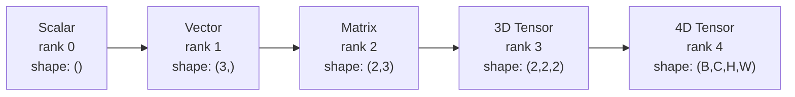
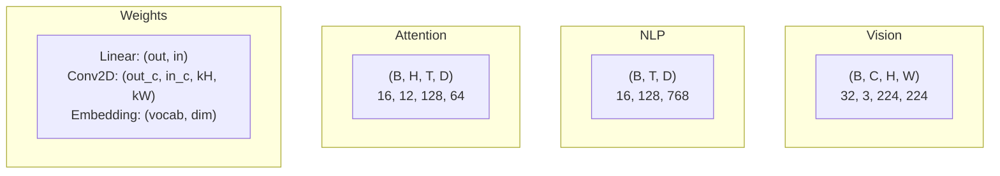
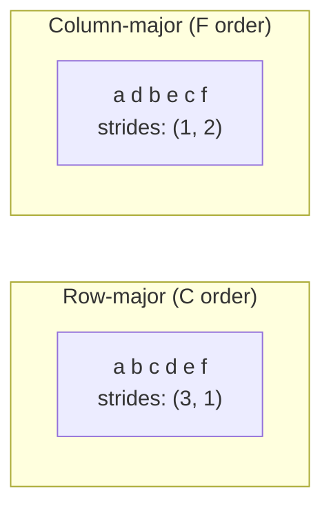
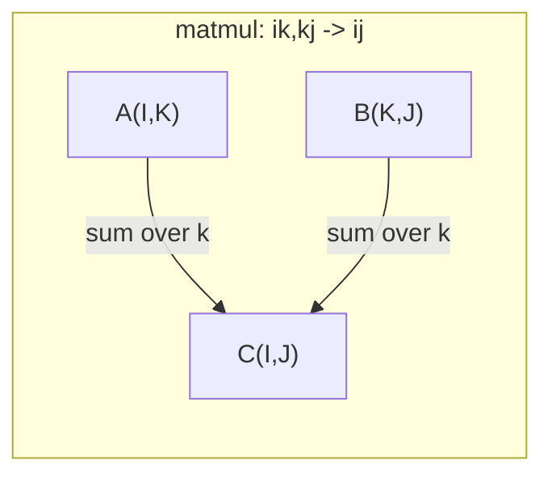
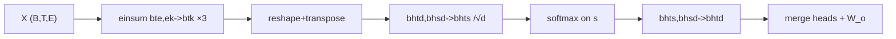

# Tensor Operations

> Tensors are the common language between data and deep learning. Every image, every sentence, every gradient flows through them.

**Type:** Build
**Language:** Python
**Prerequisites:** Phase 1, Lessons 01 (Linear Algebra Intuition), 02 (Vectors, Matrices & Operations)
**Time:** ~90 minutes

## Learning Objectives

- Implement a tensor class with shape, strides, reshape, transpose, and element-wise operations from scratch
- Apply broadcasting rules to operate on tensors of different shapes without copying data
- Write einsum expressions for dot products, matrix multiplications, outer products, and batched operations
- Trace the exact tensor shapes through every step of multi-head attention

## 中文补充说明

> 以下各节英文讲解之后附有与本课相关的中文问答深度补充（原 `docs/qa.md`）。实现参考：`code/tensors.py`（含 `demo_attention_einsum()`）。

## The Problem

You build a transformer. The forward pass looks clean. You run it and get: `RuntimeError: mat1 and mat2 shapes cannot be multiplied (32x768 and 512x768)`. You stare at the shapes. You try a transpose. Now it says `Expected 4D input (got 3D input)`. You add an unsqueeze. Something else breaks.

Shape errors are the most common bug in deep learning code. They are not hard conceptually -- each operation has a shape contract -- but they multiply fast. A transformer has dozens of reshapes, transposes, and broadcasts chained together. One wrong axis and the error cascades. Worse, some shape mistakes do not throw errors at all. They silently produce garbage by broadcasting along the wrong dimension or summing over the wrong axis.

Matrices handle pairwise relationships between two sets of things. Real data does not fit into two dimensions. A batch of 32 RGB images at 224x224 is a 4D tensor: `(32, 3, 224, 224)`. Self-attention with 12 heads is also 4D: `(batch, heads, seq_len, head_dim)`. You need a data structure that generalizes to any number of dimensions, with operations that compose cleanly across all of them. That structure is the tensor. Master its operations and shape errors become trivially debuggable.

## The Concept

### What a tensor is

A tensor is a multi-dimensional array of numbers with a uniform data type. The number of dimensions is the **rank** (or **order**). Each dimension is an **axis**. The **shape** is a tuple listing the size along each axis.



Total elements = product of all sizes. A shape `(2, 3, 4)` holds `2 * 3 * 4 = 24` elements.

#### 中文补充（问答）

##### 问答：张量的 rank 和矩阵的「秩」是一回事吗？

**问：** 上文写：张量是统一类型的多维数组；维数的个数叫 **rank**（或 **order**）；每一维是一条 **axis**；**shape** 是各轴长度的元组。这里的 rank 跟线性代数里矩阵的 **秩（matrix rank）** 是一回事吗？

**答：** **不是一回事。** 英文里都叫 *rank*，但来自两套习惯，含义完全不同。读深度学习文档时要靠上下文区分。

###### 1. 张量语境下的 rank（本课用法）

- **定义：** rank = **轴的个数** = **order** = 数组是几维的。
- **例子：**
  - 标量：rank **0**，shape `()`
  - 向量：rank **1**，shape `(3,)`
  - 矩阵（当作 2D 数组）：rank **2**，shape `(2, 3)`
  - 一批图像：rank **4**，shape `(B, C, H, W)`
- **与数据内容无关：** 只要仍是 `(2, 3)` 的二维表，张量 rank 就始终是 **2**，不会因为某一行是另一行的倍数而改变。

在 NumPy / PyTorch 里，这一概念通常叫 **`ndim`**（number of dimensions），而不是 `rank`：

```python
import numpy as np
A = np.array([[1, 2, 3], [2, 4, 6]])  # 第二行 = 2 × 第一行
A.ndim   # 2  →  张量 rank（二维）
```

###### 2. 线性代数里的 matrix rank（矩阵秩）

- **定义：** 矩阵 **A** 的秩 = 行（或列）向量组的 **极大线性无关组** 的大小 = 列空间（或行空间）的 **维数**。
- **等价刻画（本课程前面几课会用到）：** 非零奇异值的个数；或 **A** 可写成多少个 **秩-1 矩阵** 之和（见 Lesson 11 SVD）。
- **与「有几行几列」无直接对应：** `(2, 3)` 的矩阵，矩阵秩只能是 **1** 或 **2**，由 **元素数值** 决定。

上例中两行成比例 → **matrix rank = 1**，但 **tensor rank 仍是 2**。

```python
np.linalg.matrix_rank(A)  # 1  →  矩阵秩
```

###### 3. 对照表（避免混读）

| | 张量 rank（本课 / DL 常见） | 矩阵秩 matrix rank（线性代数） |
|---|---------------------------|--------------------------------|
| **问的是什么** | 有几个维度？ | 有多少个独立行/列方向？ |
| **典型记号** | rank、order、**ndim** | rank(**A**)、**rank(A)** |
| **2×3 矩阵** | 恒为 **2**（二维数组） | **1** 或 **2**（看是否行相关） |
| **API 线索** | `x.ndim`、`x.shape` 长度 | `numpy.linalg.matrix_rank`、`torch.linalg.matrix_rank` |

**Key Terms** 里写得很直白：矩阵作为张量时 **rank 2** 指的是 **两个轴**，**不是** 它的 matrix rank。

###### 4. 容易混淆的相邻概念

- **「低秩近似」「rank-k 分解」**（SVD、推荐里的 **P Q^T**）：这里的 **秩** 几乎都是 **matrix rank**（独立模式/潜因子有几个），不是「把数组从 4D 变成 3D」。
- **Einsum / 缩并（contraction）：** 对共享下标求和后，结果的 **张量 rank（维数）** 会下降；这与「矩阵秩」仍不是同一个量，只是英文里有时也说 *lower-rank result*（指 **少了一维**）。

###### 5. 记忆口诀

- **张量 rank：** 数 **轴** ——「这是几维数组？」
- **矩阵秩：** 数 **独立方向** ——「这些行/列里真正有几个不一样的方向？」

同一张 `(m, n)` 表：深度学习里先说它是 **2D 张量（rank 2）**；做 SVD 或最小二乘时再问它的 **matrix rank 是几**。

### Tensor shapes in deep learning

Different data types map to specific tensor shapes by convention.



PyTorch uses NCHW (channels-first). TensorFlow defaults to NHWC (channels-last). Mismatched layouts cause silent slowdowns or errors.

#### 中文补充（问答）

##### 问答：channels 是什么？

**问：** 上文写 PyTorch 用 NCHW（channels-first），TensorFlow 默认 NHWC（channels-last）。**channels** 是什么？

**答：** 在 **图像 / 视觉** 张量里，**channel（通道）** 指：**同一个空间位置 (h, w) 上，彼此平行、各记一种物理或语义属性的那一组数**。常见说法是「每个像素有几个分量」。

###### 1. RGB 彩色图：C = 3

一张 `224×224` 的彩色图，每个像素有 **3 个** 强度值：

- **R**（红）、**G**（绿）、**B**（蓝）

堆成 4D 批量张量时（课里的例子 `32, 3, 224, 224`）：

| 字母 | 含义 | 本例 |
|------|------|------|
| **N** (B) | batch，一批里几张图 | 32 |
| **C** | **channels**，每像素几种分量 | **3** |
| **H** | height，高（行数） | 224 |
| **W** | width，宽（列数） | 224 |

**C 轴上的下标** 就是在选「看 R 平面、G 平面还是 B 平面」——三个 **2D 切片**（各 `224×224`），在空间上对齐，叠在一起描述颜色。

灰度图通常 **C = 1**（只有一个亮度通道）。医学、遥感、多光谱图可以有 **C = 4、12、…**（例如 RGB + 近红外）。

###### 2. 和「一张 H×W 的矩阵」的区别

- 单通道灰度：可以想成 **一个** `H×W` 矩阵。
- 三通道 RGB：不是 `3×H×W` 的「矩阵秩」问题，而是 **3 张** `H×W` 的 **channel 平面**；模型（尤其卷积）往往对 **每个 channel 用同一套滤波器**，再在 **out_channels** 里混合——所以 Conv2d 权重形状是 `(out_c, in_c, kH, kW)`（见上文图）。

###### 3. NCHW vs NHWC：只是 channel 轴放在哪

**数值一样，轴顺序不同：**

- **NCHW（channels-first，PyTorch 常见）：** `(N, C, H, W)` — 先遍历 batch，再 channel，再逐行逐列。
- **NHWC（channels-last，TensorFlow 默认）：** `(N, H, W, C)` — 每个空间点 `(h,w)` 旁边紧挨着 **C 个** 分量（更像「像素结构」）。

若把 `(N,C,H,W)` 当成 `(N,H,W,C)` 用（或反过来），**shape 数字可能对不上、算子报错**；若勉强 `permute` 错了轴，可能 **不报错但极慢**（内存访问不连续，要隐式重排）——这就是课里说的 silent slowdowns。

###### 4. 和 NLP 张量对比（避免混用 H）

文本里常见 `(B, T, D)`：**没有 channel 轴**；**D** 是每个 token 的嵌入维度，不是「RGB 那种通道」。**Channel** 这个词主要在 **空间网格数据**（图、视频帧、部分 3D 体数据）里用；视频有时写成 `(N, C, T, H, W)`（时间再多一维）。

###### 5. 一句话

**Channels = 在每个 (h, w) 位置上，并行存放的多路信号（如 R/G/B）；C 就是这类路的条数。** NCHW / NHWC 只决定这 **C** 维写在 shape 的 **第 2 位** 还是 **最后一位**。

### How memory layout works

A 2D array in memory is a 1D sequence of bytes. **Strides** tell you how many elements to skip to move one step along each axis.



Transpose does not move data. It swaps the strides, making the tensor **non-contiguous** -- the elements for a row are no longer adjacent in memory.

#### 中文补充（问答）

##### 问答：Row-major / Column-major 与 strides 图在说什么？

**问：** 上文「How memory layout works」那张图（Row-major `a b c d e f`、Column-major `a d b e c f` 和 strides）怎么理解？

**答：** 逻辑上的 **2D 张量** 在计算机里只有 **一条连续的 1D 内存**。**行主序 / 列主序** 是「二维下标 `(i, j)` 映射到这条 1D 上谁先谁后」的两种约定；**strides** 则是「沿第 0 轴、第 1 轴各走一格，在 1D 里要跳过几个元素」。

下面默认同一张 **2 行 × 3 列** 的表（shape `(2, 3)`）：

```text
        列0  列1  列2
行0      a    b    c
行1      d    e    f
```

###### 1. Row-major（C order）— `a b c d e f`，strides `(3, 1)`

- **规则：** 先存满 **第 0 行**（`a, b, c`），再存 **第 1 行**（`d, e, f`）——按 **行** 扫。
- **内存：** `a b c d e f`
- **strides `(3, 1)` 的含义（对应 shape `(2, 3)`）：**
  - 沿 **轴 0（行）** 从 `(0,j)` 到 `(1,j)`：在内存里跨过 **整行 3 个元素** → stride **3**。
  - 沿 **轴 1（列）** 从 `(i,0)` 到 `(i,1)`：相邻列在同一行里紧挨着 → stride **1**。

**地址公式（从 0 开始）：** `index = i * 3 + j`（这里 3 就是「一行有几个元素」，即 shape 里最后一维的长度）。

NumPy 默认、PyTorch CPU 上常见的 contiguous 二维数组都是这种 **C / row-major**。

###### 2. Column-major（F order）— `a d b e c f`，strides `(1, 2)`

- **规则：** 先存 **第 0 列**（`a, d`），再 **第 1 列**（`b, e`），再 **第 2 列**（`c, f`）——按 **列** 扫。
- **内存：** `a d b e c f`（注意：和行主序 **元素顺序不同**，除非你再 `copy` 重排）
- **strides `(1, 2)` 的含义：**
  - 沿 **轴 0（行）** 在列内往下：`a → d` 只隔 **1** 个槽 → stride **1**。
  - 沿 **轴 1（列）** 换到下一列：`a → b` 要跳过中间的 `d`（一行高度）→ stride **2**。

**地址公式：** `index = j * 2 + i`（2 是行数；列主序里「列」在内存里是连续块）。

MATLAB、Fortran、旧版 LAPACK 习惯 **F / column-major**。同一份 `(2,3)` 数字，若用两种顺序各存一遍，**扁平序列字母顺序会不同**——这就是布局（layout）问题，不是数学上的矩阵变了。

###### 3. 为什么要记 strides？

程序 **很少** 真去手算下标；它保存 **shape + strides**，用：

`物理下标 = sum_k (逻辑下标_k × stride_k)`

这样 **transpose** 可以 **只交换 shape 和 strides，不搬数据**（课里的要点）：例如行主序 `(2,3)` 转置成 `(3,2)` 后，「逻辑上的一行」在内存里可能不再连续 → **non-contiguous**，后续 `view` / 某些算子可能失败或被迫 `contiguous()` 拷贝——和 NCHW/NHWC 搞混导致的变慢是同一类「内存访问不友好」问题。

###### 4. 和截图的对应关系

示意图里 **Column-major** 为 `a d b e c f`、strides `(1, 2)`；**Row-major** 为 `a b c d e f`、strides `(3, 1)`。与上文 mermaid **内容一致**，仅排版可能不同（左右或上下）。

###### 5. 一句话

- **Row-major：** 一行接一行塞进内存 → 同行相邻，stride 最后一维往往是 **1**。
- **Column-major：** 一列接一列塞进内存 → 同列相邻。
- **Strides：** 告诉你在 **1D 内存** 里怎么从 `(i,j)` 「走一格」；**同一逻辑张量，布局不同 → 序列不同 → stride 不同**。

### Broadcasting rules

Broadcasting lets you operate on tensors of different shapes without copying data. Align shapes from the right. Two dimensions are compatible when they are equal or one is 1. Fewer dimensions get padded with 1s on the left.

```
Tensor A:     (8, 1, 6, 1)
Tensor B:        (7, 1, 5)
Padded B:     (1, 7, 1, 5)
Result:       (8, 7, 6, 5)
```

### Einsum: the universal tensor operation

Einstein summation labels each axis with a letter. Axes in the input but not the output get summed. Axes in both are kept.



Key patterns: `i,i->` (dot product), `i,j->ij` (outer product), `ii->` (trace), `ij->ji` (transpose), `bij,bjk->bik` (batch matmul), `bhtd,bhsd->bhts` (attention scores).

#### 中文补充（问答）

##### 问答：Einstein summation 三句话规则怎么理解？

**问：** 上文写：Einstein summation **用字母标每条轴**；**只出现在输入、不出现在输出里的轴会被求和**；**输入和输出里都出现的轴会保留**。请详细解释。

**答：** **Einsum** 用一串 **下标字符串** 描述「取哪些张量的哪些轴、怎么乘、对哪些轴求和」，等价于写清一个多重循环 + 求和。NumPy / PyTorch 写法形如：

```python
np.einsum("下标1,下标2,...->输出下标", 张量1, 张量2, ...)
```

`->` 左边是 **每个输入张量自己的轴标签**（逗号分隔张量）；`->` 右边是 **结果张量** 要保留的轴标签及 **顺序**。

###### 1. 「每条轴用一个字母」是什么意思？

- 张量有几个轴，就在它的下标里写几个 **符号**（常用 `i,j,k` 或语义化 `b,t,d,h`）。
- **同一个字母** 出现在 **不同输入** 里 → 表示这两条轴 **长度必须相同**，且在运算时 **对齐**（像矩阵乘法里 **A 的列下标 = B 的行下标** 都叫 `k`）。
- 字母只是 **轴的占位名**，不强制 `i` 一定是行；**约定** 由你和 shape 一起定（例如 `ij` 常表示 `(行, 列)`）。

**例子：** `A` shape `(3, 4)` 标成 `ik` → 轴 0 长度 3 叫 `i`，轴 1 长度 4 叫 `k`。

###### 2. 「输入有、输出没有 → 求和」（缩并 / contraction）

设所有出现过的字母集合为 **I**。对 **不在** `->` 右侧输出里的字母 **p**：

- 在公式里，**p** 会作为 **求和下标** 出现一次（对 **p** 从 `0` 到 `size(p)-1` 累加）。
- 这就是 **缩并**：把沿 **p** 那一维「压扁」成标量累加进结果。

**矩阵乘** `ik,kj->ij`（课里 mermaid 的 `matmul`）：

- `A[i,k]`、`B[k,j]` 共享 **k**；输出只有 `i,j` → **对 k 求和**。
- 数学上：`C[i,j] = Σ_k A[i,k] * B[k,j]`。

**点积** `i,i->`（输出为空 → 0 维标量）：

- 两个向量都用 **i** → 对齐同一维；**i 不在输出** → `Σ_i a[i] * b[i]`。

**只在一个张量上出现、且不在输出的字母** 同样会被求和掉。例如若写成 `ij->i`（单输入），则对 **j** 求和，得到长度为 `i` 的向量（沿 j 求和）。

###### 3. 「输入和输出都有 → 保留」

- 出现在 `->` **右侧** 的字母 = **自由下标**：结果张量 **仍有这一维**，大小等于该轴长度。
- 输出里字母的 **先后顺序** = 结果 `shape` 的轴顺序（`ij` 与 `ji` 对应不同 transpose）。

**外积** `i,j->ij`：

- `a[i]`、`b[j]`，**没有重复字母** → **不求和**任何轴 → 结果 `ij`，即 `C[i,j] = a[i] * b[j]`。

**转置** `ij->ji`（单输入）：

- 没有消失的轴 → 不求和，只 **重排** 轴名 → 交换两维。

###### 4. 心智算法（实现 einsum 时就是这样干）

1. 解析 `->` 右侧得到 **输出下标列表** `out`。
2. 所有输入里出现过的字母中，**不在 `out` 里的** = **求和下标** `sum_axes`。
3. 对每个 **合法的** `out` 下标赋值（嵌套循环），令  
   `result[out] += ∏_输入 输入[该输入的下标赋值]`  
   其中求和下标在 `sum_axes` 上循环。

批矩阵乘 `bij,bjk->bik`：**b** 两输入都有且在输出 → batch 维保留；**j** 只在输入 → 对 j 求和；**i,k** 保留。

###### 5. 课里其它模式（对照上文）

| 下标 | 含义 |
|------|------|
| `i,i->` | 两向量点积，对 **i** 求和 |
| `i,j->ij` | 外积 |
| `ii->` | 方阵 **迹** trace（见下节「同张量重复字母」） |
| `ij->ji` | 转置 |
| `bij,bjk->bik` | 批矩阵乘 |
| `bhtd,bhsd->bhts` | 注意力分数：对 **d** 求和，保留 batch **b**、头 **h**、query 位置 **t**、key 位置 **s** |

注意力里 `Q` 为 `bhtd`、`K` 为 `bhsd`，共享 **b,h,d**；**t** 只在 Q、**s** 只在 K，输出 `bhts` →  
`scores[b,h,t,s] = Σ_d Q[b,h,t,d] * K[b,h,s,d]`（再除以 √d 是代码里另一步）。

###### 6. 同一张量上下标重复（进阶，但常考）

当 **同一个输入** 的下标里 **同一字母出现两次**（如 `ii`），NumPy einsum 表示 **只取对角线再参与后续规则**，不是「两个不同轴碰巧同名」：

- `ii->`：对角线元素再 **对 i 求和** → **trace**。
- `ii->i`：取对角线，得到长度 `n` 的向量（方阵时）。

这与 **两个不同输入** 各写一个 `i`（如 `i,i->`）不同：后者是 **两条轴对齐相乘再求和**。

###### 7. 和 Key Terms 里「Contraction」的关系

**Contraction（缩并）** = 对某个 **重复出现且不出现在输出** 的下标 **先乘再求和**。Einsum 用一行字符串统一表达：点积、matmul、批 matmul、注意力里的 `QK^T` 点积维，都是同一套规则。

###### 8. 三句话对照

| 原文 | 含义 |
|------|------|
| labels each axis with a letter | 每个轴一个符号；多输入间 **同名 = 同长且对齐** |
| input but not output → summed | **自由下标** 只在 `->` 右侧；其余一律 **Σ** |
| in both → kept | 输出下标决定结果 **有几维、顺序如何** |

**易错点：** 漏写 `->` 时 NumPy 有 **隐式** 规则（重复字母默认求和），初学建议 **始终写显式** `->ij` / `->`，和课里示例一致，可读且不易错。

##### 问答：外积 `i,j->ij` 和 `C[i,j] = a[i] b[j]` 是什么意思？

**问：** 外积 `i,j->ij`：没有重复字母 → 不求和 → `C[i,j] = a[i] b[j]`。这是什么意思？

**答：** 这是把 **两个向量**「所有组合」乘在一起，排成一张 **二维表（矩阵）**，**不对任何下标求和**。

###### 1. 两个输入各是什么？

```python
import numpy as np
a = np.array([2., 3.])      # shape (2,)，下标 i：i=0,1
b = np.array([10., 20., 30.]) # shape (3,)，下标 j：j=0,1,2

C = np.einsum("i,j->ij", a, b)
# C.shape == (2, 3)
```

- 第一个张量只有轴 **i**（长度 2）。
- 第二个张量只有轴 **j**（长度 3）。
- 输出要 **i** 和 **j** → 结果是 **2×3** 的矩阵。

###### 2. 「没有重复字母」为什么就「不求和」？

Einsum 规则：**只有**「在输入里出现、却 **不在** `->` 右边输出里」的字母才会被 **Σ 求和**。

这里出现的字母是 `i` 和 `j`：

- `i` 在输出 `ij` 里 → **保留**，不求和。
- `j` 也在输出里 → **保留**，不求和。

两个输入 **没有共用同一个字母**（不像 matmul 的 `ik,kj` 共用 `k`），所以 **没有任何缩并**，只是 **每个 (i,j) 各算一个数**。

###### 3. `C[i,j] = a[i] * b[j]` 在算什么？

对 **每一个** 行号 `i` 和 **每一个** 列号 `j`：

- 只用到 `a` 的第 `i` 个分量、和 `b` 的第 `j` 个分量；
- 结果格子 = **两者相乘**；
- **不**把别的 `i` 或 `j` 加进来。

上例数值：

| | j=0 (10) | j=1 (20) | j=2 (30) |
|---|----------|----------|----------|
| **i=0 (a=2)** | 2×10=**20** | 2×20=**40** | 2×30=**60** |
| **i=1 (a=3)** | 3×10=**30** | 3×20=**60** | 3×30=**90** |

```text
C = [[20, 40, 60],
     [30, 60, 90]]
```

直观：**第 i 行**整行都是 `a[i]` 乘上 `b` 的每个元素；**第 j 列**整列都是 `a` 的每个元素乘上 `b[j]`。这就是 **外积（outer product）**；线性代数里常写成 **a ⊗ b** 或 **`a[:, None] * b[None, :]`**（广播写法）。

###### 4. 和点积对比（帮助记）

| 下标 | 共享字母？ | 求和？ | 结果 |
|------|------------|--------|------|
| `i,i->` | 有 **i** | 对 **i** 求和 | **标量**（一条数） |
| `i,j->ij` | **无** | 不求和 | **矩阵**（所有 i×j 组合） |

点积是「同一维对齐，乘完 **加** 成一条数」；外积是「两维 **叉开**，乘完 **铺** 成一张表」。

###### 5. 和 SVD 课里「秩-1 矩阵」的关系（可选联系）

若 **a** 是列向量、**b** 是行向量，外积 **`a b^T`**（或 einsum `i,j->ij`）得到秩最多为 1 的矩阵：每一行是 `a[i]` 乘 **同一行图案** `b`。SVD 里每一项 **`σ_i u_i v_i^T`** 就是这种结构（见 Lesson 11）。

## Build It

The code lives in `code/tensors.py`. Each step references the implementation there.

### Step 1: Tensor storage and strides

A tensor stores a flat list of numbers plus shape metadata. Strides tell the indexing logic how to map multi-dimensional indices to flat positions.

```python
class Tensor:
    def __init__(self, data, shape=None):
        if isinstance(data, (list, tuple)):
            self._data, self._shape = self._flatten_nested(data)
        elif isinstance(data, np.ndarray):
            self._data = data.flatten().tolist()
            self._shape = tuple(data.shape)
        else:
            self._data = [data]
            self._shape = ()

        if shape is not None:
            total = reduce(lambda a, b: a * b, shape, 1)
            if total != len(self._data):
                raise ValueError(
                    f"Cannot reshape {len(self._data)} elements into shape {shape}"
                )
            self._shape = tuple(shape)

        self._strides = self._compute_strides(self._shape)

    @staticmethod
    def _compute_strides(shape):
        if len(shape) == 0:
            return ()
        strides = [1] * len(shape)
        for i in range(len(shape) - 2, -1, -1):
            strides[i] = strides[i + 1] * shape[i + 1]
        return tuple(strides)
```

For shape `(3, 4)`, strides are `(4, 1)` -- skip 4 elements to advance one row, skip 1 element to advance one column.

### Step 2: Reshape, squeeze, unsqueeze

Reshape changes the shape without changing element order. The total number of elements must stay the same. Use `-1` for one dimension to infer its size.

```python
t = Tensor(list(range(12)), shape=(2, 6))
r = t.reshape((3, 4))
r = t.reshape((-1, 3))
```

Squeeze removes axes of size 1. Unsqueeze inserts one. Unsqueezing is critical for broadcasting -- a bias vector `(D,)` added to a batch `(B, T, D)` needs unsqueezing to `(1, 1, D)`.

```python
t = Tensor(list(range(6)), shape=(1, 3, 1, 2))
s = t.squeeze()
v = Tensor([1, 2, 3])
u = v.unsqueeze(0)
```

### Step 3: Transpose and permute

Transpose swaps two axes. Permute reorders all axes. This is how you convert between NCHW and NHWC.

```python
mat = Tensor(list(range(6)), shape=(2, 3))
tr = mat.transpose(0, 1)

t4d = Tensor(list(range(24)), shape=(1, 2, 3, 4))
perm = t4d.permute((0, 2, 3, 1))
```

After transpose or permute, the tensor is non-contiguous in memory. In PyTorch, `view` fails on non-contiguous tensors -- use `reshape` or call `.contiguous()` first.

### Step 4: Element-wise operations and reductions

Element-wise ops (add, multiply, subtract) apply independently to each element and preserve shape. Reductions (sum, mean, max) collapse one or more axes.

```python
a = Tensor([[1, 2], [3, 4]])
b = Tensor([[10, 20], [30, 40]])
c = a + b
d = a * 2
s = a.sum(axis=0)
```

Global average pooling in a CNN: `(B, C, H, W).mean(axis=[2, 3])` produces `(B, C)`. Sequence mean pooling in NLP: `(B, T, D).mean(axis=1)` produces `(B, D)`.

#### 中文补充（问答）

##### 问答：CNN 的 Global average pooling 与 NLP 的 sequence mean pooling

**问：** 上文写：CNN 里 `(B, C, H, W).mean(axis=[2, 3])` 得到 `(B, C)`；NLP 里 `(B, T, D).mean(axis=1)` 得到 `(B, D)`。请解释。

**答：** 两者都是 **沿「可变长度那一块」做平均（reduction）**，把很多位置压成 **每个通道/每个特征维一个数**，从而得到 **固定长度** 的向量表示；差别只是 **数据是 2D 空间网格还是 1D 序列**，以及 **对哪几条轴求平均**。

###### 1. `.mean(axis=...)` 在做什么？

对指定 **轴** 上的所有元素 **求平均**，算完后 **这些轴从 shape 里消失**（除非 `keepdims=True`）。

- 未指定的轴：**原样保留**，只是长度变短。
- 同一组 `(b, c, h, w)` 或 `(b, t, d)` 里，**只在被平均的轴上** 把多个数合成一个数；**batch 维 B** 和 **特征/channel 维 C 或 D** 通常 **不** 参与这次平均，所以每张图、每个 channel 各得一个标量（CNN），或每个句子、每个维度各保留（NLP 是对 T 平均，D 保留）。

NumPy / PyTorch 轴编号从 **0** 开始。

###### 2. 视觉：`(B, C, H, W)` → `mean(axis=[2, 3])` → `(B, C)`

| 轴 | 名字 | 含义 |
|----|------|------|
| 0 | B | batch，几张图 |
| 1 | C | channel，每个空间点的特征种类数 |
| 2 | H | 高 |
| 3 | W | 宽 |

卷积层输出后，每个 channel 是一张 **H×W** 的 **特征图**（activation map）。  
**Global average pooling（全局平均池化）** = 对 **整张特征图** 上所有 `(h, w)` 位置取平均：

\[
\text{out}[b, c] = \frac{1}{H \cdot W} \sum_{h=0}^{H-1} \sum_{w=0}^{W-1} X[b, c, h, w]
\]

- **消掉的是轴 2、3（H、W）** → 剩下 `(B, C)`。
- 直觉：**每个 channel 用一个数概括「全图在这个滤波器上的平均响应」**，不再保留空间位置；常用于分类头前，替代把特征图拉平成大向量，参数更少、对平移更稳。

**小例子：** `B=1, C=2, H=2, W=2`，channel 0 四个格子是 `[1,2,3,4]` → 均值 `(1+2+3+4)/4 = 2.5`；channel 1 同理各出一个数 → 得到长度 2 的向量。

###### 3. NLP：`(B, T, D)` → `mean(axis=1)` → `(B, D)`

| 轴 | 名字 | 含义 |
|----|------|------|
| 0 | B | batch，几个句子/序列 |
| 1 | T | time / tokens，序列长度（可 padding，可变） |
| 2 | D | 每个 token 的嵌入维度 |

**Sequence mean pooling** = 对 **所有 token 位置** 在轴 **1（T）** 上取平均：

\[
\text{out}[b, d] = \frac{1}{T} \sum_{t=0}^{T-1} X[b, t, d]
\]

- **消掉的是轴 1（T）** → 剩下 `(B, D)`。
- 直觉：把整句 **所有词的向量逐维平均**，得到 **一句一个** 的句子向量（简单基线；实践中常用 `[CLS]`、最后一个 token、或带 mask 的 mean，避免 padding 拉偏）。

**小例子：** 一句 3 个 token，每个是 2 维：`[[1,0], [3,0], [5,0]]` → 句子向量 `[(1+3+5)/3, 0] = [3, 0]`。

###### 4. 同一模式，不同「网格」

| | 输入 | 平均哪几轴 | 输出 | 压掉的是什么 |
|---|------|------------|------|----------------|
| CNN GAP | `(B,C,H,W)` | **2, 3**（H,W） | `(B,C)` | **空间** 位置 |
| NLP mean | `(B,T,D)` | **1**（T） | `(B,D)` | **时间/词** 位置 |

共同点：

- 保留 **batch B**；
- 保留 **「每个特征种类」那一维**（C 或 D）；
- 把 **「很多位置」** 合成 **每个特征维一个标量**（对 CNN 是每个 channel 一个数；对 NLP 是每个嵌入维在整句上的平均）。

###### 5. 和 einsum / 缩并的类比（可选）

- GAP 等价于对每个 `(b,c)` 在 `h,w` 上求平均，可写成对 `h,w` 的缩并（先求和再除以 `H*W`）。
- 句向量 mean 等价于对每个 `(b,d)` 在 `t` 上求平均。

都是 **reduction**：指定轴消失，用聚合统计（这里是 mean）代表原来那一整维的信息。

###### 6. 实践注意

- **Padding：** NLP 若对含 padding 的序列直接 `mean(axis=1)`，padding 位置会参与平均；生产里常用 **mask** 只对真实 token 平均。
- **keepdims：** `mean(axis=1, keepdims=True)` 得到 `(B,1,D)`，便于和 `(B,T,D)` 广播相加（例如某些池化后接层）。
- PyTorch：`x.mean(dim=(2,3))` 与 NumPy `axis=[2,3]` 同类；NLP 常用 `dim=1`。

##### 问答：GAP 之后 `(B,C)` 能当成 `(B,C,1)` 吗？

**问：** H、W 没了剩下 `(B,C)`，可以理解成变成了 `(B,C,1)` 吗？

**答：** **概念上可以** 想成「空间缩成 1×1」；**默认的 `.mean(axis=[2,3])` 在 API 上并不是 `(B,C,1)`**，而是 **真·二维** `(B,C)`。在 **NCHW** 里更贴切的说法是 **`(B,C,1,1)`**，不是 `(B,C,1)`。

###### 1. 默认 `mean`：轴被删掉，不是变成长度 1

```python
import numpy as np
x = np.zeros((2, 3, 4, 5))  # B,C,H,W
y = x.mean(axis=(2, 3))
y.shape   # (2, 3)  →  (B, C)，没有第 3 维
```

- **`(B,C)`**：rank = **2**，只有 batch 和 channel。
- **`(B,C,1)`**：rank = **3**，还多一条「长度为 1」的轴。

对框架的 **shape 检查、Conv2d 输入、广播** 来说，**(B,C) ≠ (B,C,1)**，除非你自己 `reshape` / `unsqueeze`。

###### 2. 若想「保留被平均的轴，长度为 1」：用 `keepdims`

```python
y = x.mean(axis=(2, 3), keepdims=True)
y.shape   # (2, 3, 1, 1)  →  (B, C, 1, 1)
```

这才对应直觉：**每张特征图从 H×W 变成 1×1**，channel 数不变。  
在 4D 视觉张量里应是 **`(B,C,1,1)`**；`(B,C,1)` 少了一维（没有 W 那条轴），和 NCHW 的四维习惯对不上。

###### 3. 什么时候可以「当成」1×1？

| 说法 | 是否成立 |
|------|----------|
| 语义：每个 channel 只剩 **一个空间位置** 的数 | ✅ 对 |
| 和 `(B,C,1,1)` 数值相同（每格都是那个均值） | ✅ 对（用 `keepdims` 或 `reshape`） |
| 默认 `mean` 的 **shape 就是 `(B,C,1)`** | ❌ 不对，是 `(B,C)` |
| `(B,C,1)` 与 `(B,C)` 在 matmul/conv 里可互换 | ❌ 一般不互换，要显式扩维 |

需要接 **还要求 4D 输入的 Conv2d** 时，有人会 `y = y[:, :, None, None]` 或 `keepdims=True` 得到 `(B,C,1,1)`，再用 `1×1` 卷积当全连接。

###### 4. 和 NLP `(B,D)` 的平行说法

`(B,T,D).mean(axis=1)` → `(B,D)`，也不是 `(B,1,D)`；要带「序列维还在、只是长度为 1」时用 `keepdims=True` → **`(B,1,D)`**（便于广播）。

###### 5. 一句话

- **默认 GAP：** `(B,C,H,W)` → **`(B,C)`**（H、W **消失**）。  
- **直觉「缩成一点」：** 写成 **`(B,C,1,1)`** 更准确；用 **`keepdims=True`** 或 **`reshape(B, C, 1, 1)`**。  
- **`(B,C,1)`** 是 **三维**，和课里的四维 NCHW 差一维，别和 `(B,C,1,1)` 混用。

### Step 5: Broadcasting with NumPy

The `demo_broadcasting_numpy()` function in `tensors.py` shows the core patterns.

```python
activations = np.random.randn(4, 3)
bias = np.array([0.1, 0.2, 0.3])
result = activations + bias

images = np.random.randn(2, 3, 4, 4)
scale = np.array([0.5, 1.0, 1.5]).reshape(1, 3, 1, 1)
result = images * scale

a = np.array([1, 2, 3]).reshape(-1, 1)
b = np.array([10, 20, 30, 40]).reshape(1, -1)
outer = a * b
```

Pairwise distance via broadcasting: reshape `(M, 2)` to `(M, 1, 2)` and `(N, 2)` to `(1, N, 2)`, subtract, square, sum along last axis, take square root. Result: `(M, N)`.

### Step 6: Einsum operations

The `demo_einsum()` and `demo_einsum_gallery()` functions walk through every common pattern.

```python
a = np.array([1.0, 2.0, 3.0])
b = np.array([4.0, 5.0, 6.0])
dot = np.einsum("i,i->", a, b)

A = np.array([[1, 2], [3, 4], [5, 6]], dtype=float)
B = np.array([[7, 8, 9], [10, 11, 12]], dtype=float)
matmul = np.einsum("ik,kj->ij", A, B)

batch_A = np.random.randn(4, 3, 5)
batch_B = np.random.randn(4, 5, 2)
batch_mm = np.einsum("bij,bjk->bik", batch_A, batch_B)
```

The computational cost of a contraction is the product of all index sizes (kept and summed). For `bij,bjk->bik` with B=32, I=128, J=64, K=128: `32 * 128 * 64 * 128 = 33,554,432` multiply-adds.

### Step 7: Attention mechanism via einsum

The `demo_attention_einsum()` function implements multi-head attention end to end.

```python
B, H, T, D = 2, 4, 8, 16
E = H * D

X = np.random.randn(B, T, E)
W_q = np.random.randn(E, E) * 0.02

Q = np.einsum("bte,ek->btk", X, W_q)
Q = Q.reshape(B, T, H, D).transpose(0, 2, 1, 3)

scores = np.einsum("bhtd,bhsd->bhts", Q, K) / np.sqrt(D)
weights = softmax(scores, axis=-1)
attn_output = np.einsum("bhts,bhsd->bhtd", weights, V)

concat = attn_output.transpose(0, 2, 1, 3).reshape(B, T, E)
output = np.einsum("bte,ek->btk", concat, W_o)
```

Every step is a tensor operation: projection (matmul via einsum), head splitting (reshape + transpose), attention scores (batch matmul via einsum), weighted sum (batch matmul via einsum), head merging (transpose + reshape), output projection (matmul via einsum).

## Use It

### Scratch vs NumPy

| Operation | Scratch (Tensor class) | NumPy |
|---|---|---|
| Create | `Tensor([[1,2],[3,4]])` | `np.array([[1,2],[3,4]])` |
| Reshape | `t.reshape((3,4))` | `a.reshape(3,4)` |
| Transpose | `t.transpose(0,1)` | `a.T` or `a.transpose(0,1)` |
| Squeeze | `t.squeeze(0)` | `np.squeeze(a, 0)` |
| Sum | `t.sum(axis=0)` | `a.sum(axis=0)` |
| Einsum | N/A | `np.einsum("ij,jk->ik", a, b)` |

### Scratch vs PyTorch

```python
import torch

t = torch.tensor([[1, 2, 3], [4, 5, 6]], dtype=torch.float32)
t.shape
t.stride()
t.is_contiguous()

t.reshape(3, 2)
t.unsqueeze(0)
t.transpose(0, 1)
t.transpose(0, 1).contiguous()

torch.einsum("ik,kj->ij", A, B)
```

PyTorch adds autograd, GPU support, and optimized BLAS kernels. The shape semantics are identical. If you understand the scratch version, PyTorch shape errors become readable.

### Every neural network layer as a tensor operation

| Operation | Tensor Form | Einsum |
|---|---|---|
| Linear layer | `Y = X @ W.T + b` | `"bd,od->bo"` + bias |
| Attention QKV | `Q = X @ W_q` | `"btd,dh->bth"` |
| Attention scores | `Q @ K.T / sqrt(d)` | `"bhtd,bhsd->bhts"` |
| Attention output | `softmax(scores) @ V` | `"bhts,bhsd->bhtd"` |
| Batch norm | `(X - mu) / sigma * gamma` | element-wise + broadcast |
| Softmax | `exp(x) / sum(exp(x))` | element-wise + reduction |

#### 中文补充（问答）

##### 问答：「Every neural network layer as a tensor operation」表逐行解释

**问：** 上表（Linear、Attention QKV/scores/output、Batch norm、Softmax）的 **Tensor Form** 和 **Einsum** 分别是什么意思？

**答：** 这张表把常见层写成 **shape 契约**：每个字母是一条轴的占位符；**能写成 einsum 的** 就是「对哪个字母求和（缩并）」；**写不了的** 用逐元素 + 广播 + 沿轴聚合说明。实现细节见 `code/tensors.py` 的 `demo_attention_einsum()`。

###### 字母约定（读表前先记）

| 字母 | 常见含义 |
|------|----------|
| **b** | batch |
| **t** | 序列位置（query 侧，time / token index） |
| **s** | 序列位置（key 侧，与 **t** 做注意力配对） |
| **d** | 特征维 / 输入维 / **每个头的 head_dim**（同一字母在不同行含义略不同，看 shape） |
| **o** | linear 的 **输出特征数**（out_features） |
| **h** | **注意力头** index（head），不是「高度 H」 |
| **e** | 嵌入维 embed_dim（`tensors.py` 里用大写 **E**） |

同一字母在 **不同输入** 里出现 → 该轴 **等长且对齐**；**只出现在输入、不在 `->` 右侧** → **对该轴求和**（见前文 einsum 问答）。

###### 1. Linear layer — `Y = X @ W.T + b`，`"bd,od->bo"` + bias

**张量形态（批处理、无序列）：**

- `X`：`(B, D_in)`，下标 **bd**（b=batch，d=输入维）。
- PyTorch `nn.Linear` 的权重 `W` 存成 **`(D_out, D_in)`**，代码里用 **`W.T`** 参与乘法，等价于对每个输出神经元做内积。
- `Y`：`(B, D_out)`，下标 **bo**。
- `b`（bias）：长度 **`D_out`** 的向量，**广播** 到每个 batch 行：`Y[b,o] += b[o]`。

**Einsum：**

```text
bd,od->bo   ⇒   Y[b,o] = Σ_d X[b,d] · W[o,d]
```

这正是 **`X @ W.T`**（`W` 形状 `(O,D)`）。若权重存成 `(D,O)`，下标会写成 `bd,do->bo`。

**带序列的 NLP 线性层**（与注意力第一步相同模式）：`X` 为 `(B,T,E)` → **`bte,ek->btk`**（`tensors.py` 里 `W_q` 等），只是在 **t** 维上每个 token 独立做同一个线性变换。

###### 2. Attention QKV — `Q = X @ W_q`，`"btd,dh->bth"`

**在算什么：** 把每个 token 的嵌入向量，用矩阵 **`W_q`** 投影到 Query 空间（K、V 同理，各自一套权重）。

- `X`：**btd** → `(B, T, D_embed)`。
- `W_q`：**dh** → `(D_embed, H_proj)`；表里用 **h** 表示投影后的最后一维（可与「头」相关；完整实现里常先投影到 **E = num_heads × head_dim**，再 reshape）。

**Einsum：**

```text
btd,dh->bth   ⇒   Q[b,t,h] = Σ_d X[b,t,d] · W_q[d,h]
```

对 **d** 求和 → 矩阵乘在「嵌入维」上缩并；**b、t、h** 都保留。

**与 `tensors.py` 的对应：** 代码写 **`bte,ek->btk`**（E=embed），三者 Q/K/V 各做一次；然后

```python
.reshape(B, T, H, D).transpose(0, 2, 1, 3)   # → (B, H, T, D_head)
```

才得到表里后面用的 **`bhtd`**（batch、**头**、token、每头维度）。**表里的 QKV 行 = 投影；拆头 = reshape + transpose（表外一步，但 shape 必做）。**

###### 3. Attention scores — `Q @ K.T / sqrt(d)`，`"bhtd,bhsd->bhts"`

**在算什么：** 对每个 batch、每个头、每个 query 位置 **t**，和所有 key 位置 **s** 算 **点积相似度**（再除以 √d 稳定数值）。

- `Q`：**bhtd** → `(B, H, T, D_head)`
- `K`：**bhsd** → `(B, H, S, D_head)`（通常 **S = T**，self-attention）

**Einsum：**

```text
bhtd,bhsd->bhts
⇒ scores[b,h,t,s] = Σ_d Q[b,h,t,d] · K[b,h,s,d]
```

- **d** 在两个输入里都有，**不在输出** → 对 **d** 求和 = 在 head 维上做 **点积**。
- **t** 只在 Q，**s** 只在 K → 输出 **所有 (t,s) 配对** 的分数矩阵（每个头一张 `T×S`）。
- 代码再 **`/ sqrt(D)`**（`D` = head_dim），对应公式里的 **`/ sqrt(d)`**。

等价于：对每个 `(b,h)`，矩阵 **`Q[b,h]`**（形状 `T×D`）乘 **`K[b,h]^T`**（`D×S`）→ **`T×S`**。

###### 4. Attention output — `softmax(scores) @ V`，`"bhts,bhsd->bhtd"`

**两步：**

1. **Softmax** 在 **s** 轴（最后一维 key）：`weights[b,h,t,s] = softmax(scores[b,h,t,:])`，每行和为 1。
2. **用权重对 V 加权求和**（einsum 只写第二步）：

```text
bhts,bhsd->bhtd
⇒ out[b,h,t,d] = Σ_s weights[b,h,t,s] · V[b,h,s,d]
```

- **s** 被求和 → 「每个 query 位置 **t** 从所有 key 位置 **s** 收集信息」。
- 输出仍是每个头的 **`(T, D_head)`**，即 **bhtd**。

之后课里还会 **拼头** `transpose + reshape` → `(B,T,E)`，再 **`bte,ek->btk`** 过 **`W_o`**（输出投影），表未单独列行。

###### 5. Batch norm — `(X - mu) / sigma * gamma`，element-wise + broadcast

**为何没写 einsum：** 没有「跨张量共享下标求和」的缩并，全是 **同一 shape 规则下的逐元素运算** + **广播**。

典型（NLP 最后一维是特征）：`X` 为 `(B, T, D)` 或 `(B, D)`：

- 在 **batch（及序列）上统计**，得到每个特征维一个 **`mu[d]`、`sigma[d]`**（训练时用 batch 统计；推理用滑动平均）。
- **`gamma[d]`、`beta[d]`**（可学习），shape 常为 **`(D,)`** 或 **`(1,1,D)`**。
- 计算：`(X - mu) / sqrt(sigma^2 + eps) * gamma + beta`，**mu/sigma/gamma** 沿 batch、T **广播** 到与 `X` 相同 shape。

CNN 里常对 `(B,C,H,W)` 在 **B,H,W** 上算均值方差，得到 **`(C,)`** 的 `mu, gamma`，再广播到整张特征图——仍是 **element-wise + broadcast**，不是 matmul。

###### 6. Softmax — `exp(x) / sum(exp(x))`，element-wise + reduction

**在算什么：** 把某一轴上的数变成 **非负且和为 1** 的概率分布。

- **逐元素：** `exp`（实现里常先 `x - max(x)` 防溢出）。
- **聚合（reduction）：** 在指定 **axis** 上对 `exp(x)` **求和**，再 **广播** 回去做除法。

注意力里：`softmax(scores, axis=-1)`，**axis = s**（key 维），对每个 `(b,h,t)` 一行做 softmax。

**不能写成单行 einsum** 的原因：softmax = **非线性** + **先 exp 再按轴归一化**；einsum 表达的是 **线性** 的乘加缩并。表用「element-wise + reduction」提醒：**看清沿哪条轴 sum**。

###### 7. 总览：数据在 self-attention 里怎么流（与表 + 代码一致）



| 表行 | 输入 shape（典型） | 输出 shape | 核心操作 |
|------|-------------------|------------|----------|
| Linear | `(B,D)` | `(B,O)` | 对 **d** 缩并 |
| QKV | `(B,T,D)` | `(B,T,H)` 或 `(B,T,E)` | 对嵌入 **d** 缩并 |
| Scores | Q,K `(B,H,T,D)` | `(B,H,T,S)` | 对 **d** 点积，保留 **t,s** |
| Attn out | W,V | `(B,H,T,D)` | 对 **s** 加权求和 |
| Batch norm | 与 `X` 同秩 | 同 shape | 广播统计量 |
| Softmax | 任意 | 同 shape | 沿一轴 exp+归一化 |

###### 8. 易错点

1. **字母 h：** 在 **bhtd** 里是 **head 编号**；在 **btd,dh->bth** 里可能是 **投影维**，读完一行要对着 **shape 元组** 想，不要和 CNN 的 height **H** 混了。
2. **Linear 的 W：** PyTorch 是 **`(out, in)`**，公式 **`@ W.T`** 与 **`bd,od->bo`** 一致。
3. **表省略的步骤：** QKV 后的 **拆头**、最后的 **`W_o`**、scores 的 **scale**、BN 的 **beta/eps**，仍在真实网络里，只是表只抓主运算。

## Ship It

This lesson produces two reusable prompts:

1. **`outputs/prompt-tensor-shapes.md`** -- A systematic prompt for debugging tensor shape mismatches. Includes decision tables for every common operation (matmul, broadcast, cat, Linear, Conv2d, BatchNorm, softmax) and a fix lookup table.

2. **`outputs/prompt-tensor-debugger.md`** -- A step-by-step debugging prompt you paste into any AI assistant when a shape error is blocking you. Feed it the error message and your tensor shapes, get back the exact fix.

## Exercises

1. **Easy -- Reshape round-trip.** Take a tensor of shape `(2, 3, 4)`. Reshape it to `(6, 4)`, then to `(24,)`, then back to `(2, 3, 4)`. Verify element order is preserved at each step by printing the flat data.

2. **Medium -- Implement broadcasting.** Extend the `Tensor` class with a `broadcast_to(shape)` method that expands dimensions of size 1 to match a target shape. Then modify `_elementwise_op` to automatically broadcast before operating. Test with shapes `(3, 1)` and `(1, 4)` producing `(3, 4)`.

3. **Hard -- Build einsum from scratch.** Implement a basic `einsum(subscripts, *tensors)` function that handles at least: dot product (`i,i->`), matrix multiply (`ij,jk->ik`), outer product (`i,j->ij`), and transpose (`ij->ji`). Parse the subscript string, identify contracted indices, and loop over all index combinations. Compare your results against `np.einsum`.

4. **Hard -- Attention shape tracker.** Write a function that takes `batch_size`, `seq_len`, `embed_dim`, and `num_heads` as inputs and prints the exact shape at every step of multi-head attention: input, Q/K/V projection, head split, attention scores, softmax weights, weighted sum, head merge, output projection. Verify against the `demo_attention_einsum()` output.

## Key Terms

| Term | What people say | What it actually means |
|---|---|---|
| Tensor | "A matrix but more dimensions" | A multi-dimensional array with uniform type and defined shape, strides, and operations |
| Rank | "The number of dimensions" | The number of axes. A matrix has rank 2, not rank equal to its matrix rank |
| Shape | "The size of the tensor" | A tuple listing the size along each axis. `(2, 3)` means 2 rows, 3 columns |
| Stride | "How memory is laid out" | The number of elements to skip to advance one position along each axis |
| Broadcasting | "It just works when shapes differ" | A strict set of rules: align from right, dimensions must be equal or one must be 1 |
| Contiguous | "The tensor is normal" | Elements stored sequentially in memory with no gaps or reordering from the logical layout |
| Einsum | "A fancy way to write matmul" | A general notation that expresses any tensor contraction, outer product, trace, or transpose in one line |
| View | "Same as reshape" | A tensor sharing the same memory buffer but with different shape/stride metadata. Fails on non-contiguous data |
| Contraction | "Summing over an index" | The general operation where a shared index between tensors is multiplied and summed, producing a lower-rank result |
| NCHW / NHWC | "PyTorch vs TensorFlow format" | Memory layout conventions for image tensors. NCHW puts channels before spatial dims, NHWC puts them after |

## Further Reading

- [NumPy Broadcasting](https://numpy.org/doc/stable/user/basics.broadcasting.html) -- The canonical rules with visual examples
- [PyTorch Tensor Views](https://pytorch.org/docs/stable/tensor_view.html) -- When views work and when they copy
- [einops](https://github.com/arogozhnikov/einops) -- A library that makes tensor reshaping readable and safe
- [The Illustrated Transformer](https://jalammar.github.io/illustrated-transformer/) -- Visualizes the tensor shapes flowing through attention
- [Einstein Summation in NumPy](https://numpy.org/doc/stable/reference/generated/numpy.einsum.html) -- Full einsum documentation with examples
