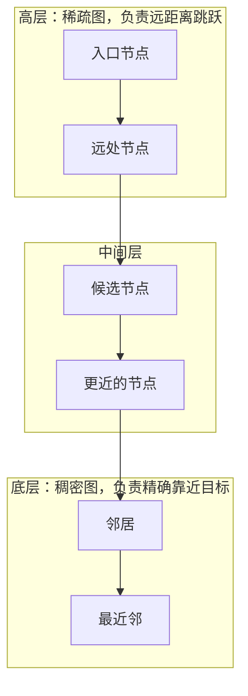

# Norms and Distances

> Your distance function defines what "similar" means. Choose wrong and everything downstream breaks.

**Type:** Build
**Language:** Python
**Prerequisites:** Phase 1, Lessons 01 (Linear Algebra Intuition), 02 (Vectors, Matrices & Operations)
**Time:** ~90 minutes

## Learning Objectives

- Implement L1, L2, cosine, Mahalanobis, Jaccard, and edit distance functions from scratch
- Select the appropriate distance metric for a given ML task and explain why alternatives fail
- Connect L1 and L2 norms to LASSO and Ridge regularization and their geometric constraint regions
- Demonstrate how the same dataset produces different nearest neighbors under different metrics

## The Problem

You have two vectors. Maybe they are word embeddings. Maybe they are user profiles. Maybe they are pixel arrays. You need to know: how close are they?

The answer depends entirely on which distance function you pick. Two data points can be nearest neighbors under one metric and far apart under another. Your KNN classifier, your recommendation engine, your vector database, your clustering algorithm, your loss function -- they all depend on this choice. Get it wrong and your model optimizes for the wrong thing.

There is no universal best distance. L2 works for spatial data. Cosine similarity dominates NLP. Jaccard handles sets. Edit distance handles strings. Mahalanobis accounts for correlations. Wasserstein moves probability mass. Each one encodes a different assumption about what "similar" means.

This lesson builds every major distance function from scratch, shows you when each one is the right tool, and demonstrates how the same data produces completely different nearest neighbors depending on which metric you use.

## The Concept

### Norms: measuring vector magnitude

A norm measures the "size" of a vector. Every distance function between two vectors can be written as the norm of their difference: d(a, b) = ||a - b||. So understanding norms is understanding distances.

#### 问：什么是三角不等式？

三角不等式（triangle inequality）表达的是一个日常直觉：两点之间直线最短，绕路不会更短。

对任意三个点 A、B、C，从 A 直接走到 C 的距离，不会超过先从 A 走到 B、再从 B 走到 C 的总距离。

```text
d(A, C) <= d(A, B) + d(B, C)

例：d(A, B) = 3, d(B, C) = 4
    则 d(A, C) <= 3 + 4 = 7
```

**标量形式**

对普通数字，三角不等式写成绝对值的形式。

```text
|a + b| <= |a| + |b|

例：a = 3, b = -2
    左边 = |3 + (-2)| = |1| = 1
    右边 = |3| + |-2| = 3 + 2 = 5
    所以 1 <= 5
```

这里左边远小于右边，原因是 3 和 -2 方向相反，相加时部分抵消了。同向时才会顶到上界。

**向量形式**

对向量，把绝对值换成范数（norm）。

```text
||u + v|| <= ||u|| + ||v||
```

三项的几何含义分别是：`||u||` 是第一段移动的距离，`||v||` 是第二段移动的距离，`||u + v||` 是从起点直接到终点的距离。

```text
例：u = (3, 0), v = (0, 4)

||u|| = 3
||v|| = 4
u + v = (3, 4)
||u + v|| = sqrt(9 + 16) = 5

5 <= 3 + 4 = 7
```

**欧氏范数下的证明**

在欧氏范数（Euclidean norm，即 L2 范数）下，可以从点积展开出发。

```text
||u + v||^2 = (u + v) . (u + v)
            = u.u + 2 (u.v) + v.v
            = ||u||^2 + 2 (u.v) + ||v||^2
```

再用柯西–施瓦茨不等式（Cauchy-Schwarz inequality）给中间项定上界。

```text
因为 u.v <= ||u|| ||v||，所以

||u + v||^2 <= ||u||^2 + 2 ||u|| ||v|| + ||v||^2
             = (||u|| + ||v||)^2

两边开平方：||u + v|| <= ||u|| + ||v||
```

**等号什么时候成立**

当 `u` 和 `v` 方向完全相同时取等号，也就是绕路点正好落在直线上。方向不同时通常是严格小于。

三角不等式是一个函数能被称为"距离"的必要条件之一。如果某个所谓的"距离"允许绕路比直达更短，它通常就不是真正的数学距离。

#### 问：柯西–施瓦茨不等式是什么？

柯西–施瓦茨不等式（Cauchy-Schwarz inequality）说的是：两个向量点积的绝对值，不会超过它们长度的乘积。

```text
|u . v| <= ||u|| ||v||

坐标形式：
|sum of u_i * v_i| <= sqrt(sum of u_i^2) * sqrt(sum of v_i^2)
```

**几何原因**

点积可以写成两个长度乘以夹角余弦。

```text
u . v = ||u|| ||v|| cos(theta)

因为 |cos(theta)| <= 1，所以
|u . v| = ||u|| ||v|| |cos(theta)| <= ||u|| ||v||
```

也就是说，点积最大只能取到"两个向量完全同向"的情况，此时余弦为 1。

**数值例**

```text
u = (1, 2), v = (3, 4)

点积     = 1*3 + 2*4 = 3 + 8 = 11
||u||    = sqrt(1 + 4) = sqrt(5)
||v||    = sqrt(9 + 16) = 5
长度乘积 = 5 * sqrt(5) ≈ 11.18

11 <= 11.18
```

**等号成立条件**

两个向量共线（线性相关）时取等号，即存在常数 `c` 使 `u = c * v`。

```text
方向完全相同：u = (1, 2), v = (2, 4)
方向完全相反：u = (1, 2), v = (-2, -4)
```

**代数证明**

出发点是"任何向量的长度平方非负"，对任意实数 `t` 都有 `||u - t*v||^2 >= 0`。

```text
||u - t*v||^2 = ||u||^2 - 2t (u.v) + t^2 ||v||^2 >= 0

取 t = (u.v) / ||v||^2 代入：

0 <= ||u||^2 - (u.v)^2 / ||v||^2

移项：(u.v)^2 <= ||u||^2 ||v||^2

开平方：|u . v| <= ||u|| ||v||
```

**用途**

它保证余弦相似度（cosine similarity）一定落在 -1 到 1 之间，因为分子的绝对值永远不超过分母。它也是证明三角不等式的关键一步。

#### 问：公式里一条竖杠和两条竖杠有什么区别？

以柯西–施瓦茨不等式 `|u.v| <= ||u|| ||v||` 为例，一条竖杠和两条竖杠代表两种不同的运算。

**一条竖杠：标量的绝对值**

用于普通数字，表示去掉正负号。

```text
|-5| = 5
|3|  = 3
```

点积 `u . v` 的结果是一个标量（一个数字），所以写成 `|u . v|`。

**两条竖杠：向量的范数**

表示向量的大小或长度。欧氏范数的定义是：

```text
||u||_2 = sqrt(u_1^2 + u_2^2 + ... + u_n^2)

例：u = (3, 4)
    ||u||_2 = sqrt(9 + 16) = sqrt(25) = 5
```

| 记号 | 作用对象 | 含义 |
|------|----------|------|
| `\|x\|` | 标量 | 绝对值，去掉正负号 |
| `\|\|x\|\|` | 向量 | 范数，向量的长度 |

因此在这条不等式里，`|u.v|` 是点积结果的绝对值，`||u||` 和 `||v||` 分别是两个向量的长度。

补充一点：在其他数学场景中，单竖线也可能表示矩阵的行列式（例如 `|A|`），但在这条公式里它表示绝对值。

### L1 Norm (Manhattan distance)

The L1 norm sums the absolute values of all components.

```
||x||_1 = |x_1| + |x_2| + ... + |x_n|
```

It is called Manhattan distance because it measures how far you walk on a city grid where you can only move along axes. No diagonals.

```
Point A = (1, 1)
Point B = (4, 5)

L1 distance = |4-1| + |5-1| = 3 + 4 = 7

On a grid, you walk 3 blocks east and 4 blocks north.
```

When to use L1:
- High-dimensional sparse data (text features, one-hot encodings)
- When you want robustness to outliers (a single huge difference does not dominate)
- Feature selection problems (L1 regularization promotes sparsity)

Connection to L1 regularization (Lasso): adding ||w||_1 to your loss function penalizes the sum of absolute weight values. This pushes small weights to exactly zero, performing automatic feature selection. The L1 penalty creates diamond-shaped constraint regions in weight space, and the corners of diamonds lie on the axes where some weights are zero.

Connection to loss functions: Mean Absolute Error (MAE) is the average L1 distance between predictions and targets. It penalizes all errors linearly, making it robust to outliers compared to MSE.

### L2 Norm (Euclidean distance)

The L2 norm is the straight-line distance. Square root of the sum of squared components.

```
||x||_2 = sqrt(x_1^2 + x_2^2 + ... + x_n^2)
```

This is the distance you learned in geometry class. Pythagoras in n dimensions.

```
Point A = (1, 1)
Point B = (4, 5)

L2 distance = sqrt((4-1)^2 + (5-1)^2) = sqrt(9 + 16) = sqrt(25) = 5.0

The straight line, cutting diagonally through the grid.
```

When to use L2:
- Low-to-medium dimensional continuous data
- When the feature scales are comparable
- Physical distances (spatial data, sensor readings)
- Image similarity at the pixel level

Connection to L2 regularization (Ridge): adding ||w||_2^2 to your loss function penalizes large weights. Unlike L1, it does not push weights to zero. It shrinks all weights toward zero proportionally. The L2 penalty creates circular constraint regions, so there are no corners on axes. Weights get small but rarely exactly zero.

Connection to loss functions: Mean Squared Error (MSE) is the average of L2 distances squared. Squaring penalizes large errors more heavily than small ones.

```
MAE (L1 loss):  |y - y_hat|         Linear penalty. Robust to outliers.
MSE (L2 loss):  (y - y_hat)^2       Quadratic penalty. Sensitive to outliers.
```

#### 问：为什么把 ||w||_2^2 加进损失函数可以惩罚较大的权重值？

Ridge（岭回归）的损失函数由两部分组成：拟合误差，加上所有权重的平方和乘以一个系数。

```text
总损失 = 拟合误差 + lambda * (w_1^2 + w_2^2 + ...)
```

**平方让大权重变得非常贵**

平方项的增长速度远快于权重本身。

```text
权重从 1 变到 2：惩罚从 1 变到 4
权重从 2 变到 10：惩罚从 4 变到 100
```

**优化器为什么会主动压低它们**

优化器要同时压低拟合误差和 `||w||^2`。如果某个很大的权重只是在拟合噪声，那么把它缩小几乎不会增加拟合误差，却能明显降低惩罚项。两边一权衡，训练过程就会主动把它压下去。

**直观理解**

大权重意味着输入稍微变化、输出就剧烈跳动，模型太"陡"，容易过拟合。`lambda * ||w||^2` 就是给这种陡峭程度定价：越陡，代价越高。

需要澄清的是，"惩罚较大的权重"不是一种道德评判。它的机制很朴素：这个数出现在损失里，它越大损失就越高，而训练的目标是降低损失，于是训练就会把它往小里改。

#### 问：为什么 L2 会使所有权重按比例向零方向衰减？

关键在于 L2 惩罚项的梯度与当前权重成正比。

```text
d(lambda * ||w||_2^2) / dw_i = 2 * lambda * w_i
```

**一步更新可以整理成"先缩小、再修正"**

把这个梯度代入 SGD 的更新式并整理：

```text
w_i <- (1 - 2 * eta * lambda) * w_i - eta * 数据梯度_i
```

每个权重都先乘上同一个小于 1 的缩小因子，然后再按数据梯度修正。这就是 weight decay（权重衰减）这个名字的来源。

**数值例（lambda = 1，学习率 0.1）**

```text
权重 10：拉力 = 2 * 1 * 10 = 20
        一步后 = 10 - 0.1 * 20 = 8

权重 1： 拉力 = 2 * 1 * 1 = 2
        一步后 = 1 - 0.1 * 2 = 0.8
```

两者都等于乘了 0.8。大的少了 2，小的只少了 0.2，绝对减少量差很多，但相对比例完全一样。

**小权重会一直缩，但很难正好落在 0**

```text
1 -> 0.8 -> 0.64 -> 0.512 -> ...
```

它永远在靠近 0，却很难正好踩在 0 上。

**对比 L1**

L1 的惩罚是 `lambda * |w_i|`，梯度是 `lambda * sign(w_i)`，大小与当前权重无关，只看正负号。

```text
权重 10：一步后 = 10 - 0.1 = 9.9   （几乎没动）
权重 1： 一步后 = 1 - 0.1 = 0.9
        再走几步：0.8 -> ... -> 0，到 0 就停
```

所以 L1 容易把小权重精确关掉。

| | L2 | L1 |
|---|---|---|
| 惩罚项 | `lambda * w_i^2` | `lambda * \|w_i\|` |
| 梯度 | `2 * lambda * w_i`，越大拉得越狠 | `lambda * sign(w_i)`，大小无关的恒定拉力 |
| 效果 | 大的多缩、小的少缩，很少到正好 0 | 小权重被恒定力推过 0，容易精确为 0 |

**比喻**

L2 像一根绑在权重和原点之间的橡皮筋：拉得越远弹回越狠，靠近原点时弹力就弱下来，所以权重会缩在 0 附近但不会断成 0。L1 像恒定的风力：不管你在 10 还是 0.1，风都一样大，小东西先被吹到墙上（正好是 0），大东西还在半空中。

所以 L2 的作用是"全体按比例缩小"，而不是"把没用的特征关掉"。

#### 问：欧氏距离为什么可以写成 sqrt((x-y)^T (x-y))？

先明确一件事：带平方根的 `sqrt((x-y)^T (x-y))` 才是欧氏距离，不带平方根的 `(x-y)^T (x-y)` 是欧氏距离的平方。

**逐步展开**

令 `z = x - y`，它是一个列向量，分量是 `z_1` 到 `z_n`；转置之后 `z^T` 是一个行向量。行向量乘列向量的结果是各分量乘积之和：

```text
z^T z = z_1^2 + z_2^2 + ... + z_n^2
```

换回 `x` 和 `y`：

```text
(x - y)^T (x - y) = (x_1 - y_1)^2 + ... + (x_n - y_n)^2
```

这正是"各坐标差的平方和"。根据勾股定理，欧氏距离是这个平方和的平方根。

**数值例**

```text
x = (1, 2), y = (4, 6)

x - y = (-3, -4)
(x - y)^T (x - y) = 9 + 16 = 25
距离 = sqrt(25) = 5
```

**这个写法有什么意义**

本质上 `(x-y)^T (x-y)` 只是用"行向量乘列向量"这种矩阵记号，简洁地表示"各坐标差的平方和"。

它还可以进一步写成带单位矩阵 `I` 的形式：

```text
d(x, y) = sqrt((x - y)^T * I * (x - y))
```

这个写法说明欧氏距离对所有方向同等对待，同时也为后面的马氏距离（Mahalanobis distance）做好铺垫：把中间的 `I` 换成协方差矩阵的逆，就得到马氏距离。

### Lp Norms: the general family

L1 and L2 are special cases of the Lp norm:

```
||x||_p = (|x_1|^p + |x_2|^p + ... + |x_n|^p)^(1/p)
```

Different values of p produce different shaped "unit balls" (the set of all points at distance 1 from the origin):

```
p=1:    Diamond shape      (corners on axes)
p=2:    Circle/sphere      (the usual round ball)
p=3:    Superellipse       (rounded square)
p=inf:  Square/hypercube   (flat sides along axes)
```

#### 问：p=1 是菱形、p=2 是圆、p=3 是圆角正方形、p=inf 是正方形，这些形状是怎么推导出来的？

先说清楚"球"指什么。这里的单位球（unit ball）不是一个实心小球，而是所有满足 `||x||_p <= 1` 的点组成的区域。对二维向量 `x = (x_1, x_2)`，它的边界满足：

```text
|x_1|^p + |x_2|^p = 1
```

绝对值让图形关于两个坐标轴都对称，所以只需要研究第一象限，解出边界曲线：

```text
x_2 = (1 - x_1^p)^(1/p),  其中 0 <= x_1 <= 1
```

剩下三个象限镜像过去即可。下面逐个 `p` 看结果。

**p = 1：菱形**

```text
|x_1| + |x_2| = 1
```

这表示两个坐标共享总预算 1，一个用得多，另一个就必须让位。

```text
x_1 = 1   -> 只能 x_2 = 0
x_1 = 0.5 -> 最多 x_2 = 0.5
x_1 = 0   -> 可以 x_2 = 1
```

第一象限是直线 `x_2 = 1 - x_1`。四个象限的四条直线拼在一起就是菱形：

```text
x_1 + x_2 = 1
-x_1 + x_2 = 1
-x_1 - x_2 = 1
x_1 - x_2 = 1
```

四个角点是 `(1,0)`、`(0,1)`、`(-1,0)`、`(0,-1)`。注意每个角点都有一个坐标正好是 0，这就是文档里说的 "corners on axes（角点在坐标轴上）"，也是 L1 容易产生零权重的几何原因。

**p = 2：圆**

```text
(|x_1|^2 + |x_2|^2)^(1/2) = 1

两边平方：x_1^2 + x_2^2 = 1
```

这是圆心在原点、半径为 1 的单位圆。边界上的点例如 `(1,0)`、`(1/sqrt(2), 1/sqrt(2))`、`(0,1)`。

在三维中 `x_1^2 + x_2^2 + x_3^2 = 1` 是一个球面，所以二维时叫 circle，三维及更高维统称 sphere。圆的边缘处处光滑，没有尖角。

**p = 3：圆角正方形**

```text
|x_1|^3 + |x_2|^3 = 1

第一象限边界：x_2 = (1 - x_1^3)^(1/3)
```

形如 `|x_1|^p + |x_2|^p = 1` 的方程本身就叫超椭圆（superellipse）。

**为什么 p 越大越像正方形**

看对角线方向上的边界点。令 `x_1 = x_2 = a`：

```text
2 * a^p = 1
a = 2^(-1/p)

p = 1   -> a = 0.5
p = 2   -> a ≈ 0.707
p = 3   -> a ≈ 0.794
p = 10  -> a ≈ 0.933
p -> inf -> a -> 1
```

随着 `p` 增大，对角线方向能伸得更远（0.5 → 0.707 → 0.794 → 1），形状就从菱形逐渐向正方形鼓起来。`p = 3` 的边界仍然是一条光滑曲线，所以它是"圆角正方形"，而不是真正的正方形。

**p = inf：正方形**

这一步要用极限推导。设 `|x_1| >= |x_2|`，把最大项提出来：

```text
||x||_p = (|x_1|^p + |x_2|^p)^(1/p)
        = |x_1| * (1 + |x_2/x_1|^p)^(1/p)
```

因为 `|x_2/x_1| <= 1`，当 `p` 趋向无穷时括号里的因子趋近 1，于是：

```text
||x||_inf = max(|x_1|, |x_2|)
```

单位球条件 `max(|x_1|, |x_2|) <= 1` 等价于同时要求两个坐标各自都在 -1 到 1 之间：

```text
-1 <= x_1 <= 1  且  -1 <= x_2 <= 1
```

这正是正方形区域 `[-1, 1] x [-1, 1]`。它的边界包含 `x_1 = ±1` 和 `x_2 = ±1`，所以边平行于坐标轴，也就是文档里的 "flat sides along axes"。三维中它是立方体，n 维中叫超立方体（hypercube）。

**一个容易混淆的地方**

| 范数 | 形状 | 与坐标轴的关系 |
|------|------|----------------|
| L1 | 菱形 | 尖角在坐标轴上，例如 `(1, 0)` |
| L-infinity | 正方形 | 边平行于坐标轴，尖角不在轴上，例如 `(1, 1)` |

两者都跟坐标轴有关，但一个是角对着轴，一个是边对着轴，不要弄反。

**最直观的理解**

不同的 `p` 对两个坐标如何共享"距离预算 1"给出了不同规定，于是形状依次变化：菱形（p=1）→ 圆（p=2）→ 圆角正方形（p=3）→ 正方形（p=inf）。

### L-infinity Norm (Chebyshev distance)

As p approaches infinity, the Lp norm converges to the maximum absolute component.

```
||x||_inf = max(|x_1|, |x_2|, ..., |x_n|)
```

The distance between two points is determined by the single dimension where they differ the most. All other dimensions are ignored.

```
Point A = (1, 1)
Point B = (4, 5)

L-inf distance = max(|4-1|, |5-1|) = max(3, 4) = 4
```

When to use L-infinity:
- When the worst-case deviation in any single dimension matters
- Game boards (a king in chess moves in L-infinity: one step in any direction costs 1)
- Manufacturing tolerances (every dimension must be within spec)

### Cosine Similarity and Cosine Distance

Cosine similarity measures the angle between two vectors, ignoring their magnitudes.

```
cos_sim(a, b) = (a . b) / (||a||_2 * ||b||_2)
```

It ranges from -1 (opposite directions) to +1 (same direction). Perpendicular vectors have cosine similarity 0.

Cosine distance converts it to a distance: cosine_distance = 1 - cosine_similarity. This ranges from 0 (identical direction) to 2 (opposite direction).

```
a = (1, 0)    b = (1, 1)

cos_sim = (1*1 + 0*1) / (1 * sqrt(2)) = 1/sqrt(2) = 0.707
cos_dist = 1 - 0.707 = 0.293
```

Why cosine dominates NLP and embeddings: in text, document length should not affect similarity. A document about cats that is twice as long as another document about cats should still be "similar." Cosine similarity ignores magnitude (length) and only cares about direction. Two documents with the same word distribution but different lengths point in the same direction and get cosine similarity 1.0.

When to use cosine similarity:
- Text similarity (TF-IDF vectors, word embeddings, sentence embeddings)
- Any domain where magnitude is noise and direction is signal
- Recommendation systems (user preference vectors)
- Embedding search (vector databases almost always use cosine or dot product)

#### 问：例子里 cos_sim 的分母 (1 * sqrt(2)) 是怎么来的？

余弦相似度（cosine similarity）的分母永远是两个向量长度的乘积，也就是两个 L2 范数（L2 norm）相乘，没有别的成分。例子里的 `1` 来自向量 a 的长度，`sqrt(2)` 来自向量 b 的长度。

先分别算出两个向量的长度：

```text
a = (1, 0)    b = (1, 1)

||a||_2 = sqrt(1^2 + 0^2) = sqrt(1) = 1
||b||_2 = sqrt(1^2 + 1^2) = sqrt(2)
```

于是分母就是：

```text
||a||_2 * ||b||_2 = 1 * sqrt(2)
```

分子是点积（dot product）：

```text
a . b = 1*1 + 0*1 = 1
```

把分子分母拼起来，就得到例子中的结果：

```text
cos_sim(a, b) = (a . b) / (||a||_2 * ||b||_2)
              = 1 / (1 * sqrt(2))
              = 1/sqrt(2)
              = 0.707

cos_dist(a, b) = 1 - 0.707 = 0.293
```

可以用几何的方式验证这个数字。a = (1, 0) 指向水平轴方向，b = (1, 1) 与水平轴的夹角是 45 度，因此两向量的夹角就是 45 度：

```text
cos(45 度) = 1/sqrt(2) = 0.707
```

与代数计算的结果一致。

### Dot Product Similarity vs Cosine Similarity

The dot product of two vectors is:

```
a . b = a_1*b_1 + a_2*b_2 + ... + a_n*b_n
      = ||a|| * ||b|| * cos(angle)
```

Cosine similarity is the dot product normalized by both magnitudes. When both vectors are already unit-normalized (magnitude = 1), dot product and cosine similarity are identical.

```
If ||a|| = 1 and ||b|| = 1:
    a . b = cos(angle between a and b)
```

When they differ: dot product includes magnitude information. A vector with larger magnitude gets a higher dot product score. This matters in some retrieval systems where you want "popular" items to rank higher. The magnitude acts as an implicit quality or importance signal.

```
a = (3, 0)    b = (1, 0)    c = (0, 1)

dot(a, b) = 3     dot(a, c) = 0
cos(a, b) = 1.0   cos(a, c) = 0.0

Both agree on direction, but dot product also reflects magnitude.
```

In practice:
- Use cosine similarity when you want pure directional similarity
- Use dot product when magnitudes carry meaningful information
- Many vector databases (Pinecone, Weaviate, Qdrant) let you choose between them
- If your embeddings are L2-normalized, the choice does not matter

#### 问：什么是余弦定理？

余弦定理（law of cosines）描述任意三角形三条边和一个夹角之间的数量关系：已知两边及其夹角，就能求出第三边；已知三边，也能求出任意一个角。

对任意三角形 ABC，设角 C 的对边为 c，另外两边为 a 和 b：

```text
c^2 = a^2 + b^2 - 2*a*b*cos(C)
```

另外两个角同理：

```text
a^2 = b^2 + c^2 - 2*b*c*cos(A)
b^2 = a^2 + c^2 - 2*a*c*cos(B)
```

**和勾股定理的关系**

当 C = 90 度时，cos(90 度) = 0，公式变成：

```text
c^2 = a^2 + b^2
```

所以勾股定理（Pythagorean theorem）是余弦定理在直角三角形中的特例。上一节的 L2 范数就是把这个特例推到 n 维。

```text
C 为锐角：cos(C) > 0，第三边比直角时更短
C 为钝角：cos(C) < 0，第三边比直角时更长
```

**已知两边一夹角，求第三边**

```text
a = 3, b = 4, 夹角 C = 60 度
cos(60 度) = 1/2

c^2 = 9 + 16 - 2*3*4*(1/2) = 25 - 12 = 13
c = sqrt(13)
```

**已知三边，求夹角**

把公式反过来：

```text
cos(C) = (a^2 + b^2 - c^2) / (2*a*b)
```

再取反余弦即可得到角 C。

**向量形式**

把两边看成向量 a、b，第三边是 a - b：

```text
||a - b||^2 = ||a||^2 + ||b||^2 - 2*(a . b)
```

其中 `a . b = ||a|| * ||b|| * cos(theta)`。机器学习里的余弦相似度（cosine similarity）就是从这里来的：不看向量长短，只看夹角。

```text
cos(theta) = (a . b) / (||a|| * ||b||)
```

下一问会把坐标定义的点积和这个几何形式接起来。

#### 问：a . b = a_1*b_1 + ... + a_n*b_n = ||a|| * ||b|| * cos(angle) 是怎么推导出来的？

这个等式的两边分别是点积（dot product）的两种描述：左边是坐标定义，右边是几何解释。它们的等价性可以用上一问的余弦定理（law of cosines）推出来。下面设向量 a 与 b 的夹角为 `theta`。

**第一步：用坐标算出 ||a - b||^2。**

因为 a - b = (a_1-b_1, ..., a_n-b_n)，逐项展开平方即可：

```text
||a-b||^2 = sum of (a_i - b_i)^2
          = sum of (a_i^2 - 2*a_i*b_i + b_i^2)
          = sum of a_i^2 + sum of b_i^2 - 2 * sum of a_i*b_i
```

其中 `sum of a_i^2` 就是 ||a||^2，`sum of b_i^2` 就是 ||b||^2，而 `sum of a_i*b_i` 正是点积的坐标定义 a . b。代入后得到式 (1)：

```text
(1)  ||a-b||^2 = ||a||^2 + ||b||^2 - 2*(a . b)
```

**第二步：用余弦定理算出同一个量。**

向量 a、b 和 a-b 构成一个三角形：两条边的长度分别是 ||a|| 和 ||b||，它们的夹角是 `theta`，而 a-b 是这个夹角的对边，长度为 ||a-b||。把上一问的余弦定理作用在这个三角形上，得到式 (2)：

```text
(2)  ||a-b||^2 = ||a||^2 + ||b||^2 - 2*||a||*||b||*cos(theta)
```

**第三步：比较两式。**

式 (1) 和式 (2) 描述的是同一个量，左边完全相同，右边的 ||a||^2 + ||b||^2 也相同，因此剩下的部分必须相等：

```text
-2*(a . b) = -2*||a||*||b||*cos(theta)
```

两边同除以 -2：

```text
a . b = ||a|| * ||b|| * cos(theta)
```

再把点积的坐标定义代回左边，就得到完整的等式：

```text
a_1*b_1 + ... + a_n*b_n = ||a|| * ||b|| * cos(theta)
```

**几何直觉。**

`||b|| * cos(theta)` 是 b 在 a 方向上的投影长度，所以点积可以读作：a 的长度乘以 b 在 a 方向上的投影长度。

```text
a . b = ||a|| * (b 在 a 方向上的投影长度)
```

这说明点积衡量的是两个向量在多大程度上指向同一个方向：

```text
theta = 0 度    -> cos(theta) = 1   -> 点积最大，且为正
theta = 90 度   -> cos(theta) = 0   -> 点积为 0
theta = 180 度  -> cos(theta) = -1  -> 点积为负
```

由这个等式也能反推夹角：

```text
cos(theta) = (a . b) / (||a|| * ||b||)
```

需要注意的是，如果其中某个向量是零向量，分母为 0，夹角没有定义。

### Mahalanobis Distance

Euclidean distance treats all dimensions equally. But if your features are correlated or have different scales, L2 gives misleading results.

Mahalanobis distance accounts for the covariance structure of the data.

```
d_M(x, y) = sqrt((x - y)^T * S^(-1) * (x - y))
```

where S is the covariance matrix of the data.

Intuitively: Mahalanobis distance first decorrelates and normalizes the data (whitening), then computes L2 distance in that transformed space. If S is the identity matrix (uncorrelated, unit variance features), Mahalanobis distance reduces to Euclidean distance.

```
Example: height and weight are correlated.
Someone 6'2" and 180 lbs is not unusual.
Someone 5'0" and 180 lbs is unusual.

Euclidean distance might say they are equally far from the mean.
Mahalanobis distance correctly identifies the second as an outlier
because it accounts for the height-weight correlation.
```

When to use Mahalanobis distance:
- Outlier detection (points with large Mahalanobis distance from the mean are outliers)
- Classification when features have different scales and correlations
- When you have enough data to estimate a reliable covariance matrix
- Quality control in manufacturing (multivariate process monitoring)

#### 问：d_M(x, y) = sqrt((x - y)^T * S^(-1) * (x - y)) 解释一下

马氏距离（Mahalanobis distance）同样衡量两个向量之间的距离，但与欧氏距离（Euclidean distance）不同：它会考虑每个特征的尺度和方差，也会考虑特征之间的相关性。

**各个符号的含义。**

x、y 都是 n 维向量。先算出两者的差 z = x - y，它表示两个样本在每个特征上的差异。S 是数据的协方差矩阵（covariance matrix），S^(-1) 是它的逆，也叫精度矩阵（precision matrix）。z^T 表示把列向量转置成行向量。于是公式可以更紧凑地写成：

```text
z = x - y
d_M(x, y) = sqrt(z^T * S^(-1) * z)
```

**矩阵尺寸检查。**

```text
(1 x n) * (n x n) * (n x 1) = 1 x 1
```

三个因子相乘最终得到一个标量，所以开平方是有意义的。

**与欧氏距离的关系。**

欧氏距离是 sqrt((x-y)^T (x-y))，它也可以写成插入单位矩阵 I 的形式：

```text
d_E(x, y) = sqrt((x - y)^T * I   * (x - y))
d_M(x, y) = sqrt((x - y)^T * S^(-1) * (x - y))
```

欧氏距离使用 I，等于把所有方向同等对待；马氏距离使用 S^(-1)，会根据数据分布调整每个方向的重要性。特别地，当 S = I 时，马氏距离就退化成欧氏距离。

#### 问：为什么使用协方差的逆？

先看最简单的情形：各个特征互不相关。此时协方差矩阵是对角矩阵，它的逆只需把对角线元素取倒数：

```text
S      = [[sigma_1^2, 0        ],
          [0,         sigma_2^2]]

S^(-1) = [[1/sigma_1^2, 0          ],
          [0,           1/sigma_2^2]]
```

代入马氏距离的定义：

```text
d_M^2 = (x_1 - y_1)^2 / sigma_1^2 + (x_2 - y_2)^2 / sigma_2^2

d_M   = sqrt( sum over i of ((x_i - y_i) / sigma_i)^2 )
```

也就是说，每个特征的差都先除以该特征自己的标准差。由此可以看出：

| 特征的方差 | 含义 | 对距离的贡献 |
|------------|--------------------------|--------------|
| 方差大 | 这种变化很常见 | 贡献较小 |
| 方差小 | 轻微变化都很异常 | 贡献较大 |

**数值例。**

取 x - y = (2, 10)，协方差矩阵为 S = [[4, 0], [0, 100]]，即两个特征的标准差分别是 2 和 10。

```text
欧氏距离 = sqrt(4 + 100) = sqrt(104) ~= 10.20
马氏距离 = sqrt(4/4 + 100/100) = sqrt(1 + 1) = sqrt(2)
```

欧氏距离会认为第二个特征差了 10 是非常远的。但按标准差衡量，第一个特征差 2 正好是 1 个标准差，第二个特征差 10 也是 1 个标准差，两者的"统计距离"其实相同——这正是马氏距离给出 sqrt(2) 的原因。

#### 问：为什么方差大的特征距离贡献较小、方差小的特征贡献较大？

因为马氏距离关心的不是"绝对相差多少"，而是"这个差异相对于该特征平时的波动来说有多反常"。比值 (x_i - y_i)/sigma_i 表示两个样本在该特征上相差了多少个标准差。

**一个生活化的例子。**

比较两个人：身高相差 5 cm，而身高的正常标准差是 10 cm；体温相差 2 摄氏度，而体温的正常标准差是 0.5 摄氏度。

```text
身高: 5 / 10  = 0.5 个标准差   -> 很常见
体温: 2 / 0.5 = 4   个标准差   -> 非常罕见
```

只看数值，身高差 5 比体温差 2 更大。但考虑各自的正常波动后，体温虽然只差 2 摄氏度，统计意义上却比身高差 5 cm 更"远"。

**为什么方差大反而贡献小。**

标准差大意味着这个特征本身就经常大幅变化：

```text
sigma = 100, 相差 10  ->  10/100 = 0.1  ->  贡献 0.1^2 = 0.01
sigma = 1,   相差 10  ->  10/1   = 10   ->  贡献 10^2  = 100
```

同样相差 10，在标准差 100 的特征上只是正常波动的一小部分；在标准差 1 的特征上却相当于偏离 10 个标准差，非常异常。可以概括成一句话：

```text
相对差异 = 绝对差异 / 正常波动大小
```

**为什么一定要除以标准差。**

不同特征的单位和尺度差别很大：年收入是几十万元，年龄是几十岁，体温大约 37 摄氏度。如果不除以标准差，数值范围最大的年收入会天然支配整个距离，即使它的那点变化其实很正常。除以标准差之后单位被消掉（cm 除以 cm、摄氏度除以摄氏度），所有特征都统一成同一种含义：相差多少个标准差。

需要注意，这个"逐项除以标准差"的简化公式只适用于特征之间互不相关、协方差矩阵为对角矩阵的情况。完整的马氏距离 sqrt((x-y)^T S^(-1) (x-y)) 除了调整标准差，还会调整特征之间的相关性。

#### 问："特征之间不相关、协方差矩阵为对角矩阵"这是为什么？

协方差矩阵的对角线元素是每个特征自己的方差，非对角线元素是两个不同特征之间的协方差。两个特征时：

```text
S = [[Cov(X_1, X_1), Cov(X_1, X_2)],
     [Cov(X_2, X_1), Cov(X_2, X_2)]]
```

一个变量与自己的协方差就是它的方差：

```text
Cov(X_i, X_i) = Var(X_i) = sigma_i^2
```

因此

```text
S = [[sigma_1^2,     Cov(X_1, X_2)],
     [Cov(X_1, X_2), sigma_2^2    ]]
```

而"两个特征不相关"的定义正是 Cov(X_1, X_2) = 0。代入之后非对角线全部变成 0：

```text
S = [[sigma_1^2, 0        ],
     [0,         sigma_2^2]]
```

这就是对角矩阵。推广到 n 个两两不相关的特征，S 就是对角线依次为 sigma_1^2 ... sigma_n^2 的对角矩阵。

**为什么马氏距离会变成除以标准差的简化式。**

对角矩阵的逆只需把对角线元素取倒数，所以 S^(-1) 的对角线是 1/sigma_1^2 ... 1/sigma_n^2。令 z = x - y 代入定义：

```text
d_M^2 = z^T * S^(-1) * z
      = sum over i of (x_i - y_i)^2 / sigma_i^2
      = sum over i of ((x_i - y_i) / sigma_i)^2
```

可见那个简化公式并不是另一种马氏距离，而是完整公式在特征两两不相关时的特例。

最后提醒一点："不相关"不等于"独立"。不相关只表示没有线性关系，两个特征仍然可能存在非线性关系。只有对于联合高斯变量（jointly Gaussian），不相关才可以进一步推出独立。

#### 问：协方差矩阵 S 如何得到？

关键点是：S 通常不能只从要比较的 x、y 这两个向量中得到，而要从一批参考数据中计算出来。

**样本协方差矩阵的定义。**

设有 m 个样本、每个样本 n 个特征，排成矩阵 X，其中每一行是一个样本、每一列是一个特征。样本协方差矩阵为：

```text
S = (1 / (m - 1)) * Xc^T * Xc
```

其中 Xc 是中心化数据矩阵，即 X 的每一列都减去该列的均值。

等价的求和写法是先算均值向量，再累加外积：

```text
mu = (1/m) * sum over i of r_i
S  = (1 / (m - 1)) * sum over i of (r_i - mu) * (r_i - mu)^T
```

因为 r_i - mu 是 n x 1 的列向量、(r_i - mu)^T 是 1 x n 的行向量，所以每一项都是 n x n 矩阵，累加后 S 也是 n x n。

**完整数值例。**

```text
X = [[1, 0],
     [1, 2],
     [3, 2],
     [3, 4]]

mu_1 = (1 + 1 + 3 + 3) / 4 = 2
mu_2 = (0 + 2 + 2 + 4) / 4 = 2
mu   = (2, 2)

Xc = [[-1, -2],
      [-1,  0],
      [ 1,  0],
      [ 1,  2]]

Xc^T * Xc = [[4, 4],
             [4, 8]]

m = 4, 所以除以 m - 1 = 3:

S = [[4/3, 4/3],
     [4/3, 8/3]]
```

**矩阵里数字的含义。**

两个特征时协方差矩阵的结构是：

```text
S = [[Var(X_1),      Cov(X_1, X_2)],
     [Cov(X_2, X_1), Var(X_2)     ]]
```

在上面的例子里，S_11 = 4/3 是特征 1 的方差，S_22 = 8/3 是特征 2 的方差，S_12 = S_21 = 4/3 是两个特征的协方差。对角线表示各个特征自己的变化程度；非对角线表示两个特征是否一起变化：

| 协方差 | 含义 |
|--------------|--------------------------------------|
| 大于 0 | 两个特征通常一起增大或一起减小 |
| 小于 0 | 一个增大时另一个通常减小 |
| 接近 0 | 没有明显的线性共同变化 |

**为什么除以 m - 1。**

如果手上的数据只是从总体中抽取的样本，通常使用 1/(m-1)，这就是样本协方差，用来修正通过样本估计总体协方差时的偏差。如果手上的数据本身就是完整总体，可以用 1/m。

**用 Python 直接计算。**

```python
import numpy as np

X = np.array([
    [1, 0],
    [1, 2],
    [3, 2],
    [3, 4],
])

S = np.cov(X, rowvar=False)
print(S)
```

其中 rowvar=False 表示每一列是一个特征。

**为什么不能只用 x、y 两个点计算 S。**

两个点几乎无法告诉我们"数据通常怎样变化"。比如要比较两个人的身高和体重，我们需要从很多人的数据中知道身高通常波动多大、体重通常波动多大、两者的相关性有多强——决定 S 的是这批参考人群的数据，而不是被比较的这两个人本身。

另外还有一个技术原因：如果只有两个 n 维样本，当 n > 1 时算出的协方差矩阵通常是奇异的（singular），S^(-1) 根本不存在。因此一般要求样本数明显大于特征数，或者改用正则化协方差：

```text
S_reg = S + eps * I
```

一句话总结：S 来自参考数据集的整体分布，x、y 是使用这个分布进行比较的两个点。

#### 问：协方差矩阵为什么能做特征分解 S = Q * Lambda * Q^T，Q 和 Lambda 是什么？

**第一步：协方差矩阵是对称的。**

协方差矩阵的元素是 S_ij = Cov(X_i, X_j)，而协方差与顺序无关，Cov(X_i, X_j) = Cov(X_j, X_i)，所以 S_ij = S_ji，即 S = S^T。

**第二步：对称就保证了特征分解存在。**

实对称矩阵满足谱定理（spectral theorem）：一定存在一组互相垂直的单位特征向量。每个特征向量 q_i 满足

```text
S * q_i = lambda_i * q_i
```

把所有特征向量按列放进矩阵 Q，把对应的特征值放进对角矩阵 Lambda，所有特征方程合起来就是

```text
S * Q = Q * Lambda
```

由于 q_i 互相垂直且长度为 1，有 Q^T * Q = I，也就是 Q^(-1) = Q^T。在 S * Q = Q * Lambda 的右侧同乘 Q^T，得到

```text
S = Q * Lambda * Q^T
```

**Q 和 Lambda 各自代表什么。**

Q 的列 q_i 是协方差矩阵的特征向量，表示数据的主要变化方向；Lambda 的对角元素 lambda_i 是对应方向上的方差，方差越大说明数据沿该方向分布得越宽。

**为什么 q_i 表示"数据变化方向"。**

考虑两个高度相关的特征，例如身高和体重。数据可能沿着"身高增加、体重也增加"的斜线方向展开，而不是沿原来的身高轴或体重轴展开。特征分解找到的 q_i 就是这种数据自然展开的方向：q_1 是数据最宽、变化最大的方向，q_2 是与 q_1 垂直的方向，其余维度依此类推。这与主成分分析（PCA，principal component analysis）寻找主成分的原理相同。

**严格说明。**

把中心化数据投影到单位方向 q 上，得到标量 u = q^T z，它的方差是 Var(u) = q^T S q。若取 q = q_i 是特征向量：

```text
q_i^T * S * q_i = q_i^T * (lambda_i * q_i)
                = lambda_i * (q_i^T * q_i)
                = lambda_i          (因为 q_i 是单位向量, q_i^T * q_i = 1)
```

所以 Var(q_i^T z) = lambda_i。这严格说明了 q_i 是测量数据的一个方向，而 lambda_i 是数据沿该方向的方差。

**二维例子。**

```text
S = [[5, 4],
     [4, 5]]

q_1 = (1,  1) / sqrt(2),  lambda_1 = 9
q_2 = (1, -1) / sqrt(2),  lambda_2 = 1
```

含义是：沿 (1, 1) 方向方差为 9，数据很宽；沿 (1, -1) 方向方差为 1，数据很窄。也就是说这两个特征通常一起增加或一起减少。

**如何理解这个乘法。**

把 S * x = Q * Lambda * Q^T * x 从右往左读：

```text
Q^T    先把向量旋转到特征向量坐标系
Lambda 再沿每个特征方向分别缩放 lambda_i
Q      最后旋转回原来的坐标系
```

所以协方差矩阵描述的就是：数据朝哪些方向展开，以及在每个方向上展开了多宽。

另外，协方差矩阵一定是半正定的（positive semi-definite），因此所有 lambda_i >= 0。如果某个 lambda_i = 0，说明数据在该方向上完全没有变化，此时 S 不可逆。

#### 问：为什么投影的方差是 Var(q^T z) = q^T S q？

因为 u = q^T z 是 z 各个分量的线性组合，而线性组合的方差会同时包含各分量的方差与它们之间的协方差。

**推导。**

设 z 已经中心化，即 E[z] = 0，协方差矩阵定义为 S = E[z z^T]。投影结果 u = q^T z 是一个标量，且

```text
E[u] = q^T * E[z] = 0
```

按方差定义展开：

```text
Var(u) = E[(u - E[u])^2] = E[u^2] = E[(q^T z)^2]
```

因为 q^T z 是标量，可以改写平方项：

```text
(q^T z)^2 = (q^T z)(z^T q) = q^T z z^T q
```

q 是固定向量，可以移到期望外面：

```text
Var(u) = q^T * E[z z^T] * q = q^T * S * q
```

**二维展开验证。**

取 z = (z_1, z_2)、q = (q_1, q_2)，则投影是 u = q^T z = q_1*z_1 + q_2*z_2，线性组合的方差为

```text
Var(u) = q_1^2 * Var(z_1) + q_2^2 * Var(z_2) + 2 * q_1 * q_2 * Cov(z_1, z_2)
```

而

```text
S = [[Var(z_1),      Cov(z_1, z_2)],
     [Cov(z_1, z_2), Var(z_2)     ]]
```

直接把 q^T S q 展开算出来的正是同一个结果。所以 q^T S q 只是把"线性组合的方差"简洁地写成了矩阵形式。

如果 z 没有中心化，结论同样成立，只需把协方差矩阵写成 S = E[(z - E[z])(z - E[z])^T]，最终仍有 Var(q^T z) = q^T S q。

#### 问：线性组合的方差公式 Var(u) = q_1^2 Var(z_1) + q_2^2 Var(z_2) + 2 q_1 q_2 Cov(z_1, z_2) 是怎么得到的？

它来自方差的定义加上平方展开公式。已知 u = q_1*z_1 + q_2*z_2，其中 q_1、q_2 是固定常数，方差定义为 Var(u) = E[(u - E[u])^2]。

**第一步：算均值并中心化。**

利用期望的线性性质：

```text
E[u] = q_1 * E[z_1] + q_2 * E[z_2]

u - E[u] = q_1 * (z_1 - E[z_1]) + q_2 * (z_2 - E[z_2])
```

为了书写简洁，令 A = z_1 - E[z_1]、B = z_2 - E[z_2]，则 u - E[u] = q_1*A + q_2*B。

**第二步：展开平方。**

根据 (a + b)^2 = a^2 + b^2 + 2ab：

```text
(u - E[u])^2 = q_1^2 * A^2 + q_2^2 * B^2 + 2 * q_1 * q_2 * A * B
```

两边取期望：

```text
Var(u) = q_1^2 * E[A^2] + q_2^2 * E[B^2] + 2 * q_1 * q_2 * E[A*B]
```

**第三步：换回方差和协方差。**

```text
E[A^2]   = E[(z_1 - E[z_1])^2]                = Var(z_1)
E[B^2]   = E[(z_2 - E[z_2])^2]                = Var(z_2)
E[A*B]   = E[(z_1 - E[z_1])(z_2 - E[z_2])]    = Cov(z_1, z_2)
```

代入即得结论。

式中的系数 2 来自平方展开中的两个交叉项：

```text
(q_1*A)(q_2*B) + (q_2*B)(q_1*A) = 2 * q_1 * q_2 * A * B
```

如果 z_1、z_2 不相关，Cov(z_1, z_2) = 0，公式就简化为

```text
Var(u) = q_1^2 * Var(z_1) + q_2^2 * Var(z_2)
```

#### 问：期望的线性性质是什么？

期望的线性性质（linearity of expectation）说的是：

```text
E[a*X + b*Y + c] = a * E[X] + b * E[Y] + c
```

其中 X、Y 是随机变量，a、b、c 是固定常数。它其实包含三条规则。

**规则一：常数可以移到期望外面。**

```text
E[a*X] = a * E[X]
```

例如平均工资是 5000，如果每个人的工资都乘 2，那么 E[2X] = 2 * E[X] = 10000。

**规则二：和的期望等于期望的和。**

```text
E[X + Y] = E[X] + E[Y]
```

例如每天早餐平均花 10 元、午餐平均花 20 元，那么早餐加午餐平均花费 30 元。这条性质不要求 X、Y 独立。

**规则三：常数的期望就是常数。**

```text
E[c] = c
```

一个固定数没有随机性，它的平均值就是它自己。

**为什么成立。**

以离散随机变量为例，E[X] = sum over i of x_i * p_i，于是

```text
E[a*X + b*Y] = sum over i of (a*x_i + b*y_i) * p_i
             = a * sum over i of x_i * p_i + b * sum over i of y_i * p_i
             = a * E[X] + b * E[Y]
```

本质上就是乘法对加法的分配律。

**注意边界。**

期望对加法是线性的，但对乘法通常不是：一般 E[XY] 不等于 E[X]*E[Y]，只有在 X、Y 独立等特定条件下才相等。方差也不是简单线性的：

```text
Var(X + Y) = Var(X) + Var(Y) + 2 * Cov(X, Y)
```

#### 问：为什么 (q^T z)^2 = (q^T z)(z^T q) = q^T z z^T q？

因为 q^T z 是一个标量（1 x 1 的数），而标量等于自己的转置。设 q、z 都是 n x 1 的列向量：

```text
q^T z 的尺寸 = (1 x n)(n x 1) = 1 x 1
```

令 s = q^T z，则 (q^T z)^2 = s * s。标量满足 s = s^T，而根据乘积转置规则 (AB)^T = B^T A^T：

```text
(q^T z)^T = z^T (q^T)^T = z^T q
```

所以 q^T z = z^T q。把其中一个因子换成它的转置形式，再用矩阵乘法的结合律 (AB)C = A(BC) 去掉括号：

```text
(q^T z)^2 = (q^T z)(q^T z) = (q^T z)(z^T q) = q^T z z^T q
```

尺寸检查：

```text
(1 x n)(n x 1)(1 x n)(n x 1) = 1 x 1
```

结果仍然是标量。

这里只用到三条规则：标量等于自己的转置、转置会反转乘法顺序、矩阵乘法满足结合律。这并不是随意交换矩阵的顺序——一般的矩阵乘法并不满足交换律。

#### 问：旋转到特征向量坐标系后，新坐标中的协方差矩阵 Q^T S Q = Lambda 是怎么得到的？

这里的 z 表示一个中心化的随机数据向量（不是某一对固定样本的差），满足 E[z] = 0、Cov(z) = S。旋转后的新坐标定义为 u = Q^T z。

**从协方差定义出发。**

因为 E[u] = Q^T E[z] = 0，所以

```text
Cov(u) = E[u u^T]
       = E[(Q^T z)(Q^T z)^T]
       = E[(Q^T z)(z^T Q)]
       = E[Q^T z z^T Q]
```

Q 是固定矩阵，可以移出期望：

```text
Cov(u) = Q^T * E[z z^T] * Q = Q^T * S * Q
```

这也是一条一般规律：

```text
Cov(A z) = A * Cov(z) * A^T
```

这里取 A = Q^T，因此 A^T = Q。

**为什么结果等于 Lambda。**

代入 S = Q Lambda Q^T：

```text
Q^T * S * Q = Q^T * (Q * Lambda * Q^T) * Q
            = (Q^T Q) * Lambda * (Q^T Q)
            = I * Lambda * I
            = Lambda
```

用到的正是 Q 的正交性 Q^T Q = I。

**几何意义。**

```text
原坐标系:  S      = [[sigma_1^2, c        ],
                     [c,         sigma_2^2]]

新坐标系:  Cov(u) = Lambda = [[lambda_1, 0       ],
                              [0,        lambda_2]]
```

原坐标系中非对角元素 c 不为 0，说明原来的两个坐标方向之间存在相关性。旋转之后协方差矩阵变成对角矩阵：新坐标 u_1、u_2 的协方差为 0，两个新方向线性不相关，且 u_1 的方差是 lambda_1、u_2 的方差是 lambda_2。换句话说，Q^T 把倾斜的数据椭圆旋转到与坐标轴对齐，原坐标中的相关性在新坐标中变成了对角协方差。

#### 问：从几何上怎么理解马氏距离？（白化）

马氏距离本质上是：先根据数据的形状重新整理坐标系，再在新坐标系中计算普通的欧氏距离。

**推导。**

令 z = x - y，则 d_M^2 = z^T S^(-1) z。因为 S = Q Lambda Q^T，所以 S^(-1) = Q Lambda^(-1) Q^T，代入得

```text
d_M^2 = z^T * Q * Lambda^(-1) * Q^T * z
```

令 u = Q^T z，也就是把差向量 z 投影到数据的各个主要变化方向上，于是

```text
d_M^2 = u^T * Lambda^(-1) * u
      = u_1^2/lambda_1 + u_2^2/lambda_2 + ... + u_n^2/lambda_n
```

因为 Lambda^(-1) 的对角元素正是 1/lambda_i。所以马氏距离的平方可以读作

```text
d_M^2 = sum over i of (两个点在方向 i 上的差的平方 / 方向 i 上的方差)
```

其中 u_i 是两点在方向 q_i 上的差，lambda_i 是数据在该方向上的方差。

**三个步骤。**


**为什么还要标准化每个方向。**

旋转后各方向的方差是 lambda_i、标准差是 sqrt(lambda_i)。把第 i 个坐标除以 sqrt(lambda_i)：

```text
u_i' = u_i / sqrt(lambda_i)

||u'||^2 = sum over i of u_i^2 / lambda_i = d_M^2
```

整个变换可以写成一步：

```text
u' = Lambda^(-1/2) * Q^T * (x - y)

d_M(x, y) = || Lambda^(-1/2) * Q^T * (x - y) ||_2
```

这个过程叫白化（whitening）。

也可以直接定义矩阵平方根的逆：

```text
S^(-1/2) = Q * Lambda^(-1/2) * Q^T
```

它满足 (S^(-1/2))^T * S^(-1/2) = S^(-1)，因此

```text
|| S^(-1/2) (x - y) ||_2^2 = (x - y)^T * S^(-1) * (x - y) = d_M^2(x, y)

d_M(x, y) = || S^(-1/2) (x - y) ||_2
```

**直观数值例。**

设某两个方向的方差是 lambda_1 = 100、lambda_2 = 1，而两点在这两个方向上都相差 5，即 u_1 = 5、u_2 = 5：

```text
d_M^2 = 25/100 + 25/1 = 0.25 + 25
```

虽然两个方向上的差都是 5，但方向 1 的标准差是 10，差 5 只相当于 0.5 个标准差；方向 2 的标准差是 1，差 5 相当于 5 个标准差。所以第二个方向对距离的贡献大得多。

**如何处理特征相关性的直觉。**

假设两个特征是身高和体重，它们通常正相关。如果两个样本的身高和体重一起增加，这种变化符合数据的正常趋势，马氏距离不会认为它特别异常；但如果身高增加很多而体重反而降低很多，这种变化偏离了数据通常的相关方向，马氏距离就会更大。欧氏距离看不到这种区别，因为它完全不考虑特征之间的相关性。

**关于均值。**

严格来说，白化单个样本时通常要先减去均值：

```text
x' = Lambda^(-1/2) * Q^T * (x - mu)
```

但在比较两个点时，(x - mu) - (y - mu) = x - y，均值相互抵消，所以距离公式里直接使用 x - y。

**一句话理解。**

马氏距离衡量的不是"数值相差多少"，而是"相对于数据正常的波动范围，两个点相差多少"。如果差异发生在数据经常变化的方向，距离较小；如果发生在数据很少变化的方向，距离较大。它先把倾斜、拉长的数据分布旋转并压缩成标准的圆球，然后在新空间中计算普通的欧氏距离。

### Jaccard Similarity (for sets)

Jaccard similarity measures overlap between two sets.

```
J(A, B) = |A intersect B| / |A union B|
```

It ranges from 0 (no overlap) to 1 (identical sets). Jaccard distance = 1 - Jaccard similarity.

```
A = {cat, dog, fish}
B = {cat, bird, fish, snake}

Intersection = {cat, fish}         size = 2
Union = {cat, dog, fish, bird, snake}  size = 5

Jaccard similarity = 2/5 = 0.4
Jaccard distance = 0.6
```

When to use Jaccard:
- Comparing sets of tags, categories, or features
- Document similarity based on word presence (not frequency)
- Near-duplicate detection (MinHash approximation of Jaccard)
- Comparing binary feature vectors (presence/absence data)
- Evaluating segmentation models (Intersection over Union = Jaccard)

### Edit Distance (Levenshtein Distance)

Edit distance counts the minimum number of single-character operations needed to transform one string into another. The operations are: insert, delete, or substitute.

```
"kitten" -> "sitting"

kitten -> sitten  (substitute k -> s)
sitten -> sittin  (substitute e -> i)
sittin -> sitting (insert g)

Edit distance = 3
```

Computed using dynamic programming. Fill a matrix where entry (i, j) is the edit distance between the first i characters of string A and the first j characters of string B.

```
        ""  s  i  t  t  i  n  g
    ""   0  1  2  3  4  5  6  7
    k    1  1  2  3  4  5  6  7
    i    2  2  1  2  3  4  5  6
    t    3  3  2  1  2  3  4  5
    t    4  4  3  2  1  2  3  4
    e    5  5  4  3  2  2  3  4
    n    6  6  5  4  3  3  2  3
```

When to use edit distance:
- Spell checking and correction
- DNA sequence alignment (with weighted operations)
- Fuzzy string matching
- Deduplication of messy text data

#### 问：编辑距离的动态规划矩阵怎么读？

这张表计算的是两个字符串之间的编辑距离（Levenshtein distance）。行方向是 kitten，列方向是 sitting，允许三种操作，每次成本都是 1：插入一个字符、删除一个字符、替换一个字符。

```text
        ""  s  i  t  t  i  n  g
    ""   0  1  2  3  4  5  6  7
    k    1  1  2  3  4  5  6  7
    i    2  2  1  2  3  4  5  6
    t    3  3  2  1  2  3  4  5
    t    4  4  3  2  1  2  3  4
    e    5  5  4  3  2  2  3  4
    n    6  6  5  4  3  3  2  3
```

右下角的 3 表示：至少需要 3 次操作，才能把 kitten 变成 sitting。

**每个格子的含义。** `dp[i][j]` 表示 kitten 的前 i 个字符变成 sitting 的前 j 个字符最少需要多少次编辑。例如 `dp[2][3]` 比较的是 kitten 前 2 个字符 "ki" 和 sitting 前 3 个字符 "sit"：先把 k 替换成 s 得到 "si"，再插入 t 得到 "sit"，所以 `dp[2][3] = 2`。

**第一行为什么是 0,1,2,3……** 空字符串变成 sitting 的前几个字符，只能不断插入：

```text
"" -> ""     0 次
"" -> "s"    1 次
"" -> "si"   2 次
"" -> "sit"  3 次

所以第一行是 0, 1, 2, 3, 4, 5, 6, 7
```

**第一列为什么是 0,1,2,3……** 把 kitten 的前几个字符变成空字符串，只能不断删除：

```text
""    -> ""  0 次
"k"   -> ""  1 次
"ki"  -> ""  2 次
"kit" -> ""  3 次

所以第一列是 0, 1, 2, 3, 4, 5, 6
```

**中间格子的三种可能。** 每个中间格子都对应表格中的三个邻居：

| 操作 | 含义 | 代价 | 对应邻居 |
| --- | --- | --- | --- |
| 删除 | 先把前 i-1 个字符变成目标，再删除当前字符 | `dp[i-1][j] + 1` | 上方格子 |
| 插入 | 先变成目标的前 j-1 个字符，再插入目标当前字符 | `dp[i][j-1] + 1` | 左边格子 |
| 替换或匹配 | 看两个当前字符是否相同，相同成本 0、不同成本 1 | `dp[i-1][j-1] + cost` | 左上角格子 |

最终取三者的最小值：

```text
dp[i][j] = min(dp[i-1][j] + 1, dp[i][j-1] + 1, dp[i-1][j-1] + cost)

其中 cost = 0 当 A[i-1] == B[j-1]
     cost = 1 否则
```

**逐格验证。**

```text
k   -> s    两个字符不同，替换一次        dp[1][1] = 1
ki  -> si   最后的 i 相同，无需额外操作   dp[2][2] = dp[1][1] = 1（只需把 k 替换成 s）
kit -> sit  最后的 t 相同                 dp[3][3] = dp[2][2] = 1（仍然只需替换 k）
```

**为什么最终答案是 3。** 一种最短转换方式是：

```text
kitten  -> sitten   把 k 替换成 s
sitten  -> sittin   把 e 替换成 i
sittin  -> sitting  插入 g

共 3 次操作，所以 dp[6][7] = 3
```

之所以使用动态规划，是因为每个较大的问题都可以直接利用左边、上边和左上角已经算好的较小问题的答案。

#### 问：动态规划是什么？

动态规划（Dynamic Programming，DP）是把一个大问题拆成许多重复出现的小问题，每个小问题只计算一次并保存下来，后面直接复用。

适用条件有两个：

- **重叠子问题**（overlapping subproblems）：相同的小问题会被反复遇到。
- **最优子结构**（optimal substructure）：大问题的最优答案可以由小问题的最优答案组成。

**爬楼梯例子。** 每次可以走 1 级或 2 级，问走到第 n 级有多少种方法。要走到第 n 级，最后一步只能从第 n-1 级走 1 步，或者从第 n-2 级走 2 步：

```text
dp[n] = dp[n-1] + dp[n-2]      dp[n] 是走到第 n 级的方法数

初始条件：dp[0] = 1, dp[1] = 1
于是：    dp[2] = 2
          dp[3] = 3
          dp[4] = 5
```

之前计算过的答案都被保存下来，不需要重复计算。

**动态规划的五个组成部分**（对照编辑距离说明）：

1. **定义状态**：`dp[i][j]` 表示 A 的前 i 个字符变成 B 的前 j 个字符所需的最少操作数。
2. **找状态转移**：即上面那个三选一取最小值的公式。
3. **设置初始值**：`dp[0][j] = j`，空字符串变成长度 j 的字符串需要插入 j 次；同理 `dp[i][0] = i`。
4. **按正确顺序计算**：编辑距离表格从左上角开始逐行或逐列计算，因为计算当前格子需要上方、左边、左上角的格子先算好。
5. **读取最终答案**：长度分别为 m、n 的两个字符串，答案是 `dp[m][n]`。

**为什么不直接用朴素递归。** 朴素递归会重复计算大量相同的问题：

```text
F(5) = F(4) + F(3)
F(4) = F(3) + F(2)

F(3) 被重复计算，问题越大重复越严重
```

动态规划把 F(3) 保存下来，第二次直接使用。

**两种实现方式。** 自顶向下（记忆化搜索）从大问题开始递归，遇到计算过的问题直接返回缓存：

```python
def solve(n):
    if n in memo:
        return memo[n]

    memo[n] = solve(n - 1) + solve(n - 2)
    return memo[n]
```

自底向上（填表）先计算最小的问题，再逐渐构造大问题：

```python
dp[0] = 1
dp[1] = 1

for n in range(2, target + 1):
    dp[n] = dp[n - 1] + dp[n - 2]
```

编辑距离的矩阵就属于"自底向上填表"。

一句话概括：动态规划 = 拆分小问题 + 保存答案 + 复用答案。

#### 问：记忆化搜索这种实现方式不会造成计算浪费吗？

会有少量浪费：递归函数调用开销、查询 `memo` 的开销、已经计算过的状态仍可能被调用（但会立即从缓存返回）。不过它消除了最严重的那一类浪费——同一个子问题被完整重复计算。

另外，前面的示例缺少终止条件，正确写法应该带上初始值：

```python
memo = {0: 0, 1: 1}

def solve(n):
    if n in memo:
        return memo[n]

    memo[n] = solve(n - 1) + solve(n - 2)
    return memo[n]
```

**没有记忆化时：**

```text
F(5) = F(4) + F(3)
F(4) = F(3) + F(2)

F(3) 被完整计算两次
继续展开后 F(2)、F(1) 也会被反复计算
时间复杂度接近 O(2^n)
```

**有记忆化时：** 第一次计算 `solve(3)` 会递归求 `solve(2) + solve(1)`；以后再次调用 `solve(3)` 时命中 `if 3 in memo: return memo[3]`，不会继续递归，只进行一次字典查询。每个状态 F(0) 到 F(n) 最多只会被完整计算一次，所以时间复杂度是 `O(n)`、空间复杂度是 `O(n)`。

**和自底向上相比。** 在斐波那契问题中自底向上通常更高效，可以只用两个滚动变量：

```python
def solve(n):
    if n <= 1:
        return n

    previous = 0
    current = 1

    for _ in range(2, n + 1):
        previous, current = current, previous + current

    return current
```

它的时间复杂度是 `O(n)`、额外空间是 `O(1)`，没有递归调用开销，也不会遇到递归深度限制。

但自顶向下也有自己的优势：它只计算真正访问到的状态。对某些问题来说并非所有状态都需要计算，自顶向下可能比填满整张表更省。

结论：与朴素递归相比，记忆化大幅减少浪费；与自底向上相比，存在递归和缓存开销；状态稀疏时自顶向下可能计算得更少；像斐波那契这样所有状态都需要的情况，自底向上通常更合适。

#### 问：为什么会有缓存开销？什么是空间复杂度？

**缓存开销。** 记忆化搜索用 `memo` 保存已计算的结果，每次调用都需要：检查键是否存在、查找对应结果、第一次计算后写入结果、并用内存保存键和值。

```text
n in memo            需要哈希计算和字典查找
memo[n]              需要哈希计算和字典查找
memo[n] = result     需要哈希计算和字典写入
```

对 Python 字典来说这些操作的平均时间复杂度虽然是 `O(1)`，但仍然需要实际执行指令，这就是时间上的缓存开销。同时保存 `memo[0]` 到 `memo[n]` 需要约 n+1 个结果，这就是空间上的缓存开销 `O(n)`。

需要注意的是，自底向上如果使用完整的 dp 数组（例如 `dp = [0] * (n + 1)`）也需要 `O(n)` 空间，缓存开销并不是自顶向下独有的；只是记忆化搜索通常使用字典，常数开销比数组更大。对斐波那契来说，自底向上可以只保存最近两个结果（`previous`、`current`），因此只使用 `O(1)` 空间。

**空间复杂度。** 空间复杂度表示当输入规模 n 增大时，算法所需内存如何增长。关注的是增长趋势，而不是具体占用了多少字节。

`O(1)` 固定空间：无论 n 多大都只保存固定数量的变量。

```text
previous = 0
current  = 1

即使计算 F(10) 或 F(100000)，也只保存两个主要变量
```

`O(n)` 线性空间：保存与输入规模成正比的数据。

```text
dp = [0] * (n + 1)

n = 10    约保存 10 个值
n = 1000  约保存 1000 个值
```

`O(n^2)` 平方空间：创建 n x n 矩阵。

```text
dp = [[0] * n for _ in range(n)]

n = 10    100 个元素
n = 1000  1000000 个元素
```

**斐波那契四种实现的空间对比。**

| 实现方式 | 保存的数据 | 空间复杂度 |
| --- | --- | --- |
| 朴素递归 | 递归调用栈 | `O(n)` |
| 记忆化递归 | `memo` 加递归栈 | `O(n)` |
| 自底向上完整数组 | `dp[0...n]` | `O(n)` |
| 自底向上两个变量 | 最近两个结果 | `O(1)` |

记忆化递归中虽然 `memo` 和递归栈各自都是 `O(n)`，但相加仍然是 `O(n)`，因为大 O 表示的是增长量级，会忽略常数倍。

### KL Divergence (not a distance, but used like one)

KL divergence measures how one probability distribution differs from another. Covered in Lesson 09, but it belongs in this discussion because people use it as a "distance" despite it not being one.

```
D_KL(P || Q) = sum(p(x) * log(p(x) / q(x)))
```

Critical property: KL divergence is NOT symmetric.

```
D_KL(P || Q) != D_KL(Q || P)
```

This means it fails the basic requirement of a distance metric. It also does not satisfy the triangle inequality. It is a divergence, not a distance.

Forward KL (D_KL(P || Q)) is "mean-seeking": Q tries to cover all modes of P.
Reverse KL (D_KL(Q || P)) is "mode-seeking": Q focuses on a single mode of P.

When you see KL divergence:
- VAEs (the KL term in the ELBO pushes the latent distribution toward a prior)
- Knowledge distillation (student tries to match teacher's distribution)
- RLHF (the KL penalty keeps the fine-tuned model close to the base model)
- Policy gradient methods (constraining policy updates)

#### 问：交叉熵 H(P, Q) = -sum(p(x) * log(q(x))) 解释一下

交叉熵（cross-entropy）衡量模型预测的概率分布 Q 与真实概率分布 P 相差多大。

```text
H(P, Q) = -sum( p(x) * log(q(x)) )   for all x
```

各符号的含义：

| 符号 | 含义 |
|---|---|
| `p(x)` | 事件 x 真实发生的概率；P 代表真实分布（标签） |
| `q(x)` | 模型认为事件 x 会发生的概率；Q 代表模型预测 |
| `-log(q(x))` | 当 x 真的发生时，模型的"惊讶程度" |

**为什么 -log(q(x)) 表示惊讶程度**

模型给实际发生的事件很高概率时，几乎不惊讶；只给很低概率时，惊讶程度很大；如果模型认为该事件完全不可能，惩罚就趋近无穷大——这意味着模型非常自信地做出了完全错误的判断。

```text
q(x) = 0.9    ->  -ln(0.9)  ≈ 0.105    惊讶程度很小
q(x) = 0.01   ->  -ln(0.01) ≈ 4.605    惊讶程度很大
q(x) = 0      ->  -log(0)   = +inf     惩罚趋近无穷大
```

**为什么要乘以 p(x)**

不同事件实际出现的频率不同。如果事件 x 经常发生，它对应的惊讶程度就应该在平均值中占更大的权重。因此 `p(x) * (-log(q(x)))` 是事件 x 对平均惊讶程度的贡献，对所有事件求和后得到的就是长期平均惊讶程度。

```text
事件 x 的贡献 = p(x) * ( -log(q(x)) )
H(P, Q)      = sum over x of  p(x) * ( -log(q(x)) )   = 长期平均惊讶程度
```

**分类任务中的例子**

设三个类别为 [猫, 狗, 鸟]，真实标签是"猫"，one-hot 表示为 P = [1, 0, 0]，模型预测 Q = [0.8, 0.15, 0.05]。

```text
H(P, Q) = -( 1*log(0.8) + 0*log(0.15) + 0*log(0.05) )
        = -log(0.8)
        ≈ 0.223
```

因为真实类别之外的 `p(x)` 都是 0，所以分类交叉熵可以简化为：

```text
loss = -log( 模型给真实类别的概率 )
```

如果模型只给"猫"概率 0.1，即 Q = [0.1, 0.7, 0.2]：

```text
H(P, Q) = -log(0.1) ≈ 2.303
```

模型给真实类别的概率越低，损失越大。

**为什么 Q = P 时交叉熵最小**

交叉熵可以拆成两部分：

```text
H(P, Q) = H(P) + D_KL(P || Q)

H(P)         = -sum( p(x) * log(p(x)) )      P 自身的熵，即真实世界本身的不确定性
D_KL(P || Q) >= 0                            衡量 Q 与 P 的差异
```

当且仅当 Q = P 时 `D_KL = 0`，此时 `H(P, Q) = H(P)`，取到最小值；一旦 Q 不等于 P，`D_KL > 0`，于是 `H(P, Q) > H(P)`。这就是"如果 Q 与 P 不一致，交叉熵就会增大"的原因。

一句话理解：交叉熵是在惩罚模型没有给真实结果足够高的概率。

#### 问：Forward KL 是 mean-seeking、Reverse KL 是 mode-seeking，解释一下

**两个方向的定义**

```text
Forward KL:  D_KL(P || Q) = sum( P(x) * log( P(x) / Q(x) ) )
Reverse KL:  D_KL(Q || P) = sum( Q(x) * log( Q(x) / P(x) ) )
```

区别在于使用哪个分布作为权重来计算平均值：Forward KL 按照真实分布 P 取平均，Reverse KL 按照近似分布 Q 取平均。

**Forward KL：不能漏掉 P 的模式**

每一项是 `P(x) * log(P(x) / Q(x))`。如果某处 `P(x) > 0` 而 `Q(x)` 接近 0，log 比值会非常大；如果 `Q(x) = 0`，KL 甚至为无穷大。因此真实分布 P 有概率的地方，Q 都不敢遗漏。

假设 P 有左右两个峰，而 Q 被限制为只能使用一个高斯分布。为了同时覆盖两个峰，Q 往往把均值放在两个峰之间、把方差设得较大，尽可能覆盖两个峰。所以称为 mean-seeking / mass-covering；更准确的说法是"质量覆盖"：宁愿覆盖得宽一些，也不愿漏掉 P 的某个峰。

**Reverse KL：不能把概率放到 P 的低概率区**

每一项是 `Q(x) * log(Q(x) / P(x))`。如果某处 `Q(x) > 0` 而 `P(x)` 接近 0，惩罚会非常大；但如果 P 的某个峰被 Q 完全忽略，即 `P(x) > 0` 而 `Q(x) = 0`，这一位置的贡献是 0（因为权重是 `Q(x)`）。所以 Reverse KL 对"漏掉 P 的某些区域"不那么敏感。

如果 P 有两个相隔较远的峰而 Q 只能是一个高斯，同时覆盖两个峰会让 Q 在两个峰中间也放很多概率，而两个峰中间可能正是 P 的低概率区，Reverse KL 会强烈惩罚这种行为。于是 Q 往往选择其中一个峰集中覆盖，即 mode-seeking。

**离散的极端例子**

```text
P(A) = 0.5,  P(B) = 0.5
Q(A) = 1.0,  Q(B) = 0        Q 只覆盖 A

Forward KL 在 B 处:  P(B) * log( P(B) / Q(B) ) = 0.5 * log(0.5 / 0) = +inf
                     -> Q 漏掉了 P 的一个峰，惩罚无穷大

Reverse KL:          只有 Q(A) > 0
                     D_KL(Q || P) = 1 * log(1 / 0.5) = log 2
                     B 处因为 Q(B) = 0，贡献为 0
                     -> Reverse KL 可以接受忽略 B
```

**核心区别**

```text
D_KL(P || Q):  不要漏掉真实分布有概率的地方
D_KL(Q || P):  不要把概率放到真实分布没概率的地方
```

后者更准确的表述是：不要让 `Q(x) > 0` 而 `P(x)` 接近 0，因为那时分母趋近 0，惩罚趋近无穷大。

**两点提醒**

- mean-seeking 和 mode-seeking 主要发生在 Q 的表达能力受限时，例如要求 Q 必须是单个高斯而 P 是多峰分布。如果 Q 能够完整表示 P，那么两个方向都在 Q = P 时达到最小值 0，并不是 Reverse KL 天生一定只选择一个峰。
- P、Q 只是数学符号，本身没有永久固定的身份，必须看作者如何定义。在本课程的约定里，P 是真实/目标分布，Q 是模型预测/近似分布。

#### 问：这些应用（VAE、知识蒸馏、RLHF、策略梯度）分别在比较哪两个分布？

统一思想：它们都是用某个"参考分布"约束另一个分布，即用 KL 散度衡量两个概率分布的差异，并让其中一个接近另一个。

**VAE（变分自编码器，Variational Autoencoder）**

先说清结构。编码器（encoder）输入样本 x，不直接输出固定向量，而是输出潜变量分布的参数 `mu(x)` 和 `sigma(x)`，然后从中采样 z；解码器（decoder）根据 z 重建 x_hat。


潜变量 z 可能表示数字的类别、粗细、倾斜程度、书写风格等。损失函数为：

```text
loss = 重建损失 + D_KL( q_phi(z|x) || p(z) )

先验通常取  p(z) = N(0, I)
```

重建损失要求 x_hat 接近 x；KL 项让编码器产生的潜变量分布接近标准正态分布。

为什么要接近先验：如果没有 KL 项，每个输入可能被编码到潜空间中互不相连的孤立位置，随机选一个 z 时解码器可能从未见过该区域，生成结果会很差。如果潜空间接近 `N(0, I)`，训练完成后就可以直接采样 `z ~ N(0, I)`、输入解码器、得到新样本。

ELBO（证据下界，Evidence Lower Bound）为：

```text
ELBO = E_q[ log p_theta(x|z) ] - D_KL( q_phi(z|x) || p(z) )
```

最大化 ELBO 等价于提高重建质量并减小潜变量分布与先验的 KL 散度，写成最小化损失就是"重建损失 + KL"。

与普通自编码器的区别：

```text
普通自编码器:  x -> 固定的 z        -> x_hat     主要用于压缩和特征学习
VAE:           x -> z 的概率分布 -> 采样 z -> x_hat   潜空间更连续、有规律
```

VAE 的潜空间可以方便地随机采样生成新数据。这里比较的是编码器潜变量分布与先验分布。

**知识蒸馏（knowledge distillation）**

教师模型对类别输出一个概率分布，学生模型输出另一个。训练学生时最小化类似 `D_KL(P_teacher || P_student)` 的目标，让学生的完整概率分布接近老师，而不只是学习最终正确标签。

```text
教师输出:  [0.7, 0.2, 0.1]
学生输出:  [0.4, 0.4, 0.2]
真实标签:  [1,   0,   0  ]
```

真实标签只告诉学生 [1, 0, 0]，但老师的输出 [0.7, 0.2, 0.1] 还告诉学生：第一类最可能、第二类与第一类有一定相似性、第三类最不像。这种额外信息称为软标签或暗知识（dark knowledge）。这里比较的是教师输出分布与学生输出分布。

**RLHF**

训练目标形如：

```text
目标 = 奖励 - beta * D_KL( pi_theta || pi_ref )

pi_theta : 正在微调的模型
pi_ref   : 微调前的参考模型
beta     : 约束强度
```

如果只追求奖励，模型可能找到奖励模型的漏洞、输出奇怪重复的文本、丧失原本的语言能力。如果新模型偏离参考模型太远，KL 惩罚就会增大。

```text
同一个上下文之后：
参考模型  [0.6, 0.3, 0.1]
新模型    [0.05, 0.05, 0.9]
-> 两者差异很大，会受到较强惩罚
```

"保持接近原始模型"更准确的说法是：保持输出概率分布接近参考模型。这里比较的是微调中的模型与参考模型。

**策略梯度方法**

强化学习策略也是概率分布，`pi(a|s)` 表示在状态 s 下采取动作 a 的概率。如果一次更新改变过大，训练可能不稳定，因此可以加上约束：

```text
D_KL( pi_old || pi_new ) <= delta
```

意思是每次只能向更好的方向迈一小步，不允许策略突然剧烈改变。TRPO 直接使用 KL 约束，PPO 通常使用概率比裁剪间接限制更新，也经常监控 KL。这里比较的是更新前策略与更新后策略。

**统一理解**

| 应用 | 被约束的分布 | 参考分布 |
|---|---|---|
| VAE | 编码器潜变量分布 | 先验 `p(z) = N(0, I)` |
| 知识蒸馏 | 学生输出分布 | 教师输出分布 |
| RLHF | 微调中的模型 | 参考模型 |
| 策略梯度 | 更新后策略 | 更新前策略 |

需要注意 KL 不对称，`D_KL(P||Q)` 不等于 `D_KL(Q||P)`，具体使用哪个方向取决于算法设计，不能随意交换。

#### 问：什么是 TRPO 和 PPO？

两者都是强化学习中的策略梯度算法，共同目标是提高策略收益，同时防止一次更新幅度太大导致训练崩溃。策略表示为 `pi_theta(a|s)`，意思是在状态 s 下模型选择动作 a 的概率。

**为什么要限制策略更新**

```text
旧策略:  [左: 0.5,  右: 0.5 ]
新策略:  [左: 0.01, 右: 0.99]
```

这个更新可能来自少量、有噪声的经验。如果判断错误，策略就会突然恶化。因此需要让策略小步更新。

**TRPO（Trust Region Policy Optimization，信赖域策略优化）**

最大化策略收益 `L(theta)`，同时明确限制新旧策略的 KL 散度：

```text
maximize   L(theta)
subject to E_s[ D_KL( pi_old(.|s) || pi_theta(.|s) ) ] <= delta

L(theta) : 策略收益的近似目标
delta    : 允许更新的最大范围
```

"信赖域"的意思是：当前数据只在旧策略附近比较可信，所以新策略不能离旧策略太远。优点是理论保证较强、更新稳定；缺点是需要近似二阶优化、共轭梯度等复杂计算，实现成本较高。

**PPO（Proximal Policy Optimization，近端策略优化）**

PPO 是 TRPO 的简化版本，不直接求解带 KL 约束的复杂优化问题，而是使用概率比：

```text
r_t(theta) = pi_theta(a_t|s_t) / pi_old(a_t|s_t)

r = 1.0   概率没有变化
r = 1.1   概率增加约 10%
r = 0.8   概率减少约 20%
```

裁剪目标为：

```text
L_CLIP = E[ min( r_t * A_t,  clip(r_t, 1-epsilon, 1+epsilon) * A_t ) ]

A_t      : 优势函数
epsilon  : 允许变化的范围，常见值 0.1 或 0.2
clip     : 把比例裁剪到指定区间
```

`epsilon = 0.2` 时，主要作用范围就是 `0.8 <= r_t <= 1.2`。

```text
旧策略选择某动作的概率 = 0.2
新策略提高到           = 0.8
r = 0.8 / 0.2 = 4      变化太大
-> 对于正优势动作，裁剪目标会按 1.2 计算，不再奖励继续把概率推高
```

需要注意：PPO 的裁剪并不是严格保证概率比一定处于 [0.8, 1.2]，而是让超出范围的更新不再获得额外收益，从而抑制过大更新。

**优势函数（advantage function）是什么**

```text
A_t > 0   这个动作比通常表现好，应该提高它的概率
A_t < 0   这个动作比通常表现差，应该降低它的概率
```

PPO 在调整概率时用裁剪避免"好动作概率增加过猛"或"坏动作概率下降过猛"。

**TRPO 与 PPO 对比**

| 维度 | TRPO | PPO |
|---|---|---|
| 控制方式 | 明确限制 KL 散度 | 裁剪概率比，或加入 KL 惩罚 |
| 优化方式 | 近似二阶优化 | 普通一阶梯度下降 |
| 实现难度 | 较高 | 较低 |
| 计算成本 | 较高 | 较低 |
| 稳定性 | 稳定，理论保证较强 | 通常也很稳定 |
| 实际使用 | 较少 | 非常常见 |

一句话概括：TRPO 通过 KL 约束严格限制更新范围，PPO 通过裁剪目标简单近似地限制更新范围。RLHF 中经常提到 PPO，因为语言模型的输出也是策略——状态是已有文本，动作是下一个 token，PPO 在提高人类偏好奖励的同时限制模型更新幅度。

### Wasserstein Distance (Earth Mover's Distance)

Wasserstein distance measures the minimum "work" needed to transform one probability distribution into another. Think of it as: if one distribution is a pile of dirt and the other is a hole, how much dirt do you have to move and how far?

```
W(P, Q) = inf over all transport plans gamma of E[d(x, y)]
```

For 1D distributions, it simplifies to the integral of the absolute difference of the cumulative distribution functions:

```
W_1(P, Q) = integral |CDF_P(x) - CDF_Q(x)| dx
```

Why Wasserstein matters:
- It is a true metric (symmetric, satisfies triangle inequality)
- It provides gradients even when distributions do not overlap (KL divergence goes to infinity)
- This property made it central to Wasserstein GANs (WGANs), which solved the training instability of original GANs

```
Distributions with no overlap:

P: [1, 0, 0, 0, 0]    Q: [0, 0, 0, 0, 1]

KL divergence: infinity (log of zero)
Wasserstein: 4 (move all mass 4 bins)

Wasserstein gives a meaningful gradient. KL does not.
```

When to use Wasserstein:
- GAN training (WGAN, WGAN-GP)
- Comparing distributions that may not overlap
- Optimal transport problems
- Image retrieval (comparing color histograms)

#### 问：把一个分布看成一堆泥土、另一个看成一个坑，这个比喻怎么理解？

可以把概率分布想象成一堆总重量为 1 的泥土：分布 P 是泥土现在的位置和数量，分布 Q 是泥土最终应该填到的位置和数量。移动成本是"泥土重量乘以移动距离"。Wasserstein 距离就是所有搬运方案中成本最低的那一个。

```text
成本 = sum( 搬运的质量 * 搬运距离 )
W    = 所有搬运方案中的最小成本
```

**最简单的例子**

```text
P(0) = 1        全部概率在位置 0
Q(3) = 1        全部概率在位置 3

必须把 1 单位泥土从 0 搬到 3
成本 = 1 * 3 = 3
W_1(P, Q) = 3
```

**分散的例子**

```text
P(0) = 0.5,  P(2) = 0.5
Q(1) = 0.5,  Q(3) = 0.5

最自然的搬法：
  0.5 单位从 0 搬到 1   距离 1
  0.5 单位从 2 搬到 3   距离 1

总成本 = 0.5*1 + 0.5*1 = 1
W_1(P, Q) = 1
```

**为什么要找最小成本**

同一批泥土可能有很多搬运方案。上面的例子也可以这样搬：

```text
0.5 单位从 0 搬到 3   距离 3   成本 0.5*3
0.5 单位从 2 搬到 1   距离 1   成本 0.5*1

总成本 = 0.5*3 + 0.5*1 = 2
```

这个方案同样能得到目标分布，但不够经济。因此 Wasserstein 距离选择成本为 1 的最佳方案。

**数学表达**

假设从位置 `x_i` 向位置 `y_j` 搬运的概率质量是 `gamma_ij`：

```text
W_1(P, Q) = min over gamma of  sum over i,j of  gamma_ij * d(x_i, y_j)

约束:
  从 x_i 搬出的总量 = P(x_i)
  搬到 y_j 的总量   = Q(y_j)
```

`gamma` 称为运输计划或耦合（coupling）。

**与 KL 散度的不同**

```text
P 的全部概率在位置 0

Q_1 的全部概率在位置 1     ->  W_1(P, Q_1) = 1
Q_2 的全部概率在位置 100   ->  W_1(P, Q_2) = 100
```

Wasserstein 距离可以清楚区分这两种情况，因为它知道位置 1 比位置 100 更近。而 KL 散度主要比较同一位置上的概率比值，不直接考虑位置之间的距离；由于这些分布的概率支撑不重叠，KL 甚至可能都为无穷大，无法表达"差 1"和"差 100"的区别。

因此 Wasserstein 距离特别适合以下场景：

- 图像分布：像素质量移动了多远
- 生成模型：生成分布与真实分布相隔多远
- 直方图比较
- 地理人口或资源分布

需要注意，"泥土重量乘以距离"的解释最直接对应 W_1。更一般的 W_p 定义是：

```text
W_p(P, Q) = ( min over gamma of  E_{(x,y)~gamma}[ d(x,y)^p ] )^(1/p)
```

一句话：Wasserstein 距离不仅看概率差多少，还看这些概率需要搬多远。

#### 问："概率差多少"是什么意思？

指的是在同一个位置或类别上，两个分布分配的概率质量相差多少。

**逐位置比较**

```text
两个位置 A、B

P = [0.8, 0.2]
Q = [0.3, 0.7]

位置 A:  0.8 - 0.3 =  0.5    P 多出 0.5
位置 B:  0.2 - 0.7 = -0.5    Q 缺少 0.5

-> 需要把 0.5 的概率质量从 A 搬到 B
```

所以"概率差"就是需要搬运多少概率质量，而 Wasserstein 还会进一步考虑：

```text
搬运成本 = 概率质量 * 搬运距离
```

**相同概率差、不同搬运距离**

```text
情况一:
  P(0) = 1,  Q(1) = 1
  概率质量变化: 位置 0 少 1，位置 1 多 1
  需要搬运的质量 = 1，距离 = 1
  W_1 = 1 * 1 = 1

情况二:
  P(0) = 1,  Q(100) = 1
  概率质量变化: 位置 0 少 1，位置 100 多 1
  需要搬运的质量 = 1，距离 = 100
  W_1 = 1 * 100 = 100
```

两种情况"概率差多少"完全相同，都是把全部概率从一个位置移到另一个位置，但 Wasserstein 距离不同（1 与 100），因为它还知道目标位置究竟有多远。

所以可以这样理解：Wasserstein 距离 = 需要搬多少概率质量 + 这些质量需要搬多远。严格来说不是直接相加，而是对每次搬运计算"质量乘以距离"，再求最低总成本。

#### 问：为什么说 Wasserstein 是真正的度量、不重叠时仍能提供梯度、以及它和 WGAN 的关系？

**为什么是"真正的度量"**

数学上的距离 `d(P, Q)` 通常要满足四个条件，Wasserstein 距离全部满足：

```text
非负性:      W(P, Q) >= 0                    搬运成本不可能是负数
同一性:      W(P, Q) = 0  当且仅当  P = Q     完全相同才不需要搬运
对称性:      W(P, Q) = W(Q, P)               来回搬运的最小成本相同
三角不等式:  W(P, R) <= W(P, Q) + W(Q, R)     直接搬不会比中转更贵
```

KL 散度不满足这些条件，例如 `D_KL(P||Q)` 不等于 `D_KL(Q||P)`。所以 KL 是"散度"，不是严格意义上的距离。

**为什么分布不重叠时仍有梯度**

考虑最简单的两个分布：真实分布 P 的全部概率在位置 0，生成分布 Q_theta 的全部概率在位置 theta。

```text
P = delta_0,  Q_theta = delta_theta

W_1(P, Q_theta) = |theta|

theta = 10  ->  W = 10
theta = 5   ->  W = 5
theta = 1   ->  W = 1
theta = 0   ->  W = 0
```

它能清楚地告诉生成模型：把生成位置 `theta` 向 0 移动，距离就会减小。

```text
导数:  theta > 0  ->   1
       theta < 0  ->  -1
```

所以即使两个分布完全不重叠，仍然存在有方向的信息。

**KL 在不重叠时的问题**

```text
对 P = delta_0, Q_theta = delta_theta，当 theta != 0 时：
  真实分布在 0 处有概率，生成分布在 0 处概率为 0

D_KL(P || Q_theta) 包含  P(0) * log( P(0) / 0 ) = +inf

theta = 1   ->  +inf
theta = 100 ->  +inf     无法表达哪个更近

而 Wasserstein 可以区分：
  W(delta_0, delta_1)   = 1
  W(delta_0, delta_100) = 100
```

**和原始 GAN 的关系**

真实图像和生成图像虽然处于高维空间，但往往集中在很薄的低维区域上，训练初期这两个区域几乎不重叠。原始 GAN 的判别器很容易学会：真实数据输出接近 1、生成数据输出接近 0。判别器过于准确后，相关目标可能饱和，生成器得到的梯度很弱或不稳定。

更准确地说，原始 GAN 的理论分析主要涉及 JS 散度而不仅是 KL：

```text
分布不重叠时：
  KL  可能为无穷大
  JS  可能保持常数 log 2

常数对模型参数的梯度为 0
-> 生成器只知道"生成得不对"，却不知道应该向哪个方向移动
```

**WGAN 的改进**

WGAN 使用 Wasserstein-1 距离作为训练目标：

```text
目标 = W_1( P_data, P_generator )
```

并用一个称为 critic（评价器）的网络近似计算它。因为 Wasserstein 距离会随着两个分布靠近而平滑变化，所以生成器通常能得到更有意义的梯度、损失值更能反映生成质量、训练通常更稳定，mode collapse 等问题也可能得到缓解。

为了让理论成立，critic 必须满足 1-Lipschitz 条件：

```text
原始 WGAN  ->  权重裁剪
WGAN-GP    ->  梯度惩罚，通常效果更好
```

最后需要澄清一点："WGAN 解决了原始 GAN 的训练不稳定性"这种说法过强。更准确的表述是：WGAN 显著改善了训练稳定性，但不能保证完全消除所有不稳定问题。

### Why Different Tasks Need Different Distances

| Task | Best distance | Why |
|------|--------------|-----|
| Text similarity | Cosine | Magnitude is noise, direction is meaning |
| Image pixel comparison | L2 | Spatial relationships matter, features are comparable scale |
| Sparse high-dim features | L1 | Robust, does not amplify rare large differences |
| Set overlap (tags, categories) | Jaccard | Data is naturally set-valued, not vectorial |
| String matching | Edit distance | Operations map to human editing intuition |
| Outlier detection | Mahalanobis | Accounts for feature correlations and scales |
| Comparing distributions | KL divergence | Measures information lost by using Q instead of P |
| GAN training | Wasserstein | Provides gradients even when distributions do not overlap |
| Embeddings (vector DB) | Cosine or dot product | Embeddings are trained to encode meaning in direction |
| Recommendation | Dot product | Magnitude can encode popularity or confidence |
| DNA sequences | Weighted edit distance | Substitution costs vary by nucleotide pair |
| Manufacturing QC | L-infinity | Worst-case deviation in any dimension matters |

### Connection to Loss Functions

Loss functions are distance functions applied to predictions vs targets.

```
Loss function       Distance it uses       Behavior
MSE                 L2 squared             Penalizes large errors heavily
MAE                 L1                     Penalizes all errors equally
Huber loss          L1 for large errors,   Best of both: robust to outliers,
                    L2 for small errors    smooth gradient near zero
Cross-entropy       KL divergence          Measures distribution mismatch
Hinge loss          max(0, margin - d)     Only penalizes below margin
Triplet loss        L2 (typically)         Pulls positives close, pushes
                                           negatives away
Contrastive loss    L2                     Similar pairs close, dissimilar
                                           pairs beyond margin
```

### Connection to Regularization

Regularization adds a norm penalty on the weights to the loss function.

```
L1 regularization (Lasso):   loss + lambda * ||w||_1
  -> Sparse weights. Some weights become exactly zero.
  -> Automatic feature selection.
  -> Solution has corners (non-differentiable at zero).

L2 regularization (Ridge):   loss + lambda * ||w||_2^2
  -> Small weights. All weights shrink toward zero.
  -> No feature selection (nothing goes to exactly zero).
  -> Smooth solution everywhere.

Elastic Net:                  loss + lambda_1 * ||w||_1 + lambda_2 * ||w||_2^2
  -> Combines sparsity of L1 with stability of L2.
  -> Groups of correlated features are kept or dropped together.
```

Why L1 produces sparsity but L2 does not: picture the constraint region in 2D weight space. L1 is a diamond, L2 is a circle. The loss function's contours (ellipses) are most likely to touch the diamond at a corner, where one weight is zero. They touch the circle at a smooth point, where both weights are nonzero.

#### 问：为什么 L1 产生稀疏而 L2 不会？（约束区域、损失等高线、角点）

**把正则化看成约束优化**

正则化可以等价地理解为"在一个限定区域内最小化损失"。

```text
目标：min Loss(w)

L1 约束：|w_1| + |w_2| <= t        （区域是菱形）
L2 约束：w_1^2 + w_2^2 <= t^2      （区域是圆）
```

**损失等高线在说什么**

损失等高线（loss contour）表示"损失相同的所有权重组合"。对常见的平方损失，等高线大致是一族椭圆，椭圆中心是没有正则约束时的最优解，越靠近中心损失越小。

加入约束后，如果原最优点落在允许区域外面，就要找约束区域内能达到的最小损失等高线。可以想象从椭圆中心开始逐渐把椭圆放大，椭圆第一次碰到约束区域的那个位置，就是受约束的最优解。

**为什么 L1 容易碰到角点**

菱形的角点是尖的。一个尖角可以接受一整段方向范围的椭圆来接触它，因此很多不同方向的损失椭圆，第一次碰到菱形时都会碰在角点上。

而角点正好位于坐标轴上，形如 `(w_1, 0)` 或 `(0, w_2)`，所以其中某个权重精确等于 0。这就是稀疏性（sparsity）的来源。

需要注意的是，L1 并不是每次都一定碰到角点，也可能碰在菱形的边上。只是相比光滑区域，角点被选中的方向范围更大，因此产生零权重的概率更高。

**为什么 L2 通常得不到 0**

圆的边界处处光滑。椭圆通常是在某个普通的圆弧点上与圆相切，而这种切点上两个权重一般都不为 0。

圆当然也经过 `(t, 0)` 和 `(0, t)` 这两个轴上的点，但要让椭圆恰好在这些点相切，需要损失的方向特殊对齐，通常不会发生。所以 L2 的效果是把两个权重都变小，而不是把某个权重精确变成 0。

**从梯度和次梯度角度看**

几何图像之外，还有一个更严格的解释。

L2 惩罚 `lambda * w_i^2` 的梯度是 `2 * lambda * w_i`。当 `w_i` 靠近 0 时，这个拉力也趋近 0，所以权重越来越缓慢地接近 0，很少精确等于 0。

L1 惩罚 `lambda * |w_i|` 在 `w_i` 不等于 0 时梯度大小恒为 `lambda`，方向是 `sign(w_i)`。即使权重已经非常小，仍有固定大小的力量把它推向 0。而在 `w_i = 0` 处，L1 的次梯度（subgradient）是一个区间：

```text
在 w_i = 0 处，L1 的次梯度 = [-lambda, lambda]
```

这个区间可以抵消一定范围内的数据损失梯度，使权重稳定地停在 0，而不会被推离。

**两种约束区域对比**


**结论**

L1 的尖角，加上零点处的次梯度区间，使权重容易精确变为 0。L2 的边界光滑、零点处梯度也为 0，所以它通常只是缩小权重。

### Nearest Neighbor Search

Every distance function implies a nearest neighbor search problem: given a query point, find the closest points in a dataset.

Exact nearest neighbor search is O(n * d) per query in a dataset of n points with d dimensions. For large datasets, this is too slow.

Approximate Nearest Neighbor (ANN) algorithms trade a small amount of accuracy for massive speed gains:

```
Algorithm         Approach                      Used by
KD-trees          Axis-aligned space partition   scikit-learn (low-dim)
Ball trees        Nested hyperspheres            scikit-learn (medium-dim)
LSH               Random hash projections        Near-duplicate detection
HNSW              Hierarchical navigable         FAISS, Qdrant, Weaviate
                  small-world graph
IVF               Inverted file index with       FAISS (billion-scale)
                  cluster-based search
Product quant.    Compress vectors, search       FAISS (memory-constrained)
                  in compressed space
```

HNSW (Hierarchical Navigable Small World) is the dominant algorithm in modern vector databases. It builds a multi-layer graph where each node connects to its approximate nearest neighbors. Search starts at the top layer (sparse, long jumps) and descends to the bottom layer (dense, short jumps).

#### 问：表格里这六种近似最近邻算法分别是什么？

这六种方法都是为了解决同一个问题：最近邻搜索（Nearest Neighbor Search）。给定一个查询向量 q，需要从大量向量中找出距离它最近的 k 个。

如果逐个比较，N 个向量、每个向量 d 维，一次查询大约需要：

```text
cost(brute force) = O(N * d)
```

数据规模达到百万甚至十亿量级时，这种做法太慢，所以需要索引结构。

##### KD-tree：按坐标轴切割空间

KD-tree 不断选择某个维度进行切分。例如二维点：先按 x 坐标切成左右两部分，左右两部分再按 y 坐标切分，然后继续递归下去。

查询时先进入查询点所在的区域，再利用距离边界排除那些不可能更近的区域。

特点：

- 通常可以做精确搜索。
- 低维数据效果好。
- 维度升高后剪枝失效，可能退化到接近遍历全部数据。
- 常用于几十维以下，实际界限取决于数据。

可以类比成根据"经度 -> 纬度 -> 经度"不断把地图切成更小的块。

##### Ball tree：用嵌套球包围数据

Ball tree 把相近的数据装进一个球，球由球心 c 和半径 r 定义：

```text
B(c, r) = { x : d(x, c) <= r }
```

每个球的内部再继续分成更小的球，形成嵌套结构。

查询时，如果查询点到某个球的最短可能距离已经大于当前最好结果，就直接跳过整个球。

特点：

- 通常可以做精确搜索。
- 利用三角不等式（triangle inequality）剪枝。
- 比 KD-tree 更适合中等维度或非轴对齐的数据。
- 维度很高时同样受到维度灾难（curse of dimensionality）影响。

和 KD-tree 的核心区别：KD-tree 用平面切空间，Ball tree 用球包围数据。

##### LSH：让相似向量大概率获得相同哈希值

LSH 是 Locality-Sensitive Hashing（局部敏感哈希）。普通哈希希望不同输入尽量不碰撞，LSH 正好相反：越相似的向量越可能落入同一个哈希桶。

例如针对余弦相似度可以使用随机超平面：

```text
h_r(x) = 1   当 r · x >= 0
h_r(x) = 0   其他情况
```

多个随机方向 r 就产生一串二进制编码。查询时只比较相同或邻近哈希桶中的向量。

特点：

- 属于近似搜索，可能漏掉真正的最近邻。
- 适合高维数据和近重复检测。
- 通常需要多个哈希表来提高召回率（recall）。
- 查询快，但可能消耗较多内存。

典型用途：相似图片、重复网页、相似文档检测。

##### HNSW：在小世界图上导航

HNSW 是 Hierarchical Navigable Small World Graph（分层可导航小世界图）。它把每个向量作为图节点，并连接到一些邻近向量。

查询过程：从最高层的稀疏图开始，不断移动到离查询向量更近的邻居，逐层下降，在最底层进行更细致的搜索。



高层类似高速公路，负责远距离跳跃；底层类似城市道路，负责精确靠近目标。

特点：

- 高召回率和低查询延迟。
- 支持近似最近邻搜索。
- 索引占用内存较大。
- 构建索引有一定成本。
- 常见于 FAISS、Qdrant、Weaviate 等向量系统，是现代向量数据库最常用的索引之一。

##### IVF：先找聚类，再搜索聚类内部

IVF 是 Inverted File Index（倒排文件索引）。首先使用聚类算法（通常是 K-means）把向量分组，每组有一个中心点。

查询时：比较查询向量与所有聚类中心，找到最近的几个聚类，只搜索这些聚类中的向量。

参数 `nprobe` 控制搜索多少个聚类：

```text
nprobe 小  ->  查询快，但可能漏掉近邻
nprobe 大  ->  召回率高，但查询更慢
```

特点：

- 适合非常大的数据集。
- 内存和查询效率较好。
- 需要先训练聚类中心。
- 数据分布变化后可能需要重建或重新训练。

可以类比成：先确定目标在哪几个城市，再在这些城市中找具体地址。

##### Product Quantization：压缩向量

Product Quantization（PQ，乘积量化）主要解决内存问题。假设向量有 128 维，把它切成多个子向量，每个子向量分别匹配一个小型码本（codebook）中的最近中心，只保存中心编号。

```text
原始向量：128 维 float32  ->  128 * 4 = 512 字节
PQ 编码后：可能只保存十几个字节
```

查询时不必完全解压，而是通过查表近似计算距离。

特点：

- 大幅降低内存占用。
- 提高缓存利用率和扫描速度。
- 距离是近似值，精度有所损失。
- 经常与 IVF 组合成 IVF-PQ。

##### 如何理解它们的区别

可以把这六种方法分成三类：

- 空间划分：KD-tree、Ball tree。
- 快速缩小候选范围：LSH、HNSW、IVF。
- 压缩数据：PQ。

实际系统经常组合使用。例如 IVF-PQ 的流程是：

```text
1. IVF 先选择少数相关聚类
2. PQ 用压缩编码快速扫描这些聚类
3. 必要时用原始向量重新排序候选结果
```

简单的选择建议：

| 场景 | 建议 |
|------|------|
| 低维且需要精确结果 | KD-tree |
| 中等维度、通用距离 | Ball tree |
| 近重复检测 | LSH |
| 需要高召回、低延迟 | HNSW |
| 超大规模数据 | IVF |
| 内存紧张 | PQ 或 IVF-PQ |

需要注意的是，"低维""中维""十亿规模"都只是经验描述，实际效果还取决于数据分布、距离函数、内存和召回率要求。

```figure
norm-unit-balls
```

## Build It

### Step 1: All norm and distance functions

See `code/distances.py` for the complete implementation. Every function is built from scratch using only basic Python math.

### Step 2: Same data, different distances, different neighbors

The demo in `distances.py` creates a dataset, picks a query point, and shows how the nearest neighbor changes depending on the distance metric. The point that is "closest" under L1 may not be closest under L2 or cosine.

### Step 3: Embedding similarity search

The code includes a mock embedding similarity search that finds the most similar "documents" to a query using cosine similarity vs L2 distance, showing that the rankings can differ.

## Use It

The most common practical use: finding similar items in a vector database.

```python
import numpy as np

def cosine_similarity_matrix(X):
    norms = np.linalg.norm(X, axis=1, keepdims=True)
    norms = np.where(norms == 0, 1, norms)
    X_normalized = X / norms
    return X_normalized @ X_normalized.T

embeddings = np.random.randn(1000, 768)

sim_matrix = cosine_similarity_matrix(embeddings)

query_idx = 0
similarities = sim_matrix[query_idx]
top_k = np.argsort(similarities)[::-1][1:6]
print(f"Top 5 most similar to item 0: {top_k}")
print(f"Similarities: {similarities[top_k]}")
```

When you call `model.encode(text)` and then search a vector database, this is what happens under the hood. The embedding model maps text to vectors. The vector database computes cosine similarity (or dot product) between your query vector and every stored vector, using ANN algorithms to avoid checking all of them.

## Exercises

1. Compute L1, L2, and L-infinity distances between (1, 2, 3) and (4, 0, 6). Verify that L-inf <= L2 <= L1 always holds for any pair of points. Prove why this ordering is guaranteed.

2. Create two vectors where cosine similarity is high (> 0.9) but L2 distance is large (> 10). Explain geometrically what is happening. Then create two vectors where cosine similarity is low (< 0.3) but L2 distance is small (< 0.5).

3. Implement a function that takes a dataset and a query point and returns the nearest neighbor under L1, L2, cosine, and Mahalanobis distance. Find a dataset where all four disagree on which point is nearest.

4. Compute the Wasserstein distance between [0.5, 0.5, 0, 0] and [0, 0, 0.5, 0.5] by hand using the CDF method. Then compute it between [0.25, 0.25, 0.25, 0.25] and [0, 0, 0.5, 0.5]. Which is larger and why?

5. Implement MinHash for approximate Jaccard similarity. Generate 100 random sets, compute exact Jaccard for all pairs, and compare with MinHash approximation using 50, 100, and 200 hash functions. Plot the approximation error.

## Key Terms

| Term | What people say | What it actually means |
|------|----------------|----------------------|
| Norm | "Size of a vector" | A function that maps a vector to a non-negative scalar, satisfying triangle inequality, absolute homogeneity, and zero only for the zero vector |
| L1 norm | "Manhattan distance" | Sum of absolute component values. Produces sparsity in optimization. Robust to outliers |
| L2 norm | "Euclidean distance" | Square root of sum of squared components. The straight-line distance in Euclidean space |
| Lp norm | "Generalized norm" | The p-th root of the sum of p-th powers of absolute components. L1 and L2 are special cases |
| L-infinity norm | "Max norm" or "Chebyshev distance" | The maximum absolute component value. The limit of Lp as p approaches infinity |
| Cosine similarity | "Angle between vectors" | Dot product normalized by both magnitudes. Ranges from -1 to +1. Ignores vector length |
| Cosine distance | "1 minus cosine similarity" | Converts cosine similarity to a distance. Ranges from 0 to 2 |
| Dot product | "Unnormalized cosine" | Sum of component-wise products. Equals cosine similarity times both magnitudes |
| Mahalanobis distance | "Correlation-aware distance" | L2 distance in a space that has been whitened (decorrelated and normalized) using the data covariance matrix |
| Jaccard similarity | "Set overlap" | Size of intersection divided by size of union. For sets, not vectors |
| Edit distance | "Levenshtein distance" | Minimum insertions, deletions, and substitutions to transform one string into another |
| KL divergence | "Distance between distributions" | Not a true distance (not symmetric). Measures extra bits from using Q to encode P |
| Wasserstein distance | "Earth mover's distance" | Minimum work to transport mass from one distribution to another. A true metric |
| Approximate nearest neighbor | "ANN search" | Algorithms (HNSW, LSH, IVF) that find approximately closest points much faster than exact search |
| HNSW | "The vector DB algorithm" | Hierarchical Navigable Small World graph. Multi-layer graph for fast approximate nearest neighbor search |
| L1 regularization | "Lasso" | Adding the L1 norm of weights to the loss. Drives weights to zero (sparsity) |
| L2 regularization | "Ridge" or "weight decay" | Adding the squared L2 norm of weights to the loss. Shrinks weights toward zero without sparsity |
| Elastic Net | "L1 + L2" | Combines L1 and L2 regularization. Handles correlated feature groups better than either alone |

## Further Reading

- [FAISS: A Library for Efficient Similarity Search](https://github.com/facebookresearch/faiss) - Meta's library for billion-scale ANN search
- [Wasserstein GAN (Arjovsky et al., 2017)](https://arxiv.org/abs/1701.07875) - the paper that introduced Earth Mover's distance to GANs
- [Locality-Sensitive Hashing (Indyk & Motwani, 1998)](https://dl.acm.org/doi/10.1145/276698.276876) - foundational ANN algorithm
- [Efficient Estimation of Word Representations (Mikolov et al., 2013)](https://arxiv.org/abs/1301.3781) - Word2Vec, where cosine similarity became the default for embeddings
- [sklearn.neighbors documentation](https://scikit-learn.org/stable/modules/neighbors.html) - practical guide to distance metrics and neighbor algorithms in scikit-learn
